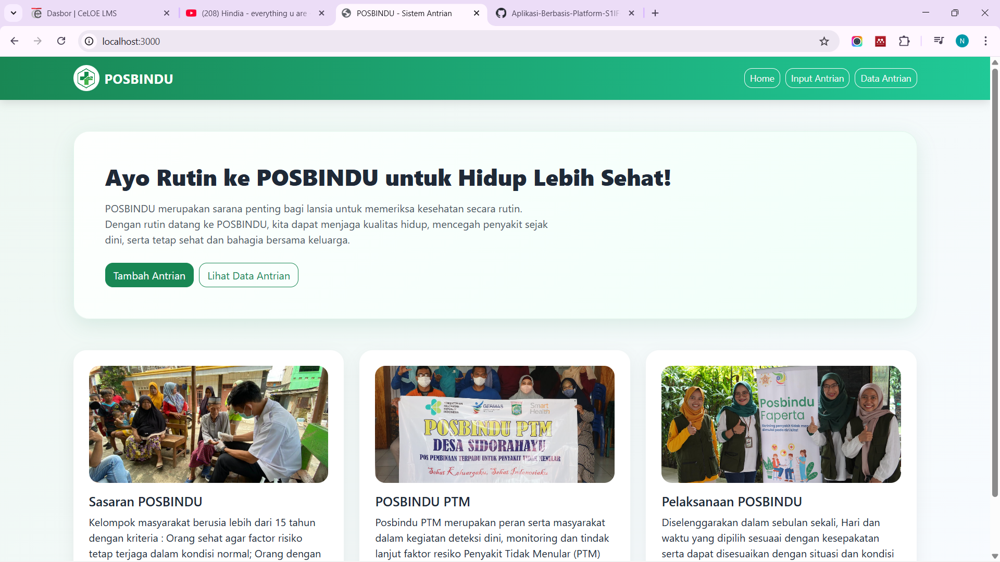
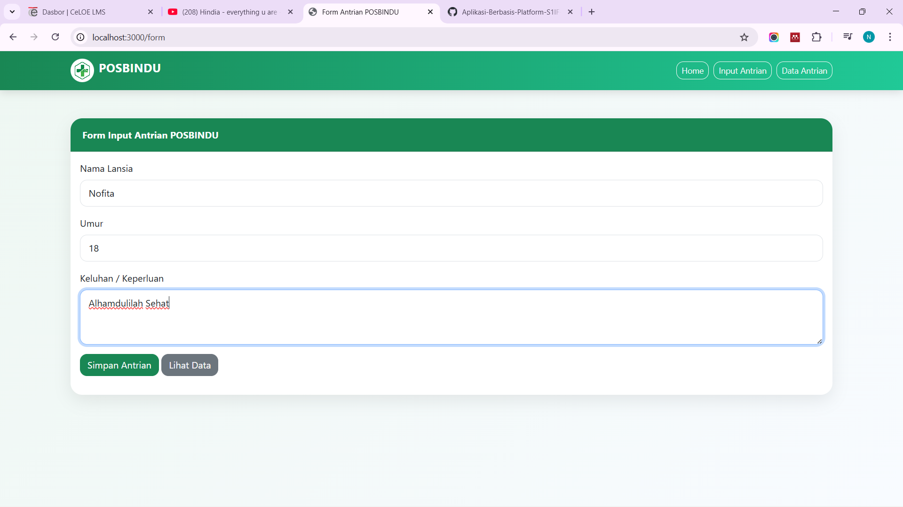
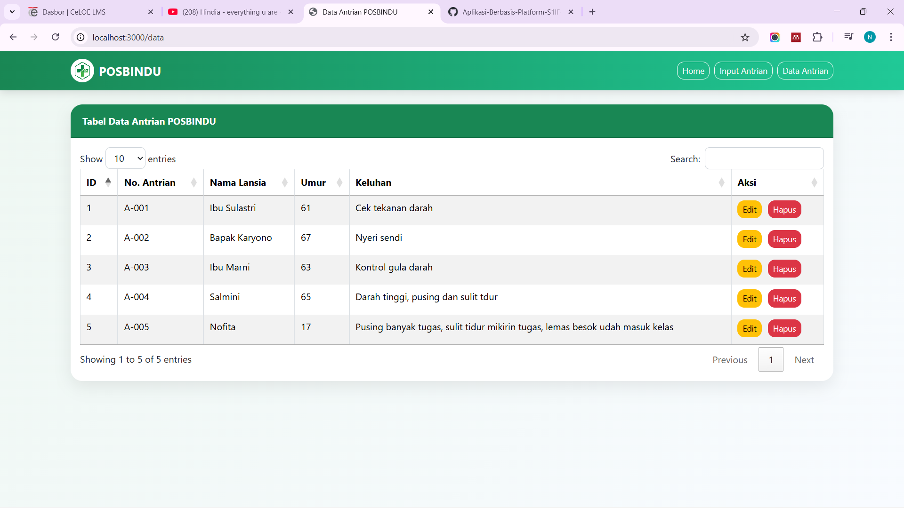

<h1 align="center">LAPORAN PRAKTIKUM</h1>
<h1 align="center">APLIKASI BERBASIS PLATFORM</h1>

<br>

<h2 align="center">TUGAS COTS 2</h2>
<h2 align="center">WEB SEDERHANA</h2>

<br><br>

<p align="center">

</p>
<br><br><br>

<h2 align="center">Disusun Oleh :</h2>

<p align="center" style="font-size:28px;">
  <b>Nofita Fitriyani</b><br>
  <b>2311102001</b><br>
  <b>S1 IF-11-REG 01</b>
</p>
<br>
<h2 align="center">Dosen Pengampu :</h2>

<p align="center" style="font-size:28px;">
  <b>Dimas Fanny Hebrasianto Permadi, S.ST., M.Kom</b>
</p>
<br>
<h2 align="center">Asisten Praktikum :</h2>

<p align="center" style="font-size:28px;">
  <b>Apri Pandu Wicaksono</b><br>
  <b>Rangga Pradarrell Fathi</b>
</p>
<br>
<h1 align="center">LABORATORIUM HIGH PERFORMANCE</h1>
<h1 align="center">FAKULTAS INFORMATIKA</h1>
<h1 align="center">UNIVERSITAS TELKOM PURWOKERTO</h1>
<h1 align="center">TAHUN 2026</h1>

<hr>

## 1. Dasar Teori
### Penggunaan Framework NodeJS (Express)
NodeJS merupakan runtime environment berbasis JavaScript yang memungkinkan eksekusi kode JavaScript di sisi server. Dengan NodeJS, developer dapat menggunakan satu bahasa (JavaScript) untuk front-end maupun back-end. Salah satu framework yang populer digunakan pada NodeJS adalah Express.js, yang menyediakan fitur routing, middleware, dan pengelolaan request-response secara sederhana dan efisien.

Express mempermudah pembuatan RESTful API yang digunakan untuk mengelola data pada aplikasi web. Dengan struktur yang ringan dan fleksibel, Express sangat cocok digunakan untuk aplikasi skala kecil hingga menengah seperti sistem CRUD. Selain itu, penggunaan NodeJS dan Express juga mendukung pengolahan data berbasis JSON yang menjadi standar komunikasi data dalam aplikasi web modern.

### CSS (Cascading Style Sheets)
CSS merupakan bahasa yang digunakan untuk mengatur tampilan atau desain dari elemen HTML pada halaman web. Dengan menggunakan CSS, pengembang dapat mengatur warna, ukuran teks, posisi elemen, jarak antar elemen, serta berbagai aspek visual lainnya.

CSS membantu memisahkan struktur halaman (HTML) dengan tampilan visual sehingga kode menjadi lebih rapi dan mudah dikelola.
Pada sistem ini, CSS digunakan untuk:
- Mengatur tampilan halaman agar lebih rapi
- Membuat watermark pada halaman
- Mengatur tampilan tabel dan elemen lainnya

### Bootstrap
Bootstrap merupakan framework CSS yang digunakan untuk mempercepat proses pembuatan tampilan website yang responsif dan modern. Bootstrap menyediakan berbagai komponen siap pakai seperti tombol, form, tabel, navbar, dan grid layout.

Dengan menggunakan Bootstrap, pengembang tidak perlu membuat desain dari awal karena Bootstrap sudah menyediakan berbagai class yang dapat langsung digunakan.
Pada sistem ini, Bootstrap digunakan untuk:
- Membuat tampilan form input produk
- Mendesain tabel data produk
- Mengatur layout halaman agar lebih rapi dan responsif

### JavaScript
JavaScript merupakan bahasa pemrograman yang digunakan untuk membuat halaman web menjadi interaktif. Dengan JavaScript, halaman web dapat merespon tindakan pengguna seperti klik tombol, mengisi form, atau memproses data secara dinamis.

JavaScript memungkinkan pengolahan data secara langsung di sisi client tanpa harus menggunakan server.
Pada sistem ini, JavaScript digunakan untuk:
- Mengambil data dari form input
- Menyimpan data produk ke dalam array object
- Menampilkan data produk ke dalam tabel
- Menghapus data produk
- Mengedit data produk

### jQuery & jQuery Plugin
jQuery merupakan library JavaScript yang dirancang untuk mempermudah manipulasi DOM, event handling, serta penggunaan AJAX. Dengan jQuery, penulisan kode JavaScript menjadi lebih singkat dan lebih mudah dipahami.

jQuery sering digunakan untuk:
- Manipulasi elemen HTML
- Mengambil data dari form
- Mengatur event seperti klik dan submit
- Mengubah isi halaman secara dinamis
Dalam sistem ini, jQuery digunakan untuk mempermudah manipulasi DOM serta menangani event pada form input.

Selain jQuery, penggunaan jQuery plugin seperti DataTables memberikan fitur tambahan yang lebih kompleks, seperti pencarian data, pagination, sorting, dan tampilan tabel yang interaktif. Plugin ini sangat membantu dalam meningkatkan pengalaman pengguna (user experience) tanpa harus membuat fitur tersebut secara manual. Dengan kombinasi jQuery dan plugin, pengembangan aplikasi menjadi lebih efisien dan powerful.

### CRUD (Create, Read, Update, Delete)
CRUD merupakan konsep dasar dalam pengolahan data pada sebuah sistem informasi. CRUD terdiri dari empat operasi utama yaitu:
- Create
Digunakan untuk menambahkan data baru ke dalam sistem.
- Read
Digunakan untuk menampilkan data yang tersimpan dalam sistem.
- Update
Digunakan untuk memperbarui data yang sudah ada.
- Delete
Digunakan untuk menghapus data dari sistem.

Pada sistem ini seluruh operasi CRUD dilakukan menggunakan JavaScript dengan penyimpanan data menggunakan array of object.

## 2. Stuktur Halaman
Website POSBINDU ini memiliki struktur halaman utama sebagai berikut:
### Halaman Home 
Halaman home merupakan halaman utama yang pertama kali ditampilkan ketika pengguna mengakses aplikasi. Halaman ini berfungsi sebagai pengenalan sistem antrian POSBINDU, yang berisi deskripsi singkat mengenai tujuan aplikasi serta teknologi yang digunakan dalam pengembangannya seperti NodeJS, Express, Bootstrap, jQuery, dan DataTables.

Selain itu, halaman home juga menyediakan navigasi utama berupa tombol atau menu untuk menuju halaman lain, yaitu halaman input data dan halaman tampil data. Halaman ini dirancang dengan tampilan yang menarik dan informatif, serta dilengkapi dengan gambar dokumentasi kegiatan untuk meningkatkan pengalaman pengguna.


### Halaman Form (Input Antrian) - Create
Digunakan untuk memasukkan data peserta antrian POSBINDU seperti nama, umur, dan keluhan. Data yang diinput akan dikirim ke server menggunakan AJAX dan disimpan dalam sistem.


### Halaman Data (Data Antrian) - Read, Update & Delete
Menampilkan data antrian dalam bentuk tabel interaktif menggunakan jQuery DataTables. Data diambil dari server dalam format JSON dan ditampilkan secara dinamis. Read untuk menampilkan data, Update untuk mengubah data yang sudah ada, dan Delete untuk menghapus data dari sistem.

Seluruh proses CRUD dilakukan secara asynchronous menggunakan AJAX tanpa perlu melakukan reload halaman. Hal ini membuat aplikasi lebih responsif dan meningkatkan pengalaman pengguna dalam mengelola data antrian.


## 3. Struktur Folder
``````
TUGAS2-COTS/
│
├── app.js
├── package.json
│
├── public/
│   ├── script.js
│   ├── style.css
│   └── images/
│       ├── logo-posbindu.png
│       ├── input-data.jpg
│       ├── tabel-interaktif.jpg
│       └── crud-lengkap.jpg
│
└── views/
    ├── home.ejs
    ├── form.ejs
    └── data.ejs
``````
### Penjelasan Struktur Folder

| File / Folder | Keterangan |
|--------------|-----------|
| `app.js` | File utama server NodeJS (Express) yang mengatur routing halaman dan API CRUD. |
| `package.json` | File konfigurasi project dan dependency yang digunakan. |
| `public/` | Folder untuk file static yang bisa diakses browser. |
| `public/script.js` | Berisi jQuery, AJAX, dan DataTables untuk interaksi data. |
| `public/style.css` | Styling tambahan untuk memperindah tampilan aplikasi. |
| `public/images/` | Menyimpan aset gambar seperti logo dan dokumentasi kegiatan. |
| `views/` | Folder template EJS untuk tampilan halaman. |
| `views/home.ejs` | Halaman utama (beranda) aplikasi. |
| `views/form.ejs` | Halaman input data antrian. |
| `views/data.ejs` | Halaman tabel data antrian + fitur CRUD. |

## 4. Kode Program
### Penggunaan Boostrap
Boostrap digunakan pada file :
`views/home.ejs`
`views/form.ejs`
`views/data.ejs`
```
<link
  href="https://cdn.jsdelivr.net/npm/bootstrap@5.3.3/dist/css/bootstrap.min.css"
  rel="stylesheet"
/>
```

Class-class Boostrap yang digunakan untuk styling POSBINDU antara lain
```
class="navbar navbar-expand-lg navbar-dark"
class="container"
class="btn btn-outline-light btn-sm"
class="card"
class="card-header bg-success text-white"
class="form-control"
class="table table-bordered table-striped"
class="modal fade"
```

### NodeJS
Kode program terdapat pada file `app.js`
```
const express = require('express');
const bodyParser = require('body-parser');

const app = express();
```

Lalu di `package.json` juga terlihat dependency NodeJS yang dipakai yaitu 
```
"dependencies": {
  "body-parser": "^1.20.2",
  "ejs": "^3.1.10",
  "express": "^4.21.2"
}
```
### Input Data
Route di `app.js`
```
app.get('/form', (req, res) => {
  res.render('form');
});
```
Form inputnya seperti ini :
```
<form id="formAntrian">
  <input type="text" class="form-control" id="nama" name="nama" required />
  <input type="number" class="form-control" id="umur" name="umur" required />
  <textarea class="form-control" id="keluhan" name="keluhan" rows="3" required></textarea>
</form>
```
### Tampil Data
Route di `app.js`
```
app.get('/data', (req, res) => {
  res.render('data');
});
```
Bagian tabelnya :
```
<table id="tabelAntrian" class="table table-bordered table-striped" style="width: 100%;">
  <thead>
    <tr>
      <th>ID</th>
      <th>No. Antrian</th>
      <th>Nama Lansia</th>
      <th>Umur</th>
      <th>Keluhan</th>
      <th>Aksi</th>
    </tr>
  </thead>
</table>
```
### Create, Read, update, Delete
CREATE
Di `app.js`
```
app.post('/api/antrian', (req, res) => {
```
Di `public/script.js` form dikrim dengan AJAX :
````
$.ajax({
  url: '/api/antrian',
  method: 'POST',
  contentType: 'application/json',
  data: JSON.stringify(data),
````

READ
Di `app.js`
```
app.get('/api/antrian', (req, res) => {
  res.json(dataAntrian);
});
```
Dan untuk detail satu data :
```
app.get('/api/antrian/:id', (req, res) => {
```

UPDATE
Di `app.js`
```
app.put('/api/antrian/:id', (req, res) => {
```
Di `public/script.js`
```
$.ajax({
  url: `/api/antrian/${id}`,
  method: 'PUT',
```

DELETE
Di `app.js`
```
app.delete('/api/antrian/:id', (req, res) => {
```
Di `public/script.js`
```
$.ajax({
  url: `/api/antrian/${id}`,
  method: 'DELETE',
```

### jQuery dan jQuery plugin
jQuery dipakai di `views/form.ejs` `views/data.ejs` : `<script src="https://code.jquery.com/jquery-3.7.1.min.js"></script>`

Dan di `public/script.js` juga pakai sintaks jQuery, misalnya:
`$(document).ready(function () {`
`$('#formAntrian').on('submit', function (e) {`
`$('#tabelAntrian').on('click', '.btn-edit', function () {`

jQuery Plugin yang dipakai adalah DataTables di `views/data.ejs`:
````
<link
  href="https://cdn.datatables.net/1.13.8/css/jquery.dataTables.min.css"
  rel="stylesheet"
/>
````
````
<script src="https://cdn.datatables.net/1.13.8/js/jquery.dataTables.min.js"></script>
````
Di `public/script.js` :
`tabelAntrian = $('#tabelAntrian').DataTable({`

### Data format JSON
Di `app.js' :
```
app.get('/api/antrian', (req, res) => {
  res.json(dataAntrian);
});
```
Di `public/script.js`:
```
tabelAntrian = $('#tabelAntrian').DataTable({
  ajax: {
    url: '/api/antrian',
    dataSrc: ''
  },
```
Ini menunjukkan bahwa tabel mengambil data dari endpoint JSON `/api/antrian` lalu menampilkannya dengan jQuery DataTable.

## 5. Kesimpulan
Berdasarkan hasil perancangan dan implementasi aplikasi antrian POSBINDU berbasis web, dapat disimpulkan bahwa aplikasi ini berhasil dibangun menggunakan teknologi NodeJS dengan framework Express sebagai backend, serta Bootstrap, jQuery, dan DataTables sebagai pendukung pada sisi frontend. Aplikasi ini mampu memenuhi spesifikasi yang telah ditentukan, yaitu memiliki halaman form untuk input data, halaman tabel untuk menampilkan data, serta fungsionalitas CRUD (Create, Read, Update, Delete) yang berjalan dengan baik.

Selain itu, penggunaan format data JSON dan implementasi DataTables memungkinkan data ditampilkan secara dinamis dan interaktif tanpa perlu melakukan reload halaman. Hal ini memberikan kemudahan bagi pengguna dalam mengelola data antrian, seperti melakukan pencarian, pengurutan, dan navigasi data. Dengan demikian, aplikasi ini dapat membantu proses pencatatan antrian POSBINDU menjadi lebih efektif, efisien, dan terstruktur secara digital.

Secara keseluruhan, aplikasi yang dibangun telah memenuhi kebutuhan dasar sistem informasi sederhana berbasis web dan dapat dikembangkan lebih lanjut dengan penambahan fitur seperti autentikasi pengguna, penyimpanan database permanen, serta integrasi dengan sistem lain untuk meningkatkan fungsionalitas dan skalabilitas aplikasi.

## 6. Link Video Presentasi
https://drive.google.com/drive/folders/1SWRuvDdPnvnpFNdPcKRlJtRLSAa_d-HI?usp=sharing