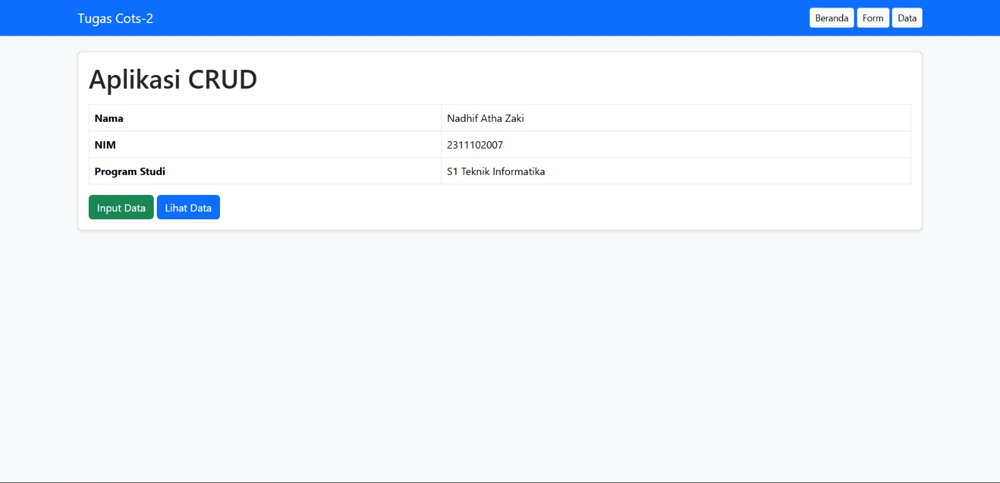
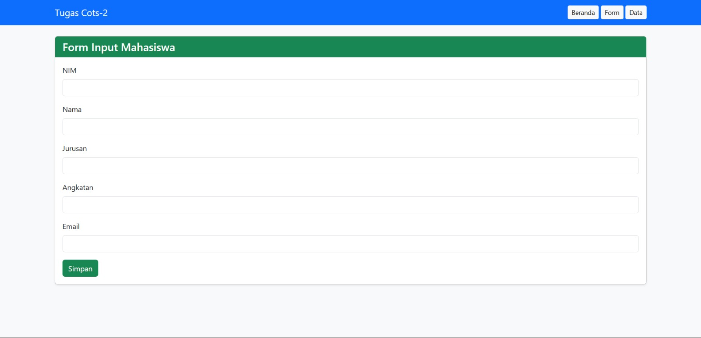
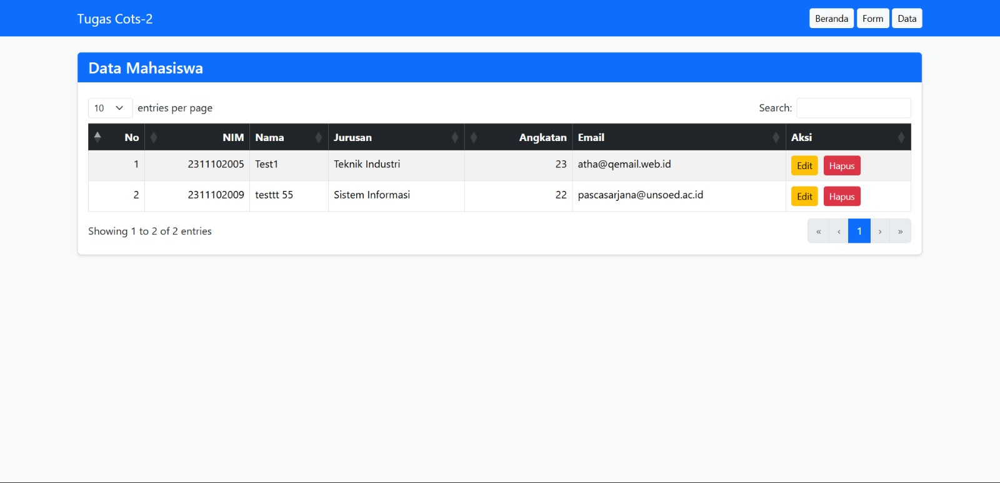
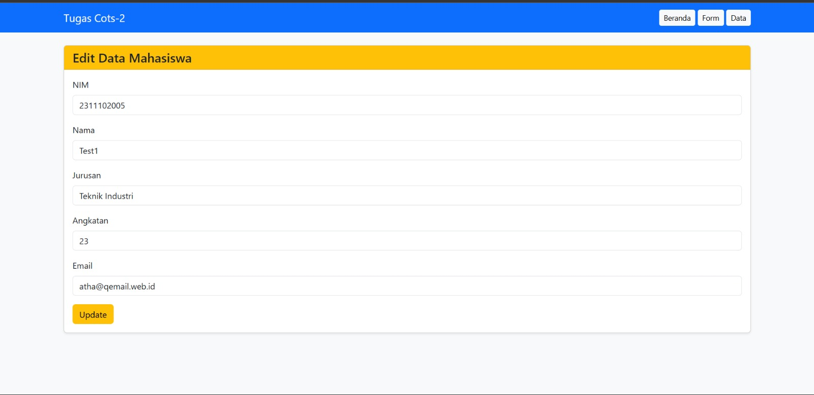
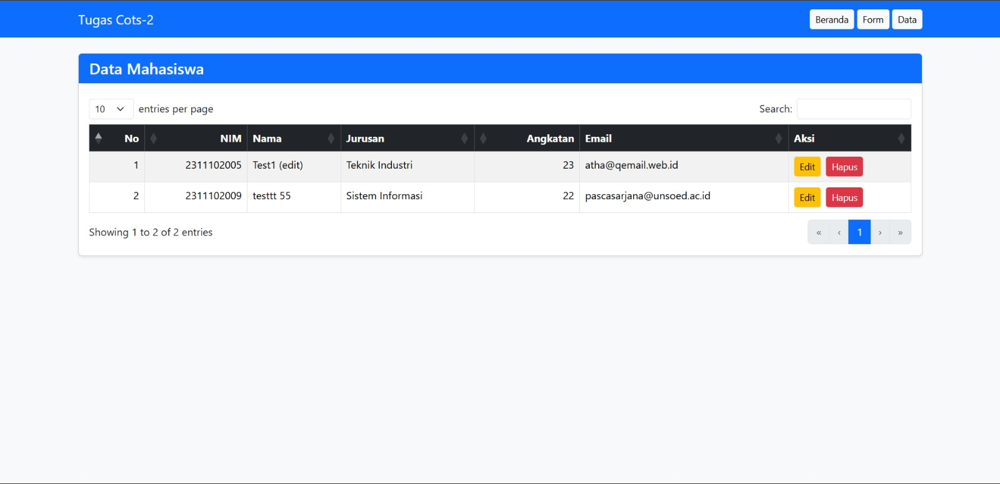
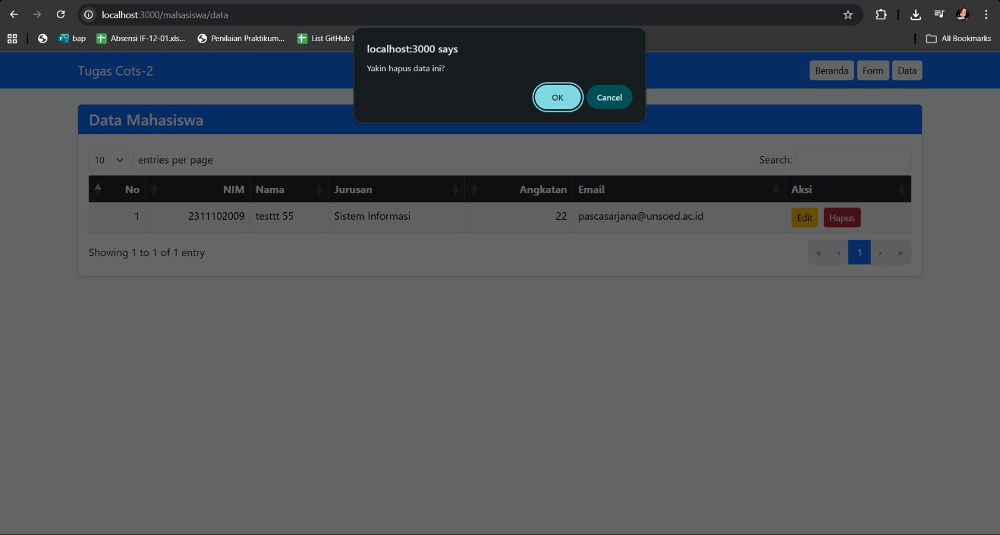

<div align="center">
  <br />
  <h1>LAPORAN PRAKTIKUM <br>APLIKASI BERBASIS PLATFORM</h1>
  <br />
  <h3>COTS-2 <br></h3>
  <br />
  <br />
  
  <br />
  <br />
  <h3>Disusun Oleh :</h3>
  <p>
    <strong>Nadhif Atha Zaki</strong><br>
    <strong>2311102007</strong><br>
    <strong>S1 IF-11-01</strong>
  </p>
  <br />
  <br />
  <h3>Dosen Pengampu :</h3>
  <p>
    <strong>Dimas Fanny Hebrasianto Permadi, S.ST., M.Kom</strong>
  </p>
  <br />
  <br />
  <h4>Asisten Praktikum :</h4>
  <strong>Apri Pandu Wicaksono</strong> <br>
  <strong>Rangga Pradarrell Fathi</strong>
  <br />
  <h3>LABORATORIUM HIGH PERFORMANCE
 <br>FAKULTAS INFORMATIKA <br>UNIVERSITAS TELKOM PURWOKERTO <br>2026</h3>
</div>

---

## 1. Dasar Teori

**CRUD (Create, Read, Update, Delete)** merupakan empat operasi utama yang digunakan untuk mengelola data dalam sebuah aplikasi. Pada pengembangan aplikasi web, konsep CRUD digunakan agar pengguna dapat menambahkan data, menampilkan data, memperbarui data, serta menghapus data secara dinamis. Dalam aplikasi berbasis web modern, proses CRUD umumnya dilakukan melalui komunikasi antara sisi klien (*client-side*) dan sisi server (*server-side*) sehingga data dapat disimpan dan dikelola secara lebih terstruktur.

**Bootstrap** adalah framework CSS bersifat open-source yang menyediakan berbagai komponen antarmuka siap pakai, seperti form, tombol, modal, navbar, card, serta sistem grid yang responsif. Dengan adanya kumpulan kelas utilitas yang sudah terstandarisasi, Bootstrap membantu mempercepat proses pembuatan desain antarmuka pada aplikasi web.

**jQuery** adalah library JavaScript yang digunakan untuk mempermudah manipulasi DOM, event handling, animasi, dan AJAX. Dengan sintaks yang lebih sederhana dibandingkan JavaScript murni, jQuery memudahkan pengembang dalam membuat interaksi pada halaman web.

**jQuery DataTables** merupakan plugin berbasis jQuery yang berfungsi untuk meningkatkan fitur pada elemen `<table>` HTML. Dengan menggunakan plugin ini, tabel dapat memiliki fitur tambahan seperti pencarian data (*search*), pengurutan data berdasarkan kolom (*sorting*), serta pembagian halaman (*pagination*) secara otomatis. DataTables juga mendukung pengambilan data dalam format **JSON** melalui AJAX.

**JSON (JavaScript Object Notation)** adalah format pertukaran data yang ringan, mudah dibaca manusia, dan mudah diproses oleh mesin. JSON sering digunakan dalam pengembangan aplikasi web untuk pertukaran data antara client dan server.

**Node.js** adalah runtime JavaScript yang memungkinkan JavaScript dijalankan di luar browser. Dengan Node.js, pengembang dapat membangun aplikasi backend, menangani request HTTP, membaca file, dan menjalankan server menggunakan JavaScript.

**Express JS** adalah framework backend berbasis Node.js yang digunakan untuk membangun aplikasi web dan API secara cepat dan terstruktur. Express menyediakan fitur routing, middleware, pengelolaan request dan response, serta dukungan integrasi dengan template engine. Dalam aplikasi ini, Express digunakan untuk menangani proses CRUD, merender halaman EJS, serta menyediakan endpoint data JSON yang digunakan oleh DataTables.

**EJS (Embedded JavaScript Templates)** adalah template engine yang digunakan untuk membuat halaman HTML dinamis. Dengan EJS, data dari server dapat ditampilkan langsung ke halaman menggunakan sintaks seperti `<%= %>` dan `<%- %>`.

**Method Override** adalah teknik yang digunakan untuk memungkinkan form HTML menjalankan method selain GET dan POST, seperti PUT dan DELETE. Hal ini diperlukan karena form HTML standar tidak mendukung method PUT dan DELETE secara langsung.

---

## 2. Deskripsi Aplikasi

Pada tugas COTS 2 ini, aplikasi yang dibuat adalah **Sistem Data Mahasiswa** berbasis web menggunakan **Express JS**, **Bootstrap**, **jQuery**, dan **DataTables**. Aplikasi ini dirancang untuk memenuhi ketentuan tugas praktikum, yaitu memiliki minimal tiga halaman utama, memanfaatkan data JSON untuk tabel, serta menyediakan fitur CRUD lengkap.

Fitur utama dari aplikasi ini adalah:

- Halaman beranda
- Halaman form input data mahasiswa
- Halaman tabel data mahasiswa
- Halaman edit data mahasiswa
- Fitur Create, Read, Update, Delete
- Tabel interaktif menggunakan jQuery DataTables
- Data ditampilkan dari endpoint JSON

Data mahasiswa disimpan pada file JSON lokal sebagai media penyimpanan sederhana, sehingga aplikasi ini tetap dapat berjalan tanpa database seperti MySQL atau MongoDB.

---

## 3. Struktur Folder Project

```bash
tugas2-praktikum-express/
├── app.js
├── package.json
├── package-lock.json
├── node_modules/
├── data/
│   └── mahasiswa.json
├── public/
│   └── js/
│       └── app.js
└── views/
    ├── partials/
    │   ├── header.ejs
    │   └── footer.ejs
    ├── index.ejs
    ├── form.ejs
    ├── data.ejs
    └── edit.ejs
```

### Penjelasan Struktur Folder

| File / Folder | Keterangan |
|---|---|
| `app.js` | File utama server Express JS yang menangani konfigurasi server, route halaman, dan route CRUD. |
| `package.json` | File konfigurasi project dan dependency yang digunakan. |
| `data/mahasiswa.json` | File penyimpanan data mahasiswa dalam format JSON. |
| `public/js/app.js` | File JavaScript frontend yang berisi jQuery dan konfigurasi DataTables. |
| `views/` | Folder untuk menyimpan file tampilan menggunakan EJS. |
| `views/partials/` | Folder untuk komponen tampilan yang digunakan berulang, seperti header dan footer. |

---

## 4. Cara Menjalankan Aplikasi

**1. Buka folder project di VS Code**

Pastikan Node.js sudah terinstall pada laptop.

**2. Inisialisasi project Node.js**

```bash
npm init -y
```

**3. Install dependency yang dibutuhkan**

```bash
npm install express ejs method-override
```

**4. Jalankan server**

```bash
npm start
```

Atau jika belum ada script `start` di `package.json`, jalankan:

```bash
node app.js
```

**5. Buka browser dan akses alamat berikut**

```
http://localhost:3000
```

---

## 5. Kode Program

### A. `package.json`

```json
{
  "name": "tugas2-praktikum-express",
  "version": "1.0.0",
  "description": "Tugas 2 Praktikum - CRUD Express JS dengan Bootstrap, jQuery, dan DataTables",
  "main": "app.js",
  "scripts": {
    "start": "node app.js"
  },
  "keywords": [],
  "author": "Nadhif Atha Zaki - 2311102007",
  "license": "ISC",
  "dependencies": {
    "ejs": "^3.1.10",
    "express": "^5.1.0",
    "method-override": "^3.0.0"
  }
}
```

**Penjelasan `package.json`**

File `package.json` berfungsi sebagai file konfigurasi utama project Node.js. Pada file ini terdapat nama project, versi project, deskripsi, file utama, script yang bisa dijalankan, serta daftar dependency yang dibutuhkan oleh aplikasi. Pada aplikasi ini, dependency yang digunakan adalah `express` untuk backend, `ejs` untuk template engine, dan `method-override` untuk mendukung method PUT serta DELETE pada form HTML. Script `"start": "node app.js"` digunakan agar server dapat dijalankan menggunakan perintah `npm start`.

---

### B. Backend `app.js`

```javascript
const express = require("express");
const path = require("path");
const fs = require("fs");
const methodOverride = require("method-override");

const app = express();
const PORT = 3000;
const DATA_FILE = path.join(__dirname, "data", "mahasiswa.json");

// Middleware
app.use(express.urlencoded({ extended: true }));
app.use(express.json());
app.use(methodOverride("_method"));
app.use(express.static(path.join(__dirname, "public")));

// EJS
app.set("view engine", "ejs");
app.set("views", path.join(__dirname, "views"));

// Fungsi baca data JSON
function readData() {
  try {
    const data = fs.readFileSync(DATA_FILE, "utf-8");
    return JSON.parse(data);
  } catch (error) {
    return [];
  }
}

// Fungsi simpan data JSON
function writeData(data) {
  fs.writeFileSync(DATA_FILE, JSON.stringify(data, null, 2), "utf-8");
}

// Fungsi buat ID unik sederhana
function generateId() {
  return Date.now().toString();
}

// ROUTE HALAMAN
app.get("/", (req, res) => {
  res.render("index", { title: "Beranda" });
});

app.get("/mahasiswa/form", (req, res) => {
  res.render("form", { title: "Form Input Mahasiswa" });
});

app.get("/mahasiswa/data", (req, res) => {
  res.render("data", { title: "Data Mahasiswa" });
});

app.get("/mahasiswa/edit/:id", (req, res) => {
  const mahasiswa = readData();
  const data = mahasiswa.find((item) => item.id === req.params.id);

  if (!data) {
    return res.status(404).send("Data tidak ditemukan");
  }

  res.render("edit", {
    title: "Edit Data Mahasiswa",
    mahasiswa: data
  });
});

// ROUTE API / CRUD
app.get("/api/mahasiswa", (req, res) => {
  const mahasiswa = readData();
  res.json({ data: mahasiswa });
});

app.post("/mahasiswa", (req, res) => {
  const mahasiswa = readData();

  const dataBaru = {
    id: generateId(),
    nim: req.body.nim,
    nama: req.body.nama,
    jurusan: req.body.jurusan,
    angkatan: req.body.angkatan,
    email: req.body.email
  };

  mahasiswa.push(dataBaru);
  writeData(mahasiswa);

  res.redirect("/mahasiswa/data");
});

app.put("/mahasiswa/:id", (req, res) => {
  const mahasiswa = readData();
  const index = mahasiswa.findIndex((item) => item.id === req.params.id);

  if (index === -1) {
    return res.status(404).send("Data tidak ditemukan");
  }

  mahasiswa[index] = {
    ...mahasiswa[index],
    nim: req.body.nim,
    nama: req.body.nama,
    jurusan: req.body.jurusan,
    angkatan: req.body.angkatan,
    email: req.body.email
  };

  writeData(mahasiswa);
  res.redirect("/mahasiswa/data");
});

app.delete("/mahasiswa/:id", (req, res) => {
  const mahasiswa = readData();
  const hasilFilter = mahasiswa.filter((item) => item.id !== req.params.id);

  writeData(hasilFilter);
  res.redirect("/mahasiswa/data");
});

app.listen(PORT, () => {
  console.log(`Server berjalan di http://localhost:${PORT}`);
});
```

**Penjelasan `app.js`**

File `app.js` merupakan inti dari aplikasi karena di dalamnya terdapat konfigurasi server Express, middleware, fungsi pengelolaan data JSON, route halaman, dan route CRUD.

Pada bagian awal, dilakukan import library `express`, `path`, `fs`, dan `method-override`. Library `express` digunakan untuk membuat server. Library `path` membantu mengatur path folder dan file. Library `fs` digunakan untuk membaca dan menulis file JSON, sedangkan `method-override` digunakan agar form HTML dapat mendukung method PUT dan DELETE.

- `express.urlencoded({ extended: true })` — membaca data dari form HTML.
- `express.json()` — membaca request dalam format JSON.
- `methodOverride("_method")` — mengganti method request menjadi PUT atau DELETE melalui query parameter.
- `express.static()` — mengizinkan akses file statis dari folder `public`.

EJS diaktifkan sebagai template engine menggunakan `app.set("view engine", "ejs")`, yang memungkinkan server merender halaman HTML dinamis dari folder `views`.

Fungsi `readData()` membaca isi file `mahasiswa.json` dan mengembalikan array kosong jika terjadi error. Fungsi `writeData()` menyimpan data ke file JSON. Fungsi `generateId()` membuat ID unik berbasis timestamp.

Route halaman yang tersedia:

- `GET /` — halaman beranda.
- `GET /mahasiswa/form` — halaman form input.
- `GET /mahasiswa/data` — halaman tabel data mahasiswa.
- `GET /mahasiswa/edit/:id` — halaman edit sesuai ID.

Route CRUD yang tersedia:

- `GET /api/mahasiswa` — mengembalikan seluruh data mahasiswa dalam format JSON (digunakan DataTables).
- `POST /mahasiswa` — menambah data baru ke file JSON.
- `PUT /mahasiswa/:id` — mengupdate data berdasarkan ID.
- `DELETE /mahasiswa/:id` — menghapus data berdasarkan ID.

---

### C. File Data `data/mahasiswa.json`

Kondisi awal (kosong):

```json
[]
```

Contoh isi setelah data ditambahkan:

```json
[
  {
    "id": "1743321000000",
    "nim": "2311102007",
    "nama": "Nadhif Atha Zaki",
    "jurusan": "Informatika",
    "angkatan": "2023",
    "email": "nadhif@example.com"
  }
]
```

**Penjelasan `mahasiswa.json`**

File `mahasiswa.json` digunakan sebagai media penyimpanan data sederhana. Pada awalnya file ini berisi array kosong. Setelah pengguna menambahkan data melalui form, data mahasiswa akan disimpan sebagai objek JSON di dalam array tersebut. Setiap objek memiliki atribut `id`, `nim`, `nama`, `jurusan`, `angkatan`, dan `email`. File ini berperan seperti database sederhana dalam aplikasi.

---

### D. Header `views/partials/header.ejs`

```html
<!DOCTYPE html>
<html lang="en">
<head>
  <meta charset="UTF-8">
  <meta name="viewport" content="width=device-width, initial-scale=1.0">
  <title><%= title %></title>

  <!-- Bootstrap CSS -->
  <link href="https://cdn.jsdelivr.net/npm/bootstrap@5.3.8/dist/css/bootstrap.min.css" rel="stylesheet">

  <!-- DataTables Bootstrap CSS -->
  <link rel="stylesheet" href="https://cdn.datatables.net/2.3.4/css/dataTables.bootstrap5.css">
</head>
<body class="bg-light">

<nav class="navbar navbar-expand-lg navbar-dark bg-primary mb-4">
  <div class="container">
    <a class="navbar-brand" href="/">Tugas 2 Praktikum</a>
    <div>
      <a href="/" class="btn btn-light btn-sm">Beranda</a>
      <a href="/mahasiswa/form" class="btn btn-light btn-sm">Form</a>
      <a href="/mahasiswa/data" class="btn btn-light btn-sm">Data</a>
    </div>
  </div>
</nav>

<div class="container">
```

**Penjelasan `header.ejs`**

File `header.ejs` merupakan partial yang digunakan untuk bagian atas setiap halaman. File ini berisi deklarasi HTML, bagian `<head>`, pemanggilan CSS Bootstrap dan DataTables, serta navbar navigasi antar halaman. Penggunaan partial membuat kode lebih rapi karena header tidak perlu ditulis ulang di setiap file halaman. Tag `<%= title %>` digunakan agar judul halaman dapat berubah secara dinamis sesuai route yang dibuka.

---

### E. Footer `views/partials/footer.ejs`

```html
</div>

<!-- jQuery -->
<script src="https://code.jquery.com/jquery-3.7.1.min.js"></script>

<!-- Bootstrap JS -->
<script src="https://cdn.jsdelivr.net/npm/bootstrap@5.3.8/dist/js/bootstrap.bundle.min.js"></script>

<!-- DataTables JS -->
<script src="https://cdn.datatables.net/2.3.4/js/dataTables.js"></script>
<script src="https://cdn.datatables.net/2.3.4/js/dataTables.bootstrap5.js"></script>

<!-- JS Custom -->
<script src="/js/app.js"></script>
</body>
</html>
```

**Penjelasan `footer.ejs`**

File `footer.ejs` merupakan partial untuk bagian bawah setiap halaman. File ini menutup elemen HTML yang telah dibuka pada `header.ejs`, lalu memuat semua file JavaScript yang dibutuhkan: jQuery, Bootstrap JS, DataTables JS, dan file JavaScript custom. Penempatan script di bagian footer bertujuan agar HTML dimuat lebih dulu sebelum JavaScript dijalankan, sehingga performa halaman lebih baik dan elemen HTML sudah tersedia saat script dieksekusi.

---

### F. Halaman Beranda `views/index.ejs`

```html
<%- include("partials/header") %>

<div class="card shadow-sm">
  <div class="card-body">
    <h1 class="mb-3">Aplikasi CRUD Mahasiswa</h1>
    <p class="lead">
      Dibuat menggunakan Express JS, Bootstrap, jQuery, dan DataTables.
    </p>

    <table class="table table-bordered">
      <tr>
        <th>Nama</th>
        <td>Nadhif Atha Zaki</td>
      </tr>
      <tr>
        <th>NIM</th>
        <td>2311102007</td>
      </tr>
      <tr>
        <th>Tema</th>
        <td>Sistem Data Mahasiswa</td>
      </tr>
    </table>

    <a href="/mahasiswa/form" class="btn btn-success">Input Data</a>
    <a href="/mahasiswa/data" class="btn btn-primary">Lihat Data</a>
  </div>
</div>

<%- include("partials/footer") %>
```

**Penjelasan `index.ejs`**

File `index.ejs` merupakan halaman utama atau landing page aplikasi. Halaman ini menampilkan judul aplikasi, teknologi yang digunakan, identitas mahasiswa, dan tombol navigasi menuju halaman form input serta halaman data. Tujuan halaman ini adalah sebagai halaman pembuka agar pengguna dapat memahami aplikasi sebelum masuk ke fitur utama.

---

### G. Halaman Form Input `views/form.ejs`

```html
<%- include("partials/header") %>

<div class="card shadow-sm">
  <div class="card-header bg-success text-white">
    <h4 class="mb-0">Form Input Mahasiswa</h4>
  </div>
  <div class="card-body">
    <form action="/mahasiswa" method="POST" id="formMahasiswa">

      <div class="mb-3">
        <label class="form-label">NIM</label>
        <input type="text" name="nim" class="form-control" required>
      </div>

      <div class="mb-3">
        <label class="form-label">Nama</label>
        <input type="text" name="nama" class="form-control" required>
      </div>

      <div class="mb-3">
        <label class="form-label">Jurusan</label>
        <input type="text" name="jurusan" class="form-control" required>
      </div>

      <div class="mb-3">
        <label class="form-label">Angkatan</label>
        <input type="number" name="angkatan" class="form-control" required>
      </div>

      <div class="mb-3">
        <label class="form-label">Email</label>
        <input type="email" name="email" class="form-control" required>
      </div>

      <button type="submit" class="btn btn-success">Simpan</button>
    </form>
  </div>
</div>

<%- include("partials/footer") %>
```

**Penjelasan `form.ejs`**

File `form.ejs` menampilkan halaman form input mahasiswa dengan field NIM, Nama, Jurusan, Angkatan, dan Email. Semua field menggunakan atribut `required` agar wajib diisi. Ketika tombol simpan ditekan, data dikirim ke server melalui method `POST` menuju route `/mahasiswa`. Halaman ini digunakan untuk proses **Create**, yaitu menambahkan data mahasiswa baru.

---

### H. Halaman Data `views/data.ejs`

```html
<%- include("partials/header") %>

<div class="card shadow-sm">
  <div class="card-header bg-primary text-white">
    <h4 class="mb-0">Data Mahasiswa</h4>
  </div>
  <div class="card-body">
    <table id="tabelMahasiswa" class="table table-striped table-bordered">
      <thead class="table-dark">
        <tr>
          <th>No</th>
          <th>NIM</th>
          <th>Nama</th>
          <th>Jurusan</th>
          <th>Angkatan</th>
          <th>Email</th>
          <th>Aksi</th>
        </tr>
      </thead>
      <tbody></tbody>
    </table>
  </div>
</div>

<%- include("partials/footer") %>
```

**Penjelasan `data.ejs`**

File `data.ejs` menampilkan data mahasiswa dalam bentuk tabel. Di dalam file ini hanya dibuat struktur tabel HTML, sedangkan isi data diambil secara dinamis dari endpoint JSON menggunakan AJAX. Tabel memiliki kolom nomor, NIM, nama, jurusan, angkatan, email, dan aksi. Setelah diproses menggunakan jQuery DataTables, tabel akan memiliki fitur pencarian, sorting, dan pagination. Halaman ini digunakan untuk proses **Read**, yaitu menampilkan data mahasiswa.

---

### I. Halaman Edit `views/edit.ejs`

```html
<%- include("partials/header") %>

<div class="card shadow-sm">
  <div class="card-header bg-warning">
    <h4 class="mb-0">Edit Data Mahasiswa</h4>
  </div>
  <div class="card-body">
    <form action="/mahasiswa/<%= mahasiswa.id %>?_method=PUT" method="POST" id="formEditMahasiswa">

      <div class="mb-3">
        <label class="form-label">NIM</label>
        <input type="text" name="nim" class="form-control" value="<%= mahasiswa.nim %>" required>
      </div>

      <div class="mb-3">
        <label class="form-label">Nama</label>
        <input type="text" name="nama" class="form-control" value="<%= mahasiswa.nama %>" required>
      </div>

      <div class="mb-3">
        <label class="form-label">Jurusan</label>
        <input type="text" name="jurusan" class="form-control" value="<%= mahasiswa.jurusan %>" required>
      </div>

      <div class="mb-3">
        <label class="form-label">Angkatan</label>
        <input type="number" name="angkatan" class="form-control" value="<%= mahasiswa.angkatan %>" required>
      </div>

      <div class="mb-3">
        <label class="form-label">Email</label>
        <input type="email" name="email" class="form-control" value="<%= mahasiswa.email %>" required>
      </div>

      <button type="submit" class="btn btn-warning">Update</button>
    </form>
  </div>
</div>

<%- include("partials/footer") %>
```

**Penjelasan `edit.ejs`**

File `edit.ejs` menampilkan halaman edit data mahasiswa. Form pada halaman ini serupa dengan form input, tetapi nilainya sudah terisi berdasarkan data mahasiswa yang dipilih, menggunakan sintaks EJS seperti `<%= mahasiswa.nama %>`. Form dikirim menggunakan method `POST` dengan tambahan `?_method=PUT` agar diproses oleh server sebagai update data. Halaman ini digunakan untuk proses **Update**.

---

### J. JavaScript Frontend `public/js/app.js`

```javascript
$(document).ready(function () {

  // Inisialisasi DataTables jika tabel ditemukan
  if ($("#tabelMahasiswa").length) {
    $("#tabelMahasiswa").DataTable({
      ajax: "/api/mahasiswa",
      columns: [
        {
          data: null,
          render: function (data, type, row, meta) {
            return meta.row + 1;
          }
        },
        { data: "nim" },
        { data: "nama" },
        { data: "jurusan" },
        { data: "angkatan" },
        { data: "email" },
        {
          data: "id",
          render: function (data) {
            return `
              <a href="/mahasiswa/edit/${data}" class="btn btn-warning btn-sm me-1">Edit</a>
              <form action="/mahasiswa/${data}?_method=DELETE" method="POST" style="display:inline;"
                onsubmit="return confirm('Yakin hapus data ini?')">
                <button type="submit" class="btn btn-danger btn-sm">Hapus</button>
              </form>
            `;
          }
        }
      ]
    });
  }

  // Validasi form tambah
  $("#formMahasiswa").on("submit", function () {
    const nim = $("input[name='nim']").val().trim();
    const nama = $("input[name='nama']").val().trim();

    if (nim === "" || nama === "") {
      alert("NIM dan Nama wajib diisi");
      return false;
    }
  });

  // Validasi form edit
  $("#formEditMahasiswa").on("submit", function () {
    const nim = $("input[name='nim']").val().trim();
    const nama = $("input[name='nama']").val().trim();

    if (nim === "" || nama === "") {
      alert("NIM dan Nama wajib diisi");
      return false;
    }
  });

});
```

**Penjelasan `public/js/app.js`**

File `public/js/app.js` berisi logika frontend menggunakan jQuery. Fungsi `$(document).ready()` memastikan script hanya dijalankan setelah seluruh elemen HTML selesai dimuat.

Jika tabel dengan ID `#tabelMahasiswa` ditemukan, plugin DataTables akan diinisialisasi dan mengambil data dari endpoint `/api/mahasiswa` dalam format JSON. Konfigurasi `columns` menentukan data yang tampil pada setiap kolom tabel. Kolom pertama menampilkan nomor urut otomatis, sedangkan kolom terakhir berisi tombol **Edit** dan **Hapus** yang dibuat secara dinamis menggunakan template string.

Selain itu, file ini juga berisi validasi sederhana untuk memastikan field NIM dan Nama tidak kosong sebelum form tambah maupun form edit dikirimkan ke server.

---

## 6. Alur CRUD Aplikasi

### 1. Create
Pengguna membuka halaman form input, mengisi data mahasiswa, lalu menekan tombol **Simpan**. Data dikirim ke server melalui method `POST` dan disimpan ke file `mahasiswa.json`.

### 2. Read
Pengguna membuka halaman data mahasiswa. Tabel mengambil data JSON dari endpoint `/api/mahasiswa` dan menampilkannya melalui jQuery DataTables dengan fitur pencarian, sorting, dan pagination.

### 3. Update
Pengguna menekan tombol **Edit** pada tabel. Sistem menampilkan halaman edit berisi data lama yang sudah terisi. Setelah diperbarui, data dikirim ke server dengan method `PUT`.

### 4. Delete
Pengguna menekan tombol **Hapus** pada tabel. Setelah konfirmasi, data dikirim ke server menggunakan method `DELETE` dan dihapus dari file JSON.

---

## 7. Screenshot Website

1. Tampilan Awal Halaman

2. Halaman Form Input Mahasiswa

3. Halaman Data Mahasiswa

4. Halaman Edit Data Mahasiswa

5. Hasil Update Data

6. Proses Hapus Data

---

## 8. Kesimpulan

Pada tugas COTS 2 ini telah berhasil dibuat aplikasi web sederhana bertema **Sistem Data Mahasiswa** menggunakan **Express JS**, **Bootstrap**, **jQuery**, dan **DataTables**. Aplikasi ini telah memenuhi seluruh ketentuan tugas praktikum karena memiliki halaman form, halaman data tabel, serta fitur CRUD lengkap. Selain itu, data pada tabel ditampilkan dalam format JSON melalui endpoint API yang diproses oleh DataTables.

Penggunaan Express JS memberikan pengalaman pengembangan backend yang lebih terstruktur, sementara Bootstrap, jQuery, dan DataTables membantu membangun antarmuka yang responsif, interaktif, dan mudah digunakan. Walaupun data masih disimpan dalam file JSON, aplikasi ini sudah cukup untuk menunjukkan implementasi dasar konsep CRUD berbasis client-server pada aplikasi web.

---

## 9. Referensi

1. https://expressjs.com
2. https://nodejs.org
3. https://getbootstrap.com
4. https://jquery.com
5. https://datatables.net
6. https://ejs.co
7. https://developer.mozilla.org

## 10. Link Video Presentasi
https://drive.google.com/file/d/1PAt7ekPMqxCAwj8n7VaKGUnVAzAkkE7_/view?usp=sharing

