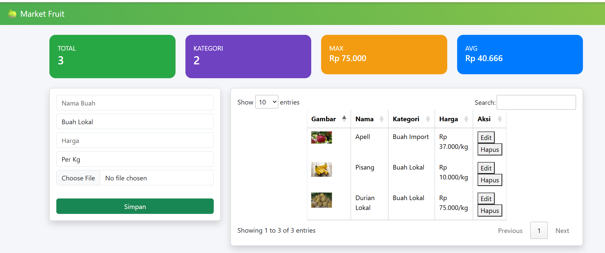

<div align="center">
  <br />
  <h1>LAPORAN PRAKTIKUM <br>APLIKASI BERBASIS PLATFORM</h1>
  <br />
  <h3>TUGAS 2 <br> COTS</h3>
  <br />
    
  <br /><br /><br />

  <h3>Disusun Oleh :</h3>
  <p>
    <strong>Arjun Werdho Kumoro</strong><br>
    <strong>2311102009</strong><br>
    <strong>IF-11-REG01</strong>
  </p>

  <br />

  <h3>Dosen Pengampu :</h3>
  <p>
    <strong>Dimas Fanny Hebrasianto Permadi, S.ST., M.Kom</strong>
  </p>

  <br />

  <h4>Asisten Praktikum :</h4>
  <strong>Apri Pandu Wicaksono</strong><br>
  <strong>Rangga Pradarrell Fathi</strong>

  <br /><br />

  <h3>
  LABORATORIUM HIGH PERFORMANCE <br>
  FAKULTAS INFORMATIKA <br>
  UNIVERSITAS TELKOM PURWOKERTO <br>
  2026
  </h3>
</div>

---

# Dasar Teori

Aplikasi berbasis web merupakan perangkat lunak yang dijalankan melalui browser tanpa perlu instalasi di sisi pengguna. Aplikasi ini memanfaatkan teknologi seperti HTML, CSS, dan JavaScript untuk membangun tampilan (frontend), serta bahasa pemrograman di sisi server (backend) untuk mengelola data dan logika sistem. Keunggulan aplikasi web adalah mudah diakses, fleksibel, serta dapat digunakan pada berbagai perangkat selama terhubung dengan jaringan internet.

Dalam pengembangan aplikasi ini digunakan Node.js sebagai lingkungan runtime yang memungkinkan bahasa JavaScript dijalankan di sisi server. Node.js memiliki keunggulan pada arsitektur event-driven dan non-blocking I/O, sehingga mampu menangani banyak permintaan secara efisien. Untuk mempermudah pembuatan aplikasi web, digunakan framework Express.js yang menyediakan fitur routing, middleware, serta pengelolaan request dan response. Express digunakan untuk membangun REST API yang menghubungkan frontend dengan backend.

Pada sisi tampilan, aplikasi menggunakan Bootstrap sebagai framework CSS untuk membangun antarmuka yang responsif dan modern. Bootstrap menyediakan berbagai komponen seperti form, tombol, navbar, dan sistem grid yang memudahkan dalam mendesain halaman web. Selain itu, digunakan jQuery untuk mempermudah manipulasi DOM, pengolahan event, serta komunikasi data dengan server melalui AJAX.

Untuk menampilkan data dalam bentuk tabel interaktif, digunakan plugin DataTables yang memungkinkan fitur pencarian, pengurutan, pagination, serta pengambilan data secara dinamis dari server. Data yang digunakan dalam aplikasi ini menggunakan format JSON, yaitu format pertukaran data yang ringan, mudah dibaca, dan banyak digunakan dalam komunikasi antara client dan server.

Konsep komunikasi antara client dan server dalam aplikasi ini menggunakan arsitektur REST API yang memanfaatkan metode HTTP seperti GET, POST, PUT, dan DELETE untuk melakukan operasi terhadap data. Metode ini sejalan dengan konsep CRUD (Create, Read, Update, Delete) yang merupakan operasi dasar dalam pengelolaan data. Dengan adanya CRUD, pengguna dapat menambahkan, melihat, mengubah, dan menghapus data produk buah secara dinamis.

Selain itu, aplikasi ini juga memanfaatkan teknik Base64 encoding untuk menyimpan gambar dalam bentuk teks. Teknik ini memungkinkan file gambar dikonversi menjadi string sehingga dapat disimpan dalam format JSON dan dikirim melalui API tanpa memerlukan penyimpanan file secara terpisah.


# Ketentuan Tugas dan Implementasi Sistem

1 Penggunaan Bootstrap sebagai Styling

Bootstrap merupakan framework CSS yang digunakan untuk mempercepat pembuatan tampilan antarmuka yang responsif dan modern. Dengan Bootstrap, pengembang tidak perlu membuat styling dari nol karena sudah tersedia berbagai komponen seperti navbar, form, tombol, dan grid system. Dalam aplikasi ini, Bootstrap digunakan untuk mempercantik tampilan halaman dashboard, form input, serta tabel data sehingga lebih rapi dan user-friendly.

IMPLEMENTASI CODE
```
<link href="https://cdn.jsdelivr.net/npm/bootstrap@5.3.2/dist/css/bootstrap.min.css" rel="stylesheet">

<div class="container mt-4">
    <div class="card p-3 shadow">
        <input type="text" class="form-control mb-2" placeholder="Nama Buah">
        <button class="btn btn-success">Simpan</button>
    </div>
</div>
```

2 Penggunaan Framework Node.js (Express.js)

Dalam pengembangan aplikasi ini digunakan Node.js dengan framework Express.js sebagai backend. Express digunakan untuk membangun REST API yang berfungsi mengelola data buah, seperti menambahkan, menampilkan, mengubah, dan menghapus data. Framework ini mempermudah pembuatan routing serta pengolahan request dan response.


IMPLEMENTASI CODE
```
const express = require('express');
const app = express();

app.use(express.json());

// GET data
app.get('/api/buah', (req, res) => {
    res.json([]);
});

// POST data
app.post('/api/buah', (req, res) => {
    res.json({message: 'Berhasil tambah'});
});
```

3 Struktur Halaman (Form, Tabel, dan CRUD)

Aplikasi ini memiliki minimal tiga komponen utama yaitu halaman form input, halaman tabel data, serta fungsionalitas CRUD. Halaman form digunakan untuk memasukkan data buah seperti nama, kategori, harga, dan gambar. Halaman tabel digunakan untuk menampilkan data dalam bentuk terstruktur. Sedangkan CRUD merupakan proses utama dalam pengelolaan data, yaitu Create (tambah), Read (lihat), Update (ubah), dan Delete (hapus).


IMPLEMENTASI CODE
Form Input
```
<form id="form">
    <input type="text" id="nama" placeholder="Nama Buah">
    <input type="number" id="harga" placeholder="Harga">
    <button>Simpan</button>
</form>
```

Tabel Data
```
<table id="table">
    <thead>
        <tr>
            <th>Nama</th>
            <th>Harga</th>
        </tr>
    </thead>
</table>
```

CRUD
```
<table id="table">
    <thead>
        <tr>
            <th>Nama</th>
            <th>Harga</th>
        </tr>
    </thead>
</table>
```

4 Penggunaan jQuery dan Plugin
jQuery digunakan untuk mempermudah manipulasi DOM, event handling, serta komunikasi dengan server menggunakan AJAX. Selain itu, digunakan plugin seperti DataTables untuk meningkatkan interaktivitas tabel, seperti pencarian, pagination, dan sorting.

IMPLEMENTASI CODE
```
<script src="https://code.jquery.com/jquery-3.7.0.min.js"></script>

<script>
$('#form').submit(function(e){
    e.preventDefault();
    alert("Form dikirim");
});
</script>
```

5 Penggunaan JSON dan DataTables
Data dalam aplikasi ini disimpan dan ditransmisikan menggunakan format JSON (JavaScript Object Notation), yang merupakan format ringan dan mudah dibaca. Data JSON tersebut kemudian ditampilkan menggunakan plugin DataTables agar lebih interaktif. DataTables memungkinkan data ditampilkan dengan fitur pencarian, pengurutan, dan pagination secara otomatis.

IMPLEMENTASI CODE
```
$('#table').DataTable({
    ajax: {
        url: '/api/buah',
        dataSrc: ''
    },
    columns: [
        {data:'nama'},
        {data:'harga'}
    ]
});
```

Data Pada JSON
```
[
  {
    "nama": "Apel",
    "harga": 10000
  },
  {
    "nama": "Pisang",
    "harga": 5000
  }
]
```


---
## Code Index.HTML
```
<!DOCTYPE html>
<html>
<head>
<title>Market Fruit</title>

<link href="https://cdn.jsdelivr.net/npm/bootstrap@5.3.2/dist/css/bootstrap.min.css" rel="stylesheet">
<link href="https://cdn.datatables.net/1.13.6/css/jquery.dataTables.min.css" rel="stylesheet">

<script src="https://code.jquery.com/jquery-3.7.0.min.js"></script>
<script src="https://cdn.datatables.net/1.13.6/js/jquery.dataTables.min.js"></script>

<style>
body { background:#f4f6f9; }
.navbar { background:linear-gradient(90deg,#4CAF50,#8BC34A); }
.card-box { border-radius:15px;color:white;padding:20px; }
.bg1{background:#28a745;} .bg2{background:#6f42c1;}
.bg3{background:#f39c12;} .bg4{background:#007bff;}
.preview{width:80px;}
</style>
</head>

<body>

<nav class="navbar navbar-dark px-3">
<span class="navbar-brand">🍏 Market Fruit</span>
</nav>

<div class="container mt-4">

<div class="row mb-4">
<div class="col-md-3"><div class="card-box bg1">TOTAL <h3 id="total">0</h3></div></div>
<div class="col-md-3"><div class="card-box bg2">KATEGORI <h3 id="kategori">0</h3></div></div>
<div class="col-md-3"><div class="card-box bg3">MAX <h5 id="max">Rp 0</h5></div></div>
<div class="col-md-3"><div class="card-box bg4">AVG <h5 id="avg">Rp 0</h5></div></div>
</div>

<div class="row">

<div class="col-md-4">
<div class="card p-3 shadow">

<form id="form">
<input type="hidden" id="id">

<input type="text" id="nama" class="form-control mb-2" placeholder="Nama Buah" required>

<select id="kategoriInput" class="form-control mb-2">
<option>Buah Lokal</option>
<option>Buah Import</option>
</select>

<input type="number" id="harga" class="form-control mb-2" placeholder="Harga">

<select id="satuan" class="form-control mb-2">
<option value="kg">Per Kg</option>
<option value="pcs">Per Pcs</option>
</select>

<input type="file" id="gambar" class="form-control mb-2">


<button class="btn btn-success w-100">Simpan</button>
</form>

</div>
</div>

<div class="col-md-8">
<div class="card p-3 shadow">
<table id="table" class="table table-bordered">
<thead>
<tr>
<th>Gambar</th><th>Nama</th><th>Kategori</th><th>Harga</th><th>Aksi</th>
</tr>
</thead>
</table>
</div>
</div>

</div>
</div>

<script>
let table;
let currentImage = '';

$(document).ready(function(){

table = $('#table').DataTable({
    ajax:{ url:'/api/buah', dataSrc:'' },
    columns:[
        {data:'gambar', render:d=> d?``:'-'},
        {data:'nama'},
        {data:'kategori'},
        {
            data:null,
            render:d=>{
                let s = d.satuan || 'kg';
                return "Rp "+parseInt(d.harga).toLocaleString("id-ID")+"/"+s;
            }
        },
        {
            data:null,
            render:d=>`
            <button onclick="edit(${d.id})">Edit</button>
            <button onclick="hapus(${d.id})">Hapus</button>`
        }
    ]
});

loadData();
});

$('#gambar').change(function(){
    let file = this.files[0];
    if(file){
        let r = new FileReader();
        r.onload = e=>{
            $('#preview').attr('src',e.target.result);
        }
        r.readAsDataURL(file);
    }
});

$('#form').submit(function(e){
    e.preventDefault();

    let gambar = $('#preview').attr('src') || currentImage || '';

    let data = {
        nama: $('#nama').val(),
        kategori: $('#kategoriInput').val(),
        harga: parseInt($('#harga').val()) || 0,
        satuan: $('#satuan').val(),
        gambar: gambar
    };

    let id = $('#id').val();
    let url = '/api/buah';
    let method = 'POST';

    if(id){
        url += '/' + id;
        method = 'PUT';
    }

    fetch(url,{
        method:method,
        headers:{'Content-Type':'application/json'},
        body:JSON.stringify(data)
    }).then(()=>refresh());
});

function loadData(){
    fetch('/api/buah')
    .then(res=>res.json())
    .then(data=>{
        $('#total').text(data.length);
        $('#kategori').text([...new Set(data.map(d=>d.kategori))].length);

        let harga = data.map(d=>d.harga || 0);
        let max = harga.length?Math.max(...harga):0;
        let avg = harga.length?harga.reduce((a,b)=>a+b,0)/harga.length:0;

        $('#max').text("Rp "+max.toLocaleString("id-ID"));
        $('#avg').text("Rp "+parseInt(avg).toLocaleString("id-ID"));
    });
}

function edit(id){
    fetch('/api/buah')
    .then(res=>res.json())
    .then(data=>{
        let d = data.find(x=>x.id==id);
        $('#id').val(d.id);
        $('#nama').val(d.nama);
        $('#kategoriInput').val(d.kategori);
        $('#harga').val(d.harga);
        $('#satuan').val(d.satuan || 'kg');
        $('#preview').attr('src', d.gambar);
        currentImage = d.gambar || '';
    });
}

function hapus(id){
    if(confirm("Hapus?")){
        fetch('/api/buah/'+id,{method:'DELETE'}).then(refresh);
    }
}

function refresh(){
    table.ajax.reload();
    loadData();
    $('#form')[0].reset();
    $('#preview').attr('src','');
    currentImage='';
}
</script>

</body>
</html>
```
## Code FORM.HTML

```html
<!DOCTYPE html>
<html>
<head>
<title>Form Buah</title>

<link href="https://cdn.jsdelivr.net/npm/bootstrap@5.3.2/dist/css/bootstrap.min.css" rel="stylesheet">

<script src="https://code.jquery.com/jquery-3.7.0.min.js"></script>

</head>

<body class="bg-light">

<div class="container mt-4">

<h3 class="text-success">Input Buah</h3>

<form id="form">

<input type="hidden" id="id">

<div class="mb-3">
<input type="text" id="nama" class="form-control" placeholder="Nama buah" required>
</div>

<div class="mb-3">
<select id="kategori" class="form-control">
<option>Buah Lokal</option>
<option>Buah Import</option>
</select>
</div>

<div class="mb-3">
<input type="number" id="harga" class="form-control" placeholder="Harga" required>
</div>

<button class="btn btn-success">Simpan</button>

<a href="index.html" class="btn btn-secondary">Kembali</a>

</form>

</div>

<script>

let params = new URLSearchParams(window.location.search);
let id = params.get('id');

if(id){
    fetch('/api/buah')
    .then(res=>res.json())
    .then(data=>{
        let d = data.find(x=>x.id==id);
        $('#id').val(d.id);
        $('#nama').val(d.nama);
        $('#kategori').val(d.kategori);
        $('#harga').val(d.harga);
    });
}

$('#form').submit(function(e){
    e.preventDefault();

    let data = {
        nama:$('#nama').val(),
        kategori:$('#kategori').val(),
        harga:$('#harga').val()
    };

    if(id){
        fetch('/api/buah/'+id,{
            method:'PUT',
            headers:{'Content-Type':'application/json'},
            body:JSON.stringify(data)
        }).then(()=>window.location='index.html');
    }else{
        fetch('/api/buah',{
            method:'POST',
            headers:{'Content-Type':'application/json'},
            body:JSON.stringify(data)
        }).then(()=>window.location='index.html');
    }
});

</script>

</body>
</html>
```

## Code SERVER.js
```
const express = require('express');
const fs = require('fs');
const app = express();

app.use(express.json({limit: '10mb'}));
app.use(express.static('public'));

const FILE = './data.json';

function readData() {
    try {
        if (!fs.existsSync(FILE)) {
            fs.writeFileSync(FILE, '[]');
        }
        return JSON.parse(fs.readFileSync(FILE));
    } catch {
        return [];
    }
}

function writeData(data) {
    fs.writeFileSync(FILE, JSON.stringify(data, null, 2));
}

// GET
app.get('/api/buah', (req, res) => {
    res.json(readData());
});

// POST
app.post('/api/buah', (req, res) => {
    let data = readData();

    if (!req.body.nama) {
        return res.status(400).json({message:'Nama wajib diisi'});
    }

    const newData = {
        id: Date.now() + Math.floor(Math.random()*1000),
        nama: req.body.nama,
        kategori: req.body.kategori,
        harga: parseInt(req.body.harga) || 0,
        satuan: req.body.satuan || 'kg',
        gambar: req.body.gambar || ''
    };

    data.push(newData);
    writeData(data);

    res.json({message:'Berhasil tambah'});
});

// PUT
app.put('/api/buah/:id', (req, res) => {
    let data = readData();
    let found = false;

    data = data.map(d => {
        if (d.id == req.params.id) {
            found = true;
            return {
                ...d,
                nama: req.body.nama,
                kategori: req.body.kategori,
                harga: parseInt(req.body.harga) || d.harga,
                satuan: req.body.satuan || d.satuan,
                gambar: req.body.gambar || d.gambar
            };
        }
        return d;
    });

    if (!found) {
        return res.status(404).json({message:'Data tidak ditemukan'});
    }

    writeData(data);
    res.json({message:'Berhasil update'});
});

// DELETE
app.delete('/api/buah/:id', (req, res) => {
    let data = readData();
    const newData = data.filter(d => d.id != req.params.id);

    if (newData.length === data.length) {
        return res.status(404).json({message:'Data tidak ditemukan'});
    }

    writeData(newData);
    res.json({message:'Berhasil hapus'});
});

app.listen(3000, () => {
    console.log("Server jalan di http://localhost:3000");
});
```


## Output

### 1. Tampilan 



## Link Youtube
https://youtu.be/0BKh0l2L4Zg
