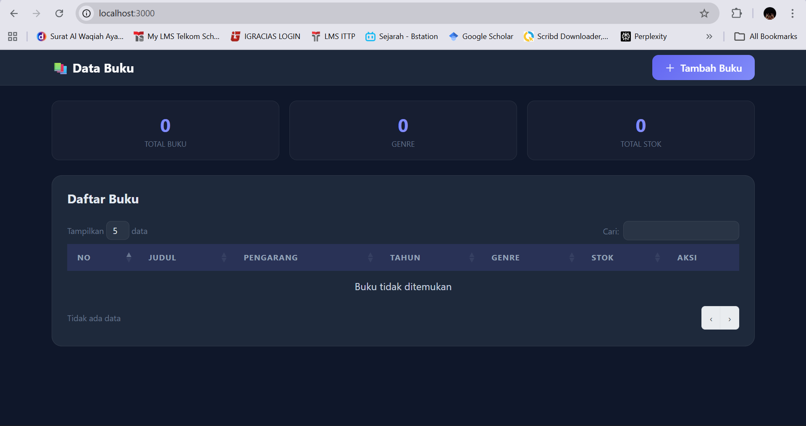
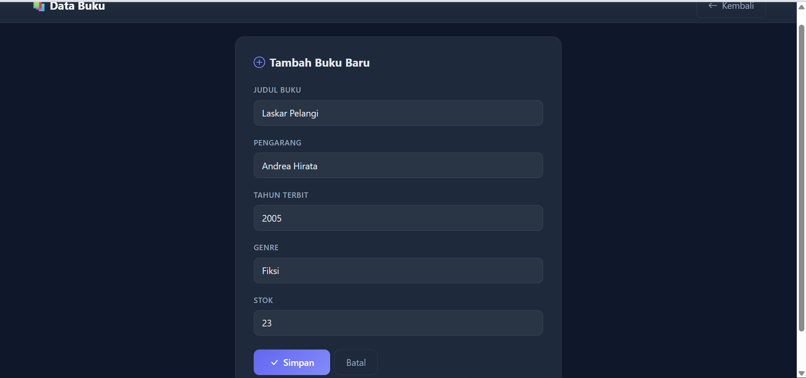
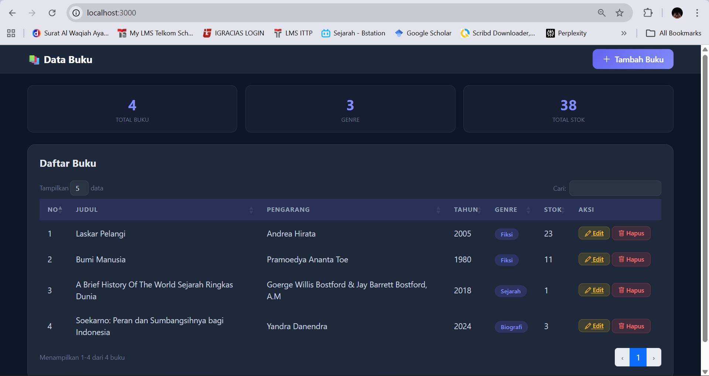
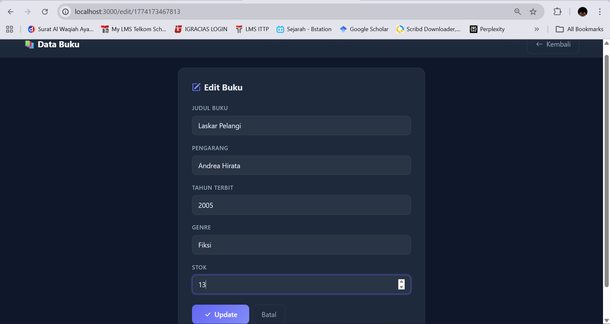
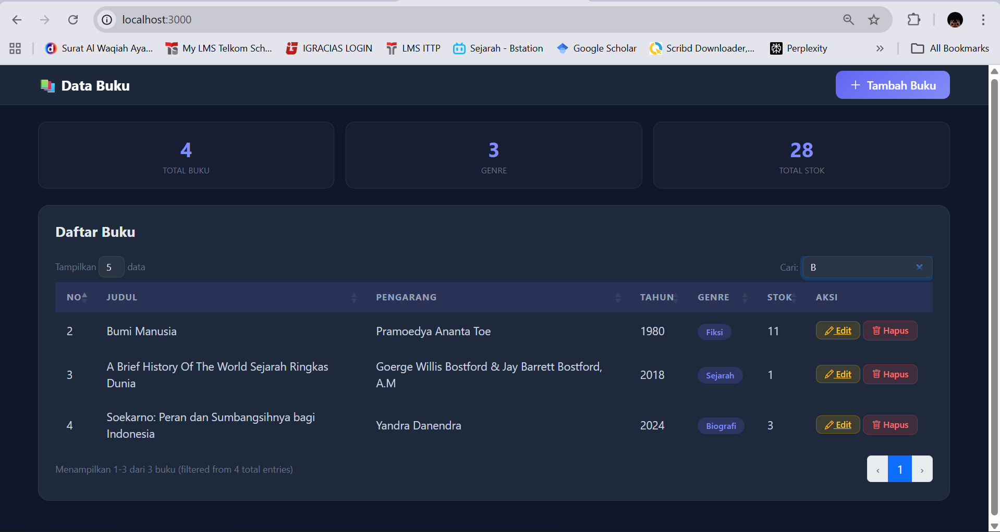
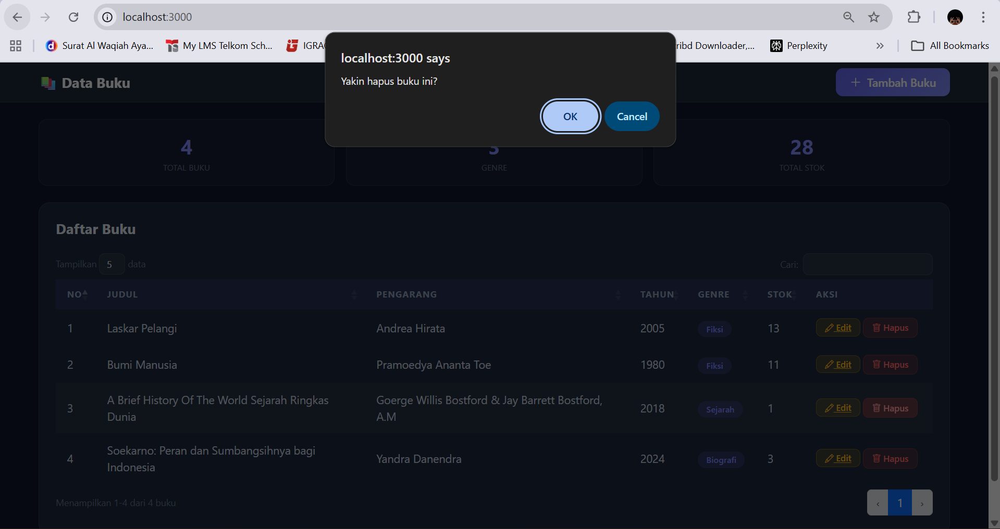
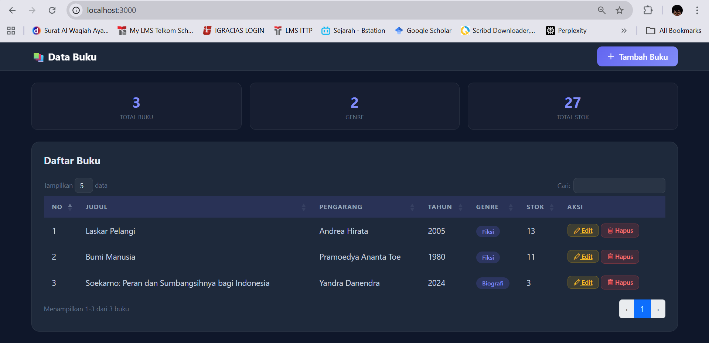

<div align="center">

# LAPORAN PRAKTIKUM
# APLIKASI BERBASIS PLATFORM

---

## MODUL 7
## APLIKASI WEB CRUD DENGAN NODE.JS DAN BOOTSTRAP

---


---

**Disusun Oleh :**

**ANNISA AL JAUHAR**

**2311102014**

**S1 IF-11-REG01**

---

**Dosen Pengampu :**

Dimas Fanny Hebrasianto Permadi, S.ST., M.Kom

---

**PROGRAM STUDI S1 INFORMATIKA**

**FAKULTAS INFORMATIKA**

**UNIVERSITAS TELKOM PURWOKERTO**

**2025/2026**

</div>

---

## 1. Dasar Teori

### Node.js
Node.js adalah runtime environment JavaScript yang berjalan di sisi server menggunakan engine V8 milik Google Chrome. Berbeda dengan JavaScript biasa yang hanya berjalan di browser, Node.js memungkinkan JavaScript dijalankan di luar browser sehingga dapat digunakan untuk membangun aplikasi backend, server, dan API. Node.js menggunakan model event-driven dan non-blocking I/O yang membuatnya sangat efisien dan ringan untuk menangani banyak koneksi secara bersamaan. Pada praktikum ini Node.js digunakan sebagai runtime untuk menjalankan server aplikasi web Data Buku.

### Express.js
Express.js adalah framework web minimalis untuk Node.js yang menyederhanakan pembuatan server dan pengelolaan routing. Express menyediakan berbagai fitur seperti middleware, routing, dan template engine yang memudahkan pengembangan aplikasi web. Pada praktikum ini Express digunakan untuk mengatur semua routing halaman aplikasi mulai dari halaman utama, form tambah, form edit, hingga API endpoint untuk DataTable. Express juga digunakan untuk mengatur middleware seperti `express.urlencoded()` untuk memproses data form dan `express.static()` untuk menyajikan file statis.

### EJS (Embedded JavaScript)
EJS adalah template engine untuk Node.js yang memungkinkan penulisan kode JavaScript di dalam file HTML menggunakan tag khusus `<%= %>` untuk menampilkan nilai variabel dan `<% %>` untuk logika JavaScript. EJS memudahkan pembuatan halaman web yang dinamis karena data dari server dapat langsung disisipkan ke dalam tampilan HTML. Pada praktikum ini EJS digunakan untuk membuat tiga halaman utama yaitu `index.ejs` untuk halaman tabel, `tambah.ejs` untuk form tambah buku, dan `edit.ejs` untuk form edit buku yang sudah terisi data buku yang dipilih.

### Bootstrap 5
Bootstrap 5 adalah framework CSS open-source yang digunakan untuk membangun tampilan halaman web yang responsif dan modern. Bootstrap menyediakan berbagai komponen siap pakai seperti navbar, form, tombol, card, dan grid system. Pada praktikum ini Bootstrap 5 digunakan untuk mengatur seluruh tampilan antarmuka aplikasi Data Buku dengan tema dark mode menggunakan CSS custom variables dan glassmorphism effect.

### jQuery dan jQuery DataTable
jQuery adalah library JavaScript yang menyederhanakan manipulasi DOM dan penanganan event. jQuery DataTable adalah plugin jQuery yang mengubah tabel HTML biasa menjadi tabel interaktif dengan fitur search, pagination, dan sorting secara otomatis. Pada praktikum ini DataTable digunakan dengan metode `ajax` untuk mengambil data dari endpoint `/api/buku` dalam format JSON sehingga tabel selalu menampilkan data terbaru dari server tanpa perlu reload halaman secara manual.

### Penyimpanan Data JSON
Data buku pada praktikum ini disimpan dalam file `buku.json` di folder `data`. Pendekatan ini dipilih karena sederhana dan tidak memerlukan instalasi database tambahan. Setiap kali data ditambah, diubah, atau dihapus, file JSON dibaca menggunakan `fs.readFileSync()` dan ditulis kembali menggunakan `fs.writeFileSync()`. Setiap buku memiliki ID unik yang di-generate menggunakan `Date.now().toString()` untuk memastikan tidak ada ID yang sama.

---

## 2. Struktur Project
```
Data-buku/
├── data/
│   └── buku.json          (penyimpanan data JSON)
├── node_modules/          (dependencies)
├── public/                (file statis)
├── routes/
│   └── buku.js            (routing dan logika CRUD)
├── views/
│   ├── index.ejs          (halaman tabel/tampil data)
│   ├── tambah.ejs         (halaman form tambah buku)
│   └── edit.ejs           (halaman form edit buku)
├── app.js                 (file utama server)
├── package.json           (konfigurasi project)
└── README.md              (laporan)
```

---

## 3. Source Code

### app.js
```javascript
// Nama  : Annisa Al Jauhar
// NIM   : 2311102014
// Kelas : S1 IF-11-REG01

const express = require('express');
const path = require('path');
const fs = require('fs');

const app = express();
const PORT = 3000;

app.set('view engine', 'ejs');
app.set('views', path.join(__dirname, 'views'));

app.use(express.urlencoded({ extended: true }));
app.use(express.json());
app.use(express.static(path.join(__dirname, 'public')));

const dataPath = path.join(__dirname, 'data', 'buku.json');
if (!fs.existsSync(path.join(__dirname, 'data'))) {
    fs.mkdirSync(path.join(__dirname, 'data'));
}
if (!fs.existsSync(dataPath)) {
    fs.writeFileSync(dataPath, JSON.stringify([]));
}

const bukuRouter = require('./routes/buku');
app.use('/', bukuRouter);

app.listen(PORT, () => {
    console.log(`Server berjalan di http://localhost:${PORT}`);
});
```

### routes/buku.js
```javascript
// Nama  : Annisa Al Jauhar
// NIM   : 2311102014
// Kelas : S1 IF-11-REG01

const express = require('express');
const router = express.Router();
const fs = require('fs');
const path = require('path');

const dataPath = path.join(__dirname, '../data/buku.json');

function readData() {
    const raw = fs.readFileSync(dataPath);
    return JSON.parse(raw);
}

function saveData(data) {
    fs.writeFileSync(dataPath, JSON.stringify(data, null, 2));
}

router.get('/', (req, res) => {
    const buku = readData();
    res.render('index', { buku });
});

router.get('/tambah', (req, res) => {
    res.render('tambah');
});

router.post('/tambah', (req, res) => {
    const buku = readData();
    const { judul, pengarang, tahun, genre, stok } = req.body;
    const id = Date.now().toString();
    buku.push({ id, judul, pengarang, tahun, genre, stok });
    saveData(buku);
    res.redirect('/');
});

router.get('/edit/:id', (req, res) => {
    const buku = readData();
    const item = buku.find(b => b.id === req.params.id);
    if (!item) return res.redirect('/');
    res.render('edit', { item });
});

router.post('/edit/:id', (req, res) => {
    const buku = readData();
    const index = buku.findIndex(b => b.id === req.params.id);
    if (index !== -1) {
        const { judul, pengarang, tahun, genre, stok } = req.body;
        buku[index] = { id: req.params.id, judul, pengarang, tahun, genre, stok };
        saveData(buku);
    }
    res.redirect('/');
});

router.post('/hapus/:id', (req, res) => {
    let buku = readData();
    buku = buku.filter(b => b.id !== req.params.id);
    saveData(buku);
    res.redirect('/');
});

router.get('/api/buku', (req, res) => {
    const buku = readData();
    res.json(buku);
});

module.exports = router;
```

---

## 4. Langkah-Langkah Penggunaan

### 4.1 Tampilan Halaman Utama
Saat aplikasi pertama kali dibuka di browser melalui `http://localhost:3000`, akan tampil halaman utama Data Buku dengan tema dark mode. Di bagian atas terdapat navbar yang berisi nama aplikasi dan tombol Tambah Buku. Di bawah navbar terdapat tiga buah stat box yang menampilkan Total Buku, jumlah Genre, dan Total Stok secara real-time. Tabel DataTable menampilkan daftar buku yang diambil dari file `buku.json` melalui endpoint `/api/buku` menggunakan metode AJAX. Tabel memiliki fitur pencarian, pagination, dan sorting pada setiap kolom.



---

### 4.2 Halaman Form Tambah Buku
Untuk menambahkan buku baru, pengguna klik tombol **+ Tambah Buku** di navbar. Halaman akan berpindah ke `/tambah` yang menampilkan form input dengan lima field yaitu Judul Buku, Pengarang, Tahun Terbit, Genre (dropdown), dan Stok. Semua field wajib diisi karena menggunakan atribut `required`. Setelah form diisi dan tombol Simpan diklik, data dikirim ke server melalui method POST ke endpoint `/tambah`. Server menerima data menggunakan `req.body`, membuat ID unik menggunakan `Date.now().toString()`, lalu menyimpan data baru ke file `buku.json` menggunakan fungsi `saveData()`.



---

### 4.3 Buku Berhasil Ditambahkan
Setelah form tambah disubmit dan data berhasil disimpan ke `buku.json`, server melakukan redirect ke halaman utama menggunakan `res.redirect('/')`. Halaman utama akan menampilkan data buku terbaru termasuk buku yang baru saja ditambahkan. Tabel DataTable secara otomatis memuat ulang data dari endpoint `/api/buku` dan menampilkan buku baru di tabel. Stat box Total Buku, Genre, dan Total Stok juga diperbarui mengikuti data terbaru.



---

### 4.4 Halaman Form Edit Buku
Untuk mengubah data buku, pengguna klik tombol **Edit** pada baris buku yang ingin diubah. Halaman akan berpindah ke `/edit/:id` dimana `:id` adalah ID unik buku yang dipilih. Server mengambil data buku berdasarkan ID menggunakan `buku.find(b => b.id === req.params.id)` lalu mengirimkan data tersebut ke template `edit.ejs`. Form edit otomatis terisi dengan data buku yang dipilih menggunakan EJS tag `value="<%= item.judul %>"` pada setiap field. Dropdown genre juga otomatis terpilih sesuai genre buku menggunakan kondisi `<%= item.genre === 'Fiksi' ? 'selected' : '' %>`. Setelah perubahan disimpan, server memperbarui data di `buku.json` dan redirect ke halaman utama.



---

### 4.5 Fitur Pencarian
DataTable menyediakan kolom pencarian di bagian kanan atas tabel. Pengguna cukup mengetikkan kata kunci dan tabel akan langsung memfilter data secara real-time tanpa perlu reload halaman. Pencarian dilakukan terhadap semua kolom tabel kecuali kolom Aksi yang dinonaktifkan dengan `orderable: false`. Teks informasi di bawah tabel menampilkan jumlah hasil yang ditemukan dari total seluruh data buku. Fitur ini sangat memudahkan pengguna untuk menemukan buku tertentu berdasarkan judul, pengarang, tahun, genre, maupun stok.



---

### 4.6 Konfirmasi Hapus Buku
Untuk menghapus buku, pengguna klik tombol **Hapus** berwarna merah pada baris buku yang ingin dihapus. Sebelum buku dihapus, browser menampilkan dialog konfirmasi menggunakan `confirm('Yakin hapus buku ini?')` yang terpasang pada atribut `onsubmit` form hapus. Langkah konfirmasi ini penting untuk mencegah penghapusan data secara tidak sengaja. Pengguna harus menekan OK untuk melanjutkan atau Cancel untuk membatalkan penghapusan.



---

### 4.7 Buku Berhasil Dihapus
Setelah pengguna menekan OK pada dialog konfirmasi, form mengirimkan request POST ke endpoint `/hapus/:id`. Server menerima request, memfilter array buku menggunakan `buku.filter(b => b.id !== req.params.id)` untuk menghapus buku dengan ID yang sesuai, lalu menyimpan kembali array yang sudah difilter ke file `buku.json` menggunakan fungsi `saveData()`. Server kemudian melakukan redirect ke halaman utama dan tabel DataTable menampilkan daftar buku terbaru tanpa buku yang sudah dihapus. Stat box Total Buku dan Total Stok juga diperbarui secara otomatis.



---

## 5. Cara Menjalankan Aplikasi
```bash
# 1. Clone repository
git clone https://github.com/nisaalj/Data-buku.git

# 2. Masuk ke folder project
cd Data-buku

# 3. Install dependencies
npm install

# 4. Jalankan server
node app.js

# 5. Buka browser dan akses
http://localhost:3000
```

---

## 6. Link Video Presentasi

[Link Video Presentasi](https://drive.google.com/file/d/1fDVZ1wk_ODJwerhwibxgJ3xq0QMTKyxY/view?usp=sharing)

<div align="center">


</div>