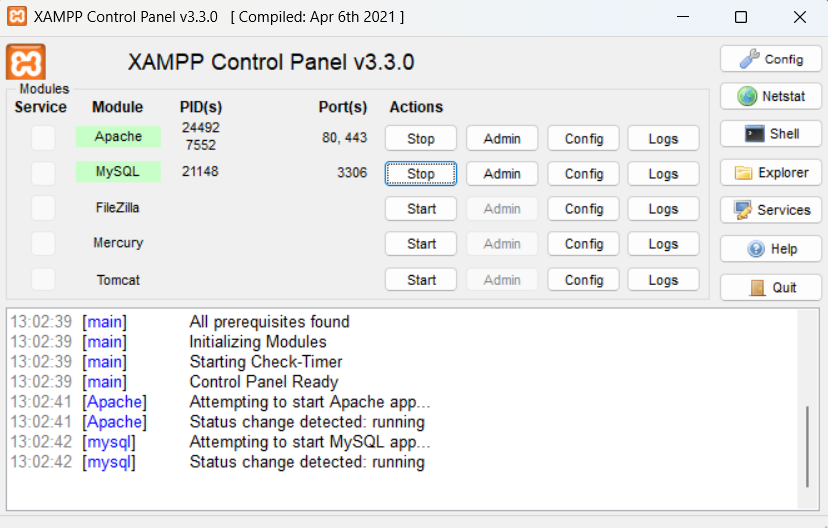
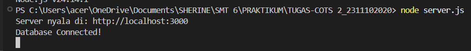
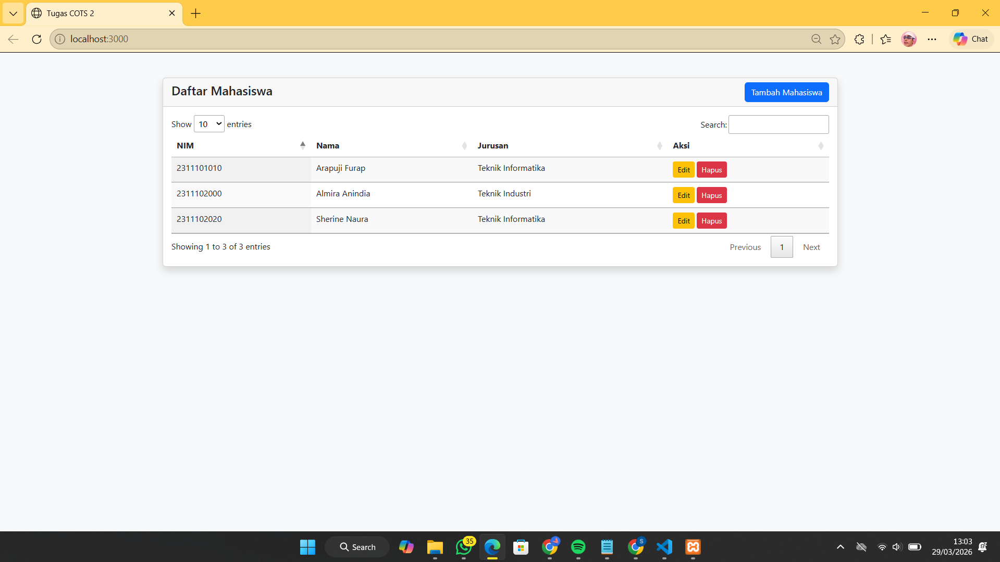
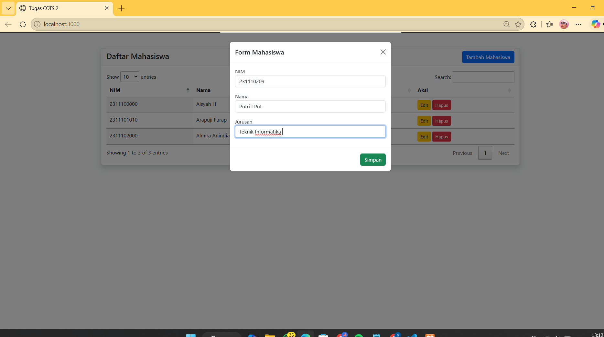
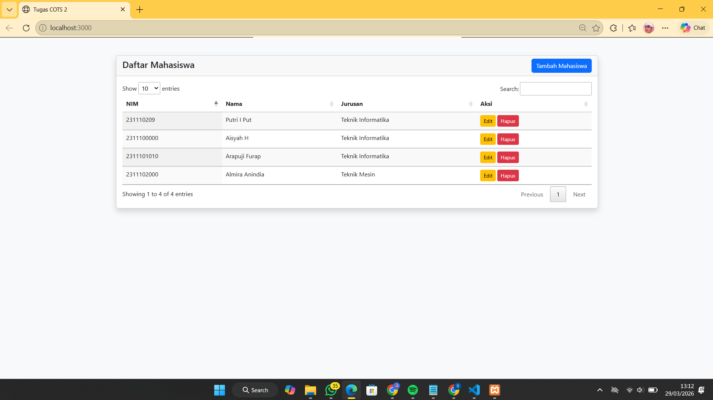
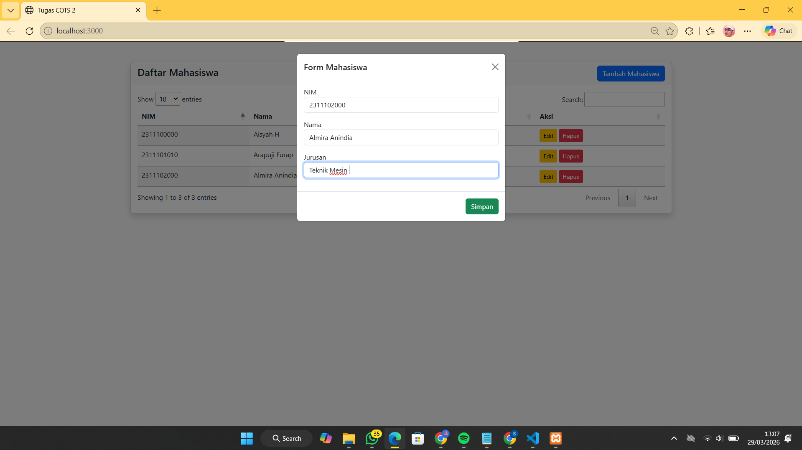
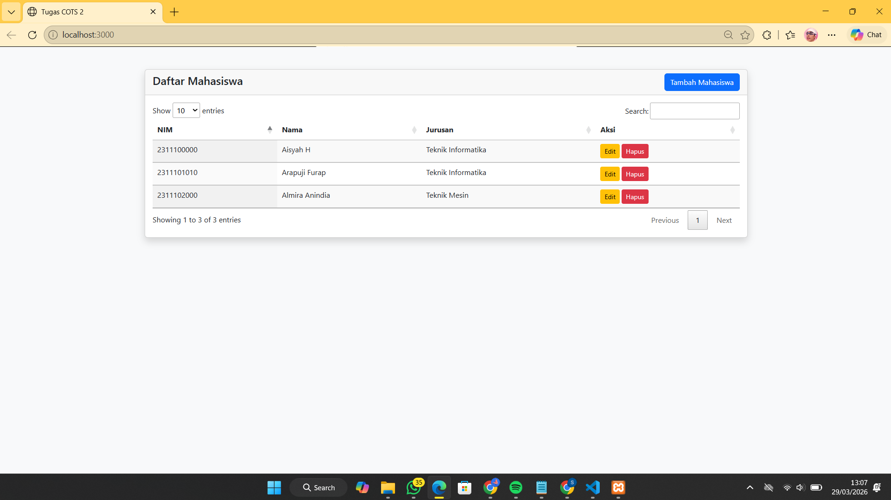
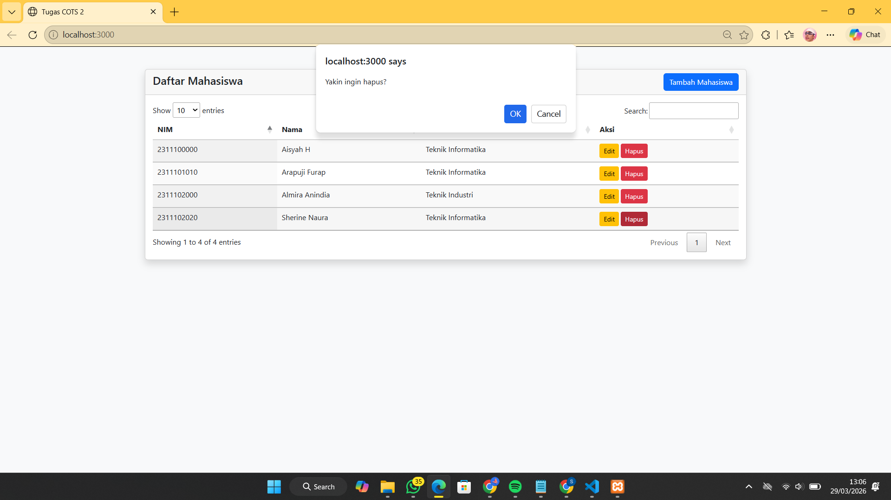
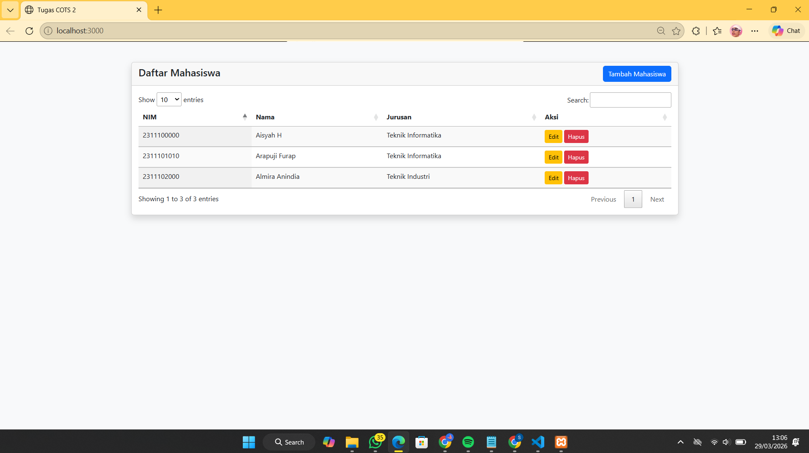

<div align="center">

# LAPORAN PRAKTIKUM
# APLIKASI BERBASIS PLATFORM


## MODUL 7
## TUGAS COTS 2 (MEMBUAT APLIKASI WEB)


**Disusun Oleh :**

**Sherine Naura Early Gunawan**

**23111020**

**S1 IF-11-REG01**


**PROGRAM STUDI S1 INFORMATIKA**

**FAKULTAS INFORMATIKA**

**UNIVERSITAS TELKOM PURWOKERTO**

**2025/2026**

</div>

---

## 1. Dasar Teori

## Arsitektur Antarmuka dan Responsivitas (Bootstrap 5)
Bootstrap 5 merupakan sebuah framework CSS sumber terbuka yang dirancang untuk mempercepat pengembangan antarmuka web yang responsif dan mengutamakan perangkat seluler (mobile-first). Secara fundamental, Bootstrap menyediakan abstraksi terhadap properti CSS kompleks melalui sistem kelas utilitas dan komponen siap pakai.

## Manipulasi DOM dan Event Handling dengan jQuery
jQuery adalah pustaka JavaScript lintas platform yang dirancang untuk menyederhanakan skrip sisi klien (client-side scripting) dalam berinteraksi dengan Document Object Model (DOM). Pustaka ini menstandarisasi perbedaan antar-peramban (browser) dalam menangani objek HTML.

- **Selektor dan Manipulasi**: jQuery menggunakan sintaks selektor berbasis CSS untuk mengakses dan memodifikasi elemen HTML secara dinamis, baik itu mengubah nilai input, maupun mengatur visibilitas elemen.
- **Event Handling**: Mekanisme penanganan kejadian (event) seperti submit() atau click() memungkinkan aplikasi untuk merespons interaksi pengguna secara presisi. Hal ini krusial dalam menghentikan perilaku standar peramban (seperti refresh halaman otomatis) guna menciptakan alur kerja yang lebih lancar.

## Manajemen Data Tabular (jQuery DataTables)
DataTables merupakan plugin ekstensif untuk pustaka jQuery yang berfungsi menambahkan kontrol interaksi tingkat lanjut pada tabel HTML statis, sehingga mampu mengubah representasi data mentah menjadi komponen yang dapat dikelola oleh pengguna secara intuitif. Teknologi ini mendukung integrasi data eksternal melalui pengisian data secara dinamis menggunakan sumber AJAX, yang secara teknis memisahkan antara struktur kerangka tabel HTML dengan isi data mentah berformat JSON.

## AJAX & RESTful API
AJAX merupakan sekelompok teknik pengembangan web yang memungkinkan aplikasi mengirim dan menerima data dari server secara asinkron di latar belakang tanpa menginterupsi sesi pengguna. Melalui protokol HTTP dengan metode POST, data formulir dikirimkan ke endpoint API tertentu untuk menjaga keamanan dan integritas status server. Proses ini didukung oleh teknik serialisasi data yang mengonversi elemen formulir menjadi format string utuh dalam satu paket permintaan.

## Node.js dan Express.js
Node.js merupakan runtime environment yang memungkinkan bahasa pemrograman JavaScript dijalankan di sisi server. Dalam pengembangan ini, digunakan Express.js, yaitu sebuah framework minimalis yang berfungsi untuk mengelola alur komunikasi antara pengguna (client) dan server.
- **Sistem Routing**: Express.js mengelola pemetaan URL aplikasi atau endpoint (seperti /api/mahasiswa). Setiap route berfungsi untuk menentukan logika spesifik yang harus dieksekusi server saat menerima permintaan tertentu dari client.
- **Implementasi Middleware**: Penggunaan fungsi middleware seperti express.json() dan express.static() sangat krusial untuk memproses data masuk, terutama dalam melakukan parsing data berformat JSON dari permintaan AJAX agar dapat diolah lebih lanjut oleh logika server.

## Manajemen Basis Data MySQL
MySQL berfungsi sebagai Relational Database Management System (RDBMS) yang digunakan untuk menyimpan data mahasiswa secara permanen dan terstruktur.

---

## 2. Source Code 

// Nama  : Sherine Naura Early Gunawan 
// NIM   : 2311102020
// Kelas : IF-11-01

### index.html

```html
<!DOCTYPE html>
<html lang="en">

<head>
    <title>Tugas COTS 2</title>
    <link rel="stylesheet" href="https://cdn.jsdelivr.net/npm/bootstrap@5.3.0/dist/css/bootstrap.min.css">
    <link rel="stylesheet" href="https://cdn.datatables.net/1.13.4/css/jquery.dataTables.min.css">
</head>

<body class="bg-light">

    <div class="container mt-5">
        <div class="card shadow">
            <div class="card-header d-flex justify-content-between align-items-center">
                <h4>Daftar Mahasiswa</h4>
                <button class="btn btn-primary" onclick="addMhs()">Tambah Mahasiswa</button>
            </div>
            <div class="card-body">
                <table id="tabelMahasiswa" class="display table table-striped" style="width:100%">
                    <thead>
                        <tr>
                            <th>NIM</th>
                            <th>Nama</th>
                            <th>Jurusan</th>
                            <th>Aksi</th>
                        </tr>
                    </thead>
                </table>
            </div>
        </div>
    </div>

    <div class="modal fade" id="modalMhs" tabindex="-1">
        <div class="modal-dialog">
            <form id="formMhs" class="modal-content">
                <div class="modal-header">
                    <h5 class="modal-title">Form Mahasiswa</h5>
                    <button type="button" class="btn-close" data-bs-dismiss="modal"></button>
                </div>
                <div class="modal-body">
                    <input type="hidden" name="id" id="mhsId">
                    <div class="mb-3">
                        <label>NIM</label>
                        <input type="text" name="nim" id="nim" class="form-control" required>
                    </div>
                    <div class="mb-3">
                        <label>Nama</label>
                        <input type="text" name="nama" id="nama" class="form-control" required>
                    </div>
                    <div class="mb-3">
                        <label>Jurusan</label>
                        <input type="text" name="jurusan" id="jurusan" class="form-control" required>
                    </div>
                </div>
                <div class="modal-footer">
                    <button type="submit" class="btn btn-success">Simpan</button>
                </div>
            </form>
        </div>
    </div>

    <script src="https://code.jquery.com/jquery-3.6.0.min.js"></script>
    <script src="https://cdn.jsdelivr.net/npm/bootstrap@5.3.0/dist/js/bootstrap.bundle.min.js"></script>
    <script src="https://cdn.datatables.net/1.13.4/js/jquery.dataTables.min.js"></script>

    <script>
        let tabel;
        $(document).ready(function () {
            tabel = $('#tabelMahasiswa').DataTable({
                ajax: '/api/mahasiswa',
                columns: [
                    { data: 'nim' },
                    { data: 'nama' },
                    { data: 'jurusan' },
                    {
                        data: 'id',
                        render: function (data) {
                            return `<button class="btn btn-sm btn-warning" onclick="editMhs(${data})">Edit</button>
                                    <button class="btn btn-sm btn-danger" onclick="deleteMhs(${data})">Hapus</button>`;
                        }
                    }
                ]
            });

            $('#formMhs').submit(function (e) {
                e.preventDefault();
                $.post('/api/mahasiswa/save', $(this).serialize(), function () {
                    $('#modalMhs').modal('show'); 
                    $('#modalMhs').modal('hide');
                    tabel.ajax.reload();
                });
            });
        });

        function addMhs() {
            $('#formMhs')[0].reset();
            $('#mhsId').val('');
            $('#modalMhs').modal('show');
        }

        function deleteMhs(id) {
            if (confirm('Yakin ingin hapus?')) {
                $.post('/api/mahasiswa/delete/' + id, function () {
                    tabel.ajax.reload();
                });
            }
        }

        function editMhs(id) {
            let data = tabel.rows().data().toArray().find(x => x.id == id);
            $('#mhsId').val(data.id);
            $('#nim').val(data.nim);
            $('#nama').val(data.nama);
            $('#jurusan').val(data.jurusan);
            $('#modalMhs').modal('show');
        }
    </script>
</body>

</html>
```

### server.js 

// Nama  : Sherine Naura Early Gunawan 
// NIM   : 2311102020
// Kelas : IF-11-01

```javascript
const express = require('express');
const mysql = require('mysql2');
const path = require('path');
const app = express();

app.use(express.json());
app.use(express.urlencoded({ extended: true }));
app.use(express.static('public'));

const db = mysql.createConnection({
    host: 'localhost',
    user: 'root',
    password: '',
    database: 'db_kampus'
});

db.connect((err) => {
    if (err) throw err;
    console.log('Database Connected!');
});


// READ: Ambil data 
app.get('/api/mahasiswa', (req, res) => {
    db.query('SELECT * FROM mahasiswa ORDER BY id DESC', (err, results) => {
        if (err) throw err;
        res.json({ data: results });
    });
});

// CREATE & UPDATE: Simpan data 
app.post('/api/mahasiswa/save', (req, res) => {
    const { id, nim, nama, jurusan } = req.body;
    if (id) {
        const sql = 'UPDATE mahasiswa SET nim=?, nama=?, jurusan=? WHERE id=?';
        db.query(sql, [nim, nama, jurusan, id], () => res.json({ status: 'success' }));
    } else {
        const sql = 'INSERT INTO mahasiswa (nim, nama, jurusan) VALUES (?, ?, ?)';
        db.query(sql, [nim, nama, jurusan], () => res.json({ status: 'success' }));
    }
});

// DELETE: Hapus data
app.post('/api/mahasiswa/delete/:id', (req, res) => {
    db.query('DELETE FROM mahasiswa WHERE id = ?', [req.params.id], () => {
        res.json({ status: 'success' });
    });
});

const PORT = 3000;
app.listen(PORT, () => {
    console.log(`Server nyala di: http://localhost:${PORT}`);
});
```

---

## 3.Tata Cara Menyalakan Server 
Langkah awal pastikan XAMPP sudah dinyalakan, karena projek ini menggunakan database MySQL.



Setelah database berhasil dinyalakan, selanjutnya masuk ke vscode dan run kode `server.js`, selanjutnya masukan kode `node server.js` untuk menyalakan server. Server berhasil dinyalakan dan berjalan di `http://localhost:3000/`.



---

## 4. Output 

### Halaman Utama 
Ketika server Node.js berhasil dijalankan melalui perintah node server.js, aplikasi dapat diakses melalui peramban pada alamat `http://localhost:3000/`. Halaman utama menampilkan beberapa data yang sudah ditambahkan sebelumnya. 



### Create Data (Membuat data baru)
Fungsi Create dijalankan melalui tombol "Tambah Mahasiswa" yang secara dinamis memicu kemunculan Bootstrap Modal. Didalam modal tersebut, tersedia formulir input untuk atribut NIM, Nama, dan Jurusan.Setelah tombol simpan diklik, data akan dikirimkan menggunakan metode POST ke endpoint /api/mahasiswa/save secara asinkron (AJAX). 



### Read Data (Membaca data)
Data yang berhasil dibuat akan ditarik dari database yang kemudian dikirimkan oleh server Node.js dalam format JSON. Data tersebut secara otomatis di-render oleh plugin DataTables ke dalam baris-baris tabel yang interaktif. Implementasi ini memungkinkan pengguna untuk memanfaatkan fitur pencarian (searching), pengurutan (sorting), serta pembagian halaman (pagination) untuk navigasi data yang lebih efisien.



## Update Data 
Proses Update dimulai ketika pengguna menekan tombol "Edit" pada baris data tertentu. Secara teknis, sistem akan melakukan ekstraksi data dari baris tersebut dan memuatnya kembali ke dalam Bootstrap Modal. 





## Remove Data 
Fungsi Remove dirancang dengan aspek keamanan berupa Dialog Konfirmasi. Mekanisme ini berfungsi sebagai validasi akhir untuk mencegah penghapusan data akibar ketidaksengajaan pengguna. Setelah konfirmasi disetujui, server akan menjalankan query DELETE ke database dan memicu instruksi tabel.ajax.reload() untuk menyinkronkan tampilan tabel secara instan.





---

## 5. Link Presentasi 
[Link Presentasi](https://drive.google.com/drive/folders/1FgiqCUQehsA8GxW0of-R48eA_w7Kef-g?usp=sharing)

<div align="center">


</div>