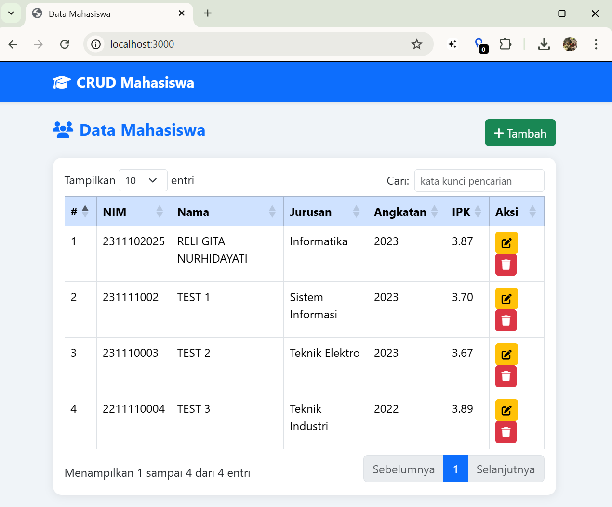
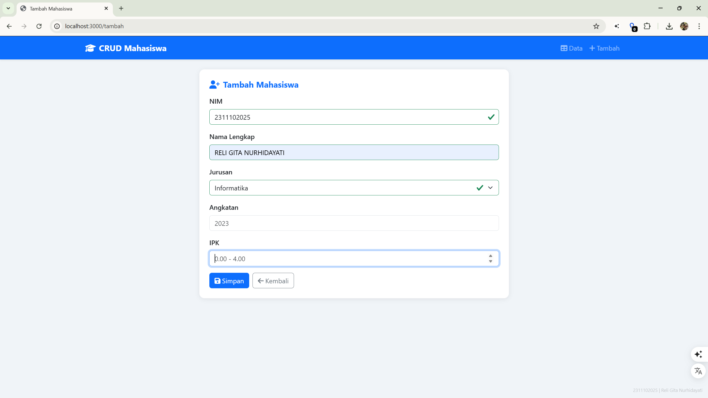
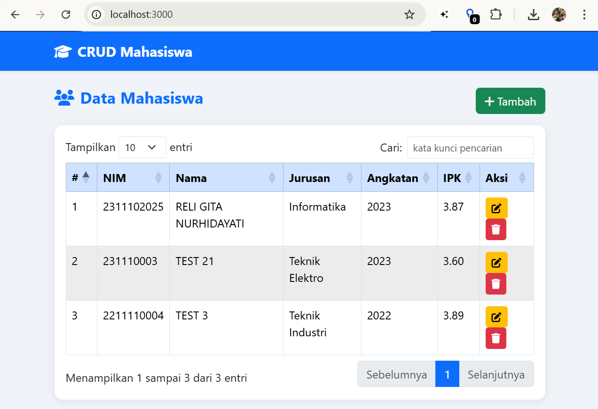
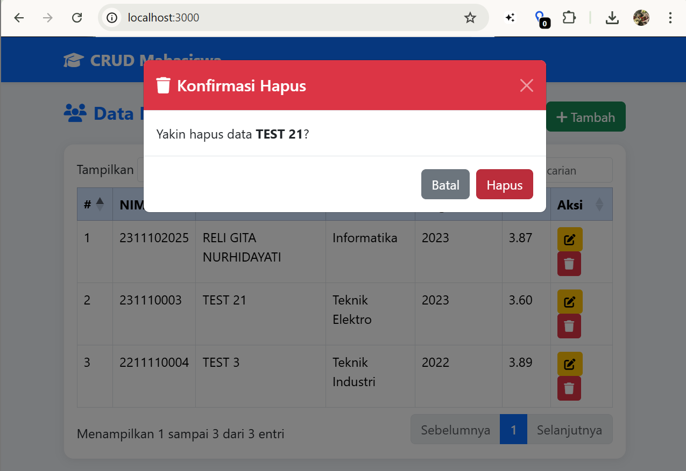

<div align="center">

# LAPORAN PRAKTIKUM
## APLIKASI BERBASIS PLATFORM

### TUGAS COTS 2
### NODE.JS & EXPRESS.JS

<br>


<br>

**Disusun Oleh :**

**RELI GITA NURHIDAYATI**

**2311102025**

**S1 IF-11-REG01**

<br>

**Dosen Pengampu :**

Dimas Fanny Hebrasianto Permadi, S.ST., M.Kom

<br>

**Asisten Praktikum :**

Apri Pandu Wicaksono

Rangga Pradarrell Fathi

<br>

**LABORATORIUM HIGH PERFORMANCE**

**FAKULTAS INFORMATIKA**

**UNIVERSITAS TELKOM PURWOKERTO**

**2026**

</div>

---

## 1. Dasar Teori

Dalam pembuatan aplikasi CRUD Data Mahasiswa berbasis web ini, terdapat beberapa teknologi dan konsep dasar yang digunakan:

- **Node.js & Express.js**: Node.js adalah lingkungan eksekusi JavaScript di sisi server (backend). Express.js adalah framework minimalis di atas Node.js yang mempermudah pembuatan routing dan REST API secara cepat dan efisien.

- **REST API**: Arsitektur komunikasi yang menjembatani antara tampilan depan (frontend) dengan server (backend). Data yang dikirim dan diterima menggunakan format JSON.

- **JSON (JavaScript Object Notation)**: Format penyimpanan data yang ringan dan mudah dibaca. Pada project ini, JSON digunakan sebagai media penyimpanan data mahasiswa yang menggantikan peran database.

- **EJS (Embedded JavaScript)**: Template engine untuk Node.js yang memungkinkan pembuatan halaman HTML secara dinamis dengan menyisipkan data dari server langsung ke tampilan.

- **AJAX / jQuery**: Teknik pengambilan dan pengiriman data ke server secara asynchronous tanpa perlu me-refresh seluruh halaman. Pada project ini diimplementasikan menggunakan library jQuery dengan syntax `$.post()`.

- **Bootstrap 5**: Framework CSS siap pakai untuk membangun tampilan website yang responsif dan modern tanpa perlu menulis kode CSS yang panjang.

- **jQuery DataTables**: Plugin jQuery untuk menampilkan data tabel secara interaktif dengan fitur pencarian, pengurutan, dan pagination yang diambil langsung dari sumber data JSON.

- **jQuery Validation Plugin**: Plugin jQuery untuk melakukan validasi form di sisi client sebelum data dikirimkan ke server.

---

## 2. Penjelasan Kode

Berikut adalah implementasi kode yang ada di project ini beserta penjelasannya. Total terdapat **7 file utama** yang saling bekerja sama.

### Struktur Folder

```
2311102025_Reli-Gita-Nurhidayati/
├── README.md
└── app/
    ├── app.js
    ├── package.json
    ├── data/
    │   └── mahasiswa.json
    ├── views/
    │   ├── index.ejs
    │   ├── tambah.ejs
    │   └── edit.ejs
    └── public/
        └── js/
            └── main.js
```

### 1. `app.js`

```javascript
// ============================================================
// Tugas 2 Praktikum - Aplikasi CRUD Mahasiswa
// NIM  : 2311102025
// Nama : Reli Gita Nurhidayati
// ============================================================

const express = require('express');
const fs      = require('fs');
const path    = require('path');

const app       = express();
const PORT      = 3000;
const DATA_FILE = path.join(__dirname, 'data', 'mahasiswa.json');

app.set('view engine', 'ejs');
app.use(express.urlencoded({ extended: true }));
app.use(express.json());
app.use(express.static('public'));

function readData()      { return JSON.parse(fs.readFileSync(DATA_FILE, 'utf-8') || '[]'); }
function writeData(data) { fs.writeFileSync(DATA_FILE, JSON.stringify(data, null, 2)); }

// Halaman Tabel (Read)
app.get('/', (req, res) => res.render('index'));

// API JSON untuk DataTables
app.get('/api/mahasiswa', (req, res) => res.json({ data: readData() }));

// Form Tambah (Create)
app.get('/tambah', (req, res) => res.render('tambah'));
app.post('/tambah', (req, res) => {
  const data = readData();
  const { nim, nama, jurusan, angkatan, ipk } = req.body;
  data.push({ id: Date.now().toString(), nim, nama, jurusan, angkatan, ipk });
  writeData(data);
  res.redirect('/');
});

// Form Edit (Update)
app.get('/edit/:id', (req, res) => {
  const mahasiswa = readData().find(m => m.id === req.params.id);
  if (!mahasiswa) return res.redirect('/');
  res.render('edit', { mahasiswa });
});
app.post('/edit/:id', (req, res) => {
  const data = readData();
  const idx  = data.findIndex(m => m.id === req.params.id);
  if (idx !== -1) {
    const { nim, nama, jurusan, angkatan, ipk } = req.body;
    data[idx] = { ...data[idx], nim, nama, jurusan, angkatan, ipk };
    writeData(data);
  }
  res.redirect('/');
});

// Hapus Data (Delete)
app.post('/hapus/:id', (req, res) => {
  writeData(readData().filter(m => m.id !== req.params.id));
  res.json({ success: true });
});

app.listen(PORT, () => console.log(`Server: http://localhost:${PORT}`));
```

**Penjelasan:**
- **Baris 1-17**: Inisialisasi server. Memanggil modul `express`, `fs`, dan `path`. Mengatur EJS sebagai template engine dan folder `public` sebagai direktori statis.
- **Baris 19-20**: Fungsi `readData()` dan `writeData()` untuk membaca dan menulis data ke file `mahasiswa.json` sebagai media penyimpanan.
- **Baris 22-23**: Route GET `/` untuk menampilkan halaman tabel data, dan route GET `/api/mahasiswa` sebagai endpoint JSON yang dikonsumsi oleh jQuery DataTables.
- **Baris 25-33**: Route GET dan POST `/tambah` untuk menampilkan form tambah dan menyimpan data baru ke JSON dengan ID unik berbasis timestamp.
- **Baris 35-47**: Route GET dan POST `/edit/:id` untuk menampilkan form edit dengan data existing, kemudian menyimpan perubahan ke JSON.
- **Baris 49-52**: Route POST `/hapus/:id` untuk menghapus data berdasarkan ID dan mengembalikan response JSON `{ success: true }`.

---

### 2. `data/mahasiswa.json`

```json
[
  {
    "id": "1711102025001",
    "nim": "2311102025",
    "nama": "RELI GITA NURHIDAYATI",
    "jurusan": "Informatika",
    "angkatan": "2023",
    "ipk": "3.87"
  }
]
```

**Penjelasan:**
File JSON ini berfungsi sebagai media penyimpanan data mahasiswa yang menggantikan peran database. Setiap objek mahasiswa memiliki atribut `id` (unik berbasis timestamp), `nim`, `nama`, `jurusan`, `angkatan`, dan `ipk`. Data ini dibaca dan ditulis langsung oleh server melalui fungsi `readData()` dan `writeData()`.

---

### 3. `views/index.ejs`

```html
<!-- NIM: 2311102025 | Nama: Reli Gita Nurhidayati | Halaman: Tabel Data -->
<table id="tabelMahasiswa" class="table table-bordered table-hover w-100">
  <thead class="table-primary">
    <tr>
      <th>#</th><th>NIM</th><th>Nama</th>
      <th>Jurusan</th><th>Angkatan</th><th>IPK</th><th>Aksi</th>
    </tr>
  </thead>
</table>
```

**Penjelasan:**
Halaman utama yang menampilkan tabel data mahasiswa. Struktur tabel sengaja dibuat kosong karena data akan diisi secara dinamis oleh jQuery DataTables melalui AJAX ke endpoint `/api/mahasiswa`. Halaman ini juga memuat modal konfirmasi hapus dari Bootstrap.

---

### 4. `views/tambah.ejs`

```html
<!-- NIM: 2311102025 | Nama: Reli Gita Nurhidayati | Halaman: Form Tambah -->
<form id="formTambah" action="/tambah" method="POST" novalidate>
  <input type="text" name="nim" class="form-control" required/>
  <input type="text" name="nama" class="form-control" required/>
  <select name="jurusan" class="form-select" required>
    <option>Informatika</option>
    <!-- ... -->
  </select>
  <input type="number" name="angkatan" class="form-control" required/>
  <input type="number" name="ipk" step="0.01" min="0" max="4" required/>
  <button type="submit" class="btn btn-primary">Simpan</button>
</form>
```

**Penjelasan:**
Halaman form untuk menambahkan data mahasiswa baru. Form menggunakan metode POST ke route `/tambah`. Validasi dilakukan menggunakan **jQuery Validation Plugin** yang memastikan semua field terisi dengan benar sebelum data dikirim ke server.

---

### 5. `views/edit.ejs`

```html
<!-- NIM: 2311102025 | Nama: Reli Gita Nurhidayati | Halaman: Form Edit -->
<form action="/edit/<%= mahasiswa.id %>" method="POST">
  <input type="text" name="nim" value="<%= mahasiswa.nim %>" required/>
  <input type="text" name="nama" value="<%= mahasiswa.nama %>" required/>
  <option value="Informatika" 
    <%= mahasiswa.jurusan==='Informatika'?'selected':'' %>>
    Informatika
  </option>
</form>
```

**Penjelasan:**
Halaman form untuk mengedit data mahasiswa yang sudah ada. Menggunakan **EJS template tags** (`<%= %>`) untuk menampilkan data lama secara otomatis ke dalam form, termasuk dropdown jurusan yang sudah terseleksi sesuai data sebelumnya. Validasi juga diterapkan menggunakan jQuery Validation Plugin.

---

### 6. `public/js/main.js`

```javascript
// ============================================================
// NIM  : 2311102025 | Nama : Reli Gita Nurhidayati
// ============================================================
$(function () {
  // Inisialisasi DataTables dengan sumber JSON dari API
  var table = $('#tabelMahasiswa').DataTable({
    ajax: { url: '/api/mahasiswa', dataSrc: 'data' },
    columns: [
      { data: null, render: (d, t, r, meta) => meta.row + 1 },
      { data: 'nim' }, { data: 'nama' },
      { data: 'jurusan' }, { data: 'angkatan' },
      { data: 'ipk', render: d => parseFloat(d).toFixed(2) },
      {
        data: null,
        render: d =>
          `<a href="/edit/${d.id}" class="btn btn-warning btn-sm me-1">
            <i class="fas fa-edit"></i></a>` +
          `<button class="btn btn-danger btn-sm btn-hapus" 
            data-id="${d.id}" data-nama="${d.nama}">
            <i class="fas fa-trash"></i></button>`
      }
    ],
    language: { url: 'https://cdn.datatables.net/plug-ins/1.13.7/i18n/id.json' }
  });

  // Hapus data via AJAX
  $('#btnKonfirmasiHapus').on('click', function () {
    $.post('/hapus/' + idHapus, function (res) {
      if (res.success) { table.ajax.reload(); }
    });
  });
});
```

**Penjelasan:**
- **Inisialisasi DataTables**: Menginisialisasi tabel interaktif dengan sumber data dari endpoint `/api/mahasiswa`. Fitur yang aktif meliputi pencarian, pengurutan kolom, pagination, dan lokalisasi bahasa Indonesia.
- **Render Kolom Aksi**: Setiap baris tabel dilengkapi tombol Edit (kuning) dan Hapus (merah) yang di-render secara dinamis oleh DataTables.
- **Hapus via AJAX**: Proses hapus menggunakan `$.post()` tanpa reload halaman. Setelah berhasil, DataTables otomatis me-refresh data dengan `table.ajax.reload()`.

---

## 3. Hasil Tampilan (Screenshots)

### Halaman Tabel Data (Read)


> Tampilan halaman utama dengan jQuery DataTables. Data diambil dari endpoint JSON `/api/mahasiswa` secara real-time. Fitur search, sort, dan pagination aktif dengan bahasa Indonesia.

### Halaman Form Tambah (Create)


> Form input data mahasiswa baru dengan validasi jQuery Validation Plugin. Semua field wajib diisi sebelum data dapat disimpan.

### Halaman Form Edit (Update)


> Form edit yang otomatis terisi data mahasiswa yang dipilih. Dropdown jurusan terseleksi sesuai data lama.

### Konfirmasi & Notifikasi Hapus (Delete)


> Modal konfirmasi Bootstrap muncul sebelum data dihapus. Setelah dihapus, notifikasi sukses muncul dan tabel refresh otomatis tanpa reload halaman.

---

## 4. Link Video Penjelasan

🎥 [Klik di sini untuk menonton video penjelasan aplikasi](https://drive.google.com/file/d/1mp_7doMmhFz9Ri7_cngq1waJTVWeQbw-/view?usp=sharing)

---

## 5. Cara Menjalankan Aplikasi

```bash
# 1. Masuk ke folder app
cd app

# 2. Install dependencies
npm install

# 3. Jalankan server
node app.js

# 4. Buka browser
# http://localhost:3000
```

---

## 6. Referensi

- Node.js Documentation: https://nodejs.org/docs/
- Express.js Framework: https://expressjs.com/
- Bootstrap 5: https://getbootstrap.com/docs/5.3/
- jQuery DataTables: https://datatables.net/manual/
- jQuery Validation Plugin: https://jqueryvalidation.org/
- EJS Template Engine: https://ejs.co/
- MDN Web Docs (JSON): https://developer.mozilla.org/en-US/docs/Web/JavaScript/Reference/Global_Objects/JSON

---

<div align="center">

*2311102025 | Reli Gita Nurhidayati*

*Tugas 2 Praktikum — Aplikasi Berbasis Platform*

*Universitas Telkom Purwokerto 2026*

</div>
