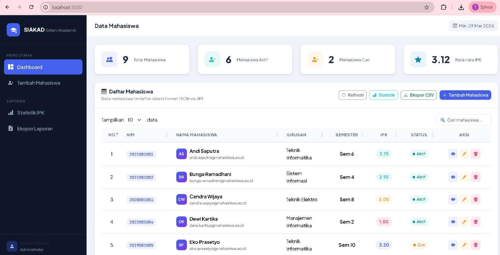
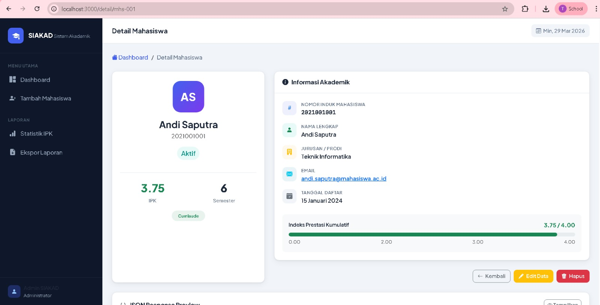
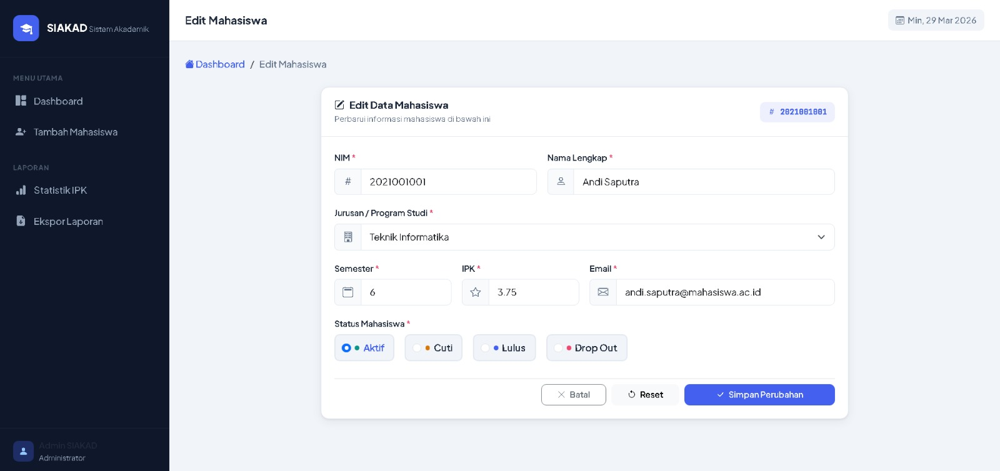
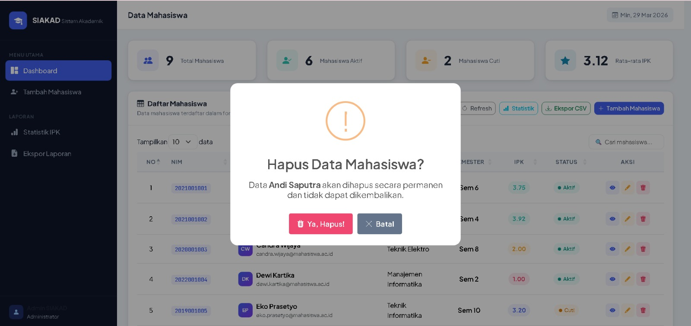
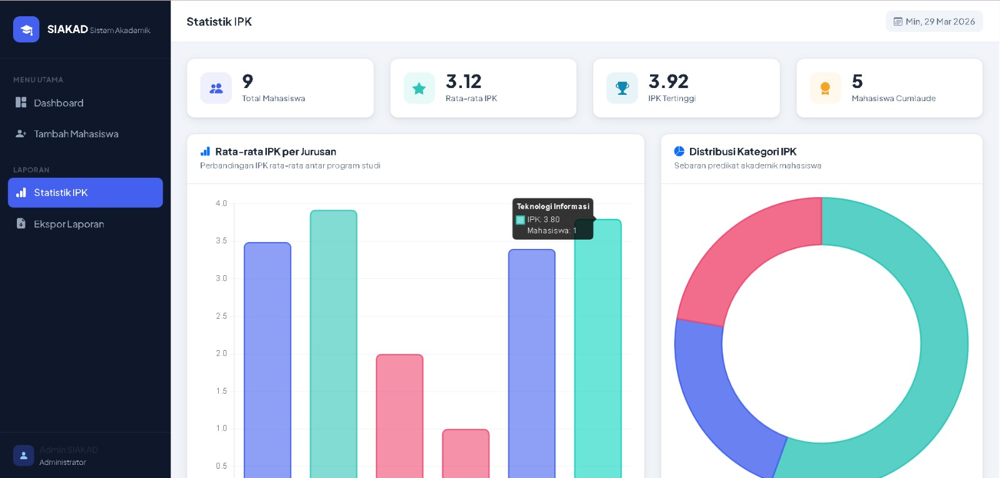
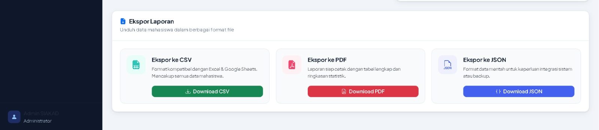
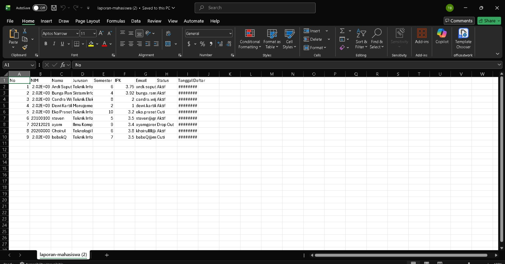
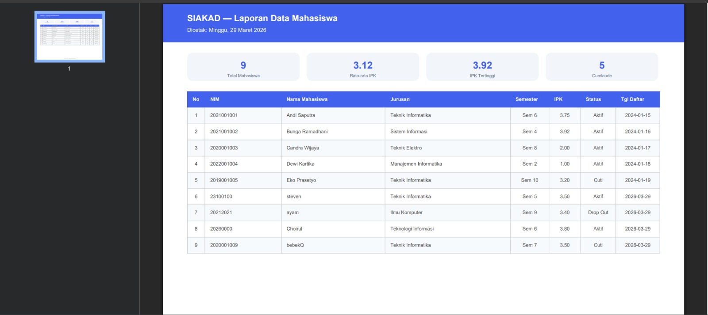
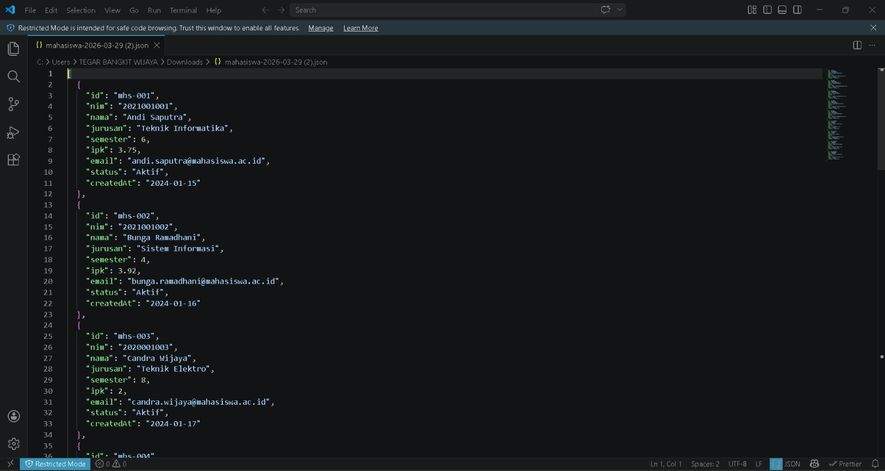
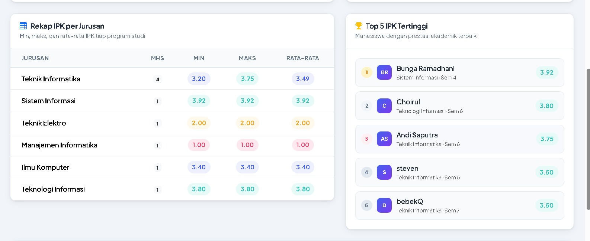

<div align="center">

# LAPORAN PRAKTIKUM
# APLIKASI BERBASIS PLATFORM

---

## MODUL 4
## APLIKASI MANAJEMEN DATA MAHASISWA (SIAKAD)

---


---

**Disusun Oleh :**

**TEGAR BANGKIT WIJAYA**

**2311102027**

**S1 IF-11-REG01**

---

**Dosen Pengampu :**

Dimas Fanny Hebrasianto Permadi, S.ST., M.Kom

---

**PROGRAM STUDI S1 INFORMATIKA**

**FAKULTAS INFORMATIKA**

**UNIVERSITAS TELKOM PURWOKERTO**

**2025/2026**

</div>

---

## 1. Dasar Teori

Node.js adalah runtime JavaScript berbasis V8 Engine yang memungkinkan JavaScript dijalankan di sisi server. Node.js bersifat non-blocking dan event-driven sehingga cocok untuk aplikasi web yang membutuhkan penanganan banyak koneksi secara bersamaan.

Express.js adalah framework web minimalis untuk Node.js yang menyediakan fitur routing, middleware, dan pengelolaan request/response HTTP. Express mempermudah pembuatan RESTful API dan aplikasi web server-side.

EJS (Embedded JavaScript) adalah template engine untuk Node.js yang memungkinkan penulisan kode JavaScript di dalam HTML. EJS menggunakan tag `<%= ... %>` untuk output nilai variabel dan `<% ... %>` untuk logika seperti kondisi dan perulangan.

Bootstrap 5 adalah framework CSS yang menyediakan komponen UI siap pakai seperti card, table, modal, dan form. Bootstrap menggunakan sistem grid responsif berbasis flexbox yang memudahkan pembuatan tampilan yang konsisten di berbagai ukuran layar.

DataTables adalah plugin jQuery yang menambahkan fitur pencarian, pengurutan, dan paginasi pada tabel HTML secara otomatis. DataTables mendukung pengambilan data secara asinkron via AJAX dari endpoint JSON.

jQuery Validate adalah plugin jQuery untuk validasi form di sisi klien. Plugin ini mendukung aturan validasi built-in seperti `required`, `minlength`, `digits`, `email`, serta mendukung pesan error kustom.

SweetAlert2 adalah library JavaScript untuk menampilkan dialog popup yang interaktif sebagai pengganti `alert()` bawaan browser. SweetAlert2 mendukung konfirmasi, animasi, dan berbagai tipe ikon notifikasi.

RESTful API menggunakan metode HTTP (GET, POST, DELETE) untuk operasi CRUD. Pada aplikasi ini endpoint `/api/mahasiswa` digunakan untuk mengambil dan menghapus data mahasiswa secara asinkron via AJAX.

---

## 2. Penjelasan Kode

Berikut adalah implementasi aplikasi SIAKAD (Sistem Informasi Akademik Mahasiswa) menggunakan Node.js, Express.js, dan EJS.

### 2.1 Struktur Proyek
```
mahasiswa-app/
├── app.js                  ← Server utama (Express routes + API)
├── package.json
├── data/
│   └── mahasiswa.json      ← Penyimpanan data (JSON)
├── views/
│   ├── header.ejs          ← Sidebar + Topbar
│   ├── footer.ejs          ← Scripts + Modal
│   ├── index.ejs           ← Halaman Dashboard (DataTable)
│   ├── form.ejs            ← Halaman Tambah/Edit
│   └── detail.ejs          ← Halaman Detail Mahasiswa
└── public/
    ├── css/style.css       ← Custom styling
    └── js/main.js          ← jQuery logic + DataTables + CRUD
```

### 2.2 Server Utama (app.js)

File `app.js` adalah entry point aplikasi yang mengatur konfigurasi Express, middleware, routing halaman, dan API endpoint. Fungsi `readData()` dan `writeData()` digunakan untuk membaca dan menulis data ke file JSON. UUID digunakan untuk menghasilkan ID unik setiap mahasiswa baru.
```javascript
const express = require('express');
const bodyParser = require('body-parser');
const { v4: uuidv4 } = require('uuid');
const fs = require('fs');
const path = require('path');

const app = express();
const PORT = process.env.PORT || 3000;
const DATA_FILE = path.join(__dirname, 'data', 'mahasiswa.json');

app.set('view engine', 'ejs');
app.use(bodyParser.json());
app.use(bodyParser.urlencoded({ extended: true }));
app.use(express.static(path.join(__dirname, 'public')));
```

Route halaman yang tersedia:

| Method | URL | Fungsi |
|--------|-----|--------|
| GET | `/` | Dashboard + kartu statistik + DataTable |
| GET | `/tambah` | Form tambah mahasiswa baru |
| GET | `/edit/:id` | Form edit mahasiswa (pre-filled) |
| GET | `/detail/:id` | Halaman detail mahasiswa |
| POST | `/tambah` | Simpan mahasiswa baru ke JSON |
| POST | `/edit/:id` | Update data mahasiswa |
| GET | `/api/mahasiswa` | API – ambil semua data (JSON) |
| DELETE | `/api/mahasiswa/:id` | API – hapus data via AJAX |

### 2.3 Halaman Dashboard (index.ejs)

Halaman dashboard menampilkan 4 kartu statistik yang dihitung di sisi server dan tabel DataTables yang mengambil data via AJAX dari endpoint `/api/mahasiswa`.
```javascript
const stats = {
  total: data.length,
  aktif: data.filter(m => m.status === 'Aktif').length,
  cuti: data.filter(m => m.status === 'Cuti').length,
  avgIpk: data.length ?
    (data.reduce((s, m) => s + m.ipk, 0) / data.length).toFixed(2) : 0
};
```

### 2.4 Halaman Form (form.ejs)

Form digunakan untuk tambah dan edit mahasiswa. Variabel `isEdit` menentukan mode tampilan. Validasi menggunakan jQuery Validate dengan aturan `digits`, `minlength`, dan `min/max` untuk setiap field. Terdapat visualisasi IPK bar yang berubah warna secara dinamis sesuai nilai yang diinput.
```javascript
$('#formMahasiswa').validate({
  rules: {
    nim:      { required: true, minlength: 10, maxlength: 12, digits: true },
    nama:     { required: true, minlength: 3 },
    jurusan:  { required: true },
    semester: { required: true, min: 1, max: 14, digits: true },
    ipk:      { required: true, min: 0, max: 4, number: true },
    email:    { required: true, email: true },
  },
});
```

### 2.5 Halaman Detail (detail.ejs)

Halaman detail menampilkan profil mahasiswa lengkap dengan avatar berisi inisial nama, badge status berwarna, progress bar IPK, dan informasi akademik. Terdapat fitur JSON Preview yang dapat ditoggle dan tombol hapus dengan konfirmasi SweetAlert2 yang mengirim request DELETE via AJAX.
```javascript
function hapusMahasiswa(id, nama) {
  Swal.fire({
    title: 'Hapus Data?',
    html: `Data <strong>${nama}</strong> akan dihapus permanen!`,
    icon: 'warning',
    showCancelButton: true,
    confirmButtonColor: '#dc3545',
  }).then((result) => {
    if (result.isConfirmed) {
      $.ajax({
        url: `/api/mahasiswa/${id}`,
        method: 'DELETE',
        success: (res) => { window.location.href = '/'; }
      });
    }
  });
}
```

### 2.6 Frontend (main.js)

`main.js` mengatur inisialisasi DataTables dengan AJAX, sidebar toggle untuk tampilan mobile, fungsi hapus via AJAX DELETE, dan helper `showToast()` untuk notifikasi.
```javascript
const table = $('#tableMahasiswa').DataTable({
  ajax: {
    url: '/api/mahasiswa',
    dataSrc: 'data',
  },
  columns: [
    { data: null, render: (d, t, r, meta) => meta.row + 1 },
    { data: 'nim', render: nim => `<span class="nim-badge">${nim}</span>` },
    { data: 'nama' },
    { data: 'jurusan' },
    { data: 'semester' },
    { data: 'ipk' },
    { data: 'status' },
    { data: null } // Tombol aksi
  ],
});
```

---

## 3. Hasil

Berikut adalah hasil tampilan aplikasi SIAKAD yang telah berhasil dibangun.





















---


## 10. Link Video Presentasi

[https://drive.google.com/file/d/1t0tho5vRoC1hniIqXrtS-E5rlXyQ6n69/view?usp=sharing]

---

<div align="center">

*2311102027 - Tegar Bangkit Wijaya - S1 IF-11-REG01*

</div>