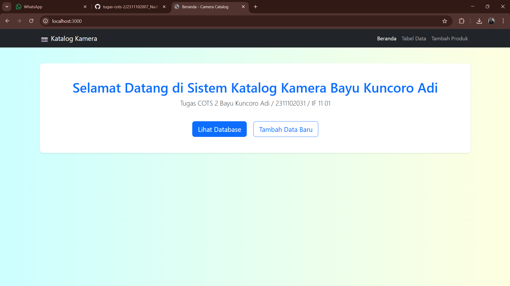
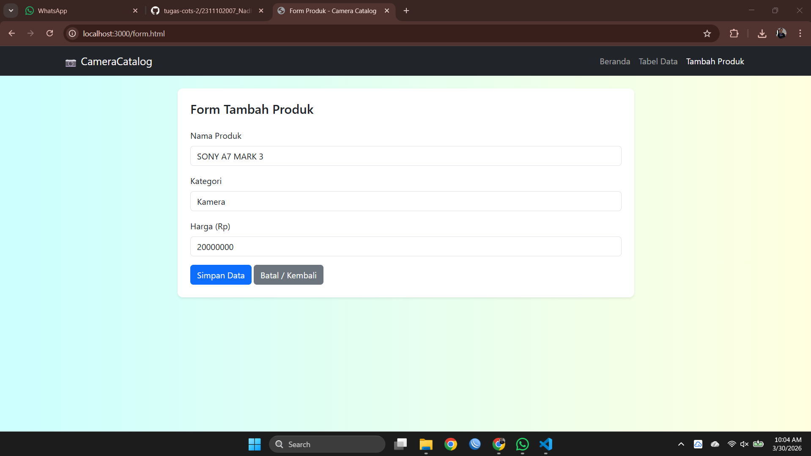
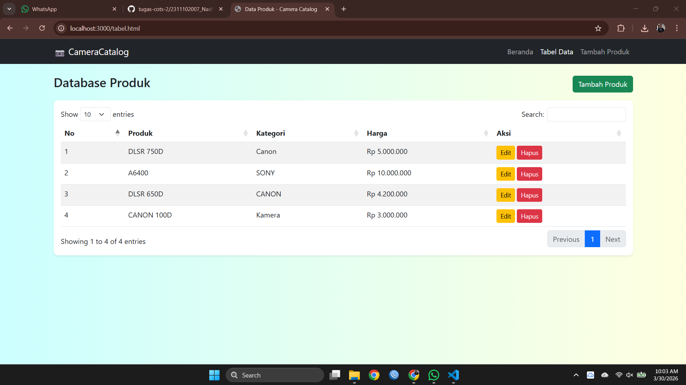
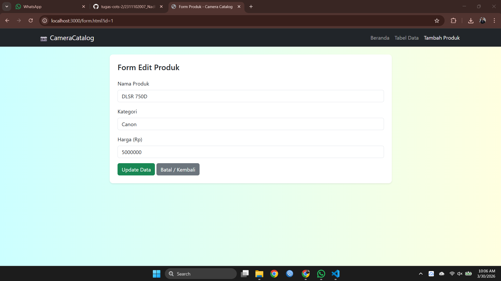
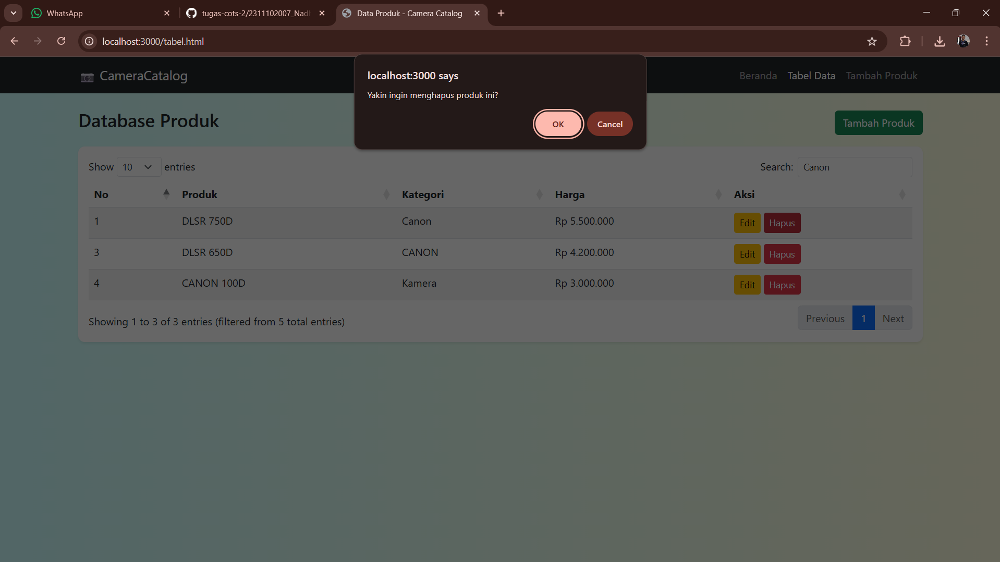
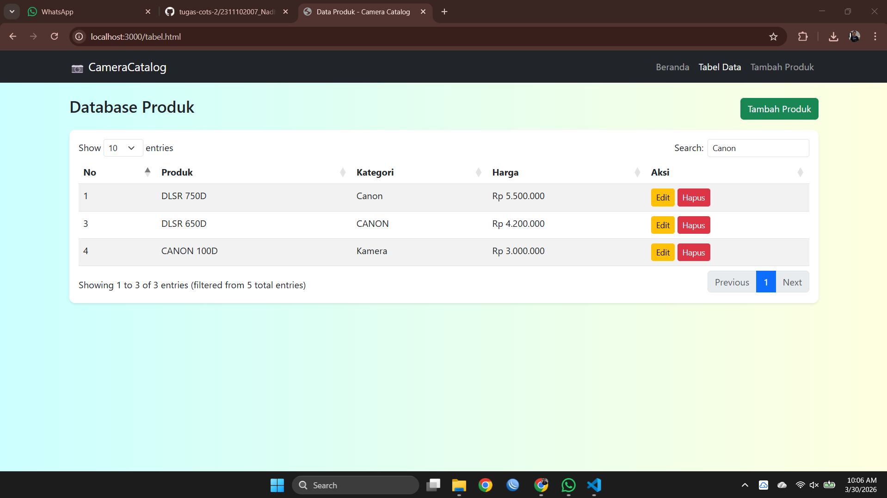

<div align="center">
  <br />
  <h1>LAPORAN PRAKTIKUM <br>APLIKASI BERBASIS PLATFORM</h1>
  <br />
  <h3>COTS-2 <br></h3>
  <br />
  <br />
  
  <br />
  <br />
  <h3>Disusun Oleh :</h3>
  <p>
    <strong>Bayu Kuncoro Adi</strong><br>
    <strong>2311102031</strong><br>
    <strong>S1 IF-11-01</strong>
  </p>
  <br />
  <br />
  <h3>Dosen Pengampu :</h3>
  <p>
    <strong>Dimas Fanny Hebrasianto Permadi, S.ST., M.Kom</strong>
  </p>
  <br />
  <br />
  <h4>Asisten Praktikum :</h4>
  <strong>Apri Pandu Wicaksono</strong> <br>
  <strong>Rangga Pradarrell Fathi</strong>
  <br />
  <h3>LABORATORIUM HIGH PERFORMANCE
 <br>FAKULTAS INFORMATIKA <br>UNIVERSITAS TELKOM PURWOKERTO <br>2026</h3>
</div>

---

## 1. Dasar Teori

**CRUD (Create, Read, Update, Delete)** merupakan empat proses dasar yang digunakan dalam pengelolaan data pada sebuah aplikasi. Dalam pengembangan aplikasi web, konsep ini memungkinkan pengguna untuk menambahkan, menampilkan, mengubah, dan menghapus data secara dinamis. Pada aplikasi web modern, implementasi CRUD biasanya melibatkan interaksi antara sisi klien (*client-side*) dan sisi server (*server-side*), sehingga data dapat disimpan dan dikelola dengan lebih sistematis.

**Bootstrap** adalah framework CSS open-source yang menyediakan berbagai komponen antarmuka siap digunakan, seperti form, tombol, modal, navbar, card, serta sistem grid yang responsif. Dengan adanya kelas-kelas utilitas yang telah terstandarisasi, Bootstrap dapat mempercepat proses pembuatan tampilan antarmuka dalam pengembangan aplikasi web.

**jQuery** merupakan library JavaScript yang dirancang untuk mempermudah manipulasi DOM, penanganan event, pembuatan animasi, serta penggunaan AJAX. Dengan sintaks yang lebih ringkas dibandingkan JavaScript native, jQuery membantu pengembang dalam membangun interaksi pada halaman web dengan lebih efisien.


**jQuery DataTables** adalah plugin yang dibangun di atas jQuery untuk meningkatkan fungsionalitas elemen `<table>` pada HTML. Dengan plugin ini, tabel dapat dilengkapi fitur seperti pencarian (*search*), pengurutan data berdasarkan kolom (*sorting*), serta pembagian halaman (*pagination*) secara otomatis. Selain itu, DataTables juga mendukung pengambilan data dalam format **JSON** melalui AJAX.

**JSON (JavaScript Object Notation)** merupakan format pertukaran data yang ringan, mudah dibaca oleh manusia, serta mudah diproses oleh sistem. JSON sering dimanfaatkan dalam pengembangan aplikasi web untuk mengirim dan menerima data antara sisi client dan server.

**Node.js** adalah lingkungan runtime JavaScript yang memungkinkan kode JavaScript dijalankan di luar browser. Dengan Node.js, developer dapat membangun aplikasi backend, menangani request HTTP, mengelola file, serta menjalankan server menggunakan JavaScript.

**Express JS** merupakan framework backend yang berjalan di atas Node.js dan digunakan untuk membangun aplikasi web maupun API dengan lebih cepat dan terstruktur. Express menyediakan fitur seperti routing, middleware, pengelolaan request dan response, serta integrasi dengan template engine. Dalam konteks aplikasi ini, Express digunakan untuk menangani proses CRUD, merender halaman EJS, serta menyediakan endpoint JSON untuk DataTables.

**EJS (Embedded JavaScript Templates)** adalah template engine yang digunakan untuk menghasilkan halaman HTML dinamis. Melalui EJS, data dari server dapat langsung ditampilkan ke halaman menggunakan sintaks seperti `<%= %>` dan `<%- %>`.

**Method Override** merupakan teknik yang memungkinkan form HTML menggunakan method selain GET dan POST, seperti PUT dan DELETE. Hal ini diperlukan karena secara default, form HTML hanya mendukung method GET dan POST.


---

## 2. Deskripsi Aplikasi

Pada tugas COTS 2 ini, aplikasi yang dikembangkan berupa Sistem Data Mahasiswa berbasis web dengan memanfaatkan Express JS, Bootstrap, jQuery, dan DataTables. Aplikasi ini dibuat untuk memenuhi persyaratan praktikum, yaitu memiliki setidaknya tiga halaman utama, menggunakan data berformat JSON untuk tabel, serta menyediakan fitur CRUD secara lengkap.

Fitur-fitur utama yang terdapat dalam aplikasi ini meliputi:

- Halaman utama (beranda)
- Halaman untuk input data mahasiswa
- Halaman yang menampilkan tabel data mahasiswa
- Halaman untuk mengedit data mahasiswa
- Fitur Create, Read, Update, dan Delete
- Tabel interaktif dengan bantuan jQuery DataTables
- Data yang ditampilkan berasal dari endpoint JSON

Data mahasiswa disimpan dalam file JSON lokal sebagai media penyimpanan sederhana, sehingga aplikasi tetap dapat dijalankan tanpa menggunakan database seperti MySQL atau MongoDB.

---

## 3. Struktur Folder Project

```bash
Tugas COTS 2/
├── server.js
├── package.json
├── package-lock.json
├── node_modules/
└── public/
    └── form.html
    └── index.html
    └── script..js
    └── style.css
    └── tabel.html

```

### Penjelasan Struktur Folder

| File / Folder | Keterangan |
|---|---|
| `server.js` | File utama backend (Node.js & Express) yang mengatur jalannya server, menyediakan API untuk operasi CRUD, dan menyajikan halaman web ke browser. |
| `package.json` | Menyimpan informasi konfigurasi proyek beserta daftar dependency (seperti Express) yang diinstal di dalam aplikasi. |
| `package-lock.json` | Mengunci versi spesifik dari setiap dependency beserta turunannya agar konsisten saat diinstal di komputer atau environment lain. |
| `node_modules/` | Folder tempat disimpannya seluruh kode dari library atau modul pihak ketiga yang diinstal melalui npm. |
| `public/` | Folder untuk menyimpan seluruh file statis (HTML, CSS, JS frontend) yang dapat diakses langsung oleh browser pengguna. |
| `public/index.html` | Halaman beranda (landing page) utama dari aplikasi web Camera Catalog. |
| `public/tabel.html` | Halaman yang berfungsi menampilkan daftar data produk dalam bentuk tabel interaktif (DataTables) beserta tombol aksi (Edit & Hapus). |
| `public/form.html` | Halaman antarmuka yang berisi formulir untuk memasukkan data produk baru (Create) atau mengubah data produk yang sudah ada (Update). |
| `public/script.js` | File JavaScript frontend yang berisi logika interaksi pengguna, seperti mengatur jQuery, DataTables, dan mengirim request (AJAX) ke server. |
| `public/style.css` | File CSS khusus (custom) untuk mengatur gaya tampilan visual web, seperti warna latar belakang atau penyesuaian layout. |

---

## 4. Cara Menjalankan Aplikasi

**1. Buka folder project di VS Code**

Pastikan Node.js sudah terinstall pada laptop.

**2. Inisialisasi project Node.js**

```bash
npm init -y
```

**3. Install dependency yang dibutuhkan**

```bash
npm install express
```

**4. Jalankan server**

```bash
npm start
```

Atau jika belum ada script `start` di `package.json`, jalankan:

```bash
node app.js
```

**5. Buka browser dan akses alamat berikut**

```
http://localhost:3000
```

---

## 5. Kode Program

### A. `server.js`

```js
const express = require('express');
const app = express();
const PORT = 3000;

app.use(express.json());
app.use(express.urlencoded({ extended: true }));
app.use(express.static('public'));

let products = [
    { id: 1, nama: 'DLSR 750D', kategori: 'Canon', harga: 5000000 },
    { id: 2, nama: 'A6400', kategori: 'SONY', harga: 10000000 },
    { id: 3, nama: 'DLSR 650D', kategori: 'CANON', harga: 4200000 }
];
let nextId = 4;

// 1. READ ALL (Untuk Tabel)
app.get('/api/products', (req, res) => res.json(products));

// 2. READ ONE (Untuk isi form saat Edit)
app.get('/api/products/:id', (req, res) => {
    const product = products.find(p => p.id === parseInt(req.params.id));
    if (product) res.json(product);
    else res.status(404).json({ message: 'Produk tidak ditemukan' });
});

// 3. CREATE
app.post('/api/products', (req, res) => {
    const { nama, kategori, harga } = req.body;
    const newProduct = { id: nextId++, nama, kategori, harga: parseInt(harga) };
    products.push(newProduct);
    res.json({ message: 'Produk berhasil ditambahkan' });
});

// 4. UPDATE
app.put('/api/products/:id', (req, res) => {
    const id = parseInt(req.params.id);
    const index = products.findIndex(p => p.id === id);
    if (index !== -1) {
        products[index] = { id, nama: req.body.nama, kategori: req.body.kategori, harga: parseInt(req.body.harga) };
        res.json({ message: 'Produk berhasil diupdate' });
    }
});

// 5. DELETE
app.delete('/api/products/:id', (req, res) => {
    products = products.filter(p => p.id !== parseInt(req.params.id));
    res.json({ message: 'Produk berhasil dihapus' });
});

app.listen(PORT, () => console.log(`Server jalan di http://localhost:${PORT}`));
```

**Penjelasan `server.js`**

Program di atas merupakan aplikasi backend sederhana menggunakan **Express.js** yang berjalan pada port 3000. Aplikasi ini berfungsi sebagai API untuk mengelola data produk yang disimpan sementara dalam array `products`. Middleware `express.json()` dan `express.urlencoded()` digunakan untuk membaca data dari request, sedangkan `express.static('public')` digunakan untuk mengakses file frontend.

Aplikasi ini menerapkan konsep CRUD. Endpoint `GET /api/products` digunakan untuk menampilkan seluruh data produk, sedangkan `GET /api/products/:id` untuk mengambil satu data berdasarkan ID (biasanya untuk keperluan edit). Endpoint `POST /api/products` digunakan untuk menambahkan produk baru dengan ID otomatis. Kemudian, `PUT /api/products/:id` digunakan untuk memperbarui data produk tertentu, dan `DELETE /api/products/:id` untuk menghapus data berdasarkan ID. Saat server dijalankan, aplikasi dapat diakses melalui `http://localhost:3000`.


---

### B. Frontend `public/index.html`

``html
<!DOCTYPE html>
<html lang="id">
<head>
    <meta charset="UTF-8">
    <title>Beranda - Camera Catalog</title>
    <link href="https://cdn.jsdelivr.net/npm/bootstrap@5.3.0/dist/css/bootstrap.min.css" rel="stylesheet">
    <link rel="stylesheet" href="style.css">
</head>
<body>
    <nav class="navbar navbar-expand-lg navbar-dark bg-dark mb-4">
        <div class="container">
            <a class="navbar-brand" href="index.html">📷 CameraCatalog</a>
            <div class="navbar-nav">
                <a class="nav-link active" href="index.html">Beranda</a>
                <a class="nav-link" href="tabel.html">Tabel Data</a>
                <a class="nav-link" href="form.html">Tambah Produk</a>
            </div>
        </div>
    </nav>

    <div class="container text-center mt-5">
        <div class="card shadow-sm p-5">
            <h1 class="text-primary">Selamat Datang di Sistem Katalog Kamera</h1>
            <p class="lead">Aplikasi manajemen produk dengan fitur CRUD menggunakan Node.js, Express, dan DataTables.</p>
            <div class="mt-4">
                <a href="tabel.html" class="btn btn-primary btn-lg mx-2">Lihat Database</a>
                <a href="form.html" class="btn btn-outline-primary btn-lg mx-2">Tambah Data Baru</a>
            </div>
        </div>
    </div>
</body>
</html>
```

**Penjelasan `index.html`**

Kode HTML di atas merupakan halaman **beranda (index)** dari aplikasi *Camera Catalog* yang dibuat menggunakan **Bootstrap** untuk tampilan antarmuka. Pada bagian `<head>`, terdapat pengaturan metadata, judul halaman, serta pemanggilan CSS Bootstrap dan file `style.css` untuk styling tambahan.

Di bagian `<body>`, terdapat **navbar** berwarna gelap yang berisi navigasi ke tiga halaman utama, yaitu Beranda, Tabel Data, dan Tambah Produk. Bagian utama halaman menampilkan sebuah **card** di tengah layar yang berisi judul sambutan, deskripsi tugas, serta dua tombol aksi. Tombol tersebut mengarahkan pengguna ke halaman tabel data untuk melihat database produk dan ke halaman form untuk menambahkan data baru. Tampilan ini dirancang sederhana, responsif, dan user-friendly.


---

### C. FrontEnd `public/tabel.html`

```html
<!DOCTYPE html>
<html lang="id">
<head>
    <meta charset="UTF-8">
    <title>Data Produk - Camera Catalog</title>
    <link href="https://cdn.jsdelivr.net/npm/bootstrap@5.3.0/dist/css/bootstrap.min.css" rel="stylesheet">
    <link rel="stylesheet" href="https://cdn.datatables.net/1.13.6/css/dataTables.bootstrap5.min.css">
    <link rel="stylesheet" href="style.css">
</head>
<body>
    <nav class="navbar navbar-expand-lg navbar-dark bg-dark mb-4">
        <div class="container">
            <a class="navbar-brand" href="index.html">📷 CameraCatalog</a>
            <div class="navbar-nav">
                <a class="nav-link" href="index.html">Beranda</a>
                <a class="nav-link active" href="tabel.html">Tabel Data</a>
                <a class="nav-link" href="form.html">Tambah Produk</a>
            </div>
        </div>
    </nav>

    <div class="container">
        <div class="d-flex justify-content-between align-items-center mb-3">
            <h3>Database Produk</h3>
            <a href="form.html" class="btn btn-success">Tambah Produk</a>
        </div>
        <div class="card shadow-sm p-3">
            <table id="productTable" class="table table-striped w-100">
                <thead>
                    <tr>
                        <th>No</th>
                        <th>Produk</th>
                        <th>Kategori</th>
                        <th>Harga</th>
                        <th>Aksi</th>
                    </tr>
                </thead>
                <tbody></tbody>
            </table>
        </div>
    </div>

    <script src="https://code.jquery.com/jquery-3.7.0.min.js"></script>
    <script src="https://cdn.datatables.net/1.13.6/js/jquery.dataTables.min.js"></script>
    <script src="https://cdn.datatables.net/1.13.6/js/dataTables.bootstrap5.min.js"></script>
    <script>
        $(document).ready(function() {
            let table = $('#productTable').DataTable({
                ajax: { url: '/api/products', dataSrc: '' },
                columns: [
                    { data: 'id' },
                    { data: 'nama' },
                    { data: 'kategori' },
                    { data: 'harga', render: data => 'Rp ' + data.toLocaleString('id-ID') },
                    {
                        data: 'id',
                        render: function(data) {
                            // Link ke form.html dengan membawa parameter ID
                            return `
                                <a href="form.html?id=${data}" class="btn btn-warning btn-sm">Edit</a>
                                <button class="btn btn-danger btn-sm btn-delete" data-id="${data}">Hapus</button>
                            `;
                        }
                    }
                ]
            });

            // Logika Hapus Data
            $('#productTable').on('click', '.btn-delete', function() {
                const id = $(this).data('id');
                if (confirm('Yakin ingin menghapus produk ini?')) {
                    $.ajax({
                        url: `/api/products/${id}`,
                        type: 'DELETE',
                        success: function() { table.ajax.reload(); }
                    });
                }
            });
        });
    </script>
</body>
</html>
```

**Penjelasan `mahasiswa.json`**

Kode HTML di atas merupakan halaman **tabel data produk** pada aplikasi *Camera Catalog* yang menampilkan daftar produk secara interaktif menggunakan **Bootstrap**, **jQuery**, dan **DataTables**. Pada bagian `<head>`, ditambahkan CSS Bootstrap dan DataTables untuk mendukung tampilan tabel yang responsif dan menarik.

Di bagian `<body>`, terdapat navbar untuk navigasi serta bagian utama yang menampilkan judul “Database Produk”, tombol tambah produk, dan sebuah tabel. Tabel ini memiliki kolom nomor, nama produk, kategori, harga, serta aksi.

Pada bagian `<script>`, digunakan jQuery untuk menginisialisasi DataTables dengan mengambil data dari endpoint `/api/products` dalam format JSON. Data yang diterima kemudian ditampilkan ke dalam tabel, termasuk format harga dalam Rupiah. Pada kolom aksi, tersedia tombol **Edit** yang mengarah ke halaman form dengan membawa ID produk, serta tombol **Hapus**. Fitur hapus menggunakan AJAX dengan method DELETE, dan setelah data dihapus, tabel akan diperbarui secara otomatis tanpa reload halaman.


---

### D. FrontEnd `public/form.html`

```html
<!DOCTYPE html>
<html lang="id">
<head>
    <meta charset="UTF-8">
    <title>Form Produk - Camera Catalog</title>
    <link href="https://cdn.jsdelivr.net/npm/bootstrap@5.3.0/dist/css/bootstrap.min.css" rel="stylesheet">
    <link rel="stylesheet" href="style.css">
</head>
<body>
    <nav class="navbar navbar-expand-lg navbar-dark bg-dark mb-4">
        <div class="container">
            <a class="navbar-brand" href="index.html">📷 CameraCatalog</a>
            <div class="navbar-nav">
                <a class="nav-link" href="index.html">Beranda</a>
                <a class="nav-link" href="tabel.html">Tabel Data</a>
                <a class="nav-link active" href="form.html" id="navFormTitle">Tambah Produk</a>
            </div>
        </div>
    </nav>

    <div class="container">
        <div class="card shadow-sm col-md-8 mx-auto p-4">
            <h4 class="mb-4" id="formTitle">Form Tambah Produk</h4>
            <form id="productForm">
                <div class="mb-3">
                    <label class="form-label">Nama Produk</label>
                    <input type="text" class="form-control" id="nama" required>
                </div>
                <div class="mb-3">
                    <label class="form-label">Kategori</label>
                    <input type="text" class="form-control" id="kategori" required>
                </div>
                <div class="mb-3">
                    <label class="form-label">Harga (Rp)</label>
                    <input type="number" class="form-control" id="harga" required>
                </div>
                <button type="submit" class="btn btn-primary" id="saveBtn">Simpan Data</button>
                <a href="tabel.html" class="btn btn-secondary">Batal / Kembali</a>
            </form>
        </div>
    </div>

    <script src="https://code.jquery.com/jquery-3.7.0.min.js"></script>
    <script>
        $(document).ready(function() {
            // Cek apakah URL memiliki parameter '?id=' (Berarti sedang mode Edit)
            const urlParams = new URLSearchParams(window.location.search);
            const editId = urlParams.get('id');

            if (editId) {
                $('#formTitle').text('Form Edit Produk');
                $('#saveBtn').text('Update Data').removeClass('btn-primary').addClass('btn-success');
                
                // Ambil data produk spesifik dari backend untuk mengisi form
                $.get(`/api/products/${editId}`, function(data) {
                    $('#nama').val(data.nama);
                    $('#kategori').val(data.kategori);
                    $('#harga').val(data.harga);
                });
            }

            // Submit Form (Create atau Update)
            $('#productForm').submit(function(e) {
                e.preventDefault();
                
                const productData = {
                    nama: $('#nama').val(),
                    kategori: $('#kategori').val(),
                    harga: $('#harga').val()
                };

                const ajaxUrl = editId ? `/api/products/${editId}` : '/api/products';
                const ajaxMethod = editId ? 'PUT' : 'POST';

                $.ajax({
                    url: ajaxUrl,
                    type: ajaxMethod,
                    data: productData,
                    success: function() {
                        alert(editId ? 'Data berhasil diupdate!' : 'Data berhasil ditambahkan!');
                        window.location.href = 'tabel.html'; // Pindah ke halaman tabel setelah sukses
                    }
                });
            });
        });
    </script>
</body>
</html>
```

**Penjelasan `form.html`**

Kode HTML di atas merupakan halaman **form produk** pada aplikasi *Camera Catalog* yang digunakan untuk menambahkan dan mengedit data produk. Tampilan dibuat menggunakan **Bootstrap**, dengan struktur berupa navbar untuk navigasi dan sebuah card di tengah halaman yang berisi form input.

Form ini memiliki tiga input utama, yaitu nama produk, kategori, dan harga, serta tombol untuk menyimpan data dan kembali ke halaman tabel. Menggunakan jQuery, halaman ini dapat mendeteksi apakah sedang dalam mode tambah atau edit melalui parameter `id` pada URL. Jika terdapat `id`, maka form akan otomatis berubah menjadi mode edit, mengambil data dari endpoint `/api/products/:id`, dan mengisi field yang tersedia.

Saat form dikirim, data akan diproses menggunakan AJAX. Jika dalam mode tambah, data dikirim menggunakan method POST, sedangkan pada mode edit menggunakan PUT. Setelah proses berhasil, akan muncul notifikasi dan pengguna diarahkan kembali ke halaman tabel data.


## 6. Alur CRUD Aplikasi

### 1. Create
Pengguna membuka halaman form input, mengisi data mahasiswa, lalu menekan tombol **Simpan**. Data dikirim ke server melalui method `POST` dan disimpan ke file `mahasiswa.json`.

### 2. Read
Pengguna membuka halaman data mahasiswa. Tabel mengambil data JSON dari endpoint `/api/mahasiswa` dan menampilkannya melalui jQuery DataTables dengan fitur pencarian, sorting, dan pagination.

### 3. Update
Pengguna menekan tombol **Edit** pada tabel. Sistem menampilkan halaman edit berisi data lama yang sudah terisi. Setelah diperbarui, data dikirim ke server dengan method `PUT`.

### 4. Delete
Pengguna menekan tombol **Hapus** pada tabel. Setelah konfirmasi, data dikirim ke server menggunakan method `DELETE` dan dihapus dari file JSON.

---

## 7. Screenshot Website

1. Tampilan Beranda

2. Halaman Form Tambah Produk


3. Database Data

4. Halaman Edit Produk

5. Hasil Update / Edit Data

6. Proses Hapus Data

7. Searching

---

## 8. Kesimpulan

Aplikasi "Camera Product Catalog" ini merupakan sebuah web sistem manajemen data berbasis Client-Server yang dirancang khusus untuk memenuhi spesifikasi Tugas 2 Praktikum. Sistem ini memisahkan logika backend dan antarmuka frontend secara rapi. Pada sisi server, aplikasi menggunakan Node.js dengan framework Express untuk membangun REST API yang mengelola operasi CRUD (Create, Read, Update, Delete) dan menyajikan data murni dalam format JSON. Pada sisi client, antarmuka dibangun menggunakan HTML, CSS kustom, dan Bootstrap agar tampil modern serta responsif. Aplikasi ini secara utuh terbagi menjadi tiga halaman fungsional utama—yaitu Beranda, Tabel Data, dan Form—yang saling terhubung melalui navigasi. Untuk interaktivitasnya, sistem ini sangat mengandalkan jQuery untuk komunikasi AJAX (mengirim dan menerima data dari server tanpa reload halaman penuh), serta memanfaatkan plugin DataTables untuk merender data JSON tersebut ke dalam format tabel yang dinamis, lengkap dengan fitur pencarian dan paginasi. Secara keseluruhan, arsitektur ini telah menjawab dan memenuhi seluruh kriteria teknis yang diwajibkan.

---

## 9. Referensi

1. https://expressjs.com
2. https://nodejs.org
3. https://getbootstrap.com/docs/5.3/getting-started/introduction/
4. https://datatables.net/manual/ajax
5. https://api.jquery.com/category/ajax/

## 10. Link Video Presentasi
https://drive.google.com/drive/folders/1ZdFmzgClXlRth7sXkQxOFqbW-itYm-Ju?usp=sharing

