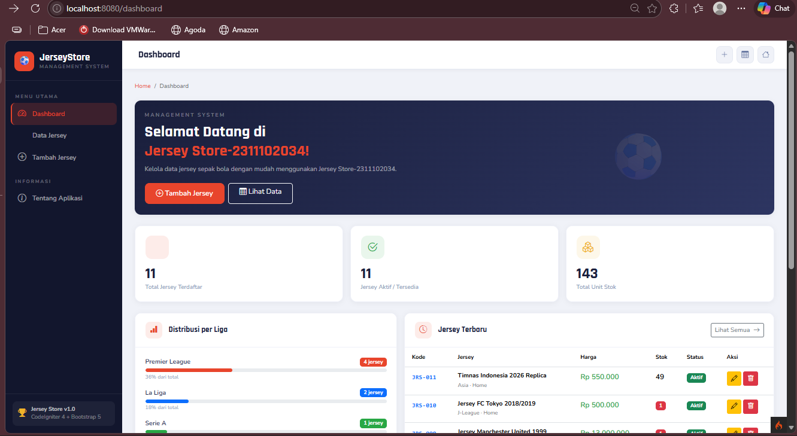
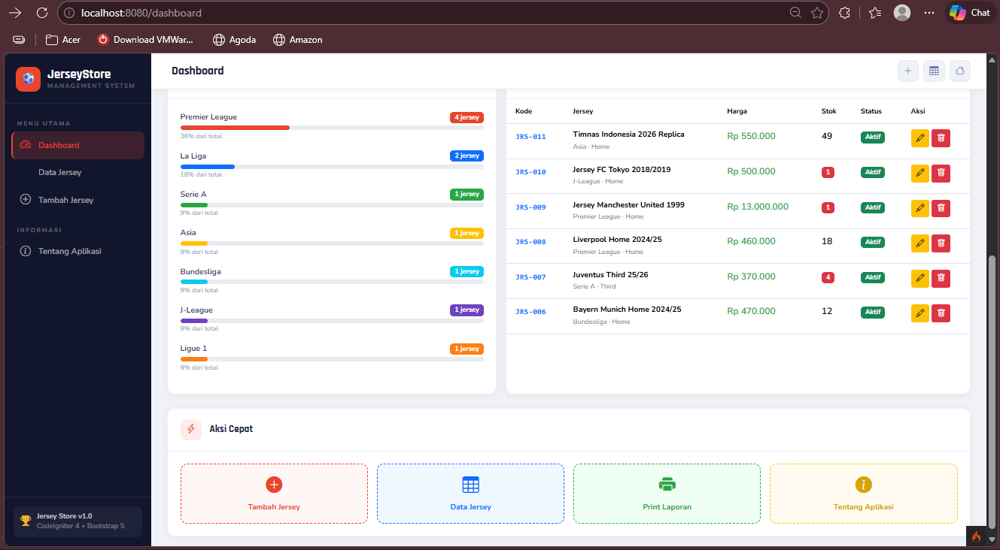
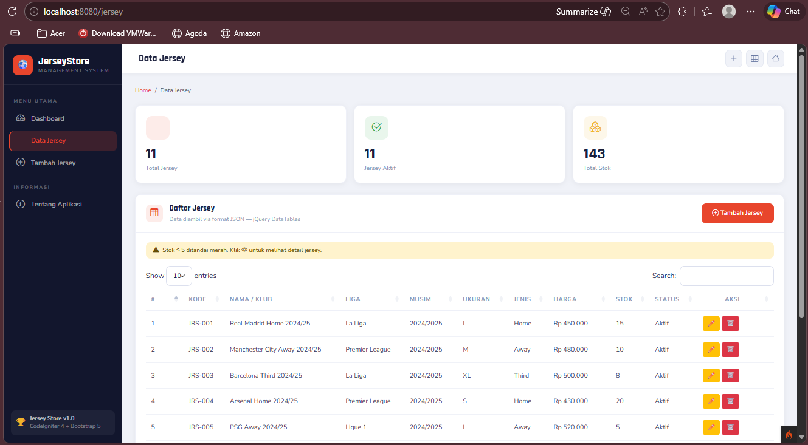
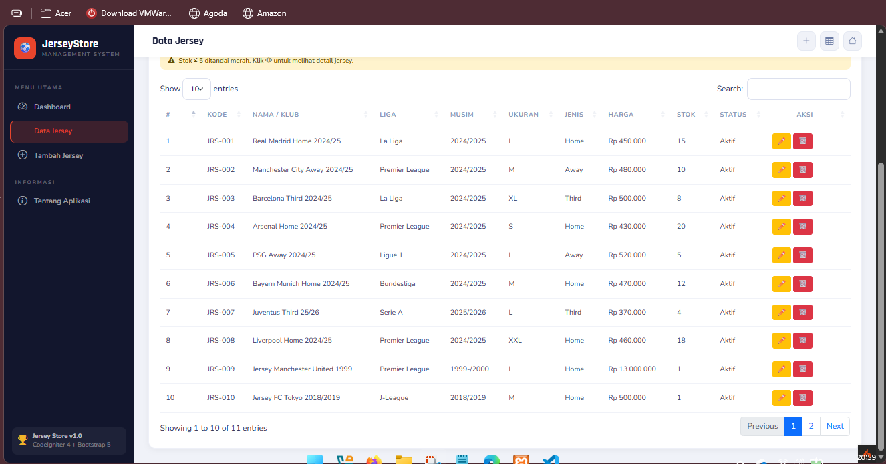
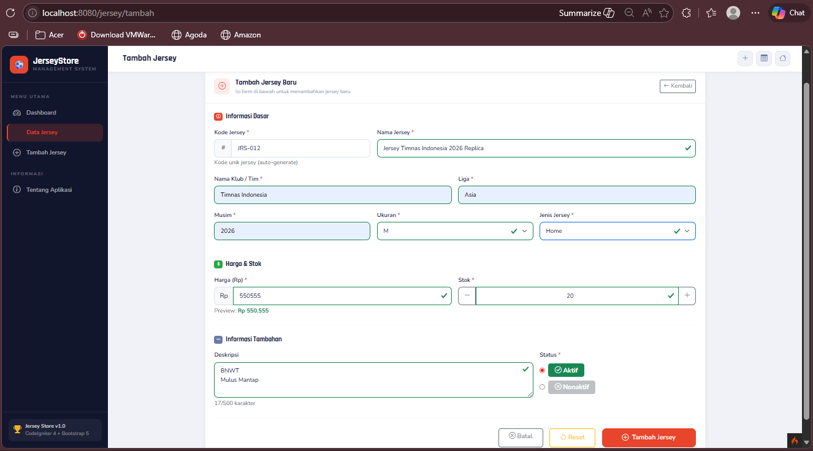
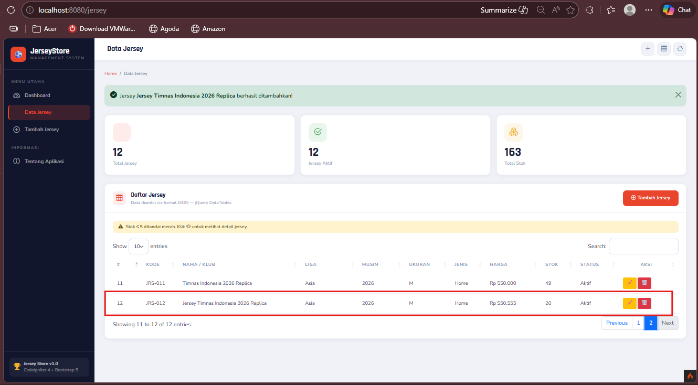
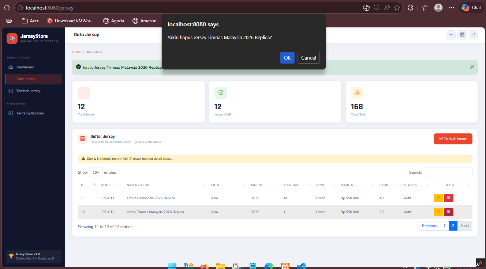

<div align="center">
  <br />
  <h1>LAPORAN PRAKTIKUM <br>APLIKASI BERBASIS PLATFORM</h1>
  <br />
  <h3>TUGAS COTS2 <br> WEB MANAGEMENT JERSEY  </h3>
  <br />
   
  <br />
  <br />
  <br />
  <h3>Disusun Oleh :</h3>
  <p>
    <strong>Rizal Dwi Anggoro</strong><br>
    <strong>2311102034</strong><br>
    <strong>IF-11-REG01</strong>
  </p>
  <br />
  <h3>Dosen Pengampu :</h3>
  <p>
    <strong>Dimas Fanny Hebrasianto Permadi, S.ST., M.Kom</strong>
  </p>
  <br />
  <br />
    <h4>Asisten Praktikum :</h4>
    <strong> Apri Pandu Wicaksono </strong> <br>
    <strong>Rangga Pradarrell Fathi</strong>
  <br />
  <h3>LABORATORIUM HIGH PERFORMANCE
 <br>FAKULTAS INFORMATIKA <br>UNIVERSITAS TELKOM PURWOKERTO <br>2026</h3>
</div>

---
## 1. DASAR MATERI
### 1.1 CodeIgniter 4 :

CodeIgniter 4 adalah framework PHP yang digunakan untuk membangun aplikasi web dengan konsep MVC (Model, View, Controller).
Framework ini membantu developer dalam membuat aplikasi lebih terstruktur, cepat, dan mudah dikembangkan.

### 1.2 MVC

MVC (Model, View, Controller) adalah arsitektur yang memisahkan antara data, tampilan, dan logika aplikasi.
Model mengelola data, View menampilkan data, dan Controller mengatur alur aplikasi.

### 1.3 CRUD

MVC (Model, View, Controller) adalah arsitektur yang memisahkan antara data, tampilan, dan logika aplikasi.
Model mengelola data, View menampilkan data, dan Controller mengatur alur aplikasi

### 1.4 MySQL

MySQL adalah sistem manajemen database yang digunakan untuk menyimpan data secara terstruktur.
Dalam aplikasi ini digunakan untuk menyimpan data jersey.

### 1.5 Bootstrap 5

Bootstrap adalah framework CSS yang digunakan untuk membuat tampilan web menjadi responsif dan menarik dengan cepat.

### 1.6 jQuery & DataTables

jQuery adalah library JavaScript yang mempermudah manipulasi HTML dan AJAX.
Sedangkan DataTables digunakan untuk membuat tabel menjadi interaktif dengan fitur pencarian, pagination, dan sorting.

---
## 2. PENJELASAN CODE

### 2.1 Struktur Folder

```
JerseyStore-2311102034/
│
├── app/
│   ├── Config/
│   │   ├── App.php
│   │   ├── Database.php
│   │   ├── Filters.php
│   │   └── Routes.php
│   │
│   ├── Controllers/
│   │   │
│   │   ├── Dashboard.php
│   │   └── Jersey.php
│   │
│   ├── Models/
│   │   └── JerseyModel.php
│   │
│   ├── Views/
│      ├── layouts/
│      │   ├── header.php
│      │   └── footer.php
│      │
│      ├── dashboard/
│      │   └── index.php
│      │
│      └── jersey/
│          ├── index.php
│          └── form.php
|
│
├── database.sql    ← file database

```

### 2.2 File App.php


File ini digunakan untuk mengatur konfigurasi dasar aplikasi seperti URL, timezone, session, dan keamanan.

- $baseURL → menentukan alamat utama aplikasi
- $allowedHostnames → keamanan host
- $appTimezone → zona waktu (Asia/Jakarta)
- Session & cookie → mengatur penyimpanan sesi user

Fungsi utama:
Pusat konfigurasi agar aplikasi dapat berjalan dengan stabil dan sesuai kebutuhan.

```php
<?php

namespace Config;

use CodeIgniter\Config\BaseConfig;

class App extends BaseConfig
{
    public string $baseURL = 'http://localhost:8080/';

    public array $allowedHostnames = [];
    public bool $CSPEnabled = false;

    public string $indexPage = '';

    public string $uriProtocol = 'REQUEST_URI';

    public string $defaultLocale = 'id';
    public bool   $negotiateLocale = false;
    public string $supportedLocales = 'id';

    public string $appTimezone = 'Asia/Jakarta';
    public string $charset     = 'UTF-8';

    public bool $forceGlobalSecureRequests = false;

    public string $sessionDriver            = 'CodeIgniter\Session\Handlers\FileHandler';
    public string $sessionCookieName        = 'ci_session';
    public int    $sessionExpiration        = 7200;
    public string $sessionSavePath          = WRITEPATH . 'session';
    public bool   $sessionMatchIP           = false;
    public int    $sessionTimeToUpdate      = 300;
    public bool   $sessionRegenerateDestroy = false;

    public string $cookiePrefix   = '';
    public string $cookieDomain   = '';
    public string $cookiePath     = '/';
    public bool   $cookieSecure   = false;
    public bool   $cookieHTTPOnly = false;
    public string $cookieSameSite = 'Lax';

    public array $proxyIPs = [];

    public string $CSRFTokenName  = 'csrf_test_name';
    public string $CSRFHeaderName = 'X-CSRF-TOKEN';
    public string $CSRFCookieName = 'csrf_cookie_name';
    public int    $CSRFExpire     = 7200;
    public bool   $CSRFRegenerate = true;
    public bool   $CSRFSamesite   = false;

    // sementara dimatikan buat development
    public string $CSRFProtection = '';
}
```

### 2.3 File Database.php

File ini digunakan untuk menghubungkan aplikasi dengan database MySQL.

- hostname → alamat server database (localhost)
- username & password → akses database
- database → nama database (db_jersey_store)
- DBDriver → driver yang digunakan (MySQLi)

Fungsi utama:
Sebagai penghubung antara aplikasi dan database.

```php
<?php

namespace Config;

use CodeIgniter\Database\Config;

class Database extends Config
{
    public string $filesPath = APPPATH . 'Database' . DIRECTORY_SEPARATOR;

    public string $defaultGroup = 'default';

    // ─── Konfigurasi koneksi database utama ───
    // Sesuaikan username, password, dan database dengan milik Anda
    public array $default = [
        'DSN'      => '',
        'hostname' => 'localhost',
        'username' => 'root',      
        'password' => '',          
        'database' => 'db_jersey_store', 
        'DBDriver' => 'MySQLi',
        'DBPrefix' => '',
        'pConnect' => false,
        'DBDebug'  => true,
        'charset'  => 'utf8mb4',
        'DBCollat' => 'utf8mb4_unicode_ci',
        'swapPre'  => '',
        'encrypt'  => false,
        'compress' => false,
        'strictOn' => false,
        'failover' => [],
        'port'     => 3306,
    ];

    public array $tests = [
        'DSN'      => '',
        'hostname' => '127.0.0.1',
        'username' => 'root',
        'password' => '',
        'database' => 'db_jersey_store_test',
        'DBDriver' => 'MySQLi',
        'DBPrefix' => 'test_',
        'pConnect' => false,
        'DBDebug'  => true,
        'charset'  => 'utf8mb4',
        'DBCollat' => 'utf8mb4_unicode_ci',
        'swapPre'  => '',
        'encrypt'  => false,
        'compress' => false,
        'strictOn' => false,
        'failover' => [],
        'port'     => 3306,
    ];
}
```

### 2.4 File Routes.php

File ini digunakan untuk mengatur URL dan menghubungkannya dengan controller.

Contoh:

- /jersey → menampilkan data jersey
- /jersey/tambah → form tambah
- /jersey/edit/{id} → edit data
- /jersey/hapus/{id} → hapus data
- /jersey/json → endpoint DataTables

Fungsi utama:
Mengatur alur navigasi aplikasi.

```php
<?php

use CodeIgniter\Router\RouteCollection;

/**
 * Routes - Jersey Store CI4
 */

/** @var RouteCollection $routes */

// ─── Default (redirect ke dashboard) ───
$routes->get('/', 'Dashboard::index');

// ─── Dashboard ───
$routes->get('dashboard', 'Dashboard::index');

// ─── Jersey CRUD ───
$routes->get('jersey',                'Jersey::index');

$routes->get('jersey/json',           'Jersey::json');  
$routes->post('jersey/json',          'Jersey::json');

$routes->get('jersey/tambah',         'Jersey::tambah');
$routes->post('jersey/simpan',        'Jersey::simpan');
$routes->get('jersey/edit/(:num)',    'Jersey::edit/$1');
$routes->post('jersey/update/(:num)', 'Jersey::update/$1');
$routes->post('jersey/hapus/(:num)',  'Jersey::hapus/$1');
$routes->get('jersey/detail/(:num)',  'Jersey::detail/$1');
```

### 2.5 File Filters.php

File ini mengatur filter keamanan dan proses sebelum/sesudah request.

CSRF → keamanan form
Debug Toolbar → debugging
Filter global before & after

Fungsi utama:
Menjaga keamanan dan membantu debugging aplikasi.

```php
<?php

namespace Config;

use CodeIgniter\Config\BaseConfig;
use CodeIgniter\Filters\CSRF;
use CodeIgniter\Filters\DebugToolbar;
use CodeIgniter\Filters\Honeypot;
use CodeIgniter\Filters\InvalidChars;
use CodeIgniter\Filters\SecureHeaders;

class Filters extends BaseConfig
{
    public array $aliases = [
        'csrf'          => CSRF::class,
        'toolbar'       => DebugToolbar::class,
        'honeypot'      => Honeypot::class,
        'invalidchars'  => InvalidChars::class,
        'secureheaders' => SecureHeaders::class,
    ];

    public array $globals = [
        'before' => [
            // 'honeypot',
            // 'csrf',        ← dinonaktifkan untuk development
            // 'invalidchars',
        ],
        'after' => [
            'toolbar',
            // 'honeypot',
            // 'secureheaders',
        ],
    ];

    public array $methods = [];
    public array $filters = [];
}
```

### 2.6 File Dashboard.php

Controller ini mengatur halaman dashboard.

- Mengambil data dari model:
  - total jersey
  - total aktif
  - total stok
  - statistik liga
  - Mengirim data ke view

Fungsi utama:
Menampilkan ringkasan data pada dashboard.

```php
<?php

namespace App\Controllers;

use App\Models\JerseyModel;

/**
 * Dashboard Controller — CI4
 */
class Dashboard extends BaseController
{
    public function index(): string
    {
        $model = new JerseyModel();

        $data = [
            'title'          => 'Dashboard',
            'activeMenu'     => 'dashboard',
            'totalJersey'    => $model->countAll(),
            'totalAktif'     => $model->countAktif(),
            'totalStok'      => $model->totalStok(),
            'ligaStats'      => $model->getLigaStats(),
            'jerseysTerbaru' => $model->orderBy('id', 'DESC')->findAll(6),
        ];

        return view('layouts/header', $data)
             . view('dashboard/index', $data)
             . view('layouts/footer');
    }
}
```

### 2.7 File Jersey.php

Controller utama untuk CRUD data jersey.

- index() → tampilkan halaman utama
- json() → kirim data JSON untuk DataTables
- tambah() → tampilkan form
- simpan() → insert data
- edit() → form edit
- update() → update data
- hapus() → delete data
- detail() → detail AJAX

Fungsi utama:
Mengatur seluruh proses CRUD.

```php
<?php

namespace App\Controllers;

use App\Models\JerseyModel;
use CodeIgniter\Controller;

/**
 * Jersey Controller — CI4
 *
 * CRUD lengkap untuk data jersey
 * Halaman:
 *  index()  → Tabel DataTable (JSON)
 *  tambah() → Form tambah jersey
 *  simpan() → Proses create (POST)
 *  edit()   → Form edit jersey
 *  update() → Proses update (POST)
 *  hapus()  → Proses delete (AJAX)
 *  detail() → Detail jersey (AJAX Modal)
 *  json()   → Endpoint JSON untuk DataTable
 */
class Jersey extends BaseController
{
    protected JerseyModel $model;

    public function __construct()
    {
        // Model di-load di initController CI4
    }

    public function initController(
        \CodeIgniter\HTTP\RequestInterface $request,
        \CodeIgniter\HTTP\ResponseInterface $response,
        \Psr\Log\LoggerInterface $logger
    ) {
        parent::initController($request, $response, $logger);
        $this->model = new JerseyModel();
    }

    // ═══════════════════════════════════════════════════════════
    // HALAMAN 1: Tabel Data Jersey
    // ═══════════════════════════════════════════════════════════
    public function index(): string
    {
        $data = [
            'title'       => 'Data Jersey',
            'activeMenu'  => 'jersey',
            'total'       => $this->model->countAll(),
            'totalAktif'  => $this->model->countAktif(),
            'totalStok'   => $this->model->totalStok(),
        ];
        return view('layouts/header', $data)
             . view('jersey/index', $data)
             . view('layouts/footer');
    }

    // ═══════════════════════════════════════════════════════════
    // ENDPOINT JSON untuk jQuery DataTable
    // ═══════════════════════════════════════════════════════════
    public function json()
    {
        $request = service('request');

        $dataJersey = $this->model->findAll();

        $data = [];
        $no = 1;

        foreach ($dataJersey as $row) {

            $aksi = '
                <a href="' . base_url('jersey/edit/' . $row->id) . '" class="btn btn-sm btn-warning">
                    ✏️
                </a>
                <button class="btn btn-sm btn-danger btn-hapus"
                    data-id="' . $row->id . '"
                    data-nama="' . $row->nama . '">
                    🗑️
                </button>
            ';

            $data[] = [
                $no++,
                $row->kode,
                $row->nama,
                $row->liga,
                $row->musim,
                $row->ukuran,
                $row->jenis,
                'Rp ' . number_format($row->harga, 0, ',', '.'),
                $row->stok,
                $row->status,
                $aksi
            ];
        }

        return $this->response->setJSON([
            "draw" => intval($request->getPost('draw')),
            "recordsTotal" => count($data),
            "recordsFiltered" => count($data),
            "data" => $data
        ]);
    }

    // ═══════════════════════════════════════════════════════════
    // HALAMAN 2: Form Tambah Jersey (CREATE)
    // ═══════════════════════════════════════════════════════════
    public function tambah(): string
    {
        $data = [
            'title'      => 'Tambah Jersey',
            'activeMenu' => 'jersey',
            'autoKode'   => $this->model->generateKode(),
            'formAction' => base_url('jersey/simpan'),
            'mode'       => 'tambah',
            'jersey'     => null,
            'errors'     => [],
        ];
        return view('layouts/header', $data)
             . view('jersey/form', $data)
             . view('layouts/footer');
    }

    // ═══════════════════════════════════════════════════════════
    // PROSES: Simpan Data Baru (POST)
    // ═══════════════════════════════════════════════════════════
    public function simpan(): \CodeIgniter\HTTP\RedirectResponse|string
    {
        // Validasi input
        $rules = $this->_validationRules();
        if (!$this->validate($rules)) {
            $data = [
                'title'      => 'Tambah Jersey',
                'activeMenu' => 'jersey',
                'autoKode'   => $this->request->getPost('kode'),
                'formAction' => base_url('jersey/simpan'),
                'mode'       => 'tambah',
                'jersey'     => (object)$this->request->getPost(),
                'errors'     => $this->validator->getErrors(),
            ];
            return view('layouts/header', $data)
                 . view('jersey/form', $data)
                 . view('layouts/footer');
        }

        $this->model->skipValidation(true)->insert($this->_getFormData());
        return redirect()->to(base_url('jersey'))
            ->with('success', 'Jersey <strong>' . $this->request->getPost('nama') . '</strong> berhasil ditambahkan!');
    }

    // ═══════════════════════════════════════════════════════════
    // HALAMAN 3: Form Edit Jersey (UPDATE)
    // ═══════════════════════════════════════════════════════════
    public function edit(int $id): \CodeIgniter\HTTP\RedirectResponse|string
    {
        $jersey = $this->model->find($id);
        if (!$jersey) {
            return redirect()->to(base_url('jersey'))->with('error', 'Data jersey tidak ditemukan!');
        }

        $data = [
            'title'      => 'Edit Jersey',
            'activeMenu' => 'jersey',
            'autoKode'   => $jersey->kode,
            'formAction' => base_url('jersey/update/' . $id),
            'mode'       => 'edit',
            'jersey'     => $jersey,
            'errors'     => [],
        ];
        return view('layouts/header', $data)
             . view('jersey/form', $data)
             . view('layouts/footer');
    }

    // ═══════════════════════════════════════════════════════════
    // PROSES: Update Data (POST)
    // ═══════════════════════════════════════════════════════════
    public function update(int $id): \CodeIgniter\HTTP\RedirectResponse|string
    {
        $jersey = $this->model->find($id);
        if (!$jersey) {
            return redirect()->to(base_url('jersey'))->with('error', 'Data tidak ditemukan!');
        }

        $rules = $this->_validationRules();
        if (!$this->validate($rules)) {
            $data = [
                'title'      => 'Edit Jersey',
                'activeMenu' => 'jersey',
                'autoKode'   => $this->request->getPost('kode'),
                'formAction' => base_url('jersey/update/' . $id),
                'mode'       => 'edit',
                'jersey'     => (object)array_merge((array)$jersey, $this->request->getPost()),
                'errors'     => $this->validator->getErrors(),
            ];
            return view('layouts/header', $data)
                 . view('jersey/form', $data)
                 . view('layouts/footer');
        }

        $this->model->skipValidation(true)->update($id, $this->_getFormData());
        return redirect()->to(base_url('jersey'))
            ->with('success', 'Jersey <strong>' . $this->request->getPost('nama') . '</strong> berhasil diperbarui!');
    }

    // ═══════════════════════════════════════════════════════════
    // PROSES: Hapus Data (DELETE via AJAX)
    // ═══════════════════════════════════════════════════════════
    public function hapus(int $id): \CodeIgniter\HTTP\Response|\CodeIgniter\HTTP\RedirectResponse
    {
        $jersey = $this->model->find($id);

        if (!$jersey) {
            if ($this->request->isAJAX()) {
                return $this->response->setJSON(['status' => 'error', 'message' => 'Data tidak ditemukan!']);
            }
            return redirect()->to(base_url('jersey'))->with('error', 'Data tidak ditemukan!');
        }

        $this->model->delete($id);

        if ($this->request->isAJAX()) {
            return $this->response->setJSON([
                'status'  => 'success',
                'message' => 'Jersey <strong>' . esc($jersey->nama) . '</strong> berhasil dihapus!',
            ]);
        }
        return redirect()->to(base_url('jersey'))->with('success', 'Jersey berhasil dihapus!');
    }

    // ═══════════════════════════════════════════════════════════
    // AJAX: Detail Jersey untuk Modal
    // ═══════════════════════════════════════════════════════════
    public function detail(int $id): \CodeIgniter\HTTP\Response
    {
        $jersey = $this->model->find($id);
        if (!$jersey) {
            return $this->response->setJSON(['status' => 'error', 'message' => 'Data tidak ditemukan']);
        }
        return $this->response->setJSON(['status' => 'success', 'data' => $jersey]);
    }

    // ─────────────────────────────────────────
    // PRIVATE HELPERS
    // ─────────────────────────────────────────
    private function _validationRules(): array
    {
        return [
            'nama'   => 'required|min_length[3]|max_length[150]',
            'klub'   => 'required|max_length[100]',
            'liga'   => 'required|max_length[100]',
            'musim'  => 'required|max_length[20]',
            'ukuran' => 'required|in_list[S,M,L,XL,XXL]',
            'jenis'  => 'required|in_list[Home,Away,Third,GK,Training]',
            'harga'  => 'required|numeric|greater_than[0]',
            'stok'   => 'required|integer|greater_than_equal_to[0]',
            'status' => 'required|in_list[Aktif,Nonaktif]',
        ];
    }

    private function _getFormData(): array
    {
        return [
            'kode'      => trim($this->request->getPost('kode')),
            'nama'      => trim($this->request->getPost('nama')),
            'klub'      => trim($this->request->getPost('klub')),
            'liga'      => trim($this->request->getPost('liga')),
            'musim'     => trim($this->request->getPost('musim')),
            'ukuran'    => $this->request->getPost('ukuran'),
            'jenis'     => $this->request->getPost('jenis'),
            'harga'     => (float)$this->request->getPost('harga'),
            'stok'      => (int)$this->request->getPost('stok'),
            'deskripsi' => trim($this->request->getPost('deskripsi') ?? ''),
            'status'    => $this->request->getPost('status'),
        ];
    }
}
```

### 2.8 Folder JerseyModel.php

Model digunakan untuk mengelola data pada database.

- $table → nama tabel (jerseys)
- $allowedFields → field yang boleh diisi
- validationRules → validasi data
  - Function tambahan:
  - countAktif()
  - totalStok()
  - getLigaStats()
  - generateKode()

Fungsi utama:
Menghubungkan controller dengan database.

```php
<?php

namespace App\Models;

use CodeIgniter\Model;

/**
 * Jersey Model — CI4
 * Operasi CRUD untuk tabel jerseys
 */
class JerseyModel extends Model
{
    protected $table      = 'jerseys';
    protected $primaryKey = 'id';

    protected $useAutoIncrement = true;
    protected $returnType       = 'object';
    protected $useSoftDeletes   = false;

    // Kolom yang boleh diisi (mass assignment)
    protected $allowedFields = [
        'kode', 'nama', 'klub', 'liga', 'musim',
        'ukuran', 'jenis', 'harga', 'stok',
        'deskripsi', 'gambar', 'status',
    ];

    // Timestamps otomatis
    protected $useTimestamps = true;
    protected $createdField  = 'created_at';
    protected $updatedField  = 'updated_at';

    // Aturan validasi (server-side via Model)
    protected $validationRules = [
        'kode'   => 'required|max_length[20]',
        'nama'   => 'required|max_length[150]',
        'klub'   => 'required|max_length[100]',
        'liga'   => 'required|max_length[100]',
        'musim'  => 'required|max_length[20]',
        'ukuran' => 'required|in_list[S,M,L,XL,XXL]',
        'jenis'  => 'required|in_list[Home,Away,Third,GK,Training]',
        'harga'  => 'required|numeric|greater_than[0]',
        'stok'   => 'required|integer|greater_than_equal_to[0]',
        'status' => 'required|in_list[Aktif,Nonaktif]',
    ];

    protected $validationMessages = [
        'kode'   => ['required' => 'Kode jersey wajib diisi'],
        'nama'   => ['required' => 'Nama jersey wajib diisi'],
        'klub'   => ['required' => 'Nama klub wajib diisi'],
        'liga'   => ['required' => 'Liga wajib diisi'],
        'musim'  => ['required' => 'Musim wajib diisi'],
        'ukuran' => ['required' => 'Ukuran wajib dipilih', 'in_list' => 'Ukuran tidak valid'],
        'jenis'  => ['required' => 'Jenis jersey wajib dipilih'],
        'harga'  => ['required' => 'Harga wajib diisi', 'greater_than' => 'Harga harus lebih dari 0'],
        'stok'   => ['required' => 'Stok wajib diisi'],
        'status' => ['required' => 'Status wajib dipilih'],
    ];

    protected $skipValidation = false;

    // ─────────────────────────────────────────
    // Data untuk jQuery DataTable (JSON)
    // ─────────────────────────────────────────
    public function getDataTable(string $search, int $orderCol, string $orderDir, int $start, int $length): array
    {
        $columns = ['id', 'kode', 'nama', 'klub', 'liga', 'musim', 'ukuran', 'jenis', 'harga', 'stok', 'status'];
        $orderBy = $columns[$orderCol] ?? 'id';

        $builder = $this->db->table($this->table);

        // Filter pencarian
        if (!empty($search)) {
            $builder->groupStart()
                ->like('kode', $search)
                ->orLike('nama', $search)
                ->orLike('klub', $search)
                ->orLike('liga', $search)
                ->orLike('musim', $search)
                ->orLike('jenis', $search)
                ->orLike('status', $search)
                ->groupEnd();
        }

        $totalFiltered = $builder->countAllResults(false);

        $data = $builder->orderBy($orderBy, $orderDir)
            ->limit($length, $start)
            ->get()
            ->getResult();

        return [
            'data'           => $data,
            'totalFiltered'  => $totalFiltered,
            'totalAll'       => $this->countAll(),
        ];
    }

    // ─────────────────────────────────────────
    // Statistik untuk Dashboard
    // ─────────────────────────────────────────
    public function countAktif(): int
    {
        return $this->where('status', 'Aktif')->countAllResults();
    }

    public function totalStok(): int
    {
        $row = $this->db->table($this->table)->selectSum('stok')->get()->getRow();
        return $row ? (int)$row->stok : 0;
    }

    public function getLigaStats(): array
    {
        return $this->db->table($this->table)
            ->select('liga, COUNT(*) as jumlah')
            ->groupBy('liga')
            ->orderBy('jumlah', 'DESC')
            ->get()
            ->getResult();
    }

    // ─────────────────────────────────────────
    // Generate kode otomatis
    // ─────────────────────────────────────────
    public function generateKode(): string
    {
        $row = $this->db->table($this->table)->selectMax('id')->get()->getRow();
        $nextId = ($row && $row->id) ? (int)$row->id + 1 : 1;
        return 'JRS-' . str_pad($nextId, 3, '0', STR_PAD_LEFT);
    }
}
```

### 2.9 File header.php % footer.php (Views/layouts/)

Digunakan sebagai template utama tampilan.

- Header → struktur HTML, sidebar, navbar
- Footer → JavaScript, modal, AJAX

Fungsi utama:
Menjaga tampilan konsisten di semua halaman.

**Code header.php :**

```php
<!DOCTYPE html>
<html lang="id">
<head>
    <meta charset="UTF-8">
    <meta name="viewport" content="width=device-width, initial-scale=1.0">
    <title><?= isset($title) ? esc($title) . ' — Jersey Store' : 'Jersey Store' ?></title>

    <link rel="stylesheet" href="https://cdn.jsdelivr.net/npm/bootstrap@5.3.3/dist/css/bootstrap.min.css">
    <link rel="stylesheet" href="https://cdn.jsdelivr.net/npm/bootstrap-icons@1.11.3/font/bootstrap-icons.min.css">
    <link rel="stylesheet" href="https://cdn.datatables.net/1.13.8/css/dataTables.bootstrap5.min.css">
    <link rel="stylesheet" href="https://cdn.datatables.net/buttons/2.4.2/css/buttons.bootstrap5.min.css">
    <link rel="stylesheet" href="https://cdn.datatables.net/responsive/2.5.0/css/responsive.bootstrap5.min.css">
    <link rel="stylesheet" href="https://cdn.jsdelivr.net/npm/sweetalert2@11/dist/sweetalert2.min.css">
    <link href="https://fonts.googleapis.com/css2?family=Rajdhani:wght@400;500;600;700&family=Nunito:wght@300;400;500;600;700&display=swap" rel="stylesheet">

    <style>
        :root {
            --primary:    #1a1f3c;
            --accent:     #e8452c;
            --accent-2:   #f0b429;
            --sidebar-w:  260px;
            --sidebar-bg: #12162d;
            --card-r:     14px;
            --tr:         0.22s ease;
        }
        * { box-sizing: border-box; }
        body {
            font-family: 'Nunito', sans-serif;
            background: #f0f2f8;
            color: #2c3057;
            margin: 0;
            min-height: 100vh;
            display: flex;
        }

        /* ── SIDEBAR ── */
        .sidebar {
            width: var(--sidebar-w);
            min-height: 100vh;
            background: var(--sidebar-bg);
            position: fixed;
            left: 0; top: 0; bottom: 0;
            z-index: 1000;
            display: flex;
            flex-direction: column;
            overflow-y: auto;
            transition: transform var(--tr);
        }
        .sidebar-brand {
            padding: 24px 20px 20px;
            border-bottom: 1px solid rgba(255,255,255,0.07);
        }
        .sidebar-brand .logo-wrap {
            display: flex; align-items: center; gap: 12px;
        }
        .sidebar-brand .logo-icon {
            width: 44px; height: 44px;
            background: var(--accent);
            border-radius: 12px;
            display: flex; align-items: center; justify-content: center;
            font-size: 22px; color: white; flex-shrink: 0;
        }
        .brand-name {
            font-family: 'Rajdhani', sans-serif;
            font-size: 1.4rem; font-weight: 700; color: white; line-height: 1.1;
        }
        .brand-sub {
            font-size: 0.68rem; color: rgba(255,255,255,0.35);
            letter-spacing: 2px; text-transform: uppercase;
        }
        .sidebar-nav { padding: 16px 12px; flex: 1; }
        .nav-section-label {
            font-size: 0.65rem; font-weight: 700;
            letter-spacing: 2.5px; text-transform: uppercase;
            color: rgba(255,255,255,0.3);
            padding: 12px 10px 6px;
        }
        .sidebar-nav .nav-link {
            display: flex; align-items: center; gap: 12px;
            padding: 11px 14px; border-radius: 10px;
            color: rgba(255,255,255,0.6); font-weight: 500;
            font-size: 0.92rem; transition: all var(--tr);
            margin-bottom: 2px; text-decoration: none;
        }
        .sidebar-nav .nav-link:hover {
            background: rgba(232,69,44,0.12); color: white;
        }
        .sidebar-nav .nav-link.active {
            background: rgba(232,69,44,0.2);
            color: var(--accent);
            border-left: 3px solid var(--accent);
            padding-left: 11px;
        }
        .nav-link .nav-icon { font-size: 1.15rem; width: 22px; text-align: center; }
        .sidebar-footer {
            padding: 16px;
            border-top: 1px solid rgba(255,255,255,0.07);
        }
        .sidebar-footer .app-badge {
            display: flex; align-items: center; gap: 10px;
            padding: 10px 12px;
            background: rgba(255,255,255,0.05); border-radius: 10px;
        }
        .sidebar-footer .app-badge .bi { color: var(--accent-2); font-size: 1.2rem; }
        .app-info { font-size: 0.78rem; color: rgba(255,255,255,0.4); line-height: 1.4; }

        /* ── MAIN ── */
        .main-content {
            margin-left: var(--sidebar-w);
            flex: 1; display: flex; flex-direction: column; min-height: 100vh;
        }

        .topbar {
            height: 64px; background: white;
            border-bottom: 1px solid #e5e9f2;
            display: flex; align-items: center; padding: 0 28px; gap: 16px;
            position: sticky; top: 0; z-index: 100;
            box-shadow: 0 2px 8px rgba(0,0,0,0.04);
        }
        .topbar .page-title {
            font-family: 'Rajdhani', sans-serif;
            font-size: 1.3rem; font-weight: 700; color: var(--primary); flex: 1;
        }
        .btn-topbar {
            width: 38px; height: 38px; border-radius: 10px;
            display: flex; align-items: center; justify-content: center;
            background: #f0f2f8; border: 1px solid #e5e9f2;
            color: #6b7ba4; font-size: 1rem; cursor: pointer;
            transition: all var(--tr); text-decoration: none;
        }
        .btn-topbar:hover { background: var(--accent); color: white; border-color: var(--accent); }
        .page-content { padding: 28px; flex: 1; }

        /* ── BREADCRUMB ── */
        .breadcrumb { background: none; padding: 0; margin: 0 0 22px; font-size: 0.82rem; }
        .breadcrumb-item a { color: var(--accent); text-decoration: none; }

        /* ── CARDS ── */
        .stat-card {
            background: white; border-radius: var(--card-r);
            padding: 22px; box-shadow: 0 2px 12px rgba(0,0,0,0.05);
            border: 1px solid #eef0f8; transition: transform var(--tr);
        }
        .stat-card:hover { transform: translateY(-2px); box-shadow: 0 6px 20px rgba(0,0,0,0.09); }
        .stat-card .stat-icon {
            width: 52px; height: 52px; border-radius: 14px;
            display: flex; align-items: center; justify-content: center;
            font-size: 1.5rem; margin-bottom: 14px;
        }
        .stat-value {
            font-family: 'Rajdhani', sans-serif;
            font-size: 2.2rem; font-weight: 700; color: var(--primary); line-height: 1;
        }
        .stat-label { font-size: 0.82rem; color: #8898b8; font-weight: 500; margin-top: 4px; }

        .content-card {
            background: white; border-radius: var(--card-r);
            box-shadow: 0 2px 12px rgba(0,0,0,0.05);
            border: 1px solid #eef0f8; overflow: hidden;
        }
        .card-header-custom {
            padding: 18px 22px; border-bottom: 1px solid #eef0f8;
            display: flex; align-items: center; gap: 14px; background: white;
        }
        .ch-icon {
            width: 38px; height: 38px; border-radius: 10px;
            background: rgba(232,69,44,0.1);
            display: flex; align-items: center; justify-content: center;
            color: var(--accent); font-size: 1.1rem;
        }
        .ch-title {
            font-family: 'Rajdhani', sans-serif;
            font-size: 1.1rem; font-weight: 700; color: var(--primary); flex: 1;
        }
        .card-body-custom { padding: 22px; }

        /* ── FORM ── */
        .form-label { font-weight: 600; font-size: 0.88rem; color: var(--primary); margin-bottom: 6px; }
        .form-control, .form-select {
            border-color: #dce0ee; border-radius: 10px;
            padding: 10px 14px; font-size: 0.9rem;
            color: var(--primary); transition: all var(--tr);
        }
        .form-control:focus, .form-select:focus {
            border-color: var(--accent);
            box-shadow: 0 0 0 3px rgba(232,69,44,0.12);
        }
        .form-control.is-invalid, .form-select.is-invalid { border-color: #dc3545; }
        .invalid-feedback { font-size: 0.8rem; }
        .alert-item { font-size: 0.82rem; }

        /* ── BUTTONS ── */
        .btn-accent {
            background: var(--accent); border-color: var(--accent);
            color: white; font-weight: 600; border-radius: 10px;
            padding: 10px 22px; transition: all var(--tr);
        }
        .btn-accent:hover {
            background: #c93820; border-color: #c93820; color: white;
            transform: translateY(-1px); box-shadow: 0 4px 12px rgba(232,69,44,0.35);
        }

        /* ── TABLE ── */
        table.dataTable thead { background: #f8f9fd; }
        table.dataTable thead th {
            font-weight: 700; font-size: 0.8rem;
            text-transform: uppercase; letter-spacing: 0.8px;
            color: #8898b8; border-bottom: 2px solid #eef0f8 !important;
            padding: 14px 12px;
        }
        table.dataTable tbody td {
            vertical-align: middle; font-size: 0.88rem;
            padding: 12px; border-bottom: 1px solid #f0f2f8; color: #3a4065;
        }
        table.dataTable tbody tr:hover { background: #faf8ff !important; }

        /* ── MODAL ── */
        .modal-content { border-radius: 16px; border: none; box-shadow: 0 20px 60px rgba(0,0,0,0.2); }
        .modal-header {
            background: var(--primary); color: white;
            border-radius: 16px 16px 0 0; padding: 18px 22px;
        }
        .modal-header .modal-title { font-family: 'Rajdhani', sans-serif; font-weight: 700; font-size: 1.2rem; }
        .modal-header .btn-close { filter: invert(1); }

        /* ── MISC ── */
        .alert { border-radius: 12px; border: none; font-weight: 500; }
        .font-monospace { font-size: 0.82rem; letter-spacing: 0.5px; }
        .detail-list dt { font-size: 0.78rem; text-transform: uppercase; letter-spacing: 1px; color: #8898b8; font-weight: 600; }
        .detail-list dd { font-size: 0.95rem; color: var(--primary); font-weight: 600; margin-bottom: 14px; }

        /* ── PAGE LOADER ── */
        .page-loader {
            position: fixed; top: 0; left: 0; right: 0; bottom: 0;
            background: white; z-index: 9999;
            display: flex; align-items: center; justify-content: center;
            flex-direction: column; gap: 14px; transition: opacity 0.3s;
        }
        .page-loader.hide { opacity: 0; pointer-events: none; }
        .loader-spin {
            width: 48px; height: 48px;
            border: 4px solid #f0f2f8; border-top-color: var(--accent);
            border-radius: 50%; animation: spin 0.8s linear infinite;
        }
        @keyframes spin { to { transform: rotate(360deg); } }

        /* DT Buttons */
        .dt-buttons .dt-button {
            background: #f0f2f8 !important; border: 1px solid #dce0ee !important;
            border-radius: 8px !important; color: var(--primary) !important;
            font-size: 0.82rem !important; font-weight: 600 !important;
            padding: 6px 14px !important; box-shadow: none !important;
        }
        .dt-buttons .dt-button:hover { background: var(--accent) !important; color: white !important; border-color: var(--accent) !important; }

        @media (max-width: 991px) {
            .sidebar { transform: translateX(-100%); }
            .sidebar.show { transform: translateX(0); }
            .main-content { margin-left: 0; }
        }
    </style>
</head>
<body>

<div class="page-loader" id="pageLoader">
    <div class="loader-spin"></div>
    <span style="color:#8898b8;font-size:0.85rem;font-weight:600">Memuat Jersey Store...</span>
</div>

<aside class="sidebar" id="sidebar">
    <div class="sidebar-brand">
        <div class="logo-wrap">
            <div class="logo-icon">⚽</div>
            <div>
                <div class="brand-name">JerseyStore</div>
                <div class="brand-sub">Management System</div>
            </div>
        </div>
    </div>

    <nav class="sidebar-nav">
        <div class="nav-section-label">Menu Utama</div>

        <a href="<?= base_url('dashboard') ?>"
           class="nav-link <?= (isset($activeMenu) && $activeMenu === 'dashboard') ? 'active' : '' ?>">
            <i class="bi bi-speedometer2 nav-icon"></i> Dashboard
        </a>

        <a href="<?= base_url('jersey') ?>"
           class="nav-link <?= (isset($activeMenu) && $activeMenu === 'jersey') ? 'active' : '' ?>">
            <i class="bi bi-shirt nav-icon"></i> Data Jersey
        </a>

        <a href="<?= base_url('jersey/tambah') ?>"
           class="nav-link <?= (isset($activeMenu) && $activeMenu === 'tambah') ? 'active' : '' ?>">
            <i class="bi bi-plus-circle nav-icon"></i> Tambah Jersey
        </a>

        <div class="nav-section-label" style="margin-top:8px">Informasi</div>
        <a href="#" class="nav-link" data-bs-toggle="modal" data-bs-target="#modalAbout">
            <i class="bi bi-info-circle nav-icon"></i> Tentang Aplikasi
        </a>
    </nav>

    <div class="sidebar-footer">
        <div class="app-badge">
            <i class="bi bi-trophy-fill"></i>
            <div class="app-info">
                <strong style="color:rgba(255,255,255,0.7)">Jersey Store v1.0</strong><br>
                CodeIgniter 4 + Bootstrap 5
            </div>
        </div>
    </div>
</aside>

<div class="main-content">
    <header class="topbar">
        <button class="btn-topbar d-lg-none border-0" id="sidebarToggle">
            <i class="bi bi-list"></i>
        </button>
        <div class="page-title">
            <i class="bi bi-shirt me-2" style="color:var(--accent)"></i>
            <?= isset($title) ? esc($title) : 'Jersey Store' ?>
        </div>
        <div class="d-flex gap-2">
            <a href="<?= base_url('jersey/tambah') ?>" class="btn-topbar" title="Tambah Jersey">
                <i class="bi bi-plus-lg"></i>
            </a>
            <a href="<?= base_url('jersey') ?>" class="btn-topbar" title="Data Jersey">
                <i class="bi bi-table"></i>
            </a>
            <a href="<?= base_url('dashboard') ?>" class="btn-topbar" title="Dashboard">
                <i class="bi bi-house"></i>
            </a>
        </div>
    </header>

    <div class="page-content">

        <nav aria-label="breadcrumb">
            <ol class="breadcrumb">
                <li class="breadcrumb-item"><a href="<?= base_url('dashboard') ?>">Home</a></li>
                <li class="breadcrumb-item active"><?= isset($title) ? esc($title) : 'Dashboard' ?></li>
            </ol>
        </nav>

        <?php if (session()->getFlashdata('success')): ?>
            <div class="alert alert-success alert-dismissible fade show d-flex align-items-center gap-2 mb-4">
                <i class="bi bi-check-circle-fill fs-5"></i>
                <div><?= session()->getFlashdata('success') ?></div>
                <button type="button" class="btn-close ms-auto" data-bs-dismiss="alert"></button>
            </div>
        <?php endif; ?>

        <?php if (session()->getFlashdata('error')): ?>
            <div class="alert alert-danger alert-dismissible fade show d-flex align-items-center gap-2 mb-4">
                <i class="bi bi-exclamation-triangle-fill fs-5"></i>
                <div><?= session()->getFlashdata('error') ?></div>
                <button type="button" class="btn-close ms-auto" data-bs-dismiss="alert"></button>
            </div>
        <?php endif; ?>

<script src="https://code.jquery.com/jquery-3.6.0.min.js"></script>

<script src="https://cdn.jsdelivr.net/npm/bootstrap@5.3.3/dist/js/bootstrap.bundle.min.js"></script>

<script src="https://cdn.datatables.net/1.13.8/js/jquery.dataTables.min.js"></script>
<script src="https://cdn.datatables.net/1.13.8/js/dataTables.bootstrap5.min.js"></script>

<script src="https://cdn.datatables.net/responsive/2.5.0/js/dataTables.responsive.min.js"></script>
<script src="https://cdn.datatables.net/responsive/2.5.0/js/responsive.bootstrap5.min.js"></script>

<script src="https://cdn.jsdelivr.net/npm/sweetalert2@11"></script>
```

**Code footer.php :**

```php
    </div><!-- end .page-content -->
</div><!-- end .main-content -->

<!-- Modal: Tentang Aplikasi -->
<div class="modal fade" id="modalAbout" tabindex="-1">
    <div class="modal-dialog modal-dialog-centered">
        <div class="modal-content">
            <div class="modal-header">
                <h5 class="modal-title"><i class="bi bi-info-circle me-2"></i>Tentang Aplikasi</h5>
                <button type="button" class="btn-close" data-bs-dismiss="modal"></button>
            </div>
            <div class="modal-body p-4">
                <div class="text-center mb-3">
                    <div style="font-size:3rem">⚽</div>
                    <h4 style="font-family:'Rajdhani',sans-serif;font-weight:700;color:var(--primary)">Jersey Store Management</h4>
                    <span class="badge bg-danger">v1.0.0 — CI4</span>
                </div>
                <hr>
                <dl class="row mb-0 small">
                    <dt class="col-5">Framework</dt><dd class="col-7">CodeIgniter 4</dd>
                    <dt class="col-5">Frontend</dt><dd class="col-7">Bootstrap 5.3 + jQuery</dd>
                    <dt class="col-5">Tabel Data</dt><dd class="col-7">jQuery DataTables (JSON)</dd>
                    <dt class="col-5">Database</dt><dd class="col-7">MySQL / MariaDB</dd>
                    <dt class="col-5">Alert</dt><dd class="col-7">SweetAlert2</dd>
                    <dt class="col-5">Validasi</dt><dd class="col-7">jQuery Validate Plugin</dd>
                </dl>
            </div>
        </div>
    </div>
</div>

<!-- Modal: Detail Jersey -->
<div class="modal fade" id="modalDetail" tabindex="-1">
    <div class="modal-dialog modal-dialog-centered modal-lg">
        <div class="modal-content">
            <div class="modal-header">
                <h5 class="modal-title"><i class="bi bi-shirt me-2"></i>Detail Jersey</h5>
                <button type="button" class="btn-close" data-bs-dismiss="modal"></button>
            </div>
            <div class="modal-body p-4" id="detailContent">
                <div class="text-center py-4">
                    <div class="spinner-border text-danger"></div>
                    <p class="mt-2 text-muted small">Memuat data...</p>
                </div>
            </div>
            <div class="modal-footer">
                <button class="btn btn-outline-secondary btn-sm" data-bs-dismiss="modal">Tutup</button>
                <a href="#" class="btn btn-warning btn-sm" id="btnEditDariDetail">
                    <i class="bi bi-pencil-square me-1"></i>Edit
                </a>
            </div>
        </div>
    </div>
</div>

<!-- ═══ JS LIBRARIES ═══ -->
<!-- 1. jQuery — wajib dimuat pertama -->
<script src="https://code.jquery.com/jquery-3.7.1.min.js"></script>
<!-- 2. Bootstrap 5 Bundle -->
<script src="https://cdn.jsdelivr.net/npm/bootstrap@5.3.3/dist/js/bootstrap.bundle.min.js"></script>
<!-- 3. jQuery DataTables + Bootstrap5 theme -->
<script src="https://cdn.datatables.net/1.13.8/js/jquery.dataTables.min.js"></script>
<script src="https://cdn.datatables.net/1.13.8/js/dataTables.bootstrap5.min.js"></script>
<!-- 4. DataTables Buttons Plugin -->
<script src="https://cdn.datatables.net/buttons/2.4.2/js/dataTables.buttons.min.js"></script>
<script src="https://cdn.datatables.net/buttons/2.4.2/js/buttons.bootstrap5.min.js"></script>
<script src="https://cdnjs.cloudflare.com/ajax/libs/jszip/3.10.1/jszip.min.js"></script>
<script src="https://cdnjs.cloudflare.com/ajax/libs/pdfmake/0.2.7/pdfmake.min.js"></script>
<script src="https://cdnjs.cloudflare.com/ajax/libs/pdfmake/0.2.7/vfs_fonts.js"></script>
<script src="https://cdn.datatables.net/buttons/2.4.2/js/buttons.html5.min.js"></script>
<script src="https://cdn.datatables.net/buttons/2.4.2/js/buttons.print.min.js"></script>
<!-- 5. DataTables Responsive Plugin -->
<script src="https://cdn.datatables.net/responsive/2.5.0/js/dataTables.responsive.min.js"></script>
<script src="https://cdn.datatables.net/responsive/2.5.0/js/responsive.bootstrap5.min.js"></script>
<!-- 6. SweetAlert2 -->
<script src="https://cdn.jsdelivr.net/npm/sweetalert2@11"></script>
<!-- 7. jQuery Validate Plugin -->
<script src="https://cdn.jsdelivr.net/npm/jquery-validation@1.19.5/dist/jquery.validate.min.js"></script>
<!-- 8. jQuery Mask Plugin -->
<script src="https://cdnjs.cloudflare.com/ajax/libs/jquery.mask/1.14.16/jquery.mask.min.js"></script>

<script>
$(function () {

    // ── Sembunyikan page loader ──
    setTimeout(function () {
        $('#pageLoader').addClass('hide');
        setTimeout(function () { $('#pageLoader').hide(); }, 350);
    }, 350);

    // ── Sidebar toggle (mobile) ──
    $('#sidebarToggle').on('click', function () {
        $('#sidebar').toggleClass('show');
    });

    // ── Auto-dismiss alert setelah 5 detik ──
    setTimeout(function () { $('.alert').fadeOut(500); }, 5000);

    // ── Modal Detail Jersey via AJAX ──
    $(document).on('click', '.btn-detail', function () {
        var id = $(this).data('id');
        $('#detailContent').html(
            '<div class="text-center py-4">' +
            '<div class="spinner-border text-danger"></div>' +
            '<p class="mt-2 text-muted small">Memuat data...</p></div>'
        );
        var modal = new bootstrap.Modal(document.getElementById('modalDetail'));
        modal.show();

        $.getJSON('<?= base_url("jersey/detail/") ?>' + id, function (res) {
            if (res.status === 'success') {
                var d = res.data;
                var harga = 'Rp ' + parseInt(d.harga).toLocaleString('id-ID');
                var statusBadge = d.status === 'Aktif'
                    ? '<span class="badge bg-success">Aktif</span>'
                    : '<span class="badge bg-secondary">Nonaktif</span>';
                var jenisBadge = '<span class="badge bg-primary">' + d.jenis + '</span>';

                $('#detailContent').html(
                    '<div class="row">' +
                    '<div class="col-md-6"><dl class="detail-list">' +
                    '<dt>Kode</dt><dd><span class="font-monospace text-primary fw-bold fs-6">' + d.kode + '</span></dd>' +
                    '<dt>Nama Jersey</dt><dd>' + d.nama + '</dd>' +
                    '<dt>Klub / Tim</dt><dd>' + d.klub + '</dd>' +
                    '<dt>Liga</dt><dd>' + d.liga + '</dd>' +
                    '<dt>Musim</dt><dd>' + d.musim + '</dd>' +
                    '</dl></div>' +
                    '<div class="col-md-6"><dl class="detail-list">' +
                    '<dt>Ukuran</dt><dd><span class="badge bg-light text-dark border fs-6">' + d.ukuran + '</span></dd>' +
                    '<dt>Jenis</dt><dd>' + jenisBadge + '</dd>' +
                    '<dt>Harga</dt><dd class="text-success fw-bold fs-5">' + harga + '</dd>' +
                    '<dt>Stok</dt><dd>' + d.stok + ' pcs</dd>' +
                    '<dt>Status</dt><dd>' + statusBadge + '</dd>' +
                    '</dl></div>' +
                    '</div>' +
                    (d.deskripsi ? '<hr><p class="text-muted small mb-0"><strong>Deskripsi:</strong> ' + d.deskripsi + '</p>' : '')
                );
                $('#btnEditDariDetail').attr('href', '<?= base_url("jersey/edit/") ?>' + id);
            }
        }).fail(function () {
            $('#detailContent').html('<div class="alert alert-danger">Gagal memuat data.</div>');
        });
    });

});
</script>
</body>
</html>
```

### 2.10 File index.php (Views/daashboard/)

Menampilkan:

- Hero banner
S- tatistik (total, stok, aktif)
- Distribusi liga
- Jersey terbaru
- Quick action

Fungsi utama:
Memberikan ringkasan data kepada user.

```php
<!-- ═══ DASHBOARD ═══ -->

<!-- Hero Banner -->
<div class="content-card mb-4" style="background:linear-gradient(135deg,#1a1f3c 0%,#2d3561 100%);border:none">
    <div class="card-body-custom py-4">
        <div class="row align-items-center">
            <div class="col-md-7">
                <div style="font-size:0.72rem;color:rgba(255,255,255,0.4);letter-spacing:3px;text-transform:uppercase;margin-bottom:8px">
                    Management System
                </div>
                <h2 style="font-family:'Rajdhani',sans-serif;color:white;font-size:2.2rem;font-weight:800;margin-bottom:8px">
                    Selamat Datang di<br><span style="color:#e8452c">Jersey Store-2311102034!</span>
                </h2>
                <p style="color:rgba(255,255,255,0.55);font-size:0.9rem;margin-bottom:20px">
                    Kelola data jersey sepak bola dengan mudah menggunakan Jersey Store-2311102034.
                </p>
                <div class="d-flex gap-2 flex-wrap">
                    <a href="<?= base_url('jersey/tambah') ?>" class="btn btn-accent px-4">
                        <i class="bi bi-plus-circle me-1"></i>Tambah Jersey
                    </a>
                    <a href="<?= base_url('jersey') ?>" class="btn btn-outline-light px-4">
                        <i class="bi bi-table me-1"></i>Lihat Data
                    </a>
                </div>
            </div>
            <div class="col-md-5 text-center d-none d-md-block">
                <div style="font-size:7rem;opacity:0.12;line-height:1">⚽</div>
            </div>
        </div>
    </div>
</div>

<!-- Stat Cards -->
<div class="row g-3 mb-4">
    <div class="col-md-4">
        <div class="stat-card">
            <div class="stat-icon" style="background:rgba(232,69,44,0.1)">
                <i class="bi bi-shirt" style="color:var(--accent)"></i>
            </div>
            <div class="stat-value"><?= $totalJersey ?></div>
            <div class="stat-label">Total Jersey Terdaftar</div>
        </div>
    </div>
    <div class="col-md-4">
        <div class="stat-card">
            <div class="stat-icon" style="background:rgba(40,167,69,0.1)">
                <i class="bi bi-check2-circle" style="color:#28a745"></i>
            </div>
            <div class="stat-value"><?= $totalAktif ?></div>
            <div class="stat-label">Jersey Aktif / Tersedia</div>
        </div>
    </div>
    <div class="col-md-4">
        <div class="stat-card">
            <div class="stat-icon" style="background:rgba(240,180,41,0.1)">
                <i class="bi bi-boxes" style="color:var(--accent-2)"></i>
            </div>
            <div class="stat-value"><?= number_format($totalStok) ?></div>
            <div class="stat-label">Total Unit Stok</div>
        </div>
    </div>
</div>

<div class="row g-3">
    <!-- Distribusi Liga -->
    <div class="col-lg-5">
        <div class="content-card h-100">
            <div class="card-header-custom">
                <div class="ch-icon"><i class="bi bi-bar-chart-fill"></i></div>
                <div class="ch-title">Distribusi per Liga</div>
            </div>
            <div class="card-body-custom">
                <?php if (!empty($ligaStats)): ?>
                    <?php
                    $totalLiga = array_sum(array_column((array)$ligaStats, 'jumlah'));
                    $colors = ['#e8452c','#0d6efd','#28a745','#ffc107','#0dcaf0','#6f42c1','#fd7e14'];
                    $i = 0;
                    foreach ($ligaStats as $liga):
                        $pct   = $totalLiga > 0 ? round($liga->jumlah / $totalLiga * 100) : 0;
                        $color = $colors[$i++ % count($colors)];
                    ?>
                    <div class="mb-3">
                        <div class="d-flex justify-content-between align-items-center mb-1">
                            <span class="fw-semibold" style="font-size:0.88rem"><?= esc($liga->liga) ?></span>
                            <span class="badge" style="background:<?= $color ?>"><?= $liga->jumlah ?> jersey</span>
                        </div>
                        <div class="progress" style="height:8px;border-radius:20px">
                            <div class="progress-bar" style="width:0%;background:<?= $color ?>;border-radius:20px;transition:width 1.2s ease" data-w="<?= $pct ?>"></div>
                        </div>
                        <div style="font-size:0.72rem;color:#8898b8;margin-top:2px"><?= $pct ?>% dari total</div>
                    </div>
                    <?php endforeach; ?>
                <?php else: ?>
                    <div class="text-center py-4 text-muted">
                        <i class="bi bi-bar-chart fs-2"></i>
                        <p class="mt-2 small">Belum ada data.</p>
                    </div>
                <?php endif; ?>
            </div>
        </div>
    </div>

    <!-- Jersey Terbaru -->
    <div class="col-lg-7">
        <div class="content-card h-100">
            <div class="card-header-custom">
                <div class="ch-icon"><i class="bi bi-clock-history"></i></div>
                <div class="ch-title">Jersey Terbaru</div>
                <a href="<?= base_url('jersey') ?>" class="btn btn-outline-secondary btn-sm ms-auto">
                    Lihat Semua <i class="bi bi-arrow-right ms-1"></i>
                </a>
            </div>
            <div class="p-0">
                <table class="table table-hover mb-0">
                    <thead style="background:#f8f9fd">
                        <tr>
                            <th style="font-size:0.78rem;padding:12px 16px">Kode</th>
                            <th style="font-size:0.78rem;padding:12px 16px">Jersey</th>
                            <th style="font-size:0.78rem;padding:12px 16px">Harga</th>
                            <th style="font-size:0.78rem;padding:12px 16px">Stok</th>
                            <th style="font-size:0.78rem;padding:12px 16px">Status</th>
                            <th style="font-size:0.78rem;padding:12px 16px">Aksi</th> <!-- 🔥 -->
                        </tr>
                    </thead>
                    <tbody>
                        <?php if (!empty($jerseysTerbaru)): ?>
                            <?php foreach ($jerseysTerbaru as $j): ?>
                            <tr>
                                <td style="padding:10px 16px">
                                    <span class="font-monospace text-primary fw-bold">
                                        <?= esc($j->kode) ?>
                                    </span>
                                </td>

                                <td style="padding:10px 16px;font-size:0.85rem">
                                    <strong><?= esc($j->nama) ?></strong><br>
                                    <small class="text-muted">
                                        <?= esc($j->liga) ?> · <?= esc($j->jenis) ?>
                                    </small>
                                </td>

                                <td style="padding:10px 16px;color:#28a745;font-weight:600">
                                    Rp <?= number_format($j->harga, 0, ',', '.') ?>
                                </td>

                                <td style="padding:10px 16px">
                                    <?php if ($j->stok <= 5): ?>
                                        <span class="badge bg-danger"><?= $j->stok ?></span>
                                    <?php else: ?>
                                        <span class="fw-semibold"><?= $j->stok ?></span>
                                    <?php endif; ?>
                                </td>

                                <td style="padding:10px 16px">
                                    <span class="badge <?= $j->status === 'Aktif' ? 'bg-success' : 'bg-secondary' ?>">
                                        <?= esc($j->status) ?>
                                    </span>
                                </td>

                                <!-- Aksi -->
                                <td style="padding:10px 16px">
                                    <a href="<?= base_url('jersey/edit/' . $j->id) ?>"
                                    class="btn btn-sm btn-warning">
                                        <i class="bi bi-pencil"></i>
                                    </a>

                                    <button class="btn btn-sm btn-danger btn-hapus"
                                        data-id="<?= $j->id ?>"
                                        data-nama="<?= esc($j->nama) ?>">
                                        <i class="bi bi-trash"></i>
                                    </button>
                                </td>
                            </tr>
                            <?php endforeach; ?>
                        <?php else: ?>
                            <tr>
                                <td colspan="6" class="text-center py-4 text-muted">
                                    <i class="bi bi-inbox fs-2"></i>
                                    <p class="mt-2 small">Belum ada data jersey.</p>
                                    <a href="<?= base_url('jersey/tambah') ?>" class="btn btn-accent btn-sm">
                                        Tambah Sekarang
                                    </a>
                                </td>
                            </tr>
                        <?php endif; ?>
                    </tbody>
                </table>
            </div>
        </div>
    </div>
</div>

<!-- Quick Actions -->
<div class="row g-3 mt-2">
    <div class="col-12">
        <div class="content-card">
            <div class="card-header-custom">
                <div class="ch-icon"><i class="bi bi-lightning-charge"></i></div>
                <div class="ch-title">Aksi Cepat</div>
            </div>
            <div class="card-body-custom">
                <div class="row g-3">
                    <?php
                    $actions = [
                        ['url' => base_url('jersey/tambah'), 'icon' => 'bi-plus-circle-fill', 'label' => 'Tambah Jersey',  'color' => '#e8452c', 'bg' => '#fff7f6', 'border' => 'var(--accent)'],
                        ['url' => base_url('jersey'),        'icon' => 'bi-table',             'label' => 'Data Jersey',    'color' => '#0d6efd', 'bg' => '#f0f8ff', 'border' => '#0d6efd'],
                        ['url' => '#',                       'icon' => 'bi-printer-fill',      'label' => 'Print Laporan',  'color' => '#28a745', 'bg' => '#f0fff4', 'border' => '#28a745', 'onclick' => 'window.print()'],
                        ['url' => '#',                       'icon' => 'bi-info-circle-fill',  'label' => 'Tentang Aplikasi','color' => '#d6a400','bg' => '#fffbf0','border' => '#ffc107', 'modal' => 'modalAbout'],
                    ];
                    foreach ($actions as $a):
                    ?>
                    <div class="col-md-3 col-6">
                        <a href="<?= $a['url'] ?>"
                           <?= isset($a['onclick']) ? 'onclick="' . $a['onclick'] . ';return false"' : '' ?>
                           <?= isset($a['modal']) ? 'data-bs-toggle="modal" data-bs-target="#' . $a['modal'] . '"' : '' ?>
                           class="d-flex flex-column align-items-center justify-content-center p-3 text-center text-decoration-none qa-card"
                           style="background:<?= $a['bg'] ?>;border:2px dashed <?= $a['border'] ?>;border-radius:12px;color:<?= $a['color'] ?>;transition:all 0.2s">
                            <i class="bi <?= $a['icon'] ?>" style="font-size:1.8rem;margin-bottom:8px"></i>
                            <strong style="font-size:0.85rem"><?= $a['label'] ?></strong>
                        </a>
                    </div>
                    <?php endforeach; ?>
                </div>
            </div>
        </div>
    </div>
</div>

<script>
$(function () {
    // ── Animasi counter ──
    $('.stat-value').each(function () {
        var $el = $(this);
        var end = parseInt($el.text().replace(/[^0-9]/g, '')) || 0;
        $({ v: 0 }).animate({ v: end }, {
            duration: 1000, easing: 'swing',
            step: function () { $el.text(Math.ceil(this.v).toLocaleString('id-ID')); },
            complete: function () { $el.text(end.toLocaleString('id-ID')); }
        });
    });

    // ── Animasi progress bar liga ──
    setTimeout(function () {
        $('.progress-bar').each(function () {
            $(this).css('width', $(this).data('w') + '%');
        });
    }, 300);

    $(document).on('click', '.btn-hapus', function () {
    let id = $(this).data('id');
    let nama = $(this).data('nama');

    if (confirm('Yakin ingin menghapus ' + nama + '?')) {
        $.ajax({
            url: "<?= base_url('jersey/hapus/') ?>" + id,
            type: "POST",
            dataType: "json",
            success: function (res) {
                if (res.status === 'success') {
                    alert('Berhasil dihapus');
                    location.reload();
                } else {
                    alert(res.message);
                }
            },
            error: function () {
                alert('Gagal menghapus data');
            }
        });
    }
});

    // ── Hover efek quick action cards ──
    $(document).on('mouseenter', '.qa-card', function () {
        $(this).css({ transform: 'translateY(-3px)', boxShadow: '0 6px 18px rgba(0,0,0,0.1)' });
    }).on('mouseleave', '.qa-card', function () {
        $(this).css({ transform: '', boxShadow: '' });
    });
});
</script>
```

### 2.11 File index.php (Views/jersey/)

Menampilkan tabel data jersey menggunakan DataTables.

- Data diambil via AJAX (jersey/json)
- Fitur:
  - search
  - pagination
  - sorting
- Tombol aksi:
  - edit
  - delete

Fungsi utama:
Menampilkan dan mengelola data jersey.

```php
<!-- ═══ HALAMAN 1: TABEL DATA JERSEY (jQuery DataTable JSON) ═══ -->

<!-- Stat Cards -->
<div class="row g-3 mb-4">
    <div class="col-md-4">
        <div class="stat-card">
            <div class="stat-icon" style="background:rgba(232,69,44,0.1)">
                <i class="bi bi-shirt" style="color:var(--accent)"></i>
            </div>
            <div class="stat-value"><?= $total ?></div>
            <div class="stat-label">Total Jersey</div>
        </div>
    </div>
    <div class="col-md-4">
        <div class="stat-card">
            <div class="stat-icon" style="background:rgba(40,167,69,0.1)">
                <i class="bi bi-check2-circle" style="color:#28a745"></i>
            </div>
            <div class="stat-value"><?= $totalAktif ?></div>
            <div class="stat-label">Jersey Aktif</div>
        </div>
    </div>
    <div class="col-md-4">
        <div class="stat-card">
            <div class="stat-icon" style="background:rgba(240,180,41,0.1)">
                <i class="bi bi-boxes" style="color:var(--accent-2)"></i>
            </div>
            <div class="stat-value"><?= number_format($totalStok) ?></div>
            <div class="stat-label">Total Stok</div>
        </div>
    </div>
</div>

<!-- Tabel Card -->
<div class="content-card">
    <div class="card-header-custom">
        <div class="ch-icon"><i class="bi bi-table"></i></div>
        <div>
            <div class="ch-title">Daftar Jersey</div>
            <div style="font-size:0.78rem;color:#8898b8">Data diambil via format JSON — jQuery DataTables</div>
        </div>
        <div class="ms-auto">
            <a href="<?= base_url('jersey/tambah') ?>" class="btn btn-accent btn-sm">
                <i class="bi bi-plus-circle me-1"></i>Tambah Jersey
            </a>
        </div>
    </div>

    <div class="card-body-custom">
        <div class="alert alert-warning d-flex align-items-center gap-2 py-2 mb-3" style="border-radius:10px;font-size:0.82rem">
            <i class="bi bi-exclamation-triangle-fill"></i>
            <div>Stok &le; 5 ditandai merah. Klik <i class="bi bi-eye"></i> untuk melihat detail jersey.</div>
        </div>

        <div class="table-responsive">
            <table id="tabelJersey" class="table table-hover align-middle w-100">
                <thead>
                    <tr>
                        <th width="45">#</th>
                        <th>Kode</th>
                        <th>Nama / Klub</th>
                        <th>Liga</th>
                        <th>Musim</th>
                        <th>Ukuran</th>
                        <th>Jenis</th>
                        <th>Harga</th>
                        <th>Stok</th>
                        <th>Status</th>
                        <th width="130" class="text-center">Aksi</th>
                    </tr>
                </thead>
                <tbody></tbody>
            </table>
        </div>
    </div>
</div>

<script>
$(function () {

    // ─── Animasi counter ───
    $('.stat-value').each(function () {
        var $el = $(this);
        var end = parseInt($el.text().replace(/[^0-9]/g, '')) || 0;
        $({ v: 0 }).animate({ v: end }, {
            duration: 900, easing: 'swing',
            step: function () { $el.text(Math.ceil(this.v).toLocaleString('id-ID')); },
            complete: function () { $el.text(end.toLocaleString('id-ID')); }
        });
    });

    // ─── DATATABLE ───
    var table = $('#tabelJersey').DataTable({
    processing: true,
    serverSide: false,

    ajax: {
        url: "<?= base_url('jersey/json') ?>",
        type: "GET",
        dataSrc: 'data'
    },

    // TAMBAHKAN DI SINI
    columns: [
        { data: 0 },
        { data: 1 },
        { data: 2 },
        { data: 3 },
        { data: 4 },
        { data: 5 },
        { data: 6 },
        { data: 7 },
        { data: 8 },
        { data: 9 },
        { data: 10 }
    ]
});

    // ─── DELETE FIX (POST + SWEETALERT)  ───
    $(document).on('click', '.btn-hapus', function () {
        var id   = $(this).data('id');
        var nama = $(this).data('nama');

        if (confirm('Yakin hapus ' + nama + '?')) {

            $.ajax({
                url: '<?= base_url("jersey/hapus/") ?>' + id,
                type: 'POST', //  FIX
                dataType: 'json',

                success: function (res) {
                    if (res.status === 'success') {
                        alert('Berhasil dihapus');
                        table.ajax.reload(null, false);
                    } else {
                        alert(res.message);
                    }
                },

                error: function () {
                    alert('Gagal menghapus data');
                }
            });

        }
    });

});
</script>
```

### 2.12 File form.php (Views/jersey/)

Digunakan untuk tambah dan edit data.

- Input:
  - nama, klub, liga, harga, dll
- Validasi:
  - server-side (CI4)
  - client-side (jQuery Validate)
- Fitur tambahan:
  - preview harga
  - tombol stok (+/-)
  - SweetAlert reset

👉 Fungsi utama:
Memudahkan input data user.

```php
<!-- ═══ HALAMAN 2 & 3: FORM TAMBAH / EDIT JERSEY ═══ -->

<div class="row justify-content-center">
<div class="col-xl-9 col-lg-10">

    <!-- Tampilkan error validasi server-side (CI4) -->
    <?php if (!empty($errors)): ?>
        <div class="alert alert-danger alert-dismissible fade show d-flex gap-2 align-items-start mb-4">
            <i class="bi bi-exclamation-triangle-fill mt-1"></i>
            <div>
                <strong>Perbaiki kesalahan berikut:</strong>
                <ul class="mb-0 mt-1">
                    <?php foreach ($errors as $err): ?>
                        <li class="alert-item"><?= esc($err) ?></li>
                    <?php endforeach; ?>
                </ul>
            </div>
            <button type="button" class="btn-close ms-auto" data-bs-dismiss="alert"></button>
        </div>
    <?php endif; ?>

    <div class="content-card">
        <div class="card-header-custom">
            <div class="ch-icon">
                <i class="bi <?= $mode === 'edit' ? 'bi-pencil-square' : 'bi-plus-circle' ?>"></i>
            </div>
            <div>
                <div class="ch-title"><?= $mode === 'edit' ? 'Edit Data Jersey' : 'Tambah Jersey Baru' ?></div>
                <div style="font-size:0.78rem;color:#8898b8">
                    <?= $mode === 'edit' ? 'Perbarui informasi jersey' : 'Isi form di bawah untuk menambahkan jersey baru' ?>
                </div>
            </div>
            <div class="ms-auto">
                <a href="<?= base_url('jersey') ?>" class="btn btn-outline-secondary btn-sm">
                    <i class="bi bi-arrow-left me-1"></i>Kembali
                </a>
            </div>
        </div>

        <div class="card-body-custom">
            <form id="formJersey" action="<?= $formAction ?>" method="POST" novalidate>
                <?= csrf_field() ?>

                <!-- ── Informasi Dasar ── -->
                <div class="mb-4">
                    <h6 class="fw-bold mb-3 d-flex align-items-center gap-2"
                        style="font-family:'Rajdhani',sans-serif;font-size:1rem;color:var(--primary)">
                        <span style="width:20px;height:20px;background:var(--accent);border-radius:5px;display:flex;align-items:center;justify-content:center">
                            <i class="bi bi-info-circle" style="font-size:0.65rem;color:white"></i>
                        </span>
                        Informasi Dasar
                    </h6>

                    <div class="row g-3">
                        <!-- Kode -->
                        <div class="col-md-4">
                            <label class="form-label" for="kode">Kode Jersey <span class="text-danger">*</span></label>
                            <div class="input-group">
                                <span class="input-group-text" style="border-radius:10px 0 0 10px;border-color:#dce0ee">
                                    <i class="bi bi-hash text-muted"></i>
                                </span>
                                <input type="text" class="form-control" id="kode" name="kode"
                                       value="<?= esc(old('kode', isset($jersey) && $jersey ? $jersey->kode : $autoKode)) ?>"
                                       placeholder="JRS-001" maxlength="20"
                                       style="border-radius:0 10px 10px 0"
                                       <?= $mode === 'edit' ? 'readonly' : '' ?>>
                            </div>
                            <div class="form-text">Kode unik jersey (auto-generate)</div>
                        </div>

                        <!-- Nama Jersey-->
                        <div class="col-md-8">
                            <label class="form-label" for="nama">Nama Jersey <span class="text-danger">*</span></label>
                            <input type="text" class="form-control <?= isset($errors['nama']) ? 'is-invalid' : '' ?>"
                                   id="nama" name="nama"
                                   value="<?= esc(old('nama', isset($jersey) && $jersey ? $jersey->nama : '')) ?>"
                                   placeholder="Real Madrid Home 2024/25" maxlength="150">
                            <?php if (isset($errors['nama'])): ?>
                                <div class="invalid-feedback"><?= esc($errors['nama']) ?></div>
                            <?php endif; ?>
                        </div>

                        <!-- Klub -->
                        <div class="col-md-6">
                            <label class="form-label" for="klub">Nama Klub / Tim <span class="text-danger">*</span></label>
                            <input type="text" class="form-control <?= isset($errors['klub']) ? 'is-invalid' : '' ?>"
                                   id="klub" name="klub"
                                   value="<?= esc(old('klub', isset($jersey) && $jersey ? $jersey->klub : '')) ?>"
                                   placeholder="Real Madrid" maxlength="100">
                            <?php if (isset($errors['klub'])): ?>
                                <div class="invalid-feedback"><?= esc($errors['klub']) ?></div>
                            <?php endif; ?>
                        </div>

                        <!-- Liga -->
                        <div class="col-md-6">
                            <label class="form-label" for="liga">Liga <span class="text-danger">*</span></label>
                            <input type="text" class="form-control <?= isset($errors['liga']) ? 'is-invalid' : '' ?>"
                                   id="liga" name="liga"
                                   value="<?= esc(old('liga', isset($jersey) && $jersey ? $jersey->liga : '')) ?>"
                                   placeholder="La Liga, Premier League..." maxlength="100">
                            <?php if (isset($errors['liga'])): ?>
                                <div class="invalid-feedback"><?= esc($errors['liga']) ?></div>
                            <?php endif; ?>
                        </div>

                        <!-- Musim -->
                        <div class="col-md-4">
                            <label class="form-label" for="musim">Musim <span class="text-danger">*</span></label>
                            <input type="text" class="form-control <?= isset($errors['musim']) ? 'is-invalid' : '' ?>"
                                   id="musim" name="musim"
                                   value="<?= esc(old('musim', isset($jersey) && $jersey ? $jersey->musim : '')) ?>"
                                   placeholder="2024/2025" maxlength="20">
                            <?php if (isset($errors['musim'])): ?>
                                <div class="invalid-feedback"><?= esc($errors['musim']) ?></div>
                            <?php endif; ?>
                        </div>

                        <!-- Ukuran -->
                        <div class="col-md-4">
                            <label class="form-label" for="ukuran">Ukuran <span class="text-danger">*</span></label>
                            <select class="form-select <?= isset($errors['ukuran']) ? 'is-invalid' : '' ?>"
                                    id="ukuran" name="ukuran">
                                <option value="">-- Pilih Ukuran --</option>
                                <?php
                                $ukuranList = ['S','M','L','XL','XXL'];
                                $selUkuran  = old('ukuran', isset($jersey) && $jersey ? $jersey->ukuran : '');
                                foreach ($ukuranList as $u):
                                ?>
                                    <option value="<?= $u ?>" <?= $selUkuran === $u ? 'selected' : '' ?>><?= $u ?></option>
                                <?php endforeach; ?>
                            </select>
                            <?php if (isset($errors['ukuran'])): ?>
                                <div class="invalid-feedback"><?= esc($errors['ukuran']) ?></div>
                            <?php endif; ?>
                        </div>

                        <!-- Jenis Jersey-->
                        <div class="col-md-4">
                            <label class="form-label" for="jenis">Jenis Jersey <span class="text-danger">*</span></label>
                            <select class="form-select <?= isset($errors['jenis']) ? 'is-invalid' : '' ?>"
                                    id="jenis" name="jenis">
                                <option value="">-- Pilih Jenis --</option>
                                <?php
                                $jenisList = ['Home','Away','Third','GK','Training'];
                                $selJenis  = old('jenis', isset($jersey) && $jersey ? $jersey->jenis : '');
                                foreach ($jenisList as $j):
                                ?>
                                    <option value="<?= $j ?>" <?= $selJenis === $j ? 'selected' : '' ?>><?= $j ?></option>
                                <?php endforeach; ?>
                            </select>
                            <?php if (isset($errors['jenis'])): ?>
                                <div class="invalid-feedback"><?= esc($errors['jenis']) ?></div>
                            <?php endif; ?>
                        </div>
                    </div>
                </div>

                <hr style="border-color:#eef0f8;margin:24px 0">

                <!-- ── Harga & Stok ── -->
                <div class="mb-4">
                    <h6 class="fw-bold mb-3 d-flex align-items-center gap-2"
                        style="font-family:'Rajdhani',sans-serif;font-size:1rem;color:var(--primary)">
                        <span style="width:20px;height:20px;background:#28a745;border-radius:5px;display:flex;align-items:center;justify-content:center">
                            <i class="bi bi-currency-dollar" style="font-size:0.65rem;color:white"></i>
                        </span>
                        Harga & Stok
                    </h6>
                    <div class="row g-3">
                        <!-- Harga -->
                        <div class="col-md-6">
                            <label class="form-label" for="harga">Harga (Rp) <span class="text-danger">*</span></label>
                            <div class="input-group">
                                <span class="input-group-text" style="border-radius:10px 0 0 10px;border-color:#dce0ee">Rp</span>
                                <input type="number" class="form-control <?= isset($errors['harga']) ? 'is-invalid' : '' ?>"
                                       id="harga" name="harga"
                                       value="<?= esc(old('harga', isset($jersey) && $jersey ? $jersey->harga : '')) ?>"
                                       placeholder="450000" min="1" style="border-radius:0 10px 10px 0">
                            </div>
                            <div class="form-text">Preview: <strong id="hargaPreview" class="text-success">Rp 0</strong></div>
                            <?php if (isset($errors['harga'])): ?>
                                <div class="text-danger small"><?= esc($errors['harga']) ?></div>
                            <?php endif; ?>
                        </div>

                        <!-- Stok -->
                        <div class="col-md-6">
                            <label class="form-label" for="stok">Stok <span class="text-danger">*</span></label>
                            <div class="input-group">
                                <button type="button" class="btn btn-outline-secondary" id="btnMin"
                                        style="border-radius:10px 0 0 10px"><i class="bi bi-dash-lg"></i></button>
                                <input type="number" class="form-control text-center <?= isset($errors['stok']) ? 'is-invalid' : '' ?>"
                                       id="stok" name="stok"
                                       value="<?= esc(old('stok', isset($jersey) && $jersey ? $jersey->stok : '0')) ?>"
                                       min="0" style="border-radius:0">
                                <button type="button" class="btn btn-outline-secondary" id="btnPlus"
                                        style="border-radius:0 10px 10px 0"><i class="bi bi-plus-lg"></i></button>
                            </div>
                            <?php if (isset($errors['stok'])): ?>
                                <div class="text-danger small"><?= esc($errors['stok']) ?></div>
                            <?php endif; ?>
                        </div>
                    </div>
                </div>

                <hr style="border-color:#eef0f8;margin:24px 0">

                <!-- ── Lainnya ── -->
                <div class="mb-4">
                    <h6 class="fw-bold mb-3 d-flex align-items-center gap-2"
                        style="font-family:'Rajdhani',sans-serif;font-size:1rem;color:var(--primary)">
                        <span style="width:20px;height:20px;background:#6b7ba4;border-radius:5px;display:flex;align-items:center;justify-content:center">
                            <i class="bi bi-three-dots" style="font-size:0.65rem;color:white"></i>
                        </span>
                        Informasi Tambahan
                    </h6>
                    <div class="row g-3">
                        <!-- Deskripsi -->
                        <div class="col-md-8">
                            <label class="form-label" for="deskripsi">Deskripsi</label>
                            <textarea class="form-control" id="deskripsi" name="deskripsi"
                                      rows="3" placeholder="Deskripsi singkat jersey..."
                                      maxlength="500"><?= esc(old('deskripsi', isset($jersey) && $jersey ? $jersey->deskripsi : '')) ?></textarea>
                            <div class="form-text"><span id="descCount">0</span>/500 karakter</div>
                        </div>

                        <!-- Status -->
                        <div class="col-md-4">
                            <label class="form-label">Status <span class="text-danger">*</span></label>
                            <?php $selStatus = old('status', isset($jersey) && $jersey ? $jersey->status : 'Aktif'); ?>
                            <div class="d-flex flex-column gap-2 mt-1">
                                <label class="d-flex align-items-center gap-2" style="cursor:pointer">
                                    <input type="radio" name="status" value="Aktif"
                                           <?= $selStatus === 'Aktif' ? 'checked' : '' ?>>
                                    <span class="badge bg-success fs-6 px-3 py-2">
                                        <i class="bi bi-check-circle me-1"></i>Aktif
                                    </span>
                                </label>
                                <label class="d-flex align-items-center gap-2" style="cursor:pointer">
                                    <input type="radio" name="status" value="Nonaktif"
                                           <?= $selStatus === 'Nonaktif' ? 'checked' : '' ?>>
                                    <span class="badge bg-secondary fs-6 px-3 py-2">
                                        <i class="bi bi-x-circle me-1"></i>Nonaktif
                                    </span>
                                </label>
                            </div>
                        </div>
                    </div>
                </div>

                <hr style="border-color:#eef0f8;margin:24px 0">

                <!-- Tombol Aksi -->
                <div class="d-flex gap-3 justify-content-end flex-wrap">
                    <a href="<?= base_url('jersey') ?>" class="btn btn-outline-secondary px-4">
                        <i class="bi bi-x-circle me-1"></i>Batal
                    </a>
                    <button type="button" class="btn btn-outline-warning px-4" id="btnReset">
                        <i class="bi bi-arrow-counterclockwise me-1"></i>Reset
                    </button>
                    <button type="submit" class="btn btn-accent px-5" id="btnSubmit">
                        <i class="bi <?= $mode === 'edit' ? 'bi-save' : 'bi-plus-circle' ?> me-1"></i>
                        <?= $mode === 'edit' ? 'Simpan Perubahan' : 'Tambah Jersey' ?>
                    </button>
                </div>

            </form>
        </div>
    </div>

</div>
</div>

<script>
$(function () {

    // ── jQuery Validate Plugin: Validasi form client-side ──
    $('#formJersey').validate({
        rules: {
            nama:   { required: true, minlength: 3 },
            klub:   { required: true },
            liga:   { required: true },
            musim:  { required: true },
            ukuran: { required: true },
            jenis:  { required: true },
            harga:  { required: true, number: true, min: 1 },
            stok:   { required: true, digits: true, min: 0 },
            status: { required: true },
        },
        messages: {
            nama:   { required: 'Nama jersey wajib diisi', minlength: 'Minimal 3 karakter' },
            klub:   { required: 'Nama klub wajib diisi' },
            liga:   { required: 'Liga wajib diisi' },
            musim:  { required: 'Musim wajib diisi' },
            ukuran: { required: 'Pilih ukuran jersey' },
            jenis:  { required: 'Pilih jenis jersey' },
            harga:  { required: 'Harga wajib diisi', number: 'Masukkan angka', min: 'Harga harus > 0' },
            stok:   { required: 'Stok wajib diisi', digits: 'Bilangan bulat', min: 'Minimal 0' },
            status: { required: 'Pilih status jersey' },
        },
        errorElement: 'div',
        errorClass: 'invalid-feedback d-block',
        highlight:   function (el) { $(el).addClass('is-invalid').removeClass('is-valid'); },
        unhighlight: function (el) { $(el).removeClass('is-invalid').addClass('is-valid'); },
        submitHandler: function (form) {
            $('#btnSubmit').prop('disabled', true)
                .html('<span class="spinner-border spinner-border-sm me-2"></span>Menyimpan...');
            form.submit();
        }
    });

    // ── Preview harga real-time (jQuery) ──
    function updateHarga() {
        var v = parseInt($('#harga').val()) || 0;
        $('#hargaPreview').text('Rp ' + v.toLocaleString('id-ID'));
    }
    $('#harga').on('input', updateHarga);
    updateHarga();

    // ── Tombol stok +/- (jQuery) ──
    $('#btnPlus').on('click', function () {
        $('#stok').val((parseInt($('#stok').val()) || 0) + 1);
    });
    $('#btnMin').on('click', function () {
        var v = parseInt($('#stok').val()) || 0;
        if (v > 0) $('#stok').val(v - 1);
    });

    // ── Counter karakter deskripsi ──
    function updateCount() { $('#descCount').text($('#deskripsi').val().length); }
    $('#deskripsi').on('input', updateCount);
    updateCount();

    // ── Konfirmasi reset form ──
    $('#btnReset').on('click', function () {
        Swal.fire({
            title: 'Reset Form?',
            text: 'Semua perubahan akan direset.',
            icon: 'question',
            showCancelButton: true,
            confirmButtonColor: '#f0b429',
            cancelButtonColor:  '#6b7ba4',
            confirmButtonText: 'Ya, Reset',
            cancelButtonText:  'Batal',
        }).then(function (r) {
            if (r.isConfirmed) {
                document.getElementById('formJersey').reset();
                updateHarga(); updateCount();
                $('.form-control, .form-select').removeClass('is-valid is-invalid');
                $('.invalid-feedback.d-block').remove();
            }
        });
    });

    // ── Efek visual select jenis jersey ──
    var jenisColors = { Home:'#0d6efd', Away:'#0dcaf0', Third:'#ffc107', GK:'#dc3545', Training:'#212529' };
    $('#jenis').on('change', function () {
        $(this).css('border-color', jenisColors[$(this).val()] || '#dce0ee');
    }).trigger('change');

    // ── Visual feedback radio status ──
    $('input[name="status"]').on('change', function () {
        $('input[name="status"]').closest('label').find('.badge').css('opacity', '0.45');
        $(this).closest('label').find('.badge').css('opacity', '1');
    });
    $('input[name="status"]:checked').closest('label').find('.badge').css('opacity', '1');
    $('input[name="status"]:not(:checked)').closest('label').find('.badge').css('opacity', '0.45');

    // ── Auto fokus ke nama ──
    setTimeout(function () { $('#nama').focus(); }, 300);
});
</script>
```

### 2.13 File database.sql

Berisi struktur database dan data awal.

- Database: db_jersey_store
- Tabel: jerseys
- Field:
  - kode, nama, klub, liga, dll
- Menggunakan:
  - primary key
  - auto increment
  - ENUM
  - timestamp

Fungsi utama:
Menyimpan seluruh data aplikasi.

```sql
CREATE DATABASE IF NOT EXISTS db_jersey_store
  CHARACTER SET utf8mb4
  COLLATE utf8mb4_unicode_ci;

USE db_jersey_store;

-- ============================================================
-- Tabel: jerseys
-- ============================================================
CREATE TABLE IF NOT EXISTS jerseys (
    id          INT(11) UNSIGNED AUTO_INCREMENT PRIMARY KEY,
    kode        VARCHAR(20)  NOT NULL UNIQUE,
    nama        VARCHAR(150) NOT NULL,
    klub        VARCHAR(100) NOT NULL,
    liga        VARCHAR(100) NOT NULL,
    musim       VARCHAR(20)  NOT NULL,
    ukuran      ENUM('S','M','L','XL','XXL') NOT NULL DEFAULT 'M',
    jenis       ENUM('Home','Away','Third','GK','Training') NOT NULL DEFAULT 'Home',
    harga       DECIMAL(12,2) NOT NULL DEFAULT 0.00,
    stok        INT(5) UNSIGNED NOT NULL DEFAULT 0,
    deskripsi   TEXT,
    gambar      VARCHAR(255) DEFAULT NULL,
    status      ENUM('Aktif','Nonaktif') NOT NULL DEFAULT 'Aktif',
    created_at  DATETIME DEFAULT CURRENT_TIMESTAMP,
    updated_at  DATETIME DEFAULT CURRENT_TIMESTAMP ON UPDATE CURRENT_TIMESTAMP
) ENGINE=InnoDB DEFAULT CHARSET=utf8mb4 COLLATE=utf8mb4_unicode_ci;

-- ============================================================
-- Data Contoh
-- ============================================================
INSERT INTO jerseys (kode, nama, klub, liga, musim, ukuran, jenis, harga, stok, deskripsi, status) VALUES
('JRS-001', 'Real Madrid Home 2024/25',       'Real Madrid',          'La Liga',        '2024/2025', 'L',   'Home',     450000, 15, 'Jersey home Real Madrid musim 2024/2025 bahan premium breathable', 'Aktif'),
('JRS-002', 'Manchester City Away 2024/25',   'Manchester City',      'Premier League', '2024/2025', 'M',   'Away',     480000, 10, 'Jersey away Manchester City warna biru muda elegan', 'Aktif'),
('JRS-003', 'Barcelona Third 2024/25',        'Barcelona',            'La Liga',        '2024/2025', 'XL',  'Third',    500000,  8, 'Jersey third Barcelona edisi spesial', 'Aktif'),
('JRS-004', 'Arsenal Home 2024/25',           'Arsenal',              'Premier League', '2024/2025', 'S',   'Home',     430000, 20, 'Jersey home Arsenal merah klasik', 'Aktif'),
('JRS-005', 'PSG Away 2024/25',               'Paris Saint-Germain',  'Ligue 1',        '2024/2025', 'L',   'Away',     520000,  5, 'Jersey away PSG dengan detail emas', 'Aktif'),
('JRS-006', 'Bayern Munich Home 2024/25',     'Bayern Munich',        'Bundesliga',     '2024/2025', 'M',   'Home',     470000, 12, 'Jersey home Bayern Munich merah tradisional', 'Aktif'),
('JRS-007', 'Juventus Third 2023/24',         'Juventus',             'Serie A',        '2023/2024', 'L',   'Third',    350000,  3, 'Jersey third Juventus hitam-putih', 'Nonaktif'),
('JRS-008', 'Liverpool Home 2024/25',         'Liverpool',            'Premier League', '2024/2025', 'XXL', 'Home',     460000, 18, 'Jersey home Liverpool merah ikonik Anfield', 'Aktif');
```
---

## 3. Hasil

Tampilan aplikasi JerseyStore-2311102034 sebagai berikut :

















---

## 4. Link Video Presentasi

**Agak offside dikit durasinyah :** https://drive.google.com/file/d/1C-ogcHplGhjPQBmISzC14nFLDEpbq9O7/view?usp=sharing
