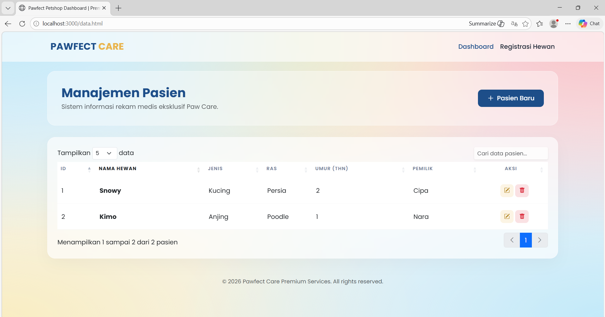
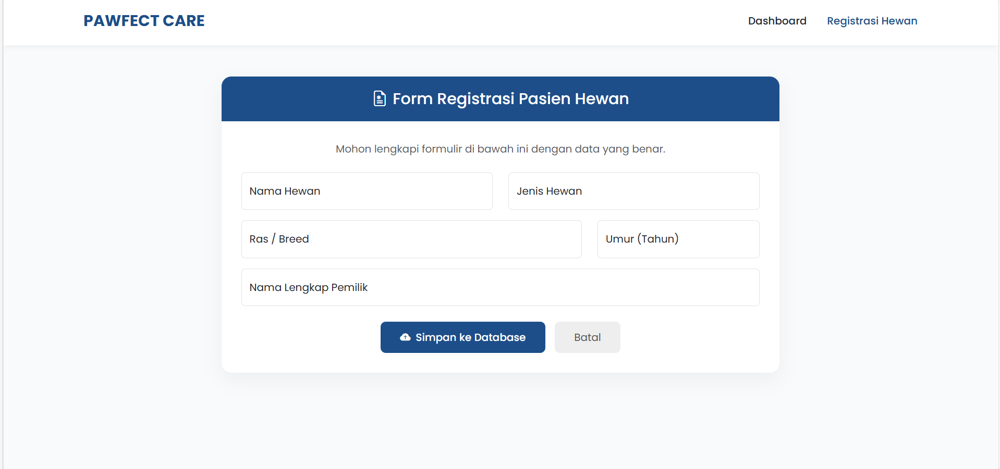
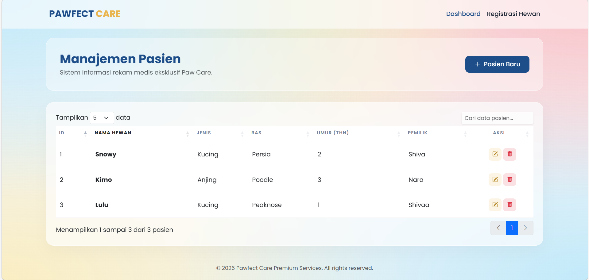
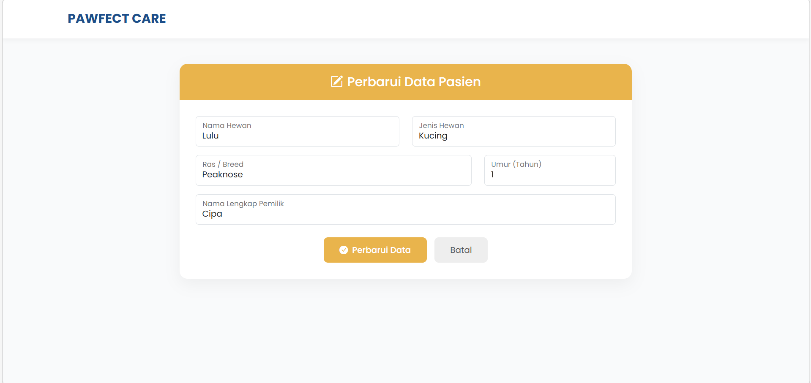
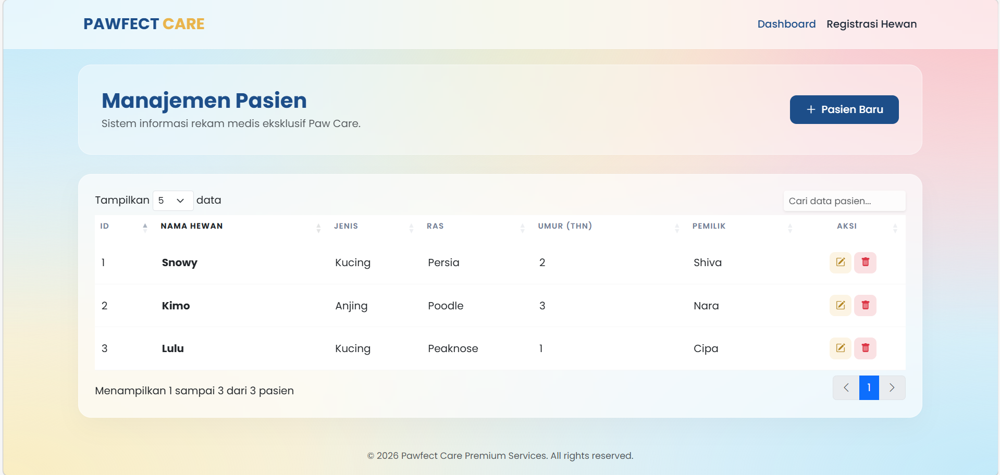
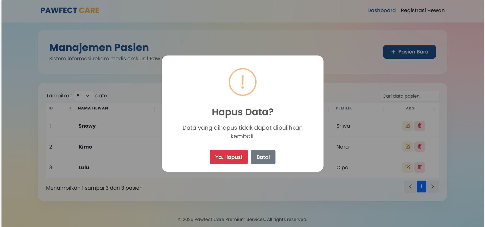
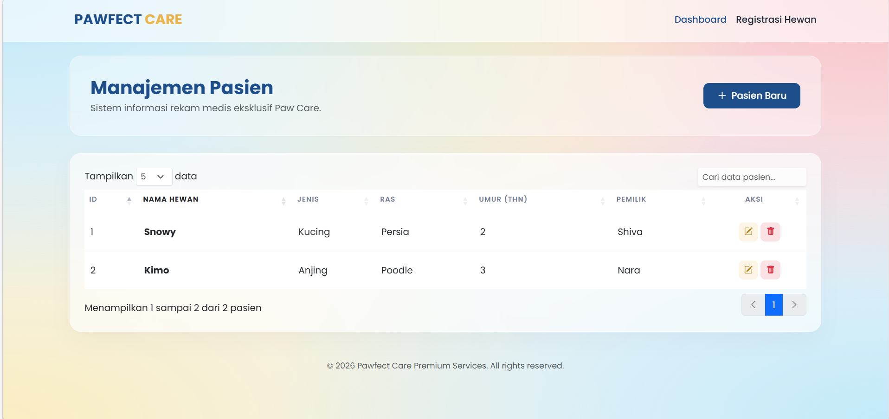

<div align="center">
  <br />
  <h1>LAPORAN PRAKTIKUM <br>APLIKASI BERBASIS PLATFORM</h1>
  <br />
  <h3>Tugas COTS-2 <br></h3>
  <br />
  <br />
  
  <br />
  <br />
  <h3>Disusun Oleh :</h3>
  <p>
    <strong>Shiva Indah Kurnia</strong><br>
    <strong>2311102035</strong><br>
    <strong>S1 IF-11-01</strong>
  </p>
  <br />
  <br />
  <h3>Dosen Pengampu :</h3>
  <p>
    <strong>Dimas Fanny Hebrasianto Permadi, S.ST., M.Kom</strong>
  </p>
  <br />
  <br />
  <h4>Asisten Praktikum :</h4>
  <strong>Apri Pandu Wicaksono</strong> <br>
  <strong>Rangga Pradarrell Fathi</strong>
  <br />
  <h3>LABORATORIUM HIGH PERFORMANCE
 <br>FAKULTAS INFORMATIKA <br>UNIVERSITAS TELKOM PURWOKERTO <br>2026</h3>
</div>

---

## 1. Dasar Teori

**CRUD (Create, Read, Update, Delete)** merupakan empat operasi utama yang digunakan untuk mengelola data dalam sebuah aplikasi. Pada pengembangan aplikasi web, konsep CRUD digunakan agar pengguna dapat menambahkan data, menampilkan data, memperbarui data, serta menghapus data secara dinamis

**Bootstrap** adalah framework CSS bersifat open-source yang menyediakan berbagai komponen antarmuka siap pakai, seperti form, tombol, navbar, dan card.Pada proyek ini, Bootstrap digunakan untuk membangun tema *Dark Mode* yang responsif

**jQuery** adalah library JavaScript yang digunakan untuk mempermudah manipulasi DOM dan AJAX. Dengan jQuery, interaksi pada halaman web seperti penghapusan data dapat dilakukan tanpa memuat ulang seluruh halaman

**jQuery DataTables** merupakan plugin yang berfungsi untuk meningkatkan fitur pada elemen `<table>` HTML, seperti pencarian data (*search*), pengurutan (*sorting*), dan pembagian halaman (*pagination*) secara otomatis.

**JSON (JavaScript Object Notation)** adalah format pertukaran data yang ringan dan mudah dibaca.Data mahasiswa disimpan dalam file `data.json` untuk dikelola oleh server.

**Node.js & Express JS** adalah runtime dan framework backend yang digunakan untuk membangun aplikasi web, menangani request HTTP, routing, dan menyediakan endpoint data JSON.

**EJS (Embedded JavaScript Templates)** adalah template engine yang digunakan untuk membuat halaman HTML dinamis dengan menyisipkan data dari server langsung ke halaman menggunakan sintaks tertentu

---

## 2. Kode Program

### A. `package.json`

```json
{
  "name": "cots2",
  "version": "1.0.0",
  "description": "",
  "main": "server.js",
  "scripts": {
    "test": "echo \"Error: no test specified\" && exit 1",
    "start": "node server.js"
  },
  "keywords": [],
  "author": "",
  "license": "ISC",
  "type": "commonjs",
  "dependencies": {
    "express": "^5.2.1"
  }
}

```

**Penjelasan `package.json`**

File ini berfungsi sebagai manifestasi pusat atau "identitas" proyek yang mencatat informasi dasar aplikasi, konfigurasi script operasional (seperti npm start), serta daftar pustaka eksternal (dependencies) seperti Express.js yang wajib terinstal agar aplikasi dapat berjalan. Dengan adanya file ini, manajemen paket menjadi lebih sistematis karena memungkinkan pengembang lain untuk menduplikasi seluruh lingkungan dependensi proyek secara otomatis cukup dengan menjalankan perintah npm install.

---

### B. Backend `server.js`

```javascript
const express = require('express');
const app = express();
const path = require('path');

app.use(express.json());
app.use(express.urlencoded({ extended: true }));

// Mengizinkan akses file statis di folder 'public'
app.use(express.static('public'));

// Data Dummy Sementara (In-Memory Database)
let pets = [
    { id: 1, name: "Snowy", type: "Kucing", breed: "Persia", age: 2, owner: "Shiva" },
    { id: 2, name: "Kimo", type: "Anjing", breed: "Poodle", age: 3, owner: "Nara" }
];

// --- ENDPOINT API (JSON) ---

// 1. READ: Ambil semua data (Format khusus untuk DataTables)
app.get('/api/pets', (req, res) => {
    res.json({ data: pets });
});

// 2. READ: Ambil data spesifik berdasarkan ID
app.get('/api/pets/:id', (req, res) => {
    const pet = pets.find(p => p.id == req.params.id);
    if (!pet) return res.status(404).json({ message: "Hewan tidak ditemukan" });
    res.json(pet);
});

// 3. CREATE: Tambah data hewan baru
app.post('/api/pets', (req, res) => {
    const newPet = {
        id: pets.length > 0 ? Math.max(...pets.map(p => p.id)) + 1 : 1,
        name: req.body.name,
        type: req.body.type,
        breed: req.body.breed,
        age: parseInt(req.body.age),
        owner: req.body.owner
    };
    pets.push(newPet);
    res.status(201).json({ message: "Data hewan berhasil ditambahkan!", pet: newPet });
});

// 4. UPDATE: Ubah data hewan
app.put('/api/pets/:id', (req, res) => {
    const pet = pets.find(p => p.id == req.params.id);
    if (!pet) return res.status(404).json({ message: "Hewan tidak ditemukan" });
    
    pet.name = req.body.name;
    pet.type = req.body.type;
    pet.breed = req.body.breed;
    pet.age = parseInt(req.body.age);
    pet.owner = req.body.owner;
    
    res.json({ message: "Data hewan berhasil diperbarui!", pet });
});

// 5. DELETE: Hapus data hewan
app.delete('/api/pets/:id', (req, res) => {
    const petIndex = pets.findIndex(p => p.id == req.params.id);
    if (petIndex === -1) return res.status(404).json({ message: "Hewan tidak ditemukan" });
    
    pets.splice(petIndex, 1);
    res.json({ message: "Data hewan berhasil dihapus!" });
});

// Jalankan Server
const PORT = 3000;
app.listen(PORT, () => console.log(`Server aktif di http://localhost:${PORT}/data.html`));
```

**Penjelasan `server.js`**

File ini berperan sebagai "otak" atau back-end engine aplikasi yang dibangun menggunakan Node.js dan framework Express.js untuk menangani seluruh logika bisnis serta rute (routing) aplikasi. Di dalamnya, server dikonfigurasi untuk menyediakan layanan RESTful API yang memproses data berformat JSON, mulai dari menampilkan data (Read), menambah data baru (Create), hingga fungsi pembaruan (Update) dan penghapusan (Delete). Melalui file ini, permintaan dari sisi klien (front-end) diolah secara dinamis dan dikirimkan kembali untuk ditampilkan pada antarmuka pengguna tanpa perlu melakukan pemuatan ulang halaman secara manual.


---

### C. File Data `data/data.html`

Kondisi awal (kosong):

```html
<!DOCTYPE html>
<html lang="id">
<head>
    <meta charset="UTF-8">
    <meta name="viewport" content="width=device-width, initial-scale=1.0">
    <title>Pawfect Petshop Dashboard | Premium Care</title>
    <link href="https://fonts.googleapis.com/css2?family=Poppins:wght@300;400;500;600;700&display=swap" rel="stylesheet">
    <link href="https://cdn.jsdelivr.net/npm/bootstrap@5.3.0/dist/css/bootstrap.min.css" rel="stylesheet">
    <link rel="stylesheet" href="https://cdn.jsdelivr.net/npm/bootstrap-icons@1.11.0/font/bootstrap-icons.css">
    <link href="https://cdn.datatables.net/1.13.6/css/dataTables.bootstrap5.min.css" rel="stylesheet">
    <link href="https://cdn.jsdelivr.net/npm/sweetalert2@11/dist/sweetalert2.min.css" rel="stylesheet">
    <script src="https://cdn.jsdelivr.net/npm/sweetalert2@11"></script>
    
    <style>
        :root {
            --primary-color: #1D4E89; 
            --accent-color: #E9B44C;  
            --text-dark: #1F2937;
        }

        /* --- BACKGROUND SULTAN (Mesh Gradient) --- */
        body {
            font-family: 'Poppins', sans-serif;
            color: var(--text-dark);
            min-height: 100vh;
            background-color: #f3f4f6;
            /* Gradasi lembut multi-warna di pojok-pojok layar */
            background-image: 
                radial-gradient(at 0% 0%, hsla(197, 83%, 87%, 1) 0, transparent 50%), 
                radial-gradient(at 50% 0%, hsla(47, 83%, 87%, 1) 0, transparent 50%), 
                radial-gradient(at 100% 0%, hsla(354, 83%, 87%, 1) 0, transparent 50%),
                radial-gradient(at 100% 100%, hsla(197, 83%, 87%, 1) 0, transparent 50%),
                radial-gradient(at 0% 100%, hsla(47, 83%, 87%, 1) 0, transparent 50%);
        }

        /* --- Navbar Glassmorphism --- */
        .navbar-premium {
            background: rgba(255, 255, 255, 0.6) !important;
            backdrop-filter: blur(15px);
            border-bottom: 1px solid rgba(255, 255, 255, 0.4);
            padding: 15px 0;
        }
        .navbar-brand {
            font-weight: 700;
            color: var(--primary-color) !important;
            font-size: 1.5rem;
        }
        .nav-link {
            color: var(--text-dark) !important;
            font-weight: 500;
            transition: color 0.3s;
        }
        .nav-link:hover, .nav-link.active {
            color: var(--primary-color) !important;
        }

        /* --- Glassmorphism Card --- */
        .card-table {
            border: 1px solid rgba(255, 255, 255, 0.5) !important;
            border-radius: 20px;
            box-shadow: 0 15px 35px rgba(0,0,0,0.03);
            padding: 25px;
            background: rgba(255, 255, 255, 0.65) !important;
            backdrop-filter: blur(12px);
        }

        /* --- Page Header Style --- */
        .page-header {
            padding: 35px;
            background: rgba(255, 255, 255, 0.4);
            backdrop-filter: blur(10px);
            margin-bottom: 30px;
            border-radius: 20px;
            border: 1px solid rgba(255, 255, 255, 0.5);
        }

        /* --- Button Style --- */
        .btn-premium-success {
            background-color: var(--primary-color);
            color: white;
            border: none;
            padding: 10px 24px;
            border-radius: 10px;
            font-weight: 500;
            transition: all 0.3s cubic-bezier(0.4, 0, 0.2, 1);
        }
        .btn-premium-success:hover {
            background-color: #153a66;
            color: white;
            transform: translateY(-3px);
            box-shadow: 0 8px 20px rgba(29, 78, 137, 0.25);
        }

        /* --- Custom Datatable & Action Buttons --- */
        #petTable thead th {
            border: none;
            color: #718096;
            font-weight: 600;
            text-transform: uppercase;
            font-size: 0.75rem;
            letter-spacing: 1px;
            padding-bottom: 15px;
        }
        #petTable tbody tr {
            transition: all 0.2s ease;
        }
        #petTable tbody tr:hover {
            background-color: rgba(255, 255, 255, 0.8) !important;
            transform: scale(1.005);
        }
        #petTable tbody td {
            border-bottom: 1px solid rgba(0, 0, 0, 0.03);
            padding: 16px 10px;
            vertical-align: middle;
        }
        .btn-action-edit {
            background-color: rgba(233, 180, 76, 0.15);
            color: #B2841F;
            border: none;
            border-radius: 8px;
            padding: 6px 10px;
        }
        .btn-action-edit:hover { background-color: var(--accent-color); color: white; }
        .btn-action-delete {
            background-color: rgba(220, 53, 69, 0.15);
            color: #dc3545;
            border: none;
            border-radius: 8px;
            padding: 6px 10px;
        }
        .btn-action-delete:hover { background-color: #dc3545; color: white; }

        /* --- EFFECT SHIMMER / SKELETON LOADING --- */
        .shimmer-row td {
            position: relative;
            overflow: hidden;
        }
        .shimmer-block {
            height: 20px;
            background: #e2e8f0;
            border-radius: 4px;
            position: relative;
            overflow: hidden;
        }
        .shimmer-block::after {
            content: '';
            position: absolute;
            top: 0; right: 0; bottom: 0; left: 0;
            transform: translateX(-100%);
            background: linear-gradient(90deg, transparent, rgba(255,255,255,0.6), transparent);
            animation: shimmer 1.5s infinite;
        }
        @keyframes shimmer {
            100% { transform: translateX(100%); }
        }

        /* Modal border radius */
        .rounded-4 { border-radius: 1.2rem !important; }
    </style>
</head>
<body>

    <nav class="navbar navbar-expand-lg navbar-premium sticky-top">
        <div class="container">
            <a class="navbar-brand" href="#">
                <i class="bi bi-paw-fill me-2"></i>PAWFECT <span style="color:var(--accent-color);">CARE</span>
            </a>
            <div class="collapse navbar-collapse">
                <ul class="navbar-nav ms-auto">
                    <li class="nav-item"><a class="nav-link active" href="data.html">Dashboard</a></li>
                    <li class="nav-item"><a class="nav-link" href="tambah.html">Registrasi Hewan</a></li>
                </ul>
            </div>
        </div>
    </nav>

    <div class="container mt-4">
        <div class="page-header d-flex justify-content-between align-items-center">
            <div>
                <h2 class="fw-bold m-0" style="color: var(--primary-color)">Manajemen Pasien</h2>
                <p class="text-muted m-0 mt-1">Sistem informasi rekam medis eksklusif Paw Care.</p>
            </div>
            <a href="tambah.html" class="btn btn-premium-success">
                <i class="bi bi-plus-lg me-2"></i>Pasien Baru
            </a>
        </div>

        <div class="card card-table border-0 mb-5">
            <table id="petTable" class="table w-100">
                <thead>
                    <tr>
                        <th>ID</th>
                        <th>Nama Hewan</th>
                        <th>Jenis</th>
                        <th>Ras</th>
                        <th>Umur (Thn)</th>
                        <th>Pemilik</th>
                        <th class="text-center">Aksi</th>
                    </tr>
                </thead>
                <tbody id="tableBody">
                    <tr class="shimmer-row">
                        <td><div class="shimmer-block" style="width: 30px"></div></td>
                        <td><div class="shimmer-block" style="width: 100px"></div></td>
                        <td><div class="shimmer-block" style="width: 70px"></div></td>
                        <td><div class="shimmer-block" style="width: 120px"></div></td>
                        <td><div class="shimmer-block" style="width: 40px"></div></td>
                        <td><div class="shimmer-block" style="width: 90px"></div></td>
                        <td><div class="shimmer-block" style="width: 80px"></div></td>
                    </tr>
                    <tr class="shimmer-row">
                        <td><div class="shimmer-block" style="width: 30px"></div></td>
                        <td><div class="shimmer-block" style="width: 80px"></div></td>
                        <td><div class="shimmer-block" style="width: 60px"></div></td>
                        <td><div class="shimmer-block" style="width: 100px"></div></td>
                        <td><div class="shimmer-block" style="width: 40px"></div></td>
                        <td><div class="shimmer-block" style="width: 110px"></div></td>
                        <td><div class="shimmer-block" style="width: 80px"></div></td>
                    </tr>
                </tbody>
            </table>
        </div>
        
        <footer class="text-center text-muted mb-4 small">
            © 2026 Pawfect Care Premium Services. All rights reserved.
        </footer>
    </div>

    <script src="https://code.jquery.com/jquery-3.7.0.min.js"></script>
    <script src="https://cdn.datatables.net/1.13.6/js/jquery.dataTables.min.js"></script>
    <script src="https://cdn.datatables.net/1.13.6/js/dataTables.bootstrap5.min.js"></script>

    <script>
        $(document).ready(function() {
            // Simulasi delay 1.2 detik agar animasi shimmer loading terlihat menawan
            setTimeout(function() {
                // Hapus baris skeleton
                $('#tableBody').empty();

                // Inisialisasi DataTable
                var table = $('#petTable').DataTable({
                    ajax: '/api/pets',
                    pageLength: 5,
                    lengthMenu: [5, 10, 25],
                    columns: [
                        { data: 'id' },
                        { data: 'name', className: 'fw-bold text-dark' },
                        { data: 'type' },
                        { data: 'breed' },
                        { data: 'age' },
                        { data: 'owner' },
                        {
                            data: null,
                            className: 'text-center',
                            render: function (data, type, row) {
                                return `
                                    <a href="edit.html?id=${row.id}" class="btn btn-sm btn-action-edit" title="Edit">
                                        <i class="bi bi-pencil-square"></i>
                                    </a>
                                    <button class="btn btn-sm btn-action-delete btn-delete" data-id="${row.id}" title="Hapus">
                                        <i class="bi bi-trash-fill"></i>
                                    </button>
                                `;
                            }
                        }
                    ],
                    language: {
                        search: "_INPUT_",
                        searchPlaceholder: "Cari data pasien...",
                        lengthMenu: "Tampilkan _MENU_ data",
                        info: "Menampilkan _START_ sampai _END_ dari _TOTAL_ pasien",
                        paginate: {
                            previous: "<i class='bi bi-chevron-left'></i>",
                            next: "<i class='bi bi-chevron-right'></i>"
                        }
                    }
                });

                // Style Search Bar DataTable agar makin estetik
                $('.dataTables_filter input').addClass('form-control border-0 shadow-sm').css('background', 'rgba(255,255,255,0.7)');
            }, 1200);

            // Fungsionalitas Delete via SweetAlert2
            $('#petTable').on('click', '.btn-delete', function() {
                const id = $(this).data('id');
                
                Swal.fire({
                    title: 'Hapus Data?',
                    text: "Data yang dihapus tidak dapat dipulihkan kembali.",
                    icon: 'warning',
                    showCancelButton: true,
                    confirmButtonColor: '#dc3545',
                    cancelButtonColor: '#6e7881',
                    confirmButtonText: 'Ya, Hapus!',
                    cancelButtonText: 'Batal',
                    customClass: { popup: 'rounded-4' }
                }).then((result) => {
                    if (result.isConfirmed) {
                        $.ajax({
                            url: `/api/pets/${id}`,
                            type: 'DELETE',
                            success: function(response) {
                                Swal.fire({
                                    title: 'Terhapus!',
                                    text: response.message,
                                    icon: 'success',
                                    confirmButtonColor: '#1D4E89',
                                    customClass: { popup: 'rounded-4' }
                                });
                                $('#petTable').DataTable().ajax.reload();
                            }
                        });
                    }
                });
            });
        });
    </script>
</body>
</html>
```

**Penjelasan `data.html`**

File ini berfungsi sebagai antarmuka utama (Dashboard) yang menyajikan seluruh informasi pasien hewan secara terstruktur dalam format tabel interaktif. Halaman ini mengintegrasikan plugin jQuery DataTables untuk mengolah data JSON dari server secara dinamis, lengkap dengan fitur pencarian otomatis, sorting, dan paginasi tanpa memuat ulang halaman. Dari sisi estetika, file ini menerapkan desain Glassmorphism dengan efek latar belakang mesh gradient dan animasi Shimmering Skeleton Loading yang memberikan kesan mewah serta profesional, sekaligus meningkatkan pengalaman pengguna (User Experience) saat menunggu data dimuat dari sistem.

---

### D. Edit `edit.html`

```html
<!DOCTYPE html>
<html lang="id">
<head>
    <meta charset="UTF-8">
    <meta name="viewport" content="width=device-width, initial-scale=1.0">
    <title>Edit Data Pasien | Paw Care</title>
    <link href="https://fonts.googleapis.com/css2?family=Poppins:wght@300;400;500;600;700&display=swap" rel="stylesheet">
    <link href="https://cdn.jsdelivr.net/npm/bootstrap@5.3.0/dist/css/bootstrap.min.css" rel="stylesheet">
    <link rel="stylesheet" href="https://cdn.jsdelivr.net/npm/bootstrap-icons@1.11.0/font/bootstrap-icons.css">
    <link href="https://cdn.jsdelivr.net/npm/sweetalert2@11/dist/sweetalert2.min.css" rel="stylesheet">
<script src="https://cdn.jsdelivr.net/npm/sweetalert2@11"></script>
    <style>
        :root { --primary-color: #1D4E89; --accent-color: #E9B44C; --bg-light: #F9FAFB; }
        body { font-family: 'Poppins', sans-serif; background-color: var(--bg-light); }
        .navbar-premium { background-color: #fff !important; box-shadow: 0 2px 10px rgba(0,0,0,0.05); padding: 15px 0; }
        .navbar-brand { font-weight: 700; color: var(--primary-color) !important; font-size: 1.5rem; }
        
        .card-form { border: none; border-radius: 15px; box-shadow: 0 10px 30px rgba(0,0,0,0.05); background: #fff; overflow: hidden; }
        .form-header { background-color: var(--accent-color); color: white; padding: 20px; font-weight: 600; }
        .form-body { padding: 30px; }
        
        .form-floating > .form-control:focus { border-color: var(--accent-color); box-shadow: 0 0 0 0.25rem rgba(233, 180, 76, 0.1); }

        .btn-premium-accent {
            background-color: var(--accent-color);
            color: white;
            border: none;
            padding: 12px 30px;
            border-radius: 8px;
            font-weight: 500;
            transition: all 0.3s;
        }
        .btn-premium-accent:hover {
            background-color: #d19b3a;
            transform: translateY(-2px);
        }
        .btn-premium-secondary { background-color: #eee; color: #555; border: none; padding: 12px 30px; border-radius: 8px; margin-left: 10px; }
    </style>
</head>
<body>

    <nav class="navbar navbar-expand-lg navbar-premium">
        <div class="container">
            <a class="navbar-brand" href="data.html"><i class="bi bi-paw-fill me-2"></i>PAWFECT CARE</a>
        </div>
    </nav>

    <div class="container mt-5 mb-5">
        <div class="row justify-content-center">
            <div class="col-md-8">
                <div class="card card-form">
                    <div class="form-header text-center">
                        <h4 class="m-0"><i class="bi bi-pencil-square me-2"></i>Perbarui Data Pasien</h4>
                    </div>
                    <div class="form-body">
                        <form id="formEdit">
                            <div class="row">
                                <div class="col-md-6 mb-3">
                                    <div class="form-floating">
                                        <input type="text" class="form-control" name="name" id="petName" required>
                                        <label>Nama Hewan</label>
                                    </div>
                                </div>
                                <div class="col-md-6 mb-3">
                                    <div class="form-floating">
                                        <input type="text" class="form-control" name="type" id="petType" required>
                                        <label>Jenis Hewan</label>
                                    </div>
                                </div>
                            </div>

                            <div class="row">
                                <div class="col-md-8 mb-3">
                                    <div class="form-floating">
                                        <input type="text" class="form-control" name="breed" id="petBreed" required>
                                        <label>Ras / Breed</label>
                                    </div>
                                </div>
                                <div class="col-md-4 mb-3">
                                    <div class="form-floating">
                                        <input type="number" class="form-control" name="age" id="petAge" required>
                                        <label>Umur (Tahun)</label>
                                    </div>
                                </div>
                            </div>

                            <div class="mb-4">
                                <div class="form-floating">
                                    <input type="text" class="form-control" name="owner" id="ownerName" required>
                                    <label>Nama Lengkap Pemilik</label>
                                </div>
                            </div>

                            <div class="text-center mt-4">
                                <button type="submit" class="btn btn-premium-accent">
                                    <i class="bi bi-check-circle-fill me-2"></i>Perbarui Data
                                </button>
                                <a href="data.html" class="btn btn-premium-secondary">Batal</a>
                            </div>
                        </form>
                    </div>
                </div>
            </div>
        </div>
    </div>

    <script src="https://code.jquery.com/jquery-3.7.0.min.js"></script>
    <script>
        $(document).ready(function() {
    const urlParams = new URLSearchParams(window.location.search);
    const petId = urlParams.get('id');

    // Ambil data lama
    $.get(`/api/pets/${petId}`, function(data) {
        $('#petName').val(data.name);
        $('#petType').val(data.type);
        $('#petBreed').val(data.breed);
        $('#petAge').val(data.age);
        $('#ownerName').val(data.owner);
    });

    // Handle Update dengan SweetAlert2
    $('#formEdit').submit(function(e) {
        e.preventDefault();
        $.ajax({
            url: `/api/pets/${petId}`,
            type: 'PUT',
            data: $(this).serialize(),
            success: function(response) {
                Swal.fire({
                    title: 'Pembaruan Berhasil!',
                    text: response.message,
                    icon: 'success',
                    confirmButtonColor: '#E9B44C', // Menggunakan warna Gold aksen
                    customClass: { popup: 'rounded-4' }
                }).then(() => {
                    window.location.href = 'data.html';
                });
            }
        });
    });
});
    </script>
</body>
</html>
```

**Penjelasan `edit.html`**

File ini berfungsi sebagai antarmuka khusus untuk melakukan pembaruan (Update) data pasien yang sudah terdaftar dalam sistem. Halaman ini bekerja secara dinamis dengan menangkap parameter ID dari URL untuk menarik data JSON yang relevan dari server, kemudian secara otomatis mengisi (auto-fill) formulir menggunakan metode jQuery AJAX agar pengguna dapat langsung menyunting informasi yang diinginkan. Secara visual, halaman ini mempertahankan konsistensi desain premium dengan menggunakan floating labels dan skema warna aksen emas (warm gold) untuk membedakannya dari halaman registrasi, serta mengintegrasikan SweetAlert2 untuk memberikan notifikasi konfirmasi pembaruan data yang elegan dan profesional.

---

### E. Tambah `tambah.html`

```html
<!DOCTYPE html>
<html lang="id">
<head>
    <meta charset="UTF-8">
    <meta name="viewport" content="width=device-width, initial-scale=1.0">
    <title>Registrasi Pasien Baru | Paw Care</title>
    <link href="https://fonts.googleapis.com/css2?family=Poppins:wght@300;400;500;600;700&display=swap" rel="stylesheet">
    <link href="https://cdn.jsdelivr.net/npm/bootstrap@5.3.0/dist/css/bootstrap.min.css" rel="stylesheet">
    <link rel="stylesheet" href="https://cdn.jsdelivr.net/npm/bootstrap-icons@1.11.0/font/bootstrap-icons.css">
    <link href="https://cdn.jsdelivr.net/npm/sweetalert2@11/dist/sweetalert2.min.css" rel="stylesheet">
<script src="https://cdn.jsdelivr.net/npm/sweetalert2@11"></script>
    <style>
        :root { --primary-color: #1D4E89; --accent-color: #E9B44C; --bg-light: #F9FAFB; }
        body { font-family: 'Poppins', sans-serif; background-color: var(--bg-light); }
        .navbar-premium { background-color: #fff !important; box-shadow: 0 2px 10px rgba(0,0,0,0.05); padding: 15px 0; }
        .navbar-brand { font-weight: 700; color: var(--primary-color) !important; font-size: 1.5rem; }
        .nav-link { color: #1F2937 !important; font-weight: 500; margin-left: 15px; }
        .nav-link:hover, .nav-link.active { color: var(--primary-color) !important; }

        .card-form {
            border: none;
            border-radius: 15px;
            box-shadow: 0 10px 30px rgba(0,0,0,0.05);
            background: #fff;
            overflow: hidden;
        }
        .form-header {
            background-color: var(--primary-color);
            color: white;
            padding: 20px;
            font-weight: 600;
        }
        .form-body { padding: 30px; }
        
        /* Modern Input Style (Floating Labels) */
        .form-floating > .form-control:focus {
            border-color: var(--primary-color);
            box-shadow: 0 0 0 0.25rem rgba(29, 78, 137, 0.1);
        }

        .btn-premium-success {
            background-color: var(--primary-color);
            color: white;
            border: none;
            padding: 12px 30px;
            border-radius: 8px;
            font-weight: 500;
            transition: all 0.3s;
        }
        .btn-premium-success:hover {
            background-color: #153a66;
            transform: translateY(-2px);
            box-shadow: 0 4px 10px rgba(29, 78, 137, 0.2);
        }
        .btn-premium-secondary {
            background-color: #eee;
            color: #555;
            border: none;
            padding: 12px 30px;
            border-radius: 8px;
            margin-left: 10px;
        }
    </style>
</head>
<body>

    <nav class="navbar navbar-expand-lg navbar-premium sticky-top">
        <div class="container">
            <a class="navbar-brand" href="data.html"><i class="bi bi-paw-fill me-2"></i>PAWFECT CARE</a>
            <div class="collapse navbar-collapse">
                <ul class="navbar-nav ms-auto">
                    <li class="nav-item"><a class="nav-link" href="data.html">Dashboard</a></li>
                    <li class="nav-item"><a class="nav-link active" href="tambah.html">Registrasi Hewan</a></li>
                </ul>
            </div>
        </div>
    </nav>

    <div class="container mt-5 mb-5">
        <div class="row justify-content-center">
            <div class="col-md-8">
                <div class="card card-form">
                    <div class="form-header text-center">
                        <h4 class="m-0"><i class="bi bi-file-earmark-medical me-2"></i>Form Registrasi Pasien Hewan</h4>
                    </div>
                    <div class="form-body">
                        <p class="text-muted text-center mb-4">Mohon lengkapi formulir di bawah ini dengan data yang benar.</p>
                        
                        <form id="formTambah">
                            <div class="row">
                                <div class="col-md-6 mb-3">
                                    <div class="form-floating">
                                        <input type="text" class="form-control" name="name" id="name" placeholder="Kimo" required>
                                        <label for="name">Nama Hewan</label>
                                    </div>
                                </div>
                                <div class="col-md-6 mb-3">
                                    <div class="form-floating">
                                        <input type="text" class="form-control" name="type" id="type" placeholder="Kucing / Anjing" required>
                                        <label for="type">Jenis Hewan</label>
                                    </div>
                                </div>
                            </div>

                            <div class="row">
                                <div class="col-md-8 mb-3">
                                    <div class="form-floating">
                                        <input type="text" class="form-control" name="breed" id="breed" placeholder="Persia" required>
                                        <label for="breed">Ras / Breed</label>
                                    </div>
                                </div>
                                <div class="col-md-4 mb-3">
                                    <div class="form-floating">
                                        <input type="number" class="form-control" name="age" id="age" placeholder="2" required>
                                        <label for="age">Umur (Tahun)</label>
                                    </div>
                                </div>
                            </div>

                            <div class="mb-4">
                                <div class="form-floating">
                                    <input type="text" class="form-control" name="owner" id="owner" placeholder="Nama Pemilik" required>
                                    <label for="owner">Nama Lengkap Pemilik</label>
                                </div>
                            </div>

                            <div class="text-center mt-4">
                                <button type="submit" class="btn btn-premium-success">
                                    <i class="bi bi-cloud-arrow-up-fill me-2"></i>Simpan ke Database
                                </button>
                                <a href="data.html" class="btn btn-premium-secondary">Batal</a>
                            </div>
                        </form>
                    </div>
                </div>
            </div>
        </div>
    </div>

    <script src="https://code.jquery.com/jquery-3.7.0.min.js"></script>
    <script>
       $(document).ready(function() {
    $('#formTambah').submit(function(e) {
        e.preventDefault();
        $.post('/api/pets', $(this).serialize(), function(response) {
            Swal.fire({
                title: 'Berhasil!',
                text: response.message,
                icon: 'success',
                confirmButtonColor: '#1D4E89',
                customClass: { popup: 'rounded-4' }
            }).then(() => {
                window.location.href = 'data.html'; // Redirect setelah klik OK
            });
        });
    });
});
    </script>
</body>
</html>
```

**Penjelasan `tambah.html`**

File ini berfungsi sebagai antarmuka registrasi (Create) yang memungkinkan pengguna untuk menambahkan data pasien hewan baru ke dalam sistem melalui formulir digital yang bersih dan modern. Halaman ini menggunakan komponen Bootstrap 5 seperti floating labels untuk estetika minimalis, serta memanfaatkan metode jQuery AJAX untuk mengirimkan data input ke server secara asinkron tanpa memuat ulang halaman (page refresh). Untuk menjaga standar visual "web mahal", halaman ini tetap konsisten dengan tema Glassmorphism dan latar belakang gradasi, serta mengintegrasikan SweetAlert2 untuk memberikan umpan balik visual berupa animasi centang hijau yang profesional saat proses penyimpanan data berhasil dilakukan.

---

## 3. Screenshot Website

1. Tampilan Awal Halaman

2. Halaman Form Input Mahasiswa

3. Halaman Data Mahasiswa

4. Halaman Edit Data Mahasiswa

5. Hasil Update Data

6. Proses Hapus Data


---

## 4. Kesimpulan

Pada Pengembangan aplikasi Pawfect Care ini berhasil mengintegrasikan fungsionalitas sistem manajemen data hewan (CRUD) yang stabil dengan estetika antarmuka modern berskala profesional. Melalui pemanfaatan Node.js dan Express.js di sisi back-end serta pengolahan data JSON yang dinamis menggunakan jQuery AJAX, aplikasi ini mampu menyajikan performa yang cepat tanpa hambatan pemuatan ulang halaman (page refresh). Penerapan prinsip desain Glassmorphism, efek shimmering skeleton, serta notifikasi SweetAlert2 secara signifikan meningkatkan nilai visual dan pengalaman pengguna, mengubah sistem administrasi standar menjadi sebuah platform web yang elegan, mewah, dan siap digunakan untuk kebutuhan operasional petshop yang eksklusif.
---

## 5. Referensi

1. https://expressjs.com
2. https://nodejs.org
3. https://getbootstrap.com
4. https://jquery.com
5. https://datatables.net
6. https://ejs.co

## 6. Link Video Presentasi


