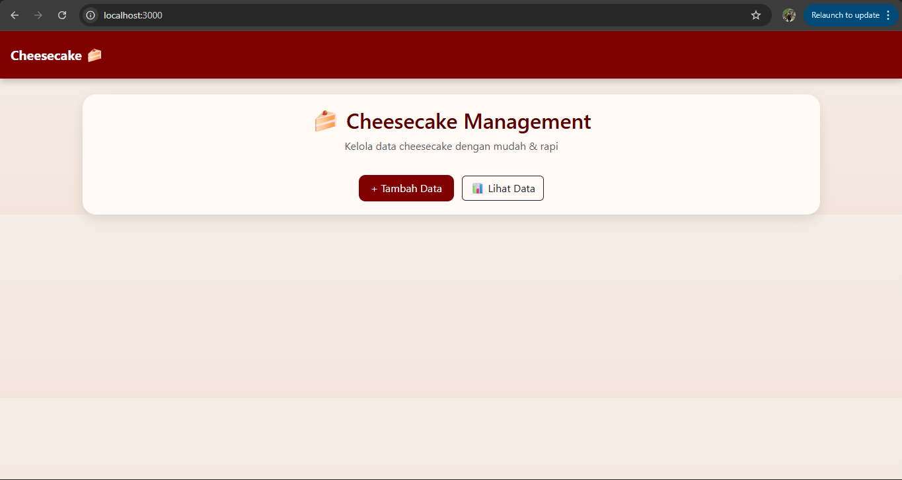
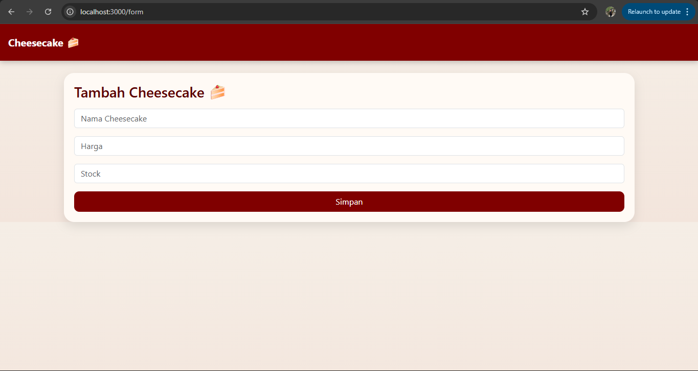
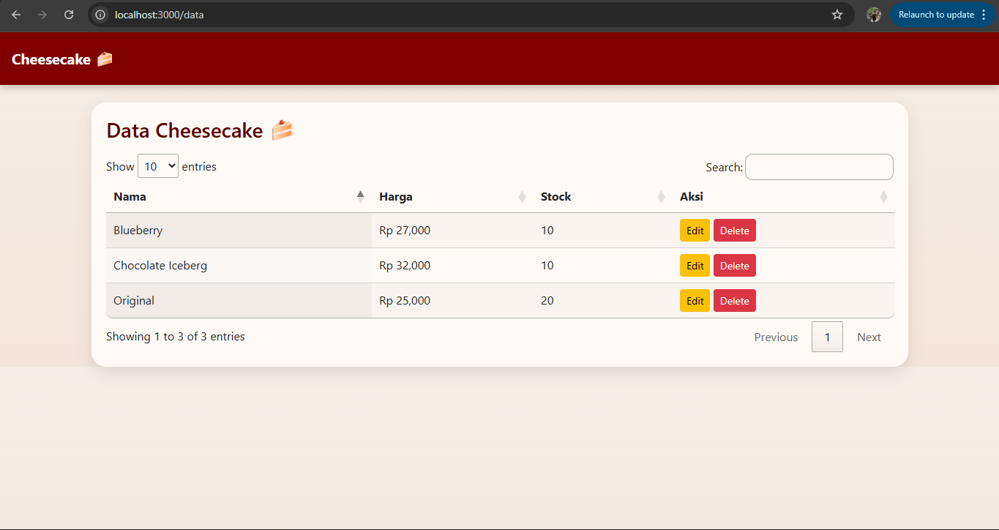
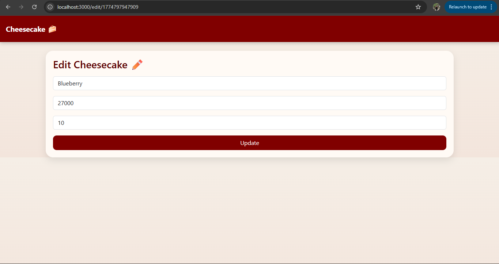
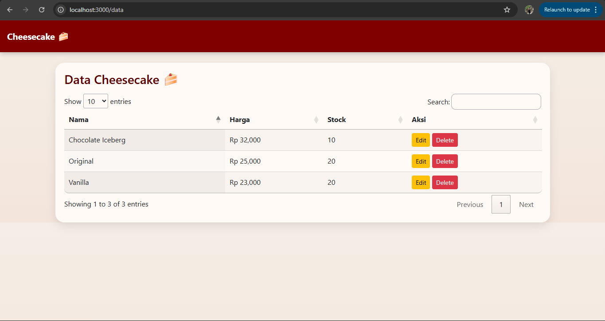
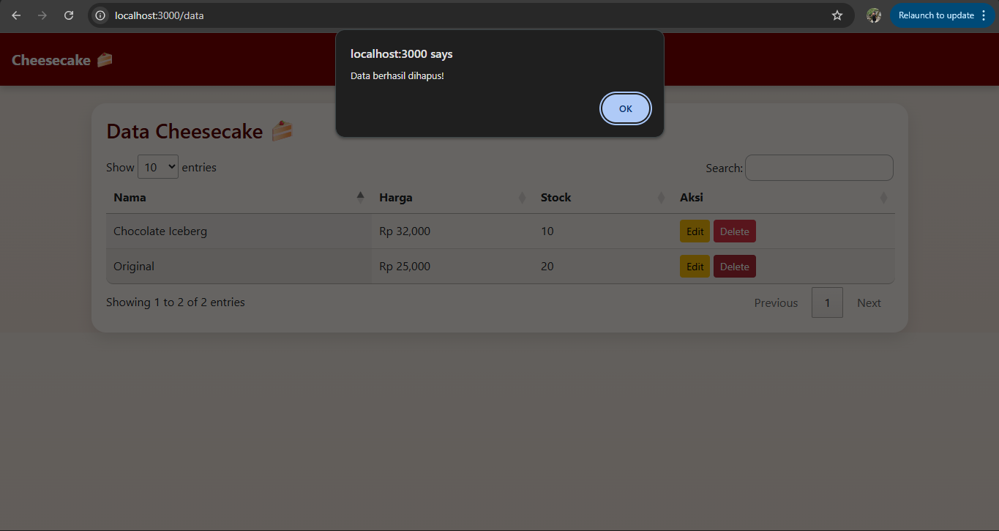

<div align="center">

&nbsp; <br />

&nbsp; <h1>LAPORAN PRAKTIKUM <br>APLIKASI BERBASIS PLATFORM</h1>

&nbsp; <br />

&nbsp; <h3>COTS-2 <br></h3>

&nbsp; <br />

&nbsp; <br />

&nbsp; 

&nbsp; <br />

&nbsp; <br />

&nbsp; <h3>Disusun Oleh :</h3>

&nbsp; <p>

&nbsp;   <strong>Nabila Shasya Sabrina</strong><br>

&nbsp;   <strong>2311102039</strong><br>

&nbsp;   <strong>S1 IF-11-01</strong>

&nbsp; </p>

&nbsp; <br />

&nbsp; <br />

&nbsp; <h3>Dosen Pengampu :</h3>

&nbsp; <p>

&nbsp;   <strong>Dimas Fanny Hebrasianto Permadi, S.ST., M.Kom</strong>

&nbsp; </p>

&nbsp; <br />

&nbsp; <br />

&nbsp; <h4>Asisten Praktikum :</h4>

&nbsp; <strong>Apri Pandu Wicaksono</strong> <br>

&nbsp; <strong>Rangga Pradarrell Fathi</strong>

&nbsp; <br />

&nbsp; <h3>LABORATORIUM HIGH PERFORMANCE

&nbsp;<br>FAKULTAS INFORMATIKA <br>UNIVERSITAS TELKOM PURWOKERTO <br>2026</h3>

</div>

---

## 1. Dasar Teori

**CRUD (Create, Read, Update, Delete)** 
adalah konsep dasar dalam pengolahan data pada aplikasi. CRUD memungkinkan pengguna untuk menambah, melihat, mengubah, dan menghapus data.

**Node.js**
adalah runtime JavaScript yang memungkinkan JavaScript berjalan di sisi server.

**Express JS**
adalah framework Node.js untuk membangun aplikasi web dengan mudah.

**EJS**
digunakan untuk membuat tampilan HTML yang dinamis.

**jQuery**
adalah library JavaScript yang mempermudah manipulasi DOM dan AJAX.

**Bootstrap**
adalah framework CSS untuk membuat tampilan web lebih modern dan responsif.

**JSON**
digunakan sebagai media penyimpanan data.

---

## 2. Deskripsi Aplikasi

Aplikasi yang dibuat adalah **Sistem CRUD Penjualan Cheesecake** berbasis web menggunakan:
    -Express JS
    -Bootstrap
    -jQuery
    -DataTables

Fitur Aplikasi:
-Halaman beranda
-Form input cheesecake
-Tabel data cheesecake
-Edit data
-Hapus data
-Data disimpan dalam JSON

Data yang dikelola:
-Nama Cheesecake
-Harga
-Stok

---

## 3. Struktur Folder Project

```bash
cheesecake-crud/
├── app.js
├── package.json
├── data/
│   └── cheesecake.json
├── public/
│   ├── css/style.css
│   └── js/app.js
└── views/
    ├── partials/
    │   ├── header.ejs
    │   └── footer.ejs
    ├── index.ejs
    ├── form.ejs
    ├── data.ejs
    └── edit.ejs
```

---

## 4. Cara Menjalanin Aplikasi

**1. Buka folder project di VS Code**

Pastikan Node.js sudah terinstall pada laptop.

**2. Inisialisasi project Node.js**

```bash
npm init -y
```

**3. Install dependency yang dibutuhkan**

```bash
npm install express ejs body-parser
```

**4. Jalankan server**

```bash
npm start
```

Atau jika belum ada script `start` di `package.json`, jalankan:

```bash
node app.js
```

---

## 5. Kode Program

**A. app.js**

```bash
const express = require('express');
const fs = require('fs');
const bodyParser = require('body-parser');
const app = express();

app.set('view engine', 'ejs');
app.use(express.static('public'));
app.use(bodyParser.urlencoded({ extended: true }));
app.use(bodyParser.json());

const DATA_FILE = './data/cheesecake.json';

function readData() {
  return JSON.parse(fs.readFileSync(DATA_FILE));
}

function writeData(data) {
  fs.writeFileSync(DATA_FILE, JSON.stringify(data, null, 2));
}

// ROUTES VIEW
app.get('/', (req, res) => res.render('index'));
app.get('/form', (req, res) => res.render('form'));
app.get('/data', (req, res) => res.render('data'));

app.get('/edit/:id', (req, res) => {
  const data = readData();
  const item = data.find(d => d.id == req.params.id);
  res.render('edit', { item });
});

// API
app.get('/api/cheesecake', (req, res) => {
  res.json(readData());
});

app.post('/api/cheesecake', (req, res) => {
  const data = readData();
  const newItem = {
    id: Date.now(),
    name: req.body.name,
    price: req.body.price,
    stock: req.body.stock
  };
  data.push(newItem);
  writeData(data);
  res.json(newItem);
});

app.put('/api/cheesecake/:id', (req, res) => {
  let data = readData();
  data = data.map(d => d.id == req.params.id ? {
    ...d,
    name: req.body.name,
    price: req.body.price,
    stock: req.body.stock
  } : d);
  writeData(data);
  res.sendStatus(200);
});

app.delete('/api/cheesecake/:id', (req, res) => {
  let data = readData();
  data = data.filter(d => d.id != req.params.id);
  writeData(data);
  res.sendStatus(200);
});

app.listen(3000, () => console.log('http://localhost:3000'));
```
File app.js merupakan file utama (backend) dalam aplikasi ini yang dibangun menggunakan Express JS. File ini berfungsi untuk mengatur jalannya server, menangani request dari pengguna, serta mengelola proses CRUD terhadap data cheesecake.

Di dalam file ini terdapat konfigurasi middleware seperti body-parser untuk membaca data dari form, serta pengaturan static file agar CSS dan JavaScript dapat digunakan pada frontend. Selain itu, file ini juga mengatur penggunaan EJS sebagai template engine untuk merender halaman web.

File app.js juga memiliki fungsi untuk membaca dan menulis data ke file cheesecake.json menggunakan modul fs. Data disimpan dalam format JSON sehingga dapat digunakan sebagai database sederhana.

**B. public/js/app.js**

```bash
$(document).ready(function () {
  if ($('#table').length) {
    $('#table').DataTable({
  ajax: {
    url: '/api/cheesecake',
    dataSrc: ''
  },
  columns: [
    { data: 'name' },
    {
  data: 'price',
  render: function (data) {
    return 'Rp ' + parseInt(data).toLocaleString();
  }
},
    { data: 'stock' },
    {
      data: null,
      render: function (data) {
        return `
          <a href="/edit/${data.id}" class="btn btn-warning btn-sm">Edit</a>
          <button onclick="deleteData(${data.id})" class="btn btn-danger btn-sm">Delete</button>
        `;
      }
    }
  ]
});
  }
});

function saveData() {
  const name = $('#name').val();
  const price = $('#price').val();
  const stock = $('#stock').val();

  if (!name || !price || !stock) {
    alert('Isi semua field!');
    return;
  }
  $.post('/api/cheesecake', {
    name: name,
    price: price,
    stock: stock
  }, () => {
    alert('Data berhasil ditambahkan!'); // ✅ DI SINI
    window.location.href = '/data';
  });
}

function updateData() {
  const id = $('#id').val();
  $.ajax({
    url: '/api/cheesecake/' + id,
    method: 'PUT',
    contentType: 'application/json',
    data: JSON.stringify({
      name: $('#name').val(),
      price: $('#price').val(),
      stock: $('#stock').val()
    }),
    success: () => {
  alert('Data berhasil diupdate!');
  window.location.href = '/data';
}
  });
}

function deleteData(id) {
  $.ajax({
    url: '/api/cheesecake/' + id,
    method: 'DELETE',
    success: () => {
  alert('Data berhasil dihapus!');
  window.location.href = '/data';
}
  });
}
```
File ini merupakan file JavaScript pada sisi frontend yang menggunakan jQuery dan plugin DataTables.

Fungsi utama file ini adalah:

Mengambil data dari server melalui API (/api/cheesecake)
Menampilkan data ke dalam tabel menggunakan DataTables
Mengatur fitur interaktif seperti tombol edit dan delete
Mengirim data dari form ke server menggunakan AJAX (Create & Update)
Menghapus data menggunakan AJAX (Delete)

Selain itu, file ini juga berfungsi untuk menangani event seperti klik tombol dan validasi sederhana pada input.

**C. views/index.ejs**

```bash
<%- include('partials/header') %>

<div class="card text-center">
  <h2>🍰 Cheesecake Management</h2>
  <p class="text-muted">Kelola data cheesecake dengan mudah & rapi</p>

  <div class="mt-3">
    <a href="/form" class="btn btn-primary me-2">+ Tambah Data</a>
    <a href="/data" class="btn btn-outline-dark">📊 Lihat Data</a>
  </div>
</div>

<%- include('partials/footer') %>
```
File index.ejs merupakan halaman utama (landing page) dari aplikasi.

Halaman ini berfungsi sebagai tampilan awal yang memberikan informasi singkat mengenai aplikasi CRUD cheesecake. Di dalamnya terdapat:

Judul aplikasi
Deskripsi singkat
Tombol navigasi menuju halaman form dan data

**D. views/form.ejs**
```bash
<%- include('partials/header') %>

<div class="card">
  <h3 class="mb-3">Tambah Cheesecake 🍰</h3>

  <input id="name" class="form-control mb-3" placeholder="Nama Cheesecake">
  <input id="price" class="form-control mb-3" placeholder="Harga">
  <input id="stock" class="form-control mb-3" placeholder="Stock">

  <button onclick="saveData()" class="btn btn-primary w-100">Simpan</button>
</div>

<%- include('partials/footer') %>
```
File form.ejs merupakan halaman yang digunakan untuk menambahkan data cheesecake (Create).

Pada halaman ini terdapat form input yang terdiri dari:

Nama cheesecake
Harga
Stok

Ketika tombol simpan ditekan, data akan dikirim ke server menggunakan fungsi JavaScript (saveData()) yang memanfaatkan AJAX.

Halaman ini berfungsi sebagai media input data baru ke dalam sistem.

**E. views/data.ejs**
```bash
<%- include('partials/header') %>

<div class="card">
  <h3 class="mb-3">Data Cheesecake 🍰</h3>

  <table id="table" class="display">
    <thead>
      <tr>
        <th>Nama</th>
        <th>Harga</th>
        <th>Stock</th>
        <th>Aksi</th>
      </tr>
    </thead>
  </table>
</div>

<%- include('partials/footer') %>
```
File data.ejs merupakan halaman yang digunakan untuk menampilkan data cheesecake (Read) dalam bentuk tabel.

Tabel pada halaman ini tidak diisi secara langsung di HTML, melainkan menggunakan plugin jQuery DataTables yang mengambil data dari API dalam format JSON.

Fitur yang tersedia pada tabel ini antara lain:

Pencarian data (search)
Pengurutan data (sorting)
Pagination
Tombol edit dan delete

Halaman ini menjadi pusat untuk melihat dan mengelola data yang ada.

**F. views/edit.ejs**
```bash
<%- include('partials/header') %>

<div class="card">
  <h3 class="mb-3">Edit Cheesecake ✏️</h3>

  <input type="hidden" id="id" value="<%= item.id %>">

  <input id="name" value="<%= item.name %>" class="form-control mb-3">
  <input id="price" value="<%= item.price %>" class="form-control mb-3">
  <input id="stock" value="<%= item.stock %>" class="form-control mb-3">

  <button onclick="updateData()" class="btn btn-primary w-100">Update</button>
</div>

<%- include('partials/footer') %>
```

File edit.ejs merupakan halaman yang digunakan untuk mengubah data cheesecake (Update).

Pada halaman ini terdapat form yang sudah terisi dengan data lama berdasarkan ID yang dipilih. Pengguna dapat mengubah data tersebut dan menyimpannya kembali ke server.

Data yang diubah akan dikirim menggunakan metode PUT melalui AJAX.

**G. views/partials/header.ejs**
```bash
<!DOCTYPE html>
<html>
<head>
  <title>Cheesecake App</title>

  <link href="https://cdn.jsdelivr.net/npm/bootstrap@5.3.0/dist/css/bootstrap.min.css" rel="stylesheet">
  <link rel="stylesheet" href="https://cdn.datatables.net/1.13.6/css/jquery.dataTables.min.css">
  <link rel="stylesheet" href="/css/style.css">
</head>

<body>
<nav class="navbar p-3">
  <a href="/" class="navbar-brand">Cheesecake 🍰</a>
</nav>

<div class="container mt-4">
```
<!DOCTYPE html>
<html>
<head>
  <title>Cheesecake App</title>

  <link href="https://cdn.jsdelivr.net/npm/bootstrap@5.3.0/dist/css/bootstrap.min.css" rel="stylesheet">
  <link rel="stylesheet" href="https://cdn.datatables.net/1.13.6/css/jquery.dataTables.min.css">
  <link rel="stylesheet" href="/css/style.css">
</head>

<body>
<nav class="navbar p-3">
  <a href="/" class="navbar-brand">Cheesecake 🍰</a>
</nav>

<div class="container mt-4">

**H. views/partials/footer.ejs**
```bash
</div>

<script src="https://code.jquery.com/jquery-3.7.0.min.js"></script>
<script src="https://cdn.datatables.net/1.13.6/js/jquery.dataTables.min.js"></script>
<script src="/js/app.js"></script>

</body>
</html>
```

File footer.ejs merupakan bagian bawah dari setiap halaman.

File ini berisi:

Penutup struktur HTML
Pemanggilan jQuery
Pemanggilan DataTables (JS)
Pemanggilan file JavaScript custom

Dengan memisahkan footer, struktur kode menjadi lebih rapi dan mudah dikelola.

**I. public/css/style.css**
```bash
body {
  background: linear-gradient(to bottom, #f5eee6, #f3e5dc);
  font-family: 'Segoe UI', sans-serif;
}

/* Navbar */
.navbar {
  background: #800000;
  box-shadow: 0 4px 10px rgba(0,0,0,0.2);
}

.navbar-brand {
  color: #fff !important;
  font-weight: bold;
  font-size: 20px;
}

/* Card */
.card {
  border-radius: 20px;
  border: none;
  box-shadow: 0 8px 20px rgba(0,0,0,0.1);
  padding: 20px;
  background: #fffaf5;
}

/* Button */
.btn-primary {
  background: #800000;
  border: none;
  border-radius: 10px;
  padding: 8px 18px;
  transition: 0.3s;
}

.btn-primary:hover {
  background: #a00000;
  transform: scale(1.05);
}

/* Table */
table.dataTable {
  border-radius: 10px;
  overflow: hidden;
}

.dataTables_wrapper .dataTables_filter input {
  border-radius: 10px;
  padding: 5px 10px;
}

/* Title */
h2, h3 {
  font-weight: 600;
  color: #5a0000;
}
```

File ini digunakan untuk mengatur tampilan visual aplikasi.

Di dalamnya terdapat pengaturan:

Warna background (cream)
Warna navbar (maroon)
Style button
Style card
Style tabel

Tujuan file ini adalah membuat tampilan aplikasi menjadi lebih menarik dan sesuai dengan tema cheesecake.

**J. data/cheesecake.json**
```bash
[
  {
    "id": 1774798514227,
    "name": "Chocolate Iceberg",
    "price": "32000",
    "stock": "10"
  }
]
```

File ini berfungsi sebagai database sederhana untuk menyimpan data cheesecake.

Data disimpan dalam bentuk array JSON, di mana setiap item memiliki atribut:

id
name
price
stock

File ini akan dibaca dan ditulis oleh app.js setiap kali terjadi operasi CRUD.

---

## 6. Screenshot Website

1. Tampilan Awal Halaman

2. Halaman Form Input Cheesecake

3. Halaman Data Cheesecake

4. Halaman Edit Data Cheesecake

5. Hasil Update Data

6. Hasil Hapus Data


---

## 8. Kesimpulan

Setiap file dalam aplikasi memiliki peran masing-masing:

-Backend (app.js) → mengatur server dan data
-Frontend JS → mengatur interaksi pengguna
-Views (.ejs) → tampilan halaman
-JSON → penyimpanan data
-CSS → tampilan visual

Semua file bekerja sama untuk membentuk aplikasi CRUD yang lengkap dan interaktif.

---

## 9. Referensi

1. https://expressjs.com
2. https://nodejs.org
3. https://getbootstrap.com
4. https://jquery.com
5. https://datatables.net
6. https://ejs.co
7. https://developer.mozilla.org

## 10. Link Video Presentasi
