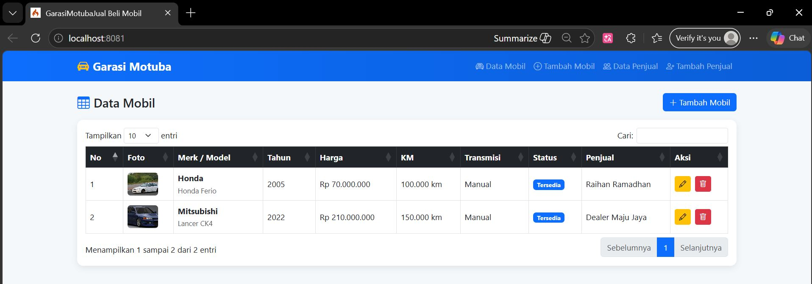
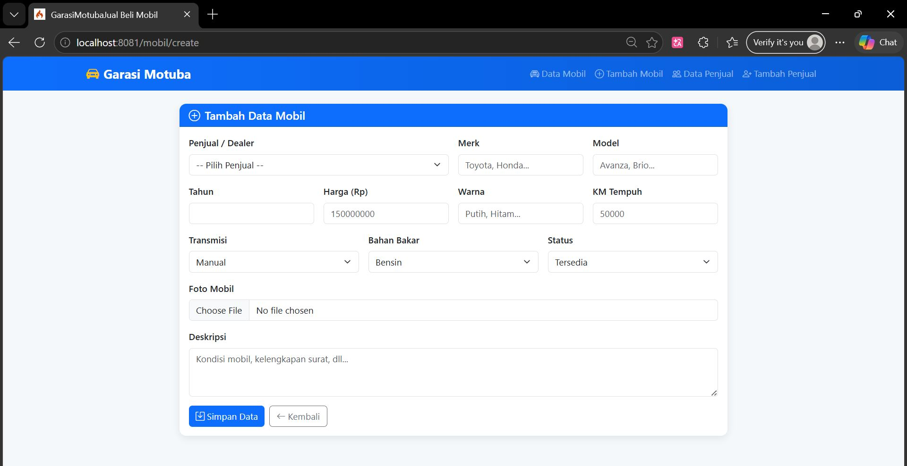
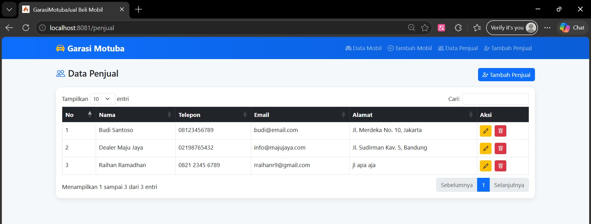
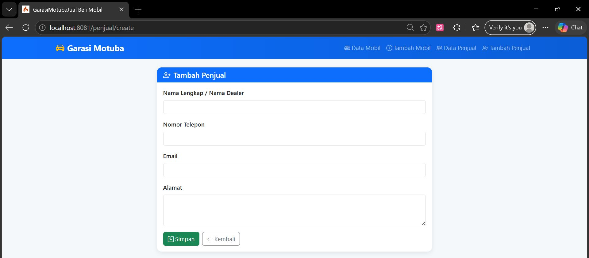
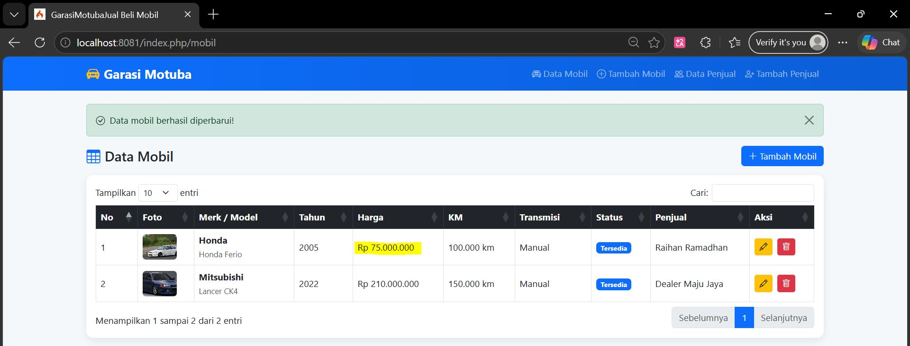
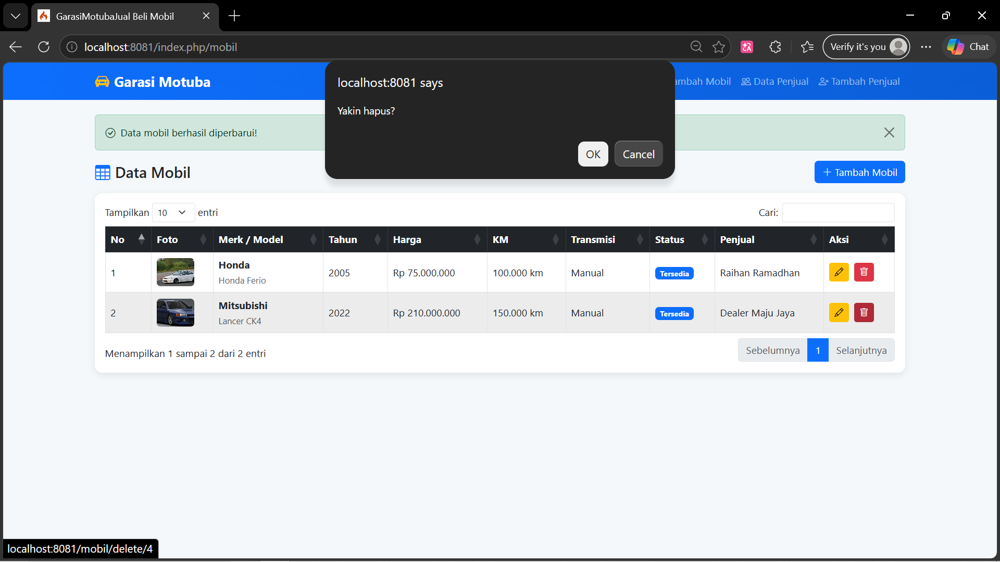
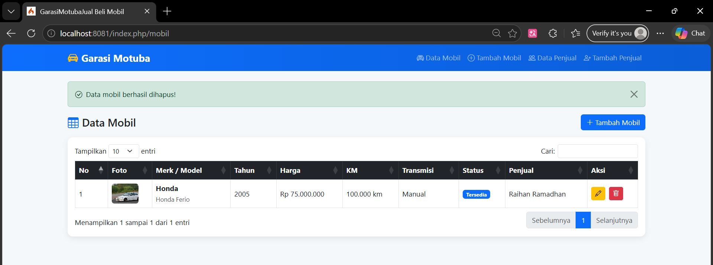

<div align="center">

# LAPORAN PRAKTIKUM  
# APLIKASI BERBASIS PLATFORM

## COTS 2

  

### Disusun Oleh
**Raihan Ramadhan**  
2311102040  
S1 IF-11-REG01  

### Dosen Pengampu
**Dimas Fanny Hebrasianto Permadi, S.ST., M.Kom**

### Asisten Praktikum
Apri Pandu Wicaksono  
Rangga Pradarrell Fathi  

### LABORATORIUM HIGH PERFORMANCE  
FAKULTAS INFORMATIKA  
UNIVERSITAS TELKOM PURWOKERTO  
2026

</div>

---

# Dasar Teori
 
## 1. Aplikasi Web
 
Aplikasi web adalah perangkat lunak yang diakses melalui browser internet tanpa perlu diinstal secara lokal pada perangkat pengguna. Berbeda dengan aplikasi desktop, aplikasi web berjalan di atas protokol HTTP/HTTPS dan terdiri dari dua sisi utama, yaitu sisi klien (*client-side*) yang berjalan di browser pengguna, dan sisi server (*server-side*) yang memproses logika bisnis dan berinteraksi dengan basis data. Komponen utama sebuah aplikasi web mencakup antarmuka pengguna (UI), logika aplikasi, dan lapisan penyimpanan data.
 
---
 
## 2. Framework CodeIgniter (CI)
 
CodeIgniter adalah framework pengembangan aplikasi web berbasis bahasa pemrograman PHP yang bersifat open-source dan ringan (*lightweight*). CodeIgniter dirancang untuk membantu pengembang membangun aplikasi web secara lebih cepat dan terstruktur dibandingkan menulis kode PHP murni dari awal.
 
CodeIgniter mengadopsi pola arsitektur **MVC (Model-View-Controller)**, yaitu:
 
- **Model** — Bertugas mengelola data dan interaksi dengan basis data (database).
- **View** — Bertanggung jawab menampilkan antarmuka kepada pengguna (tampilan/UI).
- **Controller** — Menjadi jembatan antara Model dan View, memproses logika aplikasi dan mengatur alur data.
 
Keunggulan CodeIgniter antara lain performanya yang cepat, dokumentasinya yang lengkap, kemudahan konfigurasi, serta kompatibilitasnya yang baik dengan berbagai server hosting PHP.
 
---
 
## 3. Framework Bootstrap
 
Bootstrap adalah framework CSS front-end open-source yang dikembangkan oleh tim Twitter. Bootstrap menyediakan koleksi komponen UI siap pakai seperti navigasi, tombol, form, tabel, modal, dan sebagainya, yang dapat digunakan untuk membangun tampilan antarmuka web yang responsif dan konsisten di berbagai ukuran layar.
 
Bootstrap menerapkan sistem **grid 12 kolom** yang fleksibel sehingga tata letak halaman dapat menyesuaikan diri (*responsive*) terhadap perangkat desktop, tablet, maupun smartphone. Penggunaan Bootstrap secara signifikan mempercepat proses desain antarmuka tanpa harus menulis CSS dari nol.
 
---
 
## 4. CRUD (Create, Read, Update, Delete)
 
CRUD merupakan singkatan dari empat operasi dasar yang digunakan dalam pengelolaan data pada sebuah sistem informasi, yaitu:
 
- **Create** — Menambahkan data baru ke dalam basis data.
- **Read** — Membaca atau menampilkan data yang sudah tersimpan.
- **Update** — Memperbarui atau mengubah data yang sudah ada.
- **Delete** — Menghapus data dari basis data.
 
Keempat operasi ini merupakan inti dari hampir seluruh aplikasi berbasis data. Dalam konteks pengembangan web, operasi CRUD umumnya dipetakan ke metode HTTP: POST (*Create*), GET (*Read*), PUT/PATCH (*Update*), dan DELETE (*Delete*).
 
---
 
## 5. jQuery
 
jQuery adalah library JavaScript yang ringan, cepat, dan kaya fitur. jQuery menyederhanakan berbagai operasi JavaScript yang kompleks seperti manipulasi DOM, penanganan event, animasi, dan komunikasi dengan server menggunakan AJAX, sehingga dapat ditulis dengan sintaks yang lebih singkat dan mudah dipahami.
 
Salah satu keunggulan jQuery adalah kompatibilitasnya lintas browser (*cross-browser compatibility*), yang memastikan kode JavaScript berjalan konsisten di berbagai browser. jQuery juga memiliki ekosistem plugin yang sangat luas, memungkinkan pengembang menambah fungsionalitas tambahan dengan mudah.
 
---
 
## 6. jQuery Plugin
 
jQuery Plugin adalah ekstensi atau tambahan yang dibangun di atas library jQuery untuk menambahkan fungsionalitas tertentu yang tidak tersedia secara bawaan. Plugin jQuery ditulis menggunakan mekanisme `$.fn` sehingga dapat dipanggil langsung pada elemen-elemen jQuery yang telah diseleksi.
 
Contoh plugin jQuery yang umum digunakan dalam pengembangan aplikasi web antara lain:
 
- **jQuery Validation** — untuk validasi form secara otomatis di sisi klien.
- **Select2** — untuk pembuatan dropdown yang lebih interaktif.
- **SweetAlert2** — untuk menampilkan dialog/notifikasi yang lebih menarik.
- **DataTables** — untuk menampilkan data tabel secara dinamis.
 
---
 
## 7. DataTables jQuery Plugin
 
DataTables adalah plugin jQuery yang powerful dan populer untuk menampilkan data dalam format tabel HTML secara interaktif. DataTables secara otomatis menambahkan fitur-fitur canggih pada tabel biasa, antara lain:
 
- **Pencarian (*Search*)** — menyaring data secara real-time berdasarkan kata kunci.
- **Pengurutan (*Sorting*)** — mengurutkan data berdasarkan kolom tertentu.
- **Paginasi (*Pagination*)** — membagi data ke dalam beberapa halaman agar lebih mudah dinavigasi.
- **Tampilan responsif** — menyesuaikan tampilan tabel di berbagai ukuran layar.
 
DataTables mendukung berbagai sumber data, salah satunya adalah format **JSON** (*JavaScript Object Notation*) yang dapat dimuat secara dinamis dari server menggunakan AJAX, sehingga tabel dapat menampilkan data terkini tanpa harus me-reload seluruh halaman.
 
---
 
## 8. JSON (JavaScript Object Notation)
 
JSON adalah format pertukaran data yang ringan, mudah dibaca oleh manusia, dan mudah diproses oleh mesin. JSON menggunakan struktur pasangan *key-value* dan mendukung tipe data seperti string, angka, array, objek, boolean, dan null.
 
Dalam pengembangan aplikasi web modern, JSON menjadi format standar untuk pertukaran data antara server dan klien, khususnya dalam komunikasi berbasis AJAX. Contoh struktur data JSON:
 
```json
{
  "id": 1,
  "nama": "Budi Santoso",
  "email": "budi@example.com",
  "jurusan": "Teknik Informatika"
}
```
 
Pada implementasi DataTables, data JSON dikirim dari server (CodeIgniter) melalui method controller yang mengembalikan response JSON, kemudian DataTables mengolah dan menampilkannya secara otomatis dalam format tabel yang interaktif.
 
---
 
## 9. Basis Data (Database) dengan MySQL
 
MySQL adalah sistem manajemen basis data relasional (*Relational Database Management System* / RDBMS) yang paling banyak digunakan dalam pengembangan aplikasi web berbasis PHP. MySQL menggunakan bahasa **SQL (*Structured Query Language*)** untuk melakukan operasi pada data seperti penyimpanan, pengambilan, pembaruan, dan penghapusan.
 
Dalam pengembangan menggunakan CodeIgniter, koneksi ke basis data MySQL dikonfigurasi melalui file `application/config/database.php`. CodeIgniter menyediakan **Query Builder** (sebelumnya disebut Active Record) yang memudahkan penulisan query database secara lebih aman dan terstruktur tanpa harus menulis SQL mentah secara langsung.
 
---

## Struktur Folder Aplikasi Jual Beli Mobil (CodeIgniter 4)

```bash
JUALBELIMOBIL/
├── app/
│ ├── Config/
│ │ ├── App.php
│ │ └── Routes.php
│ │
│ ├── Controllers/
│ │ ├── BaseController.php
│ │ ├── MobilController.php
│ │ └── PenjualController.php
│ │
│ ├── Models/
│ │ ├── MobilModel.php
│ │ └── PenjualModel.php
│ │
│ └── Views/
│ ├── layouts/
│ │ └── main.php
│ │
│ ├── mobil/
│ │ ├── index.php
│ │ ├── create.php
│ │ └── edit.php
│ │
│ ├── penjual/
│ │ ├── index.php
│ │ ├── create.php
│ │ └── edit.php
│ │
│ └── welcome_message.php
├── .env
└── 
```

## Keterangan Struktur

- **app/Config** → Berisi konfigurasi aplikasi seperti routing dan pengaturan utama  
- **app/Controllers** → Mengatur alur logika aplikasi (CRUD Mobil & Penjual)  
- **app/Models** → Menghubungkan aplikasi dengan database  
- **app/Views** → Tampilan antarmuka (Form, Tabel, Layout)  
- **.env** → Konfigurasi environment (database, dll)  

---
## 4. Cara Menjalankan Aplikasi

**1. Buka folder project di VS Code**  

Pastikan sudah terinstall:
- PHP (minimal versi 7.4 / 8.x)  
- Composer  
- Web Server XAMPP  

---

**2. Install dependency**

```bash
composer install
```
---

**3. Konfigurasi file .env**  
```bash
database.default.hostname = localhost
database.default.database = jualbelimobil
database.default.username = root
database.default.password =
database.default.DBDriver = MySQLi
```
---
**4. Jalankan server CodeIgniter 4**
```bash
php spark serve
```
---
**5.Buka browser dan akses alamat berikut**
```bash
http://localhost:8081
```
---

## 5. Kode Program

### A. `App.php`

```php
<?php

namespace Config;

use CodeIgniter\Config\BaseConfig;

class App extends BaseConfig
{
  public string $baseURL = 'http://localhost:8081/';
  public string $indexPage = 'index.php';
  public string $uriProtocol = 'REQUEST_URI';
  public string $defaultLocale = 'en';
  public string $appTimezone = 'UTC';
  public string $charset = 'UTF-8';
}

```

**Penjelasan `App.php`**

File App.php merupakan file konfigurasi utama pada framework CodeIgniter 4 yang digunakan untuk mengatur berbagai pengaturan dasar aplikasi. Pada file ini terdapat pengaturan seperti baseURL yang menentukan alamat utama aplikasi, indexPage yang menentukan file utama, serta uriProtocol yang digunakan untuk membaca URL dari request. Selain itu, terdapat juga pengaturan seperti defaultLocale untuk bahasa, appTimezone untuk zona waktu, dan charset untuk encoding karakter. Pada aplikasi ini, baseURL diatur ke http://localhost:8081/ karena server berjalan pada port tersebut.

---

### B. `Routes.php`

```php
<?php

use CodeIgniter\Router\RouteCollection;

/**
 * @var RouteCollection $routes
 */
$routes->get('/', 'MobilController::index');

// Mobil routes
$routes->get('mobil', 'MobilController::index');
$routes->get('mobil/create', 'MobilController::create');
$routes->post('mobil/store', 'MobilController::store');
$routes->get('mobil/edit/(:num)', 'MobilController::edit/$1');
$routes->post('mobil/update/(:num)', 'MobilController::update/$1');
$routes->get('mobil/delete/(:num)', 'MobilController::delete/$1');
$routes->get('mobil/json', 'MobilController::getJson'); 

// Penjual routes
$routes->get('penjual', 'PenjualController::index');
$routes->get('penjual/create', 'PenjualController::create');
$routes->post('penjual/store', 'PenjualController::store');
$routes->get('penjual/json', 'PenjualController::getJson');
$routes->get('penjual/delete/(:num)', 'PenjualController::delete/$1');
$routes->get('penjual/edit/(:num)', 'PenjualController::edit/$1');
$routes->post('penjual/update/(:num)', 'PenjualController::update/$1');
```

**Penjelasan `Routes.php`**

File Routes.php digunakan untuk mengatur routing atau pemetaan URL ke controller pada aplikasi CodeIgniter 4. Routing ini berfungsi agar setiap URL yang diakses oleh pengguna dapat diarahkan ke method tertentu pada controller.

Pada bagian awal, route '/' diarahkan ke MobilController::index sehingga halaman utama aplikasi langsung menampilkan data mobil. Selanjutnya terdapat routing untuk fitur mobil yang mencakup proses CRUD, seperti menampilkan data (index), menampilkan form tambah (create), menyimpan data (store), mengedit (edit), memperbarui (update), dan menghapus data (delete). Selain itu, terdapat route mobil/json yang digunakan untuk mengambil data dalam format JSON untuk kebutuhan DataTables.

Pada bagian penjual, routing juga dibuat untuk mengelola data penjual dengan fungsi yang hampir sama, yaitu menampilkan data, menambah, mengedit, memperbarui, dan menghapus data. Terdapat juga route penjual/json yang digunakan untuk menampilkan data dalam format JSON.

Dengan adanya routing ini, aplikasi menjadi lebih terstruktur dan memudahkan dalam pengelolaan URL serta pengembangan fitur.

---

### C. `MobilController.php`

```php
<?php
namespace App\Controllers;

use App\Models\MobilModel;
use App\Models\PenjualModel;

class MobilController extends BaseController {
    protected $mobilModel;
    protected $penjualModel;

    public function __construct() {
        $this->mobilModel = new MobilModel();
        $this->penjualModel = new PenjualModel();
    }

    public function index() {
        return view('mobil/index');
    }

    public function getJson() {
        $data = $this->mobilModel->getMobilWithPenjual();

        $result = array_map(function($row, $i) {
            return [
                'no' => $i + 1,
                'merk' => $row['merk'],
                'model' => $row['model'],
                'tahun' => $row['tahun'],
                'harga' => 'Rp ' . number_format($row['harga'], 0, ',', '.'),
                'nama_penjual' => $row['nama_penjual'] ?? '-',
            ];
        }, $data, array_keys($data));

        return $this->response->setJSON(['data' => $result]);
    }

    public function create() {
        $data['penjual'] = $this->penjualModel->findAll();
        return view('mobil/create', $data);
    }

    public function store() {
        $this->mobilModel->insert([
            'merk' => $this->request->getPost('merk'),
            'model' => $this->request->getPost('model'),
            'tahun' => $this->request->getPost('tahun'),
            'harga' => $this->request->getPost('harga')
        ]);

        return redirect()->to('/mobil');
    }

    public function edit($id) {
        $data['mobil'] = $this->mobilModel->find($id);
        return view('mobil/edit', $data);
    }

    public function update($id) {
        $this->mobilModel->update($id, [
            'merk' => $this->request->getPost('merk'),
            'model' => $this->request->getPost('model'),
            'tahun' => $this->request->getPost('tahun'),
            'harga' => $this->request->getPost('harga')
        ]);

        return redirect()->to('/mobil');
    }

    public function delete($id) {
        $this->mobilModel->delete($id);
        return redirect()->to('/mobil');
    }
}
```
**Penjelasan `MobilController.php`**

File MobilController.php merupakan controller yang digunakan untuk mengatur seluruh logika aplikasi terkait data mobil. Controller ini menghubungkan antara view (tampilan) dan model (database) sehingga proses CRUD dapat berjalan dengan baik.

Pada method index(), controller menampilkan halaman utama yang berisi tabel data mobil. Method getJson() digunakan untuk mengambil data dari database dalam format JSON yang akan digunakan oleh DataTables (jQuery plugin). Data yang diambil kemudian diproses menggunakan array_map() agar sesuai dengan format yang dibutuhkan sebelum dikirim sebagai response JSON.

Method create() digunakan untuk menampilkan halaman form tambah data mobil, serta mengambil data penjual untuk ditampilkan dalam pilihan. Method store() digunakan untuk menyimpan data mobil yang diinput melalui form ke dalam database menggunakan method insert() dari model.

Selanjutnya, method edit() digunakan untuk menampilkan data mobil yang akan diedit, sedangkan method update() digunakan untuk memperbarui data mobil yang sudah ada di database. Terakhir, method delete() digunakan untuk menghapus data mobil berdasarkan id.

Dengan adanya controller ini, seluruh proses pengolahan data mobil mulai dari input, tampil, edit, hingga hapus dapat berjalan secara terstruktur.

---

### D. `PenjualController.php`

```php
<?php
namespace App\Controllers;

use App\Models\PenjualModel;

class PenjualController extends BaseController {
    protected $penjualModel;

    public function __construct() {
        $this->penjualModel = new PenjualModel();
    }

    public function index() {
        $data['penjual'] = $this->penjualModel->findAll();
        return view('penjual/index', $data);
    }

    public function create() {
        return view('penjual/create');
    }

    public function store() {
        $this->penjualModel->insert([
            'nama'    => $this->request->getPost('nama'),
            'telepon' => $this->request->getPost('telepon'),
            'email'   => $this->request->getPost('email'),
            'alamat'  => $this->request->getPost('alamat'),
        ]);

        return redirect()->to('/penjual');
    }

    public function edit($id) {
        $data['penjual'] = $this->penjualModel->find($id);
        return view('penjual/edit', $data);
    }

    public function update($id) {
        $this->penjualModel->update($id, [
            'nama'    => $this->request->getPost('nama'),
            'telepon' => $this->request->getPost('telepon'),
            'email'   => $this->request->getPost('email'),
            'alamat'  => $this->request->getPost('alamat'),
        ]);

        return redirect()->to('/penjual');
    }

    public function delete($id) {
        $this->penjualModel->delete($id);
        return redirect()->to('/penjual');
    }

    public function getJson() {
        $data = $this->penjualModel->findAll();

        $result = [];
        foreach ($data as $i => $p) {
            $result[] = [
                'no' => $i + 1,
                'nama' => $p['nama'],
                'telepon' => $p['telepon'],
                'email' => $p['email'],
                'alamat' => $p['alamat']
            ];
        }

        return $this->response->setJSON(['data' => $result]);
    }
}
```
**Penjelasan `PenjualController.php`**

File PenjualController.php merupakan controller yang digunakan untuk mengelola data penjual pada aplikasi. Controller ini berfungsi sebagai penghubung antara view dan model sehingga proses pengolahan data penjual dapat berjalan dengan baik.

Method index() digunakan untuk menampilkan seluruh data penjual yang diambil dari database menggunakan method findAll(). Data tersebut kemudian dikirim ke view untuk ditampilkan dalam bentuk tabel. Method create() digunakan untuk menampilkan halaman form input data penjual.

Method store() berfungsi untuk menyimpan data penjual yang diinput melalui form ke dalam database dengan menggunakan method insert(). Data yang diambil berasal dari input pengguna melalui getPost().

Selanjutnya, method edit() digunakan untuk mengambil data penjual berdasarkan id yang akan diedit, sedangkan method update() digunakan untuk memperbarui data penjual yang sudah ada di database. Method delete() digunakan untuk menghapus data penjual berdasarkan id.

Method getJson() digunakan untuk mengambil data penjual dalam format JSON yang akan digunakan oleh DataTables (jQuery plugin). Data diproses terlebih dahulu ke dalam array sebelum dikirim sebagai response JSON agar sesuai dengan format yang dibutuhkan oleh DataTables.

Dengan adanya controller ini, seluruh proses CRUD data penjual dapat berjalan secara terstruktur dan terintegrasi dengan baik.

---

### E. `Views/Mobil/Create.php`

```php
<?= $this->extend('layouts/main') ?>
<?= $this->section('content') ?>

<div class="row justify-content-center">
  <div class="col-lg-9">
    <div class="card">
      <div class="card-header bg-primary text-white">
        <h5 class="mb-0"><i class="bi bi-plus-circle me-2"></i>Tambah Data Mobil</h5>
      </div>
      <div class="card-body">
        <form id="formTambah" action="/mobil/store" method="post" enctype="multipart/form-data">
          <?= csrf_field() ?>

          <div class="row g-3">
            <div class="col-md-6">
              <label class="form-label fw-semibold">Penjual / Dealer</label>
              <select name="penjual_id" class="form-select" required>
                <option value="">-- Pilih Penjual --</option>
                <?php foreach ($penjual as $p): ?>
                  <option value="<?= $p['id'] ?>"><?= $p['nama'] ?></option>
                <?php endforeach; ?>
              </select>
            </div>

            <div class="col-md-3">
              <label class="form-label fw-semibold">Merk</label>
              <input type="text" name="merk" class="form-control" placeholder="Toyota, Honda..." required>
            </div>

            <div class="col-md-3">
              <label class="form-label fw-semibold">Model</label>
              <input type="text" name="model" class="form-control" placeholder="Avanza, Brio..." required>
            </div>

            <div class="col-md-3">
              <label class="form-label fw-semibold">Tahun</label>
              <input type="number" name="tahun" class="form-control" min="1990" max="2025" required>
            </div>

            <div class="col-md-3">
              <label class="form-label fw-semibold">Harga (Rp)</label>
              <input type="number" name="harga" class="form-control" placeholder="150000000" required>
            </div>

            <div class="col-md-3">
              <label class="form-label fw-semibold">Warna</label>
              <input type="text" name="warna" class="form-control" placeholder="Putih, Hitam...">
            </div>

            <div class="col-md-3">
              <label class="form-label fw-semibold">KM Tempuh</label>
              <input type="number" name="km_tempuh" class="form-control" placeholder="50000">
            </div>

            <div class="col-md-4">
              <label class="form-label fw-semibold">Transmisi</label>
              <select name="transmisi" class="form-select">
                <option value="Manual">Manual</option>
                <option value="Otomatis">Otomatis</option>
              </select>
            </div>

            <div class="col-md-4">
              <label class="form-label fw-semibold">Bahan Bakar</label>
              <select name="bahan_bakar" class="form-select">
                <option value="Bensin">Bensin</option>
                <option value="Diesel">Diesel</option>
                <option value="Listrik">Listrik</option>
                <option value="Hybrid">Hybrid</option>
              </select>
            </div>

            <div class="col-md-4">
              <label class="form-label fw-semibold">Status</label>
              <select name="status" class="form-select">
                <option value="Tersedia">Tersedia</option>
                <option value="Proses">Proses</option>
                <option value="Terjual">Terjual</option>
              </select>
            </div>

            <div class="col-12">
              <label class="form-label fw-semibold">Foto Mobil</label>
              <input type="file" name="foto" class="form-control" accept="image/*" id="inputFoto">
              <div id="previewFoto" class="mt-2 d-none">
                
              </div>
            </div>

            <div class="col-12">
              <label class="form-label fw-semibold">Deskripsi</label>
              <textarea name="deskripsi" class="form-control" rows="3" placeholder="Kondisi mobil, kelengkapan surat, dll..."></textarea>
            </div>

            <div class="col-12 d-flex gap-2">
              <button type="submit" class="btn btn-primary">
                <i class="bi bi-save me-1"></i>Simpan Data
              </button>
              <a href="/mobil" class="btn btn-outline-secondary">
                <i class="bi bi-arrow-left me-1"></i>Kembali
              </a>
            </div>
          </div>
        </form>
      </div>
    </div>
  </div>
</div>

<?= $this->endSection() ?>

<?= $this->section('scripts') ?>
<script>
$(document).ready(function() {
    // Preview foto sebelum upload (jQuery plugin usage)
    $('#inputFoto').on('change', function() {
        var file = this.files[0];
        if (file) {
            var reader = new FileReader();
            reader.onload = function(e) {
                $('#gambarPreview').attr('src', e.target.result);
                $('#previewFoto').removeClass('d-none');
            };
            reader.readAsDataURL(file);
        }
    });

    // jQuery Validate plugin
    $('#formTambah').validate({
        rules: {
            merk:   { required: true, minlength: 2 },
            model:  { required: true, minlength: 2 },
            tahun:  { required: true, digits: true, min: 1990, max: 2025 },
            harga:  { required: true, digits: true, min: 1 },
        },
        messages: {
            merk:  { required: 'Merk wajib diisi', minlength: 'Minimal 2 karakter' },
            model: { required: 'Model wajib diisi' },
            tahun: { required: 'Tahun wajib diisi', min: 'Minimal 1990', max: 'Maksimal 2025' },
            harga: { required: 'Harga wajib diisi', min: 'Harga harus lebih dari 0' },
        },
        errorClass: 'is-invalid',
        validClass: 'is-valid',
        errorElement: 'div',
        errorPlacement: function(error, element) {
            error.addClass('invalid-feedback');
            element.closest('.col-md-3, .col-md-4, .col-12, .col-md-6').append(error);
        }
    });
});
</script>
<?= $this->endSection() ?>
```
**Penjelasan `Views/Mobil/Create.php`**

File create.php merupakan bagian dari view yang digunakan untuk menampilkan form input data mobil kepada pengguna. Pada halaman ini, pengguna dapat mengisi data seperti merk, model, tahun, harga, serta mengunggah foto mobil.

Form menggunakan method POST dengan action /mobil/store, yang berarti data akan diproses oleh method store() pada MobilController. Atribut enctype="multipart/form-data" digunakan agar form dapat mengirim file berupa gambar.

Fungsi csrf_field() digunakan untuk memberikan keamanan tambahan dari serangan CSRF. Setiap input memiliki atribut name yang sesuai dengan data yang diambil di controller menggunakan getPost().

Selain itu, terdapat script jQuery yang digunakan untuk menampilkan preview gambar sebelum diunggah menggunakan FileReader, serta validasi form menggunakan plugin jQuery Validate agar input tidak kosong sebelum dikirim ke server.

---

### F. `Views/Mobil/Edit.php`

```php
<?= $this->extend('layouts/main') ?>
<?= $this->section('content') ?>

<div class="row justify-content-center">
  <div class="col-lg-9">
    <div class="card">
      <div class="card-header bg-warning">
        <h5 class="mb-0"><i class="bi bi-pencil-square me-2"></i>Edit Data Mobil</h5>
      </div>
      <div class="card-body">
        <form id="formEdit" action="/mobil/update/<?= $mobil['id'] ?>" method="post" enctype="multipart/form-data">
          <?= csrf_field() ?>

          <div class="row g-3">
            <div class="col-md-6">
              <label class="form-label fw-semibold">Penjual / Dealer</label>
              <select name="penjual_id" class="form-select">
                <option value="">-- Pilih Penjual --</option>
                <?php foreach ($penjual as $p): ?>
                  <option value="<?= $p['id'] ?>" <?= $p['id'] == $mobil['penjual_id'] ? 'selected' : '' ?>>
                    <?= $p['nama'] ?>
                  </option>
                <?php endforeach; ?>
              </select>
            </div>

            <div class="col-md-3">
              <label class="form-label fw-semibold">Merk</label>
              <input type="text" name="merk" class="form-control" value="<?= $mobil['merk'] ?>" required>
            </div>

            <div class="col-md-3">
              <label class="form-label fw-semibold">Model</label>
              <input type="text" name="model" class="form-control" value="<?= $mobil['model'] ?>" required>
            </div>

            <div class="col-md-3">
              <label class="form-label fw-semibold">Tahun</label>
              <input type="number" name="tahun" class="form-control" value="<?= $mobil['tahun'] ?>" min="1990" max="2025" required>
            </div>

            <div class="col-md-3">
              <label class="form-label fw-semibold">Harga (Rp)</label>
              <input type="number" name="harga" class="form-control" value="<?= $mobil['harga'] ?>" required>
            </div>

            <div class="col-md-3">
              <label class="form-label fw-semibold">Warna</label>
              <input type="text" name="warna" class="form-control" value="<?= $mobil['warna'] ?>">
            </div>

            <div class="col-md-3">
              <label class="form-label fw-semibold">KM Tempuh</label>
              <input type="number" name="km_tempuh" class="form-control" value="<?= $mobil['km_tempuh'] ?>">
            </div>

            <div class="col-md-4">
              <label class="form-label fw-semibold">Transmisi</label>
              <select name="transmisi" class="form-select">
                <option value="Manual"   <?= $mobil['transmisi'] == 'Manual'   ? 'selected' : '' ?>>Manual</option>
                <option value="Otomatis" <?= $mobil['transmisi'] == 'Otomatis' ? 'selected' : '' ?>>Otomatis</option>
              </select>
            </div>

            <div class="col-md-4">
              <label class="form-label fw-semibold">Bahan Bakar</label>
              <select name="bahan_bakar" class="form-select">
                <?php foreach (['Bensin','Diesel','Listrik','Hybrid'] as $bb): ?>
                  <option value="<?= $bb ?>" <?= $mobil['bahan_bakar'] == $bb ? 'selected' : '' ?>><?= $bb ?></option>
                <?php endforeach; ?>
              </select>
            </div>

            <div class="col-md-4">
              <label class="form-label fw-semibold">Status</label>
              <select name="status" class="form-select">
                <?php foreach (['Tersedia','Proses','Terjual'] as $st): ?>
                  <option value="<?= $st ?>" <?= $mobil['status'] == $st ? 'selected' : '' ?>><?= $st ?></option>
                <?php endforeach; ?>
              </select>
            </div>

            <div class="col-12">
              <label class="form-label fw-semibold">Foto Mobil</label>
              <?php if ($mobil['foto']): ?>
                <div class="mb-2">
                  " style="max-height:150px; border-radius:8px;">
                  <small class="text-muted d-block mt-1">Upload foto baru untuk mengganti</small>
                </div>
              <?php endif; ?>
              <input type="file" name="foto" class="form-control" accept="image/*" id="inputFotoEdit">
              <div id="previewFotoEdit" class="mt-2 d-none">
                
              </div>
            </div>

            <div class="col-12">
              <label class="form-label fw-semibold">Deskripsi</label>
              <textarea name="deskripsi" class="form-control" rows="3"><?= $mobil['deskripsi'] ?></textarea>
            </div>

            <div class="col-12 d-flex gap-2">
              <button type="submit" class="btn btn-warning">
                <i class="bi bi-save me-1"></i>Update Data
              </button>
              <a href="/mobil" class="btn btn-outline-secondary">
                <i class="bi bi-arrow-left me-1"></i>Kembali
              </a>
            </div>
          </div>
        </form>
      </div>
    </div>
  </div>
</div>

<?= $this->endSection() ?>
<?= $this->section('scripts') ?>
<script>
$(document).ready(function() {
    $('#inputFotoEdit').on('change', function() {
        var file = this.files[0];
        if (file) {
            var reader = new FileReader();
            reader.onload = function(e) {
                $('#gambarPreviewEdit').attr('src', e.target.result);
                $('#previewFotoEdit').removeClass('d-none');
            };
            reader.readAsDataURL(file);
        }
    });

    $('#formEdit').validate({
        rules: {
            merk:  { required: true },
            model: { required: true },
            tahun: { required: true, digits: true },
            harga: { required: true, digits: true },
        },
        errorClass: 'is-invalid',
        errorElement: 'div',
        errorPlacement: function(error, element) {
            error.addClass('invalid-feedback');
            element.closest('[class^="col-"]').append(error);
        }
    });
});
</script>
<?= $this->endSection() ?>
```
**Penjelasan `ViewsMobil/Edit.php`**
File edit.php merupakan view yang digunakan untuk menampilkan form edit data mobil. Pada halaman ini, seluruh input telah terisi otomatis berdasarkan data yang diambil dari database sehingga pengguna dapat langsung melakukan perubahan tanpa menginput ulang dari awal.

Form menggunakan method POST dengan action /mobil/update/{id}, yang akan diproses oleh method update() pada MobilController. Data ditampilkan menggunakan variabel $mobil sehingga setiap field seperti merk, model, tahun, dan lainnya dapat ditampilkan sesuai data yang dipilih.

Selain itu, terdapat fitur untuk menampilkan foto mobil yang sudah tersimpan sebelumnya. Jika pengguna ingin mengganti foto, maka dapat mengunggah file baru melalui input file yang tersedia.

Script jQuery digunakan untuk menampilkan preview gambar baru sebelum diupload menggunakan FileReader, sehingga meningkatkan pengalaman pengguna. Selain itu, digunakan plugin jQuery Validate untuk memastikan data yang diinput valid sebelum dikirim ke server.

Dengan adanya halaman ini, proses update data mobil dapat dilakukan dengan mudah, terstruktur, dan user-friendly.

---

### G. `Views\mobil\index.php`

```php
<?= $this->extend('layouts/main') ?>
<?= $this->section('content') ?>

<div class="d-flex justify-content-between align-items-center mb-3">
  <h4 class="mb-0"><i class="bi bi-table me-2 text-primary"></i>Data Mobil</h4>
  <a href="/mobil/create" class="btn btn-primary">
    <i class="bi bi-plus-lg me-1"></i>Tambah Mobil
  </a>
</div>

<div class="card">
  <div class="card-body">
    <table id="tabelMobil" class="table table-bordered table-hover align-middle w-100">
      <thead class="table-dark">
        <tr>
          <th>No</th>
          <th>Foto</th>
          <th>Merk / Model</th>
          <th>Tahun</th>
          <th>Harga</th>
          <th>KM</th>
          <th>Transmisi</th>
          <th>Status</th>
          <th>Penjual</th>
          <th>Aksi</th>
        </tr>
      </thead>
    </table>
  </div>
</div>

<?= $this->endSection() ?>

<?= $this->section('scripts') ?>
<script>
$(document).ready(function() {
    $('#tabelMobil').DataTable({
        processing: true, 
        ajax: {
            url: '/mobil/json',
            type: 'GET',
            dataSrc: 'data'
        },
        columns: [
            { data: 'no' },
            {
                data: 'foto',
                render: function(data) {
                    if (data) {
                        return '';
                    }
                    return '-';
                }
            },
            {
                data: 'merk',
                render: function(data, type, row) {
                    return '<strong>' + data + '</strong><br><small class="text-muted">' + row.model + '</small>';
                }
            },
            { data: 'tahun' },
            { data: 'harga' },
            { data: 'km_tempuh' },
            { data: 'transmisi' },
            {
                data: 'status',
                render: function(data) {
                    let cls = {
                        'Tersedia': 'badge-tersedia',
                        'Terjual': 'badge-terjual',
                        'Proses': 'badge-proses'
                    };
                    return '<span class="badge ' + (cls[data] || 'bg-secondary') + '">' + data + '</span>';
                }
            },
            { data: 'nama_penjual' },
            {
                data: 'id',
                render: function(data) {
                    return `
                        <a href="/mobil/edit/${data}" class="btn btn-warning btn-sm me-1">
                            <i class="bi bi-pencil"></i>
                        </a>
                        <a href="/mobil/delete/${data}" class="btn btn-danger btn-sm"
                           onclick="return confirm('Yakin hapus?')">
                            <i class="bi bi-trash"></i>
                        </a>
                    `;
                }
            }
        ],
        language: {
            url: 'https://cdn.datatables.net/plug-ins/1.13.6/i18n/id.json'
        }
    });
});
</script>
<?= $this->endSection() ?>
```
**Penjelasan `Views/Mobil/Indext.php`**

File index.php merupakan halaman utama yang digunakan untuk menampilkan data mobil dalam bentuk tabel. Halaman ini menggunakan plugin DataTables (jQuery) sehingga data dapat ditampilkan secara dinamis, interaktif, dan responsif.

Pada bagian atas terdapat tombol "Tambah Mobil" yang mengarahkan pengguna ke halaman form input data. Tabel yang digunakan memiliki id tabelMobil dan akan diisi secara otomatis menggunakan data dari server dalam format JSON.

Data diambil melalui AJAX dari endpoint /mobil/json yang berasal dari method getJson() pada MobilController. Data tersebut kemudian dipetakan ke dalam kolom-kolom tabel seperti nomor, foto, merk/model, tahun, harga, dan lainnya.

Beberapa kolom menggunakan fungsi render, seperti:

Kolom foto untuk menampilkan gambar mobil.
Kolom merk/model untuk menampilkan dua informasi dalam satu kolom.
Kolom status untuk menampilkan badge dengan warna berbeda sesuai status.
Kolom aksi untuk tombol edit dan hapus.

Selain itu, digunakan fitur processing dari DataTables untuk meningkatkan performa saat memuat data. Bahasa tabel juga disesuaikan ke Bahasa Indonesia menggunakan file konfigurasi dari CDN.

Dengan adanya DataTables ini, aplikasi memenuhi requirement penggunaan jQuery plugin dan JSON data, serta membuat tampilan data menjadi lebih profesional dan mudah digunakan.

---

### I. `Views\penjual\create`

```php
<!-- penjual/create.php -->
<?= $this->extend('layouts/main') ?>
<?= $this->section('content') ?>
<div class="row justify-content-center">
  <div class="col-lg-7">
    <div class="card">
      <div class="card-header bg-success text-white">
        <h5 class="mb-0"><i class="bi bi-person-plus me-2"></i>Tambah Penjual</h5>
      </div>
      <div class="card-body">
        <form id="formPenjual" action="/penjual/store" method="post">
          <?= csrf_field() ?>
          <div class="mb-3">
            <label class="form-label fw-semibold">Nama Lengkap / Nama Dealer</label>
            <input type="text" name="nama" class="form-control" required>
          </div>
          <div class="mb-3">
            <label class="form-label fw-semibold">Nomor Telepon</label>
            <input type="text" name="telepon" class="form-control">
          </div>
          <div class="mb-3">
            <label class="form-label fw-semibold">Email</label>
            <input type="email" name="email" class="form-control">
          </div>
          <div class="mb-3">
            <label class="form-label fw-semibold">Alamat</label>
            <textarea name="alamat" class="form-control" rows="3"></textarea>
          </div>
          <div class="d-flex gap-2">
            <button type="submit" class="btn btn-success"><i class="bi bi-save me-1"></i>Simpan</button>
            <a href="/penjual" class="btn btn-outline-secondary"><i class="bi bi-arrow-left me-1"></i>Kembali</a>
          </div>
        </form>
      </div>
    </div>
  </div>
</div>
<?= $this->endSection() ?>
<?= $this->section('scripts') ?>
<script>
$(document).ready(function() {
    $('#formPenjual').validate({
        rules: { nama: { required: true, minlength: 3 } },
        messages: { nama: { required: 'Nama wajib diisi' } },
        errorClass: 'is-invalid',
        errorElement: 'div',
        errorPlacement: function(error, element) {
            error.addClass('invalid-feedback');
            element.parent().append(error);
        }
    });
});
</script>
<?= $this->endSection() ?>
```
**Penjelasan `Views/penjual/create.php`**

File create.php pada folder penjual merupakan view yang digunakan untuk menampilkan form input data penjual. Halaman ini memungkinkan pengguna untuk menambahkan data penjual baru ke dalam sistem.

Form menggunakan method POST dengan action /penjual/store, yang berarti data akan diproses oleh method store() pada PenjualController. Fungsi csrf_field() digunakan untuk memberikan perlindungan terhadap serangan CSRF sehingga keamanan aplikasi lebih terjamin.

Pada form terdapat beberapa input seperti nama, nomor telepon, email, dan alamat. Field nama bersifat wajib diisi karena merupakan identitas utama penjual, sedangkan field lainnya bersifat opsional.

Selain itu, digunakan jQuery Validate sebagai plugin untuk melakukan validasi form di sisi client. Validasi ini memastikan bahwa input nama wajib diisi dengan minimal 3 karakter sebelum data dikirim ke server. Jika terjadi kesalahan, pesan error akan ditampilkan secara langsung di bawah input.

Dengan adanya validasi ini, aplikasi menjadi lebih interaktif dan membantu pengguna dalam menginput data dengan benar sebelum disimpan ke database.

---

### I. `Views\penjual\edit.php`

```php
<?= $this->extend('layouts/main') ?>
<?= $this->section('content') ?>

<div class="row justify-content-center">
  <div class="col-lg-7">
    <div class="card">
      <div class="card-header bg-primary text-white">
        <h5 class="mb-0">
          <i class="bi bi-pencil-square me-2"></i>Edit Penjual
        </h5>
      </div>
      <div class="card-body">
        <form action="/penjual/update/<?= $penjual['id'] ?>" method="post">
          <?= csrf_field() ?>

          <div class="mb-3">
            <label class="form-label fw-semibold">Nama</label>
            <input type="text" name="nama" class="form-control"
                   value="<?= $penjual['nama'] ?>" required>
          </div>

          <div class="mb-3">
            <label class="form-label fw-semibold">Telepon</label>
            <input type="text" name="telepon" class="form-control"
                   value="<?= $penjual['telepon'] ?>">
          </div>

          <div class="mb-3">
            <label class="form-label fw-semibold">Email</label>
            <input type="email" name="email" class="form-control"
                   value="<?= $penjual['email'] ?>">
          </div>

          <div class="mb-3">
            <label class="form-label fw-semibold">Alamat</label>
            <textarea name="alamat" class="form-control" rows="3"><?= $penjual['alamat'] ?></textarea>
          </div>

          <div class="d-flex gap-2">
            <button type="submit" class="btn btn-primary">
              <i class="bi bi-save me-1"></i>Update
            </button>
            <a href="/penjual" class="btn btn-outline-secondary">
              <i class="bi bi-arrow-left me-1"></i>Kembali
            </a>
          </div>

        </form>
      </div>
    </div>
  </div>
</div>

<?= $this->endSection() ?>
```

**Penjelasan `Views/penjual/edit.php`**
File edit.php pada folder penjual digunakan untuk menampilkan form edit data penjual yang sudah ada. Halaman ini memungkinkan pengguna untuk memperbarui informasi penjual seperti nama, telepon, email, dan alamat.

Form menggunakan method POST dengan action /penjual/update/{id}, yang berarti data akan dikirim ke method update() pada PenjualController berdasarkan id penjual yang dipilih.

Berbeda dengan halaman create, pada halaman ini setiap input sudah terisi otomatis dengan data lama menggunakan variabel $penjual. Hal ini memudahkan pengguna untuk melakukan perubahan tanpa harus menginput ulang seluruh data.

Penggunaan csrf_field() tetap diterapkan untuk menjaga keamanan aplikasi dari serangan CSRF.

Pada bagian bawah terdapat dua tombol, yaitu tombol Update untuk menyimpan perubahan dan tombol Kembali untuk kembali ke halaman daftar penjual.

Dengan adanya fitur edit ini, aplikasi telah memenuhi salah satu fungsi utama dalam konsep CRUD yaitu Update, sehingga data dapat diperbarui sesuai kebutuhan pengguna.

---

### J. `Views\penjual\index.php`

```php
<?= $this->extend('layouts/main') ?>
<?= $this->section('content') ?>

<div class="d-flex justify-content-between align-items-center mb-3">
  <h4><i class="bi bi-people me-2 text-primary"></i>Data Penjual</h4>
  <a href="/penjual/create" class="btn btn-primary">
    <i class="bi bi-person-plus me-1"></i>Tambah Penjual
  </a>
</div>

<div class="card">
  <div class="card-body">
    <table id="tabelPenjual" class="table table-bordered table-hover w-100">
      <thead class="table-dark">
        <tr>
          <th>No</th>
          <th>Nama</th>
          <th>Telepon</th>
          <th>Email</th>
          <th>Alamat</th>
          <th>Aksi</th> 
        </tr>
      </thead>
    </table>
  </div>
</div>

<?= $this->endSection() ?>

<?= $this->section('scripts') ?>
<script>
$(document).ready(function() {
    $('#tabelPenjual').DataTable({
        processing: true,
        ajax: {
            url: '/penjual/json',
            dataSrc: 'data'
        },
        columns: [
            { data: 'no' },
            { data: 'nama' },
            { data: 'telepon' },
            { data: 'email' },
            { data: 'alamat' },
            {
                data: 'id', 
                orderable: false,
                render: function(data) {
                    return `
                        <a href="/penjual/edit/${data}" class="btn btn-warning btn-sm me-1">
                            <i class="bi bi-pencil"></i>
                        </a>
                        <a href="/penjual/delete/${data}" 
                          class="btn btn-danger btn-sm"
                          onclick="return confirm('Yakin hapus data ini?')">
                          <i class="bi bi-trash"></i>
                        </a>
                    `;
                }
            }
        ],
        language: {
            url: 'https://cdn.datatables.net/plug-ins/1.13.6/i18n/id.json'
        }
    });
});
</script>
<?= $this->endSection() ?>
```


**Penjelasan `Views/penjual/index.php`**

File index.php pada folder penjual digunakan untuk menampilkan daftar data penjual dalam bentuk tabel. Halaman ini memanfaatkan plugin DataTables (jQuery) untuk menampilkan data secara dinamis, interaktif, dan mudah digunakan.

Pada bagian atas terdapat tombol "Tambah Penjual" yang berfungsi untuk mengarahkan pengguna ke halaman form input data penjual baru.

Tabel dengan id tabelPenjual akan diisi secara otomatis menggunakan data dari server dalam format JSON melalui endpoint /penjual/json, yang berasal dari method getJson() pada PenjualController.

Kolom tabel meliputi nomor, nama, telepon, email, alamat, serta aksi. Pada kolom aksi, terdapat tombol edit dan hapus yang memungkinkan pengguna untuk mengubah atau menghapus data penjual.

Fungsi render digunakan untuk membuat tombol aksi secara dinamis berdasarkan id data. Selain itu, terdapat konfirmasi sebelum penghapusan data untuk menghindari kesalahan pengguna.

Penggunaan DataTables juga memungkinkan fitur seperti pencarian, pagination, dan sorting secara otomatis, sehingga meningkatkan pengalaman pengguna.

Dengan adanya halaman ini, aplikasi telah memenuhi fitur Read (menampilkan data) dalam konsep CRUD serta memenuhi syarat penggunaan jQuery plugin dan JSON dalam tugas praktikum.

---

### K. `Views/layouts/main.php`

```php
<!DOCTYPE html>
<html lang="id">
<head>
  <meta charset="UTF-8">
  <meta name="viewport" content="width=device-width, initial-scale=1.0">
  <title>GarasiMotuba<?= $title ?? 'Jual Beli Mobil' ?></title>

  <!-- Bootstrap 5 -->
  <link href="https://cdn.jsdelivr.net/npm/bootstrap@5.3.0/dist/css/bootstrap.min.css" rel="stylesheet">
  <!-- Bootstrap Icons -->
  <link href="https://cdn.jsdelivr.net/npm/bootstrap-icons@1.11.0/font/bootstrap-icons.css" rel="stylesheet">
  <!-- DataTables + Bootstrap 5 style -->
  <link href="https://cdn.datatables.net/1.13.6/css/dataTables.bootstrap5.min.css" rel="stylesheet">

  <style>
  body { background-color: #f4f8fb; }

  .navbar {
    background: linear-gradient(90deg, #0d6efd, #0b5ed7);
  }

  .navbar-brand {
    font-weight: 700;
    font-size: 1.4rem;
  }

  .card {
    border: none;
    border-radius: 12px;
    box-shadow: 0 4px 12px rgba(0,0,0,0.08);
  }

  .card-header {
    background-color: #0d6efd !important;
    color: #fff;
    border-radius: 12px 12px 0 0 !important;
  }

  .btn-primary {
    background-color: #0d6efd;
    border: none;
  }

  .btn-primary:hover {
    background-color: #0b5ed7;
  }

  .table thead {
    background-color: #0d6efd;
    color: white;
  }

  .badge-tersedia { background-color: #0d6efd; }
  .badge-terjual  { background-color: #dc3545; }
  .badge-proses   { background-color: #ffc107; color: #000; }

  .table-img {
    width: 60px;
    height: 45px;
    object-fit: cover;
    border-radius: 6px;
  }
</style>
</head>
<body>

<!-- Navbar -->
<nav class="navbar navbar-expand-lg navbar-dark bg-dark mb-4">
  <div class="container">
    <a class="navbar-brand" href="/mobil">
      <i class="bi bi-car-front-fill text-warning me-2"></i>Garasi Motuba
    </a>
    <button class="navbar-toggler" type="button" data-bs-toggle="collapse" data-bs-target="#navMenu">
      <span class="navbar-toggler-icon"></span>
    </button>
    <div class="collapse navbar-collapse" id="navMenu">
      <ul class="navbar-nav ms-auto">
        <li class="nav-item">
          <a class="nav-link" href="/mobil"><i class="bi bi-car-front me-1"></i>Data Mobil</a>
        </li>
        <li class="nav-item">
          <a class="nav-link" href="/mobil/create"><i class="bi bi-plus-circle me-1"></i>Tambah Mobil</a>
        </li>
        <li class="nav-item">
          <a class="nav-link" href="/penjual"><i class="bi bi-people me-1"></i>Data Penjual</a>
        </li>
        <li class="nav-item">
          <a class="nav-link" href="/penjual/create"><i class="bi bi-person-plus me-1"></i>Tambah Penjual</a>
        </li>
      </ul>
    </div>
  </div>
</nav>

<!-- Konten halaman -->
<div class="container pb-5">
  <!-- Flash message -->
  <?php if (session()->getFlashdata('success')): ?>
    <div class="alert alert-success alert-dismissible fade show" role="alert">
      <i class="bi bi-check-circle me-2"></i><?= session()->getFlashdata('success') ?>
      <button type="button" class="btn-close" data-bs-dismiss="alert"></button>
    </div>
  <?php endif; ?>

  <?= $this->renderSection('content') ?>
</div>

<!-- jQuery (WAJIB sebelum DataTables) -->
<script src="https://cdn.jsdelivr.net/npm/jquery@3.7.0/dist/jquery.min.js"></script>
<!-- Bootstrap 5 JS -->
<script src="https://cdn.jsdelivr.net/npm/bootstrap@5.3.0/dist/js/bootstrap.bundle.min.js"></script>
<!-- DataTables + Bootstrap 5 -->
<script src="https://cdn.datatables.net/1.13.6/js/jquery.dataTables.min.js"></script>
<script src="https://cdn.datatables.net/1.13.6/js/dataTables.bootstrap5.min.js"></script>
<!-- jQuery Validate Plugin (jQuery plugin wajib) -->
<script src="https://cdn.jsdelivr.net/npm/jquery-validation@1.19.5/dist/jquery.validate.min.js"></script>

<?= $this->renderSection('scripts') ?>
</body>
</html>
```

**Penjelasan `Views/layouts/main.php`**

File main.php merupakan layout utama (template) yang digunakan oleh seluruh halaman pada aplikasi. Layout ini berfungsi sebagai kerangka dasar tampilan sehingga setiap halaman memiliki desain yang konsisten.

Pada bagian <head>, aplikasi menggunakan framework Bootstrap 5 untuk styling, Bootstrap Icons untuk ikon, serta DataTables untuk menampilkan data tabel yang interaktif. Selain itu, terdapat custom CSS untuk memperindah tampilan seperti navbar, card, tombol, dan badge status.

Bagian navbar digunakan sebagai navigasi utama yang berisi menu menuju halaman data mobil, tambah mobil, data penjual, dan tambah penjual. Hal ini memudahkan pengguna dalam berpindah antar halaman.

Pada bagian konten, digunakan <?= $this->renderSection('content') ?> untuk menampilkan isi halaman sesuai view yang dipanggil. Selain itu, terdapat fitur flashdata untuk menampilkan notifikasi sukses setelah melakukan operasi seperti tambah, edit, atau hapus data.

Di bagian bawah, disertakan beberapa library JavaScript seperti:

jQuery sebagai library utama
Bootstrap JS untuk komponen interaktif
DataTables untuk tabel dinamis berbasis JSON
jQuery Validate sebagai plugin validasi form

Penggunaan <?= $this->renderSection('scripts') ?> memungkinkan setiap halaman menambahkan script khusus sesuai kebutuhan.

Dengan adanya layout ini, aplikasi menjadi lebih terstruktur, rapi, dan memenuhi requirement penggunaan Bootstrap serta jQuery plugin dalam pengembangan aplikasi.

---

## 6. Alur CRUD Aplikasi

Aplikasi jual beli mobil ini menerapkan konsep CRUD (Create, Read, Update, Delete) pada dua entitas utama yaitu **Mobil** dan **Penjual**. Berikut penjelasan alur dari masing-masing proses:

### 1. Create (Menambahkan Data)

Proses Create dilakukan ketika pengguna ingin menambahkan data baru.

**Alur:**
1. Pengguna membuka halaman form:
   - `/mobil/create` untuk data mobil
   - `/penjual/create` untuk data penjual
2. Pengguna mengisi form yang tersedia.
3. Data dikirim menggunakan method POST ke:
   - `/mobil/store`
   - `/penjual/store`
4. Controller (`MobilController` atau `PenjualController`) menerima data dari form menggunakan `$this->request->getPost()`.
5. Data disimpan ke database melalui model (`MobilModel` atau `PenjualModel`).
6. Setelah berhasil, sistem menampilkan notifikasi sukses (flashdata) dan redirect ke halaman tabel.

---

### 2. Read (Menampilkan Data)

Proses Read digunakan untuk menampilkan data dalam bentuk tabel.

**Alur:**
1. Pengguna membuka halaman:
   - `/mobil`
   - `/penjual`
2. Halaman view memanggil DataTables (jQuery plugin).
3. DataTables mengambil data melalui AJAX ke endpoint:
   - `/mobil/json`
   - `/penjual/json`
4. Controller mengambil data dari database melalui model.
5. Data dikonversi ke format JSON menggunakan `setJSON()`.
6. Data ditampilkan pada tabel secara dinamis (tanpa reload halaman).

---

### 3. Update (Mengubah Data)

Proses Update digunakan untuk mengedit data yang sudah ada.

**Alur:**
1. Pengguna menekan tombol edit pada tabel.
2. Sistem mengarahkan ke halaman:
   - `/mobil/edit/{id}`
   - `/penjual/edit/{id}`
3. Controller mengambil data berdasarkan id dan mengirimkannya ke view.
4. Form edit ditampilkan dengan data yang sudah terisi.
5. Setelah diubah, data dikirim ke:
   - `/mobil/update/{id}`
   - `/penjual/update/{id}`
6. Controller memproses perubahan dan menyimpan ke database.
7. Sistem menampilkan notifikasi sukses dan redirect ke halaman tabel.

---

### 4. Delete (Menghapus Data)

Proses Delete digunakan untuk menghapus data.

**Alur:**
1. Pengguna menekan tombol hapus pada tabel.
2. Sistem menampilkan konfirmasi (confirm dialog).
3. Jika disetujui, request dikirim ke:
   - `/mobil/delete/{id}`
   - `/penjual/delete/{id}`
4. Controller menghapus data dari database melalui model.
5. Untuk data mobil, jika terdapat file foto, maka file juga akan dihapus dari folder `uploads`.
6. Sistem menampilkan notifikasi sukses dan kembali ke halaman tabel.

---

### Kesimpulan Alur

Secara keseluruhan, alur CRUD pada aplikasi ini berjalan dengan pola:
- **View → Controller → Model → Database → Response → View**

Aplikasi juga memanfaatkan:
- **Bootstrap** untuk tampilan
- **jQuery & DataTables** untuk interaksi dan tabel dinamis
- **JSON** sebagai format pertukaran data

Dengan demikian, seluruh fitur CRUD telah berjalan dengan baik dan sesuai dengan spesifikasi tugas praktikum.

---

## 7. Screenshot Website

1. Tampilan Awal Halaman

2. Halaman Tambah Mobil

3. Halaman Data Penjual

4. Halaman Tambah Penjual

5. Hasil Update Data

6. Proses Hapus Data

Hasil Hapus


---

## 8. Kesimpulan

Berdasarkan hasil pembuatan aplikasi web jual beli mobil menggunakan framework CodeIgniter 4, dapat disimpulkan bahwa aplikasi telah berhasil dibangun sesuai dengan spesifikasi tugas yang diberikan.

Aplikasi ini telah mengimplementasikan konsep CRUD (Create, Read, Update, Delete) secara lengkap pada dua entitas utama yaitu data mobil dan data penjual. Setiap proses CRUD berjalan dengan baik, mulai dari penambahan data melalui form, penampilan data dalam bentuk tabel, proses pengubahan data, hingga penghapusan data.

Dalam pengembangannya, aplikasi ini juga telah menggunakan berbagai teknologi yang diwajibkan, seperti:
- **Bootstrap** untuk tampilan antarmuka yang responsif dan menarik
- **jQuery** serta plugin seperti **DataTables** dan **jQuery Validate** untuk meningkatkan interaktivitas dan validasi form
- Penggunaan **format JSON** dalam pengambilan data yang ditampilkan pada tabel secara dinamis

Selain itu, struktur aplikasi telah mengikuti konsep MVC (Model-View-Controller) yang diterapkan oleh CodeIgniter 4, sehingga kode menjadi lebih terorganisir, mudah dipahami, dan mudah dikembangkan.

Dengan demikian, aplikasi yang dibuat tidak hanya memenuhi seluruh persyaratan tugas praktikum, tetapi juga memberikan pengalaman dalam membangun aplikasi web yang terstruktur, interaktif, dan sesuai dengan praktik pengembangan modern.

---
## 9. Referensi

Berikut adalah beberapa referensi yang digunakan dalam pembuatan aplikasi:

1. CodeIgniter Foundation. (2023). *CodeIgniter 4 User Guide*.  
   Tersedia pada: https://codeigniter.com/user_guide/

2. Bootstrap Team. (2023). *Bootstrap Documentation*.  
   Tersedia pada: https://getbootstrap.com/docs/5.3/

3. jQuery Foundation. (2023). *jQuery Documentation*.  
   Tersedia pada: https://api.jquery.com/

4. DataTables. (2023). *DataTables Manual*.  
   Tersedia pada: https://datatables.net/manual/

5. jQuery Validation Plugin. (2023). *jQuery Validation Documentation*.  
   Tersedia pada: https://jqueryvalidation.org/documentation/

6. Mozilla Developer Network (MDN). (2023). *Web Development Documentation*.  
   Tersedia pada: https://developer.mozilla.org/

7. W3Schools. (2023). *HTML, CSS, JavaScript Tutorials*.  
   Tersedia pada: https://www.w3schools.com/

---

## 10. Link Video Presentasi
https://drive.google.com/file/d/1Gh-zFWCIhhZ6zAmWEfGo9ZV7yIbkzWGC/view?usp=sharing