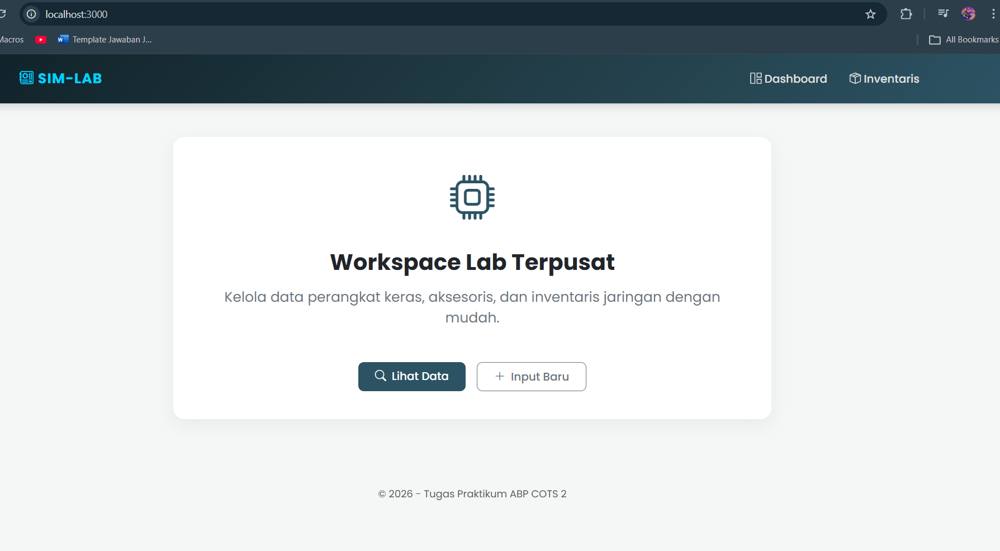
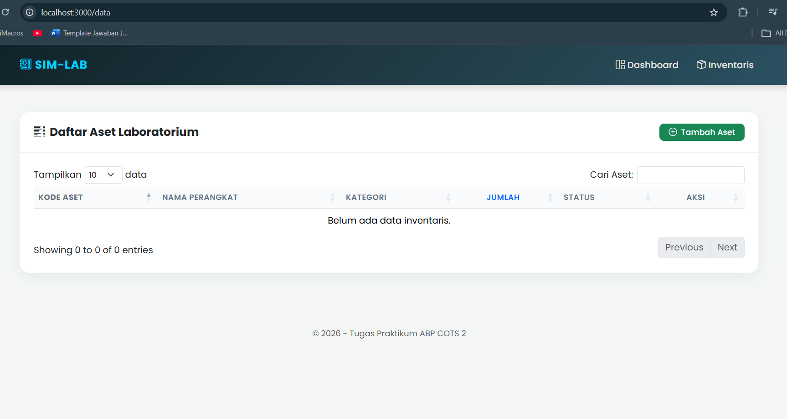
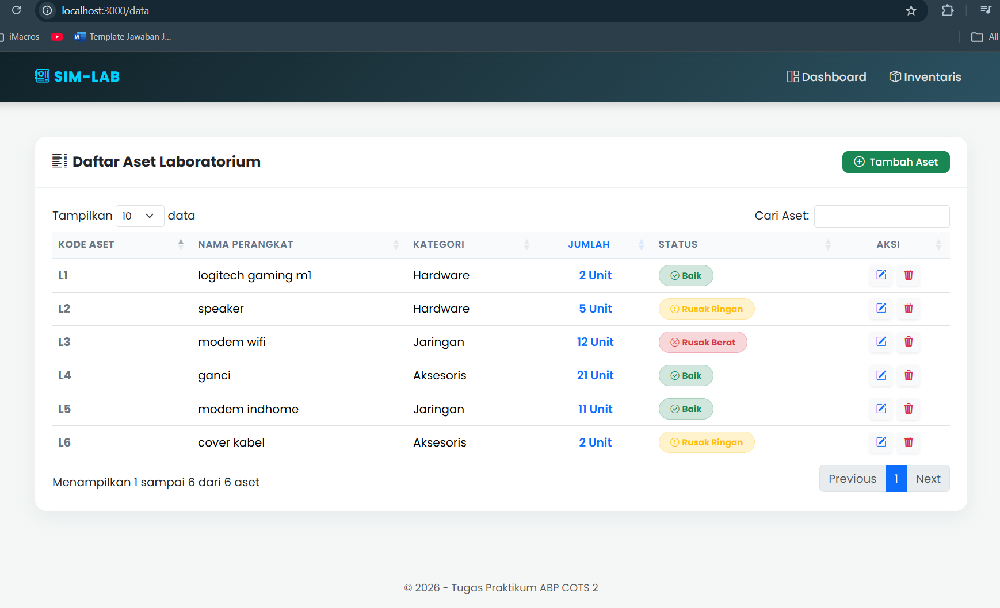
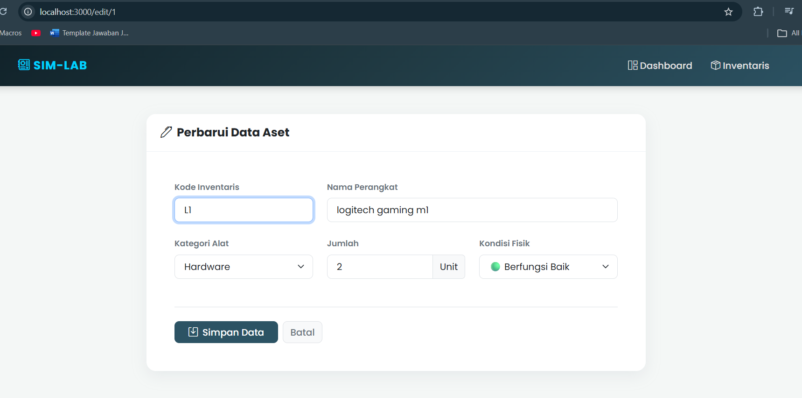
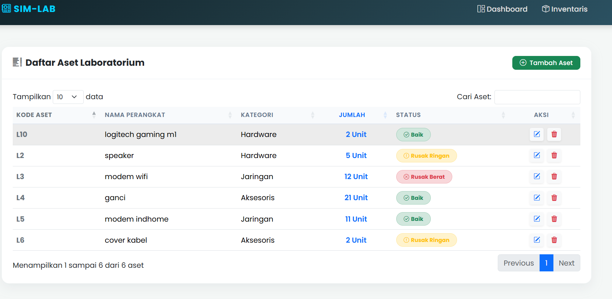
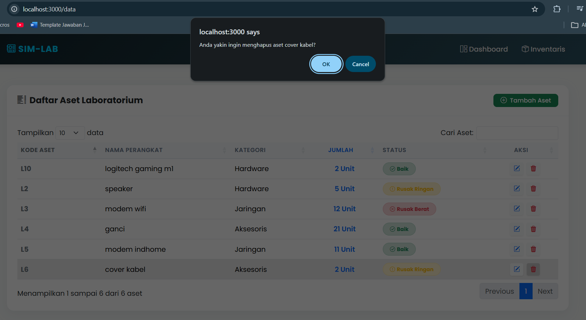
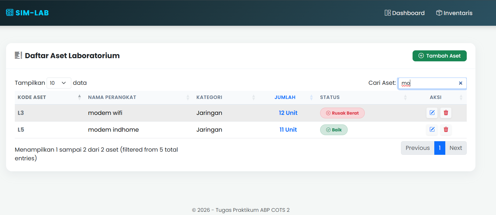
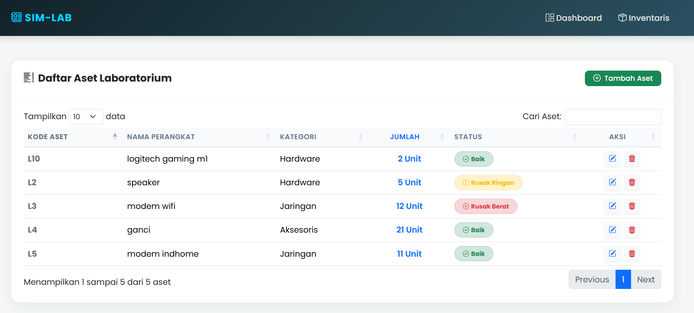

<div align="center">
  <br />

  <h1>LAPORAN PRAKTIKUM <br>
  APLIKASI BERBASIS PLATFORM
  </h1>

  <br />

  <h3>TUGAS COTS 2<br>
  SIMLAB INVENTARIS
  </h3>

  <br />

  <p align="center">

</p>

  <br />
  <br />
  <br />

  <h3>Disusun Oleh :</h3>

  <p>
    <strong>Abda Firas Rahman</strong><br>
    <strong>2311102049</strong><br>
    <strong>S1 IF-11-REG01</strong>
  </p>

  <br />

  <h3>Dosen Pengampu :</h3>

  <p>
    <strong>Dimas Fanny Hebrasianto Permadi, S.ST., M.Kom</strong>
  </p>
  
  <br />
  <br />
    <h4>Asisten Praktikum :</h4>
    <strong>Apri Pandu Wicaksono </strong> <br>
    <strong>Rangga Pradarrell Fathi</strong>
  <br />

  <h3>LABORATORIUM HIGH PERFORMANCE
 <br>FAKULTAS INFORMATIKA <br>UNIVERSITAS TELKOM PURWOKERTO <br>2026</h3>
</div>

<hr>

### Deskripsi
Bootstrap 5
`Bootstrap 5` merupakan framework CSS open-source yang digunakan untuk membantu membuat tampilan website yang modern dan responsif. Framework ini menyediakan berbagai komponen siap pakai seperti form, tabel, tombol, modal, dan sistem grid untuk mengatur layout halaman. Pada tugas ini, `Bootstrap` digunakan untuk mengatur struktur halaman, mempercantik tampilan form input produk, menata tombol aksi, serta memastikan halaman dapat menyesuaikan dengan berbagai ukuran layar. Bootstrap diintegrasikan melalui CDN sehingga tidak perlu mengunduh file secara manual.

jQuery
`jQuery` merupakan library JavaScript yang mempermudah proses manipulasi DOM pengelolaan event, animasi, serta pemanggilan AJAX. Dengan jQuery, penulisan kode JavaScript menjadi lebih singkat dan mudah dipahami dibandingkan menggunakan JavaScript murni. Pada tugas ini, `jQuery` digunakan untuk menangani event submit pada form, event klik tombol Edit dan Hapus menggunakan event delegation, serta membuat efek scroll otomatis ke form ketika mode edit diaktifkan.

jQuery DataTable
`jQuery DataTable` adalah plugin dari jQuery yang berfungsi mengubah tabel HTML biasa menjadi tabel yang lebih interaktif. Plugin ini menyediakan berbagai fitur seperti pencarian data secara real-time, pagination untuk membagi data ke beberapa halaman, sorting untuk mengurutkan data berdasarkan kolom, serta pengaturan jumlah data yang ditampilkan per halaman. DataTable diaktifkan menggunakan `$('#idTabel').DataTable({...})` setelah DOM siap melalui `$(document).ready()`.

Node.js
Node.js adalah runtime environment untuk JavaScript yang dibangun di atas mesin V8 Google Chrome. Berbeda dengan JavaScript tradisional yang berjalan di sisi client (browser), Node.js memungkinkan eksekusi kode JavaScript di sisi server. Keunggulan utamanya adalah arsitektur non-blocking I/O yang membuatnya sangat efisien untuk aplikasi real-time dan intensif data.

Express.js
Express.js merupakan web application framework yang minimalis dan fleksibel untuk Node.js. Express mempermudah pengelolaan routing (pengaturan alamat URL), penanganan request dan response, serta integrasi middleware. Dalam tugas ini, Express berperan sebagai tulang punggung backend yang melayani permintaan data JSON untuk tabel.

EJS (Embedded JavaScript)
EJS adalah sebuah template engine yang digunakan oleh Node.js untuk menghasilkan halaman HTML secara dinamis. EJS memungkinkan pengembang untuk menyisipkan logika JavaScript (seperti perulangan atau pengkondisian) langsung di dalam struktur HTML, sehingga data dari server bisa ditampilkan dengan fleksibel di sisi user.

DataTables & jQuery
DataTables adalah plugin berbasis jQuery yang digunakan untuk meningkatkan fungsionalitas tabel HTML. Fitur-fitur seperti pencarian (searching), pengurutan (sorting), dan penomoran halaman (pagination) dijalankan secara otomatis. Pada sistem ini, DataTables diintegrasikan dengan endpoint API Express untuk mengambil data dalam format JSON secara asynchronous.

### Arsitektur Direktori Proyek

2311102049_ABDAFIRASRAHMAN/
│
├──views/              # Templating engine (Frontend)
│   ├── index.ejs          # Landing page / Dashboard aplikasi
│   ├── data.ejs           # Render tabel dinamis via DataTables
│   ├── form.ejs           # Interface input & sinkronisasi data (Update/Create)
│   ├── header.ejs         # Global head, stylesheet, & script loader
│   └── footer.ejs         # Global footer & watermark identitas
│
├── server.js           # Core System: Express routing & logic CRUD
├── logo.jpeg           # Asset untuk cover logo telyu
├── package.json        # Manifest project & metadata
├── package-lock.json   # Dependency lock file
└── README.md           # Dokumentasi & Laporan Praktikum

### Kode program
### File server.js
```javascript
/**
 * Nama  : Abda Firas Rahman
 * NIM   : 2311102049
 * Kelas : IF-11-REG01
 */
const express = require('express');
const app = express();
const port = 3000;

app.set('view engine', 'ejs');
app.use(express.urlencoded({ extended: true }));
app.use(express.json());

let dataInventaris = [];
app.get('/', (req, res) => res.render('index'));
app.get('/data', (req, res) => res.render('data'));
app.get('/form', (req, res) => res.render('form', { item: null }));

app.get('/edit/:id', (req, res) => {
    const item = dataInventaris.find(i => i.id == req.params.id);
    if(item) {
        res.render('form', { item });
    } else {
        res.redirect('/data');
    }
});

app.get('/api/inventaris', (req, res) => {
    res.json(dataInventaris);
});

// Proses Simpan Data
app.post('/simpan', (req, res) => {
    const { id, kode, nama, kategori, kondisi, jumlah } = req.body;
    
    if (id) {
        // Mode Edit
        const index = dataInventaris.findIndex(i => i.id == id);
        if (index !== -1) {
            dataInventaris[index] = { id: parseInt(id), kode, nama, kategori, kondisi, jumlah: parseInt(jumlah) };
        }
    } else {
        //Generate ID otomatis
        const newId = dataInventaris.length > 0 ? Math.max(...dataInventaris.map(i => i.id)) + 1 : 1;
        dataInventaris.push({ id: newId, kode, nama, kategori, kondisi, jumlah: parseInt(jumlah) });
    }
    res.redirect('/data');
});

// Proses Hapus Data
app.get('/hapus/:id', (req, res) => {
    dataInventaris = dataInventaris.filter(i => i.id != req.params.id);
    res.redirect('/data');
});

app.listen(port, () => {
    console.log(`[SERVER] Running at http://localhost:${port}`);
});
```
File server.js bertindak sebagai pusat kendali utama atau entry point aplikasi yang dibangun menggunakan framework Express.js. Di dalam file ini, sistem mengelola seluruh alur navigasi (routing) dan logika bisnis, termasuk simulasi penyimpanan data menggunakan array in-memory serta penyediaan endpoint API khusus pada URL /api/inventaris. Endpoint tersebut secara spesifik mengirimkan data dalam format JSON untuk dikonsumsi oleh DataTables sesuai dengan spesifikasi teknis praktikum. Selain itu server.js juga menangani mekanisme CRUD secara sistematis, mulai dari proses penambahan data dengan ID otomatis pencarian indeks untuk pembaruan data hingga penyaringan data menggunakan fungsi filter untuk proses penghapusan.

### Folder views
### File data.ejs
```html
<%# 
  Nama  : Abda Firas Rahman
  NIM   : 2311102049
  Kelas : IF-11-REG01
%>

<%- include('header') -%>
<div class="card card-custom">
    <div class="card-header-custom d-flex justify-content-between align-items-center">
        <h5 class="mb-0 fw-bold text-dark"><i class="bi bi-list-columns me-2"></i>Daftar Aset Laboratorium</h5>
        <a href="/form" class="btn btn-success btn-custom btn-sm px-3">
            <i class="bi bi-plus-circle me-1"></i> Tambah Aset
        </a>
    </div>
    <div class="card-body p-4">
        <div class="table-responsive">
            <table id="tabelInventaris" class="table table-hover table-custom" style="width:100%">
                <thead>
                    <tr>
                        <th>Kode Aset</th>
                        <th>Nama Perangkat</th>
                        <th>Kategori</th>
                        <th class="text-center">Jumlah</th>
                        <th>Status</th>
                        <th class="text-center" style="width: 120px;">Aksi</th>
                    </tr>
                </thead>
                <tbody></tbody>
            </table>
        </div>
    </div>
</div>

<script>
    $(document).ready(function() {
        $('#tabelInventaris').DataTable({
            "ajax": {
                "url": "/api/inventaris",
                "dataSrc": ""
            },
            "language": {
                "search": "Cari Aset:",
                "lengthMenu": "Tampilkan _MENU_ data",
                "info": "Menampilkan _START_ sampai _END_ dari _TOTAL_ aset",
                "emptyTable": "Belum ada data inventaris."
            },
            "columns": [
                { "data": "kode", "className": "fw-bold text-secondary" },
                { "data": "nama" },
                { "data": "kategori" },
                { 
                    "data": "jumlah",
                    "className": "text-center fw-semibold text-primary",
                    "render": function(data) {
                        return data + ' Unit'; // Tambahan tulisan "Unit" otomatis
                    }
                },
                { 
                    "data": "kondisi",
                    "render": function(data) {
                        let color = data === 'Baik' ? 'success' : (data === 'Rusak Ringan' ? 'warning' : 'danger');
                        let icon = data === 'Baik' ? 'check-circle' : (data === 'Rusak Ringan' ? 'exclamation-circle' : 'x-circle');
                        return `<span class="badge bg-${color}-subtle text-${color} px-3 py-2 rounded-pill border border-${color}-subtle">
                                    <i class="bi bi-${icon} me-1"></i>${data}
                                </span>`;
                    }
                },
                { 
                  "data": null,
                  "className": "text-center",
                  "render": function(data, type, row) {
                      return `
                        <a href="/edit/${row.id}" class="btn btn-light btn-sm text-primary border-0 me-1 shadow-sm" title="Edit Data">
                            <i class="bi bi-pencil-square"></i>
                        </a>
                        <a href="/hapus/${row.id}" class="btn btn-light btn-sm text-danger border-0 shadow-sm" title="Hapus Data" onclick="return confirm('Anda yakin ingin menghapus aset ${row.nama}?')">
                            <i class="bi bi-trash3-fill"></i>
                        </a>
                      `;
                  }
                }
            ]
        });
    });
</script>
<%- include('footer') -%>
```
halaman paling krusial dalam sistem SIM-LAB. Di sini terdapat implementasi Asynchronous JavaScript menggunakan plugin DataTables. Alih-alih merender data secara langsung dari HTML, file ini mengeksekusi AJAX Request ke endpoint /api/inventaris.

    JSON Data Binding: DataTables secara otomatis memetakan format JSON dari server ke dalam baris tabel.
    Client-side Processing: Fitur pencarian, pagination, dan sorting berjalan secara otomatis pada sisi client sehingga memberikan performa yang sangat cepat bagi pengguna saat mengelola inventaris.

### File footer.ejs
```html
<%# 
  Nama  : Abda Firas Rahman
  NIM   : 2311102049
  Kelas : IF-11-REG01
%>
</div>
    <footer class="text-center mt-5 mb-3 text-muted" style="font-size: 0.9rem;">
        &copy; 2026 - Tugas Praktikum ABP COTS 2
    </footer>
    <script src="https://cdn.jsdelivr.net/npm/bootstrap@5.3.2/dist/js/bootstrap.bundle.min.js"></script>
    <script src="https://cdn.datatables.net/1.13.6/js/jquery.dataTables.min.js"></script>
    <script src="https://cdn.datatables.net/1.13.6/js/dataTables.bootstrap5.min.js"></script>
</body>
</html>
```
Berperan sebagai penutup struktur HTML dan pengelola skrip JavaScript. Penempatan skrip di bagian bawah (bottom-loading) bertujuan untuk mempercepat proses rendering halaman awal. File ini mencakup:

    Library Dependency: Memuat jQuery versi 3.7.0 dan plugin DataTables yang merupakan syarat wajib tugas.
    Watermark Identity: Menampilkan informasi Nama, NIM, dan Kelas sebagai penanda hak cipta karya mahasiswa agar tidak mudah disalahgunakan.
### File form.ejs
```html
<%# 
  Nama  : Abda Firas Rahman
  NIM   : 2311102049
  Kelas : IF-11-REG01
%>

<%- include('header') -%>
<div class="row justify-content-center">
    <div class="col-lg-8">
        <div class="card card-custom">
            <div class="card-header-custom">
                <h5 class="mb-0 fw-bold text-dark">
                    <i class="bi bi-pen me-2"></i><%= item ? 'Perbarui Data Aset' : 'Registrasi Aset Baru' %>
                </h5>
            </div>
            <div class="card-body p-4 p-md-5">
                <form action="/simpan" method="POST">
                    <input type="hidden" name="id" value="<%= item ? item.id : '' %>">
                    
                    <div class="row mb-4">
                        <div class="col-md-4">
                            <label class="form-label fw-semibold text-secondary small">Kode Inventaris</label>
                            <input type="text" class="form-control form-control-lg fs-6" name="kode" value="<%= item ? item.kode : '' %>" placeholder="LAB-..." required>
                        </div>
                        <div class="col-md-8 mt-3 mt-md-0">
                            <label class="form-label fw-semibold text-secondary small">Nama Perangkat</label>
                            <input type="text" class="form-control form-control-lg fs-6" name="nama" value="<%= item ? item.nama : '' %>" placeholder="Contoh: Cisco Switch 2960" required>
                        </div>
                    </div>

                    <div class="row mb-5">
                        <div class="col-md-4">
                            <label class="form-label fw-semibold text-secondary small">Kategori Alat</label>
                            <select class="form-select form-select-lg fs-6" name="kategori" required>
                                <option value="" disabled <%= !item ? 'selected' : '' %>>-- Pilih --</option>
                                <option value="Hardware" <%= item && item.kategori == 'Hardware' ? 'selected' : '' %>>Hardware</option>
                                <option value="Aksesoris" <%= item && item.kategori == 'Aksesoris' ? 'selected' : '' %>>Aksesoris</option>
                                <option value="Jaringan" <%= item && item.kategori == 'Jaringan' ? 'selected' : '' %>>Perangkat Jaringan</option>
                            </select>
                        </div>
                        <div class="col-md-4 mt-3 mt-md-0">
                            <label class="form-label fw-semibold text-secondary small">Jumlah</label>
                            <div class="input-group">
                                <input type="number" class="form-control form-control-lg fs-6" name="jumlah" value="<%= item ? item.jumlah : '1' %>" min="1" required>
                                <span class="input-group-text bg-light">Unit</span>
                            </div>
                        </div>
                        <div class="col-md-4 mt-3 mt-md-0">
                            <label class="form-label fw-semibold text-secondary small">Kondisi Fisik</label>
                            <select class="form-select form-select-lg fs-6" name="kondisi" required>
                                <option value="Baik" <%= item && item.kondisi == 'Baik' ? 'selected' : '' %>>🟢 Berfungsi Baik</option>
                                <option value="Rusak Ringan" <%= item && item.kondisi == 'Rusak Ringan' ? 'selected' : '' %>>🟡 Rusak Ringan</option>
                                <option value="Rusak Berat" <%= item && item.kondisi == 'Rusak Berat' ? 'selected' : '' %>>🔴 Rusak Berat</option>
                            </select>
                        </div>
                    </div>
                    
                    <div class="d-flex gap-2 border-top pt-4">
                        <button type="submit" class="btn btn-primary btn-custom px-4" style="background-color: #2c5364; border: none;">
                            <i class="bi bi-save me-2"></i>Simpan Data
                        </button>
                        <a href="/data" class="btn btn-light btn-custom text-secondary border">Batal</a>
                    </div>
                </form>
            </div>
        </div>
    </div>
</div>
<%- include('footer') -%>
```
File ini menggunakan logika Conditional Rendering untuk menangani dua fungsi sekaligus dalam satu tampilan.

    Logic Check: Sistem akan memeriksa variabel item. Jika item bernilai null, maka form akan diatur sebagai mode Input Baru. Jika item berisi data, sistem akan melakukan auto-fill pada semua input field dan beralih ke mode Update/Edit.

    Input Validation: Menggunakan tipe input HTML5 yang sudah divalidasi (seperti required dan number) untuk memastikan integritas data sebelum dikirimkan ke backend (server.js).

### File header.ejs
```html
<%# 
  Nama  : Abda Firas Rahman
  NIM   : 2311102049
  Kelas : IF-11-REG01
%>

<!DOCTYPE html>
<html lang="id">
<head>
    <meta charset="UTF-8">
    <meta name="viewport" content="width=device-width, initial-scale=1.0">
    <title>SIM-LAB | Sistem Inventaris</title>
    
    <link href="https://fonts.googleapis.com/css2?family=Poppins:wght@300;400;500;600;700&display=swap" rel="stylesheet">
    <link href="https://cdn.jsdelivr.net/npm/bootstrap@5.3.2/dist/css/bootstrap.min.css" rel="stylesheet">
    <link rel="stylesheet" href="https://cdn.jsdelivr.net/npm/bootstrap-icons@1.11.1/font/bootstrap-icons.css">
    <link href="https://cdn.datatables.net/1.13.6/css/dataTables.bootstrap5.min.css" rel="stylesheet">
    
    <script src="https://code.jquery.com/jquery-3.7.0.min.js"></script>

    <style>
        body {
            /* Ganti font ke Poppins */
            font-family: 'Poppins', sans-serif;
            background-color: #f4f7f6;
            color: #2c3e50;
        }
        .navbar-custom {
            background: linear-gradient(135deg, #0f2027, #203a43, #2c5364);
            padding: 15px 0;
            box-shadow: 0 4px 12px rgba(0,0,0,0.15);
        }
        .navbar-custom .navbar-brand {
            font-weight: 700;
            letter-spacing: 1px;
            color: #00d2ff !important;
        }
        .nav-link {
            font-weight: 500;
            color: #e0e0e0 !important;
            transition: color 0.3s;
        }
        .nav-link:hover { color: #00d2ff !important; }
        
        .card-custom {
            border: none;
            border-radius: 16px;
            box-shadow: 0 8px 24px rgba(149, 157, 165, 0.15);
        }
        .card-header-custom {
            background-color: #ffffff;
            border-bottom: 1px solid #edf2f7;
            border-top-left-radius: 16px !important;
            border-top-right-radius: 16px !important;
            padding: 20px 24px;
        }
        
        .table-custom th {
            background-color: #f8fafc;
            color: #64748b;
            font-weight: 600;
            font-size: 0.85rem;
            text-transform: uppercase;
            letter-spacing: 0.5px;
            border-bottom: 2px solid #e2e8f0 !important;
        }
        .table-custom td { vertical-align: middle; }
        
        .btn-custom {
            border-radius: 8px;
            font-weight: 500; /* Disesuaikan dengan ketebalan Poppins */
        }
    </style>
</head>
<body>
    <nav class="navbar navbar-expand-lg navbar-dark navbar-custom mb-5">
        <div class="container">
            <a class="navbar-brand" href="/"><i class="bi bi-motherboard"></i> SIM-LAB</a>
            <button class="navbar-toggler" type="button" data-bs-toggle="collapse" data-bs-target="#navbarNav">
                <span class="navbar-toggler-icon"></span>
            </button>
            <div class="collapse navbar-collapse" id="navbarNav">
                <ul class="navbar-nav ms-auto gap-3">
                    <li class="nav-item"><a class="nav-link" href="/"><i class="bi bi-grid-1x2"></i> Dashboard</a></li>
                    <li class="nav-item"><a class="nav-link" href="/data"><i class="bi bi-box-seam"></i> Inventaris</a></li>
                </ul>
            </div>
        </div>
    </nav>
    <div class="container pb-5">
```
File ini berfungsi sebagai kerangka atas aplikasi yang memuat seluruh metadata penting dan pemanggilan library eksternal melalui CDN (Content Delivery Network). Di dalamnya diimplementasikan:

    Google Fonts Integration Menggunakan font Poppins untuk meningkatkan aspek tipografi dan user experience (UX). Bootstrap 5 Stylesheet Sebagai basis desain responsif agar tampilan tetap konsisten di berbagai ukuran layar. Custom CSS Styling: Berisi modifikasi pada navbar dengan efek gradient dan soft shadow pada elemen card untuk memberikan kesan dashboard yang premium dan modern.

### File index.ejs
```html
<%# 
  Nama  : Abda Firas Rahman
  NIM   : 2311102049
  Kelas : IF-11-REG01
%>

<%- include('header') -%>
<div class="row justify-content-center">
    <div class="col-lg-8">
        <div class="card card-custom p-2 p-md-4 text-center">
            <div class="card-body">
                <div class="mb-4">
                    <i class="bi bi-cpu" style="font-size: 4rem; color: #2c5364;"></i>
                </div>
                <h2 class="fw-bold text-dark mb-3">Workspace Lab Terpusat</h2>
                <p class="text-secondary mb-5 fs-5">
                    Kelola data perangkat keras, aksesoris, dan inventaris jaringan dengan mudah.
                <div class="d-flex justify-content-center gap-3">
                    <a href="/data" class="btn btn-primary btn-custom px-4 py-2" style="background-color: #2c5364; border: none;">
                        <i class="bi bi-search me-2"></i>Lihat Data
                    </a>
                    <a href="/form" class="btn btn-outline-secondary btn-custom px-4 py-2">
                        <i class="bi bi-plus-lg me-2"></i>Input Baru
                    </a>
                </div>
            </div>
        </div>
    </div>
</div>
<%- include('footer') -%>
```
Halaman ini bertindak sebagai wajah utama atau dashboard aplikasi. Isinya dirancang untuk memberikan navigasi cepat bagi pengguna melalui elemen Call to Action (CTA). Secara teknis, halaman ini menggunakan struktur Bootstrap Grid System untuk memastikan teks sambutan dan ikon tetap berada di posisi tengah (centered layout) memberikan kesan aplikasi yang profesional dan tertata.

### Hasil Program
### Tampilan awal dan dashboard


### Tampilan ketika klik lihat data


### Tampilan input data dan tambah aset



### Tampilan edit data



### Tampilan hapus data


### Tampilan mencari aset


### Tampilan inventaris


### Kesimpulan
Berdasarkan hasil perancangan dan implementasi aplikasi SIM-LAB dapat disimpulkan bahwa penggunaan framework Node.js dan Express.js memberikan fondasi backend yang sangat efisien dalam menangani alur routing serta pengelolaan data inventaris secara real-time. Penerapan konsep modular templating melalui engine EJS, yang dipadukan dengan styling Bootstrap 5, berhasil menciptakan antarmuka pengguna yang responsif, bersih, dan fungsional sesuai dengan standar aplikasi web modern.

### Link Video Presentasinya
https://drive.google.com/file/d/10QE9QgzN8khl-7e8waHUH8P7xnSMgSe5/view?usp=sharing