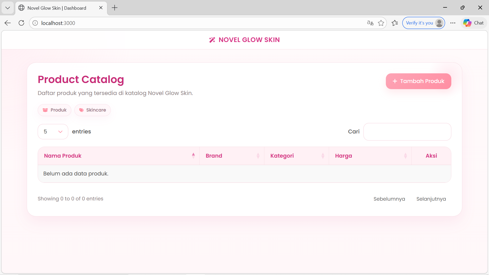
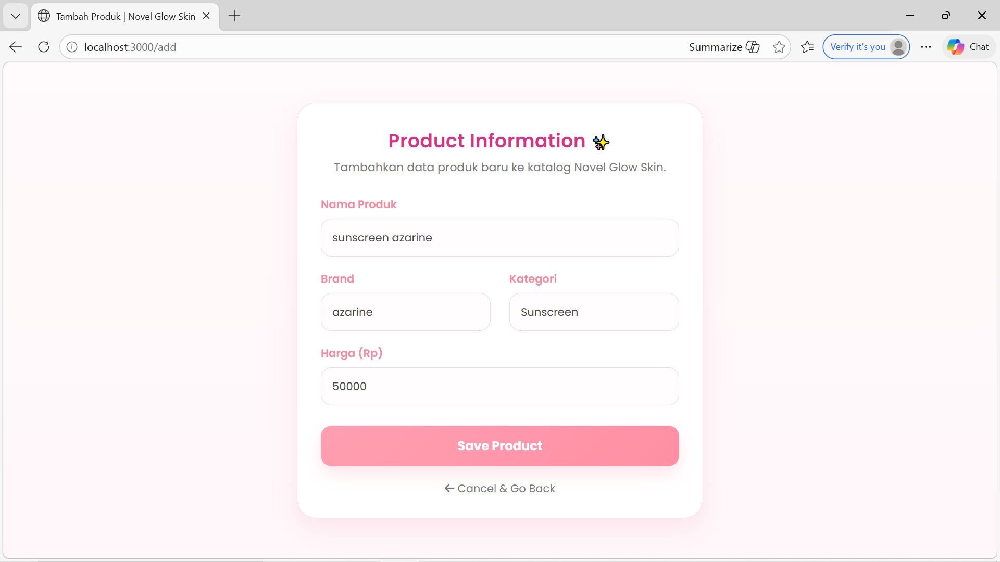
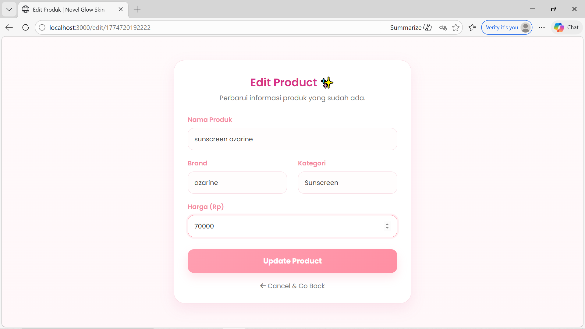
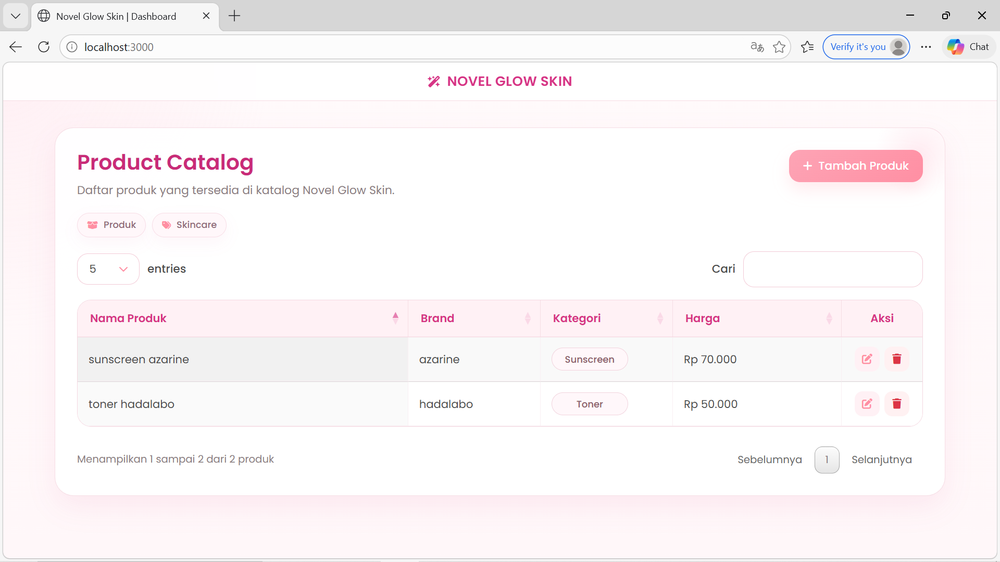
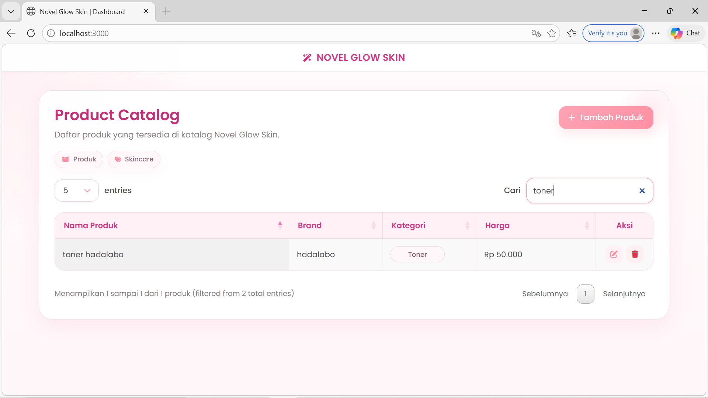
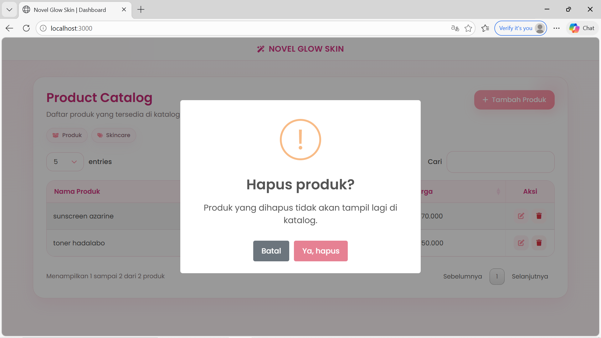
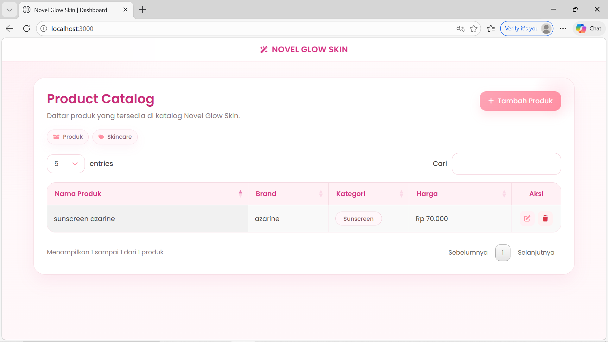

<div align="center">
  <br />
  <h1>LAPORAN PRAKTIKUM <br>APLIKASI BERBASIS PLATFORM</h1>
  <br />
  <h3>TUGAS COTS 2</h3>
  <br />
   
  <br />
  <br />
  <br />
  <h3>Disusun Oleh :</h3>
  <p>
    <strong>Nia Novela Ariandini</strong><br>
    <strong>2311102057</strong><br>
    <strong>S1 IF-11-01</strong>
  </p>
  <br />
  <h3>Dosen Pengampu :</h3>
  <p>
    <strong>Dimas Fanny Hebrasianto Permadi, S.ST., M.Kom</strong>
  </p>
  <br />
  <br />
    <h4>Asisten Praktikum :</h4>
    <strong> Apri Pandu Wicaksono </strong> <br>
    <strong>Rangga Pradarrell Fathi</strong>
  <br />
  <br />
  <br />
  <br />
  <h3>LABORATORIUM HIGH PERFORMANCE
 <br>FAKULTAS INFORMATIKA <br>UNIVERSITAS TELKOM PURWOKERTO <br>2026</h3>
</div>

---

## 1. Dasar Teori

**CRUD (Create, Read, Update, Delete)** merupakan konsep dasar dalam pengelolaan data pada sebuah aplikasi. Pada aplikasi ini, CRUD digunakan untuk mengelola data produk skincare, yaitu menambahkan produk baru (create), menampilkan data produk (read), memperbarui data produk (update), serta menghapus data produk (delete). Proses ini dilakukan melalui interaksi antara pengguna dengan server sehingga data dapat dikelola secara dinamis.

**Bootstrap** merupakan framework CSS open-source yang digunakan untuk membangun tampilan antarmuka aplikasi. Dalam aplikasi ini, Bootstrap digunakan untuk membuat layout yang responsif serta komponen seperti form, tombol, dan struktur halaman sehingga tampilan menjadi lebih rapi, konsisten, dan menarik.

**jQuery** adalah library JavaScript yang digunakan untuk mempermudah manipulasi elemen HTML dan pengelolaan event. Pada aplikasi ini, jQuery digunakan untuk menginisialisasi DataTables serta menangani interaksi pengguna pada halaman, seperti pengolahan tabel dan event klik.

**jQuery DataTables** merupakan plugin berbasis jQuery yang digunakan untuk meningkatkan fungsionalitas tabel HTML. Dalam aplikasi ini, DataTables digunakan untuk menampilkan data produk dalam bentuk tabel interaktif yang memiliki fitur pencarian (*search*), pengurutan (*sorting*), serta pagination. Data pada tabel diambil dari server dalam format JSON melalui endpoint `/api/skincare`.

**JSON (JavaScript Object Notation)** adalah format pertukaran data yang ringan dan mudah dibaca. Pada aplikasi ini, JSON digunakan sebagai media penyimpanan data produk dalam file `products.json`. Data akan dibaca dan ditulis secara langsung ke file tersebut setiap kali terjadi operasi CRUD.

**Node.js** merupakan runtime JavaScript yang memungkinkan JavaScript dijalankan di sisi server. Dalam aplikasi ini, Node.js digunakan untuk menjalankan server, menangani request dari client, serta mengelola proses baca dan tulis file menggunakan modul bawaan.

**Express JS** adalah framework backend berbasis Node.js yang digunakan untuk membangun aplikasi web dengan lebih terstruktur. Dalam aplikasi ini, Express digunakan untuk mengatur routing, menangani proses CRUD, merender halaman menggunakan EJS, serta menyediakan endpoint API `/api/skincare` yang mengirimkan data dalam format JSON untuk digunakan oleh DataTables.

**EJS (Embedded JavaScript Templates)** merupakan template engine yang digunakan untuk membuat halaman web dinamis. Pada aplikasi ini, EJS digunakan untuk membangun tampilan halaman seperti dashboard, form tambah produk, dan form edit produk, serta menampilkan data dari server ke dalam halaman.

**File System (fs)** adalah modul bawaan Node.js yang digunakan untuk membaca dan menulis file. Dalam aplikasi ini, modul `fs` digunakan untuk mengakses file `products.json` sebagai media penyimpanan data, sehingga setiap perubahan data dapat langsung disimpan secara permanen.

**AJAX (Asynchronous JavaScript and XML)** merupakan teknik yang digunakan untuk mengambil data dari server tanpa perlu memuat ulang halaman. Pada aplikasi ini, DataTables menggunakan AJAX untuk mengambil data produk dari endpoint `/api/skincare` dalam format JSON sehingga data dapat ditampilkan secara dinamis pada tabel.

---

## 2. Deskripsi Aplikasi

Aplikasi yang dibuat pada tugas ini adalah sebuah **aplikasi web katalog produk skincare** bernama *Novel Glow Skin* yang dikembangkan menggunakan **Node.js dengan framework Express**, serta memanfaatkan **Bootstrap, jQuery, dan DataTables** untuk tampilan dan interaksi pengguna.

Aplikasi ini dirancang untuk memenuhi ketentuan praktikum, yaitu memiliki minimal tiga halaman utama serta mendukung pengelolaan data menggunakan konsep CRUD (Create, Read, Update, Delete).

Aplikasi memiliki beberapa halaman utama, yaitu:

- **Halaman Dashboard (Tabel Data Produk)**  
  Menampilkan seluruh data produk dalam bentuk tabel interaktif menggunakan jQuery DataTables. Pengguna dapat melakukan pencarian, pengurutan data, serta navigasi halaman dengan mudah.

- **Halaman Tambah Produk**  
  Berisi form input untuk menambahkan data produk baru ke dalam sistem.

- **Halaman Edit Produk**  
  Digunakan untuk memperbarui data produk yang sudah ada berdasarkan ID tertentu.

Selain itu, aplikasi juga menyediakan fitur:

- **Create** → Menambahkan produk baru melalui form input  
- **Read** → Menampilkan data produk dalam tabel interaktif  
- **Update** → Mengubah data produk melalui halaman edit  
- **Delete** → Menghapus data produk dari sistem  

Data produk disimpan dalam file JSON lokal yaitu `products.json` yang berada di dalam folder `data`. Setiap perubahan data akan langsung disimpan ke file tersebut menggunakan modul `fs` pada Node.js, sehingga aplikasi tidak memerlukan database eksternal.

Untuk menampilkan data pada tabel, aplikasi menggunakan endpoint API `/api/skincare` yang mengirimkan data dalam format JSON. Data tersebut kemudian diolah oleh DataTables sehingga tabel menjadi interaktif dan mudah digunakan.

---

## 3. Struktur Folder Project

```bash
TUGAS COTS-2/
├── assets/
│   ├── 1.png
│   ├── 2.png
│   ├── 3.png
│   ├── 4.png
│   ├── 5.png
│   ├── 6.png
│   ├── 7.png
│   ├── 8.png
│   └── logo.png
├── data/
│   └── products.json
├── node_modules/
├── views/
│   ├── add.ejs
│   ├── edit.ejs
│   └── index.ejs
├── app.js
├── package.json
├── package-lock.json
└── README.md
```

### Penjelasan Struktur Folder

| File / Folder | Keterangan |
|---|---|
| `app.js` | File utama aplikasi yang berisi konfigurasi server Express, routing, serta proses CRUD. |
| `package.json` | File konfigurasi project yang berisi informasi project dan dependency yang digunakan. |
| `node_modules/` | Folder yang berisi library hasil instalasi dari npm. |
| `data/products.json` | File penyimpanan data produk dalam format JSON yang berfungsi sebagai database sederhana. |
| `views/` | Folder yang berisi file tampilan (view) menggunakan EJS. |
| `views/index.ejs` | Halaman utama yang menampilkan tabel data produk menggunakan DataTables. |
| `views/add.ejs` | Halaman form untuk menambahkan produk baru (Create). |
| `views/edit.ejs` | Halaman form untuk mengedit data produk (Update). |
| `assets/` | Folder yang berisi gambar atau screenshot aplikasi yang digunakan untuk dokumentasi laporan. |
| `README.md` | File dokumentasi laporan yang berisi penjelasan lengkap aplikasi. |

---

### Penjelasan Alur Struktur

Struktur project ini dibuat sederhana namun tetap terorganisir dengan baik. File utama `app.js` berfungsi sebagai pusat pengendali aplikasi, mulai dari pengaturan server hingga pengelolaan data.

Folder `views` digunakan untuk menyimpan tampilan halaman yang akan dirender oleh server menggunakan EJS. Sedangkan folder `data` digunakan untuk menyimpan data produk dalam bentuk file JSON sebagai pengganti database.

Folder `assets` digunakan khusus untuk menyimpan gambar hasil tampilan aplikasi yang akan digunakan pada bagian dokumentasi atau laporan.

---

## 4. Cara Menjalankan Aplikasi

Berikut langkah-langkah untuk menjalankan aplikasi *Novel Glow Skin*:

### 1. Buka Folder Project
Buka folder project menggunakan Visual Studio Code atau code editor lainnya.
Pastikan Node.js sudah terinstall di perangkat.

### 2. Install Dependency
Jalankan perintah berikut pada terminal untuk menginstall semua library yang dibutuhkan:

```bash
npm install
```

### 3. Jalankan Server
Jalankan aplikasi menggunakan perintah:

```bash
npm start
```
Atau jika belum menggunakan script start:

```bash
node app.js
```

### 4. Akses Aplikasi di Browser
Buka browser, kemudian akses alamat berikut:

```bash
http://localhost:3000
```

### 5. Menggunakan Aplikasi

Setelah aplikasi berjalan, pengguna dapat:

- Melihat daftar produk pada halaman utama  
- Menambahkan produk baru melalui tombol **Tambah Produk**  
- Mengedit data produk melalui tombol **Edit**  
- Menghapus data produk melalui tombol **Delete**  

Semua perubahan data akan langsung tersimpan pada file `products.json`.

---

## 5. Kode Program

### A. `package.json`

```json
{
  "name": "tugas-cots---2",
  "version": "1.0.0",
  "description": "Aplikasi web CRUD produk skincare Novel Glow Skin menggunakan Express, EJS, Bootstrap, jQuery, dan DataTables",
  "main": "app.js",
  "scripts": {
    "start": "node app.js"
  },
  "keywords": [],
  "author": "",
  "license": "ISC",
  "type": "commonjs",
  "dependencies": {
    "body-parser": "^2.2.2",
    "ejs": "^5.0.1",
    "express": "^5.2.1"
  }
}
```

### Penjelasan `package.json`

File `package.json` merupakan file konfigurasi utama pada project Node.js. File ini berisi informasi dasar project, file utama yang dijalankan, script yang dapat digunakan, serta daftar dependency yang dibutuhkan oleh aplikasi.

Pada aplikasi ini, bagian `"name"` menunjukkan nama project, sedangkan `"version"` menunjukkan versi aplikasi. Bagian `"description"` berisi deskripsi singkat mengenai aplikasi yang dibuat, yaitu aplikasi web CRUD produk skincare menggunakan Express, EJS, Bootstrap, jQuery, dan DataTables.

Baris `"main": "app.js"` menunjukkan bahwa file utama aplikasi adalah `app.js`. Selanjutnya, pada bagian `"scripts"`, digunakan script `"start": "node app.js"` agar aplikasi dapat dijalankan dengan perintah `npm start`.

Bagian `"type": "commonjs"` menunjukkan bahwa project ini menggunakan sistem module CommonJS. Sedangkan pada bagian `"dependencies"`, terdapat beberapa library utama yang digunakan dalam aplikasi, yaitu:

- `express` digunakan sebagai framework backend untuk membangun server dan routing.  
- `ejs` digunakan sebagai template engine untuk menampilkan halaman dinamis.  
- `body-parser` digunakan untuk membaca data yang dikirim dari form maupun request dalam format JSON.  

Dengan adanya file `package.json`, pengelolaan dependency dan proses menjalankan aplikasi menjadi lebih terstruktur dan mudah.

---

### B. `app.js`

```javascript
const express = require('express');
const bodyParser = require('body-parser');
const fs = require('fs');
const path = require('path');

const app = express();
const PORT = 3000;

app.set('view engine', 'ejs');
app.use(express.static('public'));
app.use(bodyParser.urlencoded({ extended: true }));
app.use(bodyParser.json());

const dataPath = path.join(__dirname, 'data', 'products.json');

// Fungsi baca data dari file JSON
function readProducts() {
    try {
        const data = fs.readFileSync(dataPath, 'utf8');
        return JSON.parse(data);
    } catch (error) {
        console.error('Gagal membaca products.json:', error);
        return [];
    }
}

// Fungsi simpan data ke file JSON
function writeProducts(data) {
    try {
        fs.writeFileSync(dataPath, JSON.stringify(data, null, 2), 'utf8');
    } catch (error) {
        console.error('Gagal menulis products.json:', error);
    }
}

// ROUTES
app.get('/', (req, res) => {
    res.render('index');
});

app.get('/add', (req, res) => {
    res.render('add');
});

// API JSON untuk DataTables
app.get('/api/skincare', (req, res) => {
    const skincareData = readProducts();
    res.json({ data: skincareData });
});

// CREATE
app.post('/api/skincare', (req, res) => {
    const { nama, brand, kategori, harga } = req.body;

    if (!nama || !brand || !kategori || !harga) {
        return res.status(400).send('Data produk belum lengkap.');
    }

    const skincareData = readProducts();

    const newProduct = {
        id: Date.now().toString(),
        nama: nama.trim(),
        brand: brand.trim(),
        kategori: kategori.trim(),
        harga: Number(harga)
    };

    skincareData.push(newProduct);
    writeProducts(skincareData);

    res.redirect('/');
});

// GET DATA BY ID (Untuk Edit)
app.get('/edit/:id', (req, res) => {
    const skincareData = readProducts();
    const product = skincareData.find(p => p.id === req.params.id);

    if (!product) {
        return res.redirect('/');
    }

    res.render('edit', { product });
});

// UPDATE
app.post('/update/:id', (req, res) => {
    const { nama, brand, kategori, harga } = req.body;
    const skincareData = readProducts();

    const index = skincareData.findIndex(p => p.id === req.params.id);

    if (index === -1) {
        return res.redirect('/');
    }

    if (!nama || !brand || !kategori || !harga) {
        return res.status(400).send('Data produk belum lengkap.');
    }

    skincareData[index] = {
        id: req.params.id,
        nama: nama.trim(),
        brand: brand.trim(),
        kategori: kategori.trim(),
        harga: Number(harga)
    };

    writeProducts(skincareData);

    res.redirect('/');
});

// DELETE
app.get('/delete/:id', (req, res) => {
    let skincareData = readProducts();
    skincareData = skincareData.filter(p => p.id !== req.params.id);
    writeProducts(skincareData);

    res.redirect('/');
});

app.listen(PORT, () => {
    console.log(`Novel Glow Skin aktif di http://localhost:${PORT}`);
});
```

### Penjelasan `app.js`

File `app.js` merupakan inti dari aplikasi karena berfungsi sebagai backend yang mengatur seluruh proses pada sistem.

Pada bagian awal, dilakukan import beberapa module yaitu `express`, `body-parser`, `fs`, dan `path`. Module `express` digunakan untuk membuat server, `body-parser` digunakan untuk membaca data dari request, `fs` digunakan untuk membaca dan menulis file JSON, serta `path` digunakan untuk mengatur lokasi file.

Selanjutnya dilakukan konfigurasi Express, yaitu mengatur template engine menggunakan EJS, mengaktifkan middleware untuk membaca data dari form dan JSON, serta mengatur folder static.

Variabel `dataPath` digunakan untuk menentukan lokasi file `products.json` yang berfungsi sebagai penyimpanan data.

Terdapat dua fungsi utama, yaitu:

- `readProducts()` → digunakan untuk membaca data dari file JSON  
- `writeProducts()` → digunakan untuk menyimpan data ke file JSON  

Pada bagian routing, aplikasi memiliki beberapa route utama:

- `GET /` → menampilkan halaman utama (dashboard)  
- `GET /add` → menampilkan halaman tambah produk  
- `GET /api/skincare` → mengirim data produk dalam format JSON untuk DataTables  

Selanjutnya terdapat implementasi CRUD:

- **Create** (`POST /api/skincare`)  
  Digunakan untuk menambahkan data produk baru ke dalam file JSON.  

- **Read** (`GET /api/skincare`)  
  Digunakan untuk mengambil seluruh data produk dalam format JSON.  

- **Update** (`POST /update/:id`)  
  Digunakan untuk memperbarui data produk berdasarkan ID.  

- **Delete** (`GET /delete/:id`)  
  Digunakan untuk menghapus data produk berdasarkan ID.  

Terakhir, server dijalankan menggunakan `app.listen()` pada port 3000 sehingga aplikasi dapat diakses melalui browser. Dengan struktur ini, file `app.js` berperan sebagai pusat pengendali aplikasi yang menghubungkan antara tampilan (frontend) dan data (JSON).

---

### C. `views/index.ejs`

```html
<!DOCTYPE html>
<html lang="en">

<head>
    <meta charset="UTF-8">
    <meta name="viewport" content="width=device-width, initial-scale=1.0">
    <title>Novel Glow Skin | Dashboard</title>

    <link href="https://fonts.googleapis.com/css2?family=Poppins:wght@300;400;500;600;700&display=swap"
        rel="stylesheet">
    <link rel="stylesheet" href="https://cdnjs.cloudflare.com/ajax/libs/font-awesome/6.4.0/css/all.min.css">
    <link href="https://cdn.jsdelivr.net/npm/bootstrap@5.3.0/dist/css/bootstrap.min.css" rel="stylesheet">
    <link rel="stylesheet" href="https://cdn.datatables.net/1.13.4/css/jquery.dataTables.min.css">

    <style>
        :root {
            --pink-soft: #fff8fa;
            --pink-light: #ffe4ec;
            --pink-lighter: #fff2f6;
            --pink-bold: #ff8fa3;
            --pink-dark: #d63384;
            --pink-deep: #c92b78;
            --text-main: #4b4b4b;
            --text-muted: #8b7b82;
            --white: #ffffff;
            --danger-soft: #fff1f2;
            --danger: #dc3545;
            --shadow-soft: 0 14px 35px rgba(214, 51, 132, 0.08);
            --shadow-light: 0 8px 20px rgba(214, 51, 132, 0.05);
            --radius-lg: 24px;
        }

        * {
            box-sizing: border-box;
        }

        body {
            background:
                radial-gradient(circle at top left, rgba(255, 196, 214, 0.20), transparent 24%),
                linear-gradient(to bottom, #fffafb, #fff7f9);
            font-family: 'Poppins', sans-serif;
            font-size: 13px;
            color: var(--text-main);
            min-height: 100vh;
            overflow-x: hidden;
        }

        .navbar-custom {
            background: rgba(255, 255, 255, 0.92);
            border-bottom: 1px solid #f6dbe3;
            padding: 14px 0;
            position: sticky;
            top: 0;
            z-index: 1000;
            backdrop-filter: blur(10px);
        }

        .brand-title {
            color: var(--pink-dark);
            font-weight: 600;
            font-size: 1.08rem;
            letter-spacing: 0.3px;
            margin: 0;
        }

        .brand-title i {
            font-size: 0.92rem;
        }

        .main-wrapper {
            padding: 34px 0 56px;
        }

        .card-main {
            background: rgba(255, 255, 255, 0.95);
            border: 1px solid rgba(246, 219, 227, 0.95);
            border-radius: var(--radius-lg);
            box-shadow: var(--shadow-soft);
            padding: 28px;
            position: relative;
            overflow: hidden;
        }

        .card-main::before {
            content: "";
            position: absolute;
            top: -28px;
            right: -28px;
            width: 120px;
            height: 120px;
            border-radius: 50%;
            background: radial-gradient(circle, rgba(255, 214, 226, 0.45), transparent 68%);
            pointer-events: none;
        }

        .content-layer {
            position: relative;
            z-index: 2;
        }

        .section-head {
            display: flex;
            justify-content: space-between;
            align-items: flex-start;
            gap: 18px;
            margin-bottom: 18px;
        }

        .section-title {
            color: var(--pink-deep);
            font-weight: 600;
            font-size: 1.7rem;
            margin: 0;
            line-height: 1.2;
        }

        .section-subtitle {
            margin: 8px 0 0;
            font-size: 0.92rem;
            color: var(--text-muted);
            font-weight: 400;
        }

        .btn-pink {
            background: linear-gradient(135deg, #fda4b5, #ff8fa3);
            color: #fff;
            border: none;
            border-radius: 14px;
            padding: 10px 18px;
            font-size: 0.9rem;
            font-weight: 500;
            transition: all 0.25s ease;
            box-shadow: 0 10px 20px rgba(255, 143, 163, 0.18);
            white-space: nowrap;
        }

        .btn-pink:hover {
            background: linear-gradient(135deg, #ff93a8, #f87594);
            color: #fff;
            transform: translateY(-1px);
        }

        .btn-pink i {
            font-size: 0.82rem;
        }

        .top-meta {
            margin-bottom: 18px;
        }

        .table-summary {
            display: flex;
            flex-wrap: wrap;
            gap: 8px;
            margin-top: 14px;
        }

        .summary-chip {
            display: inline-flex;
            align-items: center;
            gap: 7px;
            padding: 6px 12px;
            background: #fff7fa;
            border: 1px solid #f7dde6;
            border-radius: 999px;
            font-size: 0.74rem;
            color: #8f6976;
            font-weight: 500;
            box-shadow: var(--shadow-light);
        }

        .summary-chip i {
            color: var(--pink-bold);
            font-size: 0.72rem;
        }

        .table-wrap {
            margin-top: 8px;
        }

        .table-toolbar {
            display: flex;
            justify-content: space-between;
            align-items: center;
            gap: 16px;
            margin-bottom: 16px;
            flex-wrap: wrap;
        }

        .dataTables_wrapper .dataTables_length,
        .dataTables_wrapper .dataTables_filter {
            margin-bottom: 0;
        }

        .dataTables_wrapper .dataTables_length label,
        .dataTables_wrapper .dataTables_filter label {
            display: flex;
            align-items: center;
            gap: 10px;
            font-weight: 500;
            color: var(--text-main);
            font-size: 0.9rem;
            margin: 0;
        }

        .dataTables_wrapper .dataTables_length select,
        .dataTables_wrapper .dataTables_filter input {
            border: 1px solid #f2cad6;
            border-radius: 14px;
            padding: 8px 12px;
            background: #fff;
            outline: none;
            font-size: 0.88rem;
            color: var(--text-main);
            height: 46px;
        }

        .dataTables_wrapper .dataTables_length select {
            appearance: none !important;
            -webkit-appearance: none !important;
            -moz-appearance: none !important;
            background-image: url("data:image/svg+xml,%3Csvg xmlns='http://www.w3.org/2000/svg' fill='none' viewBox='0 0 24 24' stroke='%23ff8fa3'%3E%3Cpath stroke-linecap='round' stroke-linejoin='round' stroke-width='2' d='M19 9l-7 7-7-7'%3E%3C/path%3E%3C/svg%3E") !important;
            background-repeat: no-repeat !important;
            background-position: right 12px center !important;
            background-size: 16px !important;
            background-color: #ffffff !important;
            padding: 0 35px 0 15px !important;
            border: 1px solid #f2cad6 !important;
            border-radius: 14px !important;
            height: 40px !important;
            min-width: 80px !important;
            cursor: pointer !important;
            color: var(--text-main) !important;
            font-family: 'Poppins', sans-serif !important;
            outline: none !important;
            box-shadow: none !important;
        }

        .dataTables_wrapper .dataTables_length select:hover {
            border-color: var(--pink-bold) !important;
            background-color: #fffafc !important;
        }

        .dataTables_wrapper .dataTables_length select:focus {
            border-color: var(--pink-bold) !important;
            box-shadow: 0 0 0 3px rgba(255, 143, 163, 0.1) !important;
        }

        .dataTables_wrapper .dataTables_filter input {
            min-width: 230px;
            margin-left: 0 !important;
        }

        .dataTables_wrapper .dataTables_filter label {
            justify-content: flex-end;
        }

        .dataTables_wrapper .dataTables_filter input:focus,
        .dataTables_wrapper .dataTables_length select:focus {
            border-color: var(--pink-bold);
            box-shadow: 0 0 0 0.15rem rgba(255, 143, 163, 0.12);
        }

        table.dataTable {
            width: 100% !important;
            table-layout: fixed;
            border-collapse: separate !important;
            border-spacing: 0;
            border: 1px solid #f4d7e0 !important;
            border-radius: 18px;
            overflow: hidden;
            margin-top: 0 !important;
            margin-bottom: 14px !important;
            background: #fff;
        }

        table.dataTable th:nth-child(1),
        table.dataTable td:nth-child(1) {
            width: 42% !important;
        }

        table.dataTable th:nth-child(2),
        table.dataTable td:nth-child(2) {
            width: 15% !important;
        }

        table.dataTable th:nth-child(3),
        table.dataTable td:nth-child(3) {
            width: 15% !important;
        }

        table.dataTable th:nth-child(4),
        table.dataTable td:nth-child(4) {
            width: 20% !important;
            text-align: left !important;
        }

        table.dataTable th:nth-child(5),
        table.dataTable td:nth-child(5) {
            width: 8% !important;
            text-align: center !important;
        }

        .text-price {
            text-align: left !important;
            padding-left: 15px !important;
        }

        table.dataTable thead th {
            background: #fff1f5 !important;
            color: var(--pink-dark) !important;
            font-weight: 600;
            font-size: 0.88rem;
            padding: 13px 16px !important;
            border-bottom: 1px solid #f3d1db !important;
            border-right: 1px solid #f6dde4 !important;
            text-align: left !important;
            vertical-align: middle;
        }

        table.dataTable thead th:last-child {
            border-right: none !important;
        }

        table.dataTable tbody td {
            padding: 12px 14px !important;
            border-bottom: 1px solid #f8ebf0 !important;
            border-right: 1px solid #f9eff3 !important;
            vertical-align: middle !important;
            background: #fff;
            font-size: 0.88rem;
            font-weight: 400;
            color: var(--text-main);
            text-align: left !important;
        }

        table.dataTable tbody td:last-child {
            border-right: none !important;
        }

        table.dataTable tbody tr:hover td {
            background: #fffafc !important;
        }

        .badge-kategori {
            display: inline-flex;
            align-items: center;
            justify-content: center;
            min-width: 98px;
            padding: 5px 12px;
            border-radius: 999px;
            background: #fff7fa;
            border: 1px solid #f1d3dd;
            color: #8a5a67;
            font-size: 0.75rem;
            font-weight: 500;
        }

        .aksi-group {
            display: flex;
            justify-content: center;
            gap: 6px;
        }

        .btn-action {
            width: 32px;
            height: 32px;
            display: inline-flex;
            align-items: center;
            justify-content: center;
            border-radius: 10px;
            text-decoration: none;
            border: none;
            transition: all 0.2s ease;
            font-size: 0.85rem;
            flex-shrink: 0;
        }

        .btn-edit-icon {
            color: #ff8fa3;
            background: #fff1f5;
        }

        .btn-edit-icon:hover {
            background: #ff8fa3;
            color: #fff;
        }

        .btn-delete-icon {
            color: var(--danger);
            background: var(--danger-soft);
        }

        .btn-delete-icon:hover {
            background: var(--danger);
            color: #fff;
        }

        .text-price {
            font-weight: 500;
            color: #4a4a4a;
            white-space: nowrap;
        }

        .dataTables_wrapper .dataTables_info,
        .dataTables_wrapper .dataTables_paginate {
            margin-top: 8px;
            color: var(--text-muted) !important;
            font-size: 0.82rem;
        }

        .dataTables_wrapper .dataTables_paginate .paginate_button {
            border-radius: 10px !important;
            font-size: 0.82rem;
        }

        @media (max-width: 768px) {
            .section-head {
                flex-direction: column;
                align-items: stretch;
            }

            .brand-title {
                font-size: 1rem;
            }

            .section-title {
                font-size: 1.35rem;
            }

            .section-subtitle {
                font-size: 0.84rem;
            }

            .card-main {
                padding: 20px 16px;
                border-radius: 18px;
            }

            .btn-pink {
                width: 100%;
                justify-content: center;
            }

            .table-summary {
                gap: 6px;
            }

            .table-toolbar {
                flex-direction: column;
                align-items: stretch;
            }

            .dataTables_wrapper .dataTables_filter label,
            .dataTables_wrapper .dataTables_length label {
                width: 100%;
                justify-content: space-between;
            }

            .dataTables_wrapper .dataTables_filter input {
                min-width: 100%;
                width: 100%;
            }

            table.dataTable {
                min-width: 760px;
            }

            table.dataTable tbody td,
            table.dataTable thead th {
                padding: 12px !important;
            }

            .aksi-group {
                gap: 6px;
            }
        }
    </style>
</head>

<body>
    <nav class="navbar-custom">
        <div class="container text-center">
            <h1 class="brand-title">
                <i class="fa-solid fa-wand-magic-sparkles me-2"></i>NOVEL GLOW SKIN
            </h1>
        </div>
    </nav>

    <div class="container main-wrapper">
        <div class="card-main">
            <div class="content-layer">
                <div class="section-head">
                    <div>
                        <h2 class="section-title">Product Catalog</h2>
                        <p class="section-subtitle">Daftar produk yang tersedia di katalog Novel Glow Skin.</p>
                    </div>

                    <a href="/add" class="btn btn-pink d-inline-flex align-items-center">
                        <i class="fa-solid fa-plus me-2"></i>Tambah Produk
                    </a>
                </div>

                <div class="top-meta">
                    <div class="table-summary">
                        <div class="summary-chip">
                            <i class="fa-solid fa-box-open"></i>
                            Produk
                        </div>
                        <div class="summary-chip">
                            <i class="fa-solid fa-tags"></i>
                            Skincare
                        </div>
                    </div>
                </div>

                <div class="table-wrap">
                    <table id="productTable" class="display table align-middle" style="width:100%">
                        <thead>
                            <tr>
                                <th>Nama Produk</th>
                                <th>Brand</th>
                                <th>Kategori</th>
                                <th>Harga</th>
                                <th>Aksi</th>
                            </tr>
                        </thead>
                    </table>
                </div>
            </div>
        </div>
    </div>

    <script src="https://code.jquery.com/jquery-3.6.0.min.js"></script>
    <script src="https://cdn.datatables.net/1.13.4/js/jquery.dataTables.min.js"></script>
    <script src="https://cdn.jsdelivr.net/npm/sweetalert2@11"></script>

    <script>
        $(document).ready(function () {
            $('#productTable').DataTable({
                ajax: '/api/skincare',
                responsive: false,
                autoWidth: false,
                processing: true,
                deferRender: true,
                pageLength: 5,
                lengthMenu: [5, 10, 20],
                dom: '<"table-toolbar"lf>rt<"bottom"ip>',
                columns: [
                    {
                        data: 'nama'
                    },
                    {
                        data: 'brand'
                    },
                    {
                        data: 'kategori',
                        render: function (data) {
                            return `<span class="badge-kategori">${data}</span>`;
                        }
                    },
                    {
                        data: 'harga',
                        className: 'text-price',
                        render: function (data) {
                            const harga = Number(data);
                            return Number.isNaN(harga) ? 'Rp 0' : `Rp ${harga.toLocaleString('id-ID')}`;
                        }
                    },
                    {
                        data: 'id',
                        orderable: false,
                        searchable: false,
                        render: function (data) {
                            return `
                                <div class="aksi-group">
                                    <a href="/edit/${data}" class="btn-action btn-edit-icon" title="Edit">
                                        <i class="fa-solid fa-pen-to-square"></i>
                                    </a>
                                    <button type="button" onclick="confirmDelete('${data}')" class="btn-action btn-delete-icon" title="Hapus">
                                        <i class="fa-solid fa-trash"></i>
                                    </button>
                                </div>
                            `;
                        }
                    }
                ],
                language: {
                    processing: 'Memuat data...',
                    search: 'Cari',
                    lengthMenu: '_MENU_ entries',
                    info: 'Menampilkan _START_ sampai _END_ dari _TOTAL_ produk',
                    paginate: {
                        previous: 'Sebelumnya',
                        next: 'Selanjutnya'
                    },
                    emptyTable: 'Belum ada data produk.',
                    zeroRecords: 'Data tidak ditemukan'
                }
            });
        });

        function confirmDelete(id) {
            Swal.fire({
                title: 'Hapus produk?',
                text: 'Produk yang dihapus tidak akan tampil lagi di katalog.',
                icon: 'warning',
                showCancelButton: true,
                confirmButtonColor: '#ff8fa3',
                cancelButtonColor: '#6c757d',
                confirmButtonText: 'Ya, hapus',
                cancelButtonText: 'Batal',
                reverseButtons: true
            }).then((result) => {
                if (result.isConfirmed) {
                    window.location.href = '/delete/' + id;
                }
            });
        }
    </script>
</body>

</html>
```

### Penjelasan `views/index.ejs`

File `views/index.ejs` merupakan halaman utama aplikasi yang berfungsi untuk menampilkan daftar produk skincare dalam bentuk tabel interaktif. Halaman ini menjadi pusat tampilan data pada aplikasi *Novel Glow Skin*.

Pada bagian `<head>`, halaman memuat beberapa library dari CDN, yaitu Google Fonts untuk font *Poppins*, Font Awesome untuk ikon, Bootstrap untuk styling, dan DataTables CSS untuk mempercantik tabel. Selain itu, pada file ini juga terdapat CSS internal yang digunakan untuk mengatur tampilan halaman agar terlihat lebih estetik dengan nuansa warna pink yang sesuai dengan tema aplikasi.

Pada bagian `<body>`, ditampilkan navbar sederhana dengan judul **NOVEL GLOW SKIN**, lalu diikuti card utama yang berisi judul halaman, subtitle, tombol **Tambah Produk**, serta tabel data produk. Tombol **Tambah Produk** mengarah ke route `/add` untuk membuka halaman form input produk baru.

Tabel pada halaman ini memiliki lima kolom, yaitu:

- Nama Produk  
- Brand  
- Kategori  
- Harga  
- Aksi  

Isi tabel tidak ditulis secara manual di dalam HTML, melainkan diambil secara dinamis menggunakan jQuery DataTables melalui endpoint `/api/skincare`.

Pada bagian `<script>`, digunakan jQuery untuk melakukan inisialisasi DataTables setelah halaman selesai dimuat. Konfigurasi DataTables meliputi:

- `ajax: '/api/skincare'` untuk mengambil data dari server dalam format JSON  
- `columns` untuk menentukan data yang ditampilkan pada tiap kolom  
- `render` pada kolom kategori untuk menampilkan badge kategori  
- `render` pada kolom harga untuk memformat angka menjadi rupiah  
- `render` pada kolom aksi untuk menampilkan tombol edit dan hapus  

Selain itu, terdapat pengaturan fitur DataTables seperti pagination, pencarian, jumlah data per halaman, serta bahasa tampilan agar lebih mudah dipahami pengguna.

Fungsi `confirmDelete(id)` digunakan untuk menampilkan konfirmasi hapus menggunakan SweetAlert. Jika pengguna menekan tombol konfirmasi, maka halaman akan diarahkan ke route `/delete/:id` untuk menghapus data produk.

---

### D. `views/add.ejs`

```html
<!DOCTYPE html>
<html lang="en">

<head>
    <meta charset="UTF-8">
    <meta name="viewport" content="width=device-width, initial-scale=1.0">
    <title>Tambah Produk | Novel Glow Skin</title>

    <link href="https://fonts.googleapis.com/css2?family=Poppins:wght@400;500;600;700&display=swap" rel="stylesheet">
    <link rel="stylesheet" href="https://cdnjs.cloudflare.com/ajax/libs/font-awesome/6.4.0/css/all.min.css">
    <link href="https://cdn.jsdelivr.net/npm/bootstrap@5.3.0/dist/css/bootstrap.min.css" rel="stylesheet">

    <style>
        :root {
            --pink-soft: #fff8fa;
            --pink-light: #ffe5ec;
            --pink-bold: #ff8fa3;
            --pink-dark: #d63384;
            --text-main: #444;
            --text-muted: #777;
            --shadow-soft: 0 12px 30px rgba(214, 51, 132, 0.10);
        }

        * {
            box-sizing: border-box;
        }

        body {
            margin: 0;
            min-height: 100vh;
            background: linear-gradient(to bottom, #fffafb, #fff7f9);
            font-family: 'Poppins', sans-serif;
            display: flex;
            align-items: center;
            justify-content: center;
            padding: 30px 15px;
        }

        .card-form {
            width: 100%;
            max-width: 520px;
            background: #fff;
            border: 1px solid #f8dbe3;
            border-radius: 24px;
            box-shadow: var(--shadow-soft);
            padding: 34px 30px 26px;
            transition: all 0.25s ease;
        }

        .card-form:hover {
            transform: translateY(-2px);
        }

        .form-title {
            text-align: center;
            font-size: 1.5rem;
            font-weight: 600;
            color: var(--pink-dark);
            letter-spacing: 0.4px;
            margin-bottom: 8px;
        }

        .form-title span {
            font-size: 1.2rem;
        }

        .form-subtitle {
            text-align: center;
            color: var(--text-muted);
            font-size: 0.92rem;
            margin-bottom: 24px;
        }

        .form-label {
            font-weight: 600;
            color: #f48aa1;
            margin-bottom: 8px;
            font-size: 14px;
        }

        .form-control,
        .form-select {
            border-radius: 14px;
            border: 1px solid #f6d6df;
            padding: 13px 14px;
            font-size: 14px;
            background: #fffdfd;
            color: var(--text-main);
            min-height: 48px;
        }

        .form-control:focus,
        .form-select:focus {
            border-color: var(--pink-bold);
            box-shadow: 0 0 0 0.2rem rgba(255, 143, 163, 0.12);
        }

        .btn-pink-submit {
            background: linear-gradient(135deg, #ff9fb1, #ff8fa3);
            color: #fff;
            border: none;
            padding: 14px;
            border-radius: 14px;
            font-weight: 700;
            width: 100%;
            margin-top: 10px;
            transition: all 0.25s ease;
            box-shadow: 0 10px 20px rgba(255, 143, 163, 0.22);
        }

        .btn-pink-submit:hover {
            transform: translateY(-1px);
            color: #fff;
            background: linear-gradient(135deg, #ff8fa3, #f87594);
        }

        .back-link {
            display: inline-block;
            margin-top: 18px;
            color: var(--text-muted);
            text-decoration: none;
            font-size: 14px;
        }

        .back-link:hover {
            color: var(--pink-dark);
        }

        @media (max-width: 576px) {
            .card-form {
                padding: 24px 18px;
                border-radius: 18px;
            }

            .form-title {
                font-size: 1.35rem;
            }

            .form-subtitle {
                font-size: 0.86rem;
            }
        }
    </style>
</head>

<body>
    <div class="card-form">
        <h1 class="form-title">
            Product Information <span>✨</span>
        </h1>
        <p class="form-subtitle">Tambahkan data produk baru ke katalog Novel Glow Skin.</p>

        <form action="/api/skincare" method="POST">
            <div class="mb-3">
                <label for="nama" class="form-label">Nama Produk</label>
                <input type="text" id="nama" name="nama" class="form-control" placeholder="Masukkan nama produk"
                    required>
            </div>

            <div class="row">
                <div class="col-md-6 mb-3">
                    <label for="brand" class="form-label">Brand</label>
                    <input type="text" id="brand" name="brand" class="form-control" placeholder="Masukkan brand"
                        required>
                </div>

                <div class="col-md-6 mb-3">
                    <label for="kategori" class="form-label">Kategori</label>
                    <select id="kategori" name="kategori" class="form-select" required>
                        <option value="" selected disabled>Pilih kategori</option>
                        <option value="Serum">Serum</option>
                        <option value="Moisturizer">Moisturizer</option>
                        <option value="Toner">Toner</option>
                        <option value="Sunscreen">Sunscreen</option>
                    </select>
                </div>
            </div>

            <div class="mb-3">
                <label for="harga" class="form-label">Harga (Rp)</label>
                <input type="number" id="harga" name="harga" class="form-control" placeholder="Masukkan harga produk"
                    min="0" step="1000" required>
            </div>

            <button type="submit" class="btn btn-pink-submit">
                Save Product
            </button>

            <div class="text-center">
                <a href="/" class="back-link">
                    <i class="fa-solid fa-arrow-left me-1"></i>Cancel & Go Back
                </a>
            </div>
        </form>
    </div>
</body>

</html>
```

### Penjelasan `views/add.ejs`

File `views/add.ejs` merupakan halaman form yang digunakan untuk menambahkan data produk baru ke dalam sistem. Halaman ini berperan sebagai bagian **Create** dalam konsep CRUD.

Pada bagian `<head>`, halaman memuat beberapa library dari CDN seperti Google Fonts untuk font *Poppins*, Font Awesome untuk ikon, serta Bootstrap untuk styling. Selain itu, terdapat CSS internal yang digunakan untuk membuat tampilan form menjadi lebih estetik dengan nuansa warna pink yang konsisten dengan tema aplikasi.

Pada bagian `<body>`, ditampilkan sebuah card form yang berada di tengah halaman. Di dalam card tersebut terdapat judul halaman, deskripsi singkat, serta form input produk.

Form yang disediakan memiliki beberapa field input, yaitu:

- Nama Produk  
- Brand  
- Kategori (dropdown)  
- Harga  

Semua field menggunakan atribut `required` agar pengguna wajib mengisi data sebelum dikirim ke server.

Form menggunakan method `POST` dengan action `/api/skincare`, yang berarti data akan dikirim ke server dan diproses pada route **Create** di file `app.js`.

Tombol **Save Product** digunakan untuk mengirim data ke server, sedangkan link **Cancel & Go Back** digunakan untuk kembali ke halaman utama tanpa menyimpan data.

---

### E. `views/edit.ejs`

```html
<!DOCTYPE html>
<html lang="en">

<head>
    <meta charset="UTF-8">
    <meta name="viewport" content="width=device-width, initial-scale=1.0">
    <title>Edit Produk | Novel Glow Skin</title>

    <link href="https://fonts.googleapis.com/css2?family=Poppins:wght@400;500;600;700&display=swap" rel="stylesheet">
    <link rel="stylesheet" href="https://cdnjs.cloudflare.com/ajax/libs/font-awesome/6.4.0/css/all.min.css">
    <link href="https://cdn.jsdelivr.net/npm/bootstrap@5.3.0/dist/css/bootstrap.min.css" rel="stylesheet">

    <style>
        :root {
            --pink-soft: #fff8fa;
            --pink-light: #ffe5ec;
            --pink-bold: #ff8fa3;
            --pink-dark: #d63384;
            --text-main: #444;
            --text-muted: #777;
            --shadow-soft: 0 12px 30px rgba(214, 51, 132, 0.10);
        }

        * {
            box-sizing: border-box;
        }

        body {
            margin: 0;
            min-height: 100vh;
            background: linear-gradient(to bottom, #fffafb, #fff7f9);
            font-family: 'Poppins', sans-serif;
            display: flex;
            align-items: center;
            justify-content: center;
            padding: 30px 15px;
        }

        .card-form {
            width: 100%;
            max-width: 520px;
            background: #fff;
            border: 1px solid #f8dbe3;
            border-radius: 24px;
            box-shadow: var(--shadow-soft);
            padding: 34px 30px 26px;
            transition: all 0.25s ease;
        }

        .card-form:hover {
            transform: translateY(-2px);
        }

        .form-title {
            text-align: center;
            font-size: 1.5rem;
            font-weight: 600;
            color: var(--pink-dark);
            margin-bottom: 8px;
        }

        .form-subtitle {
            text-align: center;
            color: var(--text-muted);
            font-size: 0.92rem;
            margin-bottom: 24px;
        }

        .form-label {
            font-weight: 600;
            color: #f48aa1;
            margin-bottom: 8px;
            font-size: 14px;
        }

        .form-control,
        .form-select {
            border-radius: 14px;
            border: 1px solid #f6d6df;
            padding: 13px 14px;
            font-size: 14px;
            background: #fffdfd;
            color: var(--text-main);
            min-height: 48px;
        }

        .form-control:focus,
        .form-select:focus {
            border-color: var(--pink-bold);
            box-shadow: 0 0 0 0.2rem rgba(255, 143, 163, 0.12);
        }

        .btn-pink-submit {
            background: linear-gradient(135deg, #ff9fb1, #ff8fa3);
            color: #fff;
            border: none;
            padding: 14px;
            border-radius: 14px;
            font-weight: 700;
            width: 100%;
            margin-top: 10px;
            transition: all 0.25s ease;
            box-shadow: 0 10px 20px rgba(255, 143, 163, 0.22);
        }

        .btn-pink-submit:hover {
            transform: translateY(-1px);
            color: #fff;
            background: linear-gradient(135deg, #ff8fa3, #f87594);
        }

        .back-link {
            display: inline-block;
            margin-top: 18px;
            color: var(--text-muted);
            text-decoration: none;
            font-size: 14px;
        }

        .back-link:hover {
            color: var(--pink-dark);
        }

        @media (max-width: 576px) {
            .card-form {
                padding: 24px 18px;
                border-radius: 18px;
            }

            .form-title {
                font-size: 1.35rem;
            }

            .form-subtitle {
                font-size: 0.86rem;
            }
        }
    </style>
</head>

<body>
    <div class="card-form">
        <h1 class="form-title">Edit Product ✨</h1>
        <p class="form-subtitle">Perbarui informasi produk yang sudah ada.</p>

        <form action="/update/<%= product.id %>" method="POST">
            <div class="mb-3">
                <label for="nama" class="form-label">Nama Produk</label>
                <input type="text" id="nama" name="nama" class="form-control" value="<%= product.nama %>" required>
            </div>

            <div class="row">
                <div class="col-md-6 mb-3">
                    <label for="brand" class="form-label">Brand</label>
                    <input type="text" id="brand" name="brand" class="form-control" value="<%= product.brand %>"
                        required>
                </div>

                <div class="col-md-6 mb-3">
                    <label for="kategori" class="form-label">Kategori</label>
                    <select id="kategori" name="kategori" class="form-select" required>
                        <option value="Serum" <%=product.kategori==='Serum' ? 'selected' : '' %>>Serum</option>
                        <option value="Moisturizer" <%=product.kategori==='Moisturizer' ? 'selected' : '' %>>Moisturizer
                        </option>
                        <option value="Toner" <%=product.kategori==='Toner' ? 'selected' : '' %>>Toner</option>
                        <option value="Sunscreen" <%=product.kategori==='Sunscreen' ? 'selected' : '' %>>Sunscreen
                        </option>
                    </select>
                </div>
            </div>

            <div class="mb-3">
                <label for="harga" class="form-label">Harga (Rp)</label>
                <input type="number" id="harga" name="harga" class="form-control" value="<%= product.harga %>" min="0"
                    step="1000" required>
            </div>

            <button type="submit" class="btn btn-pink-submit">
                Update Product
            </button>

            <div class="text-center">
                <a href="/" class="back-link">
                    <i class="fa-solid fa-arrow-left me-1"></i>Cancel & Go Back
                </a>
            </div>
        </form>
    </div>
</body>

</html>
```

### Penjelasan `views/edit.ejs`

File `views/edit.ejs` merupakan halaman yang digunakan untuk mengedit atau memperbarui data produk yang sudah ada di dalam sistem. Halaman ini berperan sebagai bagian **Update** dalam konsep CRUD.

Pada bagian `<head>`, halaman memuat beberapa library seperti Google Fonts, Font Awesome, dan Bootstrap untuk mendukung tampilan antarmuka. Selain itu, terdapat CSS internal yang digunakan untuk menjaga konsistensi desain dengan halaman lain, terutama dengan tema warna pink yang lembut.

Pada bagian `<body>`, ditampilkan sebuah card form yang berisi judul halaman, deskripsi singkat, serta form edit data produk. Berbeda dengan halaman tambah produk, form pada halaman ini sudah terisi otomatis dengan data produk yang dipilih.

Data tersebut ditampilkan menggunakan sintaks EJS seperti:

- `<%= product.nama %>` untuk nama produk  
- `<%= product.brand %>` untuk brand  
- `<%= product.kategori %>` untuk kategori  
- `<%= product.harga %>` untuk harga  

Hal ini memungkinkan pengguna melihat data lama sebelum melakukan perubahan.

Form menggunakan method `POST` dengan action `/update/:id`, yang berarti data yang telah diperbarui akan dikirim ke server untuk diproses pada route **Update** di file `app.js`.

Tombol **Update Product** digunakan untuk menyimpan perubahan data, sedangkan link **Cancel & Go Back** digunakan untuk kembali ke halaman utama tanpa melakukan perubahan.

Dengan demikian, file `views/edit.ejs` berfungsi sebagai antarmuka untuk memperbarui data produk sehingga pengguna dapat mengelola data secara dinamis dan terstruktur.

---

### F. `data/products.json`

```json
[
  {
    "id": "1774720192222",
    "nama": "sunscreen azarine",
    "brand": "azarine",
    "kategori": "Sunscreen",
    "harga": 70000
  }
]
```

### Penjelasan `data/products.json`

File `data/products.json` merupakan file yang digunakan sebagai media penyimpanan data pada aplikasi. File ini berfungsi sebagai **database sederhana** yang menyimpan seluruh data produk skincare dalam format JSON.

Struktur data pada file ini berupa array yang berisi objek-objek produk. Setiap objek memiliki beberapa atribut, yaitu:

- `id` → sebagai identitas unik setiap produk  
- `nama` → nama produk skincare  
- `brand` → merek produk  
- `kategori` → jenis produk (serum, sunscreen, dll)  
- `harga` → harga produk dalam bentuk angka  

Data pada file ini akan dibaca menggunakan fungsi `readProducts()` dan disimpan kembali menggunakan fungsi `writeProducts()` pada file `app.js`.

Setiap kali pengguna menambahkan, mengedit, atau menghapus data melalui aplikasi, perubahan tersebut akan langsung diperbarui di dalam file ini.

---

## 6. Alur CRUD Aplikasi

### 1. Create (Menambah Data)
Pengguna membuka halaman **Tambah Produk** melalui tombol yang tersedia pada halaman utama. Selanjutnya, pengguna mengisi form yang berisi nama produk, brand, kategori, dan harga.

Setelah tombol **Save Product** ditekan, data akan dikirim ke server melalui method `POST` ke endpoint `/api/skincare`. Server kemudian akan menambahkan data baru ke dalam file `products.json`.

### 2. Read (Menampilkan Data)
Pada halaman utama, data produk ditampilkan dalam bentuk tabel menggunakan **jQuery DataTables**.

Data diambil dari server melalui endpoint `/api/skincare` dalam format JSON. DataTables kemudian menampilkan data tersebut secara dinamis dengan fitur tambahan seperti pencarian (*search*), pengurutan (*sorting*), dan pembagian halaman (*pagination*).

### 3. Update (Mengubah Data)
Pengguna dapat mengubah data dengan menekan tombol **Edit** pada tabel.

Sistem akan mengarahkan pengguna ke halaman edit (`/edit/:id`) dengan data yang sudah terisi otomatis. Setelah melakukan perubahan, pengguna menekan tombol **Update Product**, dan data akan dikirim ke server melalui method `POST` ke endpoint `/update/:id`.

Server kemudian memperbarui data pada file `products.json` sesuai dengan ID produk yang dipilih.

### 4. Delete (Menghapus Data)
Pengguna dapat menghapus data dengan menekan tombol **Delete** pada tabel.

Sistem akan menampilkan konfirmasi menggunakan **SweetAlert**. Jika pengguna menyetujui, maka sistem akan mengarahkan ke endpoint `/delete/:id`.

Server kemudian akan menghapus data berdasarkan ID dan memperbarui file `products.json`.

---

## 7. Screenshot Hasil Aplikasi

Berikut merupakan tampilan dari aplikasi **Novel Glow Skin** yang telah dibuat:

### 1. Halaman Utama (Dashboard)
Menampilkan daftar produk dalam bentuk tabel interaktif menggunakan DataTables.



### 2. Halaman Tambah Produk
Form untuk menambahkan data produk baru ke dalam sistem.




### 3. Halaman Edit Produk
Form untuk memperbarui data produk yang sudah ada.






### 4. Cari Produk
Tampilan cari produk di katalog.



### 5. Proses Hapus Produk
Tampilan konfirmasi penghapusan data menggunakan SweetAlert.





---

## 8. Kesimpulan

Berdasarkan hasil implementasi tugas praktikum COTS-2, telah berhasil dibuat sebuah aplikasi web sederhana bertema **Novel Glow Skin** yang mengelola data produk skincare menggunakan konsep CRUD (Create, Read, Update, Delete).

Aplikasi ini dibangun menggunakan **Node.js** dengan framework **Express JS** sebagai backend, serta **EJS** sebagai template engine untuk menampilkan halaman dinamis. Pada sisi frontend, digunakan **Bootstrap** untuk styling, **jQuery** untuk manipulasi DOM, dan **jQuery DataTables** untuk menampilkan data dalam bentuk tabel interaktif.

Seluruh data produk disimpan dalam file **JSON (`products.json`)** yang berfungsi sebagai database sederhana. Fitur utama yang telah berhasil diimplementasikan meliputi:

- Menampilkan data produk dalam tabel interaktif  
- Menambahkan data produk baru  
- Mengedit data produk yang sudah ada  
- Menghapus data produk  
- Menampilkan data dalam format JSON melalui endpoint API  

Aplikasi ini telah memenuhi seluruh ketentuan tugas praktikum, yaitu memiliki halaman form, halaman tabel data, serta fitur CRUD yang berjalan dengan baik, serta memanfaatkan JSON dan DataTables dalam pengelolaan data.

---

## 9. Referensi

Berikut adalah beberapa referensi yang digunakan dalam pembuatan aplikasi ini:

1. https://expressjs.com  
2. https://nodejs.org  
3. https://getbootstrap.com  
4. https://jquery.com  
5. https://datatables.net  
6. https://ejs.co  
7. https://sweetalert2.github.io  
8. https://developer.mozilla.org  

---

## 10. Link Video Presentasi
https://canva.link/czxgfiab73zbp4g
