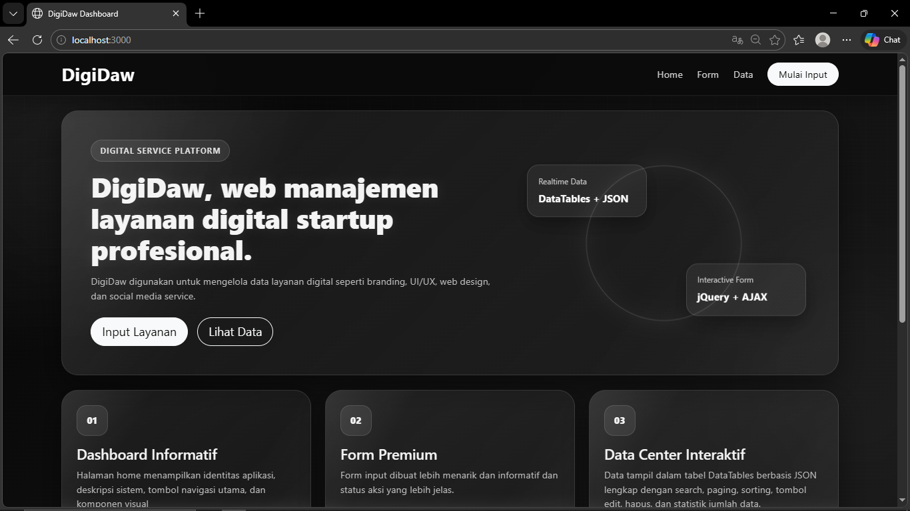
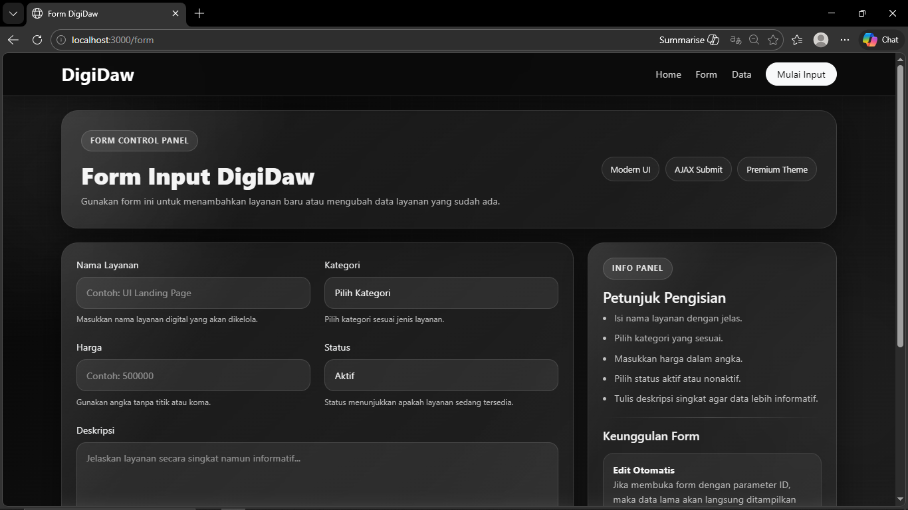
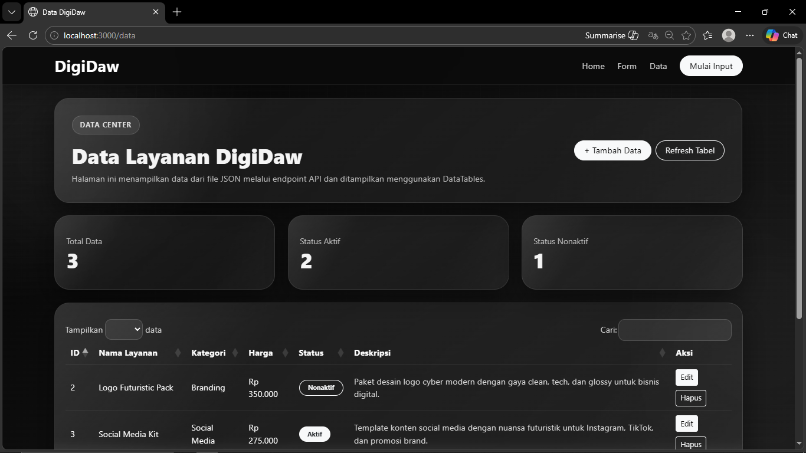

<div align="center">
  <br />
  <h1>LAPORAN PRAKTIKUM <br>APLIKASI BERBASIS PLATFORM</h1>
  <br />
  <h3>Tugas COTS 2</h3>
  <br />
  <br />
  
  <br />
  <br />
  <h3>Disusun Oleh :</h3>
  <p>
    <strong>Muhammad Hamzah Haifan Ma'ruf</strong><br>
    <strong>2311102091</strong><br>
    <strong>S1 IF-11-01</strong>
  </p>
  <br />
  <br />
  <h3>Dosen Pengampu :</h3>
  <p>
    <strong>Dimas Fanny Hebrasianto Permadi, S.ST., M.Kom</strong>
  </p>
  <br />
  <br />
  <h4>Asisten Praktikum :</h4>
  <strong>Apri Pandu Wicaksono</strong> <br>
  <strong>Rangga Pradarrell Fathi</strong>
  <br />
  <h3>LABORATORIUM HIGH PERFORMANCE
 <br>FAKULTAS INFORMATIKA <br>UNIVERSITAS TELKOM PURWOKERTO <br>2026</h3>
</div>

---

# 1. Dasar Teori

## 1.1 Pengertian Aplikasi Web
Aplikasi web adalah perangkat lunak yang dijalankan melalui browser dan dapat diakses melalui jaringan lokal maupun internet. Keunggulan aplikasi web adalah bersifat multiplatform, mudah diperbarui, dan tidak memerlukan instalasi khusus pada sisi pengguna. Pada tugas ini, aplikasi yang dibuat bernama **DigiDaw**, yaitu web CRUD sederhana untuk mengelola data layanan digital dengan tampilan **modern, simple, futuristic, cyberpunk** menggunakan kombinasi warna **black, grey, white glossy**.

## 1.2 Bootstrap
Bootstrap adalah framework CSS yang menyediakan komponen antarmuka siap pakai seperti navbar, card, form, button, modal, dan grid system. Penggunaan Bootstrap mempercepat proses pengembangan UI yang rapi, responsif, dan konsisten. Pada DigiDaw, Bootstrap digunakan untuk:
- membangun layout responsif,
- mempercantik tampilan form,
- menyusun kartu informasi dan section landing page,
- menata tabel serta komponen tombol aksi.

## 1.3 Node.js dan Express
Node.js adalah runtime JavaScript di sisi server, sedangkan Express merupakan framework minimalis Node.js yang memudahkan pembuatan routing, middleware, dan API. Pada DigiDaw, Node.js dan Express digunakan untuk:
- menjalankan server lokal,
- menampilkan halaman EJS,
- menyediakan endpoint API JSON,
- menangani proses CRUD data.

## 1.4 jQuery dan Plugin jQuery
jQuery adalah library JavaScript yang memudahkan manipulasi DOM, event handling, dan AJAX. Pada tugas ini, jQuery dipadukan dengan plugin **DataTables** untuk menampilkan data secara interaktif. jQuery pada DigiDaw digunakan untuk:
- submit form tanpa reload penuh,
- mengambil data berdasarkan `id`,
- menghapus data secara dinamis,
- menampilkan tabel DataTables berbasis JSON.

## 1.5 DataTables dan JSON
DataTables adalah plugin jQuery untuk membuat tabel lebih interaktif dengan fitur pencarian, sorting, pagination, dan render data dinamis. Sesuai spesifikasi tugas, data pada tabel DigiDaw ditampilkan dari endpoint API dalam format **JSON**, sehingga implementasinya memenuhi ketentuan penggunaan **DataTables jQuery** dan **JSON data source**.

## 1.6 Konsep CRUD
CRUD merupakan singkatan dari:
- **Create**: menambah data,
- **Read**: menampilkan data,
- **Update**: memperbarui data,
- **Delete**: menghapus data.

Semua fungsionalitas tersebut telah diterapkan pada aplikasi DigiDaw sehingga pengguna dapat mengelola data layanan digital secara lengkap.

## 1.7 Konsep Desain Premium DigiDaw
Versi akhir DigiDaw menggunakan konsep **landing page startup** yang lebih natural seperti website produk digital pada umumnya, bukan sekadar halaman teks. Tampilan dirancang menyerupai pola website modern yang memiliki:
- hero section dengan headline produk,
- statistik singkat,
- section layanan/fitur,
- CTA (call to action),
- kartu informasi,
- efek glow, glassmorphism, gradient, dan animasi ringan.

Pendekatan ini membuat website lebih realistis, lebih profesional, dan lebih menarik untuk kebutuhan presentasi praktikum.

---

# 2. Penjelasan Code

## 2.1 Konsep Aplikasi DigiDaw
DigiDaw adalah aplikasi CRUD layanan digital. Data yang dikelola meliputi:
- ID layanan,
- nama layanan,
- kategori,
- harga,
- status,
- deskripsi.

Aplikasi terdiri dari 3 halaman utama:
1. **Home / Dashboard** → landing page utama yang menjelaskan isi web,
2. **Form Input** → untuk tambah data dan edit data,
3. **Halaman Data** → untuk menampilkan tabel layanan digital berbasis DataTables.

## 2.2 (`package.json`)

```json
{
  "name": "digidaw",
  "version": "1.0.0",
  "description": "Aplikasi web CRUD DigiDaw",
  "main": "app.js",
  "scripts": {
    "start": "node app.js",
    "dev": "node app.js"
  },
  "dependencies": {
    "ejs": "^3.1.10",
    "express": "^4.21.2"
  }
}
```

### Penjelasan:
Kode tersebut adalah file **package.json** untuk aplikasi Node.js bernama *digidaw*, yang menggunakan **Express** sebagai framework server dan **EJS** sebagai template engine. Script `start` dan `dev` menjalankan file utama `app.js`, sementara bagian `dependencies` mendefinisikan library yang dibutuhkan agar aplikasi web CRUD dapat berjalan.

## 2.3 File Utama Server (`app.js`)

```js
const express = require('express');
const path = require('path');
const fs = require('fs');

const app = express();
const PORT = 3000;

app.set('view engine', 'ejs');
app.set('views', path.join(__dirname, 'views'));

app.use(express.urlencoded({ extended: true }));
app.use(express.json());
app.use(express.static(path.join(__dirname, 'public')));

const DATA_FILE = path.join(__dirname, 'data', 'digidaw.json');

function ensureDataFile() {
  const dataDir = path.join(__dirname, 'data');
  if (!fs.existsSync(dataDir)) {
    fs.mkdirSync(dataDir, { recursive: true });
  }

  if (!fs.existsSync(DATA_FILE)) {
    fs.writeFileSync(DATA_FILE, '[]', 'utf8');
  }
}

function readData() {
  ensureDataFile();
  try {
    const raw = fs.readFileSync(DATA_FILE, 'utf8');
    return JSON.parse(raw || '[]');
  } catch (error) {
    console.error('Gagal membaca data JSON:', error.message);
    return [];
  }
}

function writeData(data) {
  ensureDataFile();
  fs.writeFileSync(DATA_FILE, JSON.stringify(data, null, 2), 'utf8');
}

// Halaman
app.get('/', (req, res) => {
  res.render('index', { title: 'DigiDaw Dashboard' });
});

app.get('/form', (req, res) => {
  res.render('form', { title: 'Form DigiDaw' });
});

app.get('/data', (req, res) => {
  res.render('data', { title: 'Data DigiDaw' });
});

// API JSON untuk DataTables
app.get('/api/items', (req, res) => {
  const items = readData();
  res.json({ data: items });
});

app.get('/api/items/:id', (req, res) => {
  const items = readData();
  const id = Number(req.params.id);
  const item = items.find((i) => Number(i.id) === id);

  if (!item) {
    return res.status(404).json({ success: false, message: 'Data tidak ditemukan' });
  }

  res.json(item);
});

app.post('/api/items', (req, res) => {
  const items = readData();

  const newId = items.length > 0
    ? Math.max(...items.map((i) => Number(i.id))) + 1
    : 1;

  const newItem = {
    id: newId,
    nama: req.body.nama || '',
    kategori: req.body.kategori || '',
    harga: Number(req.body.harga) || 0,
    status: req.body.status || 'Aktif',
    deskripsi: req.body.deskripsi || ''
  };

  items.push(newItem);
  writeData(items);

  res.json({
    success: true,
    message: 'Data berhasil ditambahkan',
    data: newItem
  });
});

app.put('/api/items/:id', (req, res) => {
  const items = readData();
  const id = Number(req.params.id);
  const index = items.findIndex((i) => Number(i.id) === id);

  if (index === -1) {
    return res.status(404).json({ success: false, message: 'Data tidak ditemukan' });
  }

  items[index] = {
    ...items[index],
    nama: req.body.nama || items[index].nama,
    kategori: req.body.kategori || items[index].kategori,
    harga: Number(req.body.harga) || 0,
    status: req.body.status || items[index].status,
    deskripsi: req.body.deskripsi || items[index].deskripsi
  };

  writeData(items);

  res.json({
    success: true,
    message: 'Data berhasil diupdate',
    data: items[index]
  });
});

app.delete('/api/items/:id', (req, res) => {
  const items = readData();
  const id = Number(req.params.id);
  const filtered = items.filter((i) => Number(i.id) !== id);

  if (filtered.length === items.length) {
    return res.status(404).json({ success: false, message: 'Data tidak ditemukan' });
  }

  writeData(filtered);

  res.json({
    success: true,
    message: 'Data berhasil dihapus'
  });
});

app.listen(PORT, () => {
  console.log(`DigiDaw berjalan di http://localhost:${PORT}`);
});
```

### Penjelasan:
Kode tersebut adalah aplikasi server **Node.js dengan Express** yang membuat web CRUD sederhana bernama DigiDaw, menggunakan **EJS** untuk tampilan dan file JSON sebagai penyimpanan data. Server ini menyediakan routing halaman (dashboard, form, data) serta API (`GET, POST, PUT, DELETE`) untuk mengelola data item (tambah, lihat, ubah, hapus), dengan fungsi tambahan untuk membaca dan menulis data ke file JSON secara otomatis.

## 2.4 File Route Halaman (`routes/pageRoutes.js`)

```js
const express = require('express');
const router = express.Router();

module.exports = router;
```

### Penjelasan:
Kode tersebut adalah modul **router kosong pada Express** yang digunakan untuk memisahkan definisi route dari file utama; `express.Router()` membuat instance router, lalu diekspor dengan `module.exports` agar nantinya bisa diisi endpoint dan dihubungkan ke aplikasi utama.

## 2.5 File Data JSON (`data/digidaw.json`)

```json
[
  {
    "id": 2,
    "nama": "Logo Futuristic Pack",
    "kategori": "Branding",
    "harga": 350000,
    "status": "Nonaktif",
    "deskripsi": "Paket desain logo cyber modern dengan gaya clean, tech, dan glossy untuk bisnis digital."
  },
  {
    "id": 3,
    "nama": "Social Media Kit",
    "kategori": "Social Media",
    "harga": 275000,
    "status": "Aktif",
    "deskripsi": "Template konten social media dengan nuansa futuristik untuk Instagram, TikTok, dan promosi brand."
  },
  {
    "id": 4,
    "nama": "Website Company Profile",
    "kategori": "Web Design",
    "harga": 950000,
    "status": "Aktif",
    "deskripsi": "Desain tampilan website company profile modern untuk kebutuhan startup, UMKM, dan personal brand."
  }
]
```

### Penjelasan:
Data tersebut adalah **array JSON** yang berisi daftar item produk/layanan DigiDaw, di mana setiap objek memiliki atribut seperti `id`, `nama`, `kategori`, `harga`, `status`, dan `deskripsi` yang digunakan sebagai sumber data untuk ditampilkan, ditambah, diubah, atau dihapus melalui fitur CRUD pada aplikasi.

## 2.6 Partial Header (`views/partials/header.ejs`)

```html
<!DOCTYPE html>
<html lang="id">
<head>
  <meta charset="UTF-8" />
  <meta name="viewport" content="width=device-width, initial-scale=1.0" />
  <title><%= title %></title>

  <link href="https://cdn.jsdelivr.net/npm/bootstrap@5.3.3/dist/css/bootstrap.min.css" rel="stylesheet">
  <link rel="stylesheet" href="https://cdn.datatables.net/1.13.8/css/jquery.dataTables.min.css">
  <link rel="stylesheet" href="/css/style.css">
</head>
<body>
  <div class="bg-orb orb-1"></div>
  <div class="bg-orb orb-2"></div>
  <div class="bg-grid"></div>

  <nav class="navbar navbar-expand-lg navbar-dark glass-nav sticky-top">
    <div class="container">
      <a class="navbar-brand fw-bold brand-logo" href="/">DigiDaw</a>
      <button class="navbar-toggler" type="button" data-bs-toggle="collapse" data-bs-target="#navMenu">
        <span class="navbar-toggler-icon"></span>
      </button>

      <div class="collapse navbar-collapse" id="navMenu">
        <ul class="navbar-nav ms-auto align-items-lg-center gap-lg-2">
          <li class="nav-item"><a class="nav-link" href="/">Home</a></li>
          <li class="nav-item"><a class="nav-link" href="/form">Form</a></li>
          <li class="nav-item"><a class="nav-link" href="/data">Data</a></li>
          <li class="nav-item">
            <a class="btn btn-light btn-pill ms-lg-2" href="/form">Mulai Input</a>
          </li>
        </ul>
      </div>
    </div>
  </nav>

  <main class="container py-4">
```

### Penjelasan:
Kode tersebut adalah **template layout HTML menggunakan EJS** untuk halaman DigiDaw, yang memuat struktur dasar seperti head, navbar, dan container utama, serta mengintegrasikan **Bootstrap**, **DataTables**, dan CSS custom untuk tampilan modern (glassmorphism), dengan navigasi ke halaman Home, Form, dan Data.

## 2.7 Partial Footer (`views/partials/footer.ejs`)

```html
  </main>

  <footer class="footer-line mt-4">
    <div class="container d-flex flex-column flex-md-row justify-content-between align-items-center gap-2">
      <div>
        <strong>DigiDaw</strong><br>
        Web CRUD layanan digital modern, simple, futuristic.
      </div>
      <div>Praktikum Aplikasi Berbasis Platform - 2026</div>
    </div>
  </footer>

  <div class="toast-container position-fixed bottom-0 end-0 p-3">
    <div id="liveToast" class="toast text-bg-dark border border-light-subtle" role="alert" aria-live="assertive" aria-atomic="true">
      <div class="toast-header bg-dark text-white border-bottom border-secondary">
        <strong class="me-auto">DigiDaw</strong>
        <small>Notifikasi</small>
        <button type="button" class="btn-close btn-close-white ms-2 mb-1" data-bs-dismiss="toast"></button>
      </div>
      <div class="toast-body" id="toastMessage">Aksi berhasil dilakukan.</div>
    </div>
  </div>

  <script src="https://code.jquery.com/jquery-3.7.1.min.js"></script>
  <script src="https://cdn.jsdelivr.net/npm/bootstrap@5.3.3/dist/js/bootstrap.bundle.min.js"></script>
  <script src="https://cdn.datatables.net/1.13.8/js/jquery.dataTables.min.js"></script>
  <script src="/js/app.js"></script>
</body>
</html>
```

### Penjelasan:
Kode tersebut adalah bagian **footer dan penutup layout EJS** yang menampilkan informasi aplikasi, menyediakan komponen **toast notifikasi** untuk feedback aksi pengguna, serta memuat library **jQuery, Bootstrap, DataTables**, dan script custom agar fitur interaktif pada aplikasi DigiDaw dapat berjalan.

## 2.8 Halaman Home Premium (`views/index.ejs`)

```html
<%- include('partials/header') %>

<section class="hero-panel glossy-card mb-4">
  <div class="row align-items-center g-4">
    <div class="col-lg-7">
      <span class="hero-badge">DIGITAL SERVICE PLATFORM</span>
      <h1 class="hero-title mt-3">
        DigiDaw, web manajemen layanan digital startup profesional.
      </h1>
      <p class="hero-subtitle mt-3">
        DigiDaw digunakan untuk mengelola data layanan digital seperti branding, UI/UX, web design, dan social media service.
      </p>

      <div class="d-flex flex-wrap gap-3 mt-4">
        <a href="/form" class="btn btn-light btn-pill btn-lg">Input Layanan</a>
        <a href="/data" class="btn btn-outline-light btn-pill btn-lg">Lihat Data</a>
      </div>
    </div>

    <div class="col-lg-5">
      <div class="hero-visual">
        <div class="visual-card floating-card card-a">
          <div class="visual-label">Realtime Data</div>
          <div class="visual-title">DataTables + JSON</div>
        </div>
        <div class="visual-card floating-card card-b">
          <div class="visual-label">Interactive Form</div>
          <div class="visual-title">jQuery + AJAX</div>
        </div>
        <div class="hero-ring"></div>
      </div>
    </div>
  </div>
</section>

<section class="row g-4 mb-4">
  <div class="col-md-4">
    <div class="feature-card glossy-card h-100">
      <div class="feature-icon">01</div>
      <h4>Dashboard Informatif</h4>
      <p>
        Halaman home menampilkan identitas aplikasi, deskripsi sistem, tombol navigasi utama,
        dan komponen visual
      </p>
    </div>
  </div>

  <div class="col-md-4">
    <div class="feature-card glossy-card h-100">
      <div class="feature-icon">02</div>
      <h4>Form Premium</h4>
      <p>
        Form input dibuat lebih menarik dan informatif dan status aksi yang lebih jelas.
      </p>
    </div>
  </div>

  <div class="col-md-4">
    <div class="feature-card glossy-card h-100">
      <div class="feature-icon">03</div>
      <h4>Data Center Interaktif</h4>
      <p>
        Data tampil dalam tabel DataTables berbasis JSON lengkap dengan search, paging, sorting,
        tombol edit, hapus, dan statistik jumlah data.
      </p>
    </div>
  </div>
</section>

<section class="row g-4">
  <div class="col-lg-8">
    <div class="glossy-card section-card h-100">
      <span class="hero-badge">TENTANG WEBSITE</span>
      <h3 class="mt-3">DigiDaw dibuat seperti web layanan digital pada umumnya</h3>
      <p class="mb-0">
        Tampilan website ini dibuat agar tidak terlihat seperti seperti website startup:
        ada hero section, deskripsi produk, keunggulan layanan, tombol call-to-action, efek hover, glow, dan animasi halus.
        Tujuannya agar tampilan lebih realistis dan layak dipresentasikan pada tugas praktikum.
      </p>
    </div>
  </div>

  <div class="col-lg-4">
    <div class="glossy-card section-card h-100 pulse-border">
      <span class="hero-badge">TEKNOLOGI</span>
      <ul class="tech-list mt-3 mb-0">
        <li>Bootstrap 5</li>
        <li>Node.js + Express</li>
        <li>jQuery + AJAX</li>
        <li>DataTables</li>
        <li>JSON Local Storage File</li>
      </ul>
    </div>
  </div>
</section>

<%- include('partials/footer') %>
```

### Penjelasan:
Kode tersebut adalah **template halaman Home (index.ejs)** pada aplikasi DigiDaw yang menampilkan landing page modern dengan **hero section, fitur utama, deskripsi aplikasi, dan teknologi yang digunakan**, serta tombol navigasi ke form input dan halaman data, menggunakan komponen visual interaktif dan layout berbasis Bootstrap.

## 2.9 Halaman Form Premium (`views/form.ejs`)

```html
<%- include('partials/header') %>

<section class="page-hero glossy-card mb-4">
  <div class="d-flex flex-column flex-lg-row justify-content-between align-items-lg-center gap-3">
    <div>
      <span class="hero-badge">FORM CONTROL PANEL</span>
      <h1 class="page-title mt-3 mb-2" id="formTitle">Form Input DigiDaw</h1>
      <p class="page-subtitle mb-0">
        Gunakan form ini untuk menambahkan layanan baru atau mengubah data layanan yang sudah ada.
      </p>
    </div>
    <div class="page-hero-side">
      <div class="side-chip">Modern UI</div>
      <div class="side-chip">AJAX Submit</div>
      <div class="side-chip">Premium Theme</div>
    </div>
  </div>
</section>

<section class="row g-4">
  <div class="col-lg-8">
    <div class="glossy-card form-panel">
      <form id="digidawForm">
        <input type="hidden" id="itemId">

        <div class="row g-4">
          <div class="col-md-6">
            <label class="form-label text-light">Nama Layanan</label>
            <input
              type="text"
              class="form-control dark-input"
              id="nama"
              placeholder="Contoh: UI Landing Page"
              required
            >
            <small class="form-text-custom">Masukkan nama layanan digital yang akan dikelola.</small>
          </div>

          <div class="col-md-6">
            <label class="form-label text-light">Kategori</label>
            <select class="form-select dark-input" id="kategori" required>
              <option value="">Pilih Kategori</option>
              <option value="Branding">Branding</option>
              <option value="UI/UX">UI/UX</option>
              <option value="Web Design">Web Design</option>
              <option value="Social Media">Social Media</option>
              <option value="Development">Development</option>
            </select>
            <small class="form-text-custom">Pilih kategori sesuai jenis layanan.</small>
          </div>

          <div class="col-md-6">
            <label class="form-label text-light">Harga</label>
            <input
              type="number"
              class="form-control dark-input"
              id="harga"
              placeholder="Contoh: 500000"
              required
            >
            <small class="form-text-custom">Gunakan angka tanpa titik atau koma.</small>
          </div>

          <div class="col-md-6">
            <label class="form-label text-light">Status</label>
            <select class="form-select dark-input" id="status" required>
              <option value="Aktif">Aktif</option>
              <option value="Nonaktif">Nonaktif</option>
            </select>
            <small class="form-text-custom">Status menunjukkan apakah layanan sedang tersedia.</small>
          </div>

          <div class="col-12">
            <label class="form-label text-light">Deskripsi</label>
            <textarea
              class="form-control dark-input"
              id="deskripsi"
              rows="5"
              placeholder="Jelaskan layanan secara singkat namun informatif..."
            ></textarea>
            <small class="form-text-custom">Deskripsi akan ditampilkan pada tabel data.</small>
          </div>
        </div>

        <div class="d-flex flex-wrap gap-2 mt-4">
          <button type="submit" class="btn btn-light btn-pill" id="submitBtn">Simpan Data</button>
          <button type="reset" class="btn btn-outline-light btn-pill" id="resetBtn">Reset</button>
          <a href="/data" class="btn btn-outline-secondary btn-pill">Lihat Tabel</a>
        </div>
      </form>
    </div>
  </div>

  <div class="col-lg-4">
    <div class="glossy-card info-side-panel h-100">
      <span class="hero-badge">INFO PANEL</span>
      <h4 class="mt-3">Petunjuk Pengisian</h4>
      <ul class="info-list">
        <li>Isi nama layanan dengan jelas.</li>
        <li>Pilih kategori yang sesuai.</li>
        <li>Masukkan harga dalam angka.</li>
        <li>Pilih status aktif atau nonaktif.</li>
        <li>Tulis deskripsi singkat agar data lebih informatif.</li>
      </ul>

      <div class="divider-glow"></div>

      <h5 class="mb-3">Keunggulan Form</h5>
      <div class="mini-card">
        <strong>Edit Otomatis</strong>
        <p class="mb-0">Jika membuka form dengan parameter ID, maka data lama akan langsung ditampilkan untuk diedit.</p>
      </div>
      <div class="mini-card">
        <strong>AJAX Submit</strong>
        <p class="mb-0">Penyimpanan dilakukan tanpa proses yang rumit dan langsung diarahkan ke halaman tabel.</p>
      </div>
    </div>
  </div>
</section>

<%- include('partials/footer') %>
```

### Penjelasan:
Kode tersebut adalah **template halaman form (form.ejs)** pada DigiDaw yang digunakan untuk input dan edit data layanan, berisi form lengkap (nama, kategori, harga, status, deskripsi) dengan desain modern, serta mendukung pengiriman data via **AJAX** dan fitur edit otomatis berdasarkan ID.

## 2.10 Halaman Tabel Premium (`views/data.ejs`)

```html
<%- include('partials/header') %>

<section class="page-hero glossy-card mb-4">
  <div class="d-flex flex-column flex-lg-row justify-content-between align-items-lg-center gap-3">
    <div>
      <span class="hero-badge">DATA CENTER</span>
      <h1 class="page-title mt-3 mb-2">Data Layanan DigiDaw</h1>
      <p class="page-subtitle mb-0">
        Halaman ini menampilkan data dari file JSON melalui endpoint API dan ditampilkan menggunakan DataTables.
      </p>
    </div>
    <div class="d-flex gap-2 flex-wrap">
      <a href="/form" class="btn btn-light btn-pill">+ Tambah Data</a>
      <button id="refreshTable" class="btn btn-outline-light btn-pill" type="button">Refresh Tabel</button>
    </div>
  </div>
</section>

<section class="row g-4 mb-4">
  <div class="col-md-4">
    <div class="stat-card glossy-card">
      <div class="stat-label">Total Data</div>
      <div class="stat-value" id="totalData">0</div>
    </div>
  </div>
  <div class="col-md-4">
    <div class="stat-card glossy-card">
      <div class="stat-label">Status Aktif</div>
      <div class="stat-value" id="totalAktif">0</div>
    </div>
  </div>
  <div class="col-md-4">
    <div class="stat-card glossy-card">
      <div class="stat-label">Status Nonaktif</div>
      <div class="stat-value" id="totalNonaktif">0</div>
    </div>
  </div>
</section>

<section class="glossy-card table-panel">
  <div class="table-responsive">
    <table id="digidawTable" class="table table-dark table-hover align-middle w-100">
      <thead>
        <tr>
          <th>ID</th>
          <th>Nama Layanan</th>
          <th>Kategori</th>
          <th>Harga</th>
          <th>Status</th>
          <th>Deskripsi</th>
          <th>Aksi</th>
        </tr>
      </thead>
    </table>
  </div>
</section>

<%- include('partials/footer') %>
```

### Penjelasan:
Kode tersebut adalah **template halaman data (data.ejs)** yang menampilkan tabel interaktif menggunakan **DataTables** untuk menampilkan data layanan dari API JSON, dilengkapi statistik jumlah data (total, aktif, nonaktif), serta tombol untuk menambah data dan refresh tabel.

## 2.11 JavaScript Utama (`public/js/app.js`)

```js
$(document).ready(function () {
  function showToast(message) {
    $('#toastMessage').text(message);
    const toastEl = document.getElementById('liveToast');
    const toast = new bootstrap.Toast(toastEl);
    toast.show();
  }

  function updateStats() {
    $.get('/api/items', function (res) {
      const items = res.data || [];
      $('#totalData').text(items.length);
      $('#totalAktif').text(items.filter(item => item.status === 'Aktif').length);
      $('#totalNonaktif').text(items.filter(item => item.status === 'Nonaktif').length);
    });
  }

  if ($('#digidawTable').length) {
    const table = $('#digidawTable').DataTable({
      processing: true,
      ajax: {
        url: '/api/items',
        dataSrc: 'data'
      },
      columns: [
        { data: 'id' },
        { data: 'nama' },
        { data: 'kategori' },
        {
          data: 'harga',
          render: function (data) {
            return 'Rp ' + Number(data).toLocaleString('id-ID');
          }
        },
        {
          data: 'status',
          render: function (data) {
            const cls = data === 'Aktif'
              ? 'badge rounded-pill text-bg-light text-dark px-3 py-2'
              : 'badge rounded-pill border border-light text-light px-3 py-2';
            return `<span class="${cls}">${data}</span>`;
          }
        },
        {
          data: 'deskripsi',
          render: function (data) {
            return `<span class="desc-cell">${data || '-'}</span>`;
          }
        },
        {
          data: null,
          orderable: false,
          searchable: false,
          render: function (data) {
            return `
              <div class="d-flex flex-wrap gap-2">
                <button class="btn btn-sm btn-light editBtn" data-id="${data.id}">Edit</button>
                <button class="btn btn-sm btn-outline-light deleteBtn" data-id="${data.id}">Hapus</button>
              </div>
            `;
          }
        }
      ],
      language: {
        search: 'Cari:',
        lengthMenu: 'Tampilkan _MENU_ data',
        info: 'Menampilkan _START_ sampai _END_ dari _TOTAL_ data',
        zeroRecords: 'Data tidak ditemukan',
        infoEmpty: 'Tidak ada data',
        infoFiltered: '(difilter dari _MAX_ total data)',
        paginate: {
          first: 'Awal',
          last: 'Akhir',
          next: '›',
          previous: '‹'
        }
      },
      pageLength: 5,
      autoWidth: false,
      responsive: true,
      drawCallback: function () {
        updateStats();
      }
    });

    updateStats();

    $('#refreshTable').on('click', function () {
      table.ajax.reload(function () {
        updateStats();
        showToast('Tabel berhasil diperbarui.');
      }, false);
    });

    $('#digidawTable').on('click', '.deleteBtn', function () {
      const id = $(this).data('id');

      if (confirm('Yakin ingin menghapus data ini?')) {
        $.ajax({
          url: `/api/items/${id}`,
          method: 'DELETE',
          success: function () {
            table.ajax.reload(function () {
              updateStats();
              showToast('Data berhasil dihapus.');
            }, false);
          },
          error: function () {
            showToast('Gagal menghapus data.');
          }
        });
      }
    });

    $('#digidawTable').on('click', '.editBtn', function () {
      const id = $(this).data('id');
      window.location.href = `/form?id=${id}`;
    });
  }

  if ($('#digidawForm').length) {
    const params = new URLSearchParams(window.location.search);
    const id = params.get('id');

    if (id) {
      $.get(`/api/items/${id}`, function (data) {
        $('#itemId').val(data.id);
        $('#nama').val(data.nama);
        $('#kategori').val(data.kategori);
        $('#harga').val(data.harga);
        $('#status').val(data.status);
        $('#deskripsi').val(data.deskripsi);
        $('#formTitle').text('Edit Data DigiDaw');
        $('#submitBtn').text('Update Data');
      }).fail(function () {
        showToast('Data edit tidak ditemukan.');
      });
    }

    $('#digidawForm').on('submit', function (e) {
      e.preventDefault();

      const itemId = $('#itemId').val();
      const payload = {
        nama: $('#nama').val().trim(),
        kategori: $('#kategori').val(),
        harga: $('#harga').val(),
        status: $('#status').val(),
        deskripsi: $('#deskripsi').val().trim()
      };

      if (!payload.nama || !payload.kategori || !payload.harga || !payload.status) {
        showToast('Mohon lengkapi semua field wajib.');
        return;
      }

      $('#submitBtn').prop('disabled', true).text(itemId ? 'Mengupdate...' : 'Menyimpan...');

      const ajaxConfig = itemId
        ? {
            url: `/api/items/${itemId}`,
            method: 'PUT'
          }
        : {
            url: '/api/items',
            method: 'POST'
          };

      $.ajax({
        url: ajaxConfig.url,
        method: ajaxConfig.method,
        contentType: 'application/json',
        data: JSON.stringify(payload),
        success: function () {
          showToast(itemId ? 'Data berhasil diupdate.' : 'Data berhasil ditambahkan.');
          setTimeout(() => {
            window.location.href = '/data';
          }, 700);
        },
        error: function () {
          $('#submitBtn').prop('disabled', false).text(itemId ? 'Update Data' : 'Simpan Data');
          showToast('Terjadi kesalahan saat menyimpan data.');
        }
      });
    });

    $('#resetBtn').on('click', function () {
      if (!$('#itemId').val()) {
        $('#submitBtn').text('Simpan Data').prop('disabled', false);
      }
    });
  }
});
```

### Penjelasan:
Kode tersebut adalah **JavaScript frontend (app.js)** yang mengatur interaksi pada aplikasi DigiDaw, seperti menampilkan **DataTables dari API**, menghitung statistik data, menangani aksi **tambah, edit, hapus (CRUD) dengan AJAX**, serta menampilkan notifikasi toast agar pengalaman pengguna lebih interaktif dan responsif 

## 2.12 CSS Premium (`public/css/style.css`)

```css
:root {
  --bg-main: #050505;
  --bg-soft: #101010;
  --bg-card: rgba(255, 255, 255, 0.05);
  --border-soft: rgba(255, 255, 255, 0.12);
  --text-main: #f4f4f4;
  --text-muted: #bdbdbd;
  --glow: rgba(255, 255, 255, 0.16);
  --shadow-dark: 0 18px 50px rgba(0, 0, 0, 0.45);
}

* {
  box-sizing: border-box;
}

body {
  margin: 0;
  min-height: 100vh;
  background:
    radial-gradient(circle at top left, rgba(255,255,255,0.08), transparent 26%),
    radial-gradient(circle at bottom right, rgba(255,255,255,0.07), transparent 24%),
    linear-gradient(135deg, #040404, #111111 45%, #1c1c1c 100%);
  color: var(--text-main);
  font-family: "Segoe UI", Tahoma, Geneva, Verdana, sans-serif;
  overflow-x: hidden;
}

.bg-grid {
  position: fixed;
  inset: 0;
  background-image:
    linear-gradient(rgba(255,255,255,0.045) 1px, transparent 1px),
    linear-gradient(90deg, rgba(255,255,255,0.045) 1px, transparent 1px);
  background-size: 36px 36px;
  mask-image: linear-gradient(to bottom, rgba(255,255,255,0.25), transparent 85%);
  pointer-events: none;
  z-index: -3;
}

.bg-orb {
  position: fixed;
  border-radius: 50%;
  filter: blur(90px);
  pointer-events: none;
  z-index: -2;
  opacity: 0.45;
  animation: floatOrb 8s ease-in-out infinite;
}

.orb-1 {
  width: 280px;
  height: 280px;
  top: 80px;
  left: -50px;
  background: rgba(255,255,255,0.08);
}

.orb-2 {
  width: 340px;
  height: 340px;
  right: -100px;
  bottom: 40px;
  background: rgba(255,255,255,0.06);
  animation-delay: 2s;
}

@keyframes floatOrb {
  0%, 100% { transform: translateY(0px) translateX(0px); }
  50% { transform: translateY(-18px) translateX(12px); }
}

.glass-nav {
  background: rgba(10, 10, 10, 0.82);
  backdrop-filter: blur(14px);
  border-bottom: 1px solid rgba(255, 255, 255, 0.08);
  box-shadow: 0 8px 30px rgba(0, 0, 0, 0.28);
}

.brand-logo {
  letter-spacing: 0.5px;
  font-size: 1.85rem;
}

.navbar .nav-link {
  color: rgba(255,255,255,0.82) !important;
  transition: all 0.25s ease;
}

.navbar .nav-link:hover {
  color: #ffffff !important;
  text-shadow: 0 0 12px rgba(255,255,255,0.25);
}

.btn-pill {
  border-radius: 999px;
  padding-left: 1.1rem;
  padding-right: 1.1rem;
}

.glossy-card,
.hero-panel,
.feature-card,
.section-card,
.form-panel,
.info-side-panel,
.table-panel,
.stat-card {
  position: relative;
  background: linear-gradient(145deg, rgba(255,255,255,0.08), rgba(255,255,255,0.03));
  border: 1px solid var(--border-soft);
  border-radius: 28px;
  box-shadow: var(--shadow-dark);
  backdrop-filter: blur(10px);
  overflow: hidden;
}

.glossy-card::before,
.hero-panel::before,
.feature-card::before,
.section-card::before,
.form-panel::before,
.info-side-panel::before,
.table-panel::before,
.stat-card::before {
  content: "";
  position: absolute;
  inset: 0;
  background: linear-gradient(120deg, rgba(255,255,255,0.09), transparent 28%, transparent 72%, rgba(255,255,255,0.03));
  pointer-events: none;
}

.hero-panel {
  padding: 3rem;
  animation: fadeUp 0.8s ease;
}

.hero-badge {
  display: inline-block;
  padding: 0.45rem 0.9rem;
  border-radius: 999px;
  font-size: 0.82rem;
  font-weight: 700;
  letter-spacing: 1px;
  color: #dedede;
  background: rgba(255,255,255,0.08);
  border: 1px solid rgba(255,255,255,0.14);
}

.hero-title {
  font-size: clamp(2rem, 3vw, 3.3rem);
  line-height: 1.15;
  font-weight: 800;
  text-shadow: 0 0 18px rgba(255,255,255,0.08);
}

.hero-subtitle,
.page-subtitle,
.feature-card p,
.section-card p,
.form-text-custom,
.info-list,
.tech-list,
.mini-card p {
  color: var(--text-muted);
}

.hero-mini-stats .mini-stat {
  padding: 1rem 1rem;
  border-radius: 20px;
  background: rgba(255,255,255,0.04);
  border: 1px solid rgba(255,255,255,0.08);
}

.mini-stat-number {
  font-size: 1.15rem;
  font-weight: 700;
  color: #fff;
}

.mini-stat-label {
  font-size: 0.88rem;
  color: var(--text-muted);
}

.hero-visual {
  position: relative;
  min-height: 320px;
  display: flex;
  align-items: center;
  justify-content: center;
}

.hero-ring {
  width: 250px;
  height: 250px;
  border: 1px solid rgba(255,255,255,0.18);
  border-radius: 50%;
  box-shadow: 0 0 35px rgba(255,255,255,0.06), inset 0 0 35px rgba(255,255,255,0.04);
  animation: pulseRing 3.6s ease-in-out infinite;
}

@keyframes pulseRing {
  0%, 100% { transform: scale(1); opacity: 0.85; }
  50% { transform: scale(1.05); opacity: 1; }
}

.visual-card {
  position: absolute;
  width: 200px;
  padding: 1.1rem;
  border-radius: 20px;
  background: rgba(255,255,255,0.06);
  border: 1px solid rgba(255,255,255,0.12);
  box-shadow: 0 12px 30px rgba(0,0,0,0.32);
}

.visual-label {
  font-size: 0.82rem;
  color: #c8c8c8;
  margin-bottom: 0.35rem;
}

.visual-title {
  font-size: 1.05rem;
  font-weight: 700;
  color: #fff;
}

.card-a {
  top: 30px;
  left: 15px;
}

.card-b {
  right: 5px;
  bottom: 35px;
}

.floating-card {
  animation: floatCard 4s ease-in-out infinite;
}

.card-b.floating-card {
  animation-delay: 1.2s;
}

@keyframes floatCard {
  0%, 100% { transform: translateY(0px); }
  50% { transform: translateY(-10px); }
}

.feature-card,
.section-card,
.info-side-panel,
.form-panel,
.table-panel {
  padding: 1.5rem;
}

.feature-card {
  transition: transform 0.3s ease, box-shadow 0.3s ease;
}

.feature-card:hover,
.section-card:hover,
.stat-card:hover,
.mini-card:hover {
  transform: translateY(-5px);
  box-shadow: 0 20px 45px rgba(0, 0, 0, 0.42), 0 0 20px rgba(255,255,255,0.05);
}

.feature-icon {
  width: 52px;
  height: 52px;
  display: inline-flex;
  align-items: center;
  justify-content: center;
  border-radius: 16px;
  background: rgba(255,255,255,0.08);
  border: 1px solid rgba(255,255,255,0.12);
  font-weight: 800;
  margin-bottom: 1rem;
}

.tech-list,
.info-list {
  padding-left: 1.2rem;
}

.tech-list li,
.info-list li {
  margin-bottom: 0.6rem;
}

.pulse-border {
  animation: pulseBorder 2.5s ease-in-out infinite;
}

@keyframes pulseBorder {
  0%, 100% { box-shadow: var(--shadow-dark), 0 0 0 rgba(255,255,255,0.03); }
  50% { box-shadow: var(--shadow-dark), 0 0 24px rgba(255,255,255,0.08); }
}

.page-hero {
  padding: 2rem;
  animation: fadeUp 0.7s ease;
}

.page-title {
  font-size: clamp(1.9rem, 2.6vw, 3rem);
  font-weight: 800;
}

.page-hero-side {
  display: flex;
  gap: 0.6rem;
  flex-wrap: wrap;
}

.side-chip {
  padding: 0.55rem 0.9rem;
  border-radius: 999px;
  color: #f2f2f2;
  font-size: 0.88rem;
  border: 1px solid rgba(255,255,255,0.12);
  background: rgba(255,255,255,0.04);
}

.dark-input {
  background: rgba(255,255,255,0.07);
  border: 1px solid rgba(255,255,255,0.12);
  color: #fff;
  border-radius: 16px;
  padding: 0.85rem 1rem;
}

.dark-input::placeholder {
  color: rgba(255,255,255,0.48);
}

.dark-input:focus {
  background: rgba(255,255,255,0.1);
  border-color: rgba(255,255,255,0.34);
  color: #fff;
  box-shadow: 0 0 0 0.2rem rgba(255,255,255,0.06);
}

.form-text-custom {
  display: inline-block;
  margin-top: 0.45rem;
  font-size: 0.84rem;
}

.mini-card {
  padding: 1rem;
  border-radius: 18px;
  background: rgba(255,255,255,0.05);
  border: 1px solid rgba(255,255,255,0.09);
  margin-bottom: 1rem;
  transition: all 0.25s ease;
}

.divider-glow {
  width: 100%;
  height: 1px;
  background: linear-gradient(to right, transparent, rgba(255,255,255,0.2), transparent);
  margin: 1.2rem 0;
}

.stat-card {
  padding: 1.35rem;
  min-height: 140px;
  display: flex;
  flex-direction: column;
  justify-content: center;
}

.stat-label {
  color: var(--text-muted);
  font-size: 0.95rem;
  margin-bottom: 0.35rem;
}

.stat-value {
  font-size: 2.4rem;
  font-weight: 800;
  line-height: 1;
}

.table-panel {
  padding: 1.2rem;
}

.table {
  --bs-table-bg: transparent;
  --bs-table-color: #fff;
  margin-bottom: 0;
}

.table > :not(caption) > * > * {
  background: transparent !important;
  color: #fff !important;
  border-bottom-color: rgba(255,255,255,0.08) !important;
  vertical-align: middle;
}

.table tbody tr {
  transition: all 0.25s ease;
}

.table tbody tr:hover {
  background: rgba(255,255,255,0.06) !important;
  transform: scale(1.002);
}

.desc-cell {
  color: #d8d8d8;
}

.dataTables_wrapper .dataTables_filter input,
.dataTables_wrapper .dataTables_length select {
  background: rgba(255,255,255,0.07);
  color: #fff;
  border: 1px solid rgba(255,255,255,0.16);
  border-radius: 12px;
  padding: 0.45rem 0.7rem;
}

.dataTables_wrapper .dataTables_info,
.dataTables_wrapper .dataTables_length,
.dataTables_wrapper .dataTables_filter,
.dataTables_wrapper .dataTables_paginate {
  color: #d5d5d5 !important;
  margin-top: 0.7rem;
}

.dataTables_wrapper .dataTables_paginate .paginate_button {
  color: #fff !important;
  border-radius: 10px !important;
  border: 1px solid transparent !important;
}

.dataTables_wrapper .dataTables_paginate .paginate_button.current,
.dataTables_wrapper .dataTables_paginate .paginate_button:hover {
  background: rgba(255,255,255,0.08) !important;
  color: #fff !important;
  border: 1px solid rgba(255,255,255,0.12) !important;
}

.footer-line {
  margin-top: 2.5rem;
  padding: 1.25rem 0 2rem;
  color: #bfbfbf;
}

.footer-line .container {
  border-top: 1px solid rgba(255,255,255,0.08);
  padding-top: 1rem;
}

@keyframes fadeUp {
  from {
    opacity: 0;
    transform: translateY(18px);
  }
  to {
    opacity: 1;
    transform: translateY(0);
  }
}

@media (max-width: 991.98px) {
  .hero-panel {
    padding: 2rem;
  }

  .hero-visual {
    min-height: 260px;
  }

  .visual-card {
    position: relative;
    width: 100%;
    margin-bottom: 1rem;
  }

  .card-a,
  .card-b {
    top: auto;
    bottom: auto;
    left: auto;
    right: auto;
  }

  .hero-ring {
    display: none;
  }
}

@media (max-width: 575.98px) {
  .brand-logo {
    font-size: 1.5rem;
  }

  .hero-title {
    font-size: 1.9rem;
  }

  .page-title {
    font-size: 1.8rem;
  }

  .stat-value {
    font-size: 2rem;
  }
}
```

### Penjelasan:
Kode tersebut adalah **CSS (style.css)** yang mengatur tampilan visual aplikasi DigiDaw dengan tema **dark futuristic (glassmorphism)**, mencakup styling layout, navbar, card, form, tabel, animasi, serta efek interaktif seperti glow, blur, dan hover agar tampilan lebih modern dan premium 

---

# 3. Hasil Tampilan

## 3.1 Tampilan Halaman Dashboard / Home



## 3.2 Tampilan Halaman Form Input



## 3.3 Tampilan Halaman Data / Tabel



## 3.4 Hasil Pengujian CRUD
Pengujian fungsional dilakukan pada seluruh fitur utama aplikasi.

| Fitur | Langkah Uji | Hasil yang Diharapkan | Status |
|---|---|---|---|
| Create | Isi form lalu klik simpan | Data baru tersimpan ke JSON dan bisa tampil di tabel | Berhasil |
| Read | Buka halaman data | Data dummy dan data baru tampil pada DataTables | Berhasil |
| Update | Klik edit lalu ubah data | Data berubah dan tersimpan ke JSON | Berhasil |
| Delete | Klik hapus pada salah satu data | Data terhapus dari tabel dan file JSON | Berhasil |
| Search | Ketik kata kunci di kolom pencarian tabel | Tabel memfilter data sesuai kata kunci | Berhasil |
| Pagination | Gunakan kontrol halaman DataTables | Tabel berpindah halaman dengan benar | Berhasil |

## 3.5 Analisis Hasil
Berdasarkan hasil implementasi:
- sistem berhasil menampilkan data JSON,
- seluruh proses CRUD berjalan,
- penggunaan jQuery dan DataTables berhasil diterapkan,
- tampilan akhir lebih menarik dibanding versi awal,
- aplikasi layak digunakan sebagai hasil praktikum karena memenuhi seluruh syarat teknis.

## 3.6 Link Video Presentasi
Tambahkan tautan video presentasi maksimal 10 menit pada bagian ini.

```md
[Video Presentasi DigiDaw](https://drive.google.com/xxxxx)
```

---

# 4. Referensi

1. Purba, D., Singasatia, H. D., & Mutaqqin, M. R. (2023). **Rancang Bangun Sistem Informasi Pelayanan Pasien Rawat Jalan Berbasis Web pada Klinik Kimia Farma Purwakarta Menggunakan Metode Extreme Programming**. *In Search*, 22(1). https://doi.org/10.37278/insearch.v22i1.680.

2. Hasanah, A. N., & Salim, A. (2025). **Development of a Web-Based Internship Monitoring Application for Teachers at PT Chlorine Digital Media**. *SISINFO: Jurnal Sistem Informasi dan Informatika*, 7(2). https://doi.org/10.37278/sisinfo.v7i2.1108.

3. Sirait, R. J., dkk. (2025). **Perancangan Sistem Informasi Pengaduan dan Perbaikan Gangguan PABX di PT Arga Bangun Bangsa Berbasis Web**. *SISINFO: Jurnal Sistem Informasi dan Informatika*, 7(2). https://doi.org/10.37278/sisinfo.v7i2.1104.

4. Ramada, S., dkk. (2025). **Design of a Web-Based Student Internship Application at PT Chlorine Digital Media**. *SISINFO: Jurnal Sistem Informasi dan Informatika*, 7(2). https://doi.org/10.37278/sisinfo.v7i2.1107.

5. Prasetyaningrum, P. T., Pradana, A. P., Solayman, B. N., & Sipayung, V. J. (2025). **Pengembangan E-Business pada Industri Rumahan Briket Arang Batok Kelapa di Bantul: Pendekatan SWOT, PIECES, dan PESTEL**. *SISINFO: Jurnal Sistem Informasi dan Informatika*, 7(1), 23–39. https://doi.org/10.37278/sisinfo.v7i1.1067.

---

# 5.Link Video Presentasi
https://drive.google.com/file/d/1ERjkS0q1UM1DT2VGNzJL5XPeDPj4rMJP/view?usp=sharing