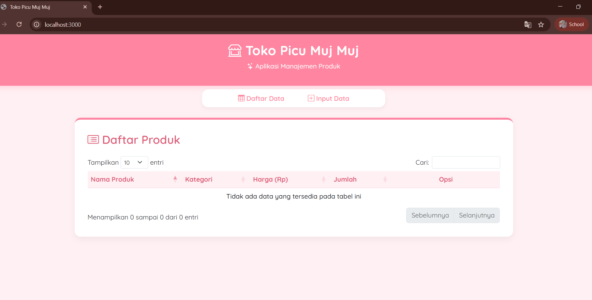
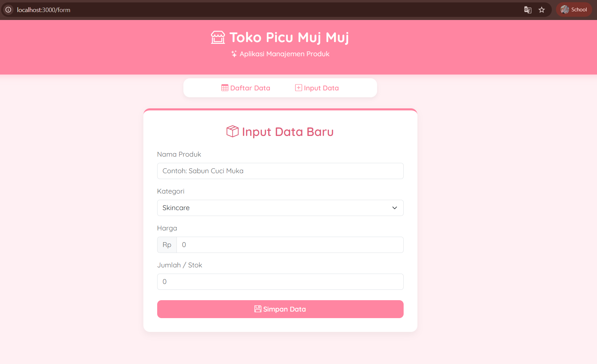
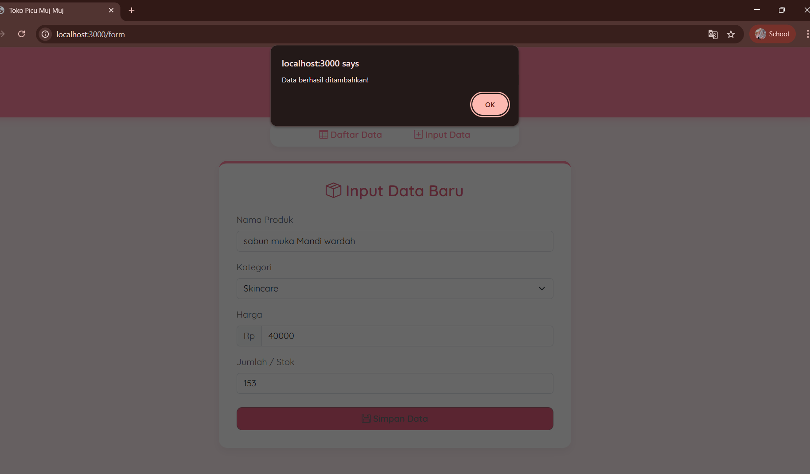
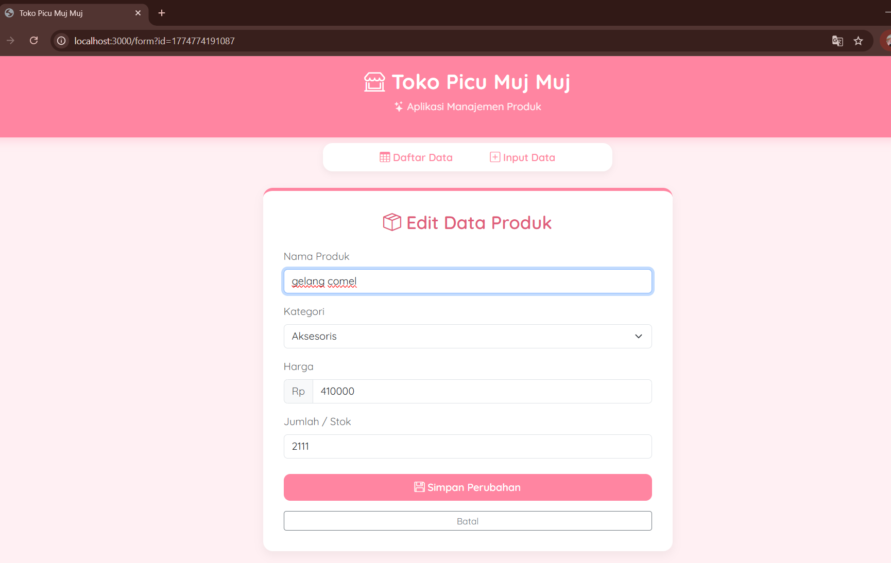
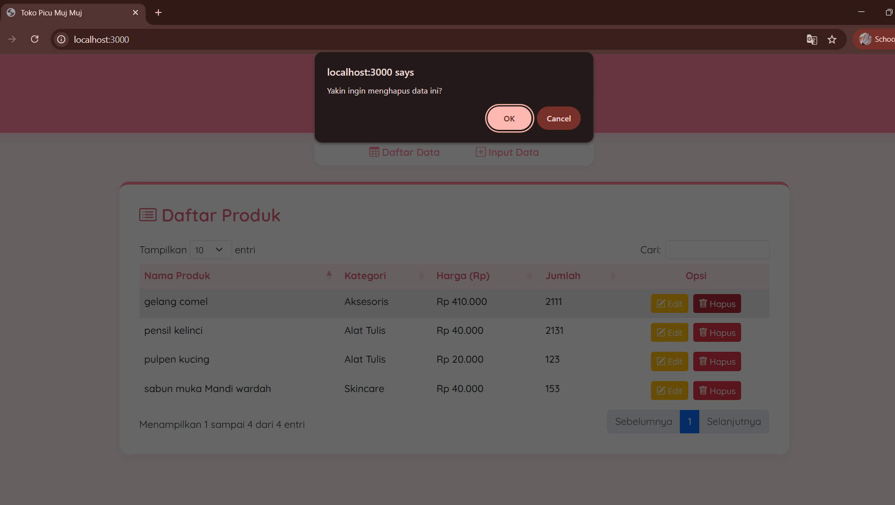
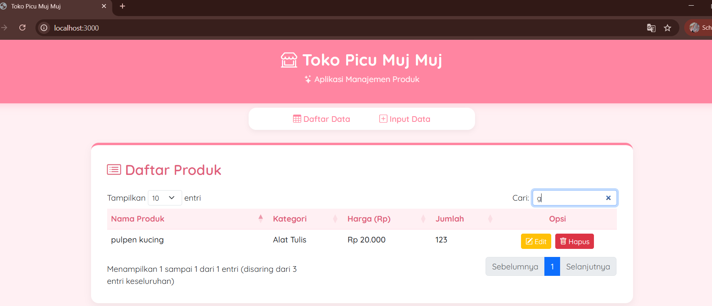
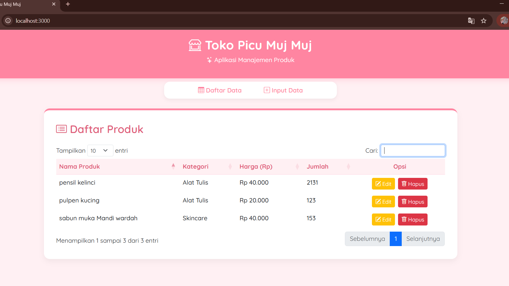

<div align="center">
  <br />

  <h1>LAPORAN PRAKTIKUM <br>
  APLIKASI BERBASIS PLATFORM
  </h1>

  <br />

  <h3>TUGAS COTS KE-2<br>
  Toko Picu Muj Muj
  </h3>

  <br />

  <p align="center">

</p>

  <br />
  <br />
  <br />

  <h3>Disusun Oleh :</h3>

  <p>
    <strong>Aisyah Anis Mazaya</strong><br>
    <strong>2311102095</strong><br>
    <strong>S1 IF-11-REG01</strong>
  </p>

  <br />

  <h3>Dosen Pengampu :</h3>

  <p>
    <strong>Dimas Fanny Hebrasianto Permadi, S.ST., M.Kom</strong>
  </p>
  
  <br />
  <br />
    <h4>Asisten Praktikum :</h4>
    <strong>Apri Pandu Wicaksono </strong> <br>
    <strong>Rangga Pradarrell Fathi</strong>
  <br />

  <h3>LABORATORIUM HIGH PERFORMANCE
 <br>FAKULTAS INFORMATIKA <br>UNIVERSITAS TELKOM PURWOKERTO <br>2026</h3>
</div>

<hr>

### Deskripsi
Node.js
Node.js adalah runtime environment untuk JavaScript yang dibangun di atas mesin V8 Google Chrome. Berbeda dengan JavaScript tradisional yang berjalan di sisi client (browser), Node.js memungkinkan eksekusi kode JavaScript di sisi server. Keunggulan utamanya adalah arsitektur non-blocking I/O yang membuatnya sangat efisien untuk aplikasi real-time dan intensif data.

Framework Node.js (Express.js)
Dalam pengembangan aplikasi berbasis server Node.js digunakan untuk menjalankan JavaScript di luar peramban (browser). Untuk mempermudah proses ini, digunakan framework Express.js. Express.js adalah web application framework untuk Node.js yang minimalis dan fleksibel. Framework ini sangat membantu dalam mengatur arsitektur server (seperti pada file server.js) mengelola routing URL (seperti rute / dan /form), serta menangani permintaan (request) dan respons (response) HTTP untuk fungsionalitas CRUD secara efisien.

Framework Bootstrap 5
Untuk mempercepat proses styling dan memastikan aplikasi web bersifat responsif (dapat menyesuaikan dengan ukuran layar), framework Bootstrap 5 digunakan pada bagian frontend. Bootstrap menyediakan berbagai kelas CSS siap pakai (seperti container, card, btn, dll.) yang mempermudah pembuatan layout, navigasi, form, dan tombol tanpa harus menulis kode CSS dari awal secara ekstensif.

jQuery dan DataTables (Implementasi JSON)
Sesuai spesifikasi teknis aplikasi ini mengimplementasikan manipulasi DOM (Document Object Model) menggunakan library JavaScript jQuery. Penggunaan jQuery mempermudah penanganan interaksi pengguna dan proses Ajax untuk mengirim atau mengambil data secara asynchronous tanpa memuat ulang halaman. Selain itu, digunakan plugin jQuery yaitu DataTables. DataTables berfungsi untuk mengubah struktur tabel HTML standar menjadi tabel dinamis yang mendukung fitur pencarian penomoran halaman (pagination) dan pengurutan (sorting). DataTables pada aplikasi ini dikonfigurasi untuk menerima response berupa format data JSON langsung dari API backend yang telah dibuat.

### Direktori Proyek
```text
2311102095_AisyahAnisMazaya/
├── node_modules/       # Folder bawaan instalasi library npm (Express, EJS, dll)
├── public/             # Folder penyimpan aset statis frontend
│   └── script.js       # Logika frontend (jQuery, Ajax CRUD, inisialisasi DataTables)
├── views/              # Folder penyimpan antarmuka aplikasi (Template Engine EJS)
│   ├── form.ejs        # Tampilan halaman Form untuk Tambah dan Edit data
│   ├── layout.ejs      # Kerangka utama UI (tema Estetik, Bootstrap, Font Quicksand)
│   └── table.ejs       # Tampilan halaman utama yang memuat DataTables
├── data.json           # Database sederhana berbasis file JSON penyimpan data produk
├── package-lock.json   # Mengunci versi dependency npm yang digunakan
├── package.json        # Konfigurasi proyek Node.js dan daftar framework/library
├── README.md           # Dokumentasi proyek (teori dasar, identitas, panduan)
└── server.js           # File utama backend Node.js (Konfigurasi Express, API, Routing)
```

### Kode program Toko Picu Muj Muj
### server.js
```javascript
const express = require('express');
const bodyParser = require('body-parser');
const fs = require('fs');
const expressLayouts = require('express-ejs-layouts');
const app = express();
/**
 * Nama  : Aisyah Anis Mazaya
 * NIM   : 2311102095
 * Kelas : IF-11-REG01
 */

// Konfigurasi EJS & Layouts
app.use(expressLayouts);
app.set('view engine', 'ejs');
app.set('layout', 'layout');

// Middleware
app.use(express.static('public'));
app.use(bodyParser.urlencoded({ extended: true }));
app.use(bodyParser.json());

const DATA_FILE = './data.json';

// Helper untuk baca/tulis JSON
const readData = () => {
    try {
        if (!fs.existsSync(DATA_FILE)) fs.writeFileSync(DATA_FILE, '[]');
        return JSON.parse(fs.readFileSync(DATA_FILE));
    } catch (e) { return []; }
};
const writeData = (data) => fs.writeFileSync(DATA_FILE, JSON.stringify(data, null, 2));

// 1. Halaman Daftar Data (Tabel)
app.get('/', (req, res) => res.render('table'));

// 2. Halaman Form bisa memodifikasi
app.get('/form', (req, res) => {
    const editId = req.query.id; 
    let productToEdit = null;

    if (editId) {
        const products = readData();
        // Cari data 
        productToEdit = products.find(p => p.id == editId);
    }
    // Kirim data ke view. Jika null, berarti form tambah baru.
    res.render('form', { productData: productToEdit });
});

//  Read (Untuk DataTables)
app.get('/api/products', (req, res) => {
    res.json({ data: readData() });
});

//  Create
app.post('/api/products', (req, res) => {
    const products = readData();
    // Gunakan timestamp sebagai ID unik
    const newProduct = { id: Date.now(), ...req.body };
    products.push(newProduct);
    writeData(products);
    res.json({ success: true, message: 'Data berhasil ditambahkan!' });
});

//  Update 
app.put('/api/products/:id', (req, res) => {
    let products = readData();
    const idParam = req.params.id;
    
    // Cari index data yang akan diupdate
    const index = products.findIndex(p => p.id == idParam);
    
    if (index !== -1) {
        // Pertahankan ID lama update sisa datanya
        products[index] = { id: parseInt(idParam), ...req.body };
        writeData(products);
        res.json({ success: true, message: 'Data berhasil diupdate!' });
    } else {
        res.status(404).json({ success: false, message: 'Data tidak ditemukan.' });
    }
});

//  Delete
app.delete('/api/products/:id', (req, res) => {
    let products = readData();
    products = products.filter(p => p.id != req.params.id);
    writeData(products);
    res.json({ success: true });
});

app.listen(3000, () => console.log('Server Toko Picu Muj Muj jalan di http://localhost:3000'));
```
Dalam file server.js saya membangun "otak" dari aplikasi ini menggunakan framework Express.js. Di sini, saya mengatur segalanya mulai dari konfigurasi dasar, sistem template antarmuka, hingga jalur komunikasi (routing). Saya menggunakan library express-ejs-layouts agar tampilan web konsisten di setiap halaman. Di file ini pula, saya menciptakan jalur API khusus untuk menangani proses CRUD secara asynchronous. Setiap ada permintaan masuk—baik itu untuk menambah, mengubah, atau menghapus data—server akan memprosesnya dan memberikan respon balik dalam format JSON. Saya juga menyisipkan logika pembuatan ID otomatis menggunakan timestamp agar setiap produk memiliki identitas unik yang berbeda satu sama lain.

### Folder VIEWS
### form.ejs
```html
<%# 
  Nama  : Aisyah Anis Mazaya
  NIM   : 2311102095
  Kelas : IF-11-REG01
%>

<div class="row justify-content-center">
    <div class="col-md-6">
        <div class="card card-pink p-3">
            <div class="card-body">
                <h3 class="card-title text-center mb-4" style="color: #E05D7A; font-weight: 600;">
                    <i class="bi bi-box-seam"></i> 
                    <%= productData ? 'Edit Data Produk' : 'Input Data Baru' %>
                </h3>
            
                <form id="productForm">
                    <input type="hidden" name="id" id="productId" value="<%= productData ? productData.id : '' %>">

                    <div class="mb-3">
                        <label class="form-label text-muted">Nama Produk</label>
                        <input type="text" name="name" class="form-control" placeholder="Contoh: Sabun Cuci Muka" 
                               value="<%= productData ? productData.name : '' %>" required>
                    </div>
                    
                    <div class="mb-3">
                        <label class="form-label text-muted">Kategori</label>
                        <select name="category" class="form-select">
                            <option value="Skincare" <%= (productData && productData.category === 'Skincare') ? 'selected' : '' %>>Skincare</option>
                            <option value="Aksesoris" <%= (productData && productData.category === 'Aksesoris') ? 'selected' : '' %>>Aksesoris</option>
                            <option value="Alat Tulis" <%= (productData && productData.category === 'Alat Tulis') ? 'selected' : '' %>>Alat Tulis</option>
                        </select>
                    </div>
                    
                    <div class="mb-3">
                        <label class="form-label text-muted">Harga</label>
                        <div class="input-group">
                            <span class="input-group-text bg-light text-muted">Rp</span>
                            <input type="number" name="price" class="form-control" placeholder="0" 
                                   value="<%= productData ? productData.price : '' %>" required>
                        </div>
                    </div>

                    <div class="mb-4">
                        <label class="form-label text-muted">Jumlah / Stok</label>
                        <input type="number" name="jumlah" class="form-control" placeholder="0" 
                               value="<%= productData ? productData.jumlah : '' %>" required>
                    </div>
                    
                    <div class="d-grid gap-2 mt-4">
                        <button type="submit" class="btn btn-pink">
                            <i class="bi bi-floppy"></i> 
                            <%= productData ? 'Simpan Perubahan' : 'Simpan Data' %>
                        </button>
                        <% if (productData) { %>
                            <a href="/" class="btn btn-outline-secondary btn-sm mt-2">Batal</a>
                        <% } %>
                    </div>
                </form>
            </div>
        </div>
    </div>
</div>
```
File form.ejs adalah bagian yang paling cerdas karena file ini berfungsi ganda. Saya merancangnya agar bisa berubah secara otomatis mengikuti kebutuhan pengguna. Jika pengguna ingin menambah data baru, formulir akan tampil kosong dengan judul "Input Data Baru". Namun, jika pengguna menekan tombol edit, formulir ini akan secara otomatis terisi dengan data produk lama berkat logika conditional yang saya buat. Saya juga menambahkan input tersembunyi (hidden input) untuk menyimpan ID produk, sehingga saat tombol simpan ditekan sistem tahu data mana yang harus diperbarui.

### layout.ejs
```html
<%# 
  Nama  : Aisyah Anis Mazaya
  NIM   : 2311102095
  Kelas : IF-11-REG01
%>

<!DOCTYPE html>
<html lang="id">
<head>
    <meta charset="UTF-8">
    <meta name="viewport" content="width=device-width, initial-scale=1.0">
    <title>Toko Picu Muj Muj</title>
    <link rel="stylesheet" href="https://cdn.jsdelivr.net/npm/bootstrap@5.3.0/dist/css/bootstrap.min.css">
    <link rel="stylesheet" href="https://cdn.jsdelivr.net/npm/bootstrap-icons@1.11.1/font/bootstrap-icons.css">
    <link rel="stylesheet" href="https://cdn.datatables.net/1.13.6/css/dataTables.bootstrap5.min.css">

    <link rel="preconnect" href="https://fonts.googleapis.com">
    <link rel="preconnect" href="https://fonts.gstatic.com" crossorigin>
    <link href="https://fonts.googleapis.com/css2?family=Quicksand:wght@400;500;600;700&display=swap" rel="stylesheet">
    
    

    <style>
        body {
            font-family: 'Quicksand', sans-serif;
            background-color: #FFF0F3;
            color: #4A4A4A;
        }

        .pink-header {
            background-color: #FF85A1;
            padding: 20px;
            color: white;
            border-bottom-left-radius: 20px;
            border-bottom-right-radius: 20px;
            box-shadow: 0 4px 15px rgba(255, 133, 161, 0.3);
            text-align: center;
        }
        .pink-header h1 { font-weight: 700; font-size: 2rem; letter-spacing: 0.5px; }
        .pink-header p { font-weight: 500; opacity: 0.9; }

        .pink-nav {
            margin-top: -15px;
            margin-bottom: 25px;
            background: white;
            border-radius: 15px;
            padding: 10px;
            box-shadow: 0 4px 10px rgba(0,0,0,0.05);
        }
        .nav-link {
            color: #FF85A1;
            font-weight: 600;
            margin: 0 5px;
            border-radius: 10px;
            transition: all 0.3s;
        }
        .nav-link:hover, .nav-link.active {
            background-color: #FFE5EC;
            color: #E05D7A !important;
        }

        .card-pink {
            background: white;
            border: none;
            border-radius: 15px;
            box-shadow: 0 6px 15px rgba(0,0,0,0.05);
            border-top: 5px solid #FF85A1;
        }
        
        .btn-pink {
            background-color: #FF85A1;
            color: white;
            border-radius: 10px;
            font-weight: 600;
            padding: 8px 20px;
            transition: all 0.3s;
        }
        .btn-pink:hover {
            background-color: #E05D7A;
            color: white;
        }

        table.dataTable thead th {
            background-color: #FFF0F3 !important;
            color: #E05D7A !important;
            border-bottom: 2px solid #FFE5EC !important;
            font-weight: 700;
        }
        
        .table {
            font-weight: 500;
        }
    </style>
</head>
<body>

    <div class="pink-header mb-4">
        <h1><i class="bi bi-shop-window"></i> Toko Picu Muj Muj</h1>
        <p><i class="bi bi-stars"></i> Aplikasi Manajemen Produk </p>
    </div>

    <div class="container mb-5">
        <div class="pink-nav d-flex justify-content-center mx-auto" style="max-width: 450px;">
            <a class="nav-link text-center px-4" href="/"><i class="bi bi-table"></i> Daftar Data</a>
            <a class="nav-link text-center px-4" href="/form"><i class="bi bi-plus-square"></i> Input Data</a>
        </div>

        <%- body %>
    </div>

    <script src="https://code.jquery.com/jquery-3.7.0.min.js"></script>
    <script src="https://cdn.datatables.net/1.13.6/js/jquery.dataTables.min.js"></script>
    <script src="https://cdn.datatables.net/1.13.6/js/dataTables.bootstrap5.min.js"></script>
    <script src="/script.js"></script>
</body>
</html>
```
sebagai pondasi utama atau "baju" dari seluruh tampilan aplikasi. Di dalam file ini, saya memasukkan semua dependensi penting seperti framework Bootstrap 5 untuk tata letak yang responsif Bootstrap Icons untuk logo yang elegan, serta Font Quicksand untuk memberikan kesan tulisan yang bulat dan manis. Saya juga mengatur styling khusus (CSS) agar aplikasi ini memiliki tema Pink Aesthetic yang modern. Dengan konsep layouting ini, saya hanya perlu menuliskan bagian navigasi dan header satu kali saja, namun akan otomatis muncul di semua halaman aplikasi.

### table.ejs
```html
<%# 
  Nama  : Aisyah Anis Mazaya
  NIM   : 2311102095
  Kelas : IF-11-REG01
%>

<div class="row justify-content-center">
    <div class="col-md-10">
        <div class="card card-pink p-3">
            <div class="card-body">
                <div class="d-flex justify-content-between align-items-center mb-4">
                    <h3 class="card-title text-center m-0" style="color: #E05D7A; font-weight: 600;">
                        <i class="bi bi-card-list"></i> Daftar Produk
                    </h3>
                </div>
            
                <table id="productTable" class="table table-hover table-borderless w-100">
                    <thead>
                        <tr>
                            <th>Nama Produk</th>
                            <th>Kategori</th>
                            <th>Harga (Rp)</th>
                            <th>Jumlah</th> <th class="text-center">Opsi</th> </tr>
                    </thead>
                </table>
            </div>
        </div>
    </div>
</div>
```
Pada file table.ejs saya fokus menyediakan wadah untuk menampilkan data. Saya tidak menuliskan baris data secara manual di sini melainkan hanya membuat kerangka tabel HTML yang bersih. Saya memberikan ID khusus pada tabel tersebut agar nantinya bisa dikenali oleh plugin DataTables. Tata letaknya saya buat di dalam sebuah "Card" berwarna pink agar terlihat lebih rapi dan menonjol. Di bagian header tabel saya mengubah label "Aksi" menjadi "Opsi" dan memastikan posisinya berada tepat di tengah agar tampilan keseluruhan terlihat lebih simetris dan profesional.

### Folder public
### script.js
```javascript
$(document).ready(function() {
    // 1. Inisialisasi DataTables
    const table = $('#productTable').DataTable({
        ajax: '/api/products',
        columns: [
            { data: 'name' },
            { data: 'category' },
            { 
                data: 'price',
                render: function(data) {
                    return 'Rp ' + parseInt(data).toLocaleString('id-ID');
                }
            },
            
            /**
                * Nama  : Aisyah Anis Mazaya
                * NIM   : 2311102095
                * Kelas : IF-11-REG01
                */

            { data: 'jumlah' }, 
            {
                data: 'id',
                orderable: false,
                className: 'text-center', 
                render: function(data) {
                    return `
                        <div class="d-flex gap-2 justify-content-center">
                            <a href="/form?id=${data}" class="btn btn-warning btn-sm text-white">
                                <i class="bi bi-pencil-square"></i> Edit
                            </a>
                            <button class="btn btn-danger btn-sm btn-delete" data-id="${data}">
                                <i class="bi bi-trash"></i> Hapus
                            </button>
                        </div>
                    `;
                }
            }
        ],
        language: {
            url: '//cdn.datatables.net/plug-ins/1.13.6/i18n/id.json'
        }
    });

    // 2. Logika Submit Form
    $('#productForm').on('submit', function(e) {
        e.preventDefault();
        
        const productId = $('#productId').val();
        const isEdit = productId !== '';

        const formData = {
            name: $('input[name="name"]').val(),
            category: $('select[name="category"]').val(),
            price: $('input[name="price"]').val(),
            jumlah: $('input[name="jumlah"]').val() 
        };

        const ajaxUrl = isEdit ? `/api/products/${productId}` : '/api/products';
        const ajaxMethod = isEdit ? 'PUT' : 'POST';

        $.ajax({
            url: ajaxUrl,
            type: ajaxMethod,
            contentType: 'application/json',
            data: JSON.stringify(formData),
            success: function(response) {
                alert(response.message);
                window.location.href = '/';
            },
            error: function(err) {
                alert('Gagal menyimpan data: ' + err.responseJSON.message);
            }
        });
    });

    // 3. Logika Hapus Data
    $('#productTable').on('click', '.btn-delete', function() {
        const id = $(this).data('id');
        if (confirm('Yakin ingin menghapus data ini?')) {
            $.ajax({
                url: `/api/products/${id}`,
                type: 'DELETE',
                success: function() {
                    table.ajax.reload();
                }
            });
        }
    });
});
```
script.js adalah tempat di mana saya menghidupkan interaksi aplikasi menggunakan jQuery. Di sinilah saya menginisialisasi plugin DataTables untuk mengubah tabel biasa menjadi tabel pintar yang bisa mencari dan mengurutkan data secara otomatis melalui format JSON. Saya juga mengelola pengiriman data formulir menggunakan teknik Ajax. Dengan teknik ini data dikirim ke server di balik layar tanpa perlu memuat ulang (reload) seluruh halaman web. Hal yang sama saya terapkan pada tombol hapus, di mana setelah pengguna memberikan konfirmasi, data akan terhapus seketika dan tabel akan langsung diperbarui secara halus (seamless).

### Hasil Program nya
### Tampilan Pertama 


### Tampilan Input data



### Edit Produk


### Hapus Produk


### Cari Produk


### Daftar Data



### Panduan menjalankan
1. Prasyarat (Prerequisites)
Pastikan Anda sudah menginstal Node.js di komputer Anda. Jika belum, silakan unduh di nodejs.org.

2. Instalasi Dependency
Buka terminal atau command prompt, masuk ke direktori proyek ini, lalu jalankan perintah berikut untuk mengunduh semua library yang dibutuhkan (Express, EJS, dll): npm install

3. Inisialisasi Database (data.json)
Pastikan file data.json sudah ada di folder utama. Jika file tersebut kosong, isi dengan kurung siku kosong agar sistem tidak error saat membaca data: JSON []


4. Menjalankan Server
Setelah instalasi selesai, nyalakan server dengan menjalankan perintah: node server.js
Jika berhasil akan muncul pesan:  Server Toko Picu Muj Muj jalan pada terminal Anda.

5. Akses di Browser
Buka browser pilihan Anda (Chrome/Edge/Firefox), lalu klik link nya.

### Kesimpulan program
Secara keseluruhan, proyek aplikasi manajemen produk ini berhasil menggabungkan fungsionalitas CRUD (Create, Read, Update, Delete) yang lengkap dengan desain antarmuka yang modern dan estetik. Melalui penggunaan framework Express.js di sisi backend dan Bootstrap 5 di sisi frontend, aplikasi ini mampu mengelola data produk secara efisien menggunakan sistem penyimpanan berbasis file JSON. Implementasi jQuery DataTables juga memberikan pengalaman pengguna yang lebih interaktif dalam mencari, menyaring, dan menampilkan data secara real-time tanpa perlu memuat ulang halaman.

### Link Video Presentasi
https://drive.google.com/drive/folders/1l608hdyQHx3czAw7SdlWCUHE7kpYHoBF?usp=sharing
