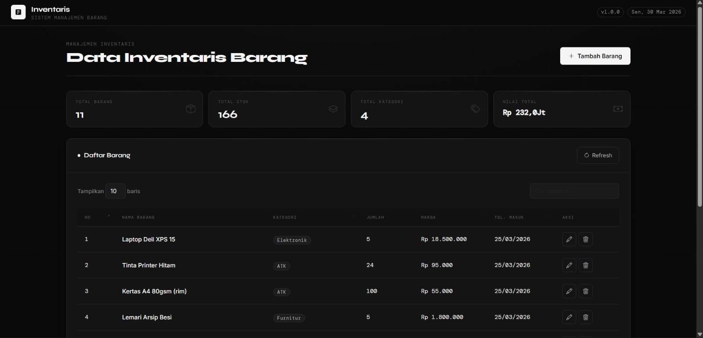
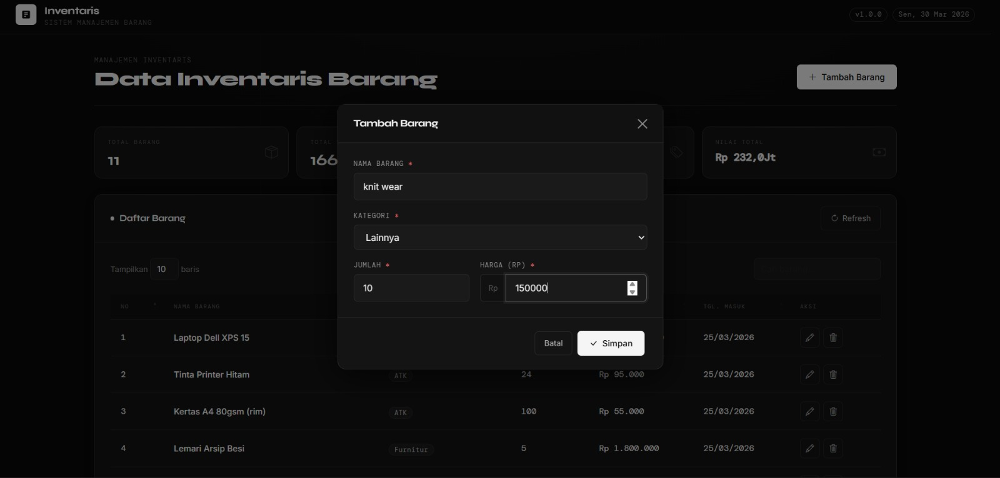
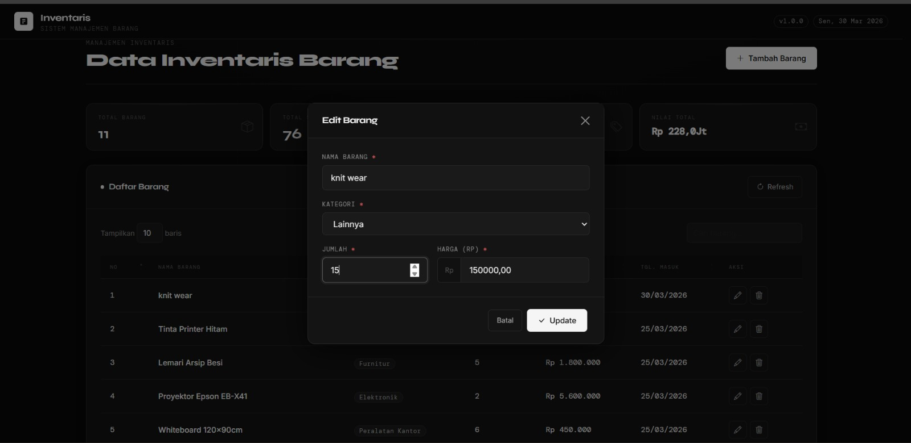
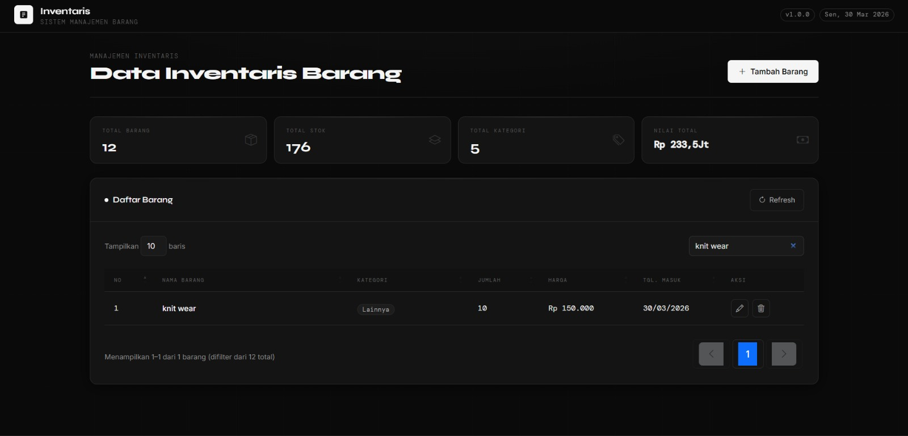
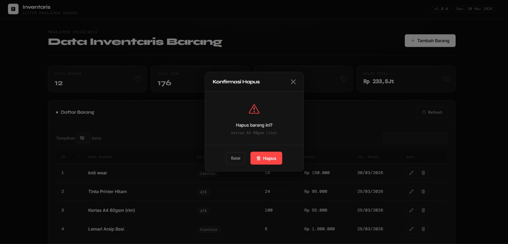

<div align="center">
  <br />
  <h1>LAPORAN PRAKTIKUM <br>APLIKASI BERBASIS PLATFORM</h1>
  <br />
  <h2> TUGAS COTS 2 <br> DATA PRODUK MENGGUNAKAN FRAMEWORK NODE JS EXPRESS </h2>
  <br />
  <br />
   
  <br />
  <br />
  <br />
  <h3>Disusun Oleh :</h3>
  <p>
    <strong>Rafaldo Al Maqdis</strong><br>
    <strong>2311102099</strong><br>
    <strong>S1 IF-11-REG 01</strong>
  </p>
  <br />
  <h3>Dosen Pengampu :</h3>
  <p>
    <strong>Dimas Fanny Hebrasianto Permadi, S.ST., M.Kom</strong>
  </p>
  <br />
  <br />
    <h4>Asisten Praktikum :</h4>
    <strong> Apri Pandu Wicaksono </strong> <br>
    <strong>Rangga Pradarrell Fathi</strong>
  <br />
  <h2>LABORATORIUM HIGH PERFORMANCE
 <br>FAKULTAS INFORMATIKA <br>UNIVERSITAS TELKOM PURWOKERTO <br>2026</h2>
</div>

---


# 📦 Aplikasi Inventaris Barang (CodeIgniter 4)

---

# 1. Dasar Teori

## CRUD (Create, Read, Update, Delete)

CRUD adalah konsep dasar dalam pengelolaan data yang terdiri dari:

* **Create** → Menambah data barang baru
* **Read** → Menampilkan data barang
* **Update** → Mengubah data barang
* **Delete** → Menghapus data barang

Konsep CRUD digunakan agar interaksi antara pengguna dan sistem database berjalan secara fleksibel dan terstruktur.

---

## CodeIgniter 4

CodeIgniter 4 adalah framework PHP berbasis **MVC (Model View Controller)** yang digunakan untuk membangun aplikasi web dengan struktur kode yang rapi dan terorganisir.

MVC terdiri dari:

* **Model** → Mengatur database
* **View** → Tampilan aplikasi
* **Controller** → Logika aplikasi

Framework ini membantu mempercepat pengembangan aplikasi web.

---

## Bootstrap

Bootstrap adalah framework CSS yang digunakan untuk membuat tampilan web menjadi **responsif dan rapi**.

Digunakan untuk:

* Button
* Form
* Modal
* Layout
* Dashboard

Sehingga tampilan aplikasi terlihat modern.

---

## jQuery

jQuery adalah library JavaScript yang digunakan untuk:

* Mengatur event klik
* Mengambil data form
* Mengirim AJAX
* Manipulasi HTML

Membuat interaksi aplikasi lebih mudah.

---

## DataTables

DataTables adalah plugin jQuery yang digunakan untuk membuat tabel interaktif.

Fitur:

* Search
* Pagination
* Sorting
* AJAX
* JSON

Digunakan untuk menampilkan data barang.

---

## MySQL

MySQL adalah database yang digunakan untuk menyimpan data barang.

Digunakan untuk:

* Menyimpan nama barang
* Kategori
* Jumlah
* Harga
* Waktu dibuat

---

## AJAX (Asynchronous JavaScript and XML)

AJAX adalah teknik untuk mengambil data dari server tanpa reload halaman.

Digunakan untuk:

* Tambah barang
* Edit barang
* Hapus barang
* Tampil data

Sehingga aplikasi berjalan secara **real-time**.

---

# 2. Deskripsi Aplikasi

Aplikasi **Inventaris Barang** adalah aplikasi web berbasis **CodeIgniter 4** yang digunakan untuk mengelola data barang secara real-time.

Aplikasi ini menggunakan:

* CodeIgniter 4 sebagai backend
* Bootstrap sebagai tampilan
* jQuery dan DataTables sebagai interaksi
* MySQL sebagai database
* AJAX sebagai komunikasi data

---

## Halaman Utama

### Dashboard

Menampilkan:

* Total barang
* Total stok
* Total kategori
* Total nilai inventaris

---

### Tabel Barang

Menampilkan data barang dalam bentuk tabel interaktif.

Fitur:

* Search
* Pagination
* Sorting
* Tambah
* Edit
* Hapus

---

## Fitur Utama

### Create

Menambah barang baru

### Read

Menampilkan data barang

### Update

Mengubah data barang

### Delete

Menghapus data barang

---

# 3. Struktur Folder Project

```
app/
 ├── Config/
 │     └── Routes.php
 │
 ├── Controllers/
 │     └── Barang.php
 │
 ├── Models/
 │     └── BarangModel.php
 │
 ├── Views/
 │     └── barang/
 │           └── index.php
 │
 └── Database/
       └── database.sql
```

---

## Penjelasan Struktur

### Routes.php

Mengatur URL aplikasi.

### Barang.php

Mengatur logika CRUD.

### BarangModel.php

Mengatur database.

### index.php

Menampilkan tampilan aplikasi.

### database.sql

Menyimpan struktur database.

---

# 4. Cara Menjalankan Aplikasi

## 1. Install CodeIgniter 4

```
composer create-project codeigniter4/appstarter inventaris
```

---

## 2. Import Database

Buka phpMyAdmin

Import file:

```
database.sql
```

---

## 3. Atur Database

File:

```
.env
```

Isi:

```
database.default.hostname = localhost
database.default.database = inventaris_barang
database.default.username = root
database.default.password = 
database.default.DBDriver = MySQLi
```

---

## 4. Jalankan Server

```
php spark serve
```

---

## 5. Buka Browser

```
http://localhost:8080/barang
```

---

# 5. Kode Program

---

# A. Routes.php

```php
$routes->get('/', 'Barang::index');
$routes->get('barang', 'Barang::index');
$routes->get('barang/getData', 'Barang::getData');
$routes->post('barang/store', 'Barang::store');
$routes->get('barang/edit/(:num)', 'Barang::edit/$1');
$routes->post('barang/update', 'Barang::update');
$routes->post('barang/delete', 'Barang::delete');
```

## Penjelasan

Routes berfungsi untuk mengatur jalur URL aplikasi.

* `/` → membuka halaman utama
* `/barang` → menampilkan halaman barang
* `/barang/getData` → mengambil data barang
* `/barang/store` → menyimpan data
* `/barang/edit` → mengambil data berdasarkan ID
* `/barang/update` → update data
* `/barang/delete` → hapus data

---

# B. Barang.php (Controller)

Controller berfungsi sebagai pengatur logika aplikasi.

## index()

Menampilkan halaman utama.

## getData()

Mengambil data barang dari database dan mengirim JSON ke DataTables.

## store()

Menyimpan data barang baru ke database.

## update()

Mengubah data barang.

## delete()

Menghapus data barang.

---

# C. BarangModel.php (Model)

Model berfungsi untuk berkomunikasi dengan database.

## Table

```
protected $table = 'barang';
```

Menentukan tabel barang.

---

## Allowed Fields

```
nama_barang
kategori
jumlah
harga
```

Menentukan field yang boleh masuk database.

---

## Validation

Nama barang wajib diisi.
Jumlah tidak boleh negatif.
Harga harus angka.

---

# D. index.php (View)

View berfungsi menampilkan tampilan.

## DataTables

Mengambil data dari controller.

## Modal Tambah

Menampilkan form tambah barang.

## AJAX

Mengirim data ke controller.

## Toast

Menampilkan notifikasi.

---

# E. database.sql

## Database

```
inventaris_barang
```

## Tabel

```
barang
```

Field:

* id
* nama_barang
* kategori
* jumlah
* harga
* created_at
* updated_at

---

# 6. Alur CRUD Aplikasi

## Create

Form → AJAX → Controller → Model → Database → Tabel update

---

## Read

Browser → Controller → Model → Database → JSON → DataTables

---

## Update

Klik edit → Ambil ID → Form → AJAX → Controller → Database → Update

---

## Delete

Klik hapus → Konfirmasi → AJAX → Controller → Database → Hapus

---

## Hasil screenshoot Aplikasi

### 1. Dashboard


### 2. tambah barang


### 3. edit barang


### 4. search barang


### 5. hapus barang



## Referensi

1. [https://codeigniter.com/user_guide/]

2. [https://getbootstrap.com/docs/5.0/getting-started/introduction/]

3. [https://api.jquery.com/]

4. [https://datatables.net/manual/]
5. [https://dev.mysql.com/doc/]

6. [https://developer.mozilla.org/en-US/docs/Web/Guide/AJAX]

7. [https://www.php.net/docs.php]

8. [https://www.geeksforgeeks.org/mvc-design-pattern/]

9. [https://restfulapi.net/]

 ---

 ## Link video
 [https://drive.google.com/drive/folders/1WiFQ5rC4GsYhJk8RptTq6_Ke_H0FNyqJ?usp=sharing]