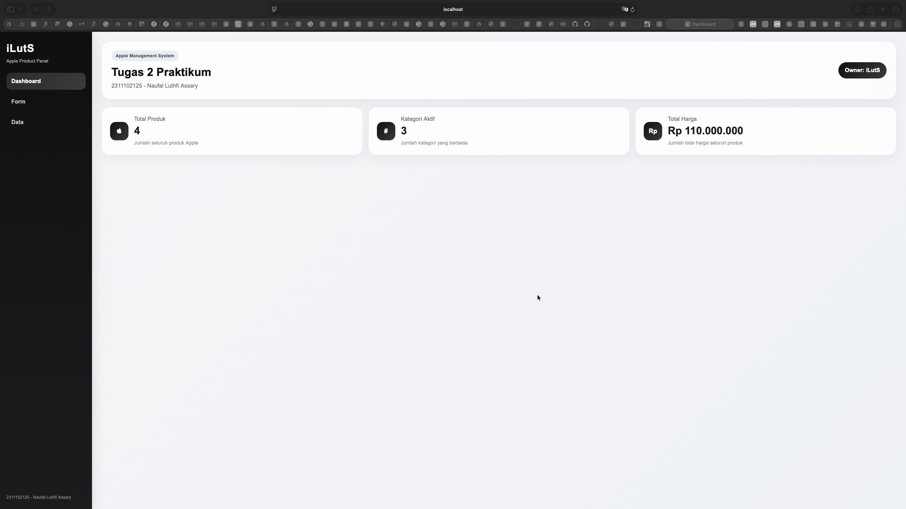
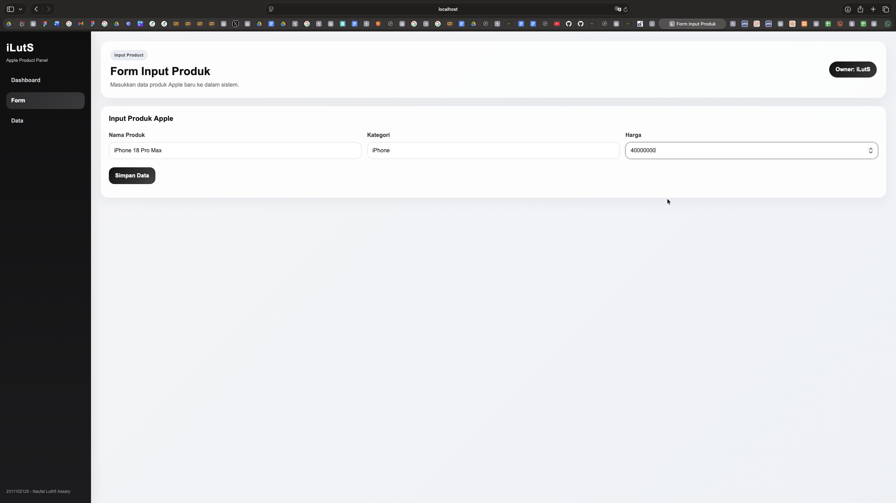
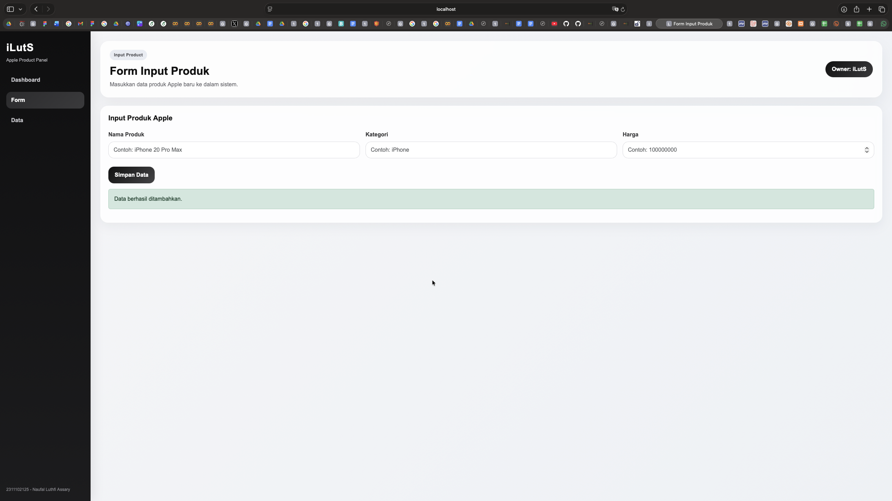
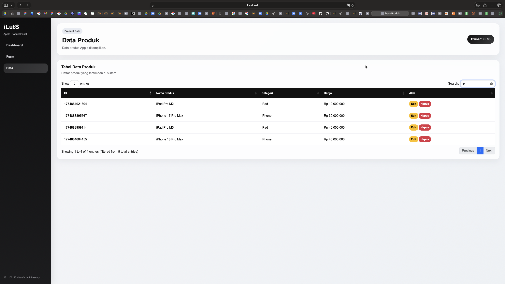
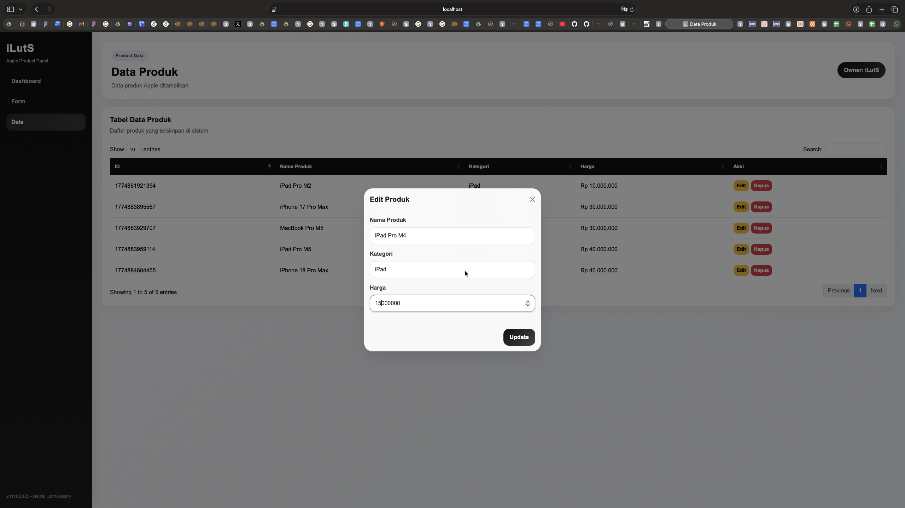
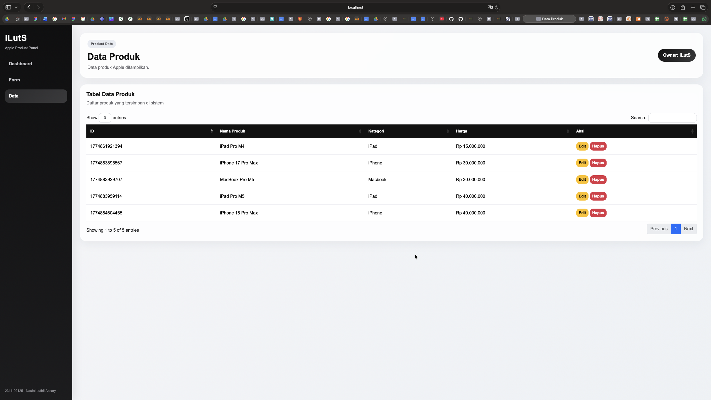
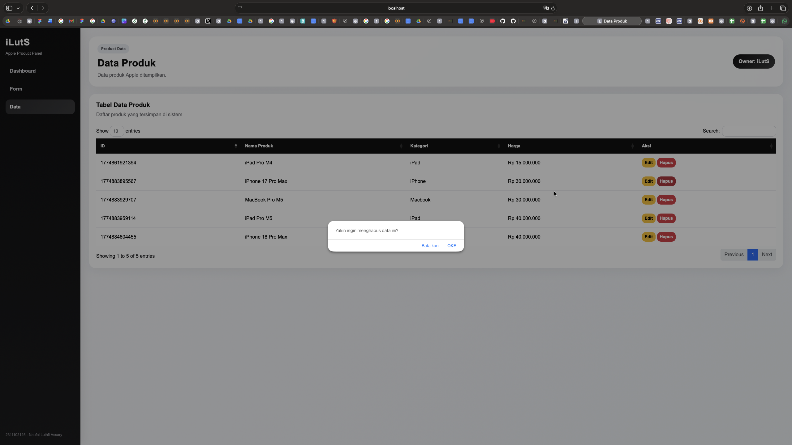
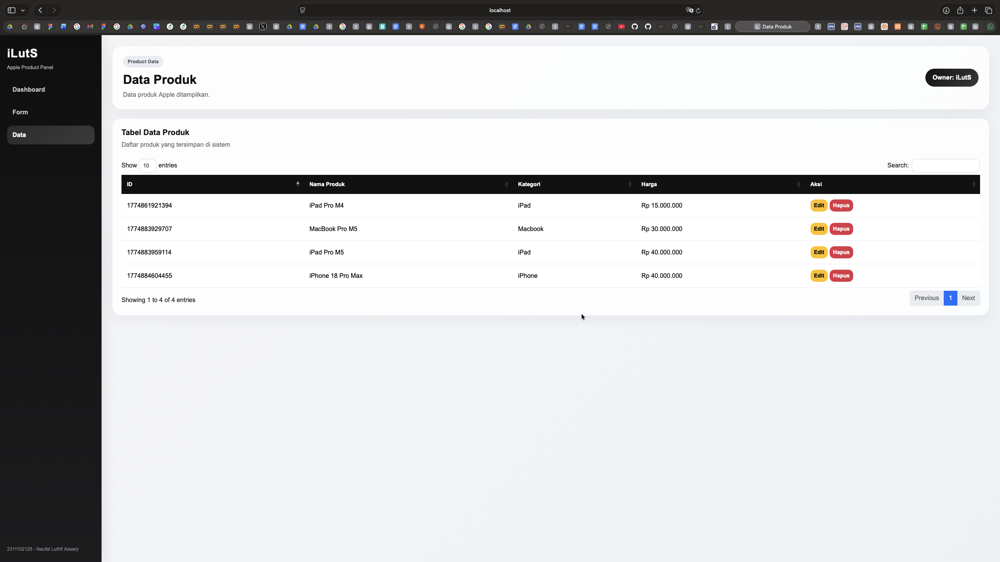

<div align="center">
  <br />
  <h1>LAPORAN PRAKTIKUM <br>APLIKASI BERBASIS PLATFORM</h1>
  <br />
  <h3>Tugas COTS 2 <br> Node.js & Express.js</h3>
  <br />
  <br />
   
  <br />
  <br />
  <br />
  <br />
  <h3>Disusun Oleh :</h3>
  <p>
    <strong>NAUFAL LUTHFI ASSARY</strong><br>
    <strong>2311102125</strong><br>
    <strong>S1 IF-11-REG01</strong>
  </p>
  <br />
  <h3>Dosen Pengampu :</h3>
  <p>
    <strong>Dimas Fanny Hebrasianto Permadi, S.ST., M.Kom</strong>
  </p>
  <br />
  <br />
    <h4>Asisten Praktikum :</h4>
    <strong> Apri Pandu Wicaksono </strong> <br>
    <strong>Rangga Pradarrell Fathi</strong>
  <br />
  <h3>LABORATORIUM HIGH PERFORMANCE
 <br>FAKULTAS INFORMATIKA <br>UNIVERSITAS TELKOM PURWOKERTO <br>2026</h3>
</div>

---

## 1. Dasar Teori

1. Aplikasi Web
Aplikasi web adalah perangkat lunak yang dijalankan melalui browser dan diakses menggunakan jaringan internet atau jaringan lokal. Berbeda dengan aplikasi desktop, aplikasi web tidak memerlukan instalasi khusus pada perangkat pengguna karena seluruh proses dijalankan melalui server dan browser. Aplikasi web banyak digunakan karena mudah diakses, fleksibel, dan dapat dikembangkan untuk berbagai kebutuhan, termasuk pengelolaan data.

2. **NodeJS** adalah runtime environment yang digunakan untuk menjalankan JavaScript di sisi server. NodeJS memungkinkan JavaScript, yang awalnya hanya berjalan di browser, dapat digunakan untuk membangun aplikasi backend. NodeJS bersifat event-driven dan non-blocking, sehingga cocok digunakan untuk aplikasi web yang membutuhkan proses input-output secara efisien.

3. **Express.js** adalah framework backend berbasis NodeJS yang digunakan untuk mempermudah pembangunan aplikasi web dan API. Express menyediakan fitur routing, middleware, manajemen request dan response, serta integrasi yang mudah dengan template engine.

Pada aplikasi ini, Express digunakan untuk:
- menampilkan halaman dashboard,
- menampilkan halaman form input,
- menampilkan halaman data produk,
- membuat endpoint API berbentuk JSON,
- menangani operasi Create, Read, Update, dan Delete.

4. **HTML** (*HyperText Markup Language*) adalah bahasa markup yang digunakan untuk menyusun struktur dasar halaman web. HTML berfungsi untuk menentukan elemen apa saja yang tampil pada halaman, seperti judul, paragraf, form, tabel, tombol, dan layout.

Dalam aplikasi ini, HTML digunakan melalui template **EJS** untuk membangun:
- sidebar navigasi,
- dashboard,
- form input produk,
- tabel data produk,
- modal edit,
- dan elemen visual lainnya.

5. **CSS** (*Cascading Style Sheets*) adalah bahasa yang digunakan untuk mengatur tampilan visual halaman web. CSS berfungsi mengatur warna, ukuran teks, tata letak, jarak, efek visual, dan berbagai komponen agar halaman terlihat lebih menarik dan nyaman digunakan.

Pada praktikum ini, CSS digunakan untuk:
- mengatur layout halaman,
- memperindah sidebar,
- mempercantik card dashboard,
- menyesuaikan tampilan form dan tabel,
- serta membangun tema bergaya modern seperti dashboard Apple style.

6. **Bootstrap** adalah framework CSS yang menyediakan kumpulan class siap pakai untuk membangun antarmuka web secara cepat, modern, dan responsif. Bootstrap memiliki banyak komponen bawaan seperti grid system, button, form, table, modal, navbar, dan utility classes.

Keunggulan Bootstrap:
- mempercepat pembuatan tampilan,
- mendukung desain responsif,
- memiliki struktur yang konsisten,
- mudah dikombinasikan dengan JavaScript dan jQuery.

Dalam aplikasi ini, Bootstrap digunakan untuk:
- styling form,
- styling tabel,
- modal popup edit,
- layout grid,
- dan berbagai elemen antarmuka lainnya.

7. **jQuery** adalah library JavaScript yang digunakan untuk mempermudah manipulasi DOM, event handling, animasi, dan AJAX. Dibandingkan JavaScript murni, jQuery memberikan sintaks yang lebih singkat dan sederhana.

Pada aplikasi ini, jQuery digunakan untuk:
- menangani submit form,
- mengambil nilai input,
- memanggil endpoint API,
- menampilkan data ke tabel,
- menangani tombol edit dan hapus,
- serta bekerja sama dengan plugin DataTables.

8. **DataTables** adalah plugin jQuery yang digunakan untuk membuat tabel HTML menjadi lebih interaktif. Plugin ini menambahkan fitur-fitur penting seperti:
- pencarian data (*search*),
- pagination,
- pengurutan data,
- pengaturan jumlah data per halaman.

9. **JSON** (*JavaScript Object Notation*) adalah format pertukaran data yang ringan, mudah dibaca, dan mudah diproses oleh manusia maupun mesin. JSON banyak digunakan dalam aplikasi web untuk mengirim dan menerima data antara client dan server.

Contoh struktur data JSON:
```json
  {
    "id": 1774861921394,
    "namaProduk": "iPad Pro M4",
    "kategori": "iPad",
    "harga": 15000000
  },
---

## 2. Penjelasan Kode 

Berikut merupakan implementasi Manajemen Produk dengan menggunakan HTML, JavaScript, CSS.

### Kode (`app.js`)

```js
const express = require("express");
const fs = require("fs");
const path = require("path");

const app = express();
const PORT = 3000;
const dataFile = path.join(__dirname, "data", "products.json");

app.set("view engine", "ejs");
app.set("views", path.join(__dirname, "views"));

app.use(express.urlencoded({ extended: true }));
app.use(express.json());
app.use(express.static(path.join(__dirname, "public")));

function readProducts() {
  try {
    const data = fs.readFileSync(dataFile, "utf8");
    return JSON.parse(data);
  } catch (error) {
    return [];
  }
}

function writeProducts(products) {
  fs.writeFileSync(dataFile, JSON.stringify(products, null, 2), "utf8");
}

function getSummary(products) {
  const totalProduk = products.length;
  const totalHarga = products.reduce((sum, item) => sum + Number(item.harga), 0);
  const kategoriAktif = new Set(products.map((item) => item.kategori.toLowerCase())).size;

  return {
    totalProduk,
    totalHarga,
    kategoriAktif
  };
}

// HALAMAN
app.get("/", (req, res) => {
  const products = readProducts();
  const summary = getSummary(products);
  res.render("dashboard", { title: "Dashboard", summary });
});

app.get("/form", (req, res) => {
  res.render("form", { title: "Form Input Produk" });
});

app.get("/data", (req, res) => {
  res.render("data", { title: "Data Produk" });
});

// API JSON
app.get("/api/products", (req, res) => {
  const products = readProducts();
  res.json({ data: products });
});

app.get("/api/products/:id", (req, res) => {
  const id = Number(req.params.id);
  const products = readProducts();
  const product = products.find((item) => item.id === id);

  if (!product) {
    return res.status(404).json({ message: "Data tidak ditemukan." });
  }

  res.json(product);
});

app.post("/api/products", (req, res) => {
  const { namaProduk, kategori, harga } = req.body;

  if (!namaProduk || !kategori || !harga) {
    return res.status(400).json({ message: "Semua field wajib diisi." });
  }

  const products = readProducts();
  const newProduct = {
    id: Date.now(),
    namaProduk,
    kategori,
    harga: Number(harga)
  };

  products.push(newProduct);
  writeProducts(products);

  res.json({ message: "Data berhasil ditambahkan.", product: newProduct });
});

app.put("/api/products/:id", (req, res) => {
  const id = Number(req.params.id);
  const { namaProduk, kategori, harga } = req.body;

  const products = readProducts();
  const index = products.findIndex((item) => item.id === id);

  if (index === -1) {
    return res.status(404).json({ message: "Data tidak ditemukan." });
  }

  products[index] = {
    id,
    namaProduk,
    kategori,
    harga: Number(harga)
  };

  writeProducts(products);
  res.json({ message: "Data berhasil diupdate." });
});

app.delete("/api/products/:id", (req, res) => {
  const id = Number(req.params.id);
  const products = readProducts();
  const filteredProducts = products.filter((item) => item.id !== id);

  if (filteredProducts.length === products.length) {
    return res.status(404).json({ message: "Data tidak ditemukan." });
  }

  writeProducts(filteredProducts);
  res.json({ message: "Data berhasil dihapus." });
});

app.listen(PORT, () => {
  console.log(`Server berjalan di http://localhost:${PORT}`);
});
```
Penjelasan Kode:

Kode Express.js CRUD Produk

- `const express = require("express");` digunakan untuk memanggil framework **Express.js** yang berfungsi membuat server dan mengatur routing.
- `const fs = require("fs");` digunakan untuk mengakses modul **File System** agar program dapat membaca dan menulis file.
- `const path = require("path");` digunakan untuk mengatur path file dan folder agar lebih aman dan rapi.

- `const app = express();` digunakan untuk membuat instance aplikasi Express.
- `const PORT = 3000;` digunakan untuk menentukan port server, yaitu **3000**.
- `const dataFile = path.join(__dirname, "data", "products.json");` digunakan untuk menentukan lokasi file `products.json` sebagai tempat penyimpanan data produk.

- `app.set("view engine", "ejs");` digunakan untuk mengatur **EJS** sebagai template engine.
- `app.set("views", path.join(__dirname, "views"));` digunakan untuk menentukan folder `views` sebagai lokasi file tampilan.

- `app.use(express.urlencoded({ extended: true }));` digunakan untuk membaca data yang dikirim dari form HTML.
- `app.use(express.json());` digunakan untuk membaca data yang dikirim dalam format JSON.
- `app.use(express.static(path.join(__dirname, "public")));` digunakan agar file statis seperti CSS, JavaScript, dan gambar dalam folder `public` dapat diakses.

Fungsi Utama

- `readProducts()` berfungsi untuk membaca data produk dari file JSON.
  - `fs.readFileSync(dataFile, "utf8")` membaca isi file.
  - `JSON.parse(data)` mengubah isi file JSON menjadi array/object JavaScript.
  - `catch` digunakan untuk menangani error, dan jika terjadi error fungsi akan mengembalikan array kosong `[]`.

- `writeProducts(products)` berfungsi untuk menyimpan data produk ke file JSON.
  - `JSON.stringify(products, null, 2)` digunakan untuk mengubah data menjadi format JSON yang rapi.
  - `fs.writeFileSync(...)` digunakan untuk menulis data ke file.

- `getSummary(products)` berfungsi untuk menghitung ringkasan data produk.
  - `totalProduk` menghitung jumlah seluruh produk.
  - `totalHarga` menjumlahkan semua harga produk dengan `reduce()`.
  - `kategoriAktif` menghitung jumlah kategori unik menggunakan `Set`.

Routing Halaman

- `app.get("/", ...)` digunakan untuk menampilkan halaman dashboard.
  - Program membaca data produk.
  - Program menghitung ringkasan data.
  - Hasilnya dikirim ke file `dashboard.ejs`.

- `app.get("/form", ...)` digunakan untuk menampilkan halaman form input produk.

- `app.get("/data", ...)` digunakan untuk menampilkan halaman data produk.

API JSON

- `app.get("/api/products", ...)` digunakan untuk menampilkan seluruh data produk dalam format JSON.

- `app.get("/api/products/:id", ...)` digunakan untuk menampilkan satu data produk berdasarkan ID.
  - `req.params.id` mengambil ID dari URL.
  - `find()` digunakan untuk mencari produk yang sesuai.
  - Jika data tidak ditemukan, server mengirim status `404`.

- `app.post("/api/products", ...)` digunakan untuk menambahkan data produk baru.
  - `req.body` mengambil data `namaProduk`, `kategori`, dan `harga`.
  - Program melakukan validasi agar semua field terisi.
  - `Date.now()` digunakan untuk membuat ID unik.
  - Data baru ditambahkan ke array produk lalu disimpan ke file JSON.

- `app.put("/api/products/:id", ...)` digunakan untuk memperbarui data produk berdasarkan ID.
  - `findIndex()` digunakan untuk mencari posisi data dalam array.
  - Jika data ditemukan, produk lama diganti dengan data baru.
  - Jika tidak ditemukan, server mengirim status `404`.

- `app.delete("/api/products/:id", ...)` digunakan untuk menghapus data produk berdasarkan ID.
  - `filter()` digunakan untuk membuat array baru tanpa produk yang dihapus.
  - Jika jumlah data tetap sama, berarti data tidak ditemukan.
  - Jika berhasil, data baru disimpan kembali ke file JSON.

Menjalankan Server

- `app.listen(PORT, ...)` digunakan untuk menjalankan server pada port 3000.
- `console.log(...)` menampilkan pesan bahwa server telah berjalan di `http://localhost:3000`.

### Kode (`dashboard.ejs`)

```ejs
<%- include('partials/header') %>

<div class="topbar">
  <div>
    <span class="topbar-label">Apple Management System</span>
    <h1 class="page-title">Tugas COTS 2 Aplikasi Berbasis Platform</h1>
    <p class="page-subtitle">2311102125 - Naufal Luthfi Assary</p>
  </div>
  <div class="owner-pill">Owner: iLutS</div>
</div>

<div class="stats-grid">
  <div class="stats-card">
    <div class="stats-icon"></div>
    <div>
      <h6>Total Produk</h6>
      <h3><%= summary.totalProduk %></h3>
      <p>Jumlah seluruh produk Apple</p>
    </div>
  </div>

  <div class="stats-card">
    <div class="stats-icon">#</div>
    <div>
      <h6>Kategori Aktif</h6>
      <h3><%= summary.kategoriAktif %></h3>
      <p>Jumlah kategori yang berbeda</p>
    </div>
  </div>

  <div class="stats-card">
    <div class="stats-icon">Rp</div>
    <div>
      <h6>Total Harga</h6>
      <h3>Rp <%= Number(summary.totalHarga).toLocaleString('id-ID') %></h3>
      <p>Jumlah total harga seluruh produk</p>
    </div>
  </div>
</div>

<%- include('partials/footer') %>
```
Penjelasan Kode:

Kode Dashboard EJS

- `<%- include('partials/header') %>` digunakan untuk memanggil file `header.ejs` agar bagian awal halaman, seperti struktur HTML, head, dan navigasi, dapat digunakan kembali tanpa menulis kode yang sama berulang kali.

- Bagian `<div class="topbar">` berfungsi sebagai header utama pada halaman dashboard.

- `<span class="topbar-label">Apple Management System</span>` menampilkan label atau nama sistem.

- `<h1 class="page-title">Tugas COTS 2 Aplikasi Berbasis Platform</h1>` menampilkan judul utama halaman.

- `<p class="page-subtitle">2311102125 - Naufal Luthfi Assary</p>` menampilkan subtitle berupa NIM dan nama praktikan.

- `<div class="owner-pill">Owner: iLutS</div>` digunakan untuk menampilkan informasi pemilik atau identitas tambahan pada dashboard.

- `<div class="stats-grid">` berfungsi sebagai wadah utama untuk menampilkan beberapa kartu statistik dalam bentuk grid.

Kartu Statistik

- Kartu statistik pertama menampilkan **Total Produk**.
  - `<h6>Total Produk</h6>` menampilkan judul statistik.
  - `<h3><%= summary.totalProduk %></h3>` menampilkan jumlah seluruh produk dari variabel `summary.totalProduk`.
  - `<p>Jumlah seluruh produk Apple</p>` memberikan keterangan isi data.

- Kartu statistik kedua menampilkan **Kategori Aktif**.
  - `<h6>Kategori Aktif</h6>` menampilkan judul statistik.
  - `<h3><%= summary.kategoriAktif %></h3>` menampilkan jumlah kategori berbeda dari variabel `summary.kategoriAktif`.
  - `<p>Jumlah kategori yang berbeda</p>` memberikan penjelasan data.

- Kartu statistik ketiga menampilkan **Total Harga**.
  - `<h6>Total Harga</h6>` menampilkan judul statistik.
  - `<h3>Rp <%= Number(summary.totalHarga).toLocaleString('id-ID') %></h3>` menampilkan total harga seluruh produk dalam format rupiah.
  - `Number(summary.totalHarga)` mengubah nilai menjadi tipe angka.
  - `.toLocaleString('id-ID')` digunakan untuk memformat angka sesuai format Indonesia, misalnya `1.000.000`.
  - `<p>Jumlah total harga seluruh produk</p>` memberikan keterangan isi data.

Sintaks EJS

- `<%= ... %>` digunakan untuk menampilkan data dari server ke halaman HTML.
- Data `summary.totalProduk`, `summary.kategoriAktif`, dan `summary.totalHarga` dikirim dari backend ke file EJS saat halaman dirender.
- `<%- include('partials/footer') %>` digunakan untuk memanggil file `footer.ejs` sebagai penutup halaman agar struktur kode lebih rapi dan modular.

### Kode (`data.ejs`)

```ejs
<%- include('partials/header') %>

<div class="topbar">
  <div>
    <span class="topbar-label">Product Data</span>
    <h1 class="page-title">Data Produk</h1>
    <p class="page-subtitle">Data produk Apple ditampilkan.</p>
  </div>
  <div class="owner-pill">Owner: iLutS</div>
</div>

<div class="content-card">
  <div class="d-flex justify-content-between align-items-center flex-wrap gap-2 mb-4">
    <div>
      <h5 class="mb-1">Tabel Data Produk</h5>
      <p class="page-subtitle mb-0">Daftar produk yang tersimpan di sistem</p>
    </div>
  </div>

  <table id="productTable" class="table custom-table align-middle w-100">
    <thead>
      <tr>
        <th>ID</th>
        <th>Nama Produk</th>
        <th>Kategori</th>
        <th>Harga</th>
        <th>Aksi</th>
      </tr>
    </thead>
    <tbody></tbody>
  </table>
</div>

<div class="modal fade" id="editModal" tabindex="-1">
  <div class="modal-dialog modal-dialog-centered">
    <div class="modal-content modal-apple">
      <form id="editForm">
        <div class="modal-header border-0">
          <h5 class="modal-title fw-bold">Edit Produk</h5>
          <button type="button" class="btn-close" data-bs-dismiss="modal"></button>
        </div>

        <div class="modal-body">
          <input type="hidden" id="editId" />

          <div class="mb-3">
            <label class="form-label">Nama Produk</label>
            <input type="text" id="editNamaProduk" class="form-control custom-input" required />
          </div>

          <div class="mb-3">
            <label class="form-label">Kategori</label>
            <input type="text" id="editKategori" class="form-control custom-input" required />
          </div>

          <div class="mb-3">
            <label class="form-label">Harga</label>
            <input type="number" id="editHarga" class="form-control custom-input" required />
          </div>
        </div>

        <div class="modal-footer border-0">
          <button type="submit" class="btn btn-save">Update</button>
        </div>
      </form>
    </div>
  </div>
</div>

<%- include('partials/footer') %>
```
Penjelasan Kode:

Kode Halaman Data Produk

- `<%- include('partials/header') %>` digunakan untuk memanggil file `header.ejs` agar bagian awal halaman, seperti struktur HTML, navbar, atau style, dapat digunakan kembali.

- `<div class="topbar">` berfungsi sebagai bagian header utama pada halaman data produk.

- `<span class="topbar-label">Product Data</span>` digunakan untuk menampilkan label halaman.

- `<h1 class="page-title">Data Produk</h1>` digunakan untuk menampilkan judul utama halaman.

- `<p class="page-subtitle">Data produk Apple ditampilkan.</p>` digunakan untuk menampilkan deskripsi singkat halaman.

- `<div class="owner-pill">Owner: iLutS</div>` digunakan untuk menampilkan informasi pemilik atau identitas dashboard.

Bagian Konten Utama

- `<div class="content-card">` digunakan sebagai wadah utama untuk isi halaman, yaitu tabel data produk.

- `<div class="d-flex justify-content-between align-items-center flex-wrap gap-2 mb-4">` digunakan untuk mengatur tata letak judul tabel agar rapi dengan bantuan class Bootstrap.

- `<h5 class="mb-1">Tabel Data Produk</h5>` digunakan untuk menampilkan judul bagian tabel.

- `<p class="page-subtitle mb-0">Daftar produk yang tersimpan di sistem</p>` digunakan untuk menampilkan keterangan isi tabel.

Tabel Data Produk

- `<table id="productTable" class="table custom-table align-middle w-100">` digunakan untuk membuat tabel data produk.
- `id="productTable"` berfungsi sebagai penanda tabel agar dapat diakses dengan JavaScript.
- `class="table custom-table align-middle w-100"` digunakan untuk memberikan style tabel agar tampil rapi dan lebar penuh.

- `<thead>` digunakan untuk bagian kepala tabel.
- `<tr>` digunakan untuk membuat baris pada tabel.
- `<th>ID</th>` menampilkan kolom ID produk.
- `<th>Nama Produk</th>` menampilkan kolom nama produk.
- `<th>Kategori</th>` menampilkan kolom kategori produk.
- `<th>Harga</th>` menampilkan kolom harga produk.
- `<th>Aksi</th>` menampilkan kolom aksi, misalnya tombol edit atau hapus.

- `<tbody></tbody>` digunakan sebagai tempat data produk ditampilkan secara dinamis, biasanya melalui JavaScript dari API.

Modal Edit Produk

- `<div class="modal fade" id="editModal" tabindex="-1">` digunakan untuk membuat modal popup edit produk dengan Bootstrap.
- `id="editModal"` digunakan sebagai penanda modal agar dapat dipanggil melalui JavaScript.

- `<div class="modal-dialog modal-dialog-centered">` digunakan untuk mengatur posisi modal agar tampil di tengah layar.

- `<div class="modal-content modal-apple">` digunakan sebagai isi utama modal dengan tambahan class custom untuk tampilan khusus.

- `<form id="editForm">` digunakan sebagai form untuk mengedit data produk.
- `id="editForm"` memudahkan JavaScript dalam menangani proses submit form edit.

Bagian Header Modal

- `<h5 class="modal-title fw-bold">Edit Produk</h5>` digunakan untuk menampilkan judul modal.

- `<button type="button" class="btn-close" data-bs-dismiss="modal"></button>` digunakan untuk menutup modal.

Bagian Body Modal

- `<input type="hidden" id="editId" />` digunakan untuk menyimpan ID produk yang sedang diedit tanpa ditampilkan ke pengguna.

- Input `Nama Produk`
  - `<input type="text" id="editNamaProduk" ... required />` digunakan untuk mengisi atau mengubah nama produk.
  - `required` berarti field wajib diisi.

- Input `Kategori`
  - `<input type="text" id="editKategori" ... required />` digunakan untuk mengisi atau mengubah kategori produk.

- Input `Harga`
  - `<input type="number" id="editHarga" ... required />` digunakan untuk mengisi atau mengubah harga produk.
  - `type="number"` membatasi input agar berupa angka.

Bagian Footer Modal

- `<button type="submit" class="btn btn-save">Update</button>` digunakan sebagai tombol untuk menyimpan perubahan data produk.

Penutup Halaman

- `<%- include('partials/footer') %>` digunakan untuk memanggil file `footer.ejs` sebagai bagian penutup halaman.

### Kode (`form.ejs`)

```ejs
<%- include('partials/header') %>

<div class="topbar">
  <div>
    <span class="topbar-label">Input Product</span>
    <h1 class="page-title">Form Input Produk</h1>
    <p class="page-subtitle">Masukkan data produk Apple baru ke dalam sistem.</p>
  </div>
  <div class="owner-pill">Owner: iLutS</div>
</div>

<div class="content-card">
  <h5 class="mb-4">Input Produk Apple</h5>

  <form id="productForm">
    <div class="row g-3">
      <div class="col-md-4">
        <label class="form-label">Nama Produk</label>
        <input type="text" id="namaProduk" class="form-control custom-input" placeholder="Contoh: iPhone 20 Pro Max" required />
      </div>

      <div class="col-md-4">
        <label class="form-label">Kategori</label>
        <input type="text" id="kategori" class="form-control custom-input" placeholder="Contoh: iPhone" required />
      </div>

      <div class="col-md-4">
        <label class="form-label">Harga</label>
        <input type="number" id="harga" class="form-control custom-input" placeholder="Contoh: 100000000" min="0" required />
      </div>
    </div>

    <div class="mt-4">
      <button type="submit" class="btn btn-save">Simpan Data</button>
    </div>
  </form>

  <div id="formMessage" class="mt-3"></div>
</div>

<%- include('partials/footer') %>
```

Penjelasan Kode:

Kode Form Input Produk

- `<%- include('partials/header') %>` digunakan untuk memanggil file `header.ejs` agar bagian awal halaman, seperti struktur HTML, style, dan navigasi, dapat digunakan kembali.

- `<div class="topbar">` berfungsi sebagai header utama pada halaman form input produk.

- `<span class="topbar-label">Input Product</span>` digunakan untuk menampilkan label halaman.

- `<h1 class="page-title">Form Input Produk</h1>` digunakan untuk menampilkan judul utama halaman.

- `<p class="page-subtitle">Masukkan data produk Apple baru ke dalam sistem.</p>` digunakan untuk menampilkan deskripsi singkat tentang fungsi halaman.

- `<div class="owner-pill">Owner: iLutS</div>` digunakan untuk menampilkan identitas pemilik atau pembuat dashboard.

Bagian Form Input

- `<div class="content-card">` digunakan sebagai wadah utama untuk form input produk.

- `<h5 class="mb-4">Input Produk Apple</h5>` digunakan untuk menampilkan judul bagian form.

- `<form id="productForm">` digunakan untuk membuat form input data produk.
- `id="productForm"` berfungsi sebagai penanda form agar dapat diproses dengan JavaScript.

Input Data Produk

- `<div class="row g-3">` digunakan untuk mengatur tata letak input dalam bentuk baris dengan jarak antar elemen.

Input Nama Produk
- `<label class="form-label">Nama Produk</label>` digunakan untuk memberi keterangan field nama produk.
- `<input type="text" id="namaProduk" ... required />` digunakan untuk memasukkan nama produk.
- `type="text"` menunjukkan bahwa data yang diinput berupa teks.
- `placeholder="Contoh: iPhone 20 Pro Max"` memberikan contoh isi input.
- `required` berarti field wajib diisi.

Input Kategori
- `<label class="form-label">Kategori</label>` digunakan untuk memberi keterangan field kategori.
- `<input type="text" id="kategori" ... required />` digunakan untuk memasukkan kategori produk.
- `placeholder="Contoh: iPhone"` memberikan contoh isi input kategori.
- `required` berarti field wajib diisi.

Input Harga
- `<label class="form-label">Harga</label>` digunakan untuk memberi keterangan field harga.
- `<input type="number" id="harga" ... min="0" required />` digunakan untuk memasukkan harga produk.
- `type="number"` membatasi input agar berupa angka.
- `placeholder="Contoh: 100000000"` memberikan contoh nilai harga.
- `min="0"` membatasi agar nilai harga tidak boleh kurang dari 0.
- `required` berarti field wajib diisi.

Tombol Simpan

- `<button type="submit" class="btn btn-save">Simpan Data</button>` digunakan untuk mengirim data form.
- `type="submit"` menunjukkan bahwa tombol ini berfungsi untuk mengirim isi form.

Pesan Form

- `<div id="formMessage" class="mt-3"></div>` digunakan untuk menampilkan pesan hasil proses form, seperti notifikasi berhasil atau gagal.
- `id="formMessage"` memudahkan JavaScript dalam menampilkan pesan secara dinamis.

Penutup Halaman

- `<%- include('partials/footer') %>` digunakan untuk memanggil file `footer.ejs` sebagai bagian penutup halaman.


## Hasil Tampilan (Screenshot)

### 1. Tampilan Awal Halaman


### 2. Input Data & Data berhasil ditambahkan



### 3. Fitur Pencarian


### 4. Edit Data



### 5. Hapus Data



## Link Youtube Penjelasan Code
Link Youtube: https://youtu.be/JNIRHFrg6GY

## Refrensi
- [Node.js](https://nodejs.org/id)
- [Express.js](https://expressjs.com)
- [HTML](https://developer.mozilla.org/en-US/docs/Web/HTML)
- [CSS](https://developer.mozilla.org/en-US/docs/Web/CSS)
- [Bootstrap 5](https://getbootstrap.com/docs/5.3/getting-started/introduction/)
- [jQuery](https://datatables.net/manual/)
- [JavaScript](https://developer.mozilla.org/en-US/docs/Web/JavaScript)
