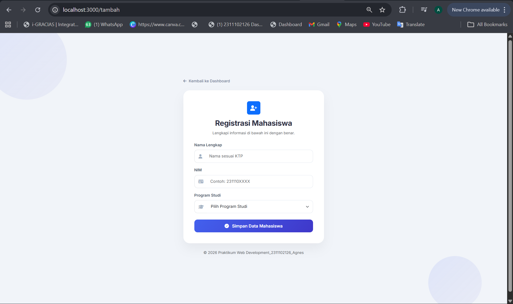
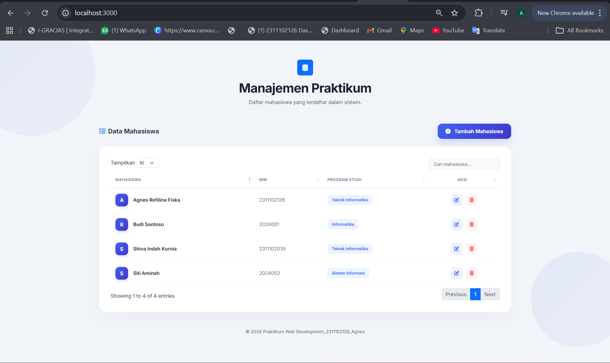
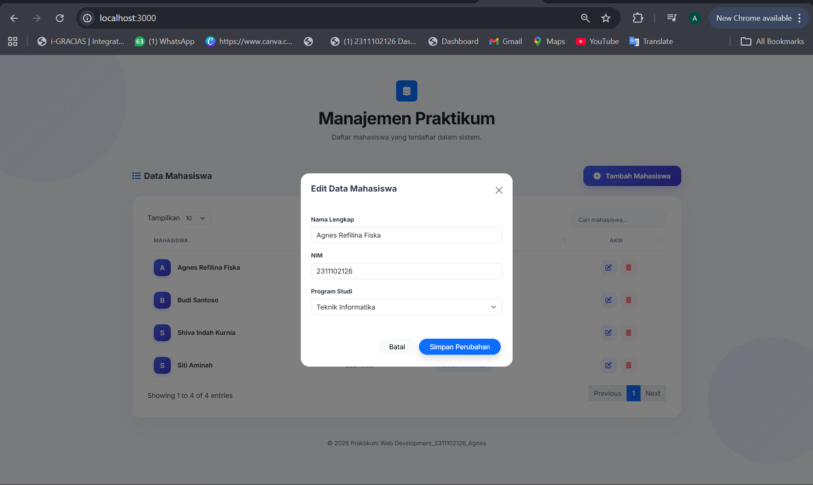
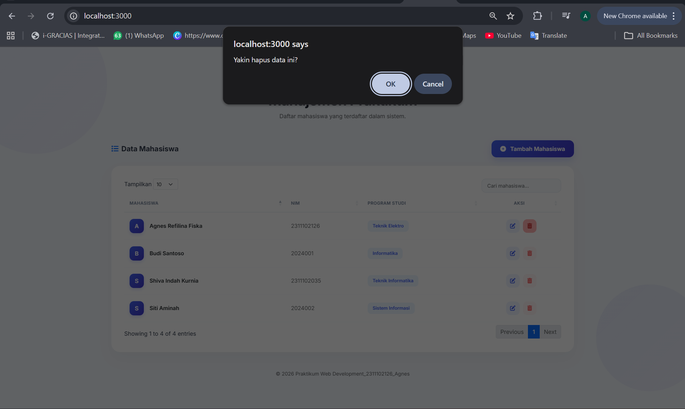

<div align="center">
  <br />
  <h1>LAPORAN PRAKTIKUM <br>APLIKASI BERBASIS PLATFORM</h1>
  <br />
  <h3>COTS-2 <br></h3>
  <br />
  <br />
  
  <br />
  <br />
  <h3>Disusun Oleh :</h3>
  <p>
    <strong>Agnes Refilina Fiska</strong><br>
    <strong>2311102126</strong><br>
    <strong>S1 IF-11-01</strong>
  </p>
  <br />
  <br />
  <h3>Dosen Pengampu :</h3>
  <p>
    <strong>Dimas Fanny Hebrasianto Permadi, S.ST., M.Kom</strong>
  </p>
  <br />
  <br />
  <h4>Asisten Praktikum :</h4>
  <strong>Apri Pandu Wicaksono</strong> <br>
  <strong>Rangga Pradarrell Fathi</strong>
  <br />
  <h3>LABORATORIUM HIGH PERFORMANCE
 <br>FAKULTAS INFORMATIKA <br>UNIVERSITAS TELKOM PURWOKERTO <br>2026</h3>
</div>

---

## 1. Dasar Teori

**Operasi CRUD** (Create, Read, Update, Delete) merupakan pilar utama dalam manajemen data aplikasi. Konsep ini memungkinkan interaksi dinamis antara client dan server, di mana pengguna dapat menambah, menampilkan, mengubah, serta menghapus informasi secara terstruktur dalam sistem web.

**Bootstrap** berfungsi sebagai kerangka kerja (framework) CSS open-source yang mempercepat pembangunan antarmuka. Dengan komponen siap pakai seperti grid system, modal, dan form, Bootstrap memastikan tampilan aplikasi tetap konsisten dan responsif di berbagai perangkat.

**jQuery** adalah pustaka JavaScript yang menyederhanakan manipulasi elemen HTML (DOM) dan penanganan kejadian (event handling). Melalui sintaks yang ringkas, jQuery mempermudah pengembang dalam menciptakan interaksi antarmuka yang lebih interaktif dibandingkan menggunakan JavaScript murni.

**jQuery** DataTables merupakan ekstensi dari jQuery yang memberikan fungsionalitas tingkat lanjut pada tabel HTML. Fitur unggulannya meliputi pencarian otomatis, pengurutan kolom, serta pembagian halaman (pagination), yang semuanya dapat diintegrasikan dengan data berformat JSON melalui mekanisme AJAX.

**JSON (JavaScript Object Notation)** berperan sebagai format pertukaran data standar yang efisien dan ringan. Karena strukturnya yang mudah dipahami baik oleh manusia maupun mesin, JSON menjadi pilihan utama untuk mendistribusikan data antara backend dan frontend.

**Node.js** adalah lingkungan runtime yang memungkinkan JavaScript dieksekusi di sisi server. Node.js memberikan kemampuan bagi pengembang untuk menangani permintaan HTTP dan mengelola logika backend menggunakan bahasa pemrograman yang sama dengan sisi klien.

**Express JS** hadir sebagai framework minimalis untuk Node.js yang memfasilitasi pembuatan API dan routing aplikasi secara terorganisir. Dalam proyek ini, Express bertanggung jawab mengelola alur CRUD, menyediakan endpoint data JSON, serta menghubungkan logika server dengan tampilan.

**EJS (Embedded JavaScript Templates)** merupakan mesin templat yang memungkinkan penyisipan kode JavaScript langsung ke dalam dokumen HTML. Dengan EJS, data dinamis dari server dapat dirender secara real-time sebelum ditampilkan kepada pengguna di browser.

**Method Override** adalah teknik pendukung yang memungkinkan aplikasi mengenali instruksi HTTP seperti PUT atau DELETE melalui form HTML konvensional. Hal ini sangat krusial dalam arsitektur RESTful karena secara standar, form HTML hanya mendukung metode GET dan POST.

---

## 2. Deskripsi Aplikasi

Pada tugas COTS 2 ini, aplikasi yang dibuat adalah **Sistem Data Mahasiswa** berbasis web menggunakan **Express JS**, **Bootstrap**, **jQuery**, dan **DataTables**. Aplikasi ini dirancang untuk memenuhi ketentuan tugas praktikum, yaitu memiliki minimal tiga halaman utama, memanfaatkan data JSON untuk tabel, serta menyediakan fitur CRUD lengkap.

Fitur utama dari aplikasi ini adalah:

- Halaman beranda
- Halaman form input data mahasiswa
- Halaman tabel data mahasiswa
- Halaman edit data mahasiswa
- Fitur Create, Read, Update, Delete
- Tabel interaktif menggunakan jQuery DataTables
- Data ditampilkan dari endpoint JSON

Data mahasiswa disimpan pada file JSON lokal sebagai media penyimpanan sederhana, sehingga aplikasi ini tetap dapat berjalan tanpa database seperti MySQL atau MongoDB.

---

## 3. Struktur Folder Project

```bash
tugas_praktikum/
├── node_modules/           # Library Node.js (Express, EJS, dll)
├── views/                  # Folder templat antarmuka (EJS)
│   ├── index.ejs           # Halaman Dashboard & Tabel Utama
│   └── form.ejs            # Halaman Form Registrasi Mahasiswa
├── app.js                  # Logika Utama Server & Routing CRUD
├── package.json            # Informasi Project & Daftar Dependencies
└── package-lock.json       # Pengunci Versi Dependencies
```

### Penjelasan Struktur Folder

- **app.js**: Merupakan jantung dari aplikasi. Di sini semua konfigurasi server dibuat, mulai dari pengaturan port, pemrosesan data form menggunakan body-parser, hingga logika CRUD untuk menyimpan, menampilkan, dan menghapus data mahasiswa.

- **views/**: Folder ini berisi file EJS yang berfungsi sebagai kerangka tampilan.

- **index.ejs**: Mengintegrasikan jQuery DataTables untuk menampilkan data secara dinamis dari server.

- **form.ejs**: Menyediakan antarmuka input bagi pengguna untuk menambahkan data mahasiswa baru ke dalam sistem.

- **node_modules/**: Berisi seluruh paket pendukung yang diinstal melalui NPM agar fitur-fitur seperti Express.js dapat dijalankan.

- **package.json**: Mencatat identitas proyek serta versi pustaka yang digunakan, sehingga project mudah untuk dikelola kembali.

---

## 4. Cara Menjalankan Aplikasi

Berikut ini adalah prosedur teknis untuk mengonfigurasi dan menjalankan aplikasi menajemen mahasiswa pada lingkungan lokal:
1. Persiapan Lingkungan Kerja
- Buka direktori proyek menggunakan editor Visual Studio Code.
- Pastikan runtime Node.js telah terinstalasi dengan benar pada sistem perangkat keras yang digunakan.

2. Inisialisasi Proyek Node.js
- Lakukan inisialisasi untuk membuat file manifest package.json dengan menjalankan perintah berikut pada terminal:
```bash
npm init -y
```

3. Instalasi Dependencies
- Instal seluruh pustaka pihak ketiga yang diperlukan aplikasi agar logika server dan tampilan dapat berjalan secara sinkron:
```bash
npm install express ejs body-parser
```
(Catatan: Pastikan body-parser terinstal untuk menangani input dari form registrasi).

4. Aktivasi Server Backend
- Jalankan server utama melalui file app.js menggunakan perintah:
```bash
node app.js
```
- Pastikan muncul indikator sukses pada terminal yang menyatakan bahwa aplikasi telah aktif di port 3000.

5. Akses Antarmuka Pengguna
- Buka peramban (web browser) dan akses alamat lokal berikut untuk menampilkan dashboard manajemen mahasiswa:
```bash
http://localhost:3000
```
---
## 5. Alur CRUD Aplikasi

**A. Konfigurasi Proyek `package.json`**
```json
{
  "name": "tugas_praktikum",
  "version": "1.0.0",
  "description": "",
  "main": "index.js",
  "scripts": {
    "test": "echo \"Error: no test specified\" && exit 1"
  },
  "keywords": [],
  "author": "",
  "license": "ISC",
  "dependencies": {
    "body-parser": "^2.2.2",
    "ejs": "^5.0.1",
    "express": "^5.2.1"
  }
}
```
**penjelasan `package.json`**

File package.json berfungsi sebagai manifest utama proyek Node.js. Pada file ini, ditetapkan bahwa titik masuk utama (entry point) aplikasi adalah index.js. Daftar dependensi yang digunakan mencakup express sebagai framework backend versi 5.2.1, ejs sebagai engine untuk render tampilan dinamis, dan body-parser untuk memproses kiriman data dari form HTML.

**B. Backend `index.js`**

```js
const express = require('express');
const app = express();
const bodyParser = require('body-parser');

// Setting agar bisa membaca folder views dan input dari form
app.set('view engine', 'ejs');
app.use(bodyParser.urlencoded({ extended: true }));

// Database Sederhana (Array JSON)
let dataMahasiswa = [
    { id: 1, nama: "Budi Santoso", nim: "2024001", prodi: "Informatika" },
    { id: 2, nama: "Siti Aminah", nim: "2024002", prodi: "Sistem Informasi" }
];

// ROUTE 1: Halaman Utama (Menampilkan Tabel)
app.get('/', (req, res) => {
    res.render('index');
});

// ROUTE 2: API JSON (Sumber Data untuk DataTables)
app.get('/api/mahasiswa', (req, res) => {
    res.json({ data: dataMahasiswa });
});

// ROUTE 3: Halaman Form Tambah Data
app.get('/tambah', (req, res) => {
    res.render('form');
});

// ROUTE 4: Proses Simpan Data (Create)
app.post('/simpan', (req, res) => {
    const { nama, nim, prodi } = req.body;
    dataMahasiswa.push({ id: Date.now(), nama, nim, prodi });
    res.redirect('/');
});

// ROUTE 5: Proses Hapus Data (Delete)
app.get('/hapus/:id', (req, res) => {
    dataMahasiswa = dataMahasiswa.filter(m => m.id != req.params.id);
    res.redirect('/');
});

// ROUTE 6: Proses Update Data (Update)
app.post('/update', (req, res) => {
    const { id, nama, nim, prodi } = req.body;
    const index = dataMahasiswa.findIndex(m => m.id == id);
    if (index !== -1) {
        dataMahasiswa[index] = { id: parseInt(id), nama, nim, prodi };
    }
    res.redirect('/');
});

// Jalankan Server
app.listen(3000, () => {
    console.log('Aplikasi sukses berjalan di http://localhost:3000');
});
```
**Penjelasan `index.js`**

File index.js merupakan pusat kendali aplikasi yang mengatur alur logika backend. Berikut adalah komponen utamanya:

- Inisialisasi & Middleware: Menggunakan Express.js dan body-parser untuk menangani permintaan HTTP serta memproses input data dari pengguna.
- Struktur Data: Penyimpanan data dilakukan secara in-memory menggunakan variabel dataMahasiswa (Array of Objects), yang berfungsi sebagai basis data sementara.
- Endpoint API: Menyediakan rute /api/mahasiswa yang mengembalikan data dalam format JSON untuk diintegrasikan dengan plugin DataTables di sisi frontend.

**Logika CRUD:**

- Create: Menambah data baru melalui rute /simpan dengan ID unik berbasis timestamp.
- Update: Memperbarui data yang ada berdasarkan kecocokan ID menggunakan fungsi findIndex.
- Delete: Menghapus data spesifik menggunakan metode .filter() berdasarkan parameter ID di URL.

**C. Konfigurasi Proyek `package-lock.json`**
```json
{
  "name": "tugas_praktikum",
  "version": "1.0.0",
  "lockfileVersion": 3,
  "requires": true,
  "packages": {
    "": {
      "name": "tugas_praktikum",
      "version": "1.0.0",
      "license": "ISC",
      "dependencies": {
        "body-parser": "^2.2.2",
        "ejs": "^5.0.1",
        "express": "^5.2.1"
      }
    }
  }
}
```
**Penjelasan `package-lock.json`**

File ini dibuat secara otomatis saat melakukan instalasi paket melalui NPM. Tujuannya adalah untuk mencatat versi spesifik dari setiap dependensi dan sub-dependensi yang terpasang, guna memastikan konsistensi lingkungan pengembangan (development environment) saat proyek dijalankan di perangkat yang berbeda.

---

## 6. Alur CRUD Aplikasi

### 1. Create
Pengguna mengakses halaman registrasi melalui rute `/tambah`. Setelah formulir diisi dan tombol Simpan ditekan, data dikirim ke server menggunakan metode POST. Server (Node.js) menangkap data melalui `req.body`, memberikan ID unik, lalu memasukkannya ke dalam variabel `dataMahasiswa` sebelum melakukan redirect kembali ke halaman utama.

### 2. Read
Saat halaman indeks dimuat, skrip jQuery DataTables melakukan permintaan AJAX ke endpoint `/api/mahasiswa` Server mengirimkan seluruh isi variabel `dataMahasiswa` dalam format JSON. DataTables kemudian merender data tersebut ke dalam tabel secara otomatis dengan fungsionalitas pencarian (searching), pengurutan (sorting), dan pembagian halaman (pagination).

### 3. Update
Ketika tombol Edit ditekan, fungsi JavaScript `openEditModal()` akan dipicu untuk memunculkan Bootstrap Modal. Data lama mahasiswa secara otomatis terisi ke dalam kolom input modal menggunakan perintah `JSON.stringify` Setelah data diperbaiki dan dikirim, server mencari indeks data yang sesuai berdasarkan ID, lalu memperbarui informasi mahasiswa tersebut di dalam array.

### 4. Delete
Pengguna menekan tombol Hapus yang menyertakan parameter ID unik mahasiswa pada URL (misalnya: `/hapus/1`). Sistem akan memunculkan jendela konfirmasi melalui fungsi `onclick="return confirm()`". Jika dikonfirmasi, server akan menjalankan fungsi .`filter()` untuk menghapus data dengan ID tersebut dari array dan menyegarkan tampilan tabel.

---

## 7. Screenshot Website

1. Tampilan Awal Halaman

2. Halaman Form Input Mahasiswa

3. Halaman Data Mahasiswa

4. Halaman Edit Data Mahasiswa

5. Hasil Update Data

6. Proses Hapus Data

---

## 8. Kesimpulan

Berdasarkan hasil praktikum pengembangan aplikasi manajemen mahasiswa ini, dapat disimpulkan beberapa poin utama sebagai berikut:

- Implementasi CRUD Berhasil: Aplikasi telah berhasil menjalankan fungsi dasar CRUD (Create, Read, Update, Delete) secara dinamis menggunakan Node.js dan Express.js.

- Efisiensi Antarmuka dengan DataTables: Penggunaan plugin jQuery DataTables terbukti meningkatkan pengalaman pengguna (User Experience) karena mampu menyajikan fitur pencarian, pengurutan, dan navigasi data secara otomatis tanpa membebani performa server.

- Manajemen Tampilan Dinamis: Penggunaan template engine EJS mempermudah proses integrasi data dari sisi backend ke dalam struktur HTML, sehingga perubahan data pada server dapat langsung dirender dan ditampilkan secara real-time kepada pengguna.

- Struktur Proyek Terorganisir: Penerapan struktur folder yang memisahkan antara logika server (app.js), aset tampilan (views/), dan manajemen paket (package.json) membuat kode program lebih mudah dipelihara (maintainable) dan dikembangkan di masa mendatang.

- Penyimpanan Data Sementara: Sistem ini saat ini masih menggunakan penyimpanan berbasis In-memory Array, sehingga data akan kembali ke kondisi awal setiap kali server di-restart. Hal ini menunjukkan pentingnya integrasi basis data permanen (seperti MySQL atau MongoDB) untuk pengembangan tahap selanjutnya.

---

## 9. Referensi

1. https://expressjs.com
2. https://nodejs.org
3. https://getbootstrap.com
4. https://jquery.com
5. https://datatables.net
6. https://ejs.co
7. https://developer.mozilla.org

## 10. Link Video Presentasi
https://drive.google.com/file/d/1wlY8Qi9aoSeNuybCm3Mvp-_Ngai5BWP4/view?usp=drivesdk
