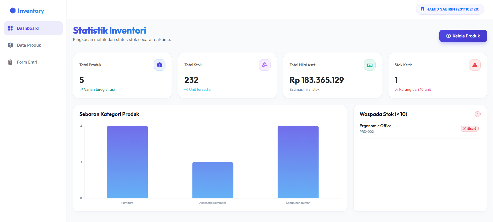
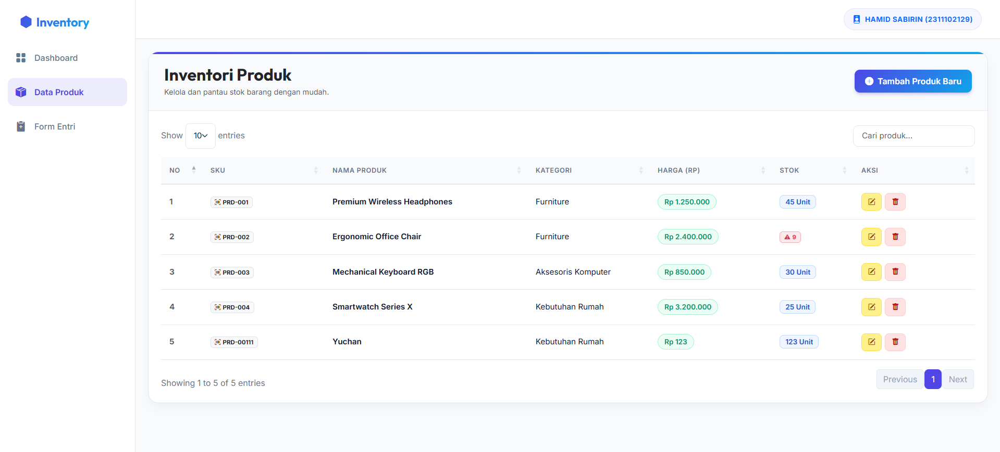
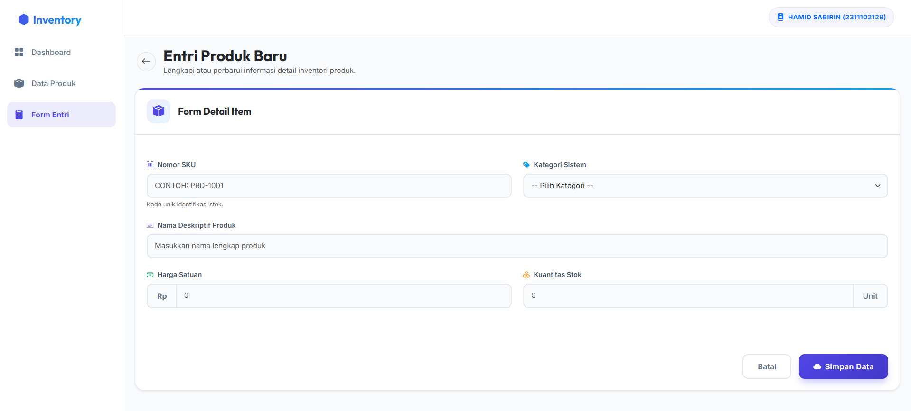
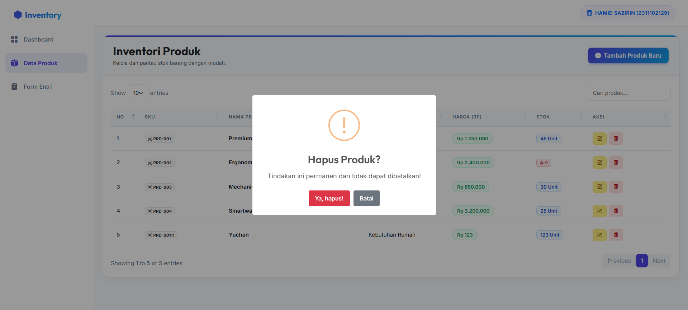

<div align="center">
  <br />
  <h1>LAPORAN PRAKTIKUM <br>APLIKASI BERBASIS PLATFORM</h1>
  <br />
  <h3>TUGAS COTS 2 <br> NODE.JS & EXPRESS.JS</h3>
  <br />
  <br />
   
  <br />
  <br />
  <br />
  <br />
  <h3>Disusun Oleh :</h3>
  <p>
    <strong>HAMID SABIRIN</strong><br>
    <strong>2311102129</strong><br>
    <strong>S1 IF-11-REG01</strong>
  </p>
  <br />
  <br />
  <h3>Dosen Pengampu :</h3>
  <p>
    <strong>Dimas Fanny Hebrasianto Permadi, S.ST., M.Kom</strong>
  </p>
  <br />
  <br />
    <h4>Asisten Praktikum :</h4>
    <strong> Apri Pandu Wicaksono </strong> <br>
    <strong>Rangga Pradarrell Fathi</strong>
  <br />
  <h3>LABORATORIUM HIGH PERFORMANCE
 <br>FAKULTAS INFORMATIKA <br>UNIVERSITAS TELKOM PURWOKERTO <br>2026</h3>
</div>

---

## 1. Dasar Teori

Dalam pembuatan aplikasi inventori berbasis web ini, terdapat beberapa teknologi dan konsep dasar yang digunakan:

1. **Node.js & Express.js:** Node.js adalah lingkungan eksekusi untuk JavaScript di sisi backend. Express.js adalah framework minimalis di atas Node.js yang mempermudah kita bikin routing (URL) dan membuat REST API secara cepat.
2. **REST API (Representational State Transfer):** Arsitektur komunikasi yang menjembatani antara tampilan depan (Frontend) dengan server (Backend). Data yang dikirim dan diterima biasanya pakai format teks JSON.
3. **JSON (JavaScript Object Notation):** Format file yang ringan dan gampang dibaca manusia purba maupun komputer, biasa dipakai untuk nyimpen data dan tukar-menukar informasi. Di project ini, JSON dipakai seakan-akan sebagai database utamanya.
4. **AJAX / API Fetch:** Teknik di JavaScript buat ambil atau kirim data ke server secara diam-diam (di balik layar) tanpa perlu nge-refresh seluruh halaman web. Di sini kita pakai library `jQuery` (syntax `$.ajax`) biar codingannya lebih singkat.
5. **Bootstrap 5:** Framework CSS dan HTML siap pakai supaya bisa bikin tampilan website yang responsif dan kelihatan modern tanpa perlu nulis kode CSS yang panjang banget.

---

## 2. Penjelasan Kode HTML, CSS, JSON, dan JS

Berikut adalah implementasi blok kode yang ada di project ini beserta penjelasannya. Total terdapat 9 file pendukung yang saling bekerja sama (4 file JS, 3 file HTML, 1 file JSON, dan 1 file CSS).

### 1. `server.js`

```javascript
const express = require('express');
const cors = require('cors');
const fs = require('fs');

const app = express();
const PORT = 3000;
app.use(express.static('public')); 

// Endpoint Menampilkan Data
app.get('/api/products', (req, res) => {
    const products = readData();
    res.json({ data: products }); 
});

// Endpoint Menambah Data
app.post('/api/products', (req, res) => {
    // ... insert logic untuk auto ID & readData ...
    products.push(newProduct);
    writeData(products);
    res.status(201).json(newProduct);
});

// Endpoint Menghapus Data
app.delete('/api/products/:id', (req, res) => {
    const id = parseInt(req.params.id, 10);
    const products = readData();
    const filteredProducts = products.filter(p => p.id !== id);
    writeData(filteredProducts);
    res.json({ message: "Product deleted" });
});
```

**Penjelasan:**
- **Baris 1-13:** Inisialisasi awal server. Memanggil modul `express`, `cors`, dan `fs`. Mendefinisikan port ke 3000 dan mengatur folder `public` sebagai tempat penyimpanan statis (agar file HTML bisa langsung diakses frontend).
- **Baris 15-31:** Menyediakan fungsi `readData()` dan `writeData()`. Berfungsi menerjemahkan sinkronisasi baca tulis ke file `data.json` agar penyimpanan permanen dan tetap utuh walau server sering direstart.
- **Baris 45-49:** Akses logika endpoint tipe `GET /api/products` untuk merespons permintaan dari user di browser dengan menampilkan struktur array file JSON.
- **Baris 63-77:** Akses endpoint `POST /api/products`. Di jalur ini data formulir masuk lewat `req.body`, lalu secara proaktif dibuatkan ID auto-increment menggunakan `Math.max` sebelum data disuntikkan (`push()`) ke database memori JSON.
- **Baris 79-95:** Endpoint `PUT /api/products/:id` berfungsi menelusuri penempatan index spesifik dari suatu item sehingga objek baris lamanya dapat di-*override* atau ditimpa menggunakan isian rincian formulir edit yang baru.
- **Baris 97-110:** Endpoint `DELETE /api/products/:id`. Melakukan mekanisme pencegatan *filter* untuk memilah data yang tak dihapus, lalu menyimpannya ulang ke JSON sehingga list sisa barang tampil valid.

### 2. `data.json`

```json
[
  {
    "id": 1,
    "sku": "PRD-001",
    "name": "Premium Wireless Headphones",
    "category": "Elektronik",
    "price": "1250000",
    "stock": "45"
  }
]
```

**Penjelasan:**
- **Baris 1-42:** Berbekal kerangka memori array statis format JSON ini, program memanfaatkan keefisiensian pengolahan objek Javascript. Seluruh deskripsi inventaris berupa atribut utama sebutan (id, sku, name, category, price, serta stock) tercatat dan bertindak langsung sebagai media simulasi database dari `server.js`.

### 3. `index.html`

```html
<!-- Bagian Menu Kiri -->
<div class="sidebar d-none d-lg-flex flex-column" id="sidebar">
    <ul class="nav flex-column mb-auto gap-1">
        <li class="nav-item"> <a href="index.html" class="nav-link active">Dashboard</a> </li>
    </ul>
</div>

<!-- Tempat Canvas Kosong -->
<div class="col-lg-8">
    <canvas id="categoryChart"></canvas>
</div>
```

**Penjelasan:**
- **Baris 30-56:** Membangun penempatan sistem menu susun (sidebar) sebelah kiri yang memfasilitasi pengalihan laman tanpa tersesat.
- **Baris 81-130:** Pembungkus kumpulan empat kotak utama `.feature-card` (Jumlah Produk, Total Stok, Total Aset) di area teratas dari panel kendali Dasbor aplikasi.
- **Baris 133-158:** Menyediakan area kanvas kosong `<canvas id="categoryChart">` yang ditugaskan khusus untuk diisi panggungan interaksi plugin JS kelak.

### 4. `data.html`

```html
<div class="table-responsive">
    <table class="table table-hover align-middle w-100" id="productTable">
        <!-- Akan dirender JS -->
    </table>
</div>
```

**Penjelasan:**
- Halaman ini bertugas mementaskan sebuah kerangka tabel secara mentah berlapis ID tersemat khusus `<table id="productTable">`. Kekosongan tabel tersebut sengaja disiapkan agar JS dan DataTables kelak yang menanggung jawab rekayasanya (*Client-side rendering*).

### 5. `form.html`

```html
<form id="productForm">
    <input type="text" class="form-control" id="sku" required>
    <input type="text" class="form-control" id="name" required>
    <button type="submit" class="btn btn-primary" id="btnSubmit">Simpan Produk</button>
</form>
```

**Penjelasan:**
- Sama layaknya halaman daftar data, laman ini murni mengondisikan keranjang formulir rapi ber-elemen form tunggal (`<form id="productForm">`). Susunan ini dirancang untuk kemudian digerakkan mode simpanannya lewat pencegatan AJAX secara interaktif.

### 6. `dashboard.js`

```javascript
/* Melakukan penarikan data mentah untuk dikalkulasikan ke kartu */
$.ajax({
    url: '/api/products',
    type: 'GET',
    success: function(response) {
        // Logika hitung stok dan harga..
        
        // Membangun Grafik menggunakan Chart.js
        const ctx = document.getElementById('categoryChart').getContext('2d');
        new Chart(ctx, { type: 'bar', data: { /* label dan nominal */ } });
    }
});
```

**Penjelasan:**
- **Baris 8-158:** Script ini meluncurkan perintah memicu interupsi `$.ajax` berstatus `GET`. Hasil array bawaannya akan dipecah `.forEach()` meracik rumus volume matematis. Pada puncak blok kodenya, elemen kanvas kosong tadi ditukar menjadi wujud tiang grafik interaktif dari ChartJS.

### 7. `data.js`

```javascript
/* Konfigurasi list DataTable otomatis */
const table = $('#productTable').DataTable({
    "ajax": { "url": "/api/products", "dataSrc": "data" },
    "columns": [
        { "data": "sku" },
        { "data": "name" }
    ]
});
```

**Penjelasan:**
- **Baris 8-45:** Berfungsi meluluhkan tag awal tabel tadi buat dicaplok oleh pustaka `DataTables`. JS tersebut menyetting respons data supaya terbungkus dan dikendalikan utuh fitur canggih semacam Paginator, Penyortiran Panah, dan Mesin Pencarian Aktif (Search).
- **Baris 48-85:** Menyimpan fungsi `deleteData(id)`. Ketika sakelar icon buang ditekan, peringatan elegan keluar dari perut modal plugin *SweetAlert2*. Lalu, skrip mengirim perintah request tipe `DELETE` secara background kepada server.

### 8. `form.js`

```javascript
const idVal = $('#productId').val();

$.ajax({
    url: idVal ? `/api/products/${idVal}` : `/api/products`,
    type: idVal ? 'PUT' : 'POST',
    data: JSON.stringify(productData)
});
```

**Penjelasan:**
- **Baris 3-36:** Menganalisa parameter rute (*Query params*) bar atas `?id=` guna mengubah identitas layar supaya menggerakkan mode "**Edit**".
- **Baris 38-97:** Berfungsi membegal tabrakan perulangan *submit* dengan `e.preventDefault()`, setelah itu semua komponen kolom HTML diubah formatnya pada bingkisan Object dan disalurkan memakai sinyal HTTP `POST` atau `PUT` bergantung status sebelumnya.

### 9. `style.css`

```css
.feature-card {
    border-radius: 16px;
    border: 1px solid rgba(0,0,0,0.05);
    background: #ffffff;
    transition: transform 0.2s ease, box-shadow 0.2s ease;
}

.feature-card:hover {
    transform: translateY(-5px);
    box-shadow: 0 10px 20px rgba(0,0,0,0.04) !important;
}
```

**Penjelasan:**
- Sentuhan sintaks mini di style CSS berguna murni merefresh tata muka statis bawaan *Bootstrap*. Kelemahlembutan efek melayang interaktif (`translateY`) disertai lemparan bayang terang redup kapan saja blok kursor mendarat di atasnya (`:hover`) menjadi resep elegan tampilan supaya mirip dashboard premium. 

---

## 3. Hasil Tampilan (Screenshots)

Berikut adalah beberapa hasil screenshot ketika aplikasi dijalankan dengan lancar di local server:

Tampilan Beranda (Dashboard) dan Grafik:



Tampilan Halaman Data (Tabel Data JSON):



Tampilan Halaman Form dan Interaksi Alert Sukses/Hapus:





---

## 4. Link Youtube Penjelasan Code
[https://youtu.be/_SiCsV7jWsI](https://youtu.be/_SiCsV7jWsI)

## 5. Referensi

Laporan praktikum ini disusun menggunakan komponen pendukung dan wawasan dari platform terkait berikut:


- **Node.js**: [https://nodejs.org/docs/](https://nodejs.org/docs/)
- **Express.js Framework**: [https://expressjs.com/](https://expressjs.com/)
- **Bootstrap 5 (CSS & Components)**: [https://getbootstrap.com/docs/5.3/](https://getbootstrap.com/docs/5.3/)
- **MDN Web Docs (JSON & JavaScript)**: [https://developer.mozilla.org/en-US/docs/Web/JavaScript/Reference/Global_Objects/JSON](https://developer.mozilla.org/en-US/docs/Web/JavaScript/Reference/Global_Objects/JSON)
- **DataTables Plugin**: [https://datatables.net/manual/](https://datatables.net/manual/)
- **Chart.js Documentation**: [https://www.chartjs.org/docs/latest/](https://www.chartjs.org/docs/latest/)
- **SweetAlert2 Library**: [https://sweetalert2.github.io/](https://sweetalert2.github.io/)
