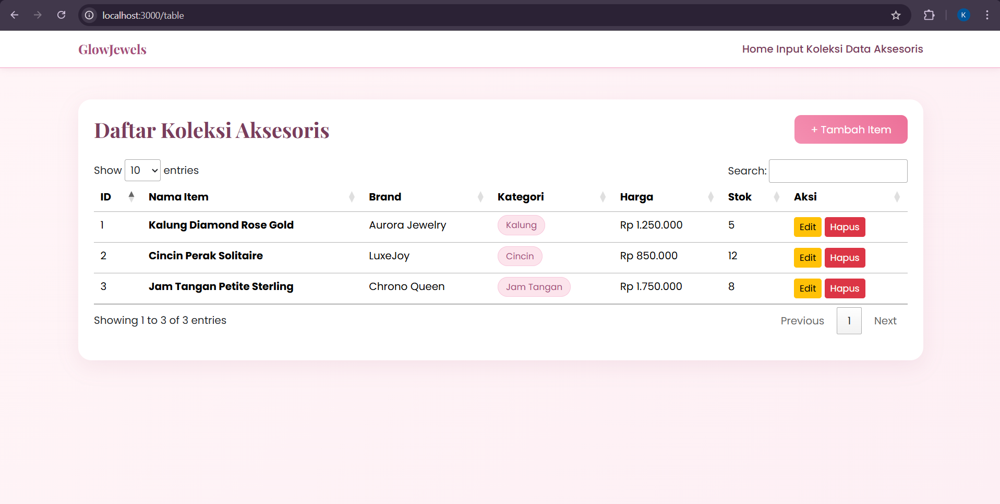
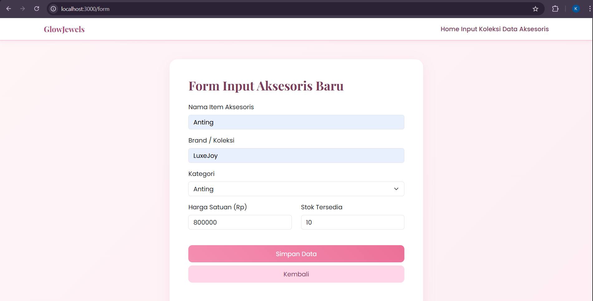
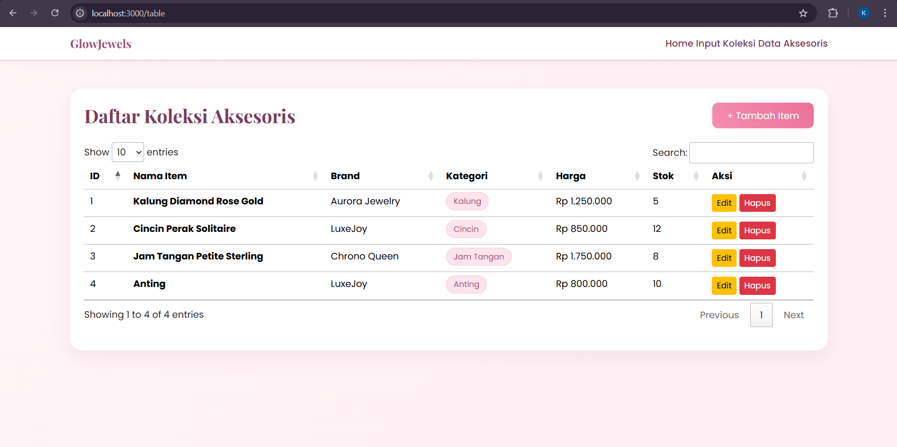
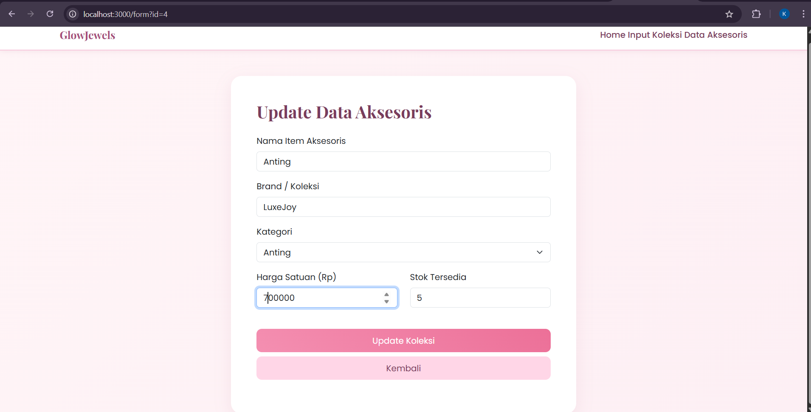
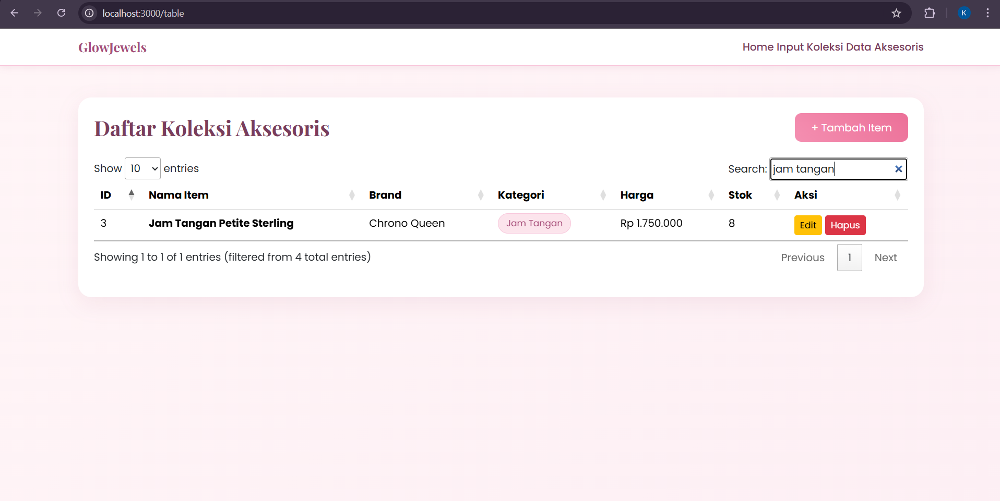
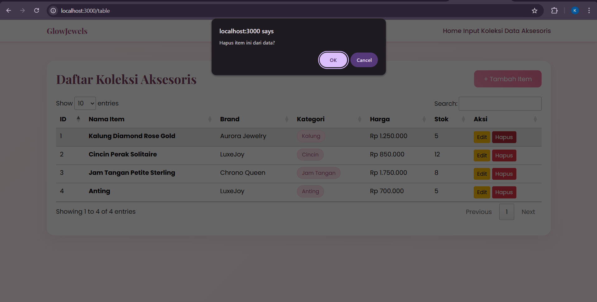
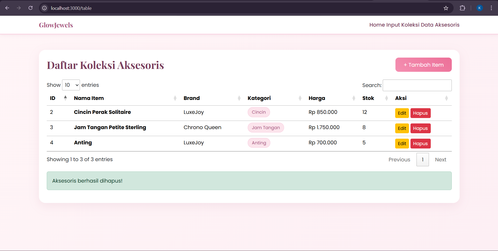

<div align="center">
  <br />
  <h1>LAPORAN PRAKTIKUM <br>APLIKASI BERBASIS PLATFORM</h1>
  <br />
  <h3>TUGAS COTS 2</h3>
  <br />
   
  <br />
  <br />
  <br />
  <h3>Disusun Oleh :</h3>
  <p>
    <strong>Kanasya Abdi Aziz</strong><br>
    <strong>2311102140</strong><br>
    <strong>S1 IF-11-01</strong>
  </p>
  <br />
  <h3>Dosen Pengampu :</h3>
  <p>
    <strong>Dimas Fanny Hebrasianto Permadi, S.ST., M.Kom</strong>
  </p>
  <br />
  <br />
    <h4>Asisten Praktikum :</h4>
    <strong> Apri Pandu Wicaksono </strong> <br>
    <strong>Rangga Pradarrell Fathi</strong>
  <br />
  <br />
  <br />
  <br />
  <h3>LABORATORIUM HIGH PERFORMANCE
 <br>FAKULTAS INFORMATIKA <br>UNIVERSITAS TELKOM PURWOKERTO <br>2026</h3>
</div>

---

## 1. Dasar Teori

**CRUD (Create, Read, Update, Delete)** Konsep dasar pengelolaan data pada sebuah aplikasi adalah CRUD (Create, Read, Update, Delete)**. Pada aplikasi ini, CRUD digunakan untuk mengelola data produk skincare, termasuk menambah produk baru (create), menampilkan produk (read), memperbarui produk (update), dan menghapus produk (delete). Sehingga data dapat dikelola secara dinamis, proses ini dilakukan melalui interaksi pengguna dengan server.

**Bootstrap** adalah framework CSS open-source yang digunakan untuk membuat antarmuka antarmuka aplikasi. Digunakan untuk membuat layout responsif serta komponen seperti form, tombol, dan struktur halaman, sehingga tampilan menjadi lebih rapi, konsisten, dan menarik.

**jQuery** library jQuery digunakan untuk mempermudah manipulasi elemen HTML dan pengelolaan event. Dalam aplikasi ini, jQuery digunakan untuk mengaktifkan DataTables dan menangani interaksi pengguna dengan halaman, seperti pengolahan tabel dan klik event.

**jQuery DataTables** Plugin berbasis jQuery bernama jQuery DataTables digunakan untuk meningkatkan kinerja tabel HTML. Dalam aplikasi ini, DataTables digunakan untuk menampilkan data produk dalam bentuk tabel interaktif yang memiliki fitur pencarian (*search*), pengurutan (*sorting*), dan pagination. Dengan menggunakan endpoint /api/skincare, data tabel dikirim ke server dalam format JSON.

**JSON (JavaScript Object Notation)** adalah format pertukaran data yang mudah digunakan dan mudah dipahami. Setiap kali terjadi operasi CRUD, data disimpan dalam file "products.json" menggunakan JSON.

**Node.js** runtime JavaScript yang memungkinkan JavaScript dijalankan di sisi server. Node.js digunakan dalam aplikasi ini untuk menjalankan server, menangani permintaan client, dan mengelola proses baca dan tulis file melalui modul bawaan.

**Express JS** adalah framework backend berbasis Node.js yang digunakan untuk membuat aplikasi web yang lebih teratur. Aplikasi ini menggunakan Express JS untuk mengatur routing, mengelola proses CRUD, merender halaman menggunakan EJS, dan menyediakan endpoint API bernama "/api/skincare" yang mengirimkan data dalam format JSON untuk digunakan oleh DataTables.

**EJS (Embedded JavaScript Templates)** merupakan template engine yang digunakan untuk membuat halaman web dinamis. Pada aplikasi ini, EJS digunakan untuk membangun tampilan halaman seperti dashboard, form tambah produk, dan form edit produk, serta menampilkan data dari server ke dalam halaman.

**File System (fs)** adalah modul bawaan Node.js yang digunakan untuk membaca dan menulis file. Dalam aplikasi ini, modul `fs` digunakan untuk mengakses file `products.json` sebagai media penyimpanan data, sehingga setiap perubahan data dapat langsung disimpan secara permanen.

**AJAX (Asynchronous JavaScript and XML)** merupakan teknik yang digunakan untuk mengambil data dari server tanpa perlu memuat ulang halaman. Pada aplikasi ini, DataTables menggunakan AJAX untuk mengambil data produk dari endpoint `/api/skincare` dalam format JSON sehingga data dapat ditampilkan secara dinamis pada tabel.

---

## 2. Deskripsi Aplikasi

Aplikasi web katalog produk aksesoris GlowJewels dikembangkan pada tugas ini menggunakan Node.js dan framework Express, dan memanfaatkan Bootstrap, jQuery, dan DataTables untuk interaksi dan tampilan pengguna.

Aplikasi ini harus memiliki setidaknya tiga halaman utama, sesuai dengan persyaratan praktikum, dan mendukung pengelolaan data menggunakan konsep CRUD (Create, Read, Update, Delete).

Aplikasi memiliki beberapa halaman utama, yaitu:

- **Halaman Dashboard (Tabel Data Produk)**  
 Menggunakan jQuery DataTables, pengguna dapat menampilkan seluruh data produk dalam bentuk tabel interaktif dan melakukan pencarian, pengurutan, dan navigasi halaman dengan mudah.

- **Halaman Tambah Produk**  
  Berisi form input untuk menambahkan data produk baru ke dalam sistem.

- **Halaman Edit Produk**  
  Digunakan untuk memperbarui data produk yang sudah ada berdasarkan ID tertentu.

Selain itu, aplikasi juga menyediakan fitur:

- **Create** → Menambahkan produk baru melalui form input  
- **Read** → Menampilkan data produk dalam tabel interaktif  
- **Update** → Mengubah data produk melalui halaman edit  
- **Delete** → Menghapus data produk dari sistem  

Aplikasi tidak memerlukan database eksternal karena data produk disimpan dalam file JSON lokal, "products.json" yang terletak di folder "data". Modul "fs" Node.js menyimpan perubahan data langsung ke file tersebut.

Aplikasi menggunakan endpoint API "/api/skincare" untuk menampilkan data pada tabel. Endpoint ini mengirimkan data dalam format JSON, yang kemudian diolah oleh DataTables, sehingga tabel menjadi interaktif dan mudah digunakan.

---

## 3. Struktur Folder Project

```bash
TUGAS COTS-2/
├── assets/
│   ├── 1.png
│   ├── 2.png
│   ├── 3.png
│   ├── 4.png
│   ├── 5.png
│   ├── 6.png
│   ├── 7.png
│   ├── 8.png
│   └── logo.png
├── node_modules/
├── views/
│   ├── form.html
│   ├── home.htmll
│   └── table.html
├── app.js
├── package.json
├── package-lock.json
└── README.md
```

### Penjelasan Struktur Folder

| File / Folder | Keterangan |
|---|---|
| `app.js` | File utama aplikasi yang berisi konfigurasi server Express, routing, serta proses CRUD. |
| `package.json` | File konfigurasi project yang berisi informasi project dan dependency yang digunakan. |
| `node_modules/` | Folder yang berisi library hasil instalasi dari npm. |
| `data/products.json` | File penyimpanan data produk dalam format JSON yang berfungsi sebagai database sederhana. |
| `views/` | Folder yang berisi file tampilan (view) menggunakan EJS. |
| `views/home.html` | Sebagai halaman awal / dashboard aplikasi. |
| `views/form.html` | menambahkan atau mengedit data. |
| `views/table.html` | Untuk menampilkan semua data. |
| `assets/` | Folder yang berisi gambar atau screenshot aplikasi yang digunakan untuk dokumentasi laporan. |
| `README.md` | File dokumentasi laporan yang berisi penjelasan lengkap aplikasi. |

---

### Penjelasan Alur Struktur

Struktur project ini dibuat sederhana namun tetap terorganisir dengan baik. File utama `app.js` berfungsi sebagai pusat pengendali aplikasi, mulai dari pengaturan server hingga pengelolaan data.

Folder `views` digunakan untuk menyimpan tampilan halaman yang akan dirender oleh server menggunakan HTML. 

Folder `assets` digunakan khusus untuk menyimpan gambar hasil tampilan aplikasi yang akan digunakan pada bagian dokumentasi atau laporan.

---

## 4. Cara Menjalankan Aplikasi

Berikut langkah-langkah untuk menjalankan aplikasi *Glow Jewels*:

### 1. Buka Folder Project
Buka folder project menggunakan Visual Studio Code atau code editor lainnya.
Pastikan Node.js sudah terinstall di perangkat.

### 2. Install Dependency
Jalankan perintah berikut pada terminal untuk menginstall semua library yang dibutuhkan:

```bash
npm install
```

### 3. Jalankan Server
Jalankan aplikasi menggunakan perintah:

```bash
npm start
```
Atau jika belum menggunakan script start:

```bash
node app.js
```

### 4. Akses Aplikasi di Browser
Buka browser, kemudian akses alamat berikut:

```bash
http://localhost:3000
```

### 5. Menggunakan Aplikasi

Setelah aplikasi berjalan, pengguna dapat:

- Melihat daftar produk pada halaman utama  
- Menambahkan produk baru melalui tombol **Tambah Produk**  
- Mengedit data produk melalui tombol **Edit**  
- Menghapus data produk melalui tombol **Delete**  

Semua perubahan data akan langsung tersimpan pada file `products.json`.

---

## 5. Kode Program

### A. `package.json`

```json
{
  "name": "abp",
  "version": "1.0.0",
  "description": "",
  "main": "index.js",
  "scripts": {
    "test": "echo \"Error: no test specified\" && exit 1"
  },
  "keywords": [],
  "author": "",
  "license": "ISC",
  "type": "commonjs",
  "dependencies": {
    "express": "^5.2.1"
  }
}
```

### Penjelasan `package.json`

File konfigurasi utama untuk proyek Node.js adalah file "package.json". File ini berisi informasi dasar proyek, file utama yang dijalankan, script yang dapat digunakan, dan daftar dependency yang dibutuhkan oleh aplikasi.

Pada aplikasi ini, bagian "nama" menunjukkan nama proyek dan "versi" menunjukkan versi aplikasi. Deskripsi singkat tentang aplikasi yang dibuat, yang merupakan aplikasi web CRUD untuk produk skincare yang menggunakan Express, EJS, Bootstrap, jQuery, dan DataTables, terletak di bagian "description".


File utama aplikasi adalah "app.js", yang ditunjukkan oleh baris "main" "app.js". Selain itu, script "start" node app.js" digunakan pada bagian "scripts" agar aplikasi dapat dijalankan dengan perintah "npm start".

Dalam bagian "type", "commonjs" menunjukkan bahwa proyek ini menggunakan modul CommonJS. Di bagian "dependencies", aplikasi menggunakan beberapa library utama, seperti:

- `express` digunakan sebagai framework backend untuk membangun server dan routing.  
- `ejs` digunakan sebagai template engine untuk menampilkan halaman dinamis.  
- `body-parser` digunakan untuk membaca data yang dikirim dari form maupun request dalam format JSON.  

Dengan adanya file `package.json`, pengelolaan dependency dan proses menjalankan aplikasi menjadi lebih terstruktur dan mudah.

---

### B. `app.js`

```javascript
const express = require('express');
const path = require('path');

const app = express();
const port = 3000;

app.use(express.json());
app.use(express.urlencoded({ extended: true }));
app.use('/public', express.static(path.join(__dirname, 'public')));

let accessoriesProducts = [
    {
        id: 1,
        nama: 'Kalung Diamond Rose Gold',
        brand: 'Aurora Jewelry',
        kategori: 'Kalung',
        harga: 1250000,
        stok: 5
    },
    {
        id: 2,
        nama: 'Cincin Perak Solitaire',
        brand: 'LuxeJoy',
        kategori: 'Cincin',
        harga: 850000,
        stok: 12
    },
    {
        id: 3,
        nama: 'Jam Tangan Petite Sterling',
        brand: 'Chrono Queen',
        kategori: 'Jam Tangan',
        harga: 1750000,
        stok: 8
    }
];

let nextId = 4;

// Route Halaman Utama
app.get('/', (req, res) => {
    res.sendFile(path.join(__dirname, 'views', 'home.html'));
});

// Route Halaman Form
app.get('/form', (req, res) => {
    res.sendFile(path.join(__dirname, 'views', 'form.html'));
});

// Route Halaman Tabel
app.get('/table', (req, res) => {
    res.sendFile(path.join(__dirname, 'views', 'table.html'));
});

// --- API UNTUK DATATABLES (JSON) ---

// Ambil semua data
app.get('/api/products', (req, res) => {
    res.json(accessoriesProducts);
});

// Ambil 1 data untuk Edit
app.get('/api/products/:id', (req, res) => {
    const id = parseInt(req.params.id);
    const product = accessoriesProducts.find(item => item.id === id);
    if (!product) return res.status(404).json({ message: 'Data tidak ditemukan' });
    res.json(product);
});

// Tambah Data (Create)
app.post('/api/products', (req, res) => {
    const { nama, brand, kategori, harga, stok } = req.body;
    const newProduct = {
        id: nextId++,
        nama,
        brand,
        kategori,
        harga: parseInt(harga),
        stok: parseInt(stok)
    };
    accessoriesProducts.push(newProduct);
    res.json({ message: 'Aksesoris berhasil ditambahkan!' });
});

// Update Data (Update)
app.put('/api/products/:id', (req, res) => {
    const id = parseInt(req.params.id);
    const { nama, brand, kategori, harga, stok } = req.body;
    const index = accessoriesProducts.findIndex(item => item.id === id);
    
    if (index !== -1) {
        accessoriesProducts[index] = { id, nama, brand, kategori, harga: parseInt(harga), stok: parseInt(stok) };
        res.json({ message: 'Data aksesoris berhasil diperbarui!' });
    } else {
        res.status(404).json({ message: 'Gagal update, data tidak ditemukan' });
    }
});

// Hapus Data (Delete)
app.delete('/api/products/:id', (req, res) => {
    const id = parseInt(req.params.id);
    accessoriesProducts = accessoriesProducts.filter(item => item.id !== id);
    res.json({ message: 'Aksesoris berhasil dihapus!' });
});

app.listen(port, () => {
    console.log(`Server GlowJewels berjalan di http://localhost:${port}`);
});
```

### Penjelasan `app.js`

Karena file "app.js" berfungsi sebagai backend, file ini mengatur seluruh proses di sistem.

Pada bagian awal, import beberapa module dilakukan: "express", "body-parser", "fs", dan "path". Module "express" membangun server, "body-parser" membaca dan menulis data dari permintaan, dan "path" mengatur lokasi file.

Konfigurasi Express kemudian dilakukan, termasuk mengatur template engine menggunakan HTML, mengaktifkan middleware untuk membaca data dari form dan JSON, dan mengatur folder statik.

File "products.json" yang berfungsi sebagai penyimpanan data dapat ditemukan dengan menggunakan variabel "dataPath".

Terdapat dua fungsi utama, yaitu:

- `readProducts()` → digunakan untuk membaca data dari file JSON  
- `writeProducts()` → digunakan untuk menyimpan data ke file JSON  

Pada bagian routing, aplikasi memiliki beberapa route utama:

- `GET /` → menampilkan halaman utama (dashboard)  
- `GET /add` → menampilkan halaman tambah produk  
- `GET /api/skincare` → mengirim data produk dalam format JSON untuk DataTables  

Selanjutnya terdapat implementasi CRUD:

- **Create**   
  Digunakan untuk menambahkan data produk baru ke dalam file JSON.  

- **Read**
  Digunakan untuk mengambil seluruh data produk dalam format JSON.  

- **Update**
  Digunakan untuk memperbarui data produk berdasarkan ID.  

- **Delete**
  Digunakan untuk menghapus data produk berdasarkan ID.  

Terakhir, server dijalankan menggunakan "app.listen()" pada port 3000 untuk memungkinkan browser untuk mengakses aplikasi. Dalam struktur ini, file "app.js" berfungsi sebagai pusat pengendali aplikasi yang menghubungkan frontend dan data (JSON).

---

### C. `views/home.html`

```html
<!DOCTYPE html>
<html lang="en">
<head>
    <meta charset="UTF-8">
    <meta name="viewport" content="width=device-width, initial-scale=1.0">
    <title>GlowJewels - Luxury Accessories</title>
    <link href="https://cdn.jsdelivr.net/npm/bootstrap@5.3.3/dist/css/bootstrap.min.css" rel="stylesheet">
    <link href="/public/style.css" rel="stylesheet">
</head>
<body>
    <nav class="navbar navbar-expand-lg navbar-custom">
        <div class="container">
            <a class="navbar-brand" href="/">GlowJewels</a>
            <div class="ms-auto">
                <a class="nav-link d-inline" href="/">Home</a>
                <a class="nav-link d-inline" href="/form">Input Koleksi</a>
                <a class="nav-link d-inline" href="/table">Data Aksesoris</a>
            </div>
        </div>
    </nav>

    <div class="container mt-5">
        <div class="hero-box text-center">
            <h1 class="title-pink display-4">Aplikasi Inventaris Aksesoris</h1>
            <p class="mt-3 text-muted">
                Kelola data perhiasan, jam tangan, dan berbagai aksesoris wanita dengan sistem 
                CRUD yang modern menggunakan Node.js, Bootstrap, dan DataTables.
            </p>

            <div class="mt-5">
                <a href="/form" class="btn btn-pink btn-lg me-3">Tambah Item</a>
                <a href="/table" class="btn btn-soft btn-lg">Lihat Tabel Data</a>
            </div>
        </div>
    </div>
</body>
</html>
```

### Penjelasan `views/home.html`

Kode di atas merupakan struktur Halaman Utama (Home) dari aplikasi GlowJewels yang dibangun menggunakan HTML5 dan diintegrasikan dengan framework Bootstrap 5 untuk menciptakan antarmuka yang responsif dan elegan. Halaman ini memiliki sebuah navigasi kustom (navbar-custom) yang menghubungkan tiga fitur utama aplikasi, serta bagian Hero Box yang berfungsi sebagai pusat interaksi pengguna dengan tombol akses cepat menuju form input data dan tabel inventaris. Secara fungsional, kode ini berperan sebagai landing page yang menjelaskan tujuan aplikasi sekaligus menghubungkan berbagai komponen CRUD (Node.js dan DataTables) melalui tautan navigasi yang bersih dan tertata rapi sesuai dengan tema visual perhiasan yang mewah.
---

### D. `views/form.html`

```html
<!DOCTYPE html>
<html lang="en">
<head>
    <meta charset="UTF-8">
    <meta name="viewport" content="width=device-width, initial-scale=1.0">
    <title>Form Aksesoris - GlowJewels</title>
    <link href="https://cdn.jsdelivr.net/npm/bootstrap@5.3.3/dist/css/bootstrap.min.css" rel="stylesheet">
    <link href="/public/style.css" rel="stylesheet">
</head>
<body>
    <nav class="navbar navbar-expand-lg navbar-custom">
        <div class="container">
            <a class="navbar-brand" href="/">GlowJewels</a>
            <div class="ms-auto">
                <a class="nav-link d-inline" href="/">Home</a>
                <a class="nav-link d-inline" href="/form">Input Koleksi</a>
                <a class="nav-link d-inline" href="/table">Data Aksesoris</a>
            </div>
        </div>
    </nav>

    <div class="container mt-5">
        <div class="card card-soft p-5 mx-auto" style="max-width: 650px;">
            <h2 class="title-pink mb-4" id="formTitle">Form Input Aksesoris Baru</h2>

            <form id="productForm">
                <input type="hidden" id="productId">

                <div class="mb-3">
                    <label class="form-label">Nama Item Aksesoris</label>
                    <input type="text" class="form-control" id="nama" placeholder="Misal: Kalung Emas 18K" required>
                </div>

                <div class="mb-3">
                    <label class="form-label">Brand / Koleksi</label>
                    <input type="text" class="form-control" id="brand" required>
                </div>

                <div class="mb-3">
                    <label class="form-label">Kategori</label>
                    <select class="form-select" id="kategori" required>
                        <option value="">-- Pilih Kategori Aksesoris --</option>
                        <option value="Kalung">Kalung</option>
                        <option value="Cincin">Cincin</option>
                        <option value="Anting">Anting</option>
                        <option value="Gelang">Gelang</option>
                        <option value="Jam Tangan">Jam Tangan</option>
                    </select>
                </div>

                <div class="row">
                    <div class="col-md-6 mb-3">
                        <label class="form-label">Harga Satuan (Rp)</label>
                        <input type="number" class="form-control" id="harga" required>
                    </div>
                    <div class="col-md-6 mb-3">
                        <label class="form-label">Stok Tersedia</label>
                        <input type="number" class="form-control" id="stok" required>
                    </div>
                </div>

                <div class="mt-4">
                    <button type="submit" class="btn btn-pink w-100" id="submitBtn">Simpan Data</button>
                    <a href="/table" class="btn btn-soft w-100 mt-2 text-center d-block">Kembali</a>
                </div>
            </form>
            <div id="message" class="mt-3"></div>
        </div>
    </div>

    <script src="https://code.jquery.com/jquery-3.7.1.min.js"></script>
    <script>
        const urlParams = new URLSearchParams(window.location.search);
        const editId = urlParams.get('id');

        if (editId) {
            $('#formTitle').text('Update Data Aksesoris');
            $('#submitBtn').text('Update Koleksi');
            $.get(`/api/products/${editId}`, function(data) {
                $('#productId').val(data.id);
                $('#nama').val(data.nama);
                $('#brand').val(data.brand);
                $('#kategori').val(data.kategori);
                $('#harga').val(data.harga);
                $('#stok').val(data.stok);
            });
        }

        $('#productForm').submit(function(e) {
            e.preventDefault();
            const id = $('#productId').val();
            const formData = {
                nama: $('#nama').val(),
                brand: $('#brand').val(),
                kategori: $('#kategori').val(),
                harga: $('#harga').val(),
                stok: $('#stok').val()
            };

            $.ajax({
                url: id ? `/api/products/${id}` : '/api/products',
                method: id ? 'PUT' : 'POST',
                contentType: 'application/json',
                data: JSON.stringify(formData),
                success: function(res) {
                    $('#message').html(`<div class="alert alert-success">${res.message}</div>`);
                    setTimeout(() => window.location.href = '/table', 1200);
                }
            });
        });
    </script>
</body>
</html>
```

### Penjelasan `views/form.html`
Kode di atas merupakan implementasi Halaman Form Dinamis yang berfungsi ganda untuk menangani proses Create (tambah data baru) dan Update (mengubah data lama) pada sistem inventaris GlowJewels. Secara teknis, halaman ini menggunakan jQuery untuk mendeteksi keberadaan parameter id pada URL; jika ditemukan, sistem secara otomatis menjalankan fungsi $.get untuk menarik data dari API dan mengisi kolom input (auto-fill) guna keperluan penyuntingan. Interaksi data dengan backend dilakukan secara asinkron menggunakan AJAX, di mana metode HTTP akan ditentukan secara otomatis antara POST untuk penyimpanan baru atau PUT untuk pembaruan data, yang kemudian diakhiri dengan pengalihan halaman secara otomatis ke tabel data setelah proses berhasil.

---

### E. `views/tabel.html`

```html
<!DOCTYPE html>
<html lang="en">
<head>
    <meta charset="UTF-8">
    <meta name="viewport" content="width=device-width, initial-scale=1.0">
    <title>Data Koleksi - GlowJewels</title>
    <link href="https://cdn.jsdelivr.net/npm/bootstrap@5.3.3/dist/css/bootstrap.min.css" rel="stylesheet">
    <link href="/public/style.css" rel="stylesheet">
    <link rel="stylesheet" href="https://cdn.datatables.net/1.13.8/css/jquery.dataTables.min.css">
</head>
<body>
    <nav class="navbar navbar-expand-lg navbar-custom">
        <div class="container">
            <a class="navbar-brand" href="/">GlowJewels</a>
            <div class="ms-auto">
                <a class="nav-link d-inline" href="/">Home</a>
                <a class="nav-link d-inline" href="/form">Input Koleksi</a>
                <a class="nav-link d-inline" href="/table">Data Aksesoris</a>
            </div>
        </div>
    </nav>

    <div class="container mt-5">
        <div class="card card-soft p-4">
            <div class="d-flex justify-content-between align-items-center mb-4">
                <h2 class="title-pink m-0">Daftar Koleksi Aksesoris</h2>
                <a href="/form" class="btn btn-pink">+ Tambah Item</a>
            </div>

            <table id="accessoryTable" class="table table-hover w-100">
                <thead>
                    <tr>
                        <th>ID</th>
                        <th>Nama Item</th>
                        <th>Brand</th>
                        <th>Kategori</th>
                        <th>Harga</th>
                        <th>Stok</th>
                        <th>Aksi</th>
                    </tr>
                </thead>
            </table>
            <div id="message" class="mt-3"></div>
        </div>
    </div>

    <script src="https://code.jquery.com/jquery-3.7.1.min.js"></script>
    <script src="https://cdn.datatables.net/1.13.8/js/jquery.dataTables.min.js"></script>
    <script>
        $(document).ready(function() {
            const table = $('#accessoryTable').DataTable({
                ajax: { url: '/api/products', dataSrc: '' },
                columns: [
                    { data: 'id' },
                    { data: 'nama', render: (d) => `<strong>${d}</strong>` },
                    { data: 'brand' },
                    { data: 'kategori', render: (d) => `<span class="badge-category">${d}</span>` },
                    { data: 'harga', render: (d) => 'Rp ' + Number(d).toLocaleString('id-ID') },
                    { data: 'stok' },
                    {
                        data: null,
                        render: (data, type, row) => `
                            <a href="/form?id=${row.id}" class="btn btn-warning btn-sm">Edit</a>
                            <button class="btn btn-danger btn-sm deleteBtn" data-id="${row.id}">Hapus</button>
                        `
                    }
                ]
            });

            $('#accessoryTable').on('click', '.deleteBtn', function() {
                const id = $(this).data('id');
                if (confirm('Hapus item ini dari data?')) {
                    $.ajax({
                        url: `/api/products/${id}`,
                        method: 'DELETE',
                        success: (res) => {
                            $('#message').html(`<div class="alert alert-success">${res.message}</div>`);
                            table.ajax.reload();
                        }
                    });
                }
            });
        });
    </script>
</body>
</html>
```

### Penjelasan `views/edit.ejs`

Kode di atas merupakan implementasi Halaman Data Koleksi yang menggunakan plugin jQuery DataTables untuk menampilkan inventaris secara interaktif dan profesional. Halaman ini berfungsi sebagai pusat kendali Read dan Delete dalam sistem CRUD, di mana data ditarik secara otomatis dari API /api/products dan dirender ke dalam tabel yang mendukung fitur pencarian, pengurutan, serta format mata uang rupiah (toLocaleString). Selain menampilkan informasi mendetail seperti brand, kategori, dan stok, kode ini juga menyertakan logika penghapusan data menggunakan metode AJAX DELETE yang memungkinkan penghapusan item tanpa memuat ulang halaman (seamless reload), sehingga memberikan pengalaman pengguna yang lebih cepat dan responsif.

---

---

## 6. Alur CRUD Aplikasi

### 1. Create (Menambah Data)
Pengguna membuka halaman **Tambah Produk** melalui tombol yang tersedia pada halaman utama. Selanjutnya, pengguna mengisi form yang berisi nama produk, brand, kategori, dan harga.

Setelah tombol **Save Product** ditekan, data akan dikirim ke server melalui method `POST` ke endpoint `/api/skincare`. Server kemudian akan menambahkan data baru ke dalam file `products.json`.

### 2. Read (Menampilkan Data)
Pada halaman utama, data produk ditampilkan dalam bentuk tabel menggunakan **jQuery DataTables**.

Data diambil dari server melalui endpoint `/api/skincare` dalam format JSON. DataTables kemudian menampilkan data tersebut secara dinamis dengan fitur tambahan seperti pencarian (*search*), pengurutan (*sorting*), dan pembagian halaman (*pagination*).

### 3. Update (Mengubah Data)
Pengguna dapat mengubah data dengan menekan tombol **Edit** pada tabel.

Sistem akan mengarahkan pengguna ke halaman edit (`/edit/:id`) dengan data yang sudah terisi otomatis. Setelah melakukan perubahan, pengguna menekan tombol **Update Product**, dan data akan dikirim ke server melalui method `POST` ke endpoint `/update/:id`.

Server kemudian memperbarui data pada file `products.json` sesuai dengan ID produk yang dipilih.

### 4. Delete (Menghapus Data)
Pengguna dapat menghapus data dengan menekan tombol **Delete** pada tabel.

Sistem akan menampilkan konfirmasi menggunakan **SweetAlert**. Jika pengguna menyetujui, maka sistem akan mengarahkan ke endpoint `/delete/:id`.

Server kemudian akan menghapus data berdasarkan ID dan memperbarui file `products.json`.

---

## 7. Screenshot Hasil Aplikasi

Berikut merupakan tampilan dari aplikasi **Glow Jelews** yang telah dibuat:

### 1. Halaman Utama (Dashboard)
Menampilkan daftar produk dalam bentuk tabel interaktif menggunakan DataTables.



### 2. Halaman Tambah Produk
Form untuk menambahkan data produk baru ke dalam sistem.






### 3. Halaman Edit Produk
Form untuk memperbarui data produk yang sudah ada.




### 4. Cari Produk
Tampilan cari produk di katalog.



### 5. Proses Hapus Produk
Tampilan konfirmasi penghapusan data .





---

## 8. Kesimpulan

Berdasarkan hasil praktikum yang telah dilaksanakan dalam pengerjaan tugas GlowJewels, dapat disimpulkan bahwa:

Integrasi Teknologi Full-Stack: Proyek ini berhasil mengintegrasikan Node.js sebagai runtime server dan Express JS sebagai framework untuk menangani routing serta penyediaan API. Penggunaan teknologi ini terbukti sangat efisien dalam membangun aplikasi web yang ringan namun memiliki performa tinggi.

Implementasi CRUD & API: Konsep dasar CRUD (Create, Read, Update, Delete) telah berhasil diterapkan secara menyeluruh. Penggunaan AJAX sebagai jembatan komunikasi antara client-side (HTML/jQuery) dan server-side (Node.js API) memungkinkan pengelolaan data inventaris aksesoris dilakukan secara asinkron tanpa memerlukan pemuatan ulang halaman (reload), yang secara signifikan meningkatkan pengalaman pengguna (User Experience).

Visualisasi Data Interaktif: Pemanfaatan jQuery DataTables sangat membantu dalam menyajikan data koleksi dalam bentuk tabel yang dinamis. Fitur-fitur otomatis seperti pencarian (search), pengurutan (sorting), dan pemformatan data (seperti konversi angka ke Rupiah) membuat aplikasi ini siap digunakan secara praktis untuk manajemen inventaris.

Antarmuka Responsif: Dengan dukungan Bootstrap 5, aplikasi GlowJewels memiliki tampilan yang modern, elegan, dan responsif. Penggunaan komponen kartu (card), navigasi kustom, serta sistem grid memastikan aplikasi tetap nyaman diakses melalui berbagai perangkat dengan ukuran layar yang berbeda.

Secara keseluruhan, tugas ini telah memberikan pemahaman mendalam mengenai alur pengembangan aplikasi berbasis platform, mulai dari perancangan struktur data JSON, pembuatan logika backend, hingga pengembangan antarmuka pengguna yang fungsional.

---

## 9. Referensi

Berikut adalah beberapa referensi yang digunakan dalam pembuatan aplikasi ini:

1. https://ejs.co  
2. https://nodejs.org   
3. https://jquery.com  
5. https://datatables.net   
7. https://sweetalert2.github.io  

---

## 10. Link Video Presentasi
https://drive.google.com/drive/folders/11sz9u3aPdsMXOgv_HOKs_QUaeg9cdXs2?usp=sharing