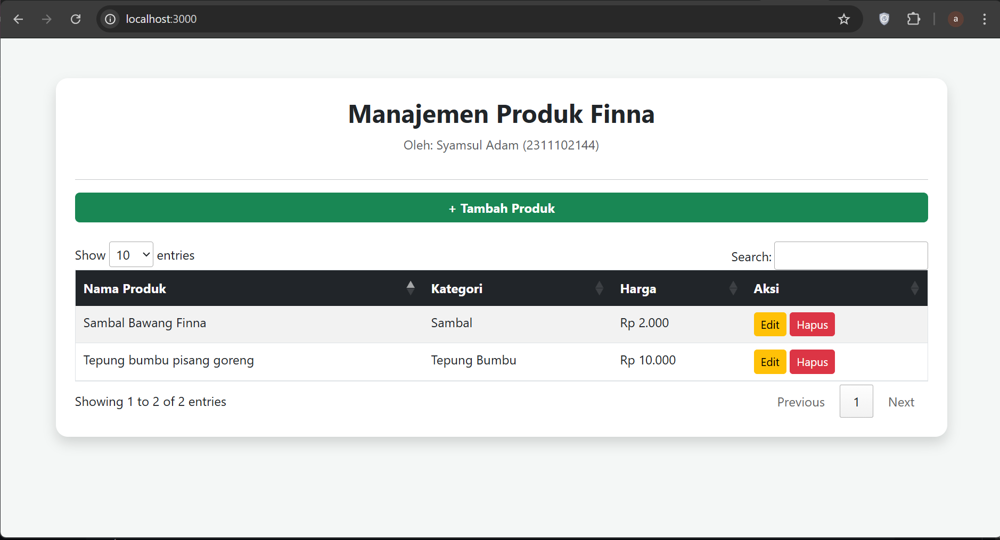
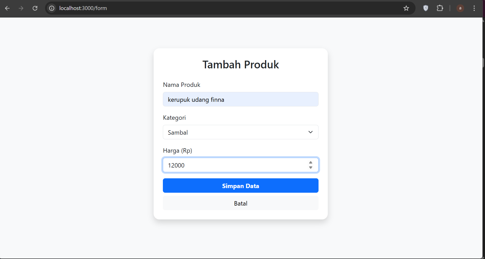
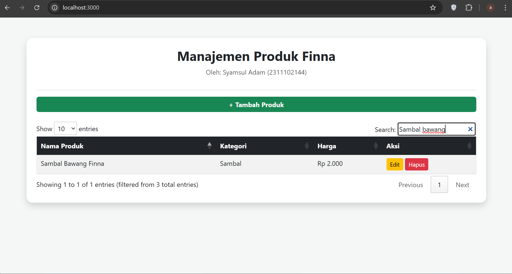
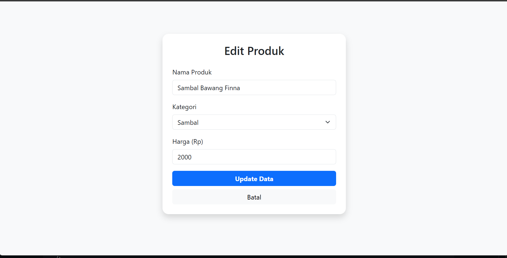
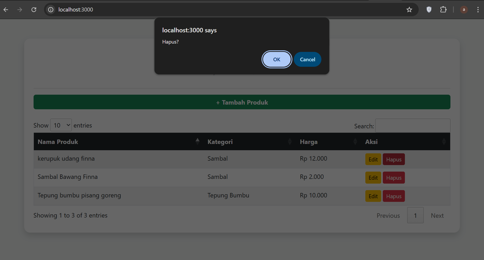

<div align="center">
  <br />
  <h1>LAPORAN PRAKTIKUM <br>APLIKASI BERBASIS PLATFORM</h1>
  <br />
  <h3>DATA PRODUK <br> Bootstrap, jQuery DataTables & JavaScript</h3>
  <br />
  <br />
  
  <br />
  <br />
  <h3>Disusun Oleh :</h3>
  <p>
    <strong>Syamsul Adam</strong><br>
    <strong>2311102144</strong><br>
    <strong>S1 IF-11-01</strong>
  </p>
  <br />
  <br />
  <h3>Dosen Pengampu :</h3>
  <p>
    <strong>Dimas Fanny Hebrasianto Permadi, S.ST., M.Kom</strong>
  </p>
  <br />
  <br />
  <h4>Asisten Praktikum :</h4>
  <strong>Apri Pandu Wicaksono</strong> <br>
  <strong>Rangga Pradarrell Fathi</strong>
  <br />
  <h3>LABORATORIUM HIGH PERFORMANCE
 <br>FAKULTAS INFORMATIKA <br>UNIVERSITAS TELKOM PURWOKERTO <br>2026</h3>
</div>

---

## Dasar Teori

**CRUD (Create, Read, Update, Delete)** merupakan empat operasi utama yang digunakan untuk mengelola data dalam sebuah aplikasi. Pada pengembangan aplikasi web, konsep CRUD digunakan agar pengguna dapat menambahkan data, menampilkan data, memperbarui data, serta menghapus data secara dinamis. Proses ini dapat dilakukan di sisi klien (*client-side*) dengan bantuan JavaScript tanpa harus melakukan komunikasi langsung dengan server.

**Bootstrap** adalah framework CSS bersifat open-source yang menyediakan berbagai komponen antarmuka siap pakai, seperti form, tombol, modal, serta sistem grid yang responsif. Dengan adanya kumpulan kelas utilitas yang sudah terstandarisasi, Bootstrap membantu mempercepat proses pembuatan desain antarmuka pada aplikasi web.

**jQuery DataTables** merupakan plugin berbasis jQuery yang berfungsi untuk meningkatkan fitur pada elemen `<table>` HTML. Dengan menggunakan plugin ini, tabel dapat memiliki fitur tambahan seperti pencarian data (*search*), pengurutan data berdasarkan kolom (*sorting*), serta pembagian halaman (*pagination*) secara otomatis hanya melalui satu baris proses inisialisasi.

**Object Mapping** adalah metode penyimpanan data pada JavaScript yang menggunakan struktur objek. Dalam metode ini, setiap data disimpan sebagai nilai (*value*) dengan kunci (*key*) yang bersifat unik sebagai penanda identitas. Contohnya seperti `{ "p1": { id, nama, kategori, harga } }`. Pendekatan ini memudahkan proses akses, pembaruan, maupun penghapusan data dengan kompleksitas waktu O(1).

---

## Kode


---

### Kode `index.ejs`

```html
<!DOCTYPE html>
<html lang="id">
<head>
    <meta charset="UTF-8">
    <title>Manajemen Produk | Adam</title>
    <link href="https://cdn.jsdelivr.net/npm/bootstrap@5.3.0/dist/css/bootstrap.min.css" rel="stylesheet">
    <link rel="stylesheet" href="https://cdn.datatables.net/1.13.6/css/jquery.dataTables.min.css">
    <style>
        body { background-color: #f4f7f6; }
        .card { border-radius: 15px; border: none; margin-top: 50px; }
    </style>
</head>
<body>
    <div class="container">
        <div class="card shadow p-4">
            <h2 class="text-center fw-bold">Manajemen Produk Finna</h2>
            <p class="text-center text-muted">Oleh: Syamsul Adam (2311102144)</p>
            <hr>
            <a href="/form" class="btn btn-success mb-4 w-100 fw-bold">+ Tambah Produk</a>
            
            <table id="productTable" class="table table-striped table-hover border" style="width:100%">
                <thead class="table-dark">
                    <tr>
                        <th>Nama Produk</th>
                        <th>Kategori</th>
                        <th>Harga</th>
                        <th>Aksi</th>
                    </tr>
                </thead>
            </table>
        </div>
    </div>

    <script src="https://code.jquery.com/jquery-3.7.0.min.js"></script>
    <script src="https://cdn.datatables.net/1.13.6/js/jquery.dataTables.min.js"></script>
    <script>
        $(document).ready(function() {
            $('#productTable').DataTable({
                "ajax": "/api/produk",
                "columns": [
                    { "data": "nama" },
                    { "data": "kategori" },
                    { "data": "harga", "render": (data) => "Rp " + Number(data).toLocaleString('id-ID') },
                    { 
                        "data": "id",
                        "render": function(data) {
                            return `
                                <a href="/form?id=${data}" class="btn btn-warning btn-sm">Edit</a>
                                <a href="/api/produk/delete/${data}" class="btn btn-danger btn-sm" onclick="return confirm('Hapus?')">Hapus</a>
                            `;
                        }
                    }
                ]
            });
        });
    </script>
</body>
</html>
```

---
### Penjelasan kode
---
Halaman index.ejs bertindak sebagai antarmuka utama pengguna untuk melihat seluruh daftar produk yang tersimpan. Halaman ini dibangun menggunakan kerangka kerja Bootstrap 5 untuk menjamin tampilan yang responsif dan estetika yang modern dengan komponen seperti card dan shadow. Fokus utama dari halaman ini adalah penyajian data yang rapi dan interaktif, sehingga memudahkan pengguna dalam memantau inventaris produk secara real-time.

Kecanggihan halaman ini terletak pada integrasi jQuery DataTables yang memproses data secara asinkron melalui AJAX. Sesuai dengan spesifikasi tugas, tabel ini tidak merender data secara statis, melainkan mengambil sumber data JSON dari endpoint API yang disediakan server. Hal ini memungkinkan fitur fitur kompleks seperti pencarian kata kunci, pengurutan kolom, dan pembatasan jumlah data per halaman (pagination) berjalan dengan sangat cepat tanpa perlu melakukan muat ulang (reload) pada seluruh halaman web.

---

### Kode `form.ejs`

```css
<!DOCTYPE html>
<html lang="id">
<head>
    <meta charset="UTF-8">
    <title>Form Produk | Adam</title>
    <link href="https://cdn.jsdelivr.net/npm/bootstrap@5.3.0/dist/css/bootstrap.min.css" rel="stylesheet">
</head>
<body class="bg-light">
    <div class="container" style="margin-top: 80px;">
        <div class="row justify-content-center">
            <div class="col-md-5">
                <div class="card shadow border-0 p-4" style="border-radius: 15px;">
                    <h3 class="text-center mb-4"><%= editData ? 'Edit Produk' : 'Tambah Produk' %></h3>
                    <form action="/api/produk" method="POST">
                        <input type="hidden" name="id" value="<%= editData ? editData.id : '' %>">
                        
                        <div class="mb-3">
                            <label class="form-label">Nama Produk</label>
                            <input type="text" name="nama" class="form-control" value="<%= editData ? editData.nama : '' %>" required>
                        </div>
                        <div class="mb-3">
                            <label class="form-label">Kategori</label>
                            <select name="kategori" class="form-select">
                                <% ['Sambal', 'Kerupuk', 'Tepung Bumbu'].forEach(cat => { %>
                                    <option value="<%= cat %>" <%= editData && editData.kategori == cat ? 'selected' : '' %>><%= cat %></option>
                                <% }) %>
                            </select>
                        </div>
                        <div class="mb-3">
                            <label class="form-label">Harga (Rp)</label>
                            <input type="number" name="harga" class="form-control" value="<%= editData ? editData.harga : '' %>" required>
                        </div>
                        <div class="d-grid gap-2">
                            <button type="submit" class="btn btn-primary fw-bold">
                                <%= editData ? 'Update Data' : 'Simpan Data' %>
                            </button>
                            <a href="/" class="btn btn-light">Batal</a>
                        </div>
                    </form>
                </div>
            </div>
        </div>
    </div>
</body>
</html>
```
### Penjelasan Kode
---

Halaman form.ejs adalah komponen frontend yang dirancang secara fleksibel untuk menangani dua fungsi sekaligus, yaitu penambahan data baru dan pembaruan data yang sudah ada. Dengan memanfaatkan logika templating EJS, formulir ini dapat secara cerdas mendeteksi konteks penggunaan; jika terdapat data kiriman dari server, maka kolom-kolom input akan terisi secara otomatis (auto fill). Penggunaan elemen UI Bootstrap pada form ini memastikan navigasi input terasa intuitif bagi pengguna.

Secara teknis, formulir ini menggunakan metode POST untuk mengirimkan data ke server guna menjamin keamanan dan integritas informasi. Terdapat penggunaan hidden input untuk menyimpan ID produk, yang berfungsi sebagai pengenal unik agar server tidak salah sasaran saat melakukan pembaruan data di file JSON. Selain itu, penggunaan atribut validasi HTML5 pada setiap field memastikan bahwa hanya data dengan format yang benar seperti harga dalam bentuk angka yang dapat diproses lebih lanjut oleh sistem.

---

---

### Kode server (`server.js`)

```javascript
const express = require('express');
const fs = require('fs');
const path = require('path');
const app = express();

app.set('view engine', 'ejs');
app.use(express.json());
app.use(express.urlencoded({ extended: true }));

const DATA_FILE = './data.json';

// Fungsi baca/tulis data
const readData = () => {
    try {
        return JSON.parse(fs.readFileSync(DATA_FILE, 'utf8'));
    } catch (err) {
        return [];
    }
};
const writeData = (data) => fs.writeFileSync(DATA_FILE, JSON.stringify(data, null, 2));

// --- ROUTES ---

// 1. READ (Halaman Utama)
app.get('/', (req, res) => res.render('index'));

// 2. CREATE & UPDATE (Halaman Form)
app.get('/form', (req, res) => {
    const id = req.query.id;
    let editData = null;
    if (id) {
        const products = readData();
        editData = products.find(p => p.id == id);
    }
    res.render('form', { editData });
});

// API JSON untuk DataTables
app.get('/api/produk', (req, res) => {
    res.json({ data: readData() });
});

// Proses Simpan (Create & Update)
app.post('/api/produk', (req, res) => {
    let products = readData();
    const { id, nama, kategori, harga } = req.body;

    if (id) { // Jika ada ID, berarti UPDATE
        const index = products.findIndex(p => p.id == id);
        if (index !== -1) {
            products[index] = { id: parseInt(id), nama, kategori, harga: parseInt(harga) };
        }
    } else { // Jika tidak ada ID, berarti CREATE
        products.push({ id: Date.now(), nama, kategori, harga: parseInt(harga) });
    }
    
    writeData(products);
    res.redirect('/');
});

// 3. DELETE
app.get('/api/produk/delete/:id', (req, res) => {
    let products = readData();
    products = products.filter(p => p.id != req.params.id);
    writeData(products);
    res.redirect('/');
});

app.listen(3000, () => console.log('Server running: http://localhost:3000'));
```
### Penjelasan Kode
File server.js merupakan inti dari aplikasi yang berfungsi sebagai web server menggunakan framework Express.js. Di dalam file ini, dikonfigurasi berbagai middleware penting seperti express.json() dan express.urlencoded() yang bertugas memproses kiriman data dari formulir pengguna. Selain itu, file ini mengatur view engine menggunakan EJS (Embedded JavaScript), sehingga server dapat merender halaman HTML secara dinamis sebelum dikirimkan ke browser pengguna.

Dari sisi fungsionalitas, server.js mengelola seluruh logika bisnis dan interaksi data dengan file data.json. Server menyediakan beberapa endpoint utama, termasuk API /api/produk yang menyajikan data dalam format JSON murni untuk kebutuhan plugin DataTables. Logika CRUD diimplementasikan secara sistematis, di mana server mampu membedakan operasi Create dan Update berdasarkan keberadaan ID unik, serta melakukan operasi Delete melalui parameter URL yang dikirimkan oleh client.

---

### Hasil Tampilan (Screenshot)

#### 1. Tampilan Awal Halaman



#### 2. Input Data & Data Berhasil Ditambahkan



#### 3. Fitur Pencarian (Search)



#### 4. Edit Data



#### 5. Hapus Data



---

### Link Vidio presentasi
- (https://drive.google.com/drive/folders/1tnUUFFjBZ7QZ5L1woQYg2K0TvCER9XZR?usp=sharing)


## 3. Referensi

- [Bootstrap 5 Documentation](https://getbootstrap.com/docs/5.3/)
- [jQuery DataTables Documentation](https://datatables.net/manual/)
- [Bootstrap Icons](https://icons.getbootstrap.com/)
- [MDN Web Docs — JavaScript Array & Object Methods](https://developer.mozilla.org/en-US/docs/Web/JavaScript)
- [Google Fonts — Plus Jakarta Sans](https://fonts.google.com/specimen/Plus+Jakarta+Sans)
