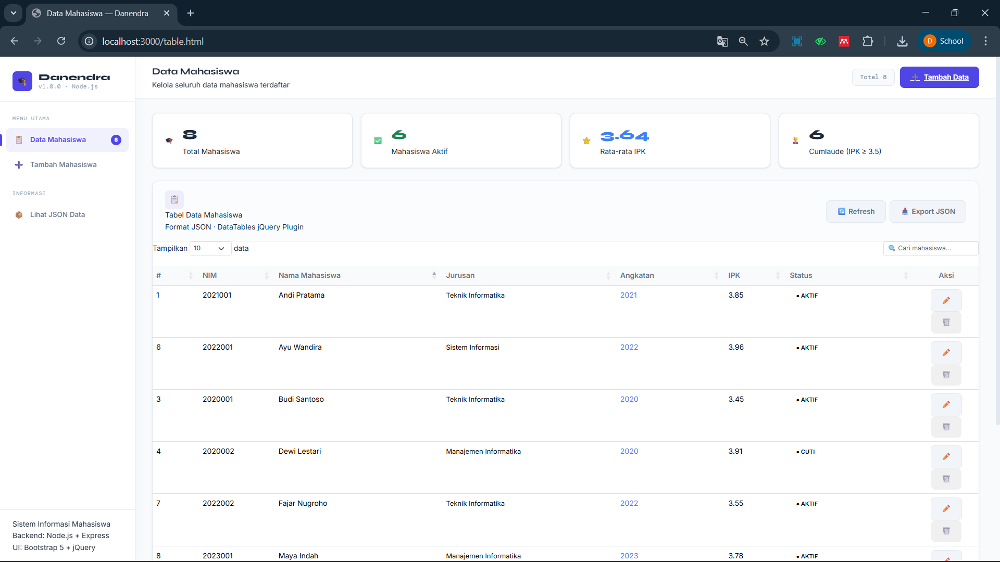
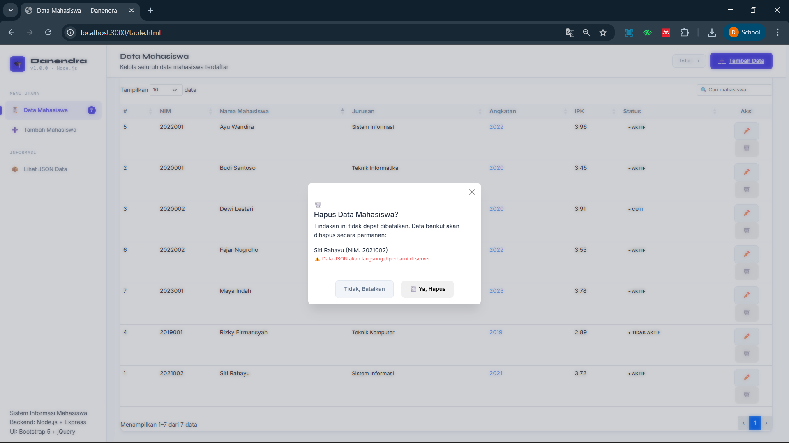

<div align="center">
  <br />
  <h1>LAPORAN PRAKTIKUM <br>APLIKASI BERBASIS PLATFORM</h1>
  <br />
  <h3>TUGAS COTS 2 <br> NODE.JS & EXPRESS.JS</h3>
  <br />
  <br />
   
  <br />
  <br />
  <br />
  <br />
  <h3>Disusun Oleh :</h3>
  <p>
    <strong>DANENDRA ARDEN SHADUQ</strong><br>
    <strong>2311102146</strong><br>
    <strong>S1 IF-11-REG01</strong>
  </p>
  <br />
  <br />
  <h3>Dosen Pengampu :</h3>
  <p>
    <strong>Dimas Fanny Hebrasianto Permadi, S.ST., M.Kom</strong>
  </p>
  <br />
  <br />
    <h4>Asisten Praktikum :</h4>
    <strong> Apri Pandu Wicaksono </strong> <br>
    <strong>Rangga Pradarrell Fathi</strong>
  <br />
  <h3>LABORATORIUM HIGH PERFORMANCE
 <br>FAKULTAS INFORMATIKA <br>UNIVERSITAS TELKOM PURWOKERTO <br>2026</h3>
</div>

---

## 1. Dasar Teori

Dalam pembuatan aplikasi inventori berbasis web ini, terdapat beberapa teknologi dan konsep dasar yang digunakan:

1. **Node.js & Express.js:** Node.js adalah lingkungan eksekusi untuk JavaScript di sisi backend. Express.js adalah framework minimalis di atas Node.js yang mempermudah kita bikin routing (URL) dan membuat REST API secara cepat.
2. **REST API (Representational State Transfer):** Arsitektur komunikasi yang menjembatani antara tampilan depan (Frontend) dengan server (Backend). Data yang dikirim dan diterima biasanya pakai format teks JSON.
3. **JSON (JavaScript Object Notation):** Format file yang ringan dan gampang dibaca manusia purba maupun komputer, biasa dipakai untuk nyimpen data dan tukar-menukar informasi. Di project ini, JSON dipakai seakan-akan sebagai database utamanya.
4. **AJAX / API Fetch:** Teknik di JavaScript buat ambil atau kirim data ke server secara diam-diam (di balik layar) tanpa perlu nge-refresh seluruh halaman web. Di sini kita pakai library `jQuery` (syntax `$.ajax`) biar codingannya lebih singkat.
5. **Bootstrap 5:** Framework CSS dan HTML siap pakai supaya bisa bikin tampilan website yang responsif dan kelihatan modern tanpa perlu nulis kode CSS yang panjang banget.

---

## 2. Penjelasan Kode HTML, CSS, JSON, dan JS

### 1. `server.js`

```javascript
const express = require('express');
const fs = require('fs');
const path = require('path');
const { v4: uuidv4 } = require('uuid');

const app = express();
const PORT = 3000;
const DATA_FILE = path.join(__dirname, 'data', 'mahasiswa.json');

// ─── Middleware ────────────────────────────────────────────────────────────────
app.use(express.json());
app.use(express.urlencoded({ extended: true }));
app.use(express.static(path.join(__dirname, 'public')));

// ─── Helper: Read & Write JSON ─────────────────────────────────────────────────
function readData() {
  try {
    const raw = fs.readFileSync(DATA_FILE, 'utf-8');
    return JSON.parse(raw);
  } catch {
    return [];
  }
}

function writeData(data) {
  fs.writeFileSync(DATA_FILE, JSON.stringify(data, null, 2), 'utf-8');
}

// ─── API Routes ────────────────────────────────────────────────────────────────

// GET all mahasiswa
app.get('/api/mahasiswa', (req, res) => {
  const data = readData();
  res.json({ success: true, data });
});

// GET single mahasiswa by id
app.get('/api/mahasiswa/:id', (req, res) => {
  const data = readData();
  const item = data.find(d => d.id === req.params.id);
  if (!item) return res.status(404).json({ success: false, message: 'Data tidak ditemukan' });
  res.json({ success: true, data: item });
});

// POST create mahasiswa
app.post('/api/mahasiswa', (req, res) => {
  const { nim, nama, jurusan, angkatan, ipk, status } = req.body;

  if (!nim || !nama || !jurusan || !angkatan || !ipk || !status) {
    return res.status(400).json({ success: false, message: 'Semua field wajib diisi' });
  }

  const data = readData();

  // Check duplicate NIM
  if (data.find(d => d.nim === nim)) {
    return res.status(409).json({ success: false, message: 'NIM sudah terdaftar' });
  }

  const newItem = {
    id: uuidv4(),
    nim,
    nama,
    jurusan,
    angkatan: parseInt(angkatan),
    ipk: parseFloat(ipk),
    status,
    createdAt: new Date().toISOString()
  };

  data.push(newItem);
  writeData(data);
  res.status(201).json({ success: true, message: 'Data berhasil ditambahkan', data: newItem });
});

// PUT update mahasiswa
app.put('/api/mahasiswa/:id', (req, res) => {
  const { nim, nama, jurusan, angkatan, ipk, status } = req.body;
  const data = readData();
  const idx = data.findIndex(d => d.id === req.params.id);

  if (idx === -1) return res.status(404).json({ success: false, message: 'Data tidak ditemukan' });

  // Check duplicate NIM (exclude self)
  const duplicate = data.find(d => d.nim === nim && d.id !== req.params.id);
  if (duplicate) {
    return res.status(409).json({ success: false, message: 'NIM sudah digunakan oleh mahasiswa lain' });
  }

  data[idx] = {
    ...data[idx],
    nim,
    nama,
    jurusan,
    angkatan: parseInt(angkatan),
    ipk: parseFloat(ipk),
    status,
    updatedAt: new Date().toISOString()
  };

  writeData(data);
  res.json({ success: true, message: 'Data berhasil diperbarui', data: data[idx] });
});

// DELETE mahasiswa
app.delete('/api/mahasiswa/:id', (req, res) => {
  const data = readData();
  const idx = data.findIndex(d => d.id === req.params.id);

  if (idx === -1) return res.status(404).json({ success: false, message: 'Data tidak ditemukan' });

  const deleted = data.splice(idx, 1)[0];
  writeData(data);
  res.json({ success: true, message: 'Data berhasil dihapus', data: deleted });
});

// ─── Root Redirect ─────────────────────────────────────────────────────────────
app.get('/', (req, res) => {
  res.redirect('/table.html');
});

// ─── Start Server ──────────────────────────────────────────────────────────────
app.listen(PORT, () => {
  console.log(`\n🚀  Server berjalan di http://localhost:${PORT}`);
  console.log(`📋  Halaman Tabel  → http://localhost:${PORT}/table.html`);
  console.log(`📝  Halaman Form   → http://localhost:${PORT}/form.html\n`);
});
```

**Penjelasan:**
Kode di atas merupakan implementasi **RESTful API** sederhana menggunakan framework **Express.js** untuk mengelola data mahasiswa (CRUD). Aplikasi ini menggunakan sistem penyimpanan berbasis file, di mana data disimpan dalam format JSON pada file `mahasiswa.json`. Untuk mendukung operasionalnya, kode tersebut mengintegrasikan beberapa pustaka penting seperti `fs` untuk manipulasi sistem file, `path` untuk penanganan lokasi direktori, dan `uuid` untuk menghasilkan pengenal unik (ID) secara otomatis pada setiap data baru yang masuk.

Pada bagian awal, server dikonfigurasi dengan **middleware** untuk memproses data dalam format JSON dan URL-encoded dari permintaan klien, serta menyediakan akses ke file statis (seperti HTML dan CSS) melalui folder `public`. Terdapat dua fungsi pembantu utama, yaitu `readData` untuk mengambil data dari file JSON dengan penanganan kesalahan (error handling) sederhana, dan `writeData` untuk memperbarui isi file tersebut setiap kali ada perubahan data. Struktur ini memastikan bahwa meskipun server dimatikan, data mahasiswa yang telah diinput tetap tersimpan secara permanen.

Inti dari aplikasi ini terletak pada rute-rute API yang menangani lima operasi utama. Rute **GET** digunakan untuk mengambil seluruh daftar mahasiswa atau mencari satu mahasiswa spesifik berdasarkan ID. Rute **POST** bertugas memvalidasi data baru, memeriksa apakah NIM sudah terdaftar untuk menghindari duplikasi, kemudian menyimpannya ke dalam sistem. Sementara itu, rute **PUT** dan **DELETE** masing-masing berfungsi untuk memperbarui informasi mahasiswa yang sudah ada dan menghapus data berdasarkan ID unik mereka. Terakhir, server secara otomatis akan mengarahkan pengguna yang mengakses akar URL (`/`) ke halaman antarmuka tabel (`table.html`) dan berjalan pada port 3000 dengan log informasi yang muncul di terminal.

### 2. `mahasiswa.json`

```json
[
  {
    "id": "550e8400-e29b-41d4-a716-446655440001",
    "nim": "2021001",
    "nama": "Andi Pratama",
    "jurusan": "Teknik Informatika",
    "angkatan": 2021,
    "ipk": 3.85,
    "status": "Aktif",
    "createdAt": "2024-01-10T08:00:00.000Z"
  },
  {
    "id": "550e8400-e29b-41d4-a716-446655440002",
    "nim": "2021002",
    "nama": "Siti Rahayu",
    "jurusan": "Sistem Informasi",
    "angkatan": 2021,
    "ipk": 3.72,
    "status": "Aktif",
    "createdAt": "2024-01-10T08:05:00.000Z"
  },
  {
    "id": "550e8400-e29b-41d4-a716-446655440003",
    "nim": "2020001",
    "nama": "Budi Santoso",
    "jurusan": "Teknik Informatika",
    "angkatan": 2020,
    "ipk": 3.45,
    "status": "Aktif",
    "createdAt": "2024-01-10T08:10:00.000Z"
  },
  {
    "id": "550e8400-e29b-41d4-a716-446655440004",
    "nim": "2020002",
    "nama": "Dewi Lestari",
    "jurusan": "Manajemen Informatika",
    "angkatan": 2020,
    "ipk": 3.91,
    "status": "Cuti",
    "createdAt": "2024-01-10T08:15:00.000Z"
  },
  {
    "id": "550e8400-e29b-41d4-a716-446655440005",
    "nim": "2019001",
    "nama": "Rizky Firmansyah",
    "jurusan": "Teknik Komputer",
    "angkatan": 2019,
    "ipk": 2.89,
    "status": "Tidak Aktif",
    "createdAt": "2024-01-10T08:20:00.000Z"
  },
  {
    "id": "550e8400-e29b-41d4-a716-446655440006",
    "nim": "2022001",
    "nama": "Ayu Wandira",
    "jurusan": "Sistem Informasi",
    "angkatan": 2022,
    "ipk": 3.96,
    "status": "Aktif",
    "createdAt": "2024-01-10T08:25:00.000Z"
  },
  {
    "id": "550e8400-e29b-41d4-a716-446655440007",
    "nim": "2022002",
    "nama": "Fajar Nugroho",
    "jurusan": "Teknik Informatika",
    "angkatan": 2022,
    "ipk": 3.55,
    "status": "Aktif",
    "createdAt": "2024-01-10T08:30:00.000Z"
  },
  {
    "id": "550e8400-e29b-41d4-a716-446655440008",
    "nim": "2023001",
    "nama": "Maya Indah",
    "jurusan": "Manajemen Informatika",
    "angkatan": 2023,
    "ipk": 3.78,
    "status": "Aktif",
    "createdAt": "2024-01-10T08:35:00.000Z"
  }
]
```

**Penjelasan:**
Data di atas merupakan contoh isi dari file `mahasiswa.json` yang berfungsi sebagai basis data (database) sederhana bagi aplikasi tersebut. Data tersebut disusun dalam format **array of objects**, di mana setiap objek mewakili satu profil mahasiswa dengan atribut yang lengkap. Setiap entri memiliki pengenal unik berupa `id` dalam format UUID (Universally Unique Identifier) untuk memastikan tidak ada konflik data, serta `nim` (Nomor Induk Mahasiswa) yang berfungsi sebagai identitas akademik utama. 

Selain identitas dasar seperti `nama` dan `jurusan`, terdapat informasi numerik berupa `angkatan` dan `ipk` (Indeks Prestasi Kumulatif). Sebagai contoh, terdapat mahasiswa dengan $IPK = 3.96$ dan $IPK = 2.89$, yang menunjukkan variasi performa akademik dalam data tersebut. Setiap record juga dilengkapi dengan label `status` untuk memantau kondisi aktif tidaknya mahasiswa (seperti "Aktif", "Cuti", atau "Tidak Aktif") serta metadata `createdAt` yang mencatat waktu tepat saat data tersebut pertama kali dimasukkan ke dalam sistem. Struktur data yang rapi ini memungkinkan aplikasi Express.js untuk melakukan pencarian, penyaringan, dan pembaruan informasi secara efisien.

### 3. `table.html`

```html
<!DOCTYPE html>
<html lang="id">
<head>
  <meta charset="UTF-8">
  <meta name="viewport" content="width=device-width, initial-scale=1.0">
  <title>Data Mahasiswa — Danendra</title>

  <!-- Bootstrap 5 -->
  <link href="https://cdn.jsdelivr.net/npm/bootstrap@5.3.2/dist/css/bootstrap.min.css" rel="stylesheet">
  <!-- DataTables -->
  <link href="https://cdn.datatables.net/1.13.8/css/dataTables.bootstrap5.min.css" rel="stylesheet">
  <!-- Custom CSS -->
  <link href="css/style.css" rel="stylesheet">
</head>
<body>

<!-- Toast Container -->
<div id="toastContainer" class="toast-container-custom"></div>

<div class="app-wrapper">

  <!-- ── Sidebar ────────────────────────────────────────────────── -->
  <aside class="sidebar" id="sidebar">
    <div class="sidebar-brand">
      <a href="/table.html" class="brand-logo" style="text-decoration:none;">
        <div class="brand-icon">🎓</div>
        <div class="brand-text">
          Danendra
          <span>v1.0.0 · Node.js</span>
        </div>
      </a>
    </div>

    <nav class="sidebar-nav">
      <div class="nav-section-label">Menu Utama</div>
      <a href="/table.html" class="nav-item">
        <span class="nav-icon">📋</span>
        Data Mahasiswa
        <span class="nav-badge" id="navBadge">—</span>
      </a>
      <a href="/form.html" class="nav-item">
        <span class="nav-icon">➕</span>
        Tambah Mahasiswa
      </a>

      <div class="nav-section-label" style="margin-top:16px;">Informasi</div>
      <a href="#" class="nav-item" id="btnJsonPreview">
        <span class="nav-icon">📦</span>
        Lihat JSON Data
      </a>
    </nav>

    <div class="sidebar-footer">
      <div class="sidebar-footer-text">
        Sistem Informasi Mahasiswa<br>
        Backend: Node.js + Express<br>
        UI: Bootstrap 5 + jQuery
      </div>
    </div>
  </aside>

  <!-- ── Main Content ───────────────────────────────────────────── -->
  <main class="main-content">

    <!-- Topbar -->
    <header class="topbar">
      <div>
        <div class="topbar-title">Data Mahasiswa</div>
        <div class="topbar-subtitle">Kelola seluruh data mahasiswa terdaftar</div>
      </div>
      <div class="topbar-actions">
        <div class="topbar-stat">
          <span>Total</span>
          <span class="stat-val" id="topbarTotal">—</span>
        </div>
        <a href="/form.html" class="btn-custom btn-primary-custom">
          <span>➕</span> Tambah Data
        </a>
      </div>
    </header>

    <!-- Page Body -->
    <div class="page-body">

      <!-- Stats Cards -->
      <div class="stats-grid">
        <div class="stat-card">
          <div class="stat-card-icon amber">🎓</div>
          <div class="stat-card-info">
            <div class="stat-card-value text-accent" id="statTotal">—</div>
            <div class="stat-card-label">Total Mahasiswa</div>
          </div>
        </div>
        <div class="stat-card">
          <div class="stat-card-icon green">✅</div>
          <div class="stat-card-info">
            <div class="stat-card-value text-success" id="statAktif">—</div>
            <div class="stat-card-label">Mahasiswa Aktif</div>
          </div>
        </div>
        <div class="stat-card">
          <div class="stat-card-icon blue">⭐</div>
          <div class="stat-card-info">
            <div class="stat-card-value" style="color:var(--info)" id="statIPK">—</div>
            <div class="stat-card-label">Rata-rata IPK</div>
          </div>
        </div>
        <div class="stat-card">
          <div class="stat-card-icon red">🏆</div>
          <div class="stat-card-info">
            <div class="stat-card-value text-accent" id="statCumlaude">—</div>
            <div class="stat-card-label">Cumlaude (IPK ≥ 3.5)</div>
          </div>
        </div>
      </div>

      <!-- Table Card -->
      <div class="card-custom" style="position:relative;">
        <div id="tableLoadingOverlay" class="loading-overlay">
          <div class="spinner-custom"></div>
        </div>

        <div class="card-header-custom">
          <div class="card-header-left">
            <div class="card-header-icon">📋</div>
            <div>
              <div class="card-title-custom">Tabel Data Mahasiswa</div>
              <div class="card-subtitle-custom">Format JSON · DataTables jQuery Plugin</div>
            </div>
          </div>
          <div class="d-flex gap-2">
            <button class="btn-custom btn-secondary-custom btn-sm-custom" id="btnRefresh">
              🔄 Refresh
            </button>
            <button class="btn-custom btn-secondary-custom btn-sm-custom" id="btnExportJSON">
              📥 Export JSON
            </button>
          </div>
        </div>

        <div class="datatable-wrapper">
          <table id="mahasiswaTable" class="table" style="width:100%">
            <thead>
              <tr>
                <th>#</th>
                <th>NIM</th>
                <th>Nama Mahasiswa</th>
                <th>Jurusan</th>
                <th>Angkatan</th>
                <th>IPK</th>
                <th>Status</th>
                <th style="width:110px; text-align:center;">Aksi</th>
              </tr>
            </thead>
            <tbody id="tableBody">
              <!-- Filled by DataTables + jQuery -->
            </tbody>
          </table>
        </div>
      </div>

    </div><!-- /page-body -->
  </main>
</div><!-- /app-wrapper -->

<!-- ────────────────────────────────────────────────────────────────
  MODAL: Edit Mahasiswa
──────────────────────────────────────────────────────────────── -->
<div class="modal fade modal-custom" id="editModal" tabindex="-1">
  <div class="modal-dialog modal-lg modal-dialog-centered">
    <div class="modal-content">
      <div class="modal-header">
        <div>
          <h5 class="modal-title">✏️ Edit Data Mahasiswa</h5>
          <div style="font-size:12px;color:var(--text-muted);font-family:'DM Mono',monospace;margin-top:3px;">
            ID: <span id="editModalId" class="text-accent">—</span>
          </div>
        </div>
        <button type="button" class="btn-close" data-bs-dismiss="modal"></button>
      </div>
      <div class="modal-body">
        <form id="editForm" novalidate>
          <input type="hidden" id="editId">

          <div class="form-row">
            <div class="mb-field">
              <label class="form-label-custom">NIM <span class="required">*</span></label>
              <input type="text" id="editNim" class="form-control-custom"
                     data-required data-type="nim"
                     placeholder="Contoh: 2021001">
              <div class="invalid-feedback-custom">NIM harus angka 5–15 digit</div>
            </div>
            <div class="mb-field">
              <label class="form-label-custom">Nama Lengkap <span class="required">*</span></label>
              <input type="text" id="editNama" class="form-control-custom"
                     data-required placeholder="Masukkan nama lengkap">
              <div class="invalid-feedback-custom">Nama tidak boleh kosong</div>
            </div>
          </div>

          <div class="mb-field">
            <label class="form-label-custom">Jurusan <span class="required">*</span></label>
            <select id="editJurusan" class="form-select-custom" data-required>
              <option value="">-- Pilih Jurusan --</option>
              <option>Teknik Informatika</option>
              <option>Sistem Informasi</option>
              <option>Manajemen Informatika</option>
              <option>Teknik Komputer</option>
              <option>Ilmu Komputer</option>
              <option>Rekayasa Perangkat Lunak</option>
            </select>
            <div class="invalid-feedback-custom">Jurusan wajib dipilih</div>
          </div>

          <div class="form-row-3">
            <div class="mb-field">
              <label class="form-label-custom">Angkatan <span class="required">*</span></label>
              <input type="number" id="editAngkatan" class="form-control-custom"
                     data-required data-type="angkatan"
                     placeholder="2021" min="2000" max="2030">
              <div class="invalid-feedback-custom">Tahun angkatan tidak valid</div>
            </div>
            <div class="mb-field">
              <label class="form-label-custom">IPK <span class="required">*</span></label>
              <input type="number" id="editIpk" class="form-control-custom"
                     data-required data-type="ipk"
                     placeholder="3.50" step="0.01" min="0" max="4">
              <div class="invalid-feedback-custom">IPK harus antara 0.00 – 4.00</div>
            </div>
            <div class="mb-field">
              <label class="form-label-custom">Status <span class="required">*</span></label>
              <select id="editStatus" class="form-select-custom" data-required>
                <option value="">-- Pilih --</option>
                <option>Aktif</option>
                <option>Cuti</option>
                <option>Tidak Aktif</option>
              </select>
              <div class="invalid-feedback-custom">Status wajib dipilih</div>
            </div>
          </div>
        </form>
      </div>
      <div class="modal-footer">
        <button type="button" class="btn-custom btn-secondary-custom" data-bs-dismiss="modal">
          Batal
        </button>
        <button type="button" class="btn-custom btn-primary-custom" id="btnSaveEdit">
          💾 Simpan Perubahan
        </button>
      </div>
    </div>
  </div>
</div>

<!-- ────────────────────────────────────────────────────────────────
  MODAL: Confirm Delete
──────────────────────────────────────────────────────────────── -->
<div class="modal fade modal-custom" id="deleteModal" tabindex="-1">
  <div class="modal-dialog modal-dialog-centered" style="max-width:420px;">
    <div class="modal-content">
      <div class="modal-header" style="border:none;padding-bottom:0;">
        <button type="button" class="btn-close" data-bs-dismiss="modal"></button>
      </div>
      <div class="modal-body">
        <div class="delete-warning">
          <span class="warning-icon">🗑️</span>
          <h5>Hapus Data Mahasiswa?</h5>
          <p>Tindakan ini tidak dapat dibatalkan. Data berikut akan dihapus secara permanen:</p>
          <div class="delete-target" id="deleteTargetInfo">—</div>
          <p style="font-size:12px;color:var(--danger);">⚠️ Data JSON akan langsung diperbarui di server.</p>
        </div>
      </div>
      <div class="modal-footer" style="justify-content:center;gap:12px;">
        <button type="button" class="btn-custom btn-secondary-custom" data-bs-dismiss="modal">
          Tidak, Batalkan
        </button>
        <button type="button" class="btn-custom btn-danger-custom" id="btnConfirmDelete">
          🗑️ Ya, Hapus
        </button>
      </div>
    </div>
  </div>
</div>

<!-- ────────────────────────────────────────────────────────────────
  MODAL: JSON Preview
──────────────────────────────────────────────────────────────── -->
<div class="modal fade modal-custom" id="jsonModal" tabindex="-1">
  <div class="modal-dialog modal-xl modal-dialog-centered modal-dialog-scrollable">
    <div class="modal-content">
      <div class="modal-header">
        <h5 class="modal-title">📦 JSON Data Preview</h5>
        <button type="button" class="btn-close" data-bs-dismiss="modal"></button>
      </div>
      <div class="modal-body" style="padding:0;">
        <pre id="jsonPreviewContent"
             style="background:var(--bg-primary);color:var(--success);
                    padding:24px;margin:0;font-family:'DM Mono',monospace;
                    font-size:12.5px;line-height:1.7;max-height:70vh;
                    overflow:auto;border-radius:0 0 12px 12px;"></pre>
      </div>
    </div>
  </div>
</div>

<!-- ────────────────────────────────────────────────────────────────
  SCRIPTS
──────────────────────────────────────────────────────────────── -->
<!-- jQuery -->
<script src="https://code.jquery.com/jquery-3.7.1.min.js"></script>
<!-- DataTables -->
<script src="https://cdn.datatables.net/1.13.8/js/jquery.dataTables.min.js"></script>
<script src="https://cdn.datatables.net/1.13.8/js/dataTables.bootstrap5.min.js"></script>
<!-- Bootstrap Bundle -->
<script src="https://cdn.jsdelivr.net/npm/bootstrap@5.3.2/dist/js/bootstrap.bundle.min.js"></script>
<!-- App Utilities -->
<script src="js/app.js"></script>

<script>
$(function () {

  // ─── State ──────────────────────────────────────────────────────────
  let dataTable  = null;
  let allData    = [];
  let deleteId   = null;

  // ─── Init DataTable ──────────────────────────────────────────────────
  dataTable = $('#mahasiswaTable').DataTable({
    data: [],
    columns: [
      {
        data: null,
        className: 'font-mono text-muted-custom',
        render: (data, type, row, meta) => meta.row + 1
      },
      {
        data: 'nim',
        render: nim => `<span class="nim-mono">${nim}</span>`
      },
      { data: 'nama' },
      {
        data: 'jurusan',
        render: j => `<span style="font-size:13px;">${j}</span>`
      },
      {
        data: 'angkatan',
        className: 'font-mono',
        render: y => `<span style="color:var(--info)">${y}</span>`
      },
      {
        data: 'ipk',
        render: ipk => `<span class="ipk-chip ${getIPKClass(ipk)}">${parseFloat(ipk).toFixed(2)}</span>`
      },
      {
        data: 'status',
        render: status => getStatusBadge(status)
      },
      {
        data: null,
        orderable: false,
        className: 'text-center',
        render: (data, type, row) => `
          <div class="action-group" style="justify-content:center;">
            <button class="btn-custom btn-secondary-custom btn-icon btn-edit"
                    data-id="${row.id}" title="Edit">✏️</button>
            <button class="btn-custom btn-danger-custom btn-icon btn-delete"
                    data-id="${row.id}" data-nama="${row.nama}" data-nim="${row.nim}"
                    title="Hapus">🗑️</button>
          </div>`
      }
    ],
    language: {
      search:           '_INPUT_',
      searchPlaceholder:'🔍 Cari mahasiswa...',
      lengthMenu:       'Tampilkan _MENU_ data',
      info:             'Menampilkan _START_–_END_ dari _TOTAL_ data',
      infoEmpty:        'Tidak ada data',
      infoFiltered:     '(difilter dari _MAX_ total)',
      paginate: {
        first:    '«', last: '»',
        previous: '‹', next: '›'
      },
      emptyTable:  'Belum ada data mahasiswa',
      zeroRecords: 'Data tidak ditemukan'
    },
    pageLength: 10,
    lengthMenu: [[5, 10, 25, 50, -1], [5, 10, 25, 50, 'Semua']],
    order: [[2, 'asc']],
    drawCallback: bindActionButtons,
    dom: "<'row mb-3'<'col-sm-12 col-md-6'l><'col-sm-12 col-md-6'f>>" +
         "<'row'<'col-sm-12'tr>>" +
         "<'row mt-3'<'col-sm-12 col-md-5'i><'col-sm-12 col-md-7 d-flex justify-content-end'p>>"
  });

  // ─── Load Data from API → JSON → DataTables ──────────────────────────
  function loadData() {
    $('#tableLoadingOverlay').show();

    API.getAll()
      .done(function (res) {
        if (!res.success) return;

        allData = res.data; // JSON array

        // Clear & reload DataTable with JSON data
        dataTable.clear();
        dataTable.rows.add(allData);
        dataTable.draw();

        updateStats(allData);
        $('#navBadge').text(allData.length);
        $('#topbarTotal').text(allData.length);
      })
      .fail(function () {
        showToast('danger', 'Gagal Memuat', 'Tidak dapat mengambil data dari server.');
      })
      .always(function () {
        $('#tableLoadingOverlay').hide();
      });
  }

  // ─── Update Statistics ────────────────────────────────────────────────
  function updateStats(data) {
    const total    = data.length;
    const aktif    = data.filter(d => d.status === 'Aktif').length;
    const avgIPK   = total ? (data.reduce((s, d) => s + d.ipk, 0) / total).toFixed(2) : '0.00';
    const cumlaude = data.filter(d => d.ipk >= 3.5).length;

    $('#statTotal').text(total);
    $('#statAktif').text(aktif);
    $('#statIPK').text(avgIPK);
    $('#statCumlaude').text(cumlaude);
  }

  // ─── Bind Action Buttons (after each DataTable draw) ─────────────────
  function bindActionButtons() {
    // Edit
    $('#mahasiswaTable').off('click', '.btn-edit').on('click', '.btn-edit', function () {
      const id = $(this).data('id');
      openEditModal(id);
    });

    // Delete
    $('#mahasiswaTable').off('click', '.btn-delete').on('click', '.btn-delete', function () {
      deleteId = $(this).data('id');
      const nama = $(this).data('nama');
      const nim  = $(this).data('nim');
      $('#deleteTargetInfo').text(`${nama}  (NIM: ${nim})`);
      new bootstrap.Modal('#deleteModal').show();
    });
  }

  // ─── Open Edit Modal ──────────────────────────────────────────────────
  function openEditModal(id) {
    API.getById(id)
      .done(function (res) {
        if (!res.success) return;
        const d = res.data;

        $('#editId').val(d.id);
        $('#editModalId').text(d.id.slice(0, 8) + '...');
        $('#editNim').val(d.nim);
        $('#editNama').val(d.nama);
        $('#editJurusan').val(d.jurusan);
        $('#editAngkatan').val(d.angkatan);
        $('#editIpk').val(d.ipk);
        $('#editStatus').val(d.status);

        // Reset validation state
        $('#editForm [data-required]').removeClass('is-invalid-custom');
        $('.invalid-feedback-custom').hide();

        new bootstrap.Modal('#editModal').show();
      })
      .fail(function () {
        showToast('danger', 'Error', 'Gagal mengambil data untuk diedit.');
      });
  }

  // ─── Save Edit ────────────────────────────────────────────────────────
  $('#btnSaveEdit').on('click', function () {
    if (!$('#editForm').validateForm()) {
      showToast('warning', 'Validasi Gagal', 'Periksa kembali semua field yang wajib diisi.');
      return;
    }

    const id      = $('#editId').val();
    const payload = {
      nim:      $('#editNim').val().trim(),
      nama:     $('#editNama').val().trim(),
      jurusan:  $('#editJurusan').val(),
      angkatan: $('#editAngkatan').val(),
      ipk:      $('#editIpk').val(),
      status:   $('#editStatus').val()
    };

    const $btn = $(this).prop('disabled', true).text('Menyimpan...');

    API.update(id, payload)
      .done(function (res) {
        bootstrap.Modal.getInstance('#editModal').hide();
        showToast('success', 'Berhasil Diperbarui', `Data ${res.data.nama} berhasil diperbarui.`);
        loadData();
      })
      .fail(function (xhr) {
        const msg = xhr.responseJSON?.message || 'Terjadi kesalahan.';
        showToast('danger', 'Gagal Memperbarui', msg);
      })
      .always(function () {
        $btn.prop('disabled', false).text('💾 Simpan Perubahan');
      });
  });

  // ─── Confirm Delete ───────────────────────────────────────────────────
  $('#btnConfirmDelete').on('click', function () {
    if (!deleteId) return;

    const $btn = $(this).prop('disabled', true).text('Menghapus...');

    API.delete(deleteId)
      .done(function (res) {
        bootstrap.Modal.getInstance('#deleteModal').hide();
        showToast('success', 'Data Dihapus', `${res.data.nama} berhasil dihapus dari sistem.`);
        deleteId = null;
        loadData();
      })
      .fail(function (xhr) {
        const msg = xhr.responseJSON?.message || 'Gagal menghapus data.';
        showToast('danger', 'Hapus Gagal', msg);
      })
      .always(function () {
        $btn.prop('disabled', false).text('🗑️ Ya, Hapus');
      });
  });

  // ─── Refresh ──────────────────────────────────────────────────────────
  $('#btnRefresh').on('click', function () {
    loadData();
    showToast('info', 'Refresh', 'Data sedang dimuat ulang dari server.');
  });

  // ─── Export JSON ──────────────────────────────────────────────────────
  $('#btnExportJSON').on('click', function () {
    if (!allData.length) {
      showToast('warning', 'Tidak Ada Data', 'Belum ada data untuk diekspor.');
      return;
    }
    const blob = new Blob([JSON.stringify(allData, null, 2)], { type: 'application/json' });
    const url  = URL.createObjectURL(blob);
    const a    = document.createElement('a');
    a.href = url;
    a.download = `mahasiswa_${new Date().toISOString().slice(0,10)}.json`;
    a.click();
    URL.revokeObjectURL(url);
    showToast('success', 'Export Berhasil', 'File JSON berhasil diunduh.');
  });

  // ─── JSON Preview ─────────────────────────────────────────────────────
  $('#btnJsonPreview').on('click', function (e) {
    e.preventDefault();
    API.getAll().done(function (res) {
      const pretty = JSON.stringify(res.data, null, 2);
      // Syntax highlighting with simple regex
      const highlighted = pretty
        .replace(/("(\\u[a-zA-Z0-9]{4}|\\[^u]|[^\\"])*"(\s*:)?|\b(true|false|null)\b|-?\d+(?:\.\d*)?(?:[eE][+\-]?\d+)?)/g, function (match) {
          if (/^"/.test(match)) {
            return /:$/.test(match)
              ? `<span style="color:#4db8ff;">${match}</span>`
              : `<span style="color:#f5a623;">${match}</span>`;
          }
          return `<span style="color:#2dd4a0;">${match}</span>`;
        });
      $('#jsonPreviewContent').html(highlighted);
      new bootstrap.Modal('#jsonModal').show();
    });
  });

  // ─── Initial Load ─────────────────────────────────────────────────────
  loadData();
});
</script>

</body>
</html>
```

**Penjelasan:**
Kode tersebut merupakan implementasi **Frontend (antarmuka pengguna)** yang berfungsi sebagai dasbor manajemen data mahasiswa berbasis web. Dibangun menggunakan framework **Bootstrap 5** untuk tata letak yang responsif dan **jQuery** untuk manipulasi logika, halaman ini mengintegrasikan plugin **DataTables** guna menyajikan data dalam bentuk tabel interaktif yang mendukung fitur pencarian, pengurutan, dan pembagian halaman secara otomatis. Di bagian atas tabel, terdapat **Stats Cards** atau kartu statistik yang secara dinamis menghitung dan menampilkan indikator utama seperti total mahasiswa, jumlah mahasiswa aktif, rata-rata IPK, serta jumlah mahasiswa berpredikat *cumlaude* langsung dari data JSON yang diterima. Seluruh operasional pengelolaan data dilakukan melalui **modal interaktif**, baik itu untuk memperbarui informasi mahasiswa melalui formulir edit yang divalidasi maupun untuk konfirmasi penghapusan data guna mencegah kesalahan fatal. Selain itu, aplikasi ini dilengkapi dengan fitur tambahan berupa **Export JSON** untuk mengunduh salinan data ke perangkat lokal serta **JSON Preview** yang menampilkan struktur data mentah dengan pewarnaan kode (*syntax highlighting*) yang menarik. Komunikasi antara antarmuka ini dengan server dilakukan sepenuhnya secara **Asynchronous (AJAX)**, sehingga setiap perubahan data atau pembaruan status dapat terjadi secara instan tanpa perlu memuat ulang seluruh halaman, menciptakan pengalaman pengguna yang mulus dan modern.

### 4. `form.html`

```html
<!DOCTYPE html>
<html lang="id">
<head>
  <meta charset="UTF-8">
  <meta name="viewport" content="width=device-width, initial-scale=1.0">
  <title>Tambah Mahasiswa — Danendra</title>

  <!-- Bootstrap 5 -->
  <link href="https://cdn.jsdelivr.net/npm/bootstrap@5.3.2/dist/css/bootstrap.min.css" rel="stylesheet">
  <!-- Custom CSS -->
  <link href="css/style.css" rel="stylesheet">
</head>
<body>

<!-- Toast Container -->
<div id="toastContainer" class="toast-container-custom"></div>

<div class="app-wrapper">

  <!-- ── Sidebar ────────────────────────────────────────────────── -->
  <aside class="sidebar" id="sidebar">
    <div class="sidebar-brand">
      <a href="/table.html" class="brand-logo" style="text-decoration:none;">
        <div class="brand-icon">🎓</div>
        <div class="brand-text">
          Danendra
          <span>v1.0.0 · Node.js</span>
        </div>
      </a>
    </div>

    <nav class="sidebar-nav">
      <div class="nav-section-label">Menu Utama</div>
      <a href="/table.html" class="nav-item">
        <span class="nav-icon">📋</span>
        Data Mahasiswa
      </a>
      <a href="/form.html" class="nav-item">
        <span class="nav-icon">➕</span>
        Tambah Mahasiswa
      </a>

      <div class="nav-section-label" style="margin-top:16px;">Informasi</div>
      <a href="/table.html#json" class="nav-item">
        <span class="nav-icon">📦</span>
        Lihat JSON Data
      </a>
    </nav>

    <div class="sidebar-footer">
      <div class="sidebar-footer-text">
        Sistem Informasi Mahasiswa<br>
        Backend: Node.js + Express<br>
        UI: Bootstrap 5 + jQuery
      </div>
    </div>
  </aside>

  <!-- ── Main Content ───────────────────────────────────────────── -->
  <main class="main-content">

    <!-- Topbar -->
    <header class="topbar">
      <div>
        <div class="topbar-title">Tambah Mahasiswa</div>
        <div class="topbar-subtitle">Isi formulir berikut untuk mendaftarkan mahasiswa baru</div>
      </div>
      <div class="topbar-actions">
        <a href="/table.html" class="btn-custom btn-secondary-custom">
          ← Kembali ke Data
        </a>
      </div>
    </header>

    <!-- Page Body -->
    <div class="page-body">
      <div class="form-section">

        <!-- Form Card -->
        <div class="card-custom">
          <div class="card-header-custom">
            <div class="card-header-left">
              <div class="card-header-icon">📝</div>
              <div>
                <div class="card-title-custom">Formulir Pendaftaran Mahasiswa</div>
                <div class="card-subtitle-custom">Field bertanda <span style="color:var(--danger)">*</span> wajib diisi</div>
              </div>
            </div>
            <div class="font-mono" style="font-size:11px;color:var(--text-muted);">
              POST /api/mahasiswa
            </div>
          </div>

          <div class="card-body-custom">
            <form id="createForm" novalidate autocomplete="off">

              <!-- Row 1: NIM + Nama -->
              <div class="form-row">
                <div class="mb-field">
                  <label class="form-label-custom" for="nim">
                    NIM <span class="required">*</span>
                  </label>
                  <input
                    type="text"
                    id="nim"
                    class="form-control-custom"
                    data-required
                    data-type="nim"
                    placeholder="Contoh: 2024001"
                    maxlength="15"
                  >
                  <div class="invalid-feedback-custom">NIM harus berupa angka 5–15 digit</div>
                  <div class="form-hint">Nomor Induk Mahasiswa unik (tidak boleh duplikat)</div>
                </div>

                <div class="mb-field">
                  <label class="form-label-custom" for="nama">
                    Nama Lengkap <span class="required">*</span>
                  </label>
                  <input
                    type="text"
                    id="nama"
                    class="form-control-custom"
                    data-required
                    placeholder="Masukkan nama lengkap"
                    maxlength="100"
                  >
                  <div class="invalid-feedback-custom">Nama lengkap tidak boleh kosong</div>
                </div>
              </div>

              <!-- Row 2: Jurusan (full width) -->
              <div class="mb-field">
                <label class="form-label-custom" for="jurusan">
                  Program Studi / Jurusan <span class="required">*</span>
                </label>
                <select id="jurusan" class="form-select-custom" data-required>
                  <option value="">-- Pilih Program Studi --</option>
                  <option value="Teknik Informatika">Teknik Informatika</option>
                  <option value="Sistem Informasi">Sistem Informasi</option>
                  <option value="Manajemen Informatika">Manajemen Informatika</option>
                  <option value="Teknik Komputer">Teknik Komputer</option>
                  <option value="Ilmu Komputer">Ilmu Komputer</option>
                  <option value="Rekayasa Perangkat Lunak">Rekayasa Perangkat Lunak</option>
                </select>
                <div class="invalid-feedback-custom">Program studi wajib dipilih</div>
              </div>

              <!-- Row 3: Angkatan + IPK + Status -->
              <div class="form-row-3">
                <div class="mb-field">
                  <label class="form-label-custom" for="angkatan">
                    Tahun Angkatan <span class="required">*</span>
                  </label>
                  <input
                    type="number"
                    id="angkatan"
                    class="form-control-custom"
                    data-required
                    data-type="angkatan"
                    placeholder="2024"
                    min="2000"
                    max="2030"
                  >
                  <div class="invalid-feedback-custom">Tahun angkatan tidak valid</div>
                  <div class="form-hint">Tahun pertama masuk kuliah</div>
                </div>

                <div class="mb-field">
                  <label class="form-label-custom" for="ipk">
                    IPK <span class="required">*</span>
                  </label>
                  <input
                    type="number"
                    id="ipk"
                    class="form-control-custom"
                    data-required
                    data-type="ipk"
                    placeholder="3.50"
                    step="0.01"
                    min="0.00"
                    max="4.00"
                  >
                  <div class="invalid-feedback-custom">IPK harus antara 0.00 – 4.00</div>
                  <div class="form-hint">Indeks Prestasi Kumulatif (0.00 – 4.00)</div>
                </div>

                <div class="mb-field">
                  <label class="form-label-custom" for="status">
                    Status Mahasiswa <span class="required">*</span>
                  </label>
                  <select id="status" class="form-select-custom" data-required>
                    <option value="">-- Pilih Status --</option>
                    <option value="Aktif">✅ Aktif</option>
                    <option value="Cuti">⏸️ Cuti</option>
                    <option value="Tidak Aktif">❌ Tidak Aktif</option>
                  </select>
                  <div class="invalid-feedback-custom">Status wajib dipilih</div>
                </div>
              </div>

              <div class="form-divider"></div>

              <!-- JSON Preview Box -->
              <div class="mb-field">
                <label class="form-label-custom">Preview JSON Payload</label>
                <pre id="jsonPayloadPreview" style="
                  background: var(--bg-primary);
                  border: 1px solid var(--border);
                  border-radius: 8px;
                  padding: 16px;
                  font-family: 'DM Mono', monospace;
                  font-size: 12px;
                  color: var(--text-secondary);
                  line-height: 1.8;
                  margin: 0;
                  min-height: 100px;
                ">{
  <span style="color:#4db8ff;">"nim"</span>:      <span style="color:#f5a623;" id="prev-nim">""</span>,
  <span style="color:#4db8ff;">"nama"</span>:     <span style="color:#f5a623;" id="prev-nama">""</span>,
  <span style="color:#4db8ff;">"jurusan"</span>:  <span style="color:#f5a623;" id="prev-jurusan">""</span>,
  <span style="color:#4db8ff;">"angkatan"</span>: <span style="color:#2dd4a0;" id="prev-angkatan">null</span>,
  <span style="color:#4db8ff;">"ipk"</span>:      <span style="color:#2dd4a0;" id="prev-ipk">null</span>,
  <span style="color:#4db8ff;">"status"</span>:   <span style="color:#f5a623;" id="prev-status">""</span>
}</pre>
              </div>

              <div class="form-divider"></div>

              <!-- Buttons -->
              <div style="display:flex; gap:12px; justify-content:flex-end;">
                <button type="button" class="btn-custom btn-secondary-custom" id="btnReset">
                  🔄 Reset Form
                </button>
                <button type="submit" class="btn-custom btn-primary-custom" id="btnSubmit">
                  ✅ Simpan Data Mahasiswa
                </button>
              </div>

            </form>
          </div>
        </div>

        <!-- API Docs Card -->
        <div class="card-custom" style="margin-top:20px;">
          <div class="card-header-custom">
            <div class="card-header-left">
              <div class="card-header-icon">🔗</div>
              <div>
                <div class="card-title-custom">REST API Endpoints</div>
                <div class="card-subtitle-custom">Tersedia di http://localhost:3000</div>
              </div>
            </div>
          </div>
          <div class="card-body-custom">
            <div style="display:grid; gap:10px;">
              <div class="api-endpoint" data-method="GET"    data-path="/api/mahasiswa">GET semua data</div>
              <div class="api-endpoint" data-method="GET"    data-path="/api/mahasiswa/:id">GET satu data</div>
              <div class="api-endpoint" data-method="POST"   data-path="/api/mahasiswa">Buat data baru</div>
              <div class="api-endpoint" data-method="PUT"    data-path="/api/mahasiswa/:id">Update data</div>
              <div class="api-endpoint" data-method="DELETE" data-path="/api/mahasiswa/:id">Hapus data</div>
            </div>
          </div>
        </div>

      </div>
    </div>
  </main>
</div>

<!-- Scripts -->
<script src="https://code.jquery.com/jquery-3.7.1.min.js"></script>
<script src="https://cdn.jsdelivr.net/npm/bootstrap@5.3.2/dist/js/bootstrap.bundle.min.js"></script>
<script src="js/app.js"></script>

<script>
$(function () {

  // ─── Render API endpoint rows ─────────────────────────────────────────
  const methodColors = {
    GET:    { bg:'rgba(45,212,160,0.1)',  color:'var(--success)', border:'rgba(45,212,160,0.3)' },
    POST:   { bg:'rgba(245,166,35,0.1)', color:'var(--accent)',  border:'rgba(245,166,35,0.3)' },
    PUT:    { bg:'rgba(77,184,255,0.1)', color:'var(--info)',    border:'rgba(77,184,255,0.3)' },
    DELETE: { bg:'rgba(255,92,110,0.1)', color:'var(--danger)',  border:'rgba(255,92,110,0.3)' }
  };

  $('.api-endpoint').each(function () {
    const method = $(this).data('method');
    const path   = $(this).data('path');
    const text   = $(this).text();
    const mc     = methodColors[method];

    $(this).html(`
      <div style="display:flex;align-items:center;gap:12px;
                  background:var(--bg-input);border:1px solid var(--border);
                  border-radius:8px;padding:10px 14px;">
        <span style="
          background:${mc.bg};color:${mc.color};border:1px solid ${mc.border};
          font-family:'DM Mono',monospace;font-size:11px;font-weight:700;
          padding:3px 8px;border-radius:5px;min-width:58px;text-align:center;
        ">${method}</span>
        <code style="font-family:'DM Mono',monospace;font-size:12.5px;
                     color:var(--text-secondary);flex:1;">${path}</code>
        <span style="font-size:12px;color:var(--text-muted);">${text}</span>
      </div>
    `);
  });

  // ─── Live JSON Preview ────────────────────────────────────────────────
  function updateJsonPreview() {
    const val = v => v ? `"${v}"` : '""';
    const num = v => v ? v : 'null';

    $('#prev-nim').text(val($('#nim').val()));
    $('#prev-nama').text(val($('#nama').val()));
    $('#prev-jurusan').text(val($('#jurusan').val()));
    $('#prev-angkatan').text(num($('#angkatan').val()));
    $('#prev-ipk').text(num($('#ipk').val()));
    $('#prev-status').text(val($('#status').val()));
  }

  // Bind all inputs to preview update (jQuery .on() event binding)
  $('#nim, #nama, #jurusan, #angkatan, #ipk, #status').on('input change', updateJsonPreview);

  // ─── Set default angkatan to current year ─────────────────────────────
  const currentYear = new Date().getFullYear();
  $('#angkatan').val(currentYear);
  updateJsonPreview();

  // ─── Form Submit ─────────────────────────────────────────────────────
  $('#createForm').on('submit', function (e) {
    e.preventDefault();

    if (!$(this).validateForm()) {
      showToast('warning', 'Form Tidak Lengkap', 'Harap isi semua field yang wajib diisi dengan benar.');
      return;
    }

    const payload = {
      nim:      $('#nim').val().trim(),
      nama:     $('#nama').val().trim(),
      jurusan:  $('#jurusan').val(),
      angkatan: $('#angkatan').val(),
      ipk:      $('#ipk').val(),
      status:   $('#status').val()
    };

    const $btn = $('#btnSubmit').prop('disabled', true).text('⏳ Menyimpan...');

    API.create(payload)
      .done(function (res) {
        showToast('success', 'Data Tersimpan!',
          `${res.data.nama} (NIM: ${res.data.nim}) berhasil ditambahkan.`);

        // Reset form after success
        resetForm();

        // Redirect to table after 2s
        setTimeout(() => {
          window.location.href = '/table.html';
        }, 2000);
      })
      .fail(function (xhr) {
        const msg = xhr.responseJSON?.message || 'Terjadi kesalahan saat menyimpan.';
        showToast('danger', 'Gagal Menyimpan', msg);
      })
      .always(function () {
        $btn.prop('disabled', false).text('✅ Simpan Data Mahasiswa');
      });
  });

  // ─── Reset Form ───────────────────────────────────────────────────────
  $('#btnReset').on('click', resetForm);

  function resetForm() {
    $('#createForm')[0].reset();
    $('#angkatan').val(currentYear);
    $('#createForm [data-required]').removeClass('is-invalid-custom');
    $('.invalid-feedback-custom').hide();
    updateJsonPreview();
  }

  // ─── jQuery Input Character Counter Plugin ────────────────────────────
  $.fn.charCounter = function (maxLen) {
    return this.each(function () {
      const $input = $(this);
      const $counter = $(`<div class="form-hint" style="text-align:right;"></div>`);
      $input.after($counter);

      function update() {
        const len = $input.val().length;
        const remaining = maxLen - len;
        $counter.text(`${len}/${maxLen} karakter`);
        $counter.css('color', remaining < 10 ? 'var(--danger)' : 'var(--text-muted)');
      }
      $input.on('input', update);
      update();
    });
  };

  // Apply char counter to nama field
  $('#nama').charCounter(100);

  // ─── IPK live color feedback ───────────────────────────────────────────
  $('#ipk').on('input', function () {
    const val = parseFloat($(this).val());
    let color = 'var(--text-primary)';
    if (!isNaN(val)) {
      if (val >= 3.5) color = 'var(--success)';
      else if (val >= 3.0) color = 'var(--info)';
      else if (val >= 2.5) color = 'var(--accent)';
      else color = 'var(--danger)';
    }
    $(this).css('color', color);
  });

});
</script>

</body>
</html>
```

**Penjelasan:**
Halaman ini dirancang menggunakan Bootstrap 5 dan jQuery untuk menciptakan pengalaman pengisian data yang interaktif dan informatif. Fitur unggulan dari formulir ini adalah adanya Live JSON Preview, yang memungkinkan pengguna melihat secara langsung bagaimana data mereka akan dikonversi menjadi format JSON sebelum dikirim ke backend. Selain itu, formulir ini dilengkapi dengan validasi input real-time, seperti pembatasan digit NIM, rentang nilai IPK (0.00–4.00), serta penghitung karakter pada kolom nama untuk memastikan data memenuhi kriteria sebelum tombol simpan ditekan. Untuk membantu pengembang, terdapat juga kartu informasi REST API Endpoints yang merangkum daftar rute API yang tersedia di server. Ketika formulir disubmit, aplikasi menggunakan AJAX untuk mengirimkan payload data; jika berhasil, sistem akan memunculkan notifikasi toast sukses dan secara otomatis mengarahkan pengguna kembali ke halaman tabel utama dalam waktu dua detik, memberikan alur kerja yang efisien dan responsif.

### 5. `style.css`

```css
/* ─── Google Fonts ─────────────────────────────────────────────────────────── */
@import url('https://fonts.googleapis.com/css2?family=Syne:wght@400;600;700;800&family=DM+Mono:wght@300;400;500&family=Inter:wght@300;400;500;600&display=swap');

/* ─── CSS Variables (Light Modern Theme) ───────────────────────────────────── */
:root {
  /* Backgrounds - Bersih & Terang */
  --bg-primary:    #f8fafc; /* Latar belakang utama (Slate 50) */
  --bg-secondary:  #ffffff; /* Sidebar & Topbar */
  --bg-card:       #ffffff; /* Kartu */
  --bg-input:      #f1f5f9; /* Input field (Slate 100) */
  
  /* Borders */
  --border:        #e2e8f0; /* Slate 200 */
  --border-hover:  #cbd5e1; /* Slate 300 */
  
  /* Accents - Indigo (Elegan & Profesional) */
  --accent:        #4f46e5; 
  --accent-dark:   #4338ca;
  --accent-glow:   rgba(79, 70, 229, 0.08);
  
  /* Text - Kontras Tinggi tapi Lembut di Mata */
  --text-primary:  #1e293b; /* Slate 800 */
  --text-secondary:#64748b; /* Slate 500 */
  --text-muted:    #94a3b8; /* Slate 400 */
  
  /* Semantic Colors */
  --success:       #10b981;
  --danger:        #ef4444;
  --info:          #3b82f6;
  --warning:       #f59e0b;
  
  --sidebar-w:     260px;
  --radius:        12px;
  --transition:    0.2s cubic-bezier(0.4, 0, 0.2, 1);
  --shadow-sm:     0 1px 3px rgba(0,0,0,0.1);
  --shadow-md:     0 4px 6px -1px rgba(0,0,0,0.05), 0 2px 4px -1px rgba(0,0,0,0.03);
}

/* ─── Reset & Base ─────────────────────────────────────────────────────────── */
*, *::before, *::after { box-sizing: border-box; margin: 0; padding: 0; }

html, body {
  min-height: 100vh;
  font-family: 'Inter', sans-serif;
  background: var(--bg-primary);
  color: var(--text-primary);
  font-size: 14px;
  line-height: 1.6;
}

/* ─── Layout Shell ─────────────────────────────────────────────────────────── */
.app-wrapper {
  display: flex;
  min-height: 100vh;
}

/* ─── Sidebar ──────────────────────────────────────────────────────────────── */
.sidebar {
  width: var(--sidebar-w);
  background: var(--bg-secondary);
  border-right: 1px solid var(--border);
  display: flex;
  flex-direction: column;
  position: fixed;
  top: 0; left: 0;
  height: 100vh;
  z-index: 100;
  transition: transform var(--transition);
  box-shadow: 4px 0 24px rgba(0, 0, 0, 0.02);
}

.sidebar-brand {
  padding: 28px 24px 20px;
  border-bottom: 1px solid var(--border);
}

.brand-logo {
  display: flex;
  align-items: center;
  gap: 12px;
  text-decoration: none;
}

.brand-icon {
  width: 38px; height: 38px;
  background: var(--accent);
  color: #fff; /* Logo icon jadi putih */
  border-radius: 8px;
  display: grid;
  place-items: center;
  font-size: 18px;
  flex-shrink: 0;
}

.brand-text {
  font-family: 'Syne', sans-serif;
  font-weight: 800;
  font-size: 17px;
  color: var(--text-primary);
  line-height: 1.1;
}

.brand-text span {
  display: block;
  font-size: 11px;
  font-weight: 400;
  color: var(--text-muted);
  font-family: 'DM Mono', monospace;
  letter-spacing: 0.05em;
  margin-top: 2px;
}

.sidebar-nav {
  flex: 1;
  padding: 16px 12px;
  overflow-y: auto;
}

.nav-section-label {
  font-family: 'DM Mono', monospace;
  font-size: 10px;
  letter-spacing: 0.12em;
  text-transform: uppercase;
  color: var(--text-muted);
  padding: 8px 12px 6px;
  margin-bottom: 4px;
}

.nav-item {
  display: flex;
  align-items: center;
  gap: 12px;
  padding: 11px 14px;
  border-radius: 8px;
  text-decoration: none;
  color: var(--text-secondary);
  font-weight: 500;
  font-size: 13.5px;
  transition: all var(--transition);
  margin-bottom: 2px;
  position: relative;
}

.nav-item:hover {
  background: var(--bg-input);
  color: var(--accent);
}

.nav-item.active {
  background: var(--accent-glow);
  color: var(--accent);
  font-weight: 600;
}

.nav-item.active::before {
  content: '';
  position: absolute;
  left: -12px;
  width: 4px; height: 50%;
  background: var(--accent);
  border-radius: 0 4px 4px 0;
}

.nav-icon {
  width: 20px;
  text-align: center;
  font-size: 15px;
  flex-shrink: 0;
}

.nav-badge {
  margin-left: auto;
  background: var(--accent);
  color: #fff;
  font-size: 10px;
  font-weight: 700;
  padding: 2px 7px;
  border-radius: 20px;
  font-family: 'DM Mono', monospace;
}

.sidebar-footer {
  padding: 16px 24px;
  border-top: 1px solid var(--border);
}

/* ─── Main Content ─────────────────────────────────────────────────────────── */
.main-content {
  margin-left: var(--sidebar-w);
  flex: 1;
  display: flex;
  flex-direction: column;
  min-height: 100vh;
}

/* ─── Top Bar ──────────────────────────────────────────────────────────────── */
.topbar {
  background: var(--bg-secondary);
  border-bottom: 1px solid var(--border);
  padding: 14px 32px;
  display: flex;
  align-items: center;
  justify-content: space-between;
  position: sticky;
  top: 0;
  z-index: 50;
  box-shadow: 0 1px 2px rgba(0,0,0,0.03);
}

.topbar-title {
  font-family: 'Syne', sans-serif;
  font-weight: 700;
  font-size: 18px;
}

.topbar-actions {
  display: flex;
  align-items: center;
  gap: 10px;
}

.topbar-stat {
  background: var(--bg-primary);
  border: 1px solid var(--border);
  border-radius: 8px;
  padding: 6px 14px;
  display: flex;
  align-items: center;
  gap: 8px;
  font-family: 'DM Mono', monospace;
  font-size: 12px;
  color: var(--text-secondary);
}

/* ─── Page Body ────────────────────────────────────────────────────────────── */
.page-body {
  flex: 1;
  padding: 28px 32px;
}

/* ─── Cards ────────────────────────────────────────────────────────────────── */
.card-custom {
  background: var(--bg-card);
  border: 1px solid var(--border);
  border-radius: var(--radius);
  overflow: hidden;
  box-shadow: var(--shadow-md);
}

.card-header-custom {
  padding: 18px 24px 16px;
  border-bottom: 1px solid var(--border);
  display: flex;
  align-items: center;
  justify-content: space-between;
  background: rgba(248, 250, 252, 0.5);
}

.card-header-icon {
  width: 36px; height: 36px;
  background: var(--accent-glow);
  border-radius: 8px;
  display: grid;
  place-items: center;
  font-size: 16px;
  color: var(--accent);
}

.card-body-custom {
  padding: 24px;
}

/* ─── Form Elements ────────────────────────────────────────────────────────── */
.form-label-custom {
  display: block;
  font-size: 12px;
  font-weight: 600;
  color: var(--text-secondary);
  letter-spacing: 0.05em;
  text-transform: uppercase;
  margin-bottom: 7px;
  font-family: 'DM Mono', monospace;
}

.form-control-custom,
.form-select-custom {
  width: 100%;
  background: var(--bg-primary);
  border: 1.5px solid var(--border);
  border-radius: 8px;
  color: var(--text-primary);
  padding: 11px 14px;
  font-size: 14px;
  transition: all var(--transition);
  outline: none;
}

.form-control-custom:focus,
.form-select-custom:focus {
  border-color: var(--accent);
  background: #ffffff;
  box-shadow: 0 0 0 4px var(--accent-glow);
}

/* ─── Buttons ──────────────────────────────────────────────────────────────── */
.btn-custom {
  display: inline-flex;
  align-items: center;
  justify-content: center;
  gap: 8px;
  padding: 10px 20px;
  border-radius: 8px;
  font-size: 13.5px;
  font-weight: 600;
  cursor: pointer;
  transition: all var(--transition);
  border: none;
  font-family: 'Inter', sans-serif;
}

.btn-primary-custom {
  background: var(--accent);
  color: #ffffff; /* Teks putih agar kontras */
}

.btn-primary-custom:hover {
  background: var(--accent-dark);
  transform: translateY(-1px);
  box-shadow: 0 4px 12px rgba(79, 70, 229, 0.25);
}

.btn-secondary-custom {
  background: var(--bg-input);
  color: var(--text-secondary);
  border: 1px solid var(--border);
}

.btn-secondary-custom:hover {
  background: var(--border);
  color: var(--text-primary);
}

/* ─── DataTable Custom Styles ──────────────────────────────────────────────── */
.dataTables_wrapper .dataTables_paginate .paginate_button.current {
  background: var(--accent) !important;
  border-color: var(--accent) !important;
  color: #fff !important; /* Angka aktif jadi putih */
}

#mahasiswaTable thead th {
  background: var(--bg-primary);
  color: var(--text-secondary);
  font-weight: 600;
}

#mahasiswaTable tbody tr:hover {
  background: rgba(79, 70, 229, 0.02);
}

/* ─── Stats Cards ──────────────────────────────────────────────────────────── */
.stats-grid {
  display: grid;
  grid-template-columns: repeat(4, 1fr);
  gap: 16px;
  margin-bottom: 24px;
}

.stat-card {
  background: var(--bg-card);
  border: 1px solid var(--border);
  border-radius: var(--radius);
  padding: 20px 22px;
  display: flex;
  align-items: center;
  gap: 16px;
  box-shadow: var(--shadow-sm);
}

.stat-card-value {
  font-family: 'Syne', sans-serif;
  font-size: 26px;
  font-weight: 800;
  color: var(--text-primary);
}

/* ─── Modal Custom ─────────────────────────────────────────────────────────── */
.modal-backdrop.show {
  background: rgba(15, 23, 42, 0.4);
  backdrop-filter: blur(4px);
}

.modal-custom .modal-content {
  background: var(--bg-card);
  border: none;
  box-shadow: 0 20px 25px -5px rgba(0,0,0,0.1);
}

.modal-custom .btn-close {
  filter: none; /* Kembalikan warna X jadi default (gelap) */
}

/* ─── Scrollbar ────────────────────────────────────────────────────────────── */
::-webkit-scrollbar { width: 8px; }
::-webkit-scrollbar-track { background: var(--bg-primary); }
::-webkit-scrollbar-thumb { background: var(--border); border-radius: 10px; }
::-webkit-scrollbar-thumb:hover { background: var(--border-hover); }

/* Utilities */
.badge-status {
  padding: 4px 12px;
  border-radius: 6px;
  font-size: 11px;
  font-weight: 700;
  text-transform: uppercase;
}
```

**Penjelasan:**
Secara keseluruhan, kode-kode tersebut membentuk satu ekosistem aplikasi **Sistem Informasi Mahasiswa** yang utuh dan modern dengan arsitektur *decoupled*. Di sisi **Backend**, Node.js dan Express.js berperan sebagai mesin utama yang mengelola operasional CRUD (*Create, Read, Update, Delete*) melalui RESTful API, di mana data disimpan secara persisten dalam format JSON dengan sistem validasi NIM unik dan identifikasi otomatis menggunakan UUID. Di sisi **Frontend**, antarmuka pengguna dibangun secara responsif menggunakan Bootstrap 5 dan dihidupkan oleh logika jQuery, yang memungkinkan interaksi data secara *real-time* melalui teknik AJAX tanpa perlu memuat ulang halaman. Komponen dasbor dilengkapi dengan **DataTables** untuk manajemen tabel yang canggih, kartu statistik dinamis untuk memantau performa akademik seperti rata-rata IPK, serta formulir pendaftaran yang memiliki fitur *Live JSON Preview*. Seluruh sistem ini dibalut dengan desain visual yang profesional melalui **CSS kustom**, menggunakan palet warna *Slate* dan *Indigo* yang bersih, tipografi yang kontras, serta efek transisi halus, menciptakan sebuah platform manajemen data yang tidak hanya fungsional secara teknis tetapi juga memiliki pengalaman pengguna yang estetik dan intuitif.

## 3. Hasil Tampilan (Screenshots)

Berikut adalah beberapa hasil screenshot ketika aplikasi dijalankan dengan lancar di local server:

Tampilan Halaman Data (Tabel Data JSON):



Tampilan hapus data:



---

## 4. Link Youtube Penjelasan Code
[https://youtu.be/4w91VP0bfZ0](https://youtu.be/4w91VP0bfZ0)

## 5. Referensi

Laporan praktikum ini disusun menggunakan komponen pendukung dan wawasan dari platform terkait berikut:


- **Node.js**: [https://nodejs.org/docs/](https://nodejs.org/docs/)
- **Express.js Framework**: [https://expressjs.com/](https://expressjs.com/)
- **Bootstrap 5 (CSS & Components)**: [https://getbootstrap.com/docs/5.3/](https://getbootstrap.com/docs/5.3/)
- **MDN Web Docs (JSON & JavaScript)**: [https://developer.mozilla.org/en-US/docs/Web/JavaScript/Reference/Global_Objects/JSON](https://developer.mozilla.org/en-US/docs/Web/JavaScript/Reference/Global_Objects/JSON)
- **DataTables Plugin**: [https://datatables.net/manual/](https://datatables.net/manual/)
- **Chart.js Documentation**: [https://www.chartjs.org/docs/latest/](https://www.chartjs.org/docs/latest/)
- **SweetAlert2 Library**: [https://sweetalert2.github.io/](https://sweetalert2.github.io/)
