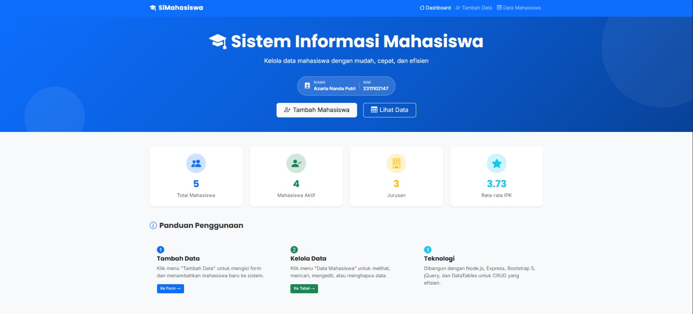
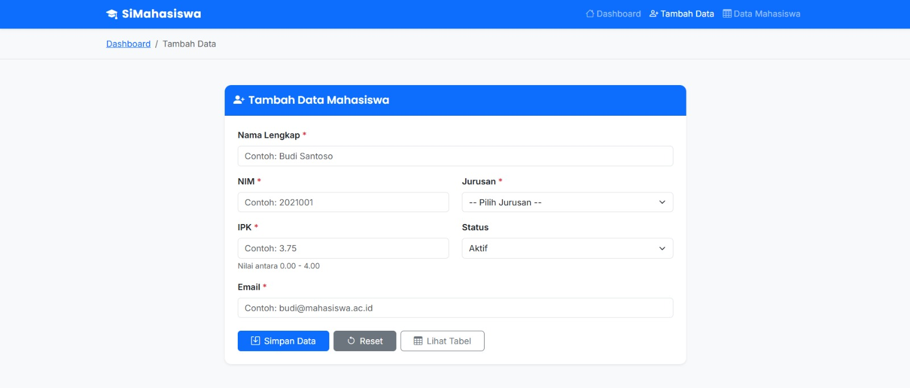
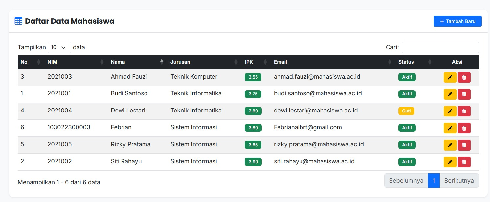
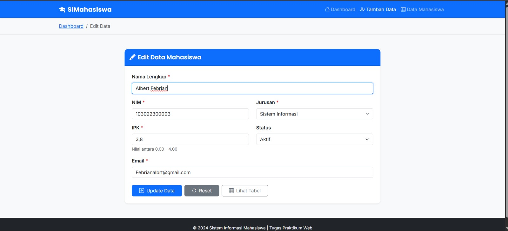
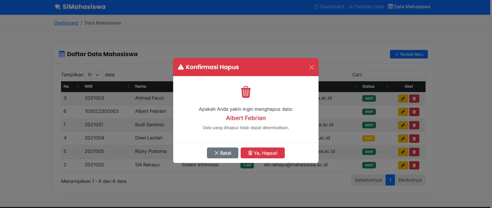
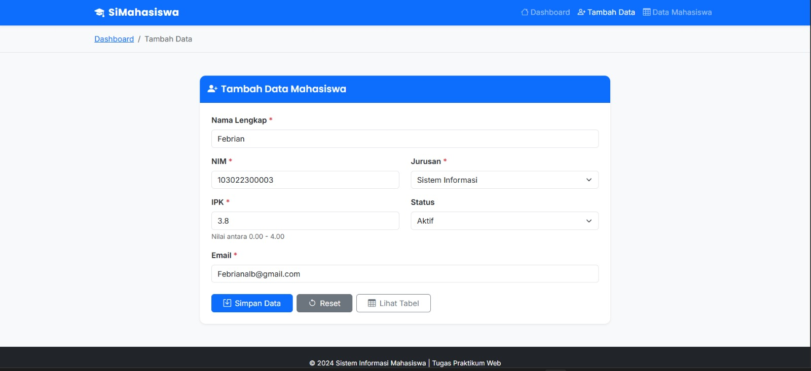
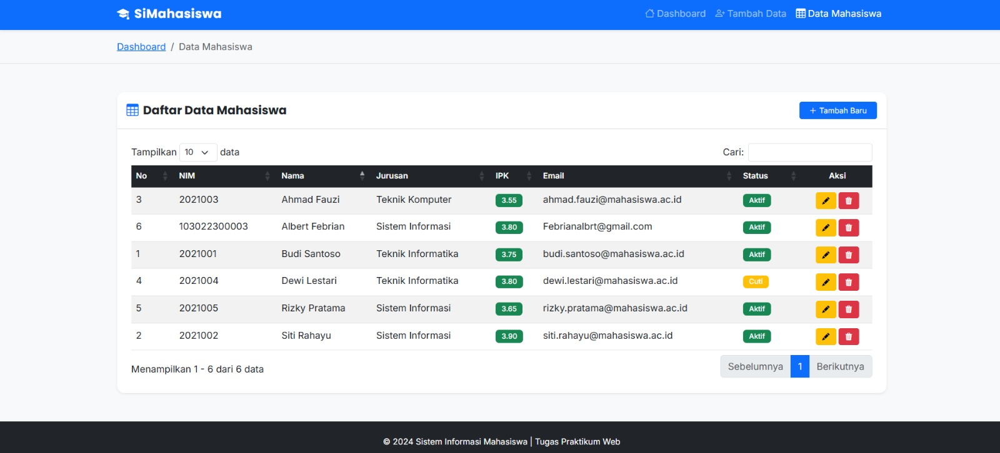
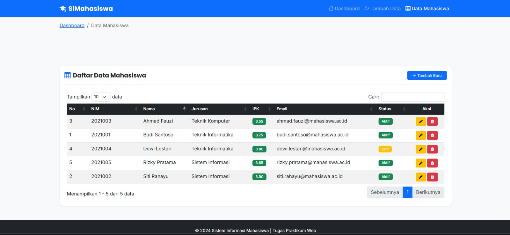

<div align="center">
  <br />
  <h1>LAPORAN PRAKTIKUM <br>APLIKASI BERBASIS PLATFORM</h1>
  <br />
  <h2> TUGAS COTS 2 <br> DATA PRODUK MENGGUNAKAN FRAMEWORK NODE JS EXPRESS </h2>
  <br />
  <br />
   
  <br />
  <br />
  <br />
  <h3>Disusun Oleh :</h3>
  <p>
    <strong>Azaria Nanda Putri</strong><br>
    <strong>2311102147</strong><br>
    <strong>S1 IF-11-REG 01</strong>
  </p>
  <br />
  <h3>Dosen Pengampu :</h3>
  <p>
    <strong>Dimas Fanny Hebrasianto Permadi, S.ST., M.Kom</strong>
  </p>
  <br />
  <br />
    <h4>Asisten Praktikum :</h4>
    <strong> Apri Pandu Wicaksono </strong> <br>
    <strong>Rangga Pradarrell Fathi</strong>
  <br />
  <h2>LABORATORIUM HIGH PERFORMANCE
 <br>FAKULTAS INFORMATIKA <br>UNIVERSITAS TELKOM PURWOKERTO <br>2026</h2>
</div>

---

# 1. Dasar Teori

**Sistem CRUD (Create, Read, Update, Delete)** 
merupakan konsep dasar dalam pengelolaan data pada aplikasi perangkat lunak. Melalui operasi ini, pengguna dapat menambahkan data baru, menampilkan informasi yang tersedia, melakukan perubahan terhadap data, serta menghapus data yang sudah tidak diperlukan. Pada pengembangan front-end, implementasi CRUD dapat dilakukan menggunakan JavaScript dengan memanfaatkan manipulasi DOM (Document Object Model) secara dinamis di sisi klien.

**Framework Bootstrap** 
dimanfaatkan untuk membangun tampilan antarmuka yang responsif dan menarik dengan lebih efisien. Dengan adanya sistem grid serta komponen UI yang telah disediakan, Bootstrap membantu mengurangi kebutuhan penulisan CSS secara manual sehingga pengembang dapat lebih fokus pada pengembangan fitur dan logika aplikasi.

**jQuery DataTables**
 adalah pustaka tambahan yang berfungsi untuk meningkatkan kapabilitas tabel HTML statis. Library ini menyediakan fitur seperti pencarian (searching), pembagian halaman (pagination), serta pengurutan (sorting) secara otomatis tanpa perlu implementasi logika yang kompleks.

**JavaScript Object Mapping**
 merupakan metode pengelolaan data menggunakan struktur pasangan kunci dan nilai (key-value pairs). Berbeda dengan array yang memerlukan proses iterasi untuk menemukan data tertentu, pendekatan ini memungkinkan akses data secara langsung melalui kunci unik (ID). Hal ini menjadikannya lebih efisien dalam pengelolaan state aplikasi, dengan kompleksitas waktu $O(1)$ untuk operasi pencarian dan penghapusan.

**Node.js** merupakan lingkungan runtime JavaScript yang berjalan di atas mesin V8 milik Chrome, sehingga memungkinkan eksekusi JavaScript di sisi server. Sementara itu, Express.js adalah framework minimalis yang digunakan untuk mempermudah pengelolaan routing serta penanganan permintaan HTTP dalam pengembangan aplikasi web.

**EJS (Embedded JavaScript Templating)** adalah template engine yang digunakan untuk menghasilkan halaman HTML secara dinamis menggunakan sintaks JavaScript. Dalam implementasinya, EJS memungkinkan tampilan antarmuka berubah sesuai dengan rute atau data yang diakses oleh pengguna.

**jQuery DataTable** juga berperan sebagai plugin yang memperkaya fungsi tabel HTML dengan fitur seperti pencarian, pagination, dan pengurutan data secara otomatis. Data yang ditampilkan dalam tabel ini menggunakan format JSON agar proses komunikasi antara sisi klien dan server menjadi lebih efisien.

**JavaScript Object Mapping** kembali menegaskan penggunaan struktur kunci-nilai sebagai metode penyimpanan data. Pendekatan ini sangat efektif dalam pengelolaan state aplikasi karena mendukung akses data yang cepat dengan kompleksitas waktu $O(1)$ untuk operasi pencarian maupun penghapusan.

---

# 2. Unguided


## `server.js`

```js
// ============================================================
// server.js - File utama aplikasi Node.js Express
// Tugas Praktikum: Aplikasi CRUD Mahasiswa
// ============================================================

// Import modul yang dibutuhkan
const express = require('express');
const path    = require('path');
const fs      = require('fs');

// Inisialisasi aplikasi Express
const app  = express();
const PORT = 3000;

// ============================================================
// MIDDLEWARE - Konfigurasi Express
// ============================================================

// Mengizinkan Express membaca body JSON dari request
app.use(express.json());

// Mengizinkan Express membaca form data (urlencoded)
app.use(express.urlencoded({ extended: true }));

// Menyajikan file statis dari folder "public"
// (CSS, JS, gambar, dll bisa diakses langsung)
app.use(express.static(path.join(__dirname, 'public')));

// ============================================================
// ROUTING - Menghubungkan URL ke file view (halaman HTML)
// ============================================================

// Halaman 1: Dashboard / Beranda
app.get('/', (req, res) => {
  res.sendFile(path.join(__dirname, 'views', 'index.html'));
});

// Halaman 2: Form Tambah Data
app.get('/form', (req, res) => {
  res.sendFile(path.join(__dirname, 'views', 'form.html'));
});

// Halaman 3: Tabel Data
app.get('/tabel', (req, res) => {
  res.sendFile(path.join(__dirname, 'views', 'tabel.html'));
});

// ============================================================
// API ROUTES - Import dari file routes/mahasiswa.js
// Semua endpoint CRUD ada di sini
// ============================================================
const mahasiswaRoutes = require('./routes/mahasiswa');
app.use('/api/mahasiswa', mahasiswaRoutes);

// ============================================================
// JALANKAN SERVER
// ============================================================
app.listen(PORT, () => {
  console.log('===========================================');
  console.log(` Server berjalan di: http://localhost:${PORT}`);
  console.log('===========================================');
  console.log(' Halaman tersedia:');
  console.log(`   - Dashboard : http://localhost:${PORT}/`);
  console.log(`   - Form      : http://localhost:${PORT}/form`);
  console.log(`   - Tabel     : http://localhost:${PORT}/tabel`);
  console.log('===========================================');
});


```


# 3. Hasil Tampilan

### Screenshot Output
1. **Halaman Home**: Tampilan awal aplikasi (Landing Page). </br>

2. **Halaman Form**: Antarmuka input data produk baru. </br>

3. **Halaman Tabel**: Data yang berhasil di-*load* menggunakan jQuery DataTables.

4. **Fungsionalitas CRUD**: Proses edit dan hapus data. </br>




#### Tambah data
 </br>
 </br>

#### Edit data
 </br>
 </br>

#### Hapus data
 </br>
 </br>

---

# 4. Hasil dan Pembahasan

Aplikasi ini mengimplementasikan sistem informasi mahasiswa berbasis web dengan konsep *CRUD (Create, Read, Update, Delete)*. Sistem dibangun dengan memisahkan peran *backend* dan *frontend* agar kode lebih terstruktur, modular, dan mudah dikembangkan.

---

### A. Backend & API (`server.js` dan `routes/mahasiswa.js`)
* **Routing Halaman**: Server menggunakan Express untuk menangani rute utama seperti `/` (Dashboard), `/form` (Input Data), dan `/tabel` (Tampil Data) sebagai tiga halaman fungsional utama.
* **Pengelolaan Data**: Data mahasiswa disimpan dalam file JSON (`data/mahasiswa.json`) sebagai media penyimpanan sederhana yang berfungsi seperti database.
* **API CRUD**: Backend menyediakan endpoint berbasis REST:
  * `GET` untuk mengambil data
  * `POST` untuk menambahkan data
  * `PUT` untuk memperbarui data
  * `DELETE` untuk menghapus data  
  Seluruh komunikasi data menggunakan format JSON.
* **Integrasi DataTables**: Endpoint `/api/mahasiswa` disesuaikan dengan format JSON yang dibutuhkan oleh plugin DataTables agar data dapat langsung ditampilkan secara dinamis.

---

### B. Frontend & Layout (`views/*.html`)
* **Struktur Halaman**: Terdapat tiga halaman utama yaitu dashboard (`index.html`), form input (`form.html`), dan tabel data (`tabel.html`).
* **Bootstrap 5**: Digunakan untuk membangun tampilan antarmuka yang responsif dan menarik dengan komponen seperti form, tombol, dan grid system.
* **Plugin DataTables**: Digunakan pada halaman tabel untuk menampilkan data secara interaktif dengan fitur pencarian, pagination, dan sorting otomatis.
* **Komunikasi AJAX**: Operasi CRUD dilakukan menggunakan jQuery AJAX (`$.get`, `$.post`, `$.ajax`) sehingga tidak memerlukan reload halaman.

---

### C. Fitur CRUD
* **Create**: Data ditambahkan melalui form dan dikirim ke server menggunakan AJAX `POST`.
* **Read**: Data ditampilkan menggunakan DataTables melalui AJAX `GET`.
* **Update**: Data diedit melalui form dengan parameter ID, kemudian dikirim menggunakan `PUT`.
* **Delete**: Data dihapus melalui tombol aksi dengan konfirmasi, lalu dikirim ke server menggunakan `DELETE`.

---

### D. Alur Pengolahan Data (Data Flow)
1. **Client-Side**: Pengguna mengisi form berbasis Bootstrap, kemudian data dikirim melalui jQuery AJAX.
2. **Server-Side**: Express menerima request, memproses operasi CRUD, dan menyimpan perubahan ke file JSON.
3. **Response Data**: Server mengirimkan respon dalam format JSON sebagai status keberhasilan.
4. **Data Display**: Data ditampilkan kembali pada tabel menggunakan jQuery DataTables secara dinamis tanpa reload halaman.

---

### E. Pembahasan
* **Kelebihan Sistem**:
  * Implementasi CRUD berjalan dengan baik
  * Tampilan responsif berkat Bootstrap
  * Interaksi data real-time tanpa reload menggunakan AJAX
  * DataTables mempermudah pengelolaan tabel

* **Keterbatasan Sistem**:
  * Penyimpanan masih menggunakan file JSON (belum scalable)
  * Belum ada sistem autentikasi pengguna
  * Rentan konflik jika diakses bersamaan

* **Pengembangan Selanjutnya**:
  * Menggunakan database seperti MySQL atau MongoDB
  * Menambahkan fitur login dan keamanan
  * Mengembangkan sistem menjadi lebih kompleks (multi-user)

# 5. Video Rekaman
[https://drive.google.com/drive/folders/1x4P3zAFsnJSBrhpEDfQy32EIwvwYd_uk?usp=sharing]

# 6. Referensi

- *Express.js Official Documentation.* [https://expressjs.com/](https://expressjs.com/)
- *DataTables Manual & API Reference.* [https://datatables.net/](https://datatables.net/)
- *Bootstrap 5 Component Documentation.* [https://getbootstrap.com/](https://getbootstrap.com/)
