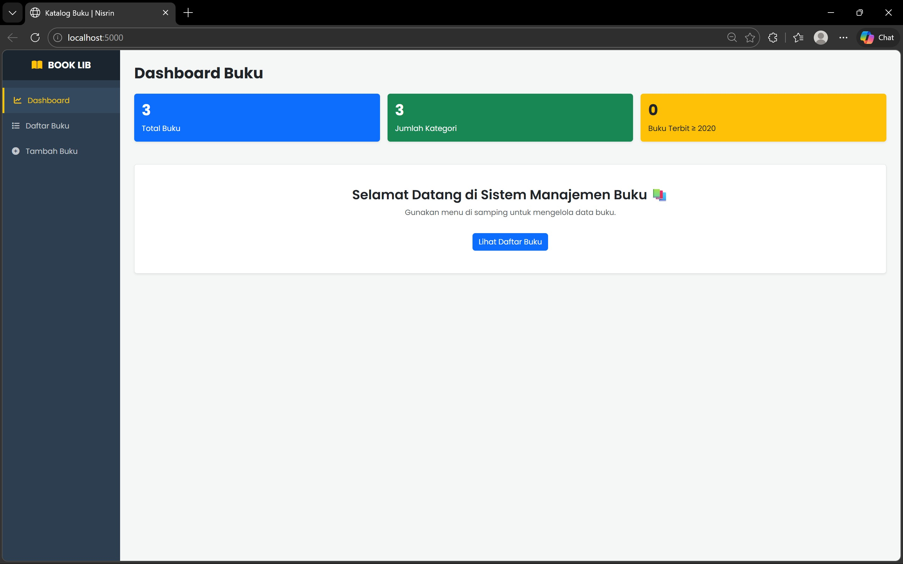
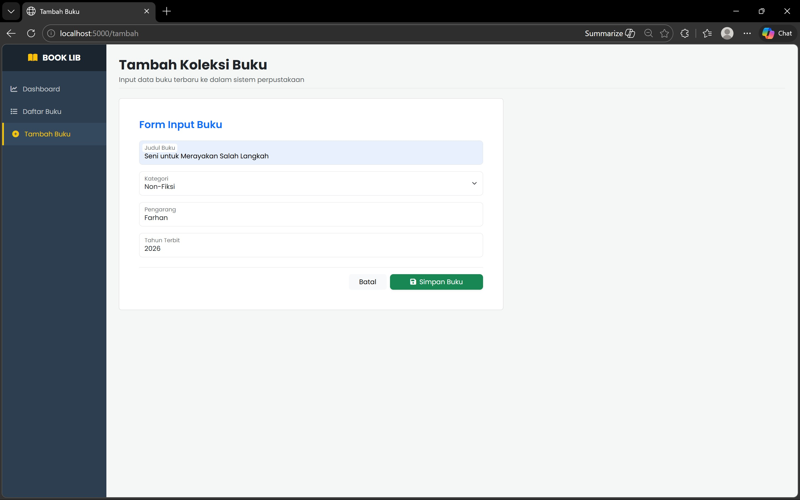
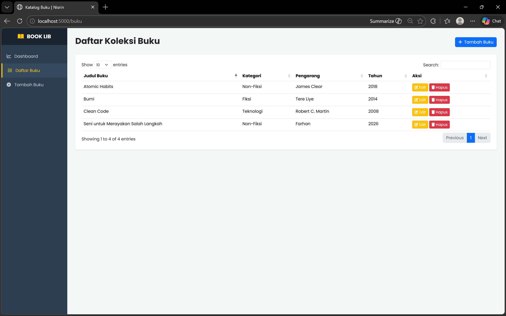
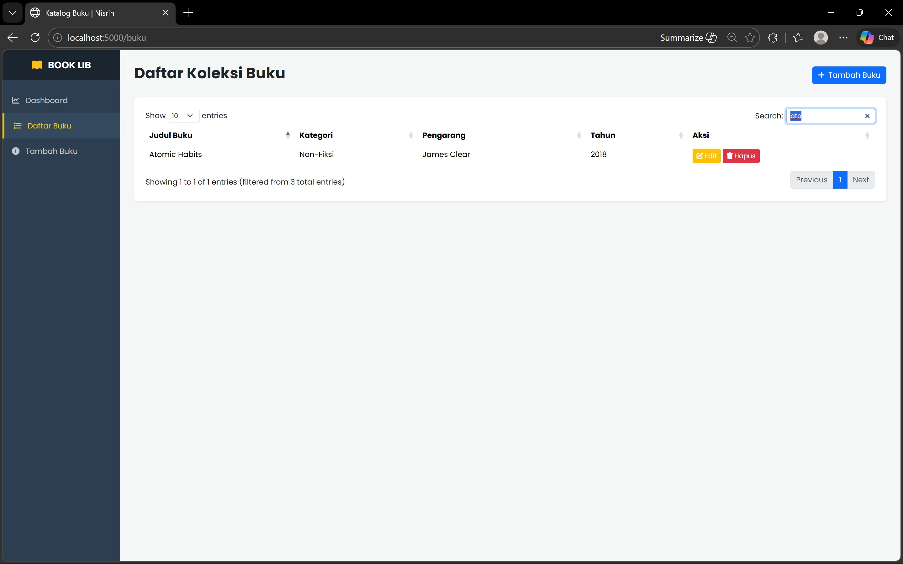
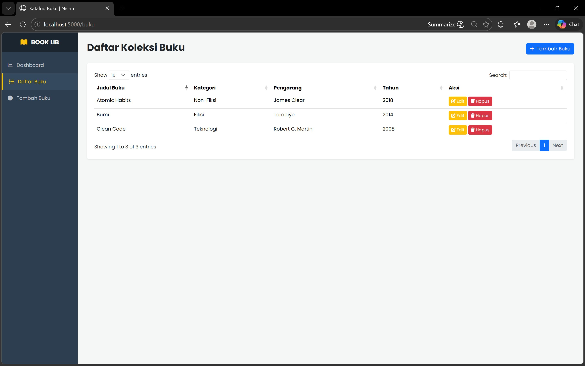
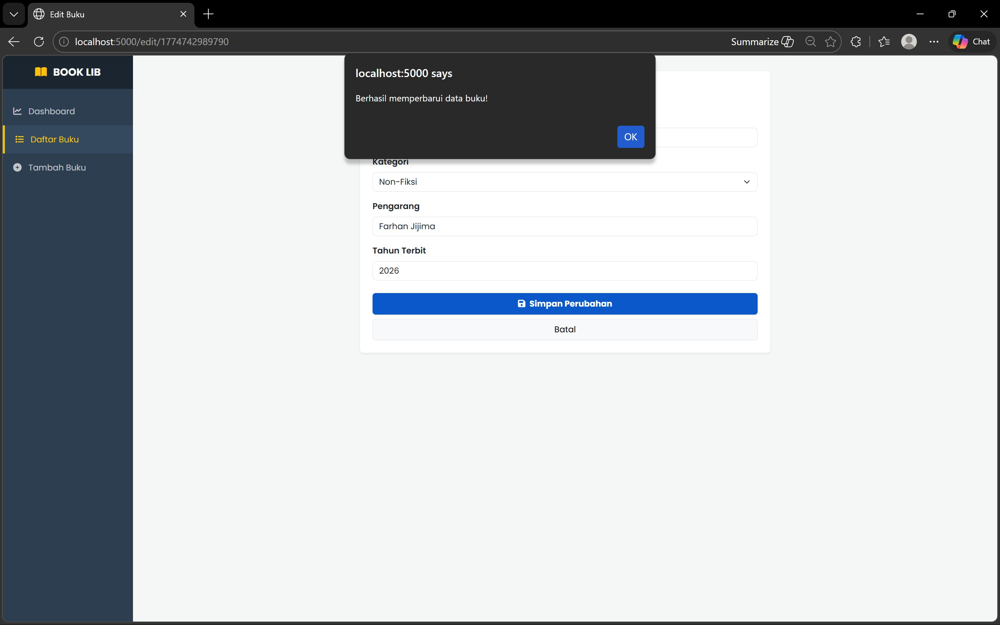
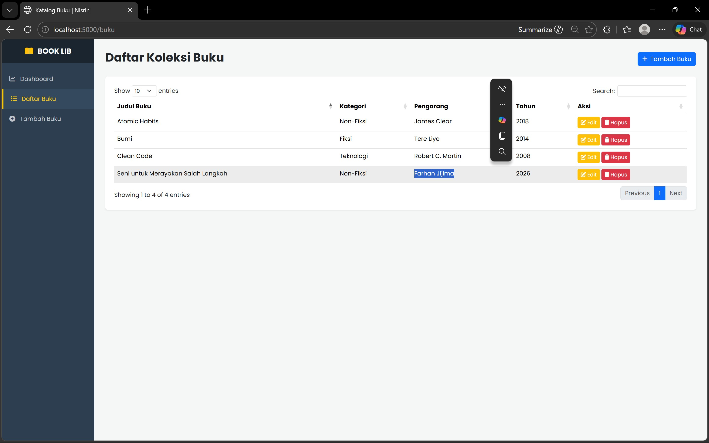
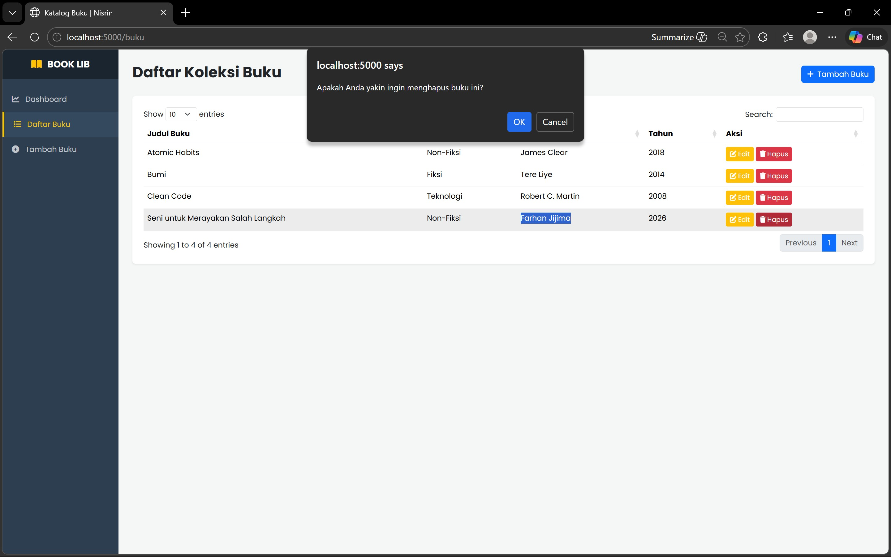

<div align="center">
  <br />
  <h1>LAPORAN PRAKTIKUM <br>APLIKASI BERBASIS PLATFORM</h1>
  <br />
  <h3> TUGAS COTS 2 <br> MANAJEMEN DATA BUKU </h3>
  <br />
   
  <br />
  <br />
  <br />
  <h3>Disusun Oleh :</h3>
  <p>
    <strong>Nisrina Amalia Iffatunnisa</strong><br>
    <strong>2311102156</strong><br>
    <strong>S1 IF-11-01</strong>
  </p>
  <br />
  <h3>Dosen Pengampu :</h3>
  <p>
    <strong>Dimas Fanny Hebrasianto Permadi, S.ST., M.Kom</strong>
  </p>
  <br />
  <br />
    <h4>Asisten Praktikum :</h4>
    <strong> Apri Pandu Wicaksono </strong> <br>
    <strong>Rangga Pradarrell Fathi</strong>
  <br />
  <h3>LABORATORIUM HIGH PERFORMANCE
 <br>FAKULTAS INFORMATIKA <br>UNIVERSITAS TELKOM PURWOKERTO <br>2026</h3>
</div>

---

## 1. Dasar Teori

### CRUD
CRUD merupakan konsep dasar dalam pengelolaan data pada sistem informasi. CRUD terdiri dari empat operasi utama, yaitu Create (menambah data), Read (menampilkan data), Update (memperbarui data), dan Delete (menghapus data). Konsep ini digunakan dalam hampir semua aplikasi berbasis database maupun aplikasi web. Dalam pengembangan aplikasi web, CRUD biasanya diimplementasikan melalui HTTP method seperti GET, POST, PUT, dan DELETE. Penggunaan konsep CRUD memungkinkan aplikasi untuk mengelola data secara sistematis dan terstruktur.


### Express.js
Express.js dalah salah satu framework dari node.js yang memiliki fungsi untuk mempermudah dan mempercepat dalam pengembangan sebuah aplikasi atau web yang berbasis node.js. Express menyediakan berbagai fitur seperti routing, middleware, dan pengelolaan request–response yang mempermudah pengembangan backend Dengan Express.js, developer dapat membuat RESTful API dengan lebih cepat dan efisien dibandingkan menggunakan Node.js murni.

### Node.js
Node.js adalah runtime JavaScript yang berjalan di sisi server dan dibangun menggunakan mesin V8 dari Google Chrome. Node.js memungkinkan JavaScript digunakan untuk pengembangan backend, sehingga developer dapat menggunakan satu bahasa pemrograman untuk frontend dan backend. Node.js bersifat non-blocking dan event-driven, sehingga cocok untuk aplikasi real-time dan berbasis jaringan.

### EJS (Embedded JavaScript)
EJS (Embedded JavaScript) adalah template engine yang digunakan untuk menghasilkan HTML dengan menyisipkan kode JavaScript di dalamnya. Dengan EJS, data dari backend dapat ditampilkan secara dinamis pada halaman web. EJS menggunakan sintaks seperti <%= %> untuk menampilkan data dan <% %> untuk logika pemrograman.

### Bootstrap
Bootstrap adalah framework CSS yang digunakan untuk membuat tampilan website menjadi responsif dan modern. Bootstrap menyediakan berbagai komponen siap pakai seperti navbar, card, button, dan grid system. Dengan Bootstrap, pengembangan UI menjadi lebih cepat tanpa harus menulis CSS dari awal.

### jQuery
jQuery adalah library JavaScript yang dirancang untuk mempermudah manipulasi DOM, event handling, serta AJAX. jQuery memungkinkan penulisan kode JavaScript yang lebih sederhana dan ringkas. Dalam aplikasi ini, jQuery digunakan untuk menangani event form dan komunikasi dengan server menggunakan AJAX.

### AJAX (Asynchronous JavaScript and XML)
AJAX adalah teknik yang digunakan untuk mengirim dan menerima data dari server secara asynchronous tanpa perlu me-refresh halaman. Dengan AJAX, user experience menjadi lebih baik karena interaksi menjadi lebih cepat dan dinamis. Dalam aplikasi ini, AJAX digunakan untuk proses tambah, edit, dan hapus data buku.

### JSON (JavaScript Object Notation)
JSON adalah format pertukaran data yang ringan dan mudah dibaca oleh manusia serta mudah diproses oleh mesin. JSON sering digunakan dalam komunikasi antara frontend dan backend. Dalam aplikasi ini, data buku dikirim dari server ke client dalam format JSON melalui API.

### DataTables
DataTables adalah plugin jQuery yang digunakan untuk menampilkan data dalam bentuk tabel yang interaktif. DataTables menyediakan fitur seperti pencarian (search), pengurutan (sorting), dan pagination secara otomatis. Dalam aplikasi ini, DataTables digunakan untuk menampilkan data buku yang diambil dari API dalam format JSON.

## 2. Sourcecode 

### Sourcecode app.js
``` Javascript
const express = require("express");
const app = express();
const path = require("path");

app.set("view engine", "ejs");
app.use(express.static(path.join(__dirname, "public")));
app.use(express.json());
app.use(express.urlencoded({ extended: true }));

// Database Dummy (Data Buku)
let dataBuku = [
  {
    id: "1",
    judul: "Bumi",
    kategori: "Fiksi",
    pengarang: "Tere Liye",
    tahun: "2014",
  },
  {
    id: "2",
    judul: "Atomic Habits",
    kategori: "Non-Fiksi",
    pengarang: "James Clear",
    tahun: "2018",
  },
  {
    id: "3",
    judul: "Clean Code",
    kategori: "Teknologi",
    pengarang: "Robert C. Martin",
    tahun: "2008",
  },
];

// --- ROUTES NAVIGASI ---

// 1. DASHBOARD
app.get("/", (req, res) => {
  const totalBuku = dataBuku.length;
  // Menghitung jumlah kategori unik
  const jumlahKategori = [...new Set(dataBuku.map((item) => item.kategori))]
    .length;
  // Contoh filter buku terbitan terbaru (misal di atas 2020)
  const bukuBaru = dataBuku.filter(
    (item) => parseInt(item.tahun) >= 2020,
  ).length;

  res.render("dashboard", {
    page: "dashboard",
    total: totalBuku,
    jumlahKategori: jumlahKategori,
    bukuBaru: bukuBaru,
  });
});

// 2. DAFTAR BUKU
app.get("/buku", (req, res) => {
  res.render("listdata", { page: "buku" });
});

// 3. TAMBAH DATA (Form dengan Dropdown)
app.get("/tambah", (req, res) => {
  res.render("form", { page: "tambah" });
});

// 4. EDIT DATA
app.get("/edit/:id", (req, res) => {
  const buku = dataBuku.find((d) => d.id === req.params.id);
  if (buku) {
    res.render("edit", { item: buku, page: "buku" });
  } else {
    res.status(404).send("Buku tidak ditemukan");
  }
});

// --- API CRUD (JSON) ---
app.get("/api/buku", (req, res) => res.json({ data: dataBuku }));

app.post("/api/buku", (req, res) => {
  const newEntry = { id: Date.now().toString(), ...req.body };
  dataBuku.push(newEntry);
  res.json({ status: "success", message: "Buku berhasil ditambahkan!" });
});

app.put("/api/buku/:id", (req, res) => {
  const index = dataBuku.findIndex((d) => d.id === req.params.id);
  if (index !== -1) {
    dataBuku[index] = { id: req.params.id, ...req.body };
    res.json({ status: "success", message: "Data buku berhasil diperbarui!" });
  } else {
    res.status(404).json({ status: "error" });
  }
});

app.delete("/api/buku/:id", (req, res) => {
  dataBuku = dataBuku.filter((d) => d.id !== req.params.id);
  res.json({ status: "success", message: "Buku berhasil dihapus!" });
});

app.listen(5000, () => console.log("Server running at http://localhost:5000"));
```

### Sourcecode footer.ejs
```Javascript
</div> </div> <script src="https://code.jquery.com/jquery-3.7.1.min.js"></script>
    
    <script src="https://cdn.jsdelivr.net/npm/bootstrap@5.3.3/dist/js/bootstrap.bundle.min.js"></script>
    
    <script src="https://cdn.datatables.net/1.13.7/js/jquery.dataTables.min.js"></script>
    
    <script src="https://cdn.datatables.net/1.13.7/js/dataTables.bootstrap5.min.js"></script>
</body>
</html>
```

### Sourcecode header.ejs
```HTML
<!DOCTYPE html>
<html lang="id">
<head>
    <meta charset="UTF-8">
    <meta name="viewport" content="width=device-width, initial-scale=1.0">
    <title><%= typeof title !== 'undefined' ? title : 'Katalog Buku | Nisrin' %></title>
    
    <link href="https://cdn.jsdelivr.net/npm/bootstrap@5.3.3/dist/css/bootstrap.min.css" rel="stylesheet">
    <link href="https://cdnjs.cloudflare.com/ajax/libs/font-awesome/6.5.2/css/all.min.css" rel="stylesheet">
    <link href="https://fonts.googleapis.com/css2?family=Poppins:wght@300;400;500;600;700&display=swap" rel="stylesheet">
    <link href="https://cdn.datatables.net/1.13.7/css/dataTables.bootstrap5.min.css" rel="stylesheet">

    <style>
        body { font-family: 'Poppins', sans-serif; background-color: #f4f7f6; margin: 0; }
        #sidebar {
            width: 250px; height: 100vh; position: fixed;
            left: 0; top: 0; background: #2c3e50; color: white; z-index: 999;
        }
        #main-content {
            margin-left: 250px;
            padding: 30px;
            min-height: 100vh;
        }
        .sidebar-header { padding: 20px; background: #1a252f; text-align: center; }
        .nav-link { color: rgba(255,255,255,0.7); padding: 15px 20px; display: block; text-decoration: none; transition: 0.3s; }
        .nav-link:hover, .nav-link.active { background: #34495e; color: #f1c40f; border-left: 4px solid #f1c40f; }
        .nav-link i { width: 25px; }
    </style>
</head>
<body>

    <div id="sidebar">
        <div class="sidebar-header">
            <h5 class="m-0 fw-bold text-white"><i class="fas fa-book-open text-warning me-2"></i> BOOK LIB</h5>
        </div>
        <div class="py-3">
            <a href="/" class="nav-link <%= (typeof page !== 'undefined' && page === 'dashboard') ? 'active' : '' %>">
                <i class="fas fa-chart-line"></i> Dashboard
            </a>
            
            <a href="/buku" class="nav-link <%= (typeof page !== 'undefined' && page === 'buku') ? 'active' : '' %>">
                <i class="fas fa-list"></i> Daftar Buku
            </a>
            
            <a href="/tambah" class="nav-link <%= (typeof page !== 'undefined' && page === 'tambah') ? 'active' : '' %>">
                <i class="fas fa-plus-circle"></i> Tambah Buku
            </a>
        </div>
    </div>

    <div id="main-content">
```

### Sourcecode form.ejs
```Javascript
<%- include('partials/header', {title: 'Tambah Buku', page: 'tambah'}) %>

<div class="mb-4 pb-2 border-bottom">
    <h2 class="fw-bold mb-1 text-dark">Tambah Koleksi Buku</h2>
    <p class="text-muted m-0">Input data buku terbaru ke dalam sistem perpustakaan</p>
</div>

<div class="row">
    <div class="col-xl-7 col-lg-9">
        <div class="card card-custom p-4 p-md-5">
            <h4 class="fw-semibold mb-4 text-primary"></i>Form Input Buku</h4>
            <form id="addForm">
                <div class="form-floating mb-3">
                    <input type="text" name="judul" class="form-control rounded-3" id="fJudul" placeholder="Judul Buku" required>
                    <label for="fJudul"></i>Judul Buku</label>
                </div>

                <div class="form-floating mb-3">
                    <select name="kategori" class="form-select rounded-3" id="fKategori" required>
                        <option value="" selected disabled>Pilih Kategori</option>
                        <option value="Fiksi">Fiksi</option>
                        <option value="Non-Fiksi">Non-Fiksi</option>
                        <option value="Teknologi">Teknologi</option>
                        <option value="Sains">Sains</option>
                        <option value="Komik">Komik</option>
                    </select>
                    <label for="fKategori"></i>Kategori</label>
                </div>

                <div class="form-floating mb-3">
                    <input type="text" name="pengarang" class="form-control rounded-3" id="fPengarang" placeholder="Nama Pengarang" required>
                    <label for="fPengarang"></i>Pengarang</label>
                </div>

                <div class="form-floating mb-4">
                    <input type="number" name="tahun" class="form-control rounded-3" id="fTahun" placeholder="2024" required>
                    <label for="fTahun"></i>Tahun Terbit</label>
                </div>
                
                <div class="d-flex justify-content-end gap-2 mt-4 pt-3 border-top">
                    <a href="/" class="btn btn-light px-4">Batal</a>
                    <button type="submit" class="btn btn-success px-5 fw-500 rounded-3 shadow-sm">
                        <i class="fas fa-save me-2"></i>Simpan Buku
                    </button>
                </div>
            </form>
        </div>
    </div>
</div>

<%- include('partials/footer') %>

<script>
$('#addForm').on('submit', function(e) {
    e.preventDefault();
    
    // Pastikan endpoint diarahkan ke /api/buku sesuai app.js terbaru
    $.post('/api/buku', $(this).serialize(), function(res) {
        if (res.status === 'success') {
            alert(res.message); 
            window.location.href = '/buku'; // Redirect ke daftar buku
        }
    }).fail(function() {
        alert("Waduh, gagal simpan data buku!");
    });
});
</script>
```

### Sourcecode List Buku
``` Javascript
<%- include('partials/header', {page: 'buku'}) %>

<div class="mb-4 d-flex justify-content-between align-items-center">
    <h2 class="fw-bold">Daftar Koleksi Buku</h2>
    <a href="/tambah" class="btn btn-primary"><i class="fas fa-plus me-2"></i>Tambah Buku</a>
</div>

<div class="card p-4 shadow-sm border-0">
    <table id="myTable" class="table table-hover w-100">
        <thead>
            <tr>
                <th>Judul Buku</th>
                <th>Kategori</th>
                <th>Pengarang</th>
                <th>Tahun</th>
                <th>Aksi</th>
            </tr>
        </thead>
    </table>
</div>

<%- include('partials/footer') %>

<script>
    $(document).ready(function() {
        $("#myTable").DataTable({
            // Endpoint diganti ke API buku
            ajax: "/api/buku", 
            columns: [
                { data: "judul" },
                { data: "kategori" },
                { data: "pengarang" },
                { data: "tahun" },
                {
                    data: "id",
                    render: function(data) {
                        return `
                            <a href="/edit/${data}" class="btn btn-sm btn-warning text-white">
                                <i class="fas fa-edit"></i> Edit
                            </a>
                            <button onclick="hapusData('${data}')" class="btn btn-sm btn-danger">
                                <i class="fas fa-trash"></i> Hapus
                            </button>
                        `;
                    }
                }
            ]
        });
    });

    function hapusData(id) {
        if(confirm("Apakah Anda yakin ingin menghapus buku ini?")) {
            $.ajax({
                // Endpoint DELETE juga disesuaikan
                url: "/api/buku/" + id, 
                type: "DELETE",
                success: function(res) { 
                    alert(res.message);
                    location.reload(); 
                },
                error: function() {
                    alert("Gagal menghapus data.");
                }
            });
        }
    }
</script>
```


## 3. Penjelasan Implementasi Sistem Manajemen Buku
Pada praktikum ini dibuat sebuah aplikasi web lokal sederhana untuk melakukan manajemen data buku menggunakan konsep CRUD (Create, Read, Update, Delete). Aplikasi ini dibangun menggunakan teknologi Node.js dengan framework Express.js sebagai backend, serta menggunakan EJS (Embedded JavaScript) sebagai template engine untuk menampilkan halaman secara dinamis.

Pada sisi frontend, aplikasi memanfaatkan Bootstrap untuk mempercantik tampilan antarmuka agar lebih responsif dan modern, serta menggunakan jQuery dan plugin DataTables untuk menampilkan dan mengelola data dalam bentuk tabel interaktif. Dengan kombinasi teknologi tersebut, aplikasi yang dibangun mampu menampilkan, menambahkan, mengubah, dan menghapus data buku secara dinamis dan efisien.

Sebelum menjalankan aplikasi, terdapat beberapa perangkat lunak dan dependensi yang harus diinstal terlebih dahulu. Hal pertama yang perlu dipastikan adalah telah terpasangnya Node.js, karena Node.js digunakan sebagai runtime untuk menjalankan aplikasi berbasis JavaScript di sisi server. Node.js biasanya sudah termasuk dengan npm (Node Package Manager) yang digunakan untuk mengelola dan menginstal library yang dibutuhkan. Selanjutnya adalah melakukan inisialisasi project dengan menjalankan perintah `npm init` untuk membuat file package.json. File ini berfungsi sebagai konfigurasi utama project dan menyimpan daftar dependency yang digunakan. Kemudian, dilakukan instalasi framework utama yaitu Express.js menggunakan perintah: `npm install express`. Setelah semua proses instalasi selesai, aplikasi dapat dijalankan dengan perintah `node app.js`

### a. Header dan Footer
Pada aplikasi ini, digunakan dua komponen utama yang bersifat reusable, yaitu header dan footer, yang bertujuan untuk menjaga konsistensi tampilan serta menghindari duplikasi kode pada setiap halaman.

Header yang terdapat pada file header.ejs berfungsi sebagai bagian awal dari setiap halaman web. Di dalam header terdapat struktur dasar HTML seperti deklarasi dokumen, elemen `<head>`, serta pengaturan meta tag yang diperlukan untuk kompatibilitas dan responsivitas halaman. Selain itu, header juga memuat berbagai library eksternal yang digunakan dalam aplikasi, seperti Bootstrap untuk styling tampilan, Font Awesome untuk penggunaan ikon, serta DataTables CSS untuk mendukung tampilan tabel interaktif.

Footer yang terdapat pada file footer.ejs berfungsi sebagai penutup dari struktur HTML. Di dalam footer terdapat pemanggilan berbagai library JavaScript yang dibutuhkan oleh aplikasi, seperti jQuery, Bootstrap JavaScript, serta DataTables JavaScript. 

Tampilan Dashboard


### b. Operasi CRUD
- Operasi Create digunakan untuk menambahkan data buku baru ke dalam sistem. Proses ini dilakukan melalui halaman form.ejs, di mana pengguna dapat mengisi informasi seperti judul buku, kategori, pengarang, dan tahun terbit. Setelah form diisi, data tidak langsung dikirim melalui reload halaman, melainkan menggunakan teknik AJAX dengan metode POST ke endpoint `/api/buku`.



- Operasi Read digunakan untuk menampilkan data buku yang telah tersimpan. Pada aplikasi ini, proses pembacaan data tidak dilakukan secara langsung melalui rendering server-side, melainkan menggunakan pendekatan client-side dengan bantuan DataTables. Halaman `listdata.ejs` hanya menyediakan struktur tabel kosong, kemudian DataTables akan melakukan request ke endpoint `/api/buku` untuk mengambil data dalam format JSON.



Sorting berdasarkan judul buku


- Operasi Update digunakan untuk memperbarui data buku yang sudah ada. Proses ini dimulai ketika pengguna memilih tombol edit pada tabel, yang akan mengarahkan ke halaman `edit.ejs` dengan membawa parameter ID buku. Data buku yang sesuai dengan ID tersebut kemudian dikirim dari server ke halaman edit untuk ditampilkan pada form.



- Operasi Delete digunakan untuk menghapus data buku dari sistem. Pada halaman daftar buku, setiap baris data dilengkapi dengan tombol hapus. Ketika tombol tersebut diklik, sistem akan meminta konfirmasi terlebih dahulu untuk memastikan bahwa pengguna benar-benar ingin menghapus data tersebut.


### c. Routing pada app.js
Routing pada aplikasi ini berfungsi untuk mengatur bagaimana aplikasi merespon setiap permintaan dari client, baik untuk menampilkan halaman maupun untuk menyediakan layanan API. Routing didefinisikan menggunakan metode seperti app.get, app.post, app.put, dan app.delete.

Routing untuk halaman utama (dashboard) didefinisikan menggunakan `app.get("/")`, yang berfungsi untuk menampilkan halaman dashboard ketika pengguna pertama kali mengakses aplikasi. Pada route ini, server juga menghitung beberapa informasi seperti jumlah total buku, jumlah kategori unik, serta jumlah buku terbaru.

Routing untuk halaman daftar buku didefinisikan pada `app.get("/buku")`. Route ini hanya bertugas untuk merender halaman listdata.ejs tanpa mengirimkan data buku secara langsung.

Routing untuk halaman tambah buku didefinisikan pada `app.get("/tambah")`, yang berfungsi untuk menampilkan form input data buku.

Routing untuk halaman edit buku didefinisikan pada `app.get("/edit/:id")`, di mana :id merupakan parameter dinamis yang digunakan untuk menentukan buku mana yang akan diedit. Server akan mencari data buku berdasarkan ID tersebut, dan jika ditemukan, data akan dikirim ke view untuk ditampilkan pada form edit.

### d. API (Backend Service)
API sebagai layanan backend yang digunakan untuk mengelola data buku. API ini berfungsi sebagai penghubung antara frontend dan backend, di mana komunikasi dilakukan menggunakan format JSON.

- Endpoint GET /api/buku digunakan untuk mengambil seluruh data buku yang tersimpan di server
- Endpoint `POST /api/buku` digunakan untuk menambahkan data buku baru. Data yang dikirim dari client akan diterima oleh server melalui `req.body`, kemudian ditambahkan ke dalam array dataBuku dengan ID yang dihasilkan secara otomatis.
- Endpoint `PUT /api/buku/:id` digunakan untuk memperbarui data buku yang sudah ada. Server akan mencari data berdasarkan ID yang diberikan, kemudian mengganti atau memperbarui isi data sesuai dengan input dari client.
- Endpoint `DELETE /api/buku/:id` digunakan untuk menghapus data buku dari server. Proses ini dilakukan dengan cara menyaring array dataBuku dan menghapus elemen yang memiliki ID yang sesuai.


## Kesimpulan
Praktikum ini berhasil memenuhi seluruh ketentuan praktikum. Aplikasi manajemen data buku berbasis web berhasil dibangun dengan menerapkan konsep CRUD menggunakan Express.js sebagai backend dan EJS sebagai template engine. Penggunaan Bootstrap, jQuery, dan DataTables mampu meningkatkan tampilan serta interaktivitas sistem dalam menampilkan data. Dengan demikian, aplikasi ini telah memenuhi tujuan praktikum dalam mengimplementasikan sistem CRUD yang efisien dan interaktif.

## Link Video: https://youtu.be/EvJmMd38fcI

## Referensi
[1] Alfin'Afifan, A. (2024). Digitalisasi sistem administrasi Desa Karanganyar melalui aplikasi berbasis web. Jurnal Informatika dan Teknik Elektro Terapan, 12(1). </br>
[2] [Express.js](https://expressjs.com/) </br>
[3] [Node.js](https://nodejs.org/) <br>
[4] [Bootstrap](https://getbootstrap.com/) </br>
