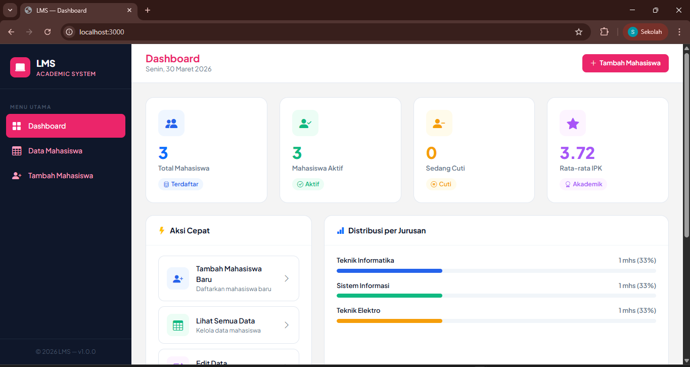
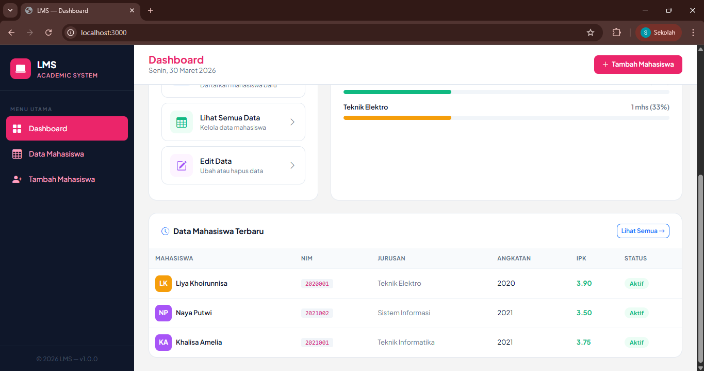
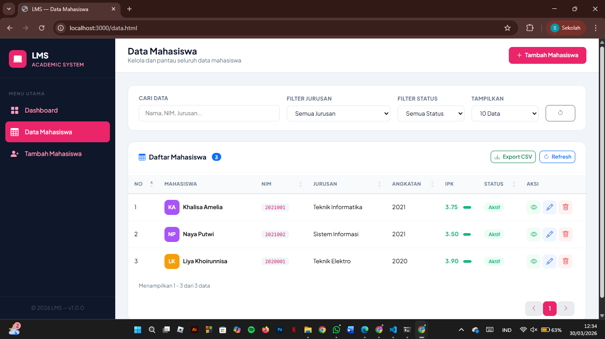
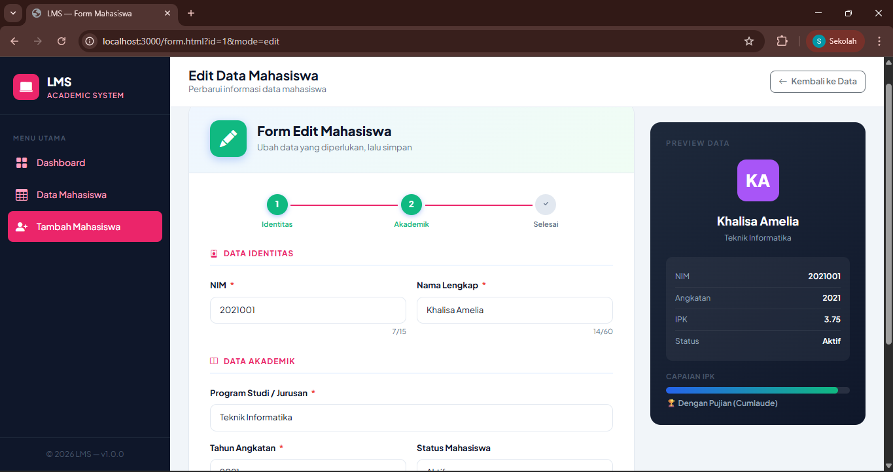
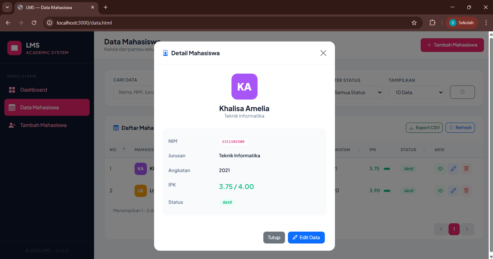
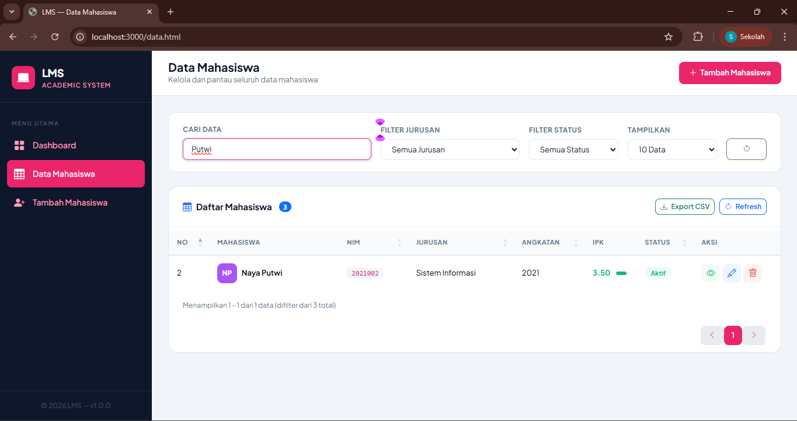
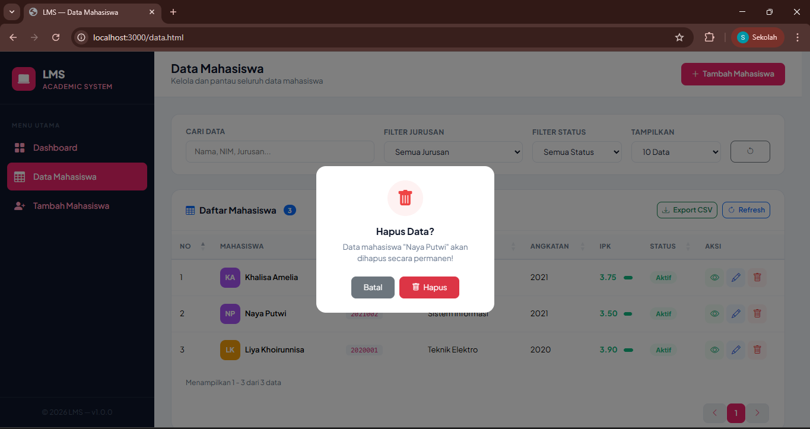
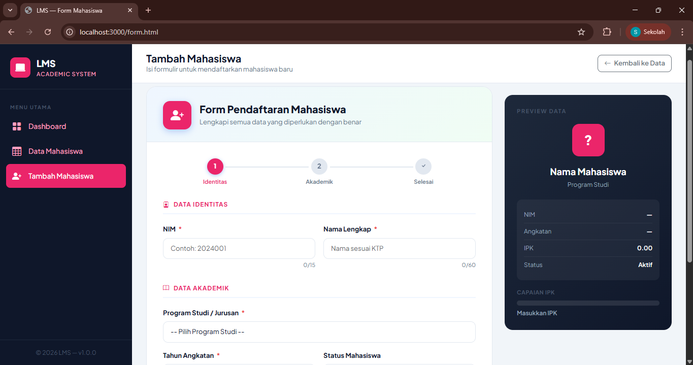
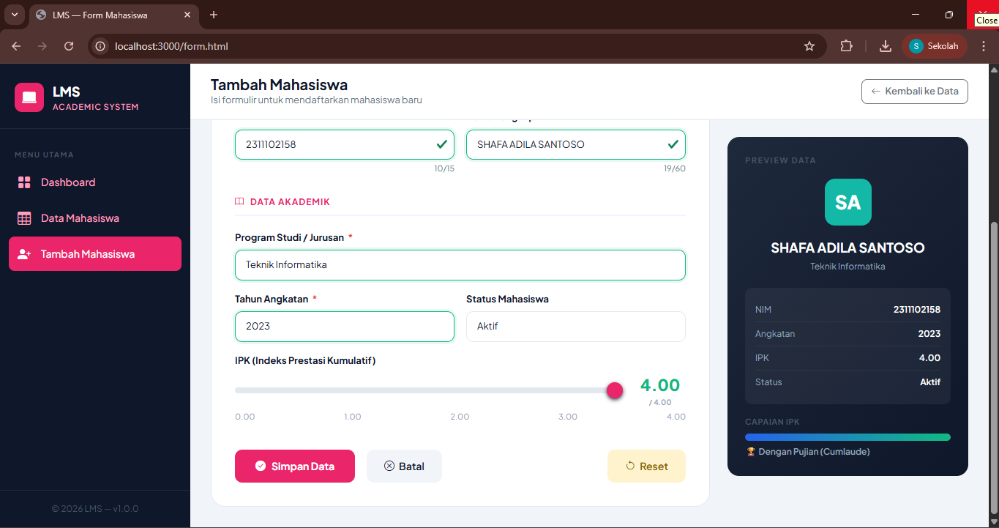

<div align="center">

# LAPORAN PRAKTIKUM  
# APLIKASI BERBASIS PLATFORM

## TUGAS
## CODING ON THE SPOT 2


### Disusun Oleh
**Shafa Adila Santoso**  
2311102158  
S1 IF-11-REG01

### Dosen Pengampu
**Dimas Fanny Hebrasianto Permadi, S.ST., M.Kom**

### Asisten Praktikum
Apri Pandu Wicaksono  
Rangga Pradarrell Fathi  

### LABORATORIUM HIGH PERFORMANCE  
FAKULTAS INFORMATIKA  
UNIVERSITAS TELKOM PURWOKERTO  
2026

</div>

---

<div align="justify">

# 1. Dasar Teori

Pemrograman web merupakan proses pembuatan aplikasi berbasis web yang dapat diakses melalui browser menggunakan berbagai teknologi seperti HTML, CSS, JavaScript, serta framework pendukung. Dalam pengembangan web modern, penggunaan framework sangat membantu dalam mempercepat proses pembangunan aplikasi karena menyediakan struktur, komponen, dan fungsi yang sudah siap digunakan.

Framework seperti Bootstrap digunakan untuk mempermudah pembuatan tampilan antarmuka (user interface) yang responsif dan menarik. Selain itu, jQuery sering digunakan untuk mempermudah manipulasi elemen HTML, pengolahan event, serta integrasi plugin seperti datatable untuk menampilkan data secara dinamis. Penggunaan JSON juga sering diterapkan untuk menyimpan dan mengirim data antara client dan server secara terstruktur.

Selain framework pada sisi frontend, pada pengembangan aplikasi ini juga digunakan Node.js dengan framework Express sebagai backend. Express merupakan framework ringan yang berjalan di atas Node.js dan berfungsi untuk mengelola server, routing, serta komunikasi antara client dan server. Dengan menggunakan Express, proses pembuatan API menjadi lebih mudah dan terstruktur, sehingga aplikasi dapat menangani permintaan seperti pengambilan data, penyimpanan data, hingga pengolahan data secara efisien.

Pada modul ini mahasiswa diminta untuk merancang aplikasi web dari suatu studi kasus dengan memanfaatkan beberapa komponen seperti form, tabel, dan operasi CRUD (Create, Read, Update, Delete). Tujuan dari kegiatan ini adalah agar mahasiswa mampu memahami arsitektur pemrograman web, mengelola data pada aplikasi, serta mengintegrasikan berbagai teknologi web seperti framework, plugin, dan data JSON dalam pengembangan aplikasi berbasis web.

---

**Halaman Dashboard (index.html)**

```html
<!DOCTYPE html>
<html lang="id">
<head>
  <meta charset="UTF-8" />
  <meta name="viewport" content="width=device-width, initial-scale=1.0" />
  <title>LMS — Dashboard</title>

  <!-- Bootstrap 5 -->
  <link href="https://cdn.jsdelivr.net/npm/bootstrap@5.3.2/dist/css/bootstrap.min.css" rel="stylesheet" />
  <!-- Bootstrap Icons -->
  <link href="https://cdn.jsdelivr.net/npm/bootstrap-icons@1.11.3/font/bootstrap-icons.min.css" rel="stylesheet" />
  <!-- Google Fonts -->
  <link href="https://fonts.googleapis.com/css2?family=Plus+Jakarta+Sans:wght@400;500;600;700;800&display=swap" rel="stylesheet" />

  <style>
    :root {
      --primary: #eb256a;
      --primary-dark: #1d4ed8;
      --secondary: #0ea5e9;
      --accent: #f59e0b;
      --success: #10b981;
      --danger: #ef4444;
      --warning: #f59e0b;
      --sidebar-bg: #0f172a;
      --sidebar-text: #ff9fbf;
      --sidebar-hover: #1e293b;
      --sidebar-active: #2563eb;
      --body-bg: #f4f4f4;
      --card-bg: #ffffff;
      --text-primary: #0f172a;
      --text-secondary: #64748b;
    }

    * { box-sizing: border-box; }

    body {
      font-family: 'Plus Jakarta Sans', sans-serif;
      background: var(--body-bg);
      color: var(--text-primary);
      margin: 0;
      min-height: 100vh;
    }

    /* ── Sidebar ── */
    .sidebar {
      position: fixed;
      top: 0; left: 0;
      width: 260px;
      height: 100vh;
      background: var(--sidebar-bg);
      display: flex;
      flex-direction: column;
      z-index: 1000;
      transition: transform .3s ease;
    }

    .sidebar-brand {
      padding: 24px 20px 20px;
      border-bottom: 1px solid #1e293b;
    }

    .brand-logo {
      display: flex;
      align-items: center;
      gap: 12px;
      text-decoration: none;
    }

    .brand-icon {
      width: 40px; height: 40px;
      background: var(--primary);
      border-radius: 10px;
      display: flex;
      align-items: center;
      justify-content: center;
      font-size: 20px;
      color: #fff;
    }

    .brand-name {
      font-size: 18px;
      font-weight: 800;
      color: #fff;
      letter-spacing: -0.3px;
    }

    .brand-sub {
      font-size: 11px;
      color: var(--sidebar-text);
      font-weight: 500;
      letter-spacing: 1px;
      text-transform: uppercase;
    }

    .sidebar-nav {
      flex: 1;
      padding: 16px 12px;
      overflow-y: auto;
    }

    .nav-label {
      font-size: 10px;
      font-weight: 700;
      letter-spacing: 1.5px;
      text-transform: uppercase;
      color: #475569;
      padding: 12px 8px 6px;
    }

    .nav-item { margin-bottom: 2px; }

    .nav-link {
      display: flex;
      align-items: center;
      gap: 10px;
      padding: 10px 12px;
      border-radius: 8px;
      color: var(--sidebar-text);
      font-size: 14px;
      font-weight: 500;
      text-decoration: none;
      transition: all .2s;
    }

    .nav-link:hover {
      background: var(--sidebar-hover);
      color: #fff;
    }

    .nav-link.active {
      background: var(--primary);
      color: #fff;
    }

    .nav-link i { font-size: 18px; min-width: 22px; }

    .sidebar-footer {
      padding: 16px 20px;
      border-top: 1px solid #1e293b;
      font-size: 12px;
      color: #475569;
      text-align: center;
    }

    /* ── Main Content ── */
    .main-wrapper {
      margin-left: 260px;
      min-height: 100vh;
      display: flex;
      flex-direction: column;
    }

    .topbar {
      background: var(--card-bg);
      padding: 16px 28px;
      border-bottom: 1px solid #e2e8f0;
      display: flex;
      align-items: center;
      justify-content: space-between;
      position: sticky;
      top: 0;
      z-index: 100;
    }

    .topbar-title h1 {
      font-size: 20px;
      font-weight: 700;
      margin: 0;
      color: var(--primary);
    }

    .topbar-title p {
      font-size: 13px;
      color: var(--text-secondary);
      margin: 0;
    }

    .topbar-actions { display: flex; align-items: center; gap: 12px; }

    .btn-topbar {
      display: flex;
      align-items: center;
      gap: 6px;
      padding: 8px 16px;
      border-radius: 8px;
      font-size: 13px;
      font-weight: 600;
      border: none;
      cursor: pointer;
      text-decoration: none;
      transition: all .2s;
    }

    .btn-primary-custom {
      background: var(--primary);
      color: #fff;
    }

    .btn-primary-custom:hover {
      background: var(--primary-dark);
      color: #fff;
      transform: translateY(-1px);
      box-shadow: 0 4px 12px rgba(37,99,235,.4);
    }

    .content-area {
      flex: 1;
      padding: 28px;
    }

    /* ── Stat Cards ── */
    .stat-card {
      background: var(--card-bg);
      border-radius: 16px;
      padding: 24px;
      border: 1px solid #e2e8f0;
      transition: all .3s;
      height: 100%;
    }

    .stat-card:hover {
      transform: translateY(-4px);
      box-shadow: 0 12px 32px rgba(0,0,0,.08);
    }

    .stat-icon {
      width: 52px; height: 52px;
      border-radius: 12px;
      display: flex;
      align-items: center;
      justify-content: center;
      font-size: 24px;
      margin-bottom: 16px;
    }

    .stat-number {
      font-size: 32px;
      font-weight: 800;
      line-height: 1;
      margin-bottom: 6px;
    }

    .stat-label {
      font-size: 13px;
      font-weight: 600;
      color: var(--text-secondary);
    }

    .stat-badge {
      font-size: 12px;
      font-weight: 600;
      padding: 3px 10px;
      border-radius: 20px;
      display: inline-flex;
      align-items: center;
      gap: 4px;
    }

    /* ── Section Cards ── */
    .section-card {
      background: var(--card-bg);
      border-radius: 16px;
      border: 1px solid #e2e8f0;
      overflow: hidden;
    }

    .section-header {
      padding: 20px 24px;
      border-bottom: 1px solid #f1f5f9;
      display: flex;
      align-items: center;
      justify-content: space-between;
    }

    .section-title {
      font-size: 15px;
      font-weight: 700;
      color: var(--text-primary);
      margin: 0;
      display: flex;
      align-items: center;
      gap: 8px;
    }

    .section-body { padding: 20px 24px; }

    /* ── Quick Actions ── */
    .quick-action {
      display: flex;
      align-items: center;
      gap: 14px;
      padding: 14px 16px;
      border-radius: 12px;
      border: 1.5px solid #e2e8f0;
      text-decoration: none;
      color: var(--text-primary);
      transition: all .2s;
      margin-bottom: 10px;
    }

    .quick-action:hover {
      border-color: var(--primary);
      background: #eff6ff;
      color: var(--primary);
      transform: translateX(4px);
    }

    .quick-action-icon {
      width: 44px; height: 44px;
      border-radius: 10px;
      display: flex;
      align-items: center;
      justify-content: center;
      font-size: 20px;
      flex-shrink: 0;
    }

    .qa-text-main { font-size: 14px; font-weight: 600; }
    .qa-text-sub { font-size: 12px; color: var(--text-secondary); }

    /* ── Jurusan Progress ── */
    .jurusan-item { margin-bottom: 16px; }
    .jurusan-info { display: flex; justify-content: space-between; margin-bottom: 6px; }
    .jurusan-name { font-size: 13px; font-weight: 600; }
    .jurusan-count { font-size: 13px; color: var(--text-secondary); font-weight: 600; }

    .progress {
      height: 8px;
      border-radius: 8px;
      background: #f1f5f9;
    }

    /* ── Recent Table ── */
    .recent-table { width: 100%; border-collapse: collapse; }
    .recent-table th {
      font-size: 11px;
      font-weight: 700;
      letter-spacing: .5px;
      text-transform: uppercase;
      color: var(--text-secondary);
      padding: 10px 12px;
      border-bottom: 2px solid #f1f5f9;
      background: #f8fafc;
    }
    .recent-table td {
      padding: 12px 12px;
      font-size: 13px;
      border-bottom: 1px solid #f1f5f9;
      vertical-align: middle;
    }
    .recent-table tr:last-child td { border-bottom: none; }
    .recent-table tr:hover td { background: #f8fafc; }

    .badge-status {
      padding: 4px 10px;
      border-radius: 20px;
      font-size: 11px;
      font-weight: 700;
      letter-spacing: .3px;
    }

    .avatar-sm {
      width: 32px; height: 32px;
      border-radius: 8px;
      display: flex;
      align-items: center;
      justify-content: center;
      font-size: 13px;
      font-weight: 700;
      color: #fff;
      flex-shrink: 0;
    }

    /* ── Skeleton Loader ── */
    .skeleton {
      background: linear-gradient(90deg, #f1f5f9 25%, #e2e8f0 50%, #f1f5f9 75%);
      background-size: 200% 100%;
      animation: shimmer 1.5s infinite;
      border-radius: 6px;
    }

    @keyframes shimmer {
      0% { background-position: -200% 0; }
      100% { background-position: 200% 0; }
    }

    /* ── Responsive ── */
    @media (max-width: 768px) {
      .sidebar { transform: translateX(-100%); }
      .sidebar.open { transform: translateX(0); }
      .main-wrapper { margin-left: 0; }
    }
  </style>
</head>
<body>

<!-- Sidebar -->
<nav class="sidebar" id="sidebar">
  <div class="sidebar-brand">
    <a href="index.html" class="brand-logo">
      <div class="brand-icon"><i class="bi bi-laptop-fill"></i></div>
      <div>
        <div class="brand-name">LMS</div>
        <div class="brand-sub">Academic System</div>
      </div>
    </a>
  </div>

  <div class="sidebar-nav">
    <div class="nav-label">Menu Utama</div>
    <div class="nav-item">
      <a href="index.html" class="nav-link active">
        <i class="bi bi-grid-fill"></i> Dashboard
      </a>
    </div>
    <div class="nav-item">
      <a href="data.html" class="nav-link">
        <i class="bi bi-table"></i> Data Mahasiswa
      </a>
    </div>
    <div class="nav-item">
      <a href="form.html" class="nav-link">
        <i class="bi bi-person-plus-fill"></i> Tambah Mahasiswa
      </a>
    </div>
  </div>

  <div class="sidebar-footer">
    &copy; 2026 LMS &mdash; v1.0.0
  </div>
</nav>

<!-- Main -->
<div class="main-wrapper">
  <!-- Topbar -->
  <header class="topbar">
    <div class="topbar-title">
      <h1>Dashboard</h1>
      <p id="currentDate">Memuat tanggal...</p>
    </div>
    <div class="topbar-actions">
      <a href="form.html" class="btn-topbar btn-primary-custom">
        <i class="bi bi-plus-lg"></i> Tambah Mahasiswa
      </a>
    </div>
  </header>

  <!-- Content -->
  <main class="content-area">

    <!-- Stat Cards -->
    <div class="row g-4 mb-4">
      <!-- Total -->
      <div class="col-sm-6 col-xl-3">
        <div class="stat-card">
          <div class="stat-icon" style="background:#eff6ff; color:#2563eb;">
            <i class="bi bi-people-fill"></i>
          </div>
          <div class="stat-number text-primary" id="statTotal">—</div>
          <div class="stat-label">Total Mahasiswa</div>
          <div class="mt-2">
            <span class="stat-badge" style="background:#eff6ff; color:#2563eb;">
              <i class="bi bi-database"></i> Terdaftar
            </span>
          </div>
        </div>
      </div>
      <!-- Aktif -->
      <div class="col-sm-6 col-xl-3">
        <div class="stat-card">
          <div class="stat-icon" style="background:#ecfdf5; color:#10b981;">
            <i class="bi bi-person-check-fill"></i>
          </div>
          <div class="stat-number" style="color:#10b981;" id="statAktif">—</div>
          <div class="stat-label">Mahasiswa Aktif</div>
          <div class="mt-2">
            <span class="stat-badge" style="background:#ecfdf5; color:#10b981;">
              <i class="bi bi-check-circle"></i> Aktif
            </span>
          </div>
        </div>
      </div>
      <!-- Cuti -->
      <div class="col-sm-6 col-xl-3">
        <div class="stat-card">
          <div class="stat-icon" style="background:#fffbeb; color:#f59e0b;">
            <i class="bi bi-person-dash-fill"></i>
          </div>
          <div class="stat-number" style="color:#f59e0b;" id="statCuti">—</div>
          <div class="stat-label">Sedang Cuti</div>
          <div class="mt-2">
            <span class="stat-badge" style="background:#fffbeb; color:#f59e0b;">
              <i class="bi bi-pause-circle"></i> Cuti
            </span>
          </div>
        </div>
      </div>
      <!-- IPK -->
      <div class="col-sm-6 col-xl-3">
        <div class="stat-card">
          <div class="stat-icon" style="background:#fdf4ff; color:#a855f7;">
            <i class="bi bi-star-fill"></i>
          </div>
          <div class="stat-number" style="color:#a855f7;" id="statIpk">—</div>
          <div class="stat-label">Rata-rata IPK</div>
          <div class="mt-2">
            <span class="stat-badge" style="background:#fdf4ff; color:#a855f7;">
              <i class="bi bi-award"></i> Akademik
            </span>
          </div>
        </div>
      </div>
    </div>

    <!-- Row 2 -->
    <div class="row g-4 mb-4">
      <!-- Quick Actions -->
      <div class="col-lg-4">
        <div class="section-card h-100">
          <div class="section-header">
            <h6 class="section-title"><i class="bi bi-lightning-fill text-warning"></i> Aksi Cepat</h6>
          </div>
          <div class="section-body">
            <a href="form.html" class="quick-action">
              <div class="quick-action-icon" style="background:#eff6ff; color:#2563eb;">
                <i class="bi bi-person-plus-fill"></i>
              </div>
              <div>
                <div class="qa-text-main">Tambah Mahasiswa Baru</div>
                <div class="qa-text-sub">Daftarkan mahasiswa baru</div>
              </div>
              <i class="bi bi-chevron-right ms-auto text-secondary"></i>
            </a>
            <a href="data.html" class="quick-action">
              <div class="quick-action-icon" style="background:#ecfdf5; color:#10b981;">
                <i class="bi bi-table"></i>
              </div>
              <div>
                <div class="qa-text-main">Lihat Semua Data</div>
                <div class="qa-text-sub">Kelola data mahasiswa</div>
              </div>
              <i class="bi bi-chevron-right ms-auto text-secondary"></i>
            </a>
            <a href="data.html" class="quick-action">
              <div class="quick-action-icon" style="background:#fdf4ff; color:#a855f7;">
                <i class="bi bi-pencil-square"></i>
              </div>
              <div>
                <div class="qa-text-main">Edit Data</div>
                <div class="qa-text-sub">Ubah atau hapus data</div>
              </div>
              <i class="bi bi-chevron-right ms-auto text-secondary"></i>
            </a>
          </div>
        </div>
      </div>

      <!-- Distribusi Jurusan -->
      <div class="col-lg-8">
        <div class="section-card h-100">
          <div class="section-header">
            <h6 class="section-title"><i class="bi bi-bar-chart-fill text-primary"></i> Distribusi per Jurusan</h6>
          </div>
          <div class="section-body" id="jurusanContainer">
            <div class="skeleton" style="height:18px; width:100%; margin-bottom:12px;"></div>
            <div class="skeleton" style="height:8px; width:100%; margin-bottom:20px;"></div>
            <div class="skeleton" style="height:18px; width:80%; margin-bottom:12px;"></div>
            <div class="skeleton" style="height:8px; width:80%; margin-bottom:20px;"></div>
          </div>
        </div>
      </div>
    </div>

    <!-- Recent Data -->
    <div class="section-card">
      <div class="section-header">
        <h6 class="section-title"><i class="bi bi-clock-history text-primary"></i> Data Mahasiswa Terbaru</h6>
        <a href="data.html" class="btn btn-sm btn-outline-primary" style="font-size:12px; font-weight:600; border-radius:8px;">
          Lihat Semua <i class="bi bi-arrow-right"></i>
        </a>
      </div>
      <div class="table-responsive">
        <table class="recent-table">
          <thead>
            <tr>
              <th>Mahasiswa</th>
              <th>NIM</th>
              <th>Jurusan</th>
              <th>Angkatan</th>
              <th>IPK</th>
              <th>Status</th>
            </tr>
          </thead>
          <tbody id="recentTableBody">
            <tr>
              <td colspan="6" class="text-center py-4">
                <div class="spinner-border spinner-border-sm text-primary" role="status"></div>
                <span class="ms-2 text-secondary" style="font-size:13px;">Memuat data...</span>
              </td>
            </tr>
          </tbody>
        </table>
      </div>
    </div>

  </main>
</div>

<!-- Scripts -->
<script src="https://cdn.jsdelivr.net/npm/jquery@3.7.1/dist/jquery.min.js"></script>
<script src="https://cdn.jsdelivr.net/npm/bootstrap@5.3.2/dist/js/bootstrap.bundle.min.js"></script>
<script>
  const API = 'http://localhost:3000/api';

  const avatarColors = [
    '#2563eb','#10b981','#f59e0b','#ef4444','#a855f7','#0ea5e9','#ec4899','#14b8a6'
  ];

  function getInitials(name) {
    return name.split(' ').map(w => w[0]).slice(0, 2).join('').toUpperCase();
  }

  function getColor(str) {
    let hash = 0;
    for (let i = 0; i < str.length; i++) hash = str.charCodeAt(i) + ((hash << 5) - hash);
    return avatarColors[Math.abs(hash) % avatarColors.length];
  }

  function statusBadge(status) {
    const map = {
      'Aktif':       'background:#ecfdf5; color:#10b981;',
      'Cuti':        'background:#fffbeb; color:#f59e0b;',
      'Tidak Aktif': 'background:#fef2f2; color:#ef4444;'
    };
    return `<span class="badge-status" style="${map[status] || ''}">${status}</span>`;
  }

  function setCurrentDate() {
    const d = new Date();
    const opts = { weekday:'long', year:'numeric', month:'long', day:'numeric' };
    $('#currentDate').text(d.toLocaleDateString('id-ID', opts));
  }

  function loadStatistik() {
    $.getJSON(`${API}/statistik`, function(res) {
      if (!res.success) return;
      const d = res.data;
      $('#statTotal').text(d.total);
      $('#statAktif').text(d.aktif);
      $('#statCuti').text(d.cuti);
      $('#statIpk').text(d.avgIpk);

      // Jurusan bars
      const total = d.total;
      const colors = ['#2563eb','#10b981','#f59e0b','#a855f7','#0ea5e9'];
      let html = '';
      Object.entries(d.jurusanCount).forEach(([jurusan, count], i) => {
        const pct = total > 0 ? Math.round((count / total) * 100) : 0;
        const color = colors[i % colors.length];
        html += `
          <div class="jurusan-item">
            <div class="jurusan-info">
              <span class="jurusan-name">${jurusan}</span>
              <span class="jurusan-count">${count} mhs (${pct}%)</span>
            </div>
            <div class="progress">
              <div class="progress-bar" style="width:${pct}%; background:${color}; border-radius:8px;"></div>
            </div>
          </div>`;
      });
      $('#jurusanContainer').html(html || '<p class="text-secondary text-center">Tidak ada data</p>');
    });
  }

  function loadRecentData() {
    $.getJSON(`${API}/mahasiswa`, function(res) {
      if (!res.success) return;
      const data = res.data.slice(-5).reverse();
      let html = '';
      if (data.length === 0) {
        html = '<tr><td colspan="6" class="text-center py-4 text-secondary">Belum ada data</td></tr>';
      } else {
        data.forEach(m => {
          const color = getColor(m.nama);
          const ipkColor = m.ipk >= 3.5 ? '#10b981' : m.ipk >= 2.75 ? '#f59e0b' : '#ef4444';
          html += `
            <tr>
              <td>
                <div class="d-flex align-items-center gap-2">
                  <div class="avatar-sm" style="background:${color};">${getInitials(m.nama)}</div>
                  <span style="font-weight:600;">${m.nama}</span>
                </div>
              </td>
              <td><code style="font-size:12px; background:#f1f5f9; padding:2px 8px; border-radius:4px;">${m.nim}</code></td>
              <td style="color:#64748b;">${m.jurusan}</td>
              <td>${m.angkatan}</td>
              <td><span style="font-weight:700; color:${ipkColor};">${m.ipk.toFixed(2)}</span></td>
              <td>${statusBadge(m.status)}</td>
            </tr>`;
        });
      }
      $('#recentTableBody').html(html);
    }).fail(function() {
      $('#recentTableBody').html('<tr><td colspan="6" class="text-center py-4 text-danger"><i class="bi bi-exclamation-triangle me-2"></i>Gagal memuat data. Pastikan server berjalan.</td></tr>');
    });
  }

  $(document).ready(function() {
    setCurrentDate();
    loadStatistik();
    loadRecentData();
  });
</script>
</body>
</html>
```
**Dashboard LMS**

Halaman ini merupakan **Dashboard utama** pada sistem *Learning Management System (LMS)* yang berfungsi untuk menampilkan ringkasan informasi data mahasiswa secara cepat, informatif, dan interaktif.

---

**1. Struktur Halaman**

Dashboard terdiri dari beberapa bagian utama:

- **Sidebar**  
  Berfungsi sebagai navigasi utama untuk berpindah halaman:
  - Dashboard
  - Data Mahasiswa
  - Tambah Mahasiswa  

- **Topbar**  
  Menampilkan:
  - Judul halaman (Dashboard)
  - Tanggal saat ini (ditampilkan secara dinamis)
  - Tombol tambah mahasiswa

- **Content Area**  
  Berisi seluruh informasi utama seperti statistik, aksi cepat, dan data terbaru.

---

**2. Fitur Utama**

**Stat Cards**
Menampilkan ringkasan data mahasiswa:
- Total mahasiswa
- Mahasiswa aktif
- Mahasiswa cuti
- Rata-rata IPK  
---

**Aksi Cepat (Quick Actions)**
Berisi tombol pintasan untuk:
- Menambah mahasiswa baru
- Melihat seluruh data mahasiswa
- Mengedit data mahasiswa  

Fitur ini mempermudah akses ke fungsi utama sistem.

---

**Distribusi per Jurusan**
Menampilkan jumlah mahasiswa berdasarkan jurusan dalam bentuk **progress bar**.

- Persentase dihitung dari total mahasiswa
- Data ditampilkan secara dinamis dari API

---

**Data Mahasiswa Terbaru**
Menampilkan beberapa data mahasiswa terakhir yang ditambahkan.

Informasi yang ditampilkan:
- Nama (dengan avatar inisial)
- NIM
- Jurusan
- Angkatan
- IPK
- Status  


---

**3. Fitur JavaScript**

Beberapa fungsi utama yang digunakan:

- `setCurrentDate()`  
  Menampilkan tanggal saat ini secara otomatis

- `loadStatistik()`  
  Mengambil dan menampilkan data statistik dari API

- `loadRecentData()`  
  Mengambil dan menampilkan data mahasiswa terbaru

- **Avatar Generator**  
  Membuat avatar berdasarkan inisial nama mahasiswa

- **Status Badge**  
  Menampilkan status mahasiswa (Aktif, Cuti, Tidak Aktif) dengan warna berbeda

---

**4. Teknologi yang Digunakan**

- HTML5
- CSS3 (Custom Styling)
- Bootstrap 5
- Bootstrap Icons
- JavaScript (jQuery)
- REST API (Backend)

---

**5. Kesimpulan**

Halaman dashboard ini berfungsi sebagai pusat informasi utama dalam sistem LMS yang menampilkan ringkasan data mahasiswa secara visual dan interaktif. Dengan adanya statistik, distribusi data, serta akses cepat ke fitur utama, dashboard membantu pengguna dalam memonitor dan mengelola data secara lebih efektif dan efisien.
  
**Halaman Data Mahasiswa (data.html)**
```html
<!DOCTYPE html>
<html lang="id">
<head>
  <meta charset="UTF-8" />
  <meta name="viewport" content="width=device-width, initial-scale=1.0" />
  <title>LMS — Data Mahasiswa</title>

  <!-- Bootstrap 5 -->
  <link href="https://cdn.jsdelivr.net/npm/bootstrap@5.3.2/dist/css/bootstrap.min.css" rel="stylesheet" />
  <!-- Bootstrap Icons -->
  <link href="https://cdn.jsdelivr.net/npm/bootstrap-icons@1.11.3/font/bootstrap-icons.min.css" rel="stylesheet" />
  <!-- DataTables -->
  <link href="https://cdn.datatables.net/1.13.8/css/dataTables.bootstrap5.min.css" rel="stylesheet" />
  <!-- DataTables Buttons -->
  <link href="https://cdn.datatables.net/buttons/2.4.2/css/buttons.bootstrap5.min.css" rel="stylesheet" />
  <!-- Google Fonts -->
  <link href="https://fonts.googleapis.com/css2?family=Plus+Jakarta+Sans:wght@400;500;600;700;800&display=swap" rel="stylesheet" />

  <style>
    :root {
      --primary: #eb256a;
      --primary-dark: #1d4ed8;
      --sidebar-bg: #0f172a;
      --sidebar-text: #ff9fbf;
      --sidebar-hover: #1e293b;
      --body-bg: #f1f5f9;
      --card-bg: #ffffff;
      --text-primary: #0f172a;
      --text-secondary: #64748b;
    }

    * { box-sizing: border-box; }

    body {
      font-family: 'Plus Jakarta Sans', sans-serif;
      background: var(--body-bg);
      color: var(--text-primary);
      margin: 0;
    }

    .sidebar {
      position: fixed; top: 0; left: 0;
      width: 260px; height: 100vh;
      background: var(--sidebar-bg);
      display: flex; flex-direction: column;
      z-index: 1000;
    }

    .sidebar-brand { padding: 24px 20px 20px; border-bottom: 1px solid #1e293b; }

    .brand-logo { display: flex; align-items: center; gap: 12px; text-decoration: none; }

    .brand-icon {
      width: 40px; height: 40px; background: var(--primary);
      border-radius: 10px; display: flex; align-items: center;
      justify-content: center; font-size: 20px; color: #fff;
    }

    .brand-name { font-size: 18px; font-weight: 800; color: #fff; letter-spacing: -0.3px; }
    .brand-sub { font-size: 11px; color: var(--sidebar-text); font-weight: 500; letter-spacing: 1px; text-transform: uppercase; }

    .sidebar-nav { flex: 1; padding: 16px 12px; }
    .nav-label { font-size: 10px; font-weight: 700; letter-spacing: 1.5px; text-transform: uppercase; color: #475569; padding: 12px 8px 6px; }
    .nav-item { margin-bottom: 2px; }

    .nav-link {
      display: flex; align-items: center; gap: 10px;
      padding: 10px 12px; border-radius: 8px;
      color: var(--sidebar-text); font-size: 14px; font-weight: 500;
      text-decoration: none; transition: all .2s;
    }

    .nav-link:hover { background: var(--sidebar-hover); color: #fff; }
    .nav-link.active { background: var(--primary); color: #fff; }
    .nav-link i { font-size: 18px; min-width: 22px; }

    .sidebar-footer { padding: 16px 20px; border-top: 1px solid #1e293b; font-size: 12px; color: #475569; text-align: center; }

    .main-wrapper { margin-left: 260px; min-height: 100vh; display: flex; flex-direction: column; }

    .topbar {
      background: var(--card-bg); padding: 16px 28px;
      border-bottom: 1px solid #e2e8f0;
      display: flex; align-items: center; justify-content: space-between;
      position: sticky; top: 0; z-index: 100;
    }

    .topbar-title h1 { font-size: 20px; font-weight: 700; margin: 0; }
    .topbar-title p { font-size: 13px; color: var(--text-secondary); margin: 0; }

    .btn-add {
      display: flex; align-items: center; gap: 6px;
      padding: 9px 18px; border-radius: 8px; font-size: 13px; font-weight: 600;
      background: var(--primary); color: #fff; border: none; cursor: pointer;
      text-decoration: none; transition: all .2s;
    }

    .btn-add:hover { background: var(--primary-dark); color: #fff; transform: translateY(-1px); box-shadow: 0 4px 12px rgba(37,99,235,.4); }

    .content-area { flex: 1; padding: 28px; }

    /* ── Filter Bar ── */
    .filter-bar {
      background: var(--card-bg); border-radius: 14px;
      border: 1px solid #e2e8f0; padding: 20px 24px;
      margin-bottom: 24px;
    }

    .filter-bar label { font-size: 12px; font-weight: 700; color: var(--text-secondary); margin-bottom: 6px; display: block; text-transform: uppercase; letter-spacing: .5px; }

    .filter-control {
      border: 1.5px solid #e2e8f0; border-radius: 8px;
      padding: 8px 14px; font-size: 13px; font-family: inherit;
      width: 100%; color: var(--text-primary);
      transition: border-color .2s;
    }

    .filter-control:focus { outline: none; border-color: var(--primary); box-shadow: 0 0 0 3px rgba(37,99,235,.1); }

    /* ── Table Card ── */
    .table-card {
      background: var(--card-bg); border-radius: 16px;
      border: 1px solid #e2e8f0; overflow: hidden;
    }

    .table-card-header {
      padding: 20px 24px; border-bottom: 1px solid #f1f5f9;
      display: flex; align-items: center; justify-content: space-between;
    }

    .table-card-title { font-size: 15px; font-weight: 700; margin: 0; display: flex; align-items: center; gap: 8px; }

    /* ── DataTable Override ── */
    .dataTables_wrapper .dataTables_filter { display: none; }
    .dataTables_wrapper .dataTables_length { display: none; }

    table.dataTable thead th {
      font-size: 11px !important;
      font-weight: 700 !important;
      letter-spacing: .5px !important;
      text-transform: uppercase !important;
      color: var(--text-secondary) !important;
      background: #f8fafc !important;
      border-bottom: 2px solid #e2e8f0 !important;
      padding: 12px 14px !important;
    }

    table.dataTable tbody td {
      padding: 13px 14px !important;
      font-size: 13px !important;
      border-bottom: 1px solid #f1f5f9 !important;
      vertical-align: middle !important;
    }

    table.dataTable tbody tr:hover td { background: #f8fafc !important; }
    table.dataTable tbody tr:last-child td { border-bottom: none !important; }

    .dataTables_wrapper .dataTables_info { font-size: 12px; color: var(--text-secondary); padding: 14px 24px; }
    .dataTables_wrapper .dataTables_paginate { padding: 10px 24px; }

    .page-link {
      font-size: 13px; font-weight: 600; border-radius: 8px !important;
      margin: 0 2px; border-color: #e2e8f0 !important; color: var(--primary) !important;
    }

    .page-item.active .page-link { background: var(--primary) !important; border-color: var(--primary) !important; color: #fff !important; }

    /* ── Avatar ── */
    .avatar-sm {
      width: 34px; height: 34px; border-radius: 9px;
      display: inline-flex; align-items: center; justify-content: center;
      font-size: 12px; font-weight: 700; color: #fff; flex-shrink: 0;
    }

    /* ── Status Badges ── */
    .badge-aktif    { background:#ecfdf5; color:#10b981; padding:4px 10px; border-radius:20px; font-size:11px; font-weight:700; }
    .badge-cuti     { background:#fffbeb; color:#f59e0b; padding:4px 10px; border-radius:20px; font-size:11px; font-weight:700; }
    .badge-tidakaktif { background:#fef2f2; color:#ef4444; padding:4px 10px; border-radius:20px; font-size:11px; font-weight:700; }

    /* ── IPK Bar ── */
    .ipk-bar { display: flex; align-items: center; gap: 8px; }
    .ipk-track { flex: 1; height: 6px; background: #f1f5f9; border-radius: 6px; overflow: hidden; }
    .ipk-fill { height: 100%; border-radius: 6px; }

    /* ── Action Buttons ── */
    .btn-action {
      width: 32px; height: 32px; border-radius: 8px; border: none;
      display: inline-flex; align-items: center; justify-content: center;
      font-size: 15px; cursor: pointer; transition: all .2s;
    }

    .btn-edit   { background: #eff6ff; color: #2563eb; }
    .btn-edit:hover   { background: #2563eb; color: #fff; }
    .btn-delete { background: #fef2f2; color: #ef4444; }
    .btn-delete:hover { background: #ef4444; color: #fff; }
    .btn-view   { background: #f0fdf4; color: #10b981; }
    .btn-view:hover   { background: #10b981; color: #fff; }

    /* ── Modal ── */
    .modal-content { border-radius: 16px; border: none; overflow: hidden; }
    .modal-header { padding: 20px 24px; border-bottom: 1px solid #f1f5f9; }
    .modal-title { font-size: 16px; font-weight: 700; }
    .modal-body { padding: 24px; }
    .modal-footer { padding: 16px 24px; border-top: 1px solid #f1f5f9; }

    .detail-row { display: flex; padding: 10px 0; border-bottom: 1px solid #f8fafc; }
    .detail-row:last-child { border-bottom: none; }
    .detail-label { width: 140px; font-size: 13px; font-weight: 600; color: var(--text-secondary); flex-shrink: 0; }
    .detail-value { font-size: 13px; font-weight: 600; color: var(--text-primary); }

    /* ── Toast ── */
    .toast-container { position: fixed; top: 20px; right: 20px; z-index: 9999; }

    /* ── Empty State ── */
    .empty-state { text-align: center; padding: 60px 20px; color: var(--text-secondary); }
    .empty-state i { font-size: 48px; margin-bottom: 16px; opacity: .4; }
    .empty-state p { font-size: 14px; font-weight: 500; }

    @media (max-width: 768px) {
      .main-wrapper { margin-left: 0; }
    }
  </style>
</head>
<body>

<!-- Sidebar -->
<nav class="sidebar">
  <div class="sidebar-brand">
    <a href="index.html" class="brand-logo">
      <div class="brand-icon"><i class="bi bi-laptop-fill"></i></div>
      <div>
        <div class="brand-name">LMS</div>
        <div class="brand-sub">Academic System</div>
      </div>
    </a>
  </div>
  <div class="sidebar-nav">
    <div class="nav-label">Menu Utama</div>
    <div class="nav-item"><a href="index.html" class="nav-link"><i class="bi bi-grid-fill"></i> Dashboard</a></div>
    <div class="nav-item"><a href="data.html" class="nav-link active"><i class="bi bi-table"></i> Data Mahasiswa</a></div>
    <div class="nav-item"><a href="form.html" class="nav-link"><i class="bi bi-person-plus-fill"></i> Tambah Mahasiswa</a></div>
  </div>
  <div class="sidebar-footer">&copy; 2026 LMS &mdash; v1.0.0</div>
</nav>

<!-- Main -->
<div class="main-wrapper">
  <header class="topbar">
    <div class="topbar-title">
      <h1>Data Mahasiswa</h1>
      <p>Kelola dan pantau seluruh data mahasiswa</p>
    </div>
    <div>
      <a href="form.html" class="btn-add">
        <i class="bi bi-plus-lg"></i> Tambah Mahasiswa
      </a>
    </div>
  </header>

  <main class="content-area">

    <!-- Filter Bar -->
    <div class="filter-bar">
      <div class="row g-3 align-items-end">
        <div class="col-md-4">
          <label>Cari Data</label>
          <input type="text" id="searchInput" class="filter-control" placeholder="Nama, NIM, Jurusan..." />
        </div>
        <div class="col-md-3">
          <label>Filter Jurusan</label>
          <select id="filterJurusan" class="filter-control">
            <option value="">Semua Jurusan</option>
            <option>Teknik Informatika</option>
            <option>Sistem Informasi</option>
            <option>Teknik Elektro</option>
            <option>Manajemen Informatika</option>
          </select>
        </div>
        <div class="col-md-2">
          <label>Filter Status</label>
          <select id="filterStatus" class="filter-control">
            <option value="">Semua Status</option>
            <option>Aktif</option>
            <option>Cuti</option>
            <option>Tidak Aktif</option>
          </select>
        </div>
        <div class="col-md-2">
          <label>Tampilkan</label>
          <select id="pageLength" class="filter-control">
            <option value="5">5 Data</option>
            <option value="10" selected>10 Data</option>
            <option value="25">25 Data</option>
            <option value="50">50 Data</option>
          </select>
        </div>
        <div class="col-md-1">
          <button class="btn btn-outline-secondary w-100" id="btnReset" style="border-radius:8px; font-size:13px; font-weight:600; padding:8px;">
            <i class="bi bi-arrow-counterclockwise"></i>
          </button>
        </div>
      </div>
    </div>

    <!-- Table Card -->
    <div class="table-card">
      <div class="table-card-header">
        <h6 class="table-card-title">
          <i class="bi bi-table text-primary"></i>
          Daftar Mahasiswa
          <span class="badge bg-primary ms-1" id="totalBadge" style="border-radius:20px; font-size:11px;">0</span>
        </h6>
        <div class="d-flex gap-2">
          <button class="btn btn-sm btn-outline-success" id="btnExportCSV" style="border-radius:8px; font-size:12px; font-weight:600;">
            <i class="bi bi-download me-1"></i> Export CSV
          </button>
          <button class="btn btn-sm btn-outline-primary" id="btnRefresh" style="border-radius:8px; font-size:12px; font-weight:600;">
            <i class="bi bi-arrow-clockwise me-1"></i> Refresh
          </button>
        </div>
      </div>

      <div class="table-responsive">
        <table id="mahasiswaTable" class="table" style="width:100%;">
          <thead>
            <tr>
              <th>No</th>
              <th>Mahasiswa</th>
              <th>NIM</th>
              <th>Jurusan</th>
              <th>Angkatan</th>
              <th>IPK</th>
              <th>Status</th>
              <th>Aksi</th>
            </tr>
          </thead>
          <tbody id="tableBody"></tbody>
        </table>
      </div>
    </div>

  </main>
</div>

<!-- ====== MODAL DETAIL ====== -->
<div class="modal fade" id="modalDetail" tabindex="-1">
  <div class="modal-dialog modal-dialog-centered">
    <div class="modal-content">
      <div class="modal-header">
        <h5 class="modal-title"><i class="bi bi-person-badge me-2 text-primary"></i>Detail Mahasiswa</h5>
        <button type="button" class="btn-close" data-bs-dismiss="modal"></button>
      </div>
      <div class="modal-body" id="detailBody"></div>
      <div class="modal-footer">
        <button type="button" class="btn btn-secondary" data-bs-dismiss="modal" style="border-radius:8px; font-size:13px;">Tutup</button>
        <button type="button" class="btn btn-primary" id="btnEditFromDetail" style="border-radius:8px; font-size:13px;">
          <i class="bi bi-pencil me-1"></i> Edit Data
        </button>
      </div>
    </div>
  </div>
</div>

<!-- ====== MODAL DELETE CONFIRM ====== -->
<div class="modal fade" id="modalDelete" tabindex="-1">
  <div class="modal-dialog modal-dialog-centered modal-sm">
    <div class="modal-content">
      <div class="modal-body text-center py-4">
        <div style="width:60px; height:60px; background:#fef2f2; border-radius:50%; display:flex; align-items:center; justify-content:center; margin:0 auto 16px;">
          <i class="bi bi-trash-fill" style="font-size:28px; color:#ef4444;"></i>
        </div>
        <h6 style="font-weight:700; margin-bottom:8px;">Hapus Data?</h6>
        <p style="font-size:13px; color:#64748b; margin-bottom:20px;" id="deleteMsg">Data mahasiswa akan dihapus permanen.</p>
        <div class="d-flex gap-2 justify-content-center">
          <button class="btn btn-secondary" data-bs-dismiss="modal" style="border-radius:8px; font-size:13px; padding:8px 20px;">Batal</button>
          <button class="btn btn-danger" id="btnConfirmDelete" style="border-radius:8px; font-size:13px; padding:8px 20px;">
            <i class="bi bi-trash me-1"></i> Hapus
          </button>
        </div>
      </div>
    </div>
  </div>
</div>

<!-- Toast Container -->
<div class="toast-container">
  <div id="toastEl" class="toast align-items-center border-0" role="alert" style="border-radius:12px; min-width:280px;">
    <div class="d-flex">
      <div class="toast-body" id="toastMsg" style="font-size:13px; font-weight:600;"></div>
      <button type="button" class="btn-close btn-close-white me-2 m-auto" data-bs-dismiss="toast"></button>
    </div>
  </div>
</div>

<!-- Scripts -->
<script src="https://cdn.jsdelivr.net/npm/jquery@3.7.1/dist/jquery.min.js"></script>
<script src="https://cdn.jsdelivr.net/npm/bootstrap@5.3.2/dist/js/bootstrap.bundle.min.js"></script>
<script src="https://cdn.datatables.net/1.13.8/js/jquery.dataTables.min.js"></script>
<script src="https://cdn.datatables.net/1.13.8/js/dataTables.bootstrap5.min.js"></script>
<script src="https://cdn.datatables.net/buttons/2.4.2/js/dataTables.buttons.min.js"></script>
<script src="https://cdn.datatables.net/buttons/2.4.2/js/buttons.bootstrap5.min.js"></script>
<script src="https://cdnjs.cloudflare.com/ajax/libs/jszip/3.10.1/jszip.min.js"></script>
<script src="https://cdn.datatables.net/buttons/2.4.2/js/buttons.html5.min.js"></script>

<script>
  const API = 'http://localhost:3000/api';
  let table;
  let deleteId = null;
  let detailId = null;

  const avatarColors = ['#2563eb','#10b981','#f59e0b','#ef4444','#a855f7','#0ea5e9','#ec4899','#14b8a6'];

  function getInitials(name) {
    return name.split(' ').map(w => w[0]).slice(0, 2).join('').toUpperCase();
  }

  function getColor(str) {
    let hash = 0;
    for (let i = 0; i < str.length; i++) hash = str.charCodeAt(i) + ((hash << 5) - hash);
    return avatarColors[Math.abs(hash) % avatarColors.length];
  }

  function statusBadge(s) {
    const cls = { 'Aktif': 'badge-aktif', 'Cuti': 'badge-cuti', 'Tidak Aktif': 'badge-tidakaktif' };
    return `<span class="${cls[s] || 'badge-aktif'}">${s}</span>`;
  }

  function ipkBar(ipk) {
    const pct = (ipk / 4) * 100;
    const color = ipk >= 3.5 ? '#10b981' : ipk >= 2.75 ? '#f59e0b' : '#ef4444';
    return `<div class="ipk-bar">
      <span style="font-weight:700; color:${color}; font-size:13px; min-width:32px;">${ipk.toFixed(2)}</span>
      <div class="ipk-track"><div class="ipk-fill" style="width:${pct}%; background:${color};"></div></div>
    </div>`;
  }

  function showToast(msg, type = 'success') {
    const toast = $('#toastEl');
    toast.removeClass('text-bg-success text-bg-danger text-bg-warning');
    toast.addClass(type === 'success' ? 'text-bg-success' : type === 'danger' ? 'text-bg-danger' : 'text-bg-warning');
    $('#toastMsg').text(msg);
    const bsToast = new bootstrap.Toast(document.getElementById('toastEl'), { delay: 3000 });
    bsToast.show();
  }

  function loadData() {
    $.getJSON(`${API}/mahasiswa`, function(res) {
      if (!res.success) return;

      $('#totalBadge').text(res.total);

      const rows = res.data.map((m, i) => {
        const color = getColor(m.nama);
        const inits = getInitials(m.nama);
        return [
          i + 1,
          `<div class="d-flex align-items-center gap-2">
            <div class="avatar-sm" style="background:${color};">${inits}</div>
            <div>
              <div style="font-weight:600; font-size:13px;">${m.nama}</div>
            </div>
          </div>`,
          `<code style="background:#f1f5f9; padding:2px 8px; border-radius:5px; font-size:12px;">${m.nim}</code>`,
          m.jurusan,
          m.angkatan,
          ipkBar(m.ipk),
          statusBadge(m.status),
          `<div class="d-flex gap-1">
            <button class="btn-action btn-view" onclick="viewDetail(${m.id})" title="Detail"><i class="bi bi-eye"></i></button>
            <button class="btn-action btn-edit" onclick="editData(${m.id})" title="Edit"><i class="bi bi-pencil"></i></button>
            <button class="btn-action btn-delete" onclick="confirmDelete(${m.id}, '${m.nama}')" title="Hapus"><i class="bi bi-trash"></i></button>
          </div>`
        ];
      });

      if (table) {
        table.clear().rows.add(rows).draw();
      } else {
        table = $('#mahasiswaTable').DataTable({
          data: rows,
          pageLength: 10,
          language: {
            info: 'Menampilkan _START_ - _END_ dari _TOTAL_ data',
            infoEmpty: 'Tidak ada data',
            infoFiltered: '(difilter dari _MAX_ total)',
            emptyTable: '<div class="empty-state"><i class="bi bi-inbox"></i><p>Belum ada data mahasiswa</p></div>',
            paginate: { previous: '<i class="bi bi-chevron-left"></i>', next: '<i class="bi bi-chevron-right"></i>' }
          },
          columnDefs: [
            { orderable: false, targets: [1, 5, 7] },
            { width: '40px', targets: 0 },
            { width: '120px', targets: 7 }
          ],
          order: [[0, 'asc']],
          dom: 'rtip',
          buttons: [{ extend: 'csvHtml5', text: 'Export CSV', className: 'btn btn-success btn-sm' }]
        });
      }
    }).fail(function() {
      showToast('Gagal memuat data. Pastikan server berjalan.', 'danger');
    });
  }

  // View Detail
  window.viewDetail = function(id) {
    detailId = id;
    $.getJSON(`${API}/mahasiswa/${id}`, function(res) {
      if (!res.success) return;
      const m = res.data;
      const color = getColor(m.nama);
      const ipkColor = m.ipk >= 3.5 ? '#10b981' : m.ipk >= 2.75 ? '#f59e0b' : '#ef4444';
      const html = `
        <div class="text-center mb-4">
          <div style="width:72px; height:72px; background:${color}; border-radius:16px; display:flex; align-items:center; justify-content:center; font-size:28px; font-weight:800; color:#fff; margin:0 auto 12px;">${getInitials(m.nama)}</div>
          <h5 style="font-weight:700; margin:0;">${m.nama}</h5>
          <p style="color:#64748b; font-size:13px; margin:0;">${m.jurusan}</p>
        </div>
        <div style="background:#f8fafc; border-radius:12px; padding:16px;">
          <div class="detail-row"><span class="detail-label">NIM</span><span class="detail-value"><code style="background:#fff; padding:2px 8px; border-radius:5px;">${m.nim}</code></span></div>
          <div class="detail-row"><span class="detail-label">Jurusan</span><span class="detail-value">${m.jurusan}</span></div>
          <div class="detail-row"><span class="detail-label">Angkatan</span><span class="detail-value">${m.angkatan}</span></div>
          <div class="detail-row"><span class="detail-label">IPK</span><span class="detail-value" style="color:${ipkColor}; font-size:18px;">${m.ipk.toFixed(2)} / 4.00</span></div>
          <div class="detail-row"><span class="detail-label">Status</span><span class="detail-value">${statusBadge(m.status)}</span></div>
        </div>`;
      $('#detailBody').html(html);
      $('#btnEditFromDetail').off('click').on('click', function() {
        $('#modalDetail').modal('hide');
        window.location.href = `form.html?id=${id}&mode=edit`;
      });
      new bootstrap.Modal(document.getElementById('modalDetail')).show();
    });
  };

  // Edit
  window.editData = function(id) {
    window.location.href = `form.html?id=${id}&mode=edit`;
  };

  // Confirm Delete
  window.confirmDelete = function(id, nama) {
    deleteId = id;
    $('#deleteMsg').text(`Data mahasiswa "${nama}" akan dihapus secara permanen!`);
    new bootstrap.Modal(document.getElementById('modalDelete')).show();
  };

  // Confirm Delete Button
  $('#btnConfirmDelete').on('click', function() {
    if (!deleteId) return;
    const btn = $(this);
    btn.prop('disabled', true).html('<span class="spinner-border spinner-border-sm me-1"></span> Menghapus...');

    $.ajax({
      url: `${API}/mahasiswa/${deleteId}`,
      type: 'DELETE',
      success: function(res) {
        $('#modalDelete').modal('hide');
        btn.prop('disabled', false).html('<i class="bi bi-trash me-1"></i> Hapus');
        if (res.success) {
          showToast(res.message, 'success');
          loadData();
        } else {
          showToast(res.message, 'danger');
        }
      },
      error: function(xhr) {
        btn.prop('disabled', false).html('<i class="bi bi-trash me-1"></i> Hapus');
        const msg = xhr.responseJSON?.message || 'Gagal menghapus data';
        showToast(msg, 'danger');
      }
    });
  });

  // Search
  $('#searchInput').on('keyup', function() {
    table && table.search($(this).val()).draw();
  });

  // Filter Jurusan - Custom filter
  $.fn.dataTable.ext.search.push(function(settings, data) {
    const jurusan = $('#filterJurusan').val();
    const status = $('#filterStatus').val();
    if (jurusan && !data[3].includes(jurusan)) return false;
    if (status && !data[6].includes(status)) return false;
    return true;
  });

  $('#filterJurusan, #filterStatus').on('change', function() {
    table && table.draw();
  });

  // Page Length
  $('#pageLength').on('change', function() {
    table && table.page.len($(this).val()).draw();
  });

  // Reset
  $('#btnReset').on('click', function() {
    $('#searchInput').val('');
    $('#filterJurusan').val('');
    $('#filterStatus').val('');
    $('#pageLength').val('10');
    if (table) { table.search('').page.len(10).draw(); }
  });

  // Refresh
  $('#btnRefresh').on('click', function() {
    const btn = $(this);
    btn.prop('disabled', true).html('<span class="spinner-border spinner-border-sm me-1"></span> Memuat...');
    loadData();
    setTimeout(() => btn.prop('disabled', false).html('<i class="bi bi-arrow-clockwise me-1"></i> Refresh'), 800);
  });

  // Export CSV
  $('#btnExportCSV').on('click', function() {
    if (table) {
      table.button('.buttons-csv').trigger();
    }
  });

  // Init
  $(document).ready(function() {
    loadData();
  });
</script>
</body>
</html>
```
**Halaman Data Mahasiswa**

Halaman ini digunakan untuk menampilkan, mengelola, dan memanipulasi data mahasiswa secara interaktif. Tampilan dirancang menggunakan Bootstrap dan DataTables sehingga responsif, rapi, dan mudah digunakan.

**1. Struktur Halaman**

Halaman terdiri dari beberapa bagian utama:

- **Sidebar**  
  Berfungsi sebagai navigasi utama menuju Dashboard, Data Mahasiswa, dan Tambah Mahasiswa.

- **Topbar**  
  Menampilkan judul halaman serta tombol untuk menambahkan data mahasiswa baru.

- **Filter Bar**  
  Digunakan untuk melakukan pencarian dan penyaringan data berdasarkan:
  - Kata kunci (nama, NIM, jurusan)
  - Jurusan
  - Status mahasiswa
  - Jumlah data yang ditampilkan

- **Tabel Data Mahasiswa**  
  Menampilkan seluruh data mahasiswa dalam bentuk tabel interaktif dengan fitur pagination, sorting, dan aksi.

- **Modal Detail**  
  Menampilkan informasi lengkap mahasiswa dalam bentuk popup.

- **Modal Konfirmasi Hapus**  
  Digunakan untuk memastikan pengguna sebelum menghapus data.

- **Toast Notification**  
  Menampilkan notifikasi berhasil atau gagal saat melakukan aksi.

---

**2. Integrasi API**

Halaman ini terhubung dengan backend melalui API:

- **GET /api/mahasiswa** → Mengambil seluruh data mahasiswa  
- **GET /api/mahasiswa/:id** → Mengambil detail mahasiswa  
- **DELETE /api/mahasiswa/:id** → Menghapus data mahasiswa  

---

**3. Fitur Utama (JavaScript)**

a. Load Data
Data diambil dari API menggunakan `$.getJSON()` kemudian ditampilkan ke dalam DataTables.

b. DataTables
Tabel dikonfigurasi agar memiliki fitur:
- Pagination
- Sorting
- Custom styling
- Informasi jumlah data

c. Search
Input pencarian digunakan untuk memfilter data secara real-time berdasarkan kata kunci.

d. Filter
Filter tambahan meliputi:
- Jurusan
- Status mahasiswa  

Filter ini menggunakan custom filter dari DataTables (`$.fn.dataTable.ext.search`).

e. Page Length
Pengguna dapat mengatur jumlah data yang ditampilkan per halaman (5, 10, 25, 50).

f. Reset Filter
Mengembalikan semua filter ke kondisi awal.

g. Refresh Data
Memuat ulang data dari server dengan indikator loading.

h. Detail Mahasiswa
Menampilkan informasi lengkap mahasiswa dalam modal popup, termasuk:
- Nama
- NIM
- Jurusan
- Angkatan
- IPK
- Status

i. Edit Data
Mengarahkan pengguna ke halaman form edit dengan membawa parameter ID mahasiswa.

j. Hapus Data
Menghapus data melalui API dengan konfirmasi terlebih dahulu menggunakan modal.

k. Export CSV
Mengekspor data tabel ke file CSV menggunakan DataTables Buttons.

l. Toast Notification
Menampilkan notifikasi ketika aksi berhasil atau gagal.

---

**4. Komponen Visual Pendukung**

- **Avatar Otomatis**  
  Menampilkan inisial nama mahasiswa dengan warna acak.

- **Status Badge**  
  Memberikan penanda visual untuk status:
  - Aktif (hijau)
  - Cuti (kuning)
  - Tidak Aktif (merah)

- **IPK Bar**  
  Visualisasi IPK dalam bentuk progress bar untuk memudahkan interpretasi.

---

**5. Kesimpulan**

Halaman ini merupakan implementasi sistem manajemen data mahasiswa yang lengkap dan interaktif. Dengan integrasi API, penggunaan DataTables, serta fitur pencarian, filter, CRUD, dan export data, halaman ini mampu membantu pengguna dalam mengelola data mahasiswa secara efisien, cepat, dan user-friendly.

**Halaman Tambah Mahasiswa (form.html)**

```html
<!DOCTYPE html>
<html lang="id">
<head>
  <meta charset="UTF-8" />
  <meta name="viewport" content="width=device-width, initial-scale=1.0" />
  <title>LMS — Form Mahasiswa</title>

  <!-- Bootstrap 5 -->
  <link href="https://cdn.jsdelivr.net/npm/bootstrap@5.3.2/dist/css/bootstrap.min.css" rel="stylesheet" />
  <!-- Bootstrap Icons -->
  <link href="https://cdn.jsdelivr.net/npm/bootstrap-icons@1.11.3/font/bootstrap-icons.min.css" rel="stylesheet" />
  <!-- jQuery UI Datepicker CSS (jQuery Plugin) -->
  <link href="https://code.jquery.com/ui/1.13.2/themes/base/jquery-ui.css" rel="stylesheet" />
  <!-- jQuery Validate -->
  <link href="https://cdnjs.cloudflare.com/ajax/libs/jquery-toast-plugin/1.3.2/jquery.toast.min.css" rel="stylesheet" />
  <!-- Google Fonts -->
  <link href="https://fonts.googleapis.com/css2?family=Plus+Jakarta+Sans:wght@400;500;600;700;800&display=swap" rel="stylesheet" />

  <style>
    :root {
      --primary: #eb256a;
      --primary-dark: #1d4ed8;
      --success: #10b981;
      --danger: #ef4444;
      --warning: #f59e0b;
      --sidebar-bg: #0f172a;
      --sidebar-text: #ff9fbf;
      --sidebar-hover: #1e293b;
      --body-bg: #f1f5f9;
      --card-bg: #ffffff;
      --text-primary: #0f172a;
      --text-secondary: #64748b;
    }

    * { box-sizing: border-box; }

    body {
      font-family: 'Plus Jakarta Sans', sans-serif;
      background: var(--body-bg);
      color: var(--text-primary);
      margin: 0;
    }

    /* ── Sidebar ── */
    .sidebar {
      position: fixed; top: 0; left: 0;
      width: 260px; height: 100vh;
      background: var(--sidebar-bg);
      display: flex; flex-direction: column; z-index: 1000;
    }

    .sidebar-brand { padding: 24px 20px 20px; border-bottom: 1px solid #1e293b; }
    .brand-logo { display: flex; align-items: center; gap: 12px; text-decoration: none; }
    .brand-icon { width: 40px; height: 40px; background: var(--primary); border-radius: 10px; display: flex; align-items: center; justify-content: center; font-size: 20px; color: #fff; }
    .brand-name { font-size: 18px; font-weight: 800; color: #fff; letter-spacing: -.3px; }
    .brand-sub { font-size: 11px; color: var(--sidebar-text); font-weight: 500; letter-spacing: 1px; text-transform: uppercase; }

    .sidebar-nav { flex: 1; padding: 16px 12px; }
    .nav-label { font-size: 10px; font-weight: 700; letter-spacing: 1.5px; text-transform: uppercase; color: #475569; padding: 12px 8px 6px; }
    .nav-item { margin-bottom: 2px; }
    .nav-link { display: flex; align-items: center; gap: 10px; padding: 10px 12px; border-radius: 8px; color: var(--sidebar-text); font-size: 14px; font-weight: 500; text-decoration: none; transition: all .2s; }
    .nav-link:hover { background: var(--sidebar-hover); color: #fff; }
    .nav-link.active { background: var(--primary); color: #fff; }
    .nav-link i { font-size: 18px; min-width: 22px; }
    .sidebar-footer { padding: 16px 20px; border-top: 1px solid #1e293b; font-size: 12px; color: #475569; text-align: center; }

    /* ── Main ── */
    .main-wrapper { margin-left: 260px; min-height: 100vh; display: flex; flex-direction: column; }

    .topbar {
      background: var(--card-bg); padding: 16px 28px;
      border-bottom: 1px solid #e2e8f0;
      display: flex; align-items: center; justify-content: space-between;
      position: sticky; top: 0; z-index: 100;
    }

    .topbar-title h1 { font-size: 20px; font-weight: 700; margin: 0; }
    .topbar-title p { font-size: 13px; color: var(--text-secondary); margin: 0; }

    .content-area { flex: 1; padding: 28px; }

    /* ── Form Card ── */
    .form-card {
      background: var(--card-bg); border-radius: 20px;
      border: 1px solid #e2e8f0; overflow: hidden;
      max-width: 860px; margin: 0 auto;
    }

    .form-card-header {
      padding: 28px 32px 24px;
      background: linear-gradient(135deg, #eff6ff 0%, #f0fdf4 100%);
      border-bottom: 1px solid #e2e8f0;
      display: flex; align-items: center; gap: 16px;
    }

    .form-header-icon {
      width: 56px; height: 56px;
      background: var(--primary); border-radius: 14px;
      display: flex; align-items: center; justify-content: center;
      font-size: 26px; color: #fff;
      box-shadow: 0 4px 14px rgba(37,99,235,.3);
    }

    .form-header-title h2 { font-size: 20px; font-weight: 800; margin: 0 0 4px; }
    .form-header-title p { font-size: 13px; color: var(--text-secondary); margin: 0; }

    .form-card-body { padding: 32px; }

    /* ── Section Divider ── */
    .form-section { margin-bottom: 28px; }
    .form-section-title {
      font-size: 12px; font-weight: 700; letter-spacing: 1px;
      text-transform: uppercase; color: var(--primary);
      border-bottom: 2px solid #eff6ff;
      padding-bottom: 8px; margin-bottom: 20px;
      display: flex; align-items: center; gap: 8px;
    }

    /* ── Form Fields ── */
    .form-label {
      font-size: 13px; font-weight: 700;
      color: var(--text-primary); margin-bottom: 7px; display: block;
    }

    .form-label .required { color: #ef4444; margin-left: 3px; }

    .form-control, .form-select {
      border: 1.5px solid #e2e8f0; border-radius: 10px;
      padding: 10px 14px; font-size: 13px; font-family: inherit;
      color: var(--text-primary); transition: all .2s;
      background: #fff;
    }

    .form-control:focus, .form-select:focus {
      border-color: var(--primary);
      box-shadow: 0 0 0 3px rgba(37,99,235,.12);
      outline: none;
    }

    .form-control.is-invalid, .form-select.is-invalid {
      border-color: var(--danger);
      box-shadow: 0 0 0 3px rgba(239,68,68,.1);
    }

    .form-control.is-valid, .form-select.is-valid {
      border-color: var(--success);
      box-shadow: 0 0 0 3px rgba(16,185,129,.1);
    }

    .invalid-feedback { font-size: 11px; font-weight: 600; margin-top: 5px; }

    /* ── IPK Slider ── */
    .ipk-wrapper { position: relative; }
    .ipk-display {
      position: absolute; right: 14px; top: 50%; transform: translateY(-50%);
      font-size: 14px; font-weight: 800; min-width: 36px; text-align: right;
    }

    input[type="range"] {
      appearance: none; -webkit-appearance: none;
      width: 100%; height: 8px; border-radius: 8px;
      background: #e2e8f0; outline: none; cursor: pointer;
      padding: 0; border: none;
    }

    input[type="range"]::-webkit-slider-thumb {
      -webkit-appearance: none; appearance: none;
      width: 22px; height: 22px; border-radius: 50%;
      background: var(--primary); cursor: pointer;
      box-shadow: 0 2px 6px rgb(15, 23, 42);
      transition: transform .2s;
    }

    input[type="range"]::-webkit-slider-thumb:hover { transform: scale(1.2); }

    /* ── Character Counter ── */
    .char-counter { font-size: 11px; color: var(--text-secondary); text-align: right; margin-top: 4px; }

    /* ── Preview Card ── */
    .preview-card {
      background: linear-gradient(135deg, #1e293b, #0f172a);
      border-radius: 16px; padding: 24px;
      color: #fff; position: sticky; top: 100px;
    }

    .preview-title { font-size: 11px; font-weight: 700; letter-spacing: 1.5px; text-transform: uppercase; color: #475569; margin-bottom: 16px; }

    .preview-avatar {
      width: 64px; height: 64px; border-radius: 14px;
      display: flex; align-items: center; justify-content: center;
      font-size: 26px; font-weight: 800; color: #fff;
      margin: 0 auto 16px; background: var(--primary);
    }

    .preview-name { font-size: 18px; font-weight: 700; text-align: center; margin-bottom: 4px; }
    .preview-sub { font-size: 12px; color: #94a3b8; text-align: center; margin-bottom: 20px; }

    .preview-info { background: rgba(255,255,255,.05); border-radius: 10px; padding: 14px; }
    .preview-row { display: flex; justify-content: space-between; padding: 7px 0; border-bottom: 1px solid rgba(255,255,255,.06); font-size: 12px; }
    .preview-row:last-child { border-bottom: none; }
    .preview-key { color: #94a3b8; }
    .preview-val { color: #fff; font-weight: 600; }

    /* ── Buttons ── */
    .btn-submit {
      background: var(--primary); color: #fff;
      border: none; border-radius: 10px;
      padding: 12px 28px; font-size: 14px; font-weight: 700;
      cursor: pointer; transition: all .2s;
      display: flex; align-items: center; gap: 8px;
      font-family: inherit;
    }

    .btn-submit:hover { background: var(--primary-dark); transform: translateY(-2px); box-shadow: 0 6px 20px rgba(37,99,235,.4); }
    .btn-submit:disabled { opacity: .6; cursor: not-allowed; transform: none; }

    .btn-cancel {
      background: #f1f5f9; color: var(--text-primary);
      border: none; border-radius: 10px;
      padding: 12px 24px; font-size: 14px; font-weight: 600;
      cursor: pointer; text-decoration: none;
      display: flex; align-items: center; gap: 6px;
      transition: all .2s; font-family: inherit;
    }

    .btn-cancel:hover { background: #e2e8f0; color: var(--text-primary); }

    /* ── Progress Steps ── */
    .steps-bar { display: flex; gap: 0; margin-bottom: 28px; }
    .step {
      flex: 1; display: flex; flex-direction: column; align-items: center; gap: 6px;
      position: relative;
    }
    .step:not(:last-child)::after {
      content: ''; position: absolute; top: 16px; left: 60%; width: 80%; height: 2px;
      background: #e2e8f0; z-index: 0;
    }
    .step.done:not(:last-child)::after { background: var(--primary); }

    .step-circle {
      width: 32px; height: 32px; border-radius: 50%;
      display: flex; align-items: center; justify-content: center;
      font-size: 13px; font-weight: 700; z-index: 1;
      background: #e2e8f0; color: var(--text-secondary);
      transition: all .3s;
    }
    .step.active .step-circle { background: var(--primary); color: #fff; box-shadow: 0 2px 8px #2563eb66; }
    .step.done .step-circle { background: var(--success); color: #fff; }
    .step-label { font-size: 11px; font-weight: 600; color: var(--text-secondary); }
    .step.active .step-label { color: var(--primary); }
    .step.done .step-label { color: var(--success); }

    /* Toast */
    .toast-container { position: fixed; top: 20px; right: 20px; z-index: 9999; }

    @media (max-width: 768px) {
      .main-wrapper { margin-left: 0; }
    }
  </style>
</head>
<body>

<!-- Sidebar -->
<nav class="sidebar">
  <div class="sidebar-brand">
    <a href="index.html" class="brand-logo">
      <div class="brand-icon"><i class="bi bi-laptop-fill"></i></div>
      <div>
        <div class="brand-name">LMS</div>
        <div class="brand-sub">Academic System</div>
      </div>
    </a>
  </div>
  <div class="sidebar-nav">
    <div class="nav-label">Menu Utama</div>
    <div class="nav-item"><a href="index.html" class="nav-link"><i class="bi bi-grid-fill"></i> Dashboard</a></div>
    <div class="nav-item"><a href="data.html" class="nav-link"><i class="bi bi-table"></i> Data Mahasiswa</a></div>
    <div class="nav-item"><a href="form.html" class="nav-link active"><i class="bi bi-person-plus-fill"></i> Tambah Mahasiswa</a></div>
  </div>
  <div class="sidebar-footer">&copy; 2026 LMS &mdash; v1.0.0</div>
</nav>

<!-- Main -->
<div class="main-wrapper">
  <header class="topbar">
    <div class="topbar-title">
      <h1 id="pageTitle">Tambah Mahasiswa</h1>
      <p id="pageSubtitle">Isi formulir untuk mendaftarkan mahasiswa baru</p>
    </div>
    <div>
      <a href="data.html" class="btn btn-outline-secondary" style="border-radius:8px; font-size:13px; font-weight:600;">
        <i class="bi bi-arrow-left me-1"></i> Kembali ke Data
      </a>
    </div>
  </header>

  <main class="content-area">
    <div class="row g-4">

      <!-- Form Column -->
      <div class="col-lg-8">
        <div class="form-card">
          <!-- Header -->
          <div class="form-card-header">
            <div class="form-header-icon" id="formHeaderIcon">
              <i class="bi bi-person-plus-fill"></i>
            </div>
            <div class="form-header-title">
              <h2 id="formTitle">Form Pendaftaran Mahasiswa</h2>
              <p id="formSubtitle">Lengkapi semua data yang diperlukan dengan benar</p>
            </div>
          </div>

          <div class="form-card-body">

            <!-- Steps -->
            <div class="steps-bar">
              <div class="step active" id="step1">
                <div class="step-circle">1</div>
                <div class="step-label">Identitas</div>
              </div>
              <div class="step" id="step2">
                <div class="step-circle">2</div>
                <div class="step-label">Akademik</div>
              </div>
              <div class="step" id="step3">
                <div class="step-circle"><i class="bi bi-check"></i></div>
                <div class="step-label">Selesai</div>
              </div>
            </div>

            <!-- Form -->
            <form id="mahasiswaForm" novalidate>
              <input type="hidden" id="mahasiswaId" />

              <!-- Section 1: Identitas -->
              <div class="form-section">
                <div class="form-section-title">
                  <i class="bi bi-person-badge"></i> Data Identitas
                </div>
                <div class="row g-3">
                  <div class="col-md-6">
                    <label class="form-label">NIM <span class="required">*</span></label>
                    <input type="text" class="form-control" id="nim" name="nim" placeholder="Contoh: 2024001" maxlength="15" />
                    <div class="invalid-feedback"></div>
                    <div class="char-counter"><span id="nimCount">0</span>/15</div>
                  </div>
                  <div class="col-md-6">
                    <label class="form-label">Nama Lengkap <span class="required">*</span></label>
                    <input type="text" class="form-control" id="nama" name="nama" placeholder="Nama sesuai KTP" maxlength="60" />
                    <div class="invalid-feedback"></div>
                    <div class="char-counter"><span id="namaCount">0</span>/60</div>
                  </div>
                </div>
              </div>

              <!-- Section 2: Akademik -->
              <div class="form-section">
                <div class="form-section-title">
                  <i class="bi bi-book"></i> Data Akademik
                </div>
                <div class="row g-3">
                  <div class="col-md-12">
                    <label class="form-label">Program Studi / Jurusan <span class="required">*</span></label>
                    <select class="form-select" id="jurusan" name="jurusan">
                      <option value="">-- Pilih Program Studi --</option>
                      <option>Teknik Informatika</option>
                      <option>Sistem Informasi</option>
                      <option>Teknik Elektro</option>
                      <option>Manajemen Informatika</option>
                      <option>Ilmu Komputer</option>
                      <option>Teknologi Informasi</option>
                    </select>
                    <div class="invalid-feedback"></div>
                  </div>
                  <div class="col-md-6">
                    <label class="form-label">Tahun Angkatan <span class="required">*</span></label>
                    <select class="form-select" id="angkatan" name="angkatan">
                      <option value="">-- Pilih Angkatan --</option>
                      <option>2024</option>
                      <option>2023</option>
                      <option>2022</option>
                      <option>2021</option>
                      <option>2020</option>
                      <option>2019</option>
                      <option>2018</option>
                    </select>
                    <div class="invalid-feedback"></div>
                  </div>
                  <div class="col-md-6">
                    <label class="form-label">Status Mahasiswa</label>
                    <select class="form-select" id="status" name="status">
                      <option value="Aktif">Aktif</option>
                      <option value="Cuti">Cuti</option>
                      <option value="Tidak Aktif">Tidak Aktif</option>
                    </select>
                  </div>
                  <div class="col-md-12">
                    <label class="form-label">IPK (Indeks Prestasi Kumulatif)</label>
                    <div class="d-flex align-items-center gap-3 mt-1">
                      <input type="range" id="ipkSlider" min="0" max="4" step="0.05" value="0" style="flex:1;" />
                      <div style="min-width:70px; text-align:center;">
                        <span id="ipkValue" style="font-size:22px; font-weight:800; color:#0f172a;">0.00</span>
                        <div style="font-size:10px; color:#94a3b8; font-weight:600;">/ 4.00</div>
                      </div>
                    </div>
                    <div class="d-flex justify-content-between mt-1">
                      <span style="font-size:11px; color:#94a3b8;">0.00</span>
                      <span style="font-size:11px; color:#94a3b8;">1.00</span>
                      <span style="font-size:11px; color:#94a3b8;">2.00</span>
                      <span style="font-size:11px; color:#94a3b8;">3.00</span>
                      <span style="font-size:11px; color:#94a3b8;">4.00</span>
                    </div>
                    <input type="hidden" id="ipk" name="ipk" value="0" />
                  </div>
                </div>
              </div>

              <!-- Alert Area -->
              <div id="alertArea"></div>

              <!-- Submit Buttons -->
              <div class="d-flex align-items-center gap-3 pt-2">
                <button type="submit" class="btn-submit" id="btnSubmit">
                  <i class="bi bi-check-circle-fill"></i>
                  <span id="btnText">Simpan Data</span>
                </button>
                <a href="data.html" class="btn-cancel">
                  <i class="bi bi-x-circle"></i> Batal
                </a>
                <button type="button" class="btn-cancel ms-auto" id="btnReset" style="background:#fff3cd; color:#856404;">
                  <i class="bi bi-arrow-counterclockwise"></i> Reset
                </button>
              </div>

            </form>
          </div>
        </div>
      </div>

      <!-- Preview Column -->
      <div class="col-lg-4">
        <div class="preview-card">
          <div class="preview-title">Preview Data</div>
          <div class="preview-avatar" id="previewAvatar">?</div>
          <div class="preview-name" id="previewNama">Nama Mahasiswa</div>
          <div class="preview-sub" id="previewJurusan">Program Studi</div>
          <div class="preview-info">
            <div class="preview-row">
              <span class="preview-key">NIM</span>
              <span class="preview-val" id="previewNim">—</span>
            </div>
            <div class="preview-row">
              <span class="preview-key">Angkatan</span>
              <span class="preview-val" id="previewAngkatan">—</span>
            </div>
            <div class="preview-row">
              <span class="preview-key">IPK</span>
              <span class="preview-val" id="previewIpk">0.00</span>
            </div>
            <div class="preview-row">
              <span class="preview-key">Status</span>
              <span class="preview-val" id="previewStatus">Aktif</span>
            </div>
          </div>

          <!-- IPK Meter -->
          <div class="mt-3" id="ipkMeter">
            <div style="font-size:11px; color:#475569; font-weight:700; margin-bottom:8px; text-transform:uppercase; letter-spacing:.5px;">Capaian IPK</div>
            <div style="background:rgba(255,255,255,.1); border-radius:8px; height:10px; overflow:hidden;">
              <div id="ipkMeterFill" style="height:100%; width:0%; background:linear-gradient(90deg,#2563eb,#10b981); border-radius:8px; transition:width .4s ease;"></div>
            </div>
            <div id="ipkPredikat" style="font-size:12px; color:#94a3b8; margin-top:6px; font-weight:600;">Masukkan IPK</div>
          </div>
        </div>
      </div>

    </div>
  </main>
</div>

<!-- Toast Container -->
<div class="toast-container">
  <div id="toastEl" class="toast align-items-center border-0" role="alert" style="border-radius:12px; min-width:280px;">
    <div class="d-flex">
      <div class="toast-body" id="toastMsg" style="font-size:13px; font-weight:600;"></div>
      <button type="button" class="btn-close btn-close-white me-2 m-auto" data-bs-dismiss="toast"></button>
    </div>
  </div>
</div>

<!-- Scripts -->
<script src="https://cdn.jsdelivr.net/npm/jquery@3.7.1/dist/jquery.min.js"></script>
<script src="https://code.jquery.com/ui/1.13.2/jquery-ui.min.js"></script>
<script src="https://cdn.jsdelivr.net/npm/bootstrap@5.3.2/dist/js/bootstrap.bundle.min.js"></script>
<!-- jQuery Validate Plugin -->
<script src="https://cdn.jsdelivr.net/npm/jquery-validation@1.19.5/dist/jquery.validate.min.js"></script>

<script>
  const API = 'http://localhost:3000/api';
  let isEditMode = false;
  let editId = null;

  const avatarColors = ['#eb256a','#10b981','#f59e0b','#ef4444','#a855f7','#0ea5e9','#ec4899','#14b8a6'];

  function getInitials(name) {
    if (!name || name.trim() === '') return '?';
    return name.trim().split(' ').map(w => w[0]).slice(0, 2).join('').toUpperCase();
  }

  function getColor(str) {
    if (!str) return avatarColors[0];
    let hash = 0;
    for (let i = 0; i < str.length; i++) hash = str.charCodeAt(i) + ((hash << 5) - hash);
    return avatarColors[Math.abs(hash) % avatarColors.length];
  }

  function showToast(msg, type = 'success') {
    const toast = $('#toastEl');
    toast.removeClass('text-bg-success text-bg-danger text-bg-warning');
    toast.addClass(type === 'success' ? 'text-bg-success' : type === 'danger' ? 'text-bg-danger' : 'text-bg-warning');
    $('#toastMsg').text(msg);
    new bootstrap.Toast(document.getElementById('toastEl'), { delay: 4000 }).show();
  }

  function showAlert(msg, type = 'danger') {
    const icons = { success: 'check-circle-fill', danger: 'exclamation-triangle-fill', warning: 'exclamation-circle-fill' };
    $('#alertArea').html(`
      <div class="alert alert-${type} d-flex align-items-center gap-2 mt-3" style="border-radius:10px; font-size:13px; font-weight:600;" role="alert">
        <i class="bi bi-${icons[type] || 'info-circle-fill'}"></i> ${msg}
      </div>`);
    setTimeout(() => $('#alertArea').html(''), 5000);
  }

  function updatePreview() {
    const nama = $('#nama').val().trim();
    const nim = $('#nim').val().trim();
    const jurusan = $('#jurusan').val();
    const angkatan = $('#angkatan').val();
    const ipk = parseFloat($('#ipk').val()) || 0;
    const status = $('#status').val();

    const color = getColor(nama || 'x');
    const inits = getInitials(nama);

    $('#previewAvatar').css('background', color).text(inits);
    $('#previewNama').text(nama || 'Nama Mahasiswa');
    $('#previewJurusan').text(jurusan || 'Program Studi');
    $('#previewNim').text(nim || '—');
    $('#previewAngkatan').text(angkatan || '—');
    $('#previewIpk').text(ipk.toFixed(2));
    $('#previewStatus').text(status || 'Aktif');

    // IPK Meter
    const pct = (ipk / 4) * 100;
    $('#ipkMeterFill').css('width', pct + '%');

    let predikat = 'Masukkan IPK';
    if (ipk > 0) {
      if (ipk >= 3.51) predikat = '🏆 Dengan Pujian (Cumlaude)';
      else if (ipk >= 3.01) predikat = '⭐ Sangat Memuaskan';
      else if (ipk >= 2.76) predikat = '✅ Memuaskan';
      else if (ipk >= 2.00) predikat = '📘 Cukup';
      else predikat = '⚠️ Perlu Peningkatan';
    }
    $('#ipkPredikat').text(predikat);

    // Steps update
    if (nama || nim) {
      $('#step1').addClass('done active');
    } else {
      $('#step1').removeClass('done');
    }
    if (jurusan || angkatan) {
      $('#step2').addClass('done active');
    } else {
      $('#step2').removeClass('done');
    }
  }

  // ── IPK Slider ──
  $('#ipkSlider').on('input', function() {
    const val = parseFloat($(this).val()).toFixed(2);
    $('#ipk').val(val);
    $('#ipkValue').text(val);

    const ipkNum = parseFloat(val);
    const color = ipkNum >= 3.5 ? '#10b981' : ipkNum >= 2.75 ? '#f59e0b' : '#ef4444';
    $('#ipkValue').css('color', color);
    updatePreview();
  });

  // ── Live Preview ──
  $('#nim').on('input', function() {
    $('#nimCount').text($(this).val().length);
    updatePreview();
  });

  $('#nama').on('input', function() {
    $('#namaCount').text($(this).val().length);
    updatePreview();
  });

  $('#jurusan, #angkatan, #status').on('change', updatePreview);

  // ── jQuery Autocomplete Plugin (untuk NIM) ──
  const nimSuggestions = ['2024', '2023', '2022', '2021', '2020', '2019'];
  $('#nim').on('focus', function() {
    // Trigger jQuery UI autocomplete for year prefix hint
    $(this).autocomplete({
      source: function(req, res) {
        const prefix = req.term;
        const matches = nimSuggestions.filter(y => y.startsWith(prefix));
        res(matches.map(y => ({ label: y + '___', value: y })));
      },
      minLength: 1,
      select: function(e, ui) {
        $(this).val(ui.item.value);
        return false;
      }
    });
  });

  // ── Validate & Submit ──
  $('#mahasiswaForm').validate({
    rules: {
      nim: { required: true, minlength: 5, maxlength: 15 },
      nama: { required: true, minlength: 3, maxlength: 60 },
      jurusan: { required: true },
      angkatan: { required: true }
    },
    messages: {
      nim: { required: 'NIM wajib diisi', minlength: 'NIM minimal 5 karakter', maxlength: 'NIM maksimal 15 karakter' },
      nama: { required: 'Nama wajib diisi', minlength: 'Nama minimal 3 karakter', maxlength: 'Nama terlalu panjang' },
      jurusan: { required: 'Pilih program studi' },
      angkatan: { required: 'Pilih tahun angkatan' }
    },
    errorClass: 'is-invalid',
    validClass: 'is-valid',
    errorPlacement: function(error, element) {
      error.addClass('invalid-feedback');
      error.insertAfter(element);
    },
    submitHandler: function(form) {
      submitForm();
    }
  });

  function submitForm() {
    const btn = $('#btnSubmit');
    const payload = {
      nim: $('#nim').val().trim(),
      nama: $('#nama').val().trim(),
      jurusan: $('#jurusan').val(),
      angkatan: $('#angkatan').val(),
      ipk: parseFloat($('#ipk').val()) || 0,
      status: $('#status').val()
    };

    btn.prop('disabled', true).html('<span class="spinner-border spinner-border-sm me-2"></span>Menyimpan...');

    const method = isEditMode ? 'PUT' : 'POST';
    const url = isEditMode ? `${API}/mahasiswa/${editId}` : `${API}/mahasiswa`;

    $.ajax({
      url: url,
      type: method,
      contentType: 'application/json',
      data: JSON.stringify(payload),
      success: function(res) {
        btn.prop('disabled', false).html('<i class="bi bi-check-circle-fill"></i> <span id="btnText">Simpan Data</span>');
        if (res.success) {
          // Mark step 3 done
          $('#step3').addClass('done active');
          showToast(res.message, 'success');
          showAlert(res.message, 'success');

          if (!isEditMode) {
            // Reset form setelah tambah
            setTimeout(() => {
              resetForm();
            }, 1500);
          } else {
            // Redirect ke data setelah edit
            setTimeout(() => {
              window.location.href = 'data.html';
            }, 1500);
          }
        } else {
          showAlert(res.message, 'danger');
        }
      },
      error: function(xhr) {
        btn.prop('disabled', false).html('<i class="bi bi-check-circle-fill"></i> Simpan Data');
        const msg = xhr.responseJSON?.message || 'Terjadi kesalahan. Coba lagi.';
        showAlert(msg, 'danger');
        showToast(msg, 'danger');
      }
    });
  }

  function resetForm() {
    $('#mahasiswaForm')[0].reset();
    $('#ipkSlider').val(0);
    $('#ipk').val(0);
    $('#ipkValue').text('0.00').css('color', '#ef4444');
    $('#nimCount, #namaCount').text(0);
    $('.is-valid, .is-invalid').removeClass('is-valid is-invalid');
    updatePreview();
    $('#step1, #step2, #step3').removeClass('done active');
    $('#step1').addClass('active');
  }

  // Reset button
  $('#btnReset').on('click', function() {
    if (confirm('Reset semua isian form?')) resetForm();
  });

  // ── Load Edit Data ──
  function loadEditData(id) {
    $.getJSON(`${API}/mahasiswa/${id}`, function(res) {
      if (!res.success) {
        showAlert('Data tidak ditemukan', 'danger');
        return;
      }
      const m = res.data;
      $('#nim').val(m.nim).trigger('input');
      $('#nama').val(m.nama).trigger('input');
      $('#jurusan').val(m.jurusan).trigger('change');
      $('#angkatan').val(m.angkatan).trigger('change');
      $('#status').val(m.status).trigger('change');
      $('#ipkSlider').val(m.ipk).trigger('input');
      updatePreview();
    }).fail(function() {
      showAlert('Gagal memuat data. Pastikan server berjalan.', 'danger');
    });
  }

  // ── Init ──
  $(document).ready(function() {
    updatePreview();

    // Cek mode edit dari URL
    const params = new URLSearchParams(window.location.search);
    const id = params.get('id');
    const mode = params.get('mode');

    if (id && mode === 'edit') {
      isEditMode = true;
      editId = id;

      // Update UI untuk mode edit
      $('#pageTitle').text('Edit Data Mahasiswa');
      $('#pageSubtitle').text('Perbarui informasi data mahasiswa');
      $('#formTitle').text('Form Edit Mahasiswa');
      $('#formSubtitle').text('Ubah data yang diperlukan, lalu simpan');
      $('#formHeaderIcon').css('background', '#10b981').html('<i class="bi bi-pencil-fill"></i>');
      $('#btnText').text('Perbarui Data');
      $('.btn-submit').css('background', '#10b981');

      loadEditData(id);
    }
  });
</script>
</body>
</html>
```

# LMS — Form Mahasiswa

Halaman ini merupakan form pada sistem LMS yang digunakan untuk menambahkan dan mengedit data mahasiswa. Pengguna dapat mengisi data seperti NIM, nama lengkap, program studi, tahun angkatan, status, serta IPK melalui antarmuka yang sederhana namun interaktif.

Saat pengguna mengisi form, sistem akan langsung menampilkan preview data secara realtime di sisi kanan, sehingga pengguna dapat melihat hasil input tanpa perlu menekan tombol submit terlebih dahulu. Nilai IPK diinput menggunakan slider, yang secara otomatis menampilkan angka IPK sekaligus predikatnya, seperti cumlaude atau memuaskan.

Form ini juga dilengkapi dengan validasi input untuk memastikan data yang dimasukkan sesuai ketentuan, seperti panjang karakter NIM dan nama, serta kewajiban memilih jurusan dan angkatan. Jika terjadi kesalahan, sistem akan memberikan notifikasi berupa alert atau toast.

Selain mode tambah data, halaman ini juga mendukung mode edit. Jika dibuka dengan parameter tertentu pada URL, form akan otomatis terisi dengan data yang diambil dari API, dan pengguna dapat langsung memperbarui data tersebut.

Secara keseluruhan, halaman ini berfungsi sebagai komponen CRUD (Create dan Update) data mahasiswa yang terintegrasi dengan backend API, serta dirancang agar mudah digunakan dan responsif di berbagai perangkat.
```


**Code package.json**
```json
{
  "name": "crud-app",
  "version": "1.0.0",
  "description": "Aplikasi CRUD dengan Node.js Express, Bootstrap, jQuery, DataTables",
  "main": "server.js",
  "scripts": {
    "start": "node server.js"
  },
  "dependencies": {
    "express": "^4.18.2",
    "cors": "^2.8.5"
  }
}
```
**Penjelasan package.json**

File `package.json` adalah konfigurasi utama pada project Node.js.

**Informasi Project**
- `name`: nama aplikasi yaitu "crud-app"
- `version`: versi aplikasi (1.0.0)
- `description`: deskripsi singkat aplikasi CRUD berbasis Node.js, Express, Bootstrap, dan jQuery

**Entry Point**
- `main`: menentukan file utama aplikasi yaitu `server.js`

**Scripts**
- `start`: perintah untuk menjalankan aplikasi
  - `npm start` akan menjalankan `node server.js`

**Dependencies**
- `express`: framework Node.js untuk membuat server dan API
- `cors`: digunakan untuk mengizinkan akses dari domain atau port berbeda (mengatasi error CORS)

**Kesimpulan**
File ini digunakan untuk:
- Menyimpan informasi project
- Menentukan file utama aplikasi
- Menjalankan aplikasi melalui script
- Mengelola dependensi yang dibutuhkan

**Code server.js**

```js
const express = require('express');
const cors = require('cors');
const path = require('path');

const app = express();
const PORT = 3000;

// Middleware
app.use(cors());
app.use(express.json());
app.use(express.urlencoded({ extended: true }));
app.use(express.static(path.join(__dirname, 'public')));

// =============================================
// IN-MEMORY DATABASE (simulasi database)
// =============================================
let mahasiswaData = [
  { id: 1, nim: "2021001", nama: "Khalisa Amelia", jurusan: "Teknik Informatika", angkatan: 2021, ipk: 3.75, status: "Aktif" },
  { id: 2, nim: "2021002", nama: "Naya Putwi", jurusan: "Sistem Informasi", angkatan: 2021, ipk: 3.50, status: "Aktif" },
  { id: 3, nim: "2020001", nama: "Liya Khoirunnisa", jurusan: "Teknik Elektro", angkatan: 2020, ipk: 3.90, status: "Aktif" },
];
let nextId = 3;

// =============================================
// REST API ENDPOINTS
// =============================================

// GET semua data (dengan format JSON untuk DataTables)
app.get('/api/mahasiswa', (req, res) => {
  res.json({
    success: true,
    data: mahasiswaData,
    total: mahasiswaData.length
  });
});

// GET data by ID
app.get('/api/mahasiswa/:id', (req, res) => {
  const id = parseInt(req.params.id);
  const mahasiswa = mahasiswaData.find(m => m.id === id);

  if (!mahasiswa) {
    return res.status(404).json({ success: false, message: 'Data tidak ditemukan' });
  }

  res.json({ success: true, data: mahasiswa });
});

// POST - Create data baru
app.post('/api/mahasiswa', (req, res) => {
  const { nim, nama, jurusan, angkatan, ipk, status } = req.body;

  // Validasi
  if (!nim || !nama || !jurusan || !angkatan) {
    return res.status(400).json({ success: false, message: 'NIM, Nama, Jurusan, dan Angkatan wajib diisi!' });
  }

  // Cek NIM duplikat
  const nimExist = mahasiswaData.find(m => m.nim === nim);
  if (nimExist) {
    return res.status(400).json({ success: false, message: 'NIM sudah terdaftar!' });
  }

  const newMahasiswa = {
    id: nextId++,
    nim,
    nama,
    jurusan,
    angkatan: parseInt(angkatan),
    ipk: parseFloat(ipk) || 0,
    status: status || 'Aktif'
  };

  mahasiswaData.push(newMahasiswa);

  res.status(201).json({
    success: true,
    message: 'Data mahasiswa berhasil ditambahkan!',
    data: newMahasiswa
  });
});

// PUT - Update data
app.put('/api/mahasiswa/:id', (req, res) => {
  const id = parseInt(req.params.id);
  const index = mahasiswaData.findIndex(m => m.id === id);

  if (index === -1) {
    return res.status(404).json({ success: false, message: 'Data tidak ditemukan' });
  }

  const { nim, nama, jurusan, angkatan, ipk, status } = req.body;

  // Validasi
  if (!nim || !nama || !jurusan || !angkatan) {
    return res.status(400).json({ success: false, message: 'NIM, Nama, Jurusan, dan Angkatan wajib diisi!' });
  }

  // Cek NIM duplikat (kecuali diri sendiri)
  const nimExist = mahasiswaData.find(m => m.nim === nim && m.id !== id);
  if (nimExist) {
    return res.status(400).json({ success: false, message: 'NIM sudah digunakan mahasiswa lain!' });
  }

  mahasiswaData[index] = {
    ...mahasiswaData[index],
    nim,
    nama,
    jurusan,
    angkatan: parseInt(angkatan),
    ipk: parseFloat(ipk) || 0,
    status: status || 'Aktif'
  };

  res.json({
    success: true,
    message: 'Data mahasiswa berhasil diperbarui!',
    data: mahasiswaData[index]
  });
});

// DELETE - Hapus data
app.delete('/api/mahasiswa/:id', (req, res) => {
  const id = parseInt(req.params.id);
  const index = mahasiswaData.findIndex(m => m.id === id);

  if (index === -1) {
    return res.status(404).json({ success: false, message: 'Data tidak ditemukan' });
  }

  const deleted = mahasiswaData.splice(index, 1)[0];

  res.json({
    success: true,
    message: `Data mahasiswa "${deleted.nama}" berhasil dihapus!`,
    data: deleted
  });
});

// GET statistik untuk dashboard
app.get('/api/statistik', (req, res) => {
  const total = mahasiswaData.length;
  const aktif = mahasiswaData.filter(m => m.status === 'Aktif').length;
  const cuti = mahasiswaData.filter(m => m.status === 'Cuti').length;
  const tidakAktif = mahasiswaData.filter(m => m.status === 'Tidak Aktif').length;
  const avgIpk = total > 0
    ? (mahasiswaData.reduce((sum, m) => sum + m.ipk, 0) / total).toFixed(2)
    : 0;

  const jurusanCount = {};
  mahasiswaData.forEach(m => {
    jurusanCount[m.jurusan] = (jurusanCount[m.jurusan] || 0) + 1;
  });

  res.json({
    success: true,
    data: { total, aktif, cuti, tidakAktif, avgIpk, jurusanCount }
  });
});

// Fallback ke index.html
app.get('*', (req, res) => {
  res.sendFile(path.join(__dirname, 'public', 'index.html'));
});

app.listen(PORT, () => {
  console.log(`\n✅ Server berjalan di http://localhost:${PORT}`);
  console.log(`📋 API tersedia di http://localhost:${PORT}/api/mahasiswa`);
  console.log(`\nTekan Ctrl+C untuk menghentikan server\n`);
});
```
**Penjelasan server.js**

Kode ini merupakan implementasi backend sederhana menggunakan Node.js dan Express untuk mengelola data mahasiswa dengan konsep CRUD (Create, Read, Update, Delete).

**Inisialisasi dan Konfigurasi**
- `express`, `cors`, dan `path` diimpor sebagai dependency utama.
- `app` digunakan sebagai instance Express.
- `PORT` ditentukan pada port 3000 sebagai tempat server berjalan.

**Middleware**
- `cors()` digunakan agar backend dapat diakses dari frontend yang berbeda origin.
- `express.json()` untuk membaca request body dalam format JSON.
- `express.urlencoded()` untuk membaca data dari form.
- `express.static()` digunakan untuk menyajikan file statis dari folder `public`.

**Simulasi Database**
- Data mahasiswa disimpan dalam array `mahasiswaData`.
- `nextId` digunakan untuk memberikan ID unik pada data baru.
- Penyimpanan bersifat sementara (in-memory), sehingga data akan hilang jika server restart.

**Endpoint API**

**GET /api/mahasiswa**
Mengambil seluruh data mahasiswa.
- Mengembalikan data dalam bentuk JSON
- Menyertakan total jumlah data

**GET /api/mahasiswa/:id**
Mengambil data mahasiswa berdasarkan ID.
- Jika data tidak ditemukan → response 404
- Jika ditemukan → mengembalikan data mahasiswa

**POST /api/mahasiswa**
Menambahkan data mahasiswa baru.
- Validasi field wajib: NIM, nama, jurusan, angkatan
- Mengecek apakah NIM sudah terdaftar
- Menambahkan data ke array
- Mengembalikan response sukses (status 201)

**PUT /api/mahasiswa/:id**
Memperbarui data mahasiswa berdasarkan ID.
- Mengecek apakah data tersedia
- Validasi input
- Mengecek duplikasi NIM (kecuali data sendiri)
- Mengupdate data menggunakan spread operator
- Mengembalikan data terbaru

**DELETE /api/mahasiswa/:id**
Menghapus data mahasiswa berdasarkan ID.
- Mengecek apakah data tersedia
- Menghapus data dari array
- Mengembalikan data yang dihapus

**GET /api/statistik**
Mengambil data statistik mahasiswa:
- Total mahasiswa
- Jumlah berdasarkan status (aktif, cuti, tidak aktif)
- Rata-rata IPK
- Jumlah mahasiswa per jurusan

**Routing Tambahan**
- `app.get('*')` digunakan sebagai fallback untuk mengarahkan semua route ke `index.html` (untuk frontend).

**Menjalankan Server**
- Server dijalankan menggunakan `app.listen(PORT)`
- Menampilkan informasi URL server dan endpoint API di terminal

**Kesimpulan**
Kode ini merupakan backend sederhana berbasis REST API yang:
- Mengelola data mahasiswa secara CRUD
- Menggunakan penyimpanan sementara (in-memory)
- Terhubung dengan frontend melalui endpoint API
- Cocok untuk pembelajaran atau aplikasi skala kecil

**Output:**

<p align="center">  </p> 
<p align="center">  </p> 
<p align="center"> </b> Tampilan dashboard awal</p>

<p align="center">  </p> 
<p align="center"> </b> Tampilan tabel data mahasiswa</p>

<p align="center">  </p> 
<p align="center"> </b> Tampilan edit data mahasiswa</p>

<p align="center">  </p> 
<p align="center"> </b> Tampilan lihat detail data mahasiswa</p>

<p align="center">  </p> 
<p align="center"> </b> Tampilan search data</p>

<p align="center">  </p> 
<p align="center"> </b> Tampilan hapus data</p>

<p align="center">  </p> 
<p align="center">  </p> 
<p align="center"> </b> Tampilan tambah data mahasiswa</p>

# 4. Vidio Presentasi
[Vidio Presentasi](https://drive.google.com/file/d/1A-vcwazdyu7ldzZoQgcImShipD289kDw/view?usp=sharing)

# 3. Referensi
- [Materi Modul 2](https://drive.google.com/file/d/1Gcsi-U4rzqU0GC6dYTlzO7KUthrGoL8q/view?usp=sharing)
- [Materi Modul 3](https://drive.google.com/file/d/1kd7ogQkR_rsNCnKDcJDmavY8FiOyTLzs/view?usp=sharing)
- [Materi Modul 4](https://drive.google.com/file/d/1TW5Y0AdzkVk24ThPUf1OQNs2Mnw3XNO5/view?usp=sharing)

