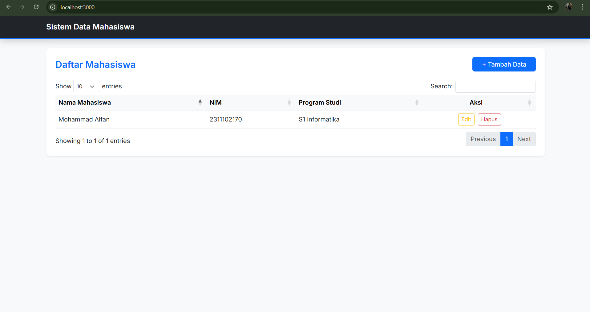
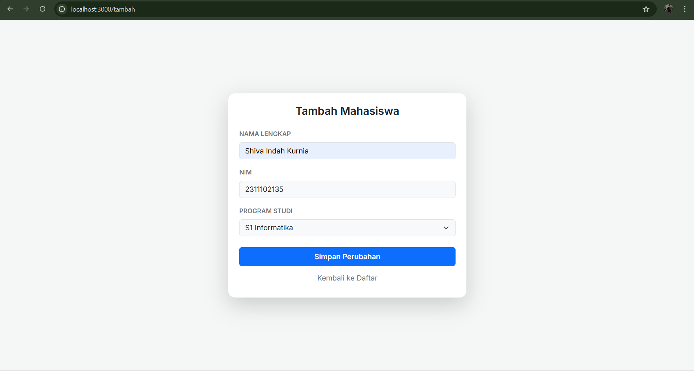
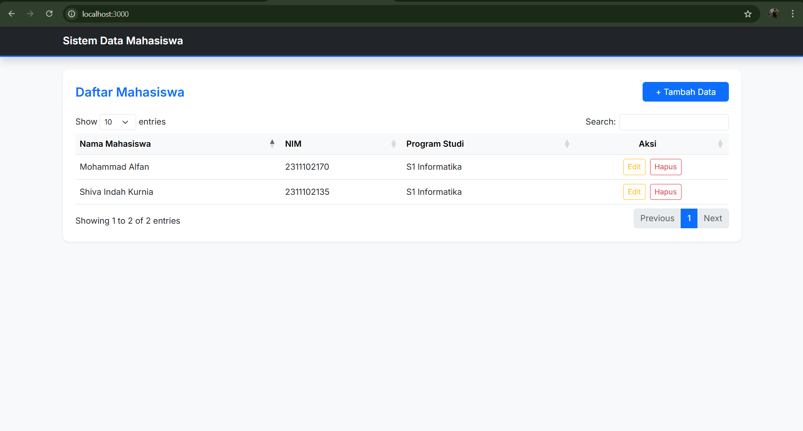
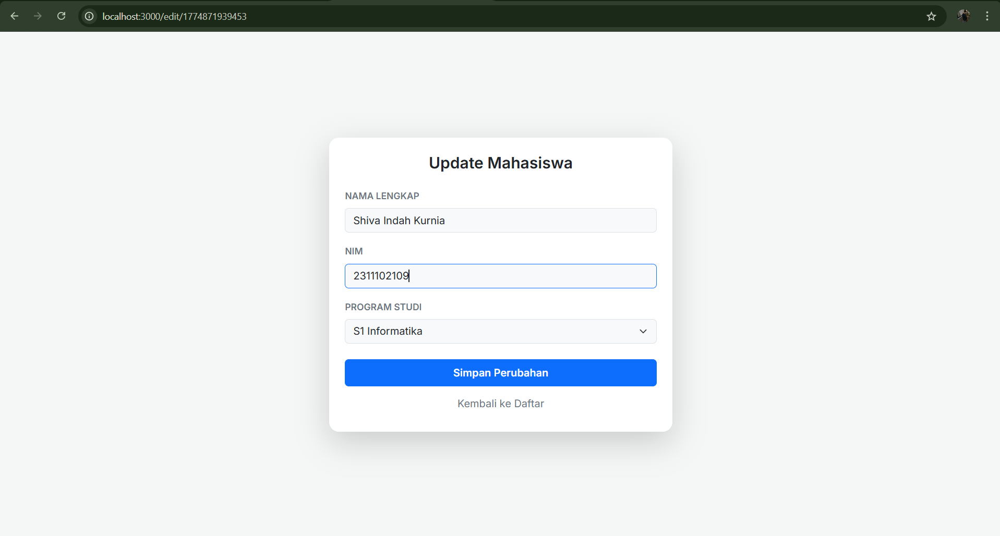
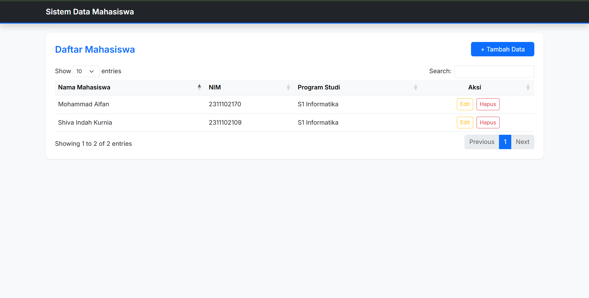
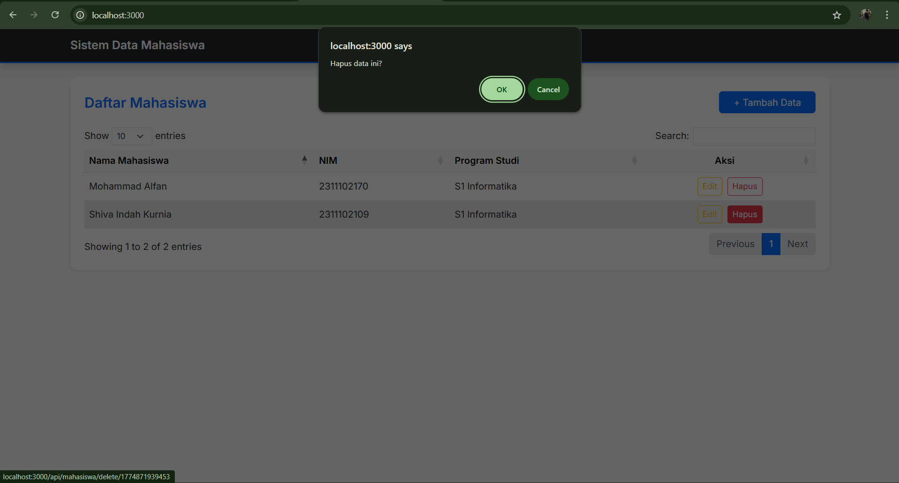
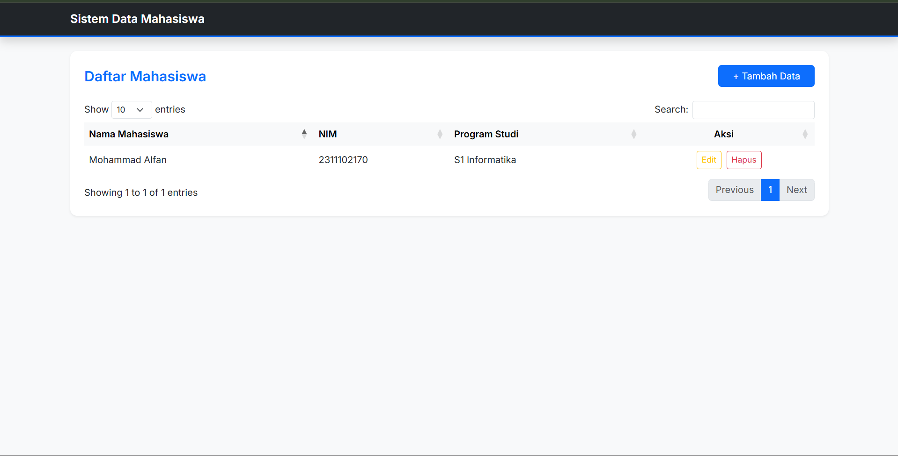

<div align="center">
  <br />
  <h1>LAPORAN PRAKTIKUM <br>APLIKASI BERBASIS PLATFORM</h1>
  <br />
  <h3>Tugas COTS-2 <br></h3>
  <br />
  <br />
  
  <br />
  <br />
  <h3>Disusun Oleh :</h3>
  <p>
    <strong>Mohammad Alfan Naraya</strong><br>
    <strong>2311102170</strong><br>
    <strong>S1 IF-11-01</strong>
  </p>
  <br />
  <br />
  <h3>Dosen Pengampu :</h3>
  <p>
    <strong>Dimas Fanny Hebrasianto Permadi, S.ST., M.Kom</strong>
  </p>
  <br />
  <br />
  <h4>Asisten Praktikum :</h4>
  <strong>Apri Pandu Wicaksono</strong> <br>
  <strong>Rangga Pradarrell Fathi</strong>
  <br />
  <h3>LABORATORIUM HIGH PERFORMANCE
 <br>FAKULTAS INFORMATIKA <br>UNIVERSITAS TELKOM PURWOKERTO <br>2026</h3>
</div>

---

## 1. Dasar Teori

**CRUD (Create, Read, Update, Delete)** merupakan empat operasi utama yang digunakan untuk mengelola data dalam sebuah aplikasi. Pada pengembangan aplikasi web, konsep CRUD digunakan agar pengguna dapat menambahkan data, menampilkan data, memperbarui data, serta menghapus data secara dinamis

**Bootstrap** adalah framework CSS bersifat open-source yang menyediakan berbagai komponen antarmuka siap pakai, seperti form, tombol, navbar, dan card.Pada proyek ini, Bootstrap digunakan untuk membangun tema *Dark Mode* yang responsif

**jQuery** adalah library JavaScript yang digunakan untuk mempermudah manipulasi DOM dan AJAX. Dengan jQuery, interaksi pada halaman web seperti penghapusan data dapat dilakukan tanpa memuat ulang seluruh halaman

**jQuery DataTables** merupakan plugin yang berfungsi untuk meningkatkan fitur pada elemen `<table>` HTML, seperti pencarian data (*search*), pengurutan (*sorting*), dan pembagian halaman (*pagination*) secara otomatis.

**JSON (JavaScript Object Notation)** adalah format pertukaran data yang ringan dan mudah dibaca.Data mahasiswa disimpan dalam file `data.json` untuk dikelola oleh server.

**Node.js & Express JS** adalah runtime dan framework backend yang digunakan untuk membangun aplikasi web, menangani request HTTP, routing, dan menyediakan endpoint data JSON.

**EJS (Embedded JavaScript Templates)** adalah template engine yang digunakan untuk membuat halaman HTML dinamis dengan menyisipkan data dari server langsung ke halaman menggunakan sintaks tertentu

---

## 2. Kode Program

### A. `package.json`

```json
{
  "dependencies": {
    "body-parser": "^2.2.2",
    "ejs": "^5.0.1",
    "express": "^5.2.1"
  }
}
```

**Penjelasan `package.json`**

file package.json yang berfungsi sebagai daftar "bahan baku" atau library eksternal untuk menjalankan aplikasi web. Express bertugas sebagai kerangka kerja utama untuk membangun server dan mengatur rute halaman, sementara EJS berfungsi sebagai mesin templat yang menyisipkan data dinamis ke dalam kode HTML agar bisa tampil di browser. Terakhir, Body-parser berperan sebagai perantara yang mengekstrak data dari input formulir agar bisa diolah oleh server. Ketiga library ini bekerja sama untuk memastikan alur data dari form hingga ke tabel JSON berjalan sesuai spesifikasi praktikum.
---

### B. Backend `app.js`

```javascript
const express = require('express');
const bodyParser = require('body-parser');
const app = express();
const PORT = 3000;

app.set('view engine', 'ejs');
app.use(express.static('public'));
app.use(bodyParser.urlencoded({ extended: true }));
app.use(bodyParser.json());

// Database Sementara (Array)
let dataMahasiswa = [
    { id: 1, nama: "Mohammad Alfan", nim: "2311102170", prodi: "S1 Informatika" }
];

// --- ROUTES ---
app.get('/', (req, res) => res.render('index'));

// Endpoint API JSON (Syarat Wajib Poin 5)
app.get('/api/mahasiswa', (req, res) => {
    res.json({ data: dataMahasiswa });
});

app.get('/tambah', (req, res) => res.render('form', { mhs: null }));

app.post('/api/mahasiswa', (req, res) => {
    dataMahasiswa.push({ id: Date.now(), ...req.body });
    res.redirect('/');
});

app.get('/edit/:id', (req, res) => {
    const mhs = dataMahasiswa.find(d => d.id == req.params.id);
    res.render('form', { mhs });
});

app.post('/api/mahasiswa/update/:id', (req, res) => {
    const index = dataMahasiswa.findIndex(d => d.id == req.params.id);
    if (index !== -1) dataMahasiswa[index] = { id: parseInt(req.params.id), ...req.body };
    res.redirect('/');
});

app.get('/api/mahasiswa/delete/:id', (req, res) => {
    dataMahasiswa = dataMahasiswa.filter(d => d.id != req.params.id);
    res.redirect('/');
});

app.listen(PORT, () => console.log(`Server running: http://localhost:${PORT}`));
```

**Penjelasan `app.js`**

Kode ini berfungsi sebagai backend utama yang mengelola data mahasiswa menggunakan framework Express.js. Inti kodenya mengatur sistem CRUD (Tambah, Tampil, Ubah, Hapus) dengan menyimpan data dalam variabel array sebagai pengganti database.

Secara teknis, kode ini bertugas menyediakan API JSON pada rute /api/mahasiswa agar bisa dibaca oleh plugin DataTables, serta memproses input dari formulir menggunakan Body-parser. Setiap ada perubahan data (seperti menambah atau menghapus), server akan memperbarui isi array dan mengarahkan kembali pengguna ke halaman utama secara otomatis.

Terakhir, server dijalankan pada port 3000 dan dapat diakses melalui http://localhost:3000.


---

### C. Halaman Beranda `views/index.ejs`

```html
<!DOCTYPE html>
<html lang="id">
<head>
    <meta charset="UTF-8">
    <meta name="viewport" content="width=device-width, initial-scale=1.0">
    <title>Tugas Cots2</title>
    <link href="https://fonts.googleapis.com/css2?family=Inter:wght@400;600&display=swap" rel="stylesheet">
    <link href="https://cdn.jsdelivr.net/npm/bootstrap@5.3.0/dist/css/bootstrap.min.css" rel="stylesheet">
    <link href="https://cdn.datatables.net/1.13.4/css/dataTables.bootstrap5.min.css" rel="stylesheet">
    <style>
        body { font-family: 'Inter', sans-serif; background-color: #f8f9fa; }
        .card { border: none; border-radius: 12px; }
        .navbar { border-bottom: 3px solid #0d6efd; }
    </style>
</head>
<body>

    <nav class="navbar navbar-expand-lg navbar-dark bg-dark mb-4 shadow">
        <div class="container">
            <a class="navbar-brand fw-bold" href="#">Sistem Data Mahasiswa</a>
        </div>
    </nav>

    <div class="container">
        <div class="card shadow-sm p-4">
            <div class="d-flex justify-content-between align-items-center mb-4">
                <h4 class="fw-bold m-0 text-primary">Daftar Mahasiswa</h4>
                <a href="/tambah" class="btn btn-primary px-4">+ Tambah Data</a>
            </div>
            
            <div class="table-responsive">
                <table id="tabelMhs" class="table table-hover align-middle" style="width:100%">
                    <thead class="table-light">
                        <tr>
                            <th>Nama Mahasiswa</th>
                            <th>NIM</th>
                            <th>Program Studi</th>
                            <th class="text-center">Aksi</th>
                        </tr>
                    </thead>
                </table>
            </div>
        </div>
    </div>

    <script src="https://code.jquery.com/jquery-3.6.0.min.js"></script>
    <script src="https://cdn.datatables.net/1.13.4/js/jquery.dataTables.min.js"></script>
    <script src="https://cdn.datatables.net/1.13.4/js/dataTables.bootstrap5.min.js"></script>

    <script>
        $(document).ready(function() {
            $('#tabelMhs').DataTable({
                "ajax": "/api/mahasiswa",
                "columns": [
                    { "data": "nama" },
                    { "data": "nim" },
                    { "data": "prodi" },
                    { 
                        "data": "id",
                        "className": "text-center",
                        "render": function(data) {
                            return `
                                <a href="/edit/${data}" class="btn btn-sm btn-outline-warning me-1">Edit</a>
                                <a href="/api/mahasiswa/delete/${data}" class="btn btn-sm btn-outline-danger" onclick="return confirm('Hapus data ini?')">Hapus</a>
                            `;
                        }
                    }
                ]
            });
        });
    </script>
</body>
</html>
```

**Penjelasan `index.ejs`**

File index.ejs di atas merupakan halaman antarmuka utama yang berfungsi untuk menampilkan data mahasiswa dalam bentuk tabel dinamis menggunakan kerangka kerja Bootstrap 5. Struktur kodenya mencakup bagian navigasi (navbar) dan kartu visual (card) untuk memberikan tampilan yang rapi, namun inti fungsinya terletak pada penggunaan plugin jQuery DataTables. Melalui skrip di bagian bawah, tabel akan melakukan permintaan data secara asinkron ke rute /api/mahasiswa dan menerima respons dalam format JSON, yang kemudian dipetakan secara otomatis ke dalam kolom nama, NIM, dan program studi. Selain itu, setiap baris data dilengkapi dengan tombol aksi "Edit" dan "Hapus" yang terhubung langsung ke logika backend, sehingga pengguna dapat mengelola data mahasiswa secara interaktif tanpa perlu memuat ulang seluruh halaman secara manual.

---

### D. Halaman Form Input `views/form.ejs`

```html
<!DOCTYPE html>
<html lang="id">
<head>
    <meta charset="UTF-8">
    <title><%= mhs ? 'Edit' : 'Tambah' %> Data</title>
    <link href="https://fonts.googleapis.com/css2?family=Inter:wght@400;600&display=swap" rel="stylesheet">
    <link href="https://cdn.jsdelivr.net/npm/bootstrap@5.3.0/dist/css/bootstrap.min.css" rel="stylesheet">
    <style>
        body { font-family: 'Inter', sans-serif; background-color: #f4f7f6; }
        .card { border-radius: 15px; border: none; }
        .form-control:focus { box-shadow: none; border-color: #0d6efd; }
    </style>
</head>
<body class="d-flex align-items-center" style="min-height: 100vh;">

    <div class="container">
        <div class="row justify-content-center">
            <div class="col-md-5">
                <div class="card shadow-lg p-4">
                    <h4 class="fw-bold mb-4 text-center"><%= mhs ? 'Update Mahasiswa' : 'Tambah Mahasiswa' %></h4>
                    <form action="<%= mhs ? '/api/mahasiswa/update/' + mhs.id : '/api/mahasiswa' %>" method="POST">
                        <div class="mb-3">
                            <label class="form-label small text-secondary fw-bold">NAMA LENGKAP</label>
                            <input type="text" name="nama" class="form-control bg-light" value="<%= mhs ? mhs.nama : '' %>" required>
                        </div>
                        <div class="mb-3">
                            <label class="form-label small text-secondary fw-bold">NIM</label>
                            <input type="text" name="nim" class="form-control bg-light" value="<%= mhs ? mhs.nim : '' %>" required>
                        </div>
                        <div class="mb-4">
                            <label class="form-label small text-secondary fw-bold">PROGRAM STUDI</label>
                            <select name="prodi" class="form-select bg-light">
                                <option value="S1 Informatika" <%= mhs && mhs.prodi == 'S1 Informatika' ? 'selected' : '' %>>S1 Informatika</option>
                                <option value="S1 Sistem Informasi" <%= mhs && mhs.prodi == 'S1 Sistem Informasi' ? 'selected' : '' %>>S1 Sistem Informasi</option>
                                <option value="S1 Teknik Telekomunikasi" <%= mhs && mhs.prodi == 'S1 Teknik Telekomunikasi' ? 'selected' : '' %>>S1 Teknik Telekomunikasi</option>
                            </select>
                        </div>
                        <button type="submit" class="btn btn-primary w-100 py-2 fw-bold">Simpan Perubahan</button>
                        <a href="/" class="btn btn-link w-100 mt-2 text-decoration-none text-secondary">Kembali ke Daftar</a>
                    </form>
                </div>
            </div>
        </div>
    </div>

</body>
</html>
```

**Penjelasan `form.ejs`**

File form.ejs di atas merupakan halaman antarmuka formulir dinamis yang berfungsi sebagai sarana input sekaligus pembaruan data mahasiswa dengan tampilan modern dari Bootstrap 5. Inti dari kode ini terletak pada penggunaan logika EJS (<%= mhs ? ... %>) yang memungkinkan satu file formulir menjalankan dua peran sekaligus: jika server mengirimkan data mahasiswa, formulir akan otomatis terisi untuk proses Update, namun jika tidak ada data, formulir akan tampil kosong untuk proses Tambah baru. Saat tombol simpan ditekan, data yang dimasukkan ke dalam elemen input akan dikirim ke server melalui metode HTTP POST, yang kemudian akan diproses oleh backend untuk diperbarui atau disimpan ke dalam sistem. Desainnya yang menggunakan card shadow dan pengaturan posisi tengah layar memastikan pengalaman pengguna yang fokus dan bersih saat melakukan manipulasi data.

---

## 3. Screenshot Website

1. Tampilan Awal Halaman

2. Halaman Form Input Mahasiswa

3. Halaman Data Mahasiswa

4. Halaman Edit Data Mahasiswa

5. Hasil Update Data

6. Proses Hapus Data


---

## 4. Kesimpulan

pada tugas cots2 ini adalah aplikasi CRUD (Create, Read, Update, Delete) berbasis Node.js yang menggunakan Express.js sebagai server dan EJS sebagai pengelola tampilan. Data dikelola secara dinamis dalam format JSON agar bisa ditampilkan secara otomatis oleh plugin DataTables, sementara Bootstrap 5 memastikan antarmuka formulir dan tabel terlihat modern serta responsif. Semua fungsi mulai dari menambah, mengedit, hingga menghapus data mahasiswa sudah terintegrasi secara rapi antara sisi backend dan frontend.
---

## 5. Referensi

1. https://expressjs.com
2. https://nodejs.org
3. https://getbootstrap.com
4. https://jquery.com
5. https://datatables.net
6. https://ejs.co

## 6. Link Video Presentasi

