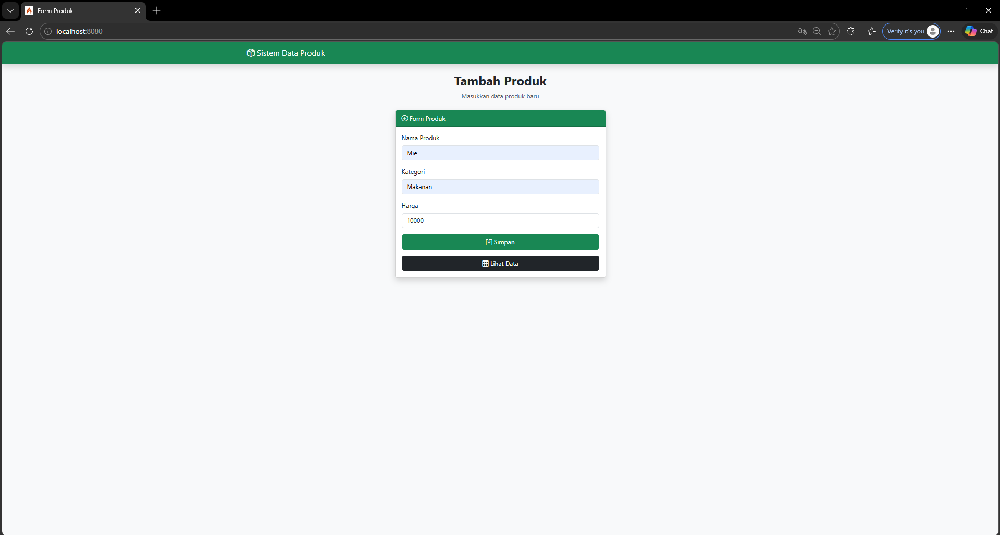
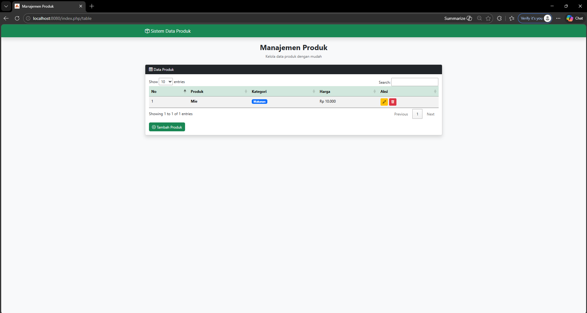
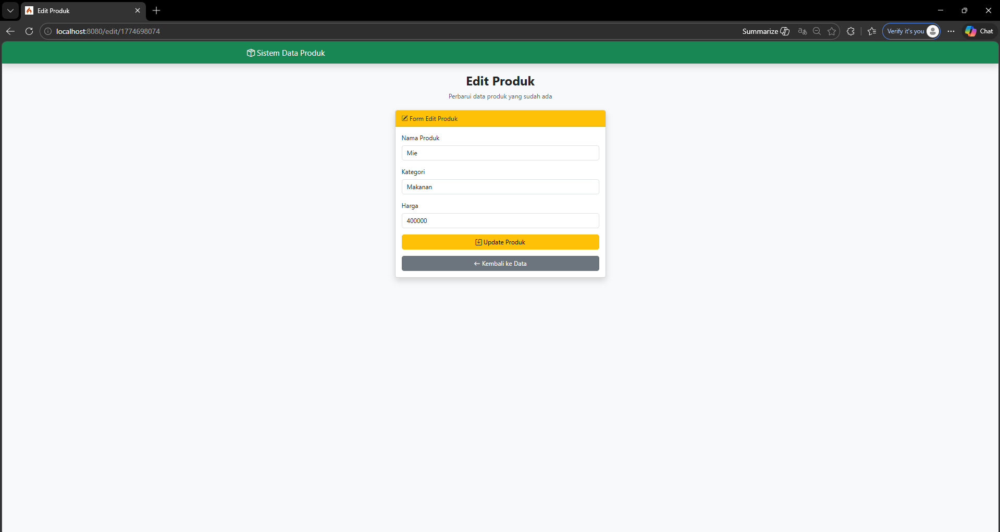

<div align="center">
  <br />

  <h1>LAPORAN PRAKTIKUM <br>
  APLIKASI BERBASIS PLATFORM
  </h1>

  <br />

  <h3>TUGAS PRAKTIKUM 2 <br>
 COTS (Coding On The Spot) 2
  </h3>

  <br />

  

  <br />
  <br />
  <br />

  <h3>Disusun Oleh :</h3>

  <p>
    <strong>Andreas Besar Wibowo</strong><br>
    <strong>2311102198</strong><br>
    <strong>S1 IF-11-REG01</strong>
  </p>

  <br />

  <h3>Dosen Pengampu :</h3>

  <p>
    <strong>Dimas Fanny Hebrasianto Permadi, S.ST., M.Kom</strong>
  </p>
  
  <br />
    <h4>Asisten Praktikum :</h4>
    <strong>Apri Pandu Wicaksono </strong> <br>
    <strong>Rangga Pradarrell Fathi</strong>
  <br />

  <h3>LABORATORIUM HIGH PERFORMANCE
 <br>FAKULTAS INFORMATIKA <br>UNIVERSITAS TELKOM PURWOKERTO <br>2026</h3>
</div>

<hr>

## Tugas
### Buatlah sebuah aplikasi web sederhana yang memiliki minimal 3 (tiga) halaman fungsional yang mencakup Form, Halaman Data (Tabel), dan fungsionalitas CRUD (Create, Read, Update, Delete).
#### A. Spesifikasi Teknis Pengembangan (Wajib):
1. Aplikasi harus menggunakan Framework Bootstrap sebagai styling.
2. Aplikasi harus dibangun menggunakan Framework CodeIgniter (CI) atau NodeJS (express, fastify, atau berbasis library lain nya).
3. Struktur Halaman: Minimal terdiri dari 3 halaman utama:
    - Halaman Form (Input Data)
    - Halaman Tabel / Tampil Data
    - Fungsionalitas CRUD yang berjalan dengan baik.
4. Wajib menggunakan jQuery dan jQuery plugin.
5. Data yang ditampilkan pada tabel wajib menggunakan format data JSON, yang diimplementasikan menggunakan datatable Jquery.

#### B. Luaran
- Source code + screenshot output
- Video presentasi (menjelaskan kodenya dan output aplikasi) maksimal 10 menit dan ditambahkan pada laporan menggunakan tautan video

## Jawaban
### Kode Program
1. Controllers/Produk.php
```php
<?php

namespace App\Controllers;

class Produk extends BaseController
{
    private $file = WRITEPATH . 'produk.json';

    private function readData()
    {
        if (!file_exists($this->file)) {
            file_put_contents($this->file, json_encode([]));
        }
        return json_decode(file_get_contents($this->file), true);
    }

    private function writeData($data)
    {
        file_put_contents($this->file, json_encode($data, JSON_PRETTY_PRINT));
    }

    public function form()
    {
        return view('form');
    }

    public function table()
    {
        return view('table');
    }

    public function edit($id)
    {
        $data = $this->readData();
        foreach ($data as $d) {
            if ($d['id'] == $id) {
                return view('edit', ['produk' => $d]);
            }
        }
    }

    // Json
    public function getData()
    {
        return $this->response->setJSON([
            "data" => $this->readData()
        ]);
    }

    // Create
    public function save()
    {
        $data = $this->readData();

        $data[] = [
            "id" => time(),
            "nama" => $this->request->getPost('nama'),
            "kategori" => $this->request->getPost('kategori'),
            "harga" => $this->request->getPost('harga')
        ];

        $this->writeData($data);

        return redirect()->to('/table');
    }

    // Update
    public function update($id)
    {
        $data = $this->readData();

        foreach ($data as &$d) {
            if ($d['id'] == $id) {
                $d['nama'] = $this->request->getPost('nama');
                $d['kategori'] = $this->request->getPost('kategori');
                $d['harga'] = $this->request->getPost('harga');
            }
        }

        $this->writeData($data);

        return redirect()->to('/table');
    }

    // Delete
    public function delete($id)
    {
        $data = $this->readData();

        $data = array_filter($data, fn($d) => $d['id'] != $id);

        $this->writeData(array_values($data));

        return redirect()->to('/table');
    }
}
```

2. Config/Routes.php
```php
<?php

use CodeIgniter\Router\RouteCollection;

/**
 * @var RouteCollection $routes
 */
$routes->get('/', 'Produk::form');
$routes->get('/table', 'Produk::table');
$routes->get('/edit/(:num)', 'Produk::edit/$1');

$routes->post('/save', 'Produk::save');
$routes->post('/update/(:num)', 'Produk::update/$1');
$routes->get('/delete/(:num)', 'Produk::delete/$1');

$routes->get('/data', 'Produk::getData');
```

3. Views/form.php
```html
<!-- Andreas Besar Wibowo -->
<!-- 2311102198 / IF - 11 - 01 -->

<!DOCTYPE html>
<html lang="id">

<head>
    <meta charset="UTF-8">
    <title>Form Produk</title>

    <!-- Bootstrap -->
    <link href="https://cdn.jsdelivr.net/npm/bootstrap@5.3.2/dist/css/bootstrap.min.css" rel="stylesheet">

    <!-- Icons -->
    <link rel="stylesheet" href="https://cdn.jsdelivr.net/npm/bootstrap-icons@1.11.1/font/bootstrap-icons.css">

    <!-- jQuery -->
    <script src="https://code.jquery.com/jquery-3.7.1.min.js"></script>
</head>

<body class="bg-light">

    <!-- Navigation Bar -->
    <nav class="navbar navbar-dark bg-success shadow">
        <div class="container">
            <span class="navbar-brand">
                <i class="bi bi-box-seam"></i> Sistem Data Produk
            </span>
        </div>
    </nav>

    <div class="container mt-4">

        <!-- Header/ Judul -->
        <div class="text-center mb-4">
            <h2 class="fw-bold">Tambah Produk</h2>
            <p class="text-muted">Masukkan data produk baru</p>
        </div>

        <!-- Alert -->
        <div id="alertBox"></div>

        <!-- Menu -->
        <div class="card shadow col-md-5 mx-auto">

            <div class="card-header bg-success text-white">
                <i class="bi bi-plus-circle"></i> Form Produk
            </div>

            <div class="card-body">

                <form id="formProduk" method="post" action="/save">

                    <div class="mb-3">
                        <label class="form-label">Nama Produk</label>
                        <input type="text" name="nama" id="nama" class="form-control">
                    </div>

                    <div class="mb-3">
                        <label class="form-label">Kategori</label>
                        <input type="text" name="kategori" id="kategori" class="form-control">
                    </div>

                    <div class="mb-3">
                        <label class="form-label">Harga</label>
                        <input type="number" name="harga" id="harga" class="form-control">
                    </div>

                    <button class="btn btn-success w-100">
                        <i class="bi bi-save"></i> Simpan
                    </button>

                </form>

                <a href="/table" class="btn btn-dark w-100 mt-3">
                    <i class="bi bi-table"></i> Lihat Data
                </a>

            </div>
        </div>

    </div>

    <!-- Script Validasi -->
    <script>

        $("#formProduk").submit(function (e) {

            let nama = $("#nama").val().trim();
            let kategori = $("#kategori").val().trim();
            let harga = $("#harga").val().trim();

            if (nama === "" || kategori === "" || harga === "") {
                e.preventDefault();

                showAlert("Semua field wajib diisi!", "danger");
                return false;
            }

            if (harga <= 0) {
                e.preventDefault();

                showAlert("Harga harus lebih dari 0!", "warning");
                return false;
            }

        });

        function showAlert(msg, type = "danger") {
            $("#alertBox").html(`
        <div class="alert alert-${type} alert-dismissible fade show">
            ${msg}
            <button class="btn-close" data-bs-dismiss="alert"></button>
        </div>
    `);
        }

    </script>

    <script src="https://cdn.jsdelivr.net/npm/bootstrap@5.3.2/dist/js/bootstrap.bundle.min.js"></script>

</body>

</html>
```

4. Views/table.php
```html
<!-- Andreas Besar Wibowo -->
<!-- 2311102198 / IF - 11 - 01 -->

<!DOCTYPE html>
<html lang="id">

<head>
    <meta charset="UTF-8">
    <title>Manajemen Produk</title>

    <link href="https://cdn.jsdelivr.net/npm/bootstrap@5.3.2/dist/css/bootstrap.min.css" rel="stylesheet">
    <link rel="stylesheet" href="https://cdn.jsdelivr.net/npm/bootstrap-icons@1.11.1/font/bootstrap-icons.css">

    <script src="https://code.jquery.com/jquery-3.7.1.min.js"></script>

    <link rel="stylesheet" href="https://cdn.datatables.net/1.13.6/css/jquery.dataTables.min.css">
    <script src="https://cdn.datatables.net/1.13.6/js/jquery.dataTables.min.js"></script>

</head>

<body class="bg-light">

    <!-- Navigation Bar -->
    <nav class="navbar navbar-dark bg-success shadow">
        <div class="container">
            <span class="navbar-brand">
                <i class="bi bi-box-seam"></i> Sistem Data Produk
            </span>
        </div>
    </nav>

    <div class="container mt-4">

        <div class="text-center mb-4">
            <h2 class="fw-bold">Manajemen Produk</h2>
            <p class="text-muted">Kelola data produk dengan mudah</p>
        </div>

        <div class="card shadow">
            <div class="card-header bg-dark text-white">
                <i class="bi bi-table"></i> Data Produk
            </div>

            <div class="card-body">

                <table id="tbl" class="table table-striped">
                    <thead class="table-success">
                        <tr>
                            <th>No</th>
                            <th>Produk</th>
                            <th>Kategori</th>
                            <th>Harga</th>
                            <th>Aksi</th>
                        </tr>
                    </thead>
                </table>

                <a href="/" class="btn btn-success mt-3">
                    <i class="bi bi-plus-circle"></i> Tambah Produk
                </a>

            </div>
        </div>

    </div>

    <script>
        function formatRupiah(angka) {
            return "Rp " + parseInt(angka).toLocaleString("id-ID");
        }

        $('#tbl').DataTable({
            ajax: {
                url: '/data',
                dataSrc: 'data'
            },
            columns: [
                { data: null, render: (d, t, r, m) => m.row + 1 },
                { data: 'nama', render: d => "<b>" + d + "</b>" },
                { data: 'kategori', render: d => `<span class="badge bg-primary">${d}</span>` },
                { data: 'harga', render: d => formatRupiah(d) },
                {
                    data: null,
                    render: function (d) {
                        return `
                <a href="/edit/${d.id}" class="btn btn-warning btn-sm">
                    <i class="bi bi-pencil"></i>
                </a>
                <a href="/delete/${d.id}" class="btn btn-danger btn-sm">
                    <i class="bi bi-trash"></i>
                </a>`;
                    }
                }
            ]
        });
    </script>

</body>

</html>
```

5. Views/edit.php
```html
<!-- Andreas Besar Wibowo -->
<!-- 2311102198 / IF - 11 - 01 -->

<!DOCTYPE html>
<html lang="id">

<head>
    <meta charset="UTF-8">
    <title>Edit Produk</title>

    <!-- Bootstrap -->
    <link href="https://cdn.jsdelivr.net/npm/bootstrap@5.3.2/dist/css/bootstrap.min.css" rel="stylesheet">

    <!-- Icons -->
    <link rel="stylesheet" href="https://cdn.jsdelivr.net/npm/bootstrap-icons@1.11.1/font/bootstrap-icons.css">
</head>

<body class="bg-light">

    <!-- Navigation Bar -->
    <nav class="navbar navbar-dark bg-success shadow">
        <div class="container">
            <span class="navbar-brand">
                <i class="bi bi-box-seam"></i> Sistem Data Produk
            </span>
        </div>
    </nav>

    <div class="container mt-4">

        <!-- Header/ Judul -->
        <div class="text-center mb-4">
            <h2 class="fw-bold">Edit Produk</h2>
            <p class="text-muted">Perbarui data produk yang sudah ada</p>
        </div>

        <!-- Menu -->
        <div class="card shadow col-md-5 mx-auto">

            <div class="card-header bg-warning text-dark">
                <i class="bi bi-pencil-square"></i> Form Edit Produk
            </div>

            <div class="card-body">

                <form method="post" action="/update/<?= $produk['id'] ?>">

                    <div class="mb-3">
                        <label class="form-label">Nama Produk</label>
                        <input type="text" name="nama" class="form-control" value="<?= $produk['nama'] ?>" required>
                    </div>

                    <div class="mb-3">
                        <label class="form-label">Kategori</label>
                        <input type="text" name="kategori" class="form-control" value="<?= $produk['kategori'] ?>"
                            required>
                    </div>

                    <div class="mb-3">
                        <label class="form-label">Harga</label>
                        <input type="number" name="harga" class="form-control" value="<?= $produk['harga'] ?>" required>
                    </div>

                    <button class="btn btn-warning w-100">
                        <i class="bi bi-save"></i> Update Produk
                    </button>

                </form>

                <!-- Tombol Kembali -->
                <a href="/table" class="btn btn-secondary w-100 mt-3">
                    <i class="bi bi-arrow-left"></i> Kembali ke Data
                </a>

            </div>
        </div>

    </div>

</body>

</html>
```

6. writable/produk.json
```json
[]
```

### Output
#### Form Input Data Produk

#### Lihat Data Produk dalam Bentuk Tabel

#### Form Edit Data Produk


### Penjelasan
#### Controller
1. Struktur dasar
```php
class Produk extends BaseController
{
    private $file = WRITEPATH . 'produk.json';
}
```
Controller ini merupakan pusat dari logika aplikasi ini dalam menangani request dari user dan mengatur alur sistem. Controller ini menggunakan BaseController dari CodeIgniter

2. Read & Write JSON
```php
private function readData()
{
    if (!file_exists($this->file)) {
        file_put_contents($this->file, json_encode([]));
    }
    return json_decode(file_get_contents($this->file), true);
}

private function writeData($data)
{
    file_put_contents($this->file, json_encode($data, JSON_PRETTY_PRINT));
}
```
Fungsi readData() digunakan untuk membaca sebuah data, dan writeData() untuk menyimpan data

3. Routing halaman
```php
public function form()
{
    return view('form');
}

public function table()
{
    return view('table');
}

public function edit($id)
{
    $data = $this->readData();
    foreach ($data as $d) {
        if ($d['id'] == $id) {
            return view('edit', ['produk' => $d]);
        }
    }
}
```
Controller menyediakan method untuk menampilkan halaman form, tabel, dan edit

4. CRUD
- Create (Tambah Data):
```php
public function save()
{
    $data = $this->readData();

    $data[] = [
        "id" => time(),
        "nama" => $this->request->getPost('nama'),
        "kategori" => $this->request->getPost('kategori'),
        "harga" => $this->request->getPost('harga')
    ];

    $this->writeData($data);
}
```
- Read (Ambil Data JSON):
```php 
public function getData()
{
    return $this->response->setJSON([
        "data" => $this->readData()
    ]);
}
```
- Update (Edit Data):
```php 
public function update($id)
{
    $data = $this->readData();

    foreach ($data as &$d) {
        if ($d['id'] == $id) {
            $d['nama'] = $this->request->getPost('nama');
        }
    }

    $this->writeData($data);
}
```
- Delete (Hapus Data):
```php 
public function delete($id)
{
    $data = $this->readData();
    $data = array_filter($data, fn($d) => $d['id'] != $id);
    $this->writeData(array_values($data));
}
```
Controller yang mengimplementasikan operasi CRUD (Create, Read, Update, Delete).

#### View
1. form.php (Tambah Data)
```html
<form id="formProduk" method="post" action="/save">
    <input type="text" name="nama" id="nama" class="form-control">
    <input type="text" name="kategori" id="kategori" class="form-control">
    <input type="number" name="harga" id="harga" class="form-control">
    <button class="btn btn-success">Simpan</button>
</form>
```
Halaman ini digunakan untuk menambahkan data produk baru dengan mengisinya melalui form input data

2. table.php (Tampilkan Data)
```javascript
$('#tbl').DataTable({
    ajax: {
        url: '/data',
        dataSrc: 'data'
    },
    columns: [
        { data: 'nama' },
        { data: 'kategori' },
        { data: 'harga' }
    ]
});
```
Halaman ini menampilkan data produk dalam bentuk tabel dengan menggunakan plugin DataTables dan data JSON

3. edit.php (Edit Data)
```html
<form method="post" action="/update/<?= $produk['id'] ?>">
    <input type="text" name="nama" value="<?= $produk['nama'] ?>">
    <input type="text" name="kategori" value="<?= $produk['kategori'] ?>">
    <input type="number" name="harga" value="<?= $produk['harga'] ?>">
    <button class="btn btn-warning">Update</button>
</form>
```
Halaman ini digunakan untuk mengedit atau mengubah data produk yang sudah ada. Form akan otomatis terisi dengan data sebelumnya.

#### Penggunaan Framework CodeIgniter
Program ini menggunakan Framework CodeIgniter yang menerapkan konsep MVC atau Model-View-Controller. Konsep ini memisahkan antara logika program, tampilan, dan pengelolaan data. Hal ini membuat kode lebih terstruktur

Berikut adalah implementasi dalam program ini :
- Controller (Produk.php), digfunakan untuk mengatur alur aplikasi mulai dari request dari routing, memproses data, dan menentukan view yang akan ditampilkan
- View (form.php, table.php, edit.php), digunakan untuk menampilkan tampilan ke pengguna
- Pada program ini, data tidak menggunakan database. Datanya disimpan pada file JSON

Selain itu, CodeIgniter menyediakan fitur routing yang memudahkan pengaturan URL supaya terhubung langsung dengan method pada controller. Framework ini mempermudah dalam mengelola request dan response, termasuk penggunaan POST/GET dan membuat API sederhana dalam format JSON

## Video Presentasi
Link : [Video Presentasi](https://drive.google.com/file/d/1OgqayYGkNHk6izqHglkwV7leyt-d4FHQ/view?usp=sharing)