<div align="center">
  <br>

  <h1>LAPORAN PRAKTIKUM <br>
  APLIKASI BERBASIS PLATFORM
  </h1>

  <br>

  <h3>Tugas COTS (Coding On the Spot) 2</h3>

  <br>

  


  <br>
  <br>
  <br>

  <h3>Disusun Oleh :</h3>

  <p>
    <strong>Irshad Benaya Fardeca</strong><br>
    <strong>2311102199</strong><br>
    <strong>S1 IF-11-REG01</strong>
  </p>

  <br>

  <h3>Dosen Pengampu :</h3>

  <p>
    <strong>Dimas Fanny Hebrasianto Permadi, S.ST., M.Kom</strong>
  </p>
  
  <br>
  <br>
    <h4>Asisten Praktikum :</h4>
    <strong>Apri Pandu Wicaksono </strong> <br>
    <strong>Rangga Pradarrell Fathi</strong>
  <br>

  <h3>LABORATORIUM HIGH PERFORMANCE
 <br>FAKULTAS INFORMATIKA <br>UNIVERSITAS TELKOM PURWOKERTO <br>2026</h3>
</div>
<hr>

# Tugas COTS 2
Buatlah sebuah aplikasi web sederhana yang memiliki minimal 3 (tiga) halaman fungsional yang mencakup Form, Halaman Data (Tabel), dan fungsionalitas CRUD (Create, Read, Update, Delete).

A. Spesifikasi Teknis Pengembangan (Wajib):

1. Aplikasi harus menggunakan Framework Bootstrap sebagai styling.
    
2. Aplikasi harus dibangun menggunakan Framework CodeIgniter (CI) atau NodeJS (express, fastify, atau berbasis library lain nya).
    
3. *Struktur Halaman:* Minimal terdiri dari 3 halaman utama:
    
    - Halaman Form (Input Data)
    - Halaman Tabel / Tampil Data
    - Fungsionalitas CRUD yang berjalan dengan baik.
        
4. Wajib menggunakan jQuery dan jQuery plugin.

5. Data yang ditampilkan pada tabel wajib menggunakan format *data JSON*, yang diimplementasikan menggunakan datatable Jquery.

<br>

# TWS Store
## 1. `Routes.php`

Routing mendefinisikan URL yang dapat diakses dan menghubungkannya ke metode di controller.

```php
$routes->get('/', 'Tws::index');
$routes->get('tws', 'Tws::index');
$routes->get('tws/create', 'Tws::create');
$routes->get('tws/edit/(:num)', 'Tws::edit/$1');
$routes->post('tws/save', 'Tws::save');
$routes->get('tws/delete/(:num)', 'Tws::delete/$1');
$routes->get('tws/json', 'Tws::json');
```

(:num) adalah placeholder untuk parameter numerik (ID). 
post digunakan untuk menyimpan data form. 
Endpoint /tws/json mengembalikan seluruh data dalam format JSON untuk diolah DataTables.

---

## 2. `Tws.php` — Controller

Controller menjembatani model dan view.

```php
<?php

namespace App\Controllers;

use App\Models\TwsModel;

class Tws extends BaseController
{
    private $twsModel;

    public function __construct()
    {
        $this->twsModel = new TwsModel();
    }

    public function index()
    {
        return view('view_table');
    }

    public function create()
    {
        return view('create');
    }

    public function edit($id)
    {
        $tws = $this->twsModel->getById($id);
        if (!$tws) {
            return redirect()->to('/tws')->with('error', 'Data TWS tidak ditemukan');
        }
        return view('edit');
    }

    public function save()
    {
        $id = $this->request->getPost('id');
        $name = $this->request->getPost('name');
        $brand = $this->request->getPost('brand');
        $price = (int) $this->request->getPost('price');
        $battery = $this->request->getPost('battery');

        if (empty($name) || empty($brand) || $price <= 0) {
            return redirect()->back()->withInput()->with('error', 'Nama, merek wajib diisi dan harga > 0');
        }

        $data = [
            'name'    => $name,
            'brand'   => $brand,
            'price'   => $price,
            'battery' => $battery ?: '-'
        ];

        if ($id) {
            $this->twsModel->update($id, $data);
            session()->setFlashdata('success', 'TWS berhasil diupdate');
        } else {
            $this->twsModel->insert($data);
            session()->setFlashdata('success', 'TWS berhasil ditambahkan');
        }

        return redirect()->to('/tws');
    }

    public function delete($id)
    {
        $this->twsModel->delete($id);
        return $this->response->setJSON(['status' => 'success']);
    }

    public function json()
    {
        $items = $this->twsModel->getAll();
        return $this->response->setJSON($items);
    }
}
```
### `__construct()`
Dijalankan otomatis saat Controller pertama kali dipanggil. Tugasnya menyiapkan model agar siap dipakai di semua fungsi.

### `index()`
Hanya menampilkan halaman tabel. Data diambil nanti oleh JavaScript secara terpisah lewat AJAX.

### `create()`
Menampilkan form kosong untuk menambah TWS baru. `'tws' => null` berarti tidak ada data awal yang diisi di form.

### `edit($id)`
Mencari data berdasarkan ID, lalu membuka form yang sudah terisi data lama. Jika ID tidak ditemukan, langsung redirect balik ke halaman tabel dengan pesan error.

### `save()`
Memproses kiriman form. 

### `delete($id)`
Menghapus data, lalu mengembalikan respons JSON `{"status":"success"}` agar JavaScript di browser tahu penghapusan berhasil.

### `json()`
Mengambil semua data dan mengirimkannya dalam format JSON. Fungsi ini yang dipanggil oleh DataTables untuk mengisi tabel secara otomatis.

---

## 3. `TwsModel.php` — Model (Pengelola Data)
Model bertugas membaca dan menyimpan data ke file `tws.json`. Data disimpan ke dalam file JSON.

```php
<?php

namespace App\Models;

class TwsModel
{
    private $filePath;

    public function __construct()
    {
        $this->filePath = WRITEPATH . 'data/tws.json';
        $this->initFile();
    }

    private function initFile()
    {
        $directory = dirname($this->filePath);
        if (!is_dir($directory)) {
            mkdir($directory, 0755, true);
        }
        if (!file_exists($this->filePath)) {
            file_put_contents($this->filePath, json_encode([]));
        }
    }

    private function readData()
    {
        $data = file_get_contents($this->filePath);
        return json_decode($data, true) ?: [];
    }

    private function writeData($data)
    {
        file_put_contents($this->filePath, json_encode($data, JSON_PRETTY_PRINT));
    }

    public function getAll()
    {
        return $this->readData();
    }

    public function getById($id)
    {
        $items = $this->readData();
        foreach ($items as $item) {
            if ($item['id'] == $id) {
                return $item;
            }
        }
        return null;
    }

    public function insert($data)
    {
        $items = $this->readData();
        $data['id'] = time();
        $items[] = $data;
        $this->writeData($items);
        return $data['id'];
    }

    public function update($id, $data)
    {
        $items = $this->readData();
        foreach ($items as &$item) {
            if ($item['id'] == $id) {
                $item = array_merge($item, $data);
                $this->writeData($items);
                return true;
            }
        }
        return false;
    }

    public function delete($id)
    {
        $items = $this->readData();
        $newItems = array_filter($items, function ($item) use ($id) {
            return $item['id'] != $id;
        });
        $this->writeData(array_values($newItems));
        return true;
    }
}
```

### `__construct()`
Menentukan lokasi file JSON (`writable/data/tws.json`) dan langsung memanggil `initFile()`.

### `initFile()`
Memastikan folder dan file JSON sudah ada.
- Jika folder belum ada maka akan membuat folder
- Jika file belum ada maka akan membuat file dengan isi array kosong `[]`

### `readData()` & `writeData()`
- `readData()` untuk membaca isi file dan mengubah teks JSON menjadi array
- `writeData()` untuk mengubah array menjadi teks JSON lalu return ke dalam file

### `getAll()`
Ambil semua data, langsung return semua isi file.

### `getById($id)`
Loop semua data satu per satu, cari yang ID-nya cocok. Jika ketemu return data tersebut, jika tidak return `null`.

### `insert($data)`
Tambah data baru. ID dibuat dari `time()` (timestamp ) sehingga setiap data punya ID unik berdasarkan waktu penyimpanan. Data baru ditambahkan ke ujung array, lalu disimpan.

### `update($id, $data)`
Cari data dengan ID yang cocok menggunakan `&$item` (tanda `&` berarti referensi langsung, bukan salinan), lalu gabungkan dengan data baru menggunakan `array_merge`.
- Jika ketemu maka simpan dan return `true`
- Jika tidak maka return `false`

### `delete($id)`
Gunakan `array_filter` untuk memfilter sehingga menyimpan semua data yang ID-nya tidak sama dengan ID yang mau dihapus. `array_values` dipakai untuk merapikan ulang nomor indeks array setelah filter.

```php
public function delete($id) {
    $items    = $this->readData();
    $newItems = array_filter($items, function ($item) use ($id) {
        return $item['id'] != $id;
    });
    $this->writeData(array_values($newItems));
    return true;
}
```

---

## 4. `create.php` & `edit.php` — Halaman Form (Tambah / Edit)
### create.php
```php
<!DOCTYPE html>
<html lang="id">
<head>
    <meta charset="UTF-8">
    <meta name="viewport" content="width=device-width, initial-scale=1.0">
    <title>Tambah TWS | TWS Manager</title>
    <link href="https://cdn.jsdelivr.net/npm/bootstrap@5.3.0/dist/css/bootstrap.min.css" rel="stylesheet">
    <link rel="stylesheet" href="https://cdnjs.cloudflare.com/ajax/libs/font-awesome/6.4.0/css/all.min.css">
    <script src="https://cdn.jsdelivr.net/npm/sweetalert2@11"></script>
    <style>
        body { background: #f2f4f8; font-family: Segoe UI, sans-serif; }
        .card { border-radius: 12px; border: none; }
        .btn-primary { background: #4f46e5; border: none; }
    </style>
</head>
<body>

<nav class="navbar bg-white shadow-sm mb-4">
    <div class="container">
        <span class="navbar-brand fw-bold text-primary">
            <i class="fa-solid fa-headphones"></i> TWS Store
        </span>
        <div>
            <a href="<?= base_url('/tws') ?>" class="btn btn-outline-primary btn-sm">
                <i class="fa fa-table"></i> Lihat Data
            </a>
        </div>
    </div>
</nav>

<div class="container">
    <div class="row justify-content-center">
        <div class="col-lg-6">
            <div class="card p-4 shadow-sm">
                <h5 class="mb-3">Tambah TWS Baru</h5>

                <?php if (session()->getFlashdata('error')): ?>
                    <div class="alert alert-danger"><?= session()->getFlashdata('error') ?></div>
                <?php endif; ?>

                <form action="<?= base_url('tws/save') ?>" method="post">
                    <?= csrf_field() ?>
                    <?php if (isset($tws)): ?>
                        <input type="hidden" name="id" value="<?= $tws['id'] ?>">
                    <?php endif; ?>

                    <div class="mb-3">
                        <label>Nama TWS</label>
                        <input type="text" name="name" class="form-control" value="<?= old('name', $tws['name'] ?? '') ?>" required>
                    </div>

                    <div class="mb-3">
                        <label>Merek</label>
                        <input type="text" name="brand" class="form-control" value="<?= old('brand', $tws['brand'] ?? '') ?>" required>
                    </div>

                    <div class="mb-3">
                        <label>Harga (Rp)</label>
                        <input type="number" name="price" class="form-control" value="<?= old('price', $tws['price'] ?? '') ?>" required>
                    </div>

                    <div class="mb-3">
                        <label>Baterai (misal: 8 jam)</label>
                        <input type="text" name="battery" class="form-control" value="<?= old('battery', $tws['battery'] ?? '') ?>" placeholder="Contoh: 8 jam">
                    </div>

                    <button type="submit" class="btn btn-primary w-100">
                        <i class="fa fa-save"></i> Simpan TWS
                    </button>
                </form>
            </div>
        </div>
    </div>
</div>

<script src="https://code.jquery.com/jquery-3.7.0.min.js"></script>
<script src="https://cdn.jsdelivr.net/npm/bootstrap@5.3.0/dist/js/bootstrap.bundle.min.js"></script>

<?php if (session()->getFlashdata('success')): ?>
    <script>
        Swal.fire({
            icon: 'success',
            title: 'Berhasil!',
            text: '<?= session()->getFlashdata('success') ?>',
            timer: 2000,
            showConfirmButton: false
        });
    </script>
<?php endif; ?>

</body>
</html>
```
### edit.php
```php
<!DOCTYPE html>
<html lang="id">
<head>
    <meta charset="UTF-8">
    <meta name="viewport" content="width=device-width, initial-scale=1.0">
    <title>Edit TWS | TWS Manager</title>
    <link href="https://cdn.jsdelivr.net/npm/bootstrap@5.3.0/dist/css/bootstrap.min.css" rel="stylesheet">
    <link rel="stylesheet" href="https://cdnjs.cloudflare.com/ajax/libs/font-awesome/6.4.0/css/all.min.css">
    <script src="https://cdn.jsdelivr.net/npm/sweetalert2@11"></script>
    <style>
        body { background: #f2f4f8; font-family: Segoe UI, sans-serif; }
        .card { border-radius: 12px; border: none; }
        .btn-primary { background: #4f46e5; border: none; }
    </style>
</head>
<body>

<nav class="navbar bg-white shadow-sm mb-4">
    <div class="container">
        <span class="navbar-brand fw-bold text-primary">
            <i class="fa-solid fa-headphones"></i> TWS Store
        </span>
        <div>
            <a href="<?= base_url('/tws') ?>" class="btn btn-outline-primary btn-sm">
                <i class="fa fa-table"></i> Lihat Data
            </a>
        </div>
    </div>
</nav>

<div class="container">
    <div class="row justify-content-center">
        <div class="col-lg-6">
            <div class="card p-4 shadow-sm">
                <h5 class="mb-3">Edit TWS</h5>

                <?php if (session()->getFlashdata('error')): ?>
                    <div class="alert alert-danger"><?= session()->getFlashdata('error') ?></div>
                <?php endif; ?>

                <form action="<?= base_url('tws/save') ?>" method="post">
                    <?= csrf_field() ?>
                    <?php if (isset($tws)): ?>
                        <input type="hidden" name="id" value="<?= $tws['id'] ?>">
                    <?php endif; ?>

                    <div class="mb-3">
                        <label>Nama TWS</label>
                        <input type="text" name="name" class="form-control" value="<?= old('name', $tws['name'] ?? '') ?>" required>
                    </div>

                    <div class="mb-3">
                        <label>Merek</label>
                        <input type="text" name="brand" class="form-control" value="<?= old('brand', $tws['brand'] ?? '') ?>" required>
                    </div>

                    <div class="mb-3">
                        <label>Harga (Rp)</label>
                        <input type="number" name="price" class="form-control" value="<?= old('price', $tws['price'] ?? '') ?>" required>
                    </div>

                    <div class="mb-3">
                        <label>Baterai (misal: 8 jam)</label>
                        <input type="text" name="battery" class="form-control" value="<?= old('battery', $tws['battery'] ?? '') ?>" placeholder="Contoh: 8 jam">
                    </div>

                    <button type="submit" class="btn btn-primary w-100">
                        <i class="fa fa-save"></i> Simpan TWS
                    </button>
                </form>
            </div>
        </div>
    </div>
</div>

<script src="https://code.jquery.com/jquery-3.7.0.min.js"></script>
<script src="https://cdn.jsdelivr.net/npm/bootstrap@5.3.0/dist/js/bootstrap.bundle.min.js"></script>

<?php if (session()->getFlashdata('success')): ?>
    <script>
        Swal.fire({
            icon: 'success',
            title: 'Berhasil!',
            text: '<?= session()->getFlashdata('success') ?>',
            timer: 2000,
            showConfirmButton: false
        });
    </script>
<?php endif; ?>

</body>
</html>
```

cerate.php merupakan tampilan untuk tambah data baru sedangkan edit.php untuk mengedit data lama atau yang sudah ada.

### Hidden Input ID (khusus `edit.php`)
```html
<input type="hidden" name="id" value="<?= $tws['id'] ?>">
```
Field tersembunyi ini yang memberitahu `save()` di Controller bahwa ini adalah operasi update, bukan data baru.

### Fungsi `old()`
```php
old('name', $tws['name'] ?? '')
```
Fungsi `old()` mengembalikan nilai yang sebelumnya diketik pengguna jika form gagal validasi (agar tidak perlu ketik ulang). Jika tidak ada, gunakan nilai dari `$tws` (mode edit) atau string kosong (mode tambah).

### SweetAlert Sukses
Untuk mengecek apakah ada pesan sukses di session. Jika ada, tampilkan popup notifikasi otomatis selama 2 detik.

```php
<?php if (session()->getFlashdata('success')): ?>
<script>
    Swal.fire({ icon: 'success', title: 'Berhasil!', timer: 2000 });
</script>
<?php endif; ?>
```

---

## 5. `view_table.php` — Halaman Tabel Data
```php
<!DOCTYPE html>
<html lang="id">
<head>
    <meta charset="UTF-8">
    <meta name="viewport" content="width=device-width, initial-scale=1.0">
    <title>Data TWS | TWS Manager</title>
    <link href="https://cdn.jsdelivr.net/npm/bootstrap@5.3.0/dist/css/bootstrap.min.css" rel="stylesheet">
    <link href="https://cdn.datatables.net/1.13.6/css/dataTables.bootstrap5.min.css" rel="stylesheet">
    <link rel="stylesheet" href="https://cdnjs.cloudflare.com/ajax/libs/font-awesome/6.4.0/css/all.min.css">
    <script src="https://cdn.jsdelivr.net/npm/sweetalert2@11"></script>
    <style>
        body { background: #f2f4f8; font-family: Segoe UI, sans-serif; }
        .card { border-radius: 12px; border: none; }
        .badge-price { background: #d1fae5; color: #065f46; padding: 5px 10px; border-radius: 6px; font-weight: bold; }
        .badge-battery { background: #e0e7ff; color: #1e40af; padding: 5px 10px; border-radius: 6px; }
    </style>
</head>
<body>

<nav class="navbar bg-white shadow-sm mb-4">
    <div class="container">
        <span class="navbar-brand fw-bold text-primary">
            <i class="fa-solid fa-headphones"></i> TWS Store
        </span>
        <div>
            <a href="<?= base_url('tws/create') ?>" class="btn btn-primary btn-sm">
                <i class="fa fa-plus"></i> Tambah TWS
            </a>
        </div>
    </div>
</nav>

<div class="container">
    <div class="card p-4 shadow-sm">
        <h5 class="mb-3">Daftar True Wireless Stereo (TWS)</h5>
        <table id="twsTable" class="table table-striped">
            <thead>
                <tr>
                    <th>Nama</th>
                    <th>Merek</th>
                    <th>Harga</th>
                    <th>Baterai</th>
                    <th>Aksi</th>
                </tr>
            </thead>
            <tbody></tbody>
        </table>
    </div>
</div>

<script src="https://code.jquery.com/jquery-3.7.0.min.js"></script>
<script src="https://cdn.datatables.net/1.13.6/js/jquery.dataTables.min.js"></script>
<script src="https://cdn.datatables.net/1.13.6/js/dataTables.bootstrap5.min.js"></script>

<script>
    $(document).ready(function() {
        var table = $('#twsTable').DataTable({
            ajax: {
                url: '<?= base_url('tws/json') ?>',
                dataSrc: ''
            },
            columns: [
                { data: 'name' },
                { data: 'brand' },
                {
                    data: 'price',
                    render: function(data) {
                        return '<span class="badge-price">Rp ' + new Intl.NumberFormat('id-ID').format(data) + '</span>';
                    }
                },
                { data: 'battery' },
                {
                    data: 'id',
                    render: function(data) {
                        return `
                            <a href="<?= base_url('tws/edit') ?>/${data}" class="btn btn-warning btn-sm me-1">
                                <i class="fa fa-edit"></i>
                            </a>
                            <button class="btn btn-danger btn-sm btn-delete" data-id="${data}">
                                <i class="fa fa-trash"></i>
                            </button>
                        `;
                    }
                }
            ],
            language: {
                url: '//cdn.datatables.net/plug-ins/1.13.6/i18n/id.json'
            }
        });

        $('#twsTable').on('click', '.btn-delete', function() {
            var id = $(this).data('id');
            Swal.fire({
                title: 'Hapus TWS?',
                text: "Data akan dihapus permanen!",
                icon: 'warning',
                showCancelButton: true,
                confirmButtonColor: '#d33',
                cancelButtonColor: '#3085d6',
                confirmButtonText: 'Ya, hapus!',
                cancelButtonText: 'Batal'
            }).then((result) => {
                if (result.isConfirmed) {
                    $.ajax({
                        url: '<?= base_url('tws/delete') ?>/' + id,
                        method: 'GET',
                        success: function(response) {
                            if (response.status === 'success') {
                                Swal.fire('Terhapus!', 'TWS berhasil dihapus.', 'success');
                                table.ajax.reload();
                            } else {
                                Swal.fire('Gagal!', 'Terjadi kesalahan.', 'error');
                            }
                        },
                        error: function() {
                            Swal.fire('Error!', 'Gagal menghapus data.', 'error');
                        }
                    });
                }
            });
        });
    });
</script>

<?php if (session()->getFlashdata('success')): ?>
    <script>
        Swal.fire({
            icon: 'success',
            title: 'Berhasil!',
            text: '<?= session()->getFlashdata('success') ?>',
            timer: 2000,
            showConfirmButton: false
        });
    </script>
<?php endif; ?>

</body>
</html>
```

Halaman utama yang menampilkan semua data TWS dalam tabel interaktif menggunakan **DataTables**.

### DataTables + AJAX
Tabel mengambil data secara otomatis dari URL `/tws/json`.

```javascript
var table = $('#twsTable').DataTable({
    ajax: {
        url: '<?= base_url('tws/json') ?>',
        dataSrc: ''  // Data JSON adalah array langsung (bukan di dalam objek)
    },
    columns: [
        { data: 'name' },
        { data: 'brand' },
        { data: 'price', render: function(data) { /* format harga */ } },
        { data: 'battery' },
        { data: 'id',    render: function(data) { /* tombol aksi */ } }
    ]
});
```

### Kolom `render`
Kolom harga dan aksi menggunakan fungsi `render` khusus:
- **Harga**, diformat menjadi "Rp 1.999.000" menggunakan `Intl.NumberFormat`
- **Aksi**, menampilkan dua tombol: edit (kuning) dan hapus (merah)

### Tombol Hapus dengan Konfirmasi
Saat tombol hapus diklik, SweetAlert2 menampilkan dialog konfirmasi terlebih dahulu. Jika pengguna klik "Ya, hapus!", baru dikirim request AJAX ke `/tws/delete/{id}`. Setelah berhasil, tabel otomatis diperbarui dengan `table.ajax.reload()` tanpa perlu refresh halaman.

```javascript
Swal.fire({ title: 'Hapus TWS?', icon: 'warning', showCancelButton: true })
    .then((result) => {
        if (result.isConfirmed) {
            $.ajax({
                url: '/tws/delete/' + id,
                success: function() { table.ajax.reload(); }
            });
        }
    });
```

---

## 6. `tws.json` — File Penyimpanan Data

tws.json merupakan tempat data disimpan menggantikan database. Setiap data TWS disimpan sebagai satu objek JSON dengan 5 field.

| Field     | Tipe    | Keterangan                                   |
|-----------|---------|----------------------------------------------|
| `id`      | integer | Timestamp, dibuat otomatis saat insert  |
| `name`    | string  | Nama produk TWS                              |
| `brand`   | string  | Nama merek/produsen                          |
| `price`   | integer | Harga dalam Rupiah (tanpa titik/koma)        |
| `battery` | string  | Estimasi daya tahan baterai, contoh: "8 jam" |

tws.json dibaca dan ditulis langsung oleh `TwsModel.php` menggunakan fungsi `readData()` dan `writeData()`.

```json
[
    {
        "id": 1700000001,
        "name": "Galaxy Buds2 Pro",
        "brand": "Samsung",
        "price": 1999000,
        "battery": "8 jam"
    },
    {
        "id": 1700000002,
        "name": "AirPods Pro 2",
        "brand": "Apple",
        "price": 3299000,
        "battery": "6 jam"
    },
    {
        "id": 1700000003,
        "name": "WF-1000XM5",
        "brand": "Sony",
        "price": 3499000,
        "battery": "8 jam"
    },
    {
        "id": 1700000004,
        "name": "Liberty 4 NC",
        "brand": "Anker Soundcore",
        "price": 1299000,
        "battery": "10 jam"
    },
    {
        "id": 1700000005,
        "name": "TWS1 Pro 2",
        "brand": "Edifier",
        "price": 449000,
        "battery": "9 jam"
    },
    {
        "id": 1700000006,
        "name": "Redmi Buds 4 Pro",
        "brand": "Xiaomi",
        "price": 699000,
        "battery": "9 jam"
    },
    {
        "id": 1700000007,
        "name": "Tune 230NC",
        "brand": "JBL",
        "price": 899000,
        "battery": "10 jam"
    },
    {
        "id": 1700000008,
        "name": "Air4 Pro",
        "brand": "SoundPEATS",
        "price": 599000,
        "battery": "6.5 jam"
    },
    {
        "id": 1700000009,
        "name": "Ear (1)",
        "brand": "Nothing",
        "price": 1299000,
        "battery": "5.7 jam"
    },
    {
        "id": 1700000010,
        "name": "FreeBuds Pro 2",
        "brand": "Huawei",
        "price": 2499000,
        "battery": "6.5 jam"
    },
    {
        "id": 1700000011,
        "name": "Enco X2",
        "brand": "Oppo",
        "price": 1799000,
        "battery": "9 jam"
    },
    {
        "id": 1700000012,
        "name": "Buds Air 3",
        "brand": "Realme",
        "price": 549000,
        "battery": "7 jam"
    },
    {
        "id": 1700000013,
        "name": "Buds Z2",
        "brand": "OnePlus",
        "price": 799000,
        "battery": "7 jam"
    },
    {
        "id": 1700000014,
        "name": "QuietComfort Earbuds II",
        "brand": "Bose",
        "price": 3999000,
        "battery": "6 jam"
    },
    {
        "id": 1700000015,
        "name": "Momentum True Wireless 3",
        "brand": "Sennheiser",
        "price": 3899000,
        "battery": "7 jam"
    },
    {
        "id": 1700000016,
        "name": "Beoplay EX",
        "brand": "Bang & Olufsen",
        "price": 4999000,
        "battery": "8 jam"
    },
    {
        "id": 1700000017,
        "name": "LinkBuds S",
        "brand": "Sony",
        "price": 1999000,
        "battery": "6 jam"
    },
    {
        "id": 1700000018,
        "name": "Free2 Classic",
        "brand": "Edifier",
        "price": 349000,
        "battery": "7 jam"
    },
    {
        "id": 1700000019,
        "name": "Galaxy Buds FE",
        "brand": "Samsung",
        "price": 999000,
        "battery": "8.5 jam"
    },
    {
        "id": 1700000020,
        "name": "AirDots 3 Pro",
        "brand": "Xiaomi",
        "price": 599000,
        "battery": "6 jam"
    }
]
```
---

## Output
### Tampilan Awal
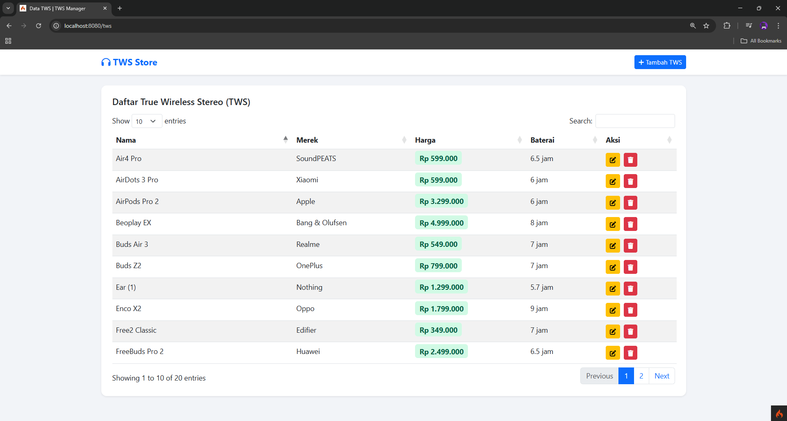

### Tambah Data
Proses menambahkan data
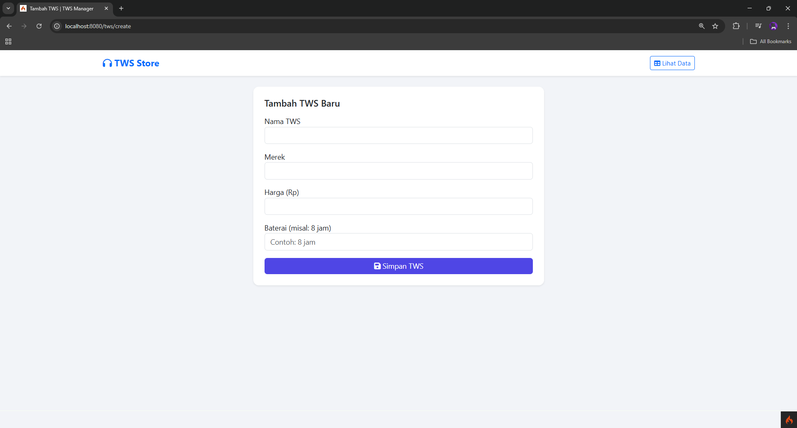
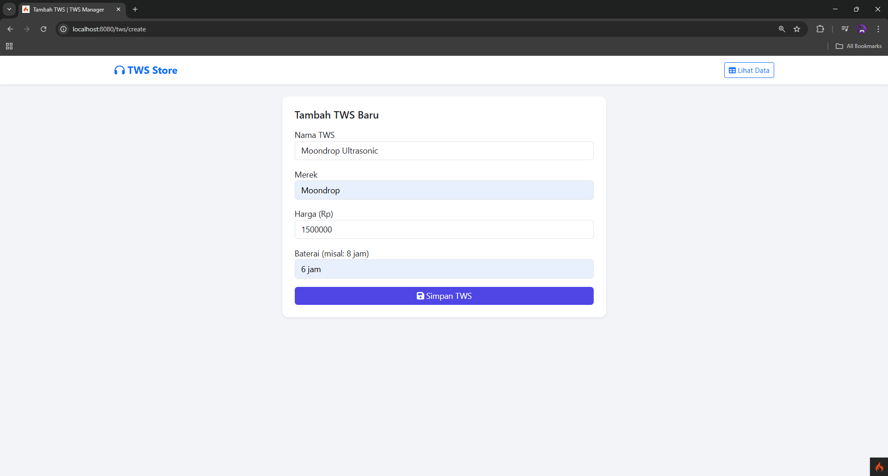
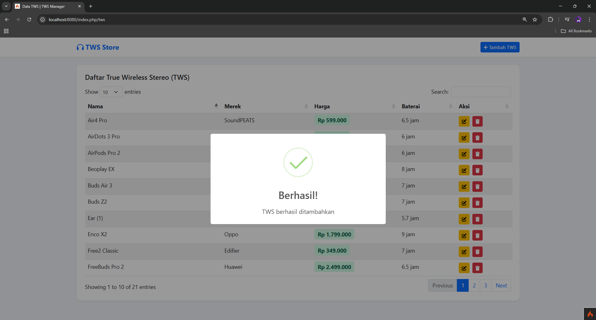
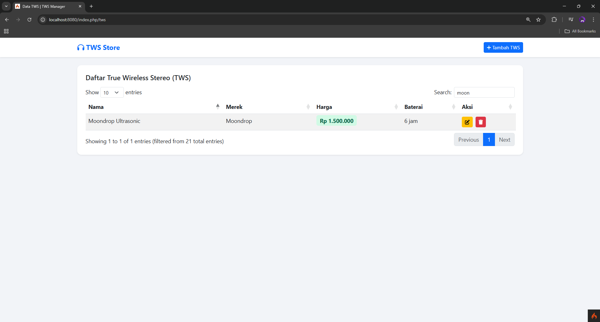

### Edit Data
Proses mengedit data
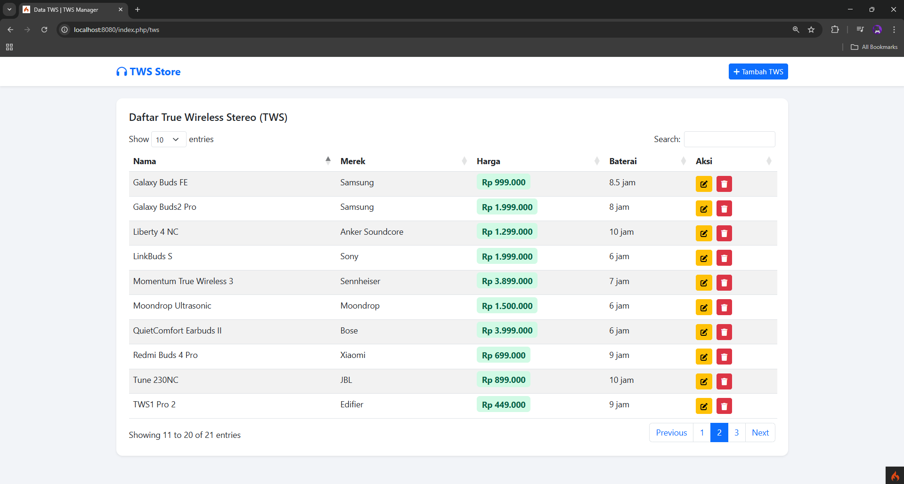
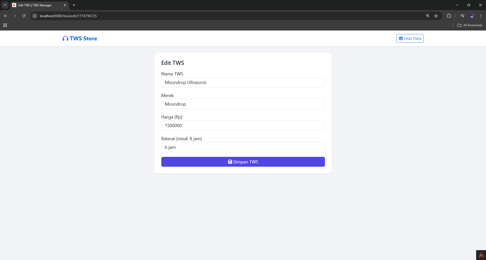
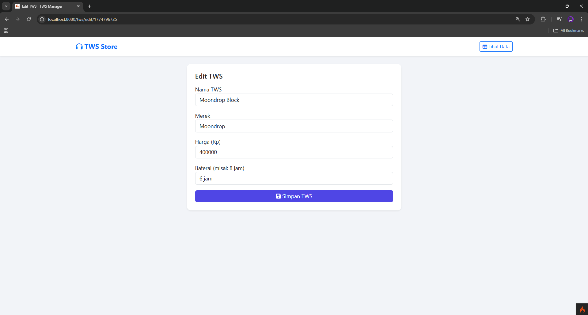
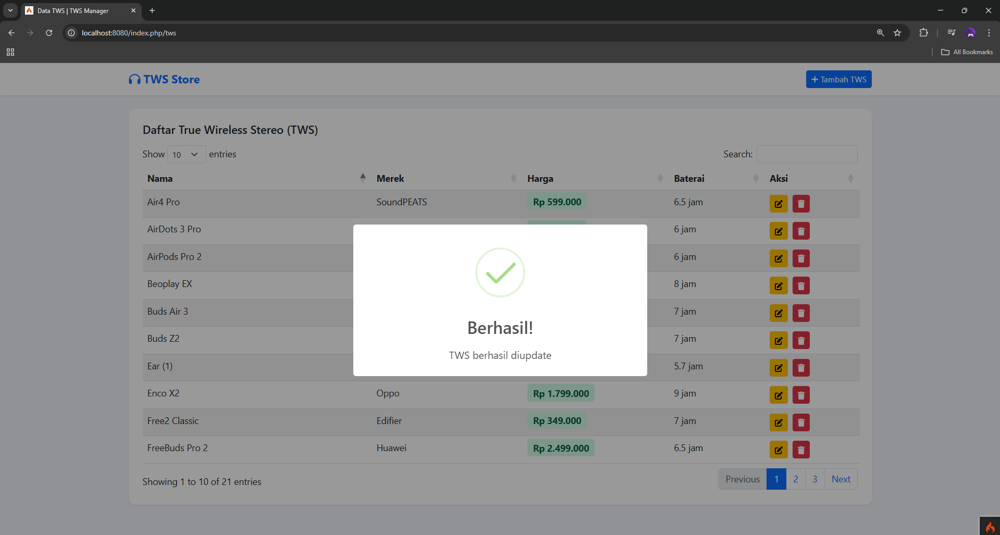
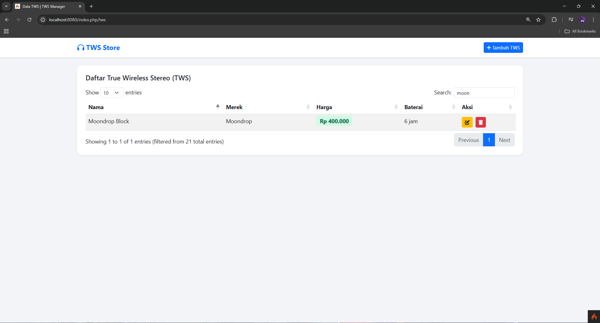

### Hapus Data
Proses mengahapus data
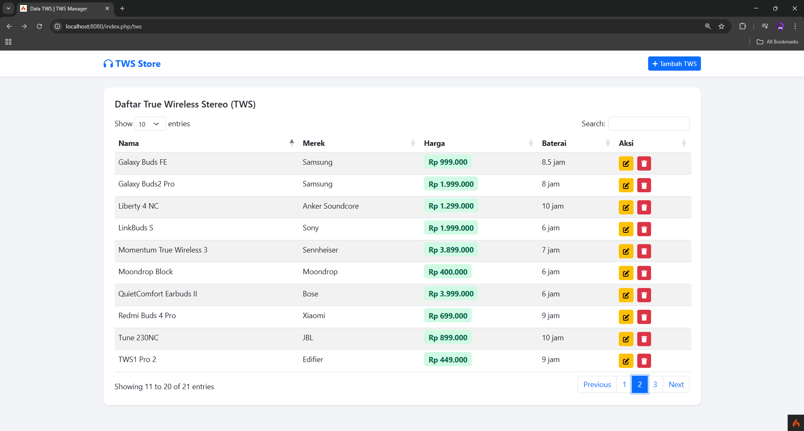
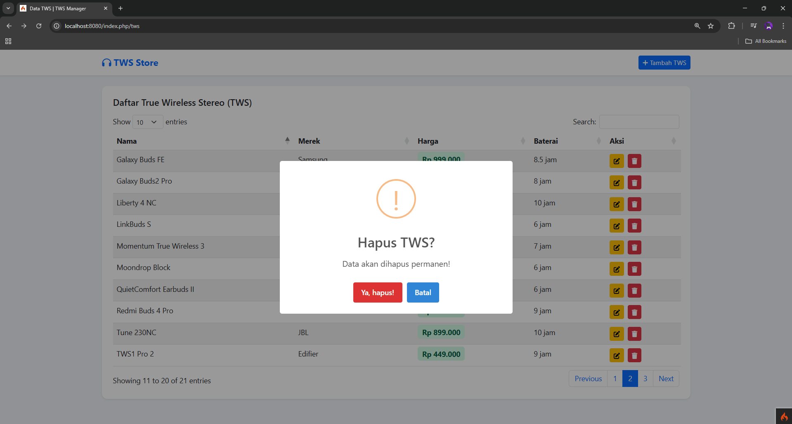
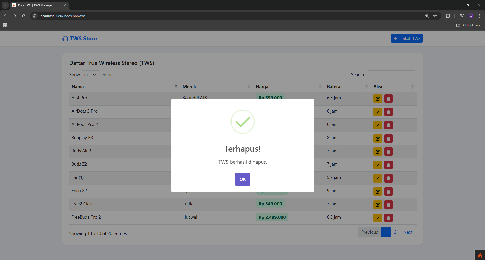
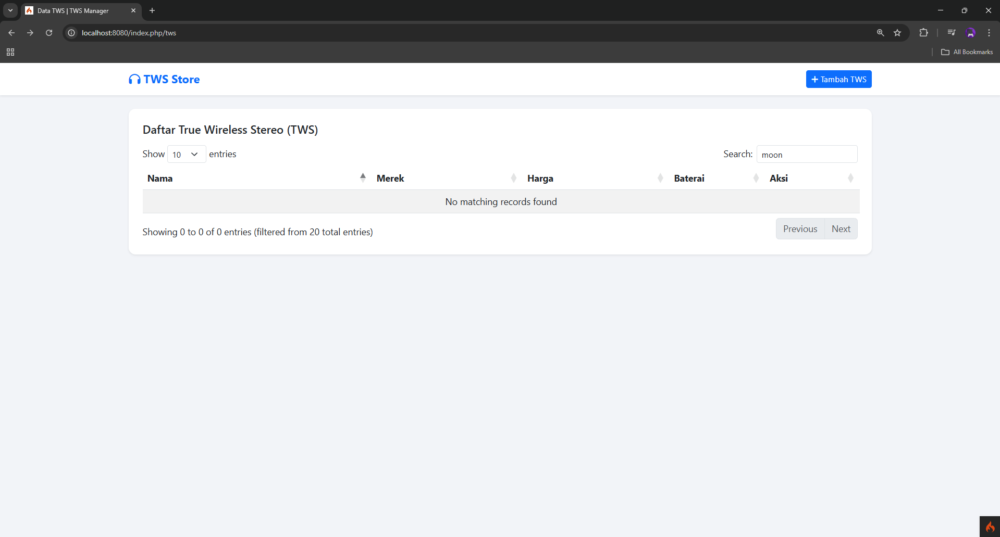

---

<a href="https://drive.google.com/drive/folders/1SuclGkAyAqlDpMnaPKgs6Qb2E_rUWkTX?usp=sharing">Link Video</a>