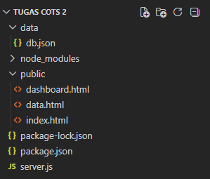

<div align="center">
  <br />

  <h1>LAPORAN PRAKTIKUM <br>
  APLIKASI BERBASIS PLATFORM
  </h1>

  <br />

  <h3>TUGAS COTS 2 <br>
  </h3>

  <br />

  


  <br />
  <br />
  <br />

  <h3>Disusun Oleh :</h3>

  <p>
    <strong>Boutefhika Nuha Ziyadatul Khair</strong><br>
    <strong>2311102316</strong><br>
    <strong>S1 IF-11-01</strong>
  </p>

  <br />

  <h3>Dosen Pengampu :</h3>

  <p>
    <strong>Dimas Fanny Hebrasianto Permadi, S.ST., M.Kom</strong>
  </p>
  
  <br />
  <br />
    <h4>Asisten Praktikum :</h4>
    <strong>Apri Pandu Wicaksono </strong> <br>
    <strong>Rangga Pradarrell Fathi</strong>
  <br />

  <h3>LABORATORIUM HIGH PERFORMANCE
 <br>FAKULTAS INFORMATIKA <br>UNIVERSITAS TELKOM PURWOKERTO <br>2026</h3>
</div>

<hr>


# Dasar Teori
**CRUD (Create, Read, Update, Delete)** adalah empat operasi dasar yang digunakan untuk mengelola data dalam suatu aplikasi. Dalam pengembangan web, konsep ini memungkinkan pengguna untuk menambah, menampilkan, mengubah, dan menghapus data secara dinamis melalui interaksi antara client dan server.

**Bootstrap** merupakan framework CSS open-source yang menyediakan berbagai komponen antarmuka siap digunakan, seperti navbar, card, form, tombol, modal, serta sistem grid yang responsif. Dengan Bootstrap, proses pembuatan tampilan menjadi lebih cepat, konsisten, dan modern.

**jQuery** adalah library JavaScript yang dirancang untuk mempermudah manipulasi DOM, pengelolaan event, pembuatan animasi, serta komunikasi AJAX. Sintaksnya yang sederhana membantu developer dalam membangun interaksi dinamis pada halaman web.

**jQuery DataTables** adalah plugin dari jQuery yang digunakan untuk meningkatkan fungsi tabel HTML, seperti fitur pencarian (search), pengurutan data (sorting), dan pagination. Selain itu, DataTables juga mendukung pengambilan data dalam format JSON melalui AJAX.

**JSON (JavaScript Object Notation)** merupakan format pertukaran data yang ringan, terstruktur, dan mudah dibaca. JSON banyak digunakan dalam aplikasi web modern sebagai media komunikasi antara client dan server.

**Node.js** adalah lingkungan runtime JavaScript yang memungkinkan eksekusi kode JavaScript di luar browser, sehingga dapat digunakan untuk membangun aplikasi backend.

**Express JS** merupakan framework backend berbasis Node.js yang digunakan untuk mengembangkan aplikasi web dan REST API. Express menyediakan fitur seperti routing, middleware, serta pengelolaan request dan response. Pada aplikasi ini, Express berperan dalam menangani proses CRUD dan menyediakan endpoint berbasis JSON yang digunakan oleh frontend.

**Chart.js** adalah library JavaScript yang digunakan untuk membuat visualisasi data dalam bentuk grafik interaktif di browser. Dalam aplikasi ini, Chart.js dimanfaatkan pada halaman dashboard untuk menampilkan statistik mahasiswa dalam bentuk bar chart, donut chart, dan line chart.

# Deskripsi Aplikasi
Aplikasi yang dibuat adalah Sistem Data Mahasiswa PuTi berbasis web menggunakan Node.js (Express JS), Bootstrap, jQuery, DataTables, dan Chart.js. Aplikasi ini dirancang untuk memenuhi ketentuan tugas praktikum, yaitu memiliki minimal tiga halaman utama, memanfaatkan data JSON untuk tabel, serta menyediakan fitur CRUD lengkap.

Fitur utama dari aplikasi ini adalah:
* Halaman Form Input Data Mahasiswa
* Halaman Tabel Data Mahasiswa dengan fitur CRUD
* Halaman Dashboard Statistik & Visualisasi Grafik
* Tabel interaktif menggunakan jQuery DataTables
* Visualisasi data menggunakan Chart.js (bar chart, donut chart, line chart)
* Data disimpan pada file JSON lokal (db.json)
* REST API endpoint untuk operasi CRUD

# Struktur Folder Project


| File / Folder            | Keterangan |
|-------------------------|-----------|
| `server.js`             | File utama server Express JS yang berisi konfigurasi server, middleware, serta seluruh route CRUD REST API. |
| `package.json`          | File konfigurasi project Node.js yang memuat informasi project dan daftar dependency yang digunakan. |
| `data/db.json`          | File penyimpanan data mahasiswa dalam format JSON array yang berfungsi sebagai database sederhana. |
| `public/index.html`     | Halaman Form Input untuk pendaftaran mahasiswa baru, dilengkapi validasi dan stat card ringkasan. |
| `public/data.html`      | Halaman Data Mahasiswa berupa tabel interaktif menggunakan DataTables dengan fitur edit dan hapus (modal Bootstrap). |
| `public/dashboard.html` | Halaman Dashboard yang menampilkan statistik dan visualisasi data mahasiswa menggunakan Chart.js (bar chart, donut chart, dan line chart). |

# Cara Running Aplikasi
1.	Pastikan Node.js sudah terinstal pada laptop.
2.	Buka folder project di terminal atau VS Code.
3.	Install dependency:
    ```
  	npm install
5.	Jalankan Server:
    ```
    node server.js
7.	Buka browser dan akses
    ```
  	http://localhost:3000

# Kode Program
package.json
```
{
  "name": "-input-mahasiswa-baru",
  "version": "1.0.0",
  "description": "Tugas COTS 2",
  "main": "server.js",
  "scripts": {
    "test": "echo \"Error: no test specified\" && exit 1",
    "start": "node server.js"
  },
  "keywords": [],
  "author": "Boutefhika Nuha Ziyadatul Khair - 2311102316",
  "license": "ISC",
  "type": "commonjs",
  "dependencies": {
    "body-parser": "^2.2.2",
    "cors": "^2.8.6",
    "express": "^5.2.1"
  },
  "devDependencies": {}
}
```
Deskripsi:

File package.json digunakan sebagai konfigurasi utama project Node.js. File ini berisi nama project, versi, deskripsi, file utama, script yang dapat dijalankan, dan daftar dependency. Dependency yang digunakan adalah express untuk membangun server backend dan cors untuk mengizinkan akses cross-origin dari halaman HTML statis. Script start memungkinkan server dijalankan menggunakan perintah npm start.

# Backend server.js
```
const express = require("express")
const fs = require("fs")
const app = express()

app.use(express.json())
app.use(express.static("public"))

const DB = "./data/db.json"

function readDB() {
    if (!fs.existsSync(DB)) fs.writeFileSync(DB, "[]")
    return JSON.parse(fs.readFileSync(DB))
}
function writeDB(data) {
    fs.writeFileSync(DB, JSON.stringify(data, null, 2))
}

// READ
app.get("/mahasiswa", (req, res) => {
    res.json(readDB())
})

// CREATE
app.post("/mahasiswa", (req, res) => {
    const data = readDB()
    const { nim, nama, jurusan, angkatan, email } = req.body
    if (!nim || !nama || !jurusan) return res.status(400).json({ message: "Data tidak lengkap" })
    if (data.find(m => m.nim === nim)) return res.status(400).json({ message: "NIM sudah ada" })
    data.push({ nim, nama, jurusan, angkatan, email, createdAt: new Date().toISOString() })
    writeDB(data)
    res.json({ message: "Data berhasil ditambah" })
})

// GET BY NIM
app.get("/mahasiswa/:nim", (req, res) => {
    const data = readDB()
    const mhs = data.find(m => m.nim === req.params.nim)
    if (!mhs) return res.status(404).json({ message: "Data tidak ditemukan" })
    res.json(mhs)
})

// UPDATE
app.put("/mahasiswa/:nim", (req, res) => {
    let data = readDB()
    const idx = data.findIndex(m => m.nim === req.params.nim)
    if (idx === -1) return res.status(404).json({ message: "Data tidak ditemukan" })
    data[idx] = { ...data[idx], ...req.body, nim: req.params.nim }
    writeDB(data)
    res.json({ message: "Data berhasil diupdate" })
})

// DELETE
app.delete("/mahasiswa/:nim", (req, res) => {
    let data = readDB()
    data = data.filter(m => m.nim !== req.params.nim)
    writeDB(data)
    res.json({ message: "Data berhasil dihapus" })
})

app.listen(3000, () => console.log("✅ Server jalan di http://localhost:3000"))
```
Deskripsi

File server.js merupakan inti backend aplikasi. Pada bagian awal dilakukan import library express, path, fs, dan cors. Library express digunakan untuk membuat server HTTP, path untuk mengelola path file, fs untuk membaca dan menulis file JSON, serta cors untuk mengizinkan akses dari frontend HTML statis.

Middleware yang digunakan adalah cors() untuk cross-origin, express.json() untuk membaca request body JSON, dan express.static() untuk melayani file HTML dari folder public.

Fungsi readData() membaca file db.json dan mengembalikan array kosong jika terjadi error. Fungsi writeData() menyimpan perubahan data ke file JSON.

Route REST API yang tersedia:
* GET /mahasiswa — mengembalikan seluruh data mahasiswa dalam format JSON array
* GET /mahasiswa/:nim — mengembalikan satu data berdasarkan NIM
* POST /mahasiswa — menambahkan data baru, dengan pengecekan duplikasi NIM
* PUT /mahasiswa/:nim — memperbarui data mahasiswa berdasarkan NIM
* DELETE /mahasiswa/:nim — menghapus data mahasiswa berdasarkan NIM

# File Data data/db.json
Pertama kosong
```
[]
```
Jika sudah isi data, contoh:
```
[
  {
    "nim": "2311102316",
    "nama": "Nuha",
    "jurusan": "Teknik Informatika",
    "angkatan": "2023",
    "email": "bnzk09@gmail.com",
    "createdAt": "2026-03-24T02:12:21.064Z"
  },
  {
    "nim": "221110245",
    "nama": "Dita",
    "jurusan": "Desain Komunikasi Visual",
    "angkatan": "2022",
    "email": "dita123@gmail.com",
    "createdAt": "2026-03-25T02:27:59.222Z"
  },
  {
    "nim": "2211102114",
    "nama": "Nisa",
    "jurusan": "Teknik Informatika",
    "angkatan": "2022",
    "email": "nisa@gmail.com",
    "createdAt": "2026-03-28T14:46:59.632Z"
  }
]
```
Deskripsi

File db.json berperan sebagai database sederhana berbasis file. Data disimpan sebagai array JSON, di mana setiap elemen merupakan objek mahasiswa dengan atribut nim, nama, jurusan, angkatan, email, dan createdAt. File ini dibaca dan ditulis langsung oleh server.js menggunakan modul fs bawaan Node.js.

# Halaman Form Input (public/index.html)
Halaman index.html adalah halaman utama yang berfungsi sebagai form pendaftaran mahasiswa baru. Halaman ini dibangun menggunakan Bootstrap 5 untuk tampilan responsif, jQuery untuk komunikasi AJAX ke server, serta Plus Jakarta Sans sebagai font utama.

Fitur yang terdapat pada halaman ini:
* Stat card ringkasan: total mahasiswa, jumlah jurusan, jumlah angkatan
* Form input dengan field NIM, Nama Lengkap, Jurusan (dropdown), Angkatan (dropdown), dan Email
* Validasi wajib pada field NIM dan Nama
* Tombol submit dengan indikator loading
* Toast notification sukses/gagal setelah submit
* Daftar mahasiswa terbaru (12 data terakhir) ditampilkan di bawah form
* Navbar dengan navigasi ke halaman Input, Data, dan Dashboard

Potongan kode JavaScript utama pada halaman ini:
```
// Submit form AJAX
$('#formMhs').submit(function(e) {
  e.preventDefault();
  $.ajax({
    url: '/mahasiswa', method: 'POST', contentType: 'application/json',
    data: JSON.stringify({
      nim: $('#nim').val().trim(), nama: $('#nama').val().trim(),
      jurusan: $('#jurusan').val(), angkatan: $('#angkatan').val(),
      email: $('#email').val().trim()
    }),
    success: function() {
      showToast('Data berhasil disimpan!');
      $('#formMhs')[0].reset();
      loadData();
    }
  });
});
```

# Halaman Data Mahasiswa (public/data.html)
Halaman data.html menampilkan seluruh data mahasiswa dalam tabel interaktif menggunakan jQuery DataTables. Data diambil dari endpoint /mahasiswa dalam format JSON melalui konfigurasi ajax pada DataTables.

Fitur yang terdapat pada halaman ini:
* Tabel interaktif dengan fitur pencarian, sorting kolom, dan pagination (jQuery DataTables)
* Data ditampilkan dari endpoint JSON /mahasiswa secara otomatis
* Tombol Edit pada setiap baris membuka modal Bootstrap untuk memperbarui data
* Tombol Hapus dengan konfirmasi modal sebelum menghapus
* Stat card: total mahasiswa, jumlah jurusan, jumlah angkatan
* Toast notification setelah operasi edit atau hapus berhasil

Potongan kode inisialisasi DataTables:
```
table = $('#tableMhs').DataTable({
  ajax: {
    url: '/mahasiswa',
    dataSrc: function(json) { loadStats(json); return json; }
  },
  columns: [
    { data: null, render: (d,t,r,m) => m.row + 1 },
    { data: 'nim',      render: d => `<span class='nim-tag'>${d}</span>` },
    { data: 'nama',     render: d => `<div class='name-cell'>...</div>` },
    { data: 'jurusan',  render: d => `<span class='jurusan-badge'>${d}</span>` },
    { data: 'angkatan', render: d => `<span class='angkatan-badge'>${d}</span>` },
    { data: 'email',    render: d => `<a href='mailto:${d}'>${d}</a>` },
    { data: null, render: d => `tombol edit & hapus` }
  ]
});
```

# Halaman Dashboard (public/dashboard.html)
Halaman dashboard.html menampilkan statistik dan visualisasi data mahasiswa menggunakan Chart.js. Halaman ini adalah halaman ketiga yang ditambahkan untuk melengkapi tiga halaman utama yang disyaratkan oleh tugas.

Fitur yang terdapat pada halaman ini:
* KPI card: total mahasiswa, jumlah jurusan, jumlah angkatan, jumlah yang memiliki email
* Bar chart: distribusi jumlah mahasiswa per jurusan
* Donut chart: proporsi persentase mahasiswa per jurusan dengan legend
* Line chart: tren penerimaan mahasiswa per tahun angkatan
* Ranking jurusan: top 6 jurusan dengan progress bar animasi dan medal
* Grid sebaran angkatan: chip per tahun angkatan beserta jumlah mahasiswa
* Tombol Refresh dan timestamp waktu update terakhir
* Demo mode: jika endpoint belum tersedia, grafik tetap tampil menggunakan data contoh

Potongan kode inisialisasi chart pada dashboard:
```
// Bar Chart per Jurusan
function renderBarJurusan(data) {
  const grouped = groupBy(data, 'jurusan');
  const entries = sortedEntries(grouped);
  chartJurusan = new Chart(ctx, {
    type: 'bar',
    data: { labels: entries.map(e=>e[0]), datasets: [{
      data: entries.map(e=>e[1]),
      backgroundColor: PALETTE.map(c => hexToRgba(c, 0.85)),
      borderRadius: 7
    }]},
    options: { responsive: true, maintainAspectRatio: false }
```

# Alur CRUD pada Aplikasi
1. Create (Tambah Data)
   Pengguna membuka halaman Form Input (index.html), mengisi field NIM, Nama Lengkap, Jurusan, Angkatan, dan Email, lalu menekan tombol Simpan Mahasiswa. Data dikirim ke server melalui AJAX POST ke endpoint /mahasiswa dan disimpan ke file db.json. Setelah berhasil, toast notifikasi sukses muncul dan daftar terbaru langsung diperbarui.
3. Read (Tampil Data)
   Pengguna membuka halaman Data (data.html). DataTables mengambil data JSON dari endpoint GET /mahasiswa secara otomatis menggunakan konfigurasi ajax. Data ditampilkan dalam tabel dengan fitur pencarian, sorting, dan pagination. Halaman Dashboard juga membaca data yang sama untuk visualisasi grafik.
4. Update (Edit Data)
Pengguna menekan tombol Edit pada baris data di tabel. Modal Bootstrap muncul menampilkan form yang sudah terisi data lama (diambil via GET /mahasiswa/:nim). Setelah diperbarui dan tombol Simpan ditekan, data dikirim ke server melalui AJAX PUT ke /mahasiswa/:nim dan tabel diperbarui tanpa reload halaman.
5. Delete (Hapus Data)
Pengguna menekan tombol Hapus pada baris data. Modal konfirmasi Bootstrap muncul menampilkan nama dan NIM mahasiswa yang akan dihapus. Setelah dikonfirmasi, AJAX DELETE dikirim ke /mahasiswa/:nim. Data dihapus dari file JSON dan tabel langsung diperbarui.

# Screenshot Website
1. Halaman Form Input Mahasiswa (index.html)

2. Halaman Data Mahasiswa (data.html)

3. Edit Data Mahasiswa
   
5. Hapus Data
   
7. Halaman Dashboard Statistik (dashboard.html)

# Kesimpulan
Pada tugas COTS-2 ini telah berhasil dibuat aplikasi web bertema Sistem Data Mahasiswa (PuTi) menggunakan Express JS, Bootstrap 5, jQuery, jQuery DataTables, dan Chart.js. Aplikasi ini telah memenuhi seluruh ketentuan tugas praktikum karena memiliki tiga halaman utama fungsional, yaitu halaman Form Input, halaman Data Mahasiswa, dan halaman Dashboard Statistik.

Fitur CRUD berjalan dengan baik: Create melalui form input AJAX, Read melalui tabel DataTables yang mengambil data JSON dari endpoint, Update melalui modal edit Bootstrap, dan Delete melalui modal konfirmasi dengan AJAX DELETE. Semua operasi dilakukan secara asinkron tanpa reload halaman.

Halaman Dashboard menambahkan nilai lebih pada aplikasi dengan menampilkan visualisasi statistik menggunakan Chart.js, sehingga data mahasiswa dapat dianalisis secara visual. Walaupun data masih disimpan dalam file JSON, aplikasi ini sudah menunjukkan implementasi dasar konsep CRUD dan REST API berbasis client-server yang baik.

# Link Video Presentasi
