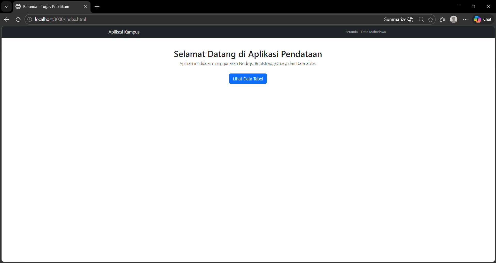
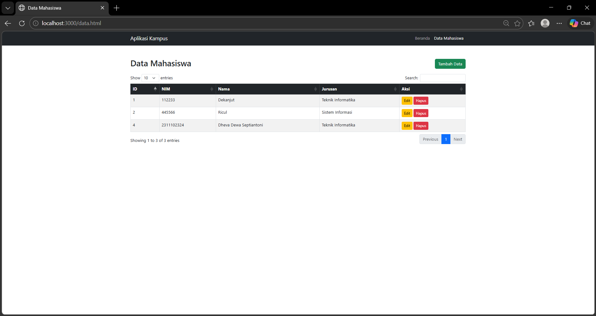
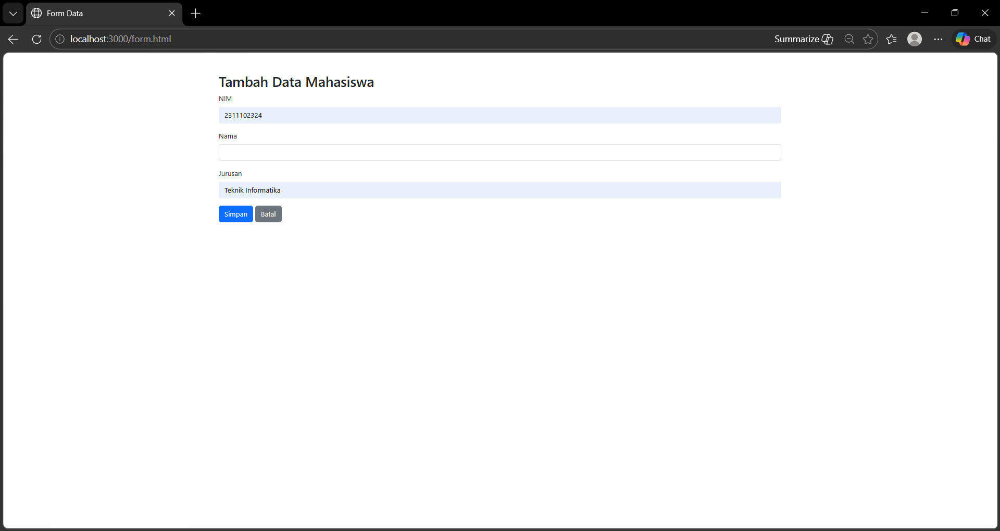
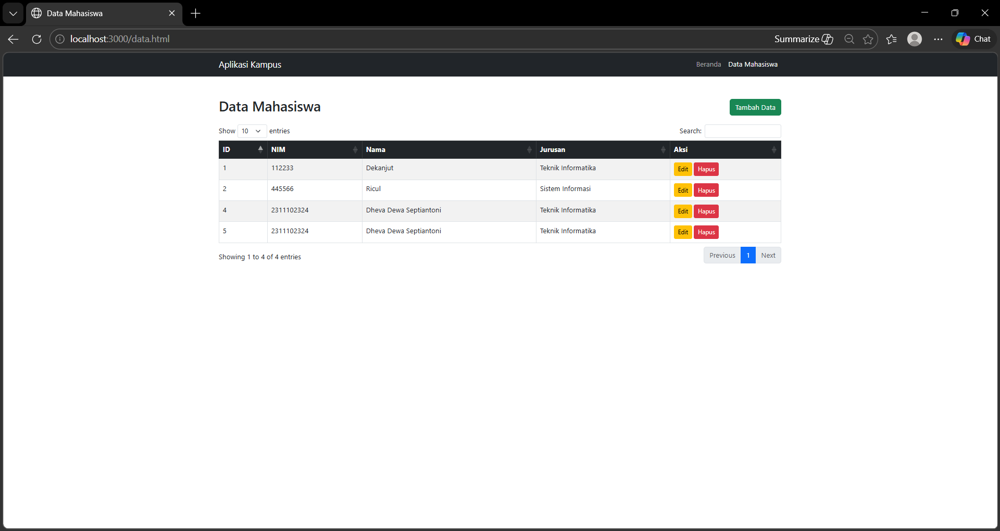
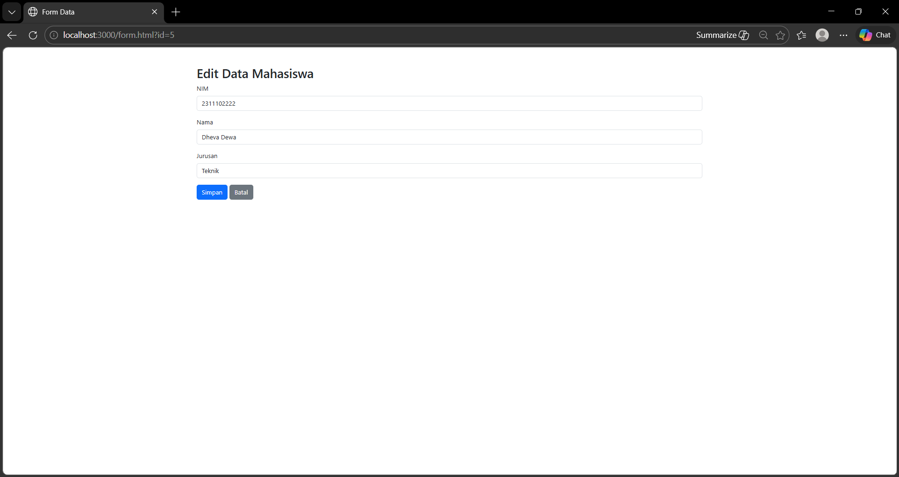
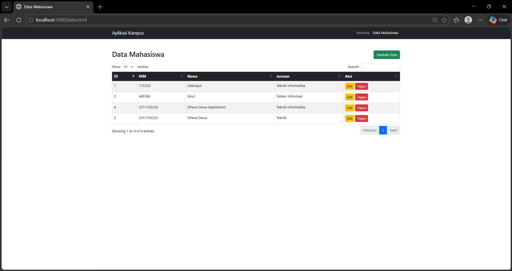
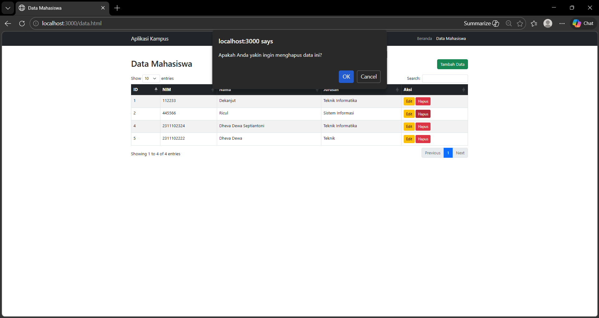
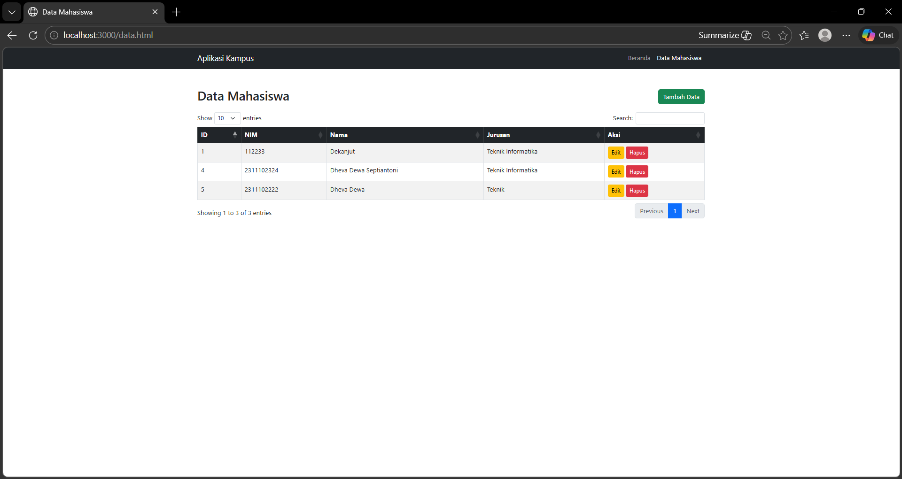
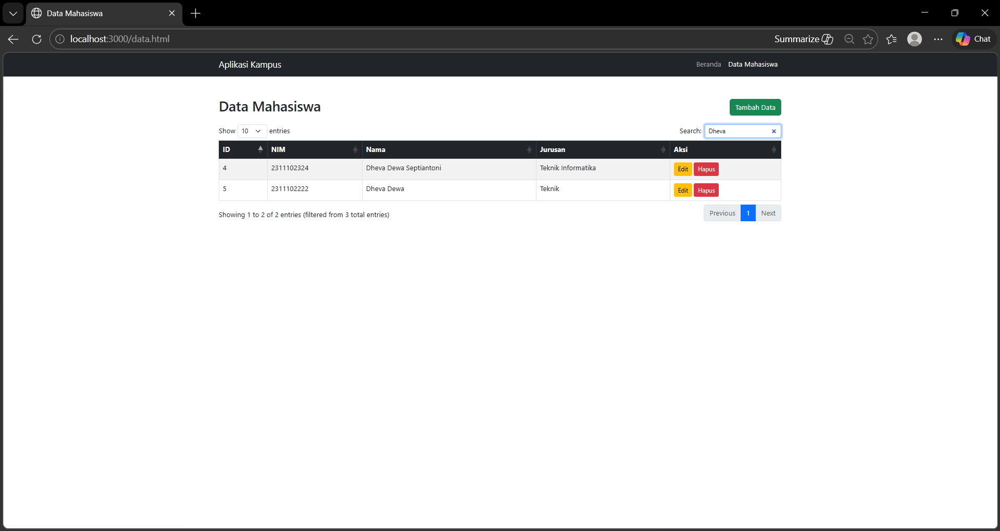

<div align="center">
   <h2>LAPORAN PRAKTIKUM<br>APLIKASI BERBASIS PLATFORM</h2>
   <h>
   <br>
   <h4>TUGAS COTS 2<br>TABEL DATA MAHASISWA</h4>
   <br>
   
   <br><br>
 
**Disusun Oleh :**<br>
Dheva Dewa Septiantoni<br>
2311102324<br>
IF-11-01
<br><br>
 
**Dosen Pengampu :**<br>
Dimas Fanny Hebrasianto Permadi, S.ST., M.Kom
<br><br>
 
**Assisten Praktikum :**<br>
Apri Pandu Wicaksono
<br>Rangga Pradarrell Fathi
<br><br>
 
PROGRAM STUDI S1 TEKNIK INFORMATIKA<br>
FAKULTAS INFORMATIKA<br>
UNIVERSITAS TELKOM PURWOKERTO<br>
2026

</div>

---

## 1. Dasar Teori

**HTML atau HyperText Markup Language** merupakan bahasa dasar yang digunakan untuk membangun sebuah web dimana HTML menangani elemen-elemen dasar pada pembangunan sebuah website. Langkah-langkah yang dilakukan meliputi pembuatan dokumen HTML dengan struktur dasar, kemudian menambahkan berbagai elemen pada halaman web seperti teks, gambar, serta tautan untuk membangun tampilan dan navigasi halaman.

**Cascading Style Sheets (CSS)** merupakan bahasa yang membantu memperindah tampilan dari laman web yang telah dibangun dengan HTML. CSS mendeskripsikan bagaimana bentuk tampilan elemen HTML seharusnya saat ditampilkan pada laman browser. Selector merupakan elemen HTML yang akan ditambahkan CSS kemudian diikuti dengan declaration block yang terdiri dari property elemen yang akan dirubah beserta value dari property-nya. Setiap deklarasi selector dapat merubah banyak nilai property sekaligus dengan dipisahkan dengan titik koma dan untuk semua declaration block dari satu selector berada di antara kurung kurawal.

**Bootstrap** Bootstrap merupakan sebuah front-end framework gratis untuk pengembangan antar muka web yang lebih cepat dan lebih mudah. Dikembangkan oleh Mark Otto dan Jacom Thornton di Twitter dan dirilis sebagai produk open source pada Agustus 2011 di GitHub. Bootstrap mencakup template desain berbasis HTML dan CSS untuk tipografi, form, button, navigasi, modal, image carousells dan masih banyak lagi, serta terdapat opsional plugin JavaScript. Selain itu, Bootstrap memiliki kemampuan untuk membuat desain responsif yang secara otomatis menyesuaikan diri agar terlihat baik di segala perangkat, mulai dari perangkat ponsel
hingga desktop pc.

**JavaScript dan AJAX**
JavaScript merupakan bahasa pemrograman tingkat tinggi yang memungkinkan halaman web statis menjadi dinamis dan interaktif. JavaScript beroperasi di sisi klien (client-side) untuk memanipulasi Document Object Model (DOM) secara real-time.
Dalam komunikasi data, JavaScript memanfaatkan teknologi AJAX (Asynchronous JavaScript and XML). AJAX memungkinkan aplikasi web untuk mengirim dan menerima data dari server di latar belakang secara asinkron. Hal ini berarti antarmuka aplikasi dapat diperbarui sebagian (seperti menambah atau menghapus data di tabel) tanpa perlu memuat ulang (reload) keseluruhan halaman web.

**jQuery dan DataTables**
jQuery merupakan pustaka (library) JavaScript yang ringkas dan kaya fitur. Pustaka ini menyederhanakan tugas-tugas kompleks dalam JavaScript seperti penelusuran dokumen HTML, penanganan event (contoh: klik tombol via .on('click')), animasi, dan pemanggilan AJAX (seperti $.get dan $.ajax).
DataTables adalah plugin ekstensif dari jQuery yang secara khusus digunakan untuk meningkatkan fungsionalitas tabel HTML standar. Pustaka ini secara instan menambahkan fitur interaktif kelas enterprise pada tabel, meliputi pencarian data (search), pembagian halaman (pagination), serta pengurutan data (sorting).

**JSON (JavaScript Object Notation)**
JSON adalah format pertukaran data teks ringan yang mudah dibaca dan ditulis oleh manusia, serta mudah diurai (parse) dan dibuat (generate) oleh mesin. Dalam arsitektur aplikasi web modern, JSON menjadi standar utama untuk mengirimkan data dari server (Backend API) menuju klien (Frontend). Pada implementasi DataTables, format data JSON digunakan sebagai sumber pustaka data dinamis yang secara otomatis akan di-render ke dalam baris dan kolom tabel.

**NodeJS dan Konsep CRUD**
NodeJS merupakan runtime environment berbasis JavaScript yang mengeksekusi kode di sisi server (backend). Berbeda dengan eksekusi di browser, NodeJS memungkinkan JavaScript digunakan untuk mengelola routing, memproses request HTTP, serta berinteraksi dengan basis data (database). Dalam ekosistem aplikasi ini, NodeJS bertindak sebagai penyedia Application Programming Interface (API) untuk melayani operasi CRUD, yang merupakan empat fungsi dasar dalam manajemen penyimpanan persisten:

Create (Membuat/menambah data baru via metode POST).

Read (Membaca/menampilkan data via metode GET).

Update (Memperbarui/mengedit data yang sudah ada via metode PUT).

Delete (Menghapus data via metode DELETE).

## 2. Kode Program Unguided

_Tugas COTS 2_

Buatlah sebuah aplikasi web sederhana yang memiliki minimal 3 (tiga) halaman fungsional yang mencakup Form, Halaman Data (Tabel), dan fungsionalitas CRUD (Create, Read, Update, Delete).

A. Spesifikasi Teknis Pengembangan (Wajib):

1. Aplikasi harus menggunakan Framework Bootstrap sebagai styling.
2. Aplikasi harus dibangun menggunakan Framework CodeIgniter (CI) atau NodeJS (express, fastify, atau berbasis library lain nya).
3. Struktur Halaman: Minimal terdiri dari 3 halaman utama:
   - Halaman Form (Input Data)
   - Halaman Tabel / Tampil Data
   - Fungsionalitas CRUD yang berjalan dengan baik.

4. Wajib menggunakan jQuery dan jQuery plugin.

5. Data yang ditampilkan pada tabel wajib menggunakan format data JSON, yang diimplementasikan menggunakan datatable Jquery.

### Struktur Program

```
├── assets/                 ← Folder untuk menyimpan aset keperluan web dan laprak
├── node_modules/           ← Library/Dependencies Node.js (Express, EJS, dll)
├── public/                 ← Folder Template Engine (Tampilan Antarmuka)
│   ├── data.html           ← Halaman Form Perubahan Data (Update)
│   ├── from.html           ← Halaman Form Entri Data Baru (Create)
│   ├── index.html          ← Halaman Dashboard Statistik Utama
├── server.js               ← Server Utama (Konfigurasi Express, Routes, & API)
├── package-lock.json       ← Catatan versi detail dependencies
└── package.json            ← Konfigurasi Proyek & Daftar Library yang digunakan
```

### Kode server.js

```js
const express = require('express');
const app = express();
const port = 3000;

// Middleware
app.use(express.json());
app.use(express.urlencoded({ extended: true }));
app.use(express.static('public')); 


let mahasiswa = [
    { id: 1, nama: "Dekanjuy", nim: "112233", jurusan: "Teknik Informatika" },
    { id: 2, nama: "Ricul", nim: "445566", jurusan: "Sistem Informasi" }
];


app.get('/api/mahasiswa', (req, res) => {
    res.json(mahasiswa);
});

app.get('/api/mahasiswa/:id', (req, res) => {
    const data = mahasiswa.find(m => m.id === parseInt(req.params.id));
    res.json(data);
});

app.post('/api/mahasiswa', (req, res) => {
    const newData = {
        id: mahasiswa.length > 0 ? mahasiswa[mahasiswa.length - 1].id + 1 : 1,
        nama: req.body.nama,
        nim: req.body.nim,
        jurusan: req.body.jurusan
    };
    mahasiswa.push(newData);
    res.json({ message: "Data berhasil ditambahkan!", data: newData });
});

app.put('/api/mahasiswa/:id', (req, res) => {
    const index = mahasiswa.findIndex(m => m.id === parseInt(req.params.id));
    if (index !== -1) {
        mahasiswa[index] = { id: parseInt(req.params.id), ...req.body };
        res.json({ message: "Data berhasil diupdate!" });
    } else {
        res.status(404).json({ message: "Data tidak ditemukan" });
    }
});

app.delete('/api/mahasiswa/:id', (req, res) => {
    mahasiswa = mahasiswa.filter(m => m.id !== parseInt(req.params.id));
    res.json({ message: "Data berhasil dihapus!" });
});

app.listen(port, () => {
    console.log(`Aplikasi berjalan di http://localhost:${port}`);
});
```

### Penjelasan Kode server.js

Program ini merupakan sebuah Sistem Informasi Manajemen Inventaris Merchandise berbasis web yang dibangun menggunakan `server.js` dengan framework `Express.js`. Aplikasi ini dirancang untuk mengelola data barang secara dinamis dengan mengimplementasikan fungsionalitas CRUD (Create, Read, Update, Delete) yang terintegrasi langsung dengan file sistem berformat JSON sebagai pusat penyimpanan datanya. Dari sisi antarmuka, program ini memanfaatkan framework Bootstrap 5 untuk menjamin tampilan yang responsif dan profesional, serta didukung oleh library jQuery dan plugin DataTables untuk menyajikan data tabel yang interaktif, lengkap dengan fitur pencarian, sortir, dan pembaruan data secara real-time melalui teknik AJAX.

### Kode index.html (Folder public)

```html
<!DOCTYPE html>
<html lang="id">
<head>
    <meta charset="UTF-8">
    <title>Beranda - Tugas Praktikum</title>
    <link href="https://cdn.jsdelivr.net/npm/bootstrap@5.3.0/dist/css/bootstrap.min.css" rel="stylesheet">
</head>
<body>
    <nav class="navbar navbar-expand-lg navbar-dark bg-dark">
        <div class="container">
            <a class="navbar-brand" href="index.html">Aplikasi Kampus</a>
            <div class="collapse navbar-collapse">
                <ul class="navbar-nav ms-auto">
                    <li class="nav-item"><a class="nav-link" href="index.html">Beranda</a></li>
                    <li class="nav-item"><a class="nav-link" href="data.html">Data Mahasiswa</a></li>
                </ul>
            </div>
        </div>
    </nav>

    <div class="container mt-5 text-center">
        <h1>Selamat Datang di Aplikasi Pendataan</h1>
        <p class="lead">Aplikasi ini dibuat menggunakan Node.js, Bootstrap, jQuery, dan DataTables.</p>
        <a href="data.html" class="btn btn-primary btn-lg mt-3">Lihat Data Tabel</a>
    </div>
</body>
</html>
```

### Penjelasan Kode index.html

`index.html` (Halaman Beranda)
- Ini adalah halaman muka (landing page) dari aplikasi kamu. Fungsinya sangat sederhana dan difokuskan pada navigasi.
- Fungsi Utama: Memberikan ucapan selamat datang dan mengarahkan pengguna ke fitur utama aplikasi. 
- Penggunaan Bootstrap: Menggunakan komponen navbar (menu navigasi di atas) agar pengguna bisa berpindah antara Beranda dan Halaman Data. 
    - Menggunakan sistem grid dan spacing (seperti container, mt-5, text-center) untuk membuat tata letak konten berada di tengah dengan rapi. 
- Catatan Rubrik: Halaman ini memenuhi syarat minimal adanya 3 halaman utama, dikhususkan sebagai antarmuka awal.

### Kode data.html (Folder public)

```html
<!DOCTYPE html>
<html lang="id">
<head>
    <meta charset="UTF-8">
    <title>Data Mahasiswa</title>
    <link href="https://cdn.jsdelivr.net/npm/bootstrap@5.3.0/dist/css/bootstrap.min.css" rel="stylesheet">
    <link href="https://cdn.datatables.net/1.13.4/css/dataTables.bootstrap5.min.css" rel="stylesheet">
</head>
<body>
    <nav class="navbar navbar-expand-lg navbar-dark bg-dark">
        <div class="container">
            <a class="navbar-brand" href="index.html">Aplikasi Kampus</a>
            <div class="collapse navbar-collapse">
                <ul class="navbar-nav ms-auto">
                    <li class="nav-item"><a class="nav-link" href="index.html">Beranda</a></li>
                    <li class="nav-item"><a class="nav-link active" href="data.html">Data Mahasiswa</a></li>
                </ul>
            </div>
        </div>
    </nav>

    <div class="container mt-5">
        <div class="d-flex justify-content-between align-items-center mb-3">
            <h2>Data Mahasiswa</h2>
            <a href="form.html" class="btn btn-success">Tambah Data</a>
        </div>
        <table id="tabelMahasiswa" class="table table-striped table-bordered" style="width:100%">
            <thead class="table-dark">
                <tr>
                    <th>ID</th>
                    <th>NIM</th>
                    <th>Nama</th>
                    <th>Jurusan</th>
                    <th>Aksi</th>
                </tr>
            </thead>
            <tbody></tbody>
        </table>
    </div>

    <script src="https://code.jquery.com/jquery-3.6.0.min.js"></script>
    <script src="https://cdn.datatables.net/1.13.4/js/jquery.dataTables.min.js"></script>
    <script src="https://cdn.datatables.net/1.13.4/js/dataTables.bootstrap5.min.js"></script>
    
    <script>
        $(document).ready(function() {
            // Inisialisasi DataTables menggunakan JSON dari server
            let table = $('#tabelMahasiswa').DataTable({
                "ajax": {
                    "url": "/api/mahasiswa",
                    "dataSrc": ""
                },
                "columns": [
                    { "data": "id" },
                    { "data": "nim" },
                    { "data": "nama" },
                    { "data": "jurusan" },
                    {
                        "data": null,
                        "render": function(data, type, row) {
                            return `
                                <a href="form.html?id=${row.id}" class="btn btn-warning btn-sm">Edit</a>
                                <button onclick="hapusData(${row.id})" class="btn btn-danger btn-sm">Hapus</button>
                            `;
                        }
                    }
                ]
            });
        });

        // Fungsi Delete (Hapus Data)
        function hapusData(id) {
            if(confirm('Apakah Anda yakin ingin menghapus data ini?')) {
                $.ajax({
                    url: '/api/mahasiswa/' + id,
                    type: 'DELETE',
                    success: function(result) {
                        alert(result.message);
                        $('#tabelMahasiswa').DataTable().ajax.reload(); // Reload tabel otomatis
                    }
                });
            }
        }
    </script>
</body>
</html>
```

### Penjelasan Kode data.html

`data.html` (Halaman Tabel Data & Fitur Read/Delete)
Halaman ini adalah inti dari aplikasi untuk menampilkan data. Halaman ini sangat penting karena memenuhi syarat wajib menampilkan format data JSON menggunakan plugin jQuery DataTables.
- Fungsi Utama: Menampilkan daftar mahasiswa dalam bentuk tabel, serta menyediakan tombol untuk menambah, mengedit, dan menghapus data.
- Penggunaan Bootstrap: Menggunakan class table, table-striped, dan table-bordered agar tabel terlihat profesional.
- Logika jQuery & DataTables:
    - Menarik Data JSON (Read): Saat halaman dimuat, skrip `$('#tabelMahasiswa').DataTable(...)` dijalankan. Di dalamnya terdapat konfigurasi ajax: {` "url": "/api/mahasiswa" `}. Ini memerintahkan DataTables untuk secara otomatis "menembak" API backend kita, mengambil data berformat JSON, dan menyusunnya ke dalam baris tabel secara otomatis.

    - Membuat Tombol Aksi: Pada bagian columns, terdapat fungsi render. Fungsi ini bertugas membuat kode HTML untuk tombol Edit (mengarahkan ke form.html dengan membawa ID data di URL) dan tombol Hapus untuk setiap baris.

    - Fitur Hapus (Delete): Jika tombol Hapus diklik, fungsi hapusData(id) akan berjalan. Fungsi ini menggunakan $.ajax dengan tipe metode `DELETE` untuk menghapus data di backend, lalu me-reload tabel tanpa perlu me-refresh seluruh halaman.

### Kode form.html (Folder public)

```html
<!DOCTYPE html>
<html lang="id">
<head>
    <meta charset="UTF-8">
    <title>Form Data</title>
    <link href="https://cdn.jsdelivr.net/npm/bootstrap@5.3.0/dist/css/bootstrap.min.css" rel="stylesheet">
</head>
<body>
    <div class="container mt-5">
        <h2 id="formTitle">Tambah Data Mahasiswa</h2>
        <form id="mahasiswaForm">
            <input type="hidden" id="mahasiswaId">
            <div class="mb-3">
                <label class="form-label">NIM</label>
                <input type="text" class="form-control" id="nim" required>
            </div>
            <div class="mb-3">
                <label class="form-label">Nama</label>
                <input type="text" class="form-control" id="nama" required>
            </div>
            <div class="mb-3">
                <label class="form-label">Jurusan</label>
                <input type="text" class="form-control" id="jurusan" required>
            </div>
            <button type="submit" class="btn btn-primary">Simpan</button>
            <a href="data.html" class="btn btn-secondary">Batal</a>
        </form>
    </div>

    <script src="https://code.jquery.com/jquery-3.6.0.min.js"></script>
    <script>
        $(document).ready(function() {
            // Cek apakah ada parameter ID di URL (untuk mode Edit)
            const urlParams = new URLSearchParams(window.location.search);
            const id = urlParams.get('id');

            if (id) {
                $('#formTitle').text('Edit Data Mahasiswa');
                $('#mahasiswaId').val(id);
                // Fetch data untuk di-load ke form
                $.get('/api/mahasiswa/' + id, function(data) {
                    $('#nim').val(data.nim);
                    $('#nama').val(data.nama);
                    $('#jurusan').val(data.jurusan);
                });
            }

            // Submit form (Create / Update)
            $('#mahasiswaForm').submit(function(e) {
                e.preventDefault();
                
                const dataId = $('#mahasiswaId').val();
                const formData = {
                    nim: $('#nim').val(),
                    nama: $('#nama').val(),
                    jurusan: $('#jurusan').val()
                };

                if (dataId) {
                    // Update (PUT)
                    $.ajax({
                        url: '/api/mahasiswa/' + dataId,
                        type: 'PUT',
                        data: formData,
                        success: function(response) {
                            alert(response.message);
                            window.location.href = 'data.html';
                        }
                    });
                } else {
                    // Create (POST)
                    $.post('/api/mahasiswa', formData, function(response) {
                        alert(response.message);
                        window.location.href = 'data.html';
                    });
                }
            });
        });
    </script>
</body>
</html>
```

### Penjelasan Kode form.html

`form.html` (Halaman Form Input & Fitur Create/Update)<br>
Halaman ini dirancang pintar karena satu file HTML ini bisa menangani dua pekerjaan sekaligus: Menambah data baru (Create) dan Mengubah data yang sudah ada (Update).<br>
- Fungsi Utama: Menyediakan formulir (form) bagi pengguna untuk mengetikkan NIM, Nama, dan Jurusan.<br>
- Cara Kerja Logika (`jQuery`):<br>
- Deteksi Mode (Tambah vs Edit): Saat halaman dibuka, jQuery menggunakan URLSearchParams untuk mengecek apakah ada ID di URL (contoh: `form.html?id=1`).<br>
    - Jika TIDAK ADA ID, form akan kosong dan berfungsi sebagai form Tambah Data.<br>
    - Jika ADA ID, judul halaman berubah menjadi "Edit Data". jQuery akan melakukan `$.get` ke API untuk mengambil data mahasiswa dengan ID tersebut, lalu mengisi kotak input (NIM, Nama, Jurusan) secara otomatis (auto-fill).<br>
- Proses Simpan Data (Submit): Ketika tombol "Simpan" ditekan, fungsi `$('#mahasiswaForm').submit(...)` menahan agar halaman tidak me-refresh.<br>
    - Ia mengumpulkan teks yang diketik pengguna ke dalam objek formData.<br>
    - Jika sedang dalam mode Edit, ia mengirim data menggunakan metode PUT (Update).<br>
    - Jika sedang dalam mode Tambah, ia mengirim data menggunakan metode `POST` (Create).<br>
    - Setelah sukses, muncul alert dan pengguna otomatis dialihkan kembali ke data.html.<br>

### Hasil Output + Langkah Penjelasan

1. Tampilan Halaman utama.



<br>
<br>
2. Tampilan Halaman Tabel Mahasiswa.



<br>
<br>
3. Tampilan Halaman tambah Mahasiswa.


<br>
<br>

4. Fitur Menambahkan Mahasiswa:



- NIM: 2311102324
- Nama: Dheva Dewa Septiantoni
- Jurusan: Teknik Informatika <br>
Berhasil menambahkan Mahasiswa, Daftar Mahasiswa bertambah.
<br>
<br>
5. Fitur edit Mahasiswa:



Fitur Edit Mahasiswa di Halaman ini, bisa di akses dengan mengklik tombol `Tambah Data`
   Awal Data Produk Misal:

- NIM: 2311102324
- Nama: Dheva Dewa Septiantoni
- Jurusan: Teknik Informatika

  Edit Data Produk Misal:

- NIM: 2311102222
- Nama: Dheva Dewa
- Jurusan: Teknik
<br>
<br>

6. Perubahan Berhasil Disimpan, Daftar Mahasiswa berubah bagian "NIM, Nama, Jurusan"


<br>
<br>

7.  fitur Delete / Hapus Barang Mahasiswa di Halaman data, dengan mengklik tombol merah `Hapus`.


<br>
<br>

8. Data berhasil dihapus


<br>
<br>

9. Fitur Search / Pencarian Mahasiswa, dengan mengklik teks "Search" dan mengetik Mahasiswa yang dicari, misal cukup mengetik "Dheva" hasil akan menemukan bahwa ada 1 Mahasiswa yang berama "Dheva Dewa Septiantoni/Dheva Dewa".




## 3. Kesimpulan dan Penutup

Praktikum kali ini berhasil merancang dan mengimplementasikan aplikasi web sederhana yang mengintegrasikan backend berbasis Node.js (Express) dengan antarmuka frontend yang responsif menggunakan framework Bootstrap. Melalui pengembangan tiga halaman fungsional utama—Beranda, Data (Tabel), dan Form—telah dibuktikan penerapan fungsionalitas CRUD (Create, Read, Update, Delete) yang berjalan secara optimal. Selain itu, penggunaan library jQuery beserta plugin DataTables terbukti sangat efektif dalam melakukan manipulasi DOM dan mengonsumsi data berformat JSON dari API secara asinkron, sehingga menghasilkan sebuah sistem pendataan yang dinamis, interaktif, dan memenuhi seluruh spesifikasi teknis yang disyaratkan.

## 4. Referensi

- [1] [Materi Modul 2](https://drive.google.com/file/d/1f-WJU1OaMIyZZZXtIissubHZ9fdcUO8y/view)

- [2] [Materi Modul 3](https://drive.google.com/file/d/1YZ4-EXXFpIfaoV6P8ZpeixciZLjrFiy5/view)

- [3] [Materi Modul 4](https://drive.google.com/file/d/1Qxsa7wNn3PNrDLYzgBKb62GZi4mPkoub/view)

- [4] [Materi Modul 5](https://drive.google.com/file/d/1NKK3wu2ww23vudPo1DypbbiI9NM_9zwG/view)

- [5] [Materi Data Tables](https://datatables.net)

- [6] [Materi Json](https://www.json.org)

- [7] [Materi NodeJS](https://nodejs.org)

# 5. Link Presentasi

Youtube : https://youtu.be/_HGP_tIDQS8 
