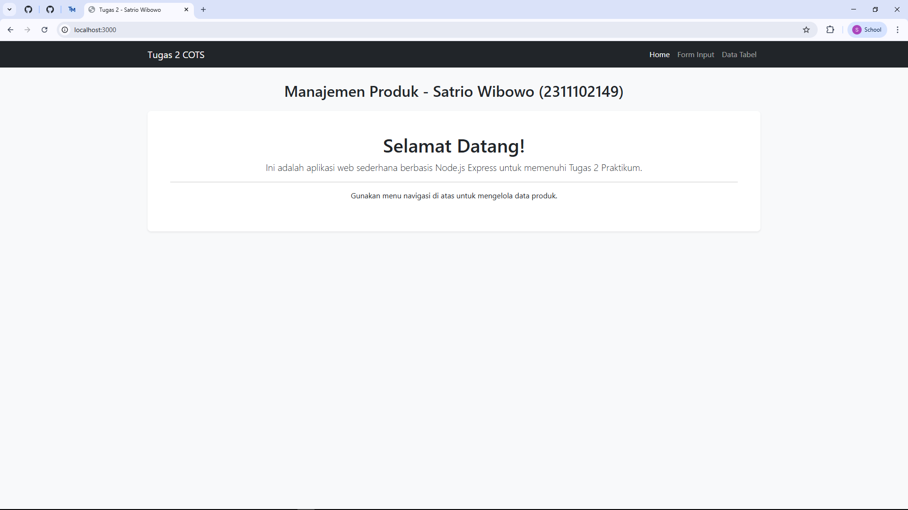
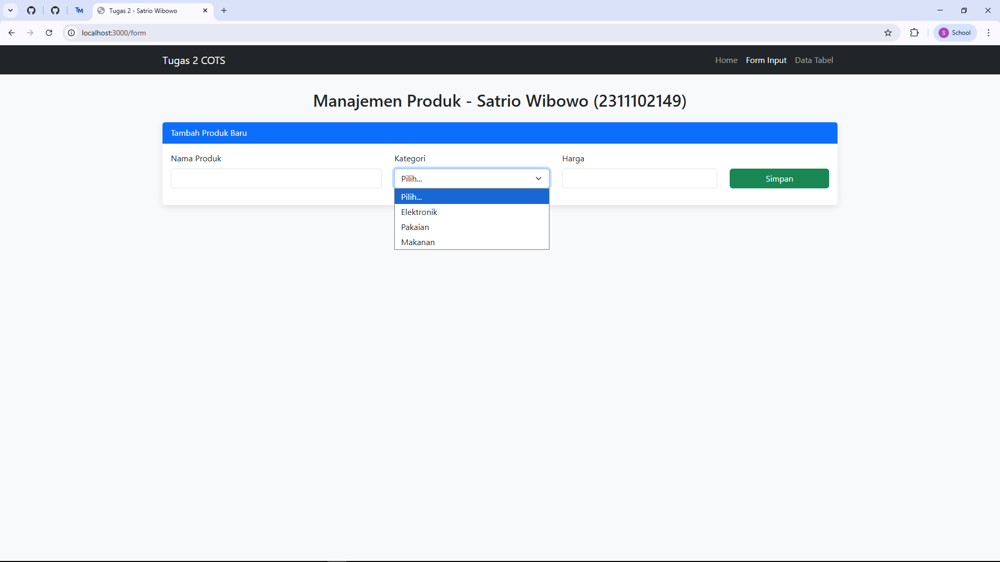
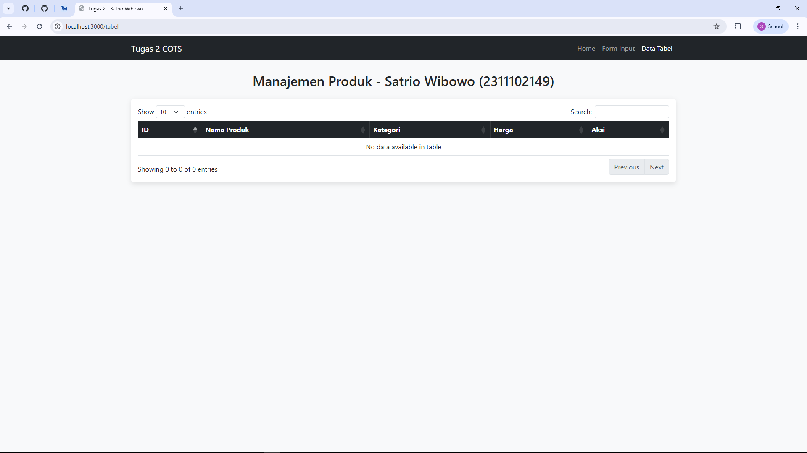
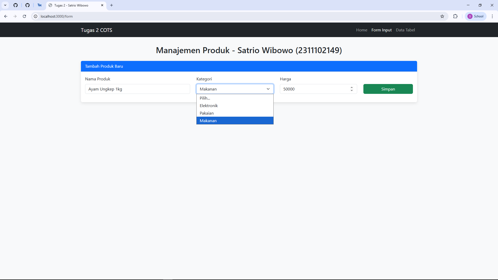
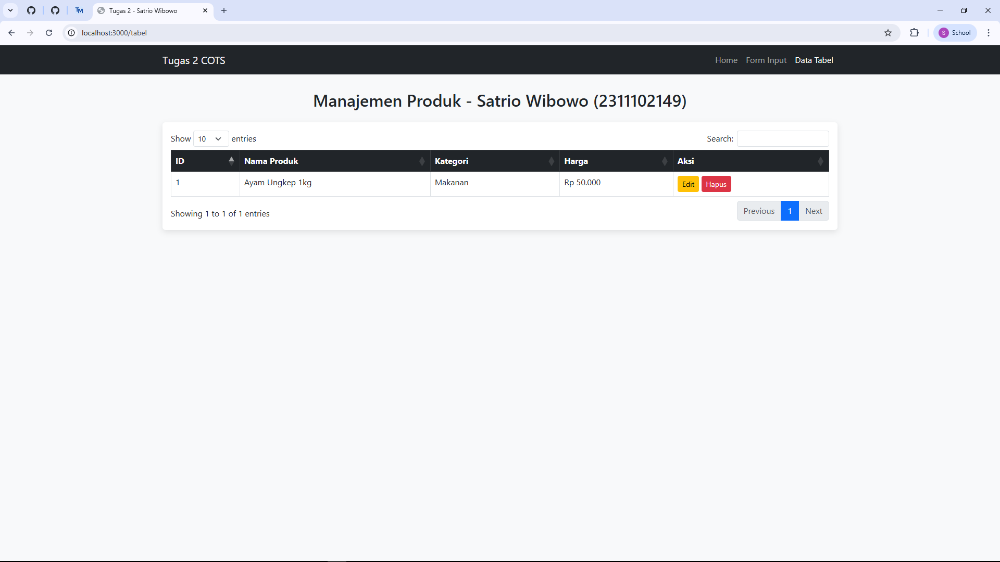
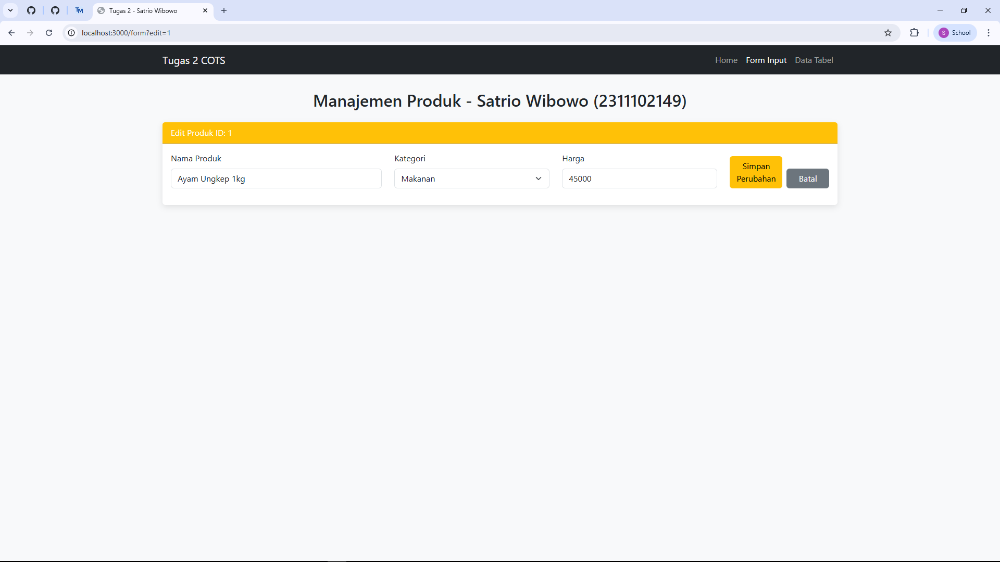
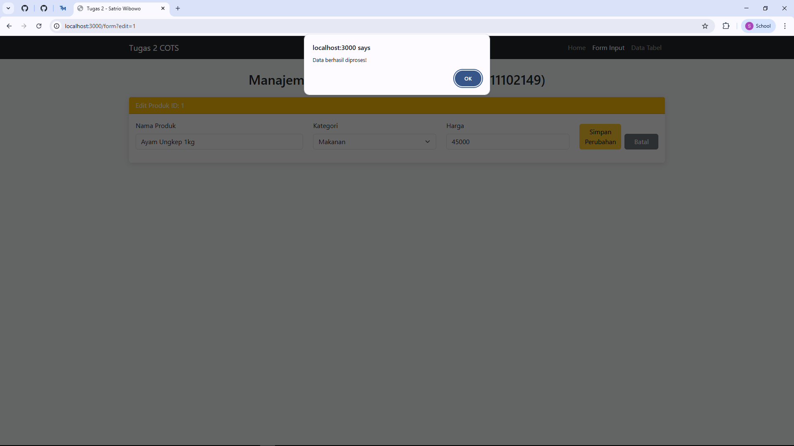
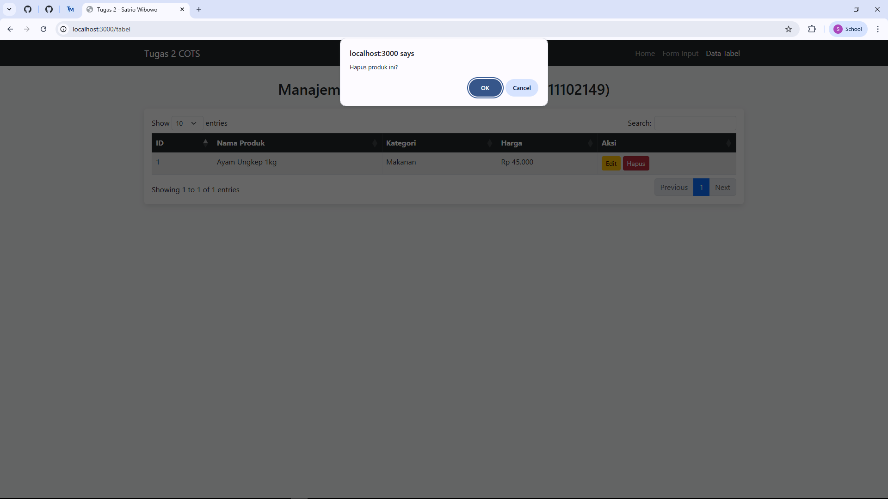

<div align="center">
  <br />
  <h1>LAPORAN PRAKTIKUM <br>APLIKASI BERBASIS PLATFORM</h1>
  <br />
  <h2> TUGAS COTS 2 <br> DATA PRODUK MENGGUNAKAN FRAMEWORK NODE JS EXPRESS </h2>
  <br />
  <br />
   
  <br />
  <br />
  <br />
  <h3>Disusun Oleh :</h3>
  <p>
    <strong>Satrio Wibowo</strong><br>
    <strong>2311102149</strong><br>
    <strong>S1 IF-11-REG 01</strong>
  </p>
  <br />
  <h3>Dosen Pengampu :</h3>
  <p>
    <strong>Dimas Fanny Hebrasianto Permadi, S.ST., M.Kom</strong>
  </p>
  <br />
  <br />
    <h4>Asisten Praktikum :</h4>
    <strong> Apri Pandu Wicaksono </strong> <br>
    <strong>Rangga Pradarrell Fathi</strong>
  <br />
  <h2>LABORATORIUM HIGH PERFORMANCE
 <br>FAKULTAS INFORMATIKA <br>UNIVERSITAS TELKOM PURWOKERTO <br>2026</h2>
</div>

---

# 1. Dasar Teori

**Sistem CRUD (Create, Read, Update, Delete)** adalah pilar utama dalam pengelolaan data di aplikasi perangkat lunak. Operasi ini memungkinkan pengguna untuk membuat entri baru, membaca atau menampilkan data, melakukan perubahan (sunting), hingga menghapus data yang tidak diperlukan. Dalam pengembangan *front-end*, CRUD dapat diimplementasikan menggunakan JavaScript untuk memanipulasi DOM (*Document Object Model*) secara dinamis di sisi klien.

**Framework Bootstrap** digunakan untuk membangun antarmuka yang responsif dan estetis secara efisien. Dengan sistem *grid* dan komponen UI yang sudah terintegrasi, Bootstrap meminimalkan penulisan CSS manual sehingga pengembang dapat fokus pada logika fungsionalitas aplikasi.

**jQuery DataTables** merupakan pustaka pendukung yang memberikan fitur tingkat lanjut pada tabel HTML statis. Pustaka ini secara otomatis menyediakan fungsi pencarian (*searching*), pembagian halaman (*pagination*), dan pengurutan (*sorting*) tanpa perlu menulis logika kompleks dari awal.

**JavaScript Object Mapping** adalah teknik pengorganisasian data menggunakan struktur pasangan kunci-nilai (*key-value pairs*). Berbeda dengan *Array* yang memerlukan iterasi (looping) untuk mencari data, *Object Mapping* memungkinkan akses data secara instan melalui kunci unik (ID). Metode ini sangat efisien dalam manajemen *state* aplikasi karena memiliki kompleksitas waktu $O(1)$ untuk operasi pencarian dan penghapusan.

**Node.js** adalah *runtime* JavaScript yang dibangun di atas mesin V8 Chrome yang memungkinkan eksekusi kode JavaScript di sisi server. **Express.js** merupakan *framework* web minimalis untuk Node.js yang mempermudah pengelolaan *routing* dan HTTP *request*.

**EJS (Embedded JavaScript Templating)** adalah *template engine* yang digunakan untuk menghasilkan halaman HTML dinamis dengan sintaks JavaScript murni. Dalam proyek ini, EJS memungkinkan pembuatan komponen UI yang berubah sesuai dengan rute yang diakses pengguna.

**jQuery DataTables** merupakan plugin pendukung yang memberikan fitur tingkat lanjut pada tabel HTML. Pustaka ini menyediakan fungsi pencarian, *pagination*, dan pengurutan secara otomatis. Data yang ditampilkan pada tabel ini wajib menggunakan format **JSON** agar komunikasi antara *client* dan *server* berjalan efisien.

**JavaScript Object Mapping** adalah teknik penyimpanan data menggunakan struktur kunci-nilai (*key-value pairs*). Metode ini sangat efisien dalam manajemen *state* aplikasi karena memiliki kompleksitas waktu $O(1)$ untuk operasi pencarian dan penghapusan.


---

# 2. Unguided


## `public/app.js`

```js
const express = require('express');
const bodyParser = require('body-parser');
const app = express();
const port = 3000;

app.set('view engine', 'ejs');
app.use(express.static('public'));
app.use(bodyParser.json());
app.use(bodyParser.urlencoded({ extended: true }));

// Mapping Object (Database Sementara)
let products = {}; 
let nextId = 1;

// --- RUTE HALAMAN (VIEWS) ---
app.get('/', (req, res) => res.render('index', { page: 'home' }));
app.get('/form', (req, res) => res.render('index', { page: 'form' }));
app.get('/tabel', (req, res) => res.render('index', { page: 'tabel' }));

// --- API CRUD (JSON) ---
app.get('/api/products', (req, res) => res.json({ data: Object.values(products) }));

app.post('/api/products', (req, res) => {
    const id = nextId++;
    const { nama, kategori, harga } = req.body;
    products[id] = { id, nama, kategori, harga: parseInt(harga).toLocaleString('id-ID') };
    res.json({ success: true });
});

app.get('/api/products/:id', (req, res) => res.json(products[req.params.id]));

app.post('/api/products/update/:id', (req, res) => {
    const id = req.params.id;
    const { nama, kategori, harga } = req.body;
    if (products[id]) {
        products[id] = { id, nama, kategori, harga: parseInt(harga).toLocaleString('id-ID') };
        res.json({ success: true });
    }
});

app.delete('/api/products/:id', (req, res) => {
    delete products[req.params.id];
    res.json({ success: true });
});

app.listen(port, () => {
    console.log(`Server jalan di http://localhost:${port}`);
});

```

## `views/index.ejs`
```html
<!DOCTYPE html>
<html lang="en">
<head>
    <meta charset="UTF-8">
    <meta name="viewport" content="width=device-width, initial-scale=1.0">
    <title>Tugas 2 - Satrio Wibowo</title>
    <link href="https://cdn.jsdelivr.net/npm/bootstrap@5.3.0/dist/css/bootstrap.min.css" rel="stylesheet">
    <link href="https://cdn.datatables.net/1.13.4/css/dataTables.bootstrap5.min.css" rel="stylesheet">
    <style>
        body { background-color: #f8f9fa; }
        .navbar { margin-bottom: 30px; }
        .card { border: none; box-shadow: 0 4px 12px rgba(0,0,0,0.1); }
    </style>
</head>
<body>

<nav class="navbar navbar-expand-lg navbar-dark bg-dark">
    <div class="container">
        <a class="navbar-brand" href="/">Tugas 2 COTS</a>
        <div class="collapse navbar-collapse">
            <ul class="navbar-nav ms-auto">
                <li class="nav-item"><a class="nav-link <%= page === 'home' ? 'active' : '' %>" href="/">Home</a></li>
                <li class="nav-item"><a class="nav-link <%= page === 'form' ? 'active' : '' %>" href="/form">Form Input</a></li>
                <li class="nav-item"><a class="nav-link <%= page === 'tabel' ? 'active' : '' %>" href="/tabel">Data Tabel</a></li>
            </ul>
        </div>
    </div>
</nav>

<div class="container">
    <h2 class="text-center mb-4">Manajemen Produk - Satrio Wibowo (2311102149)</h2>

    <% if (page === 'home') { %>
        <div class="p-5 mb-4 bg-white rounded-3 shadow-sm text-center">
            <h1>Selamat Datang!</h1>
            <p class="lead">Ini adalah aplikasi web sederhana berbasis Node.js Express untuk memenuhi Tugas 2 Praktikum.</p>
            <hr>
            <p>Gunakan menu navigasi di atas untuk mengelola data produk.</p>
        </div>

    <% } else if (page === 'form') { %>
        <div class="card mb-4">
            <div id="formHeader" class="card-header bg-primary text-white">Tambah Produk Baru</div>
            <div class="card-body">
                <form id="productForm">
                    <input type="hidden" id="editId">
                    <div class="row">
                        <div class="col-md-4 mb-3">
                            <label class="form-label">Nama Produk</label>
                            <input type="text" id="nama" class="form-control" required>
                        </div>
                        <div class="col-md-3 mb-3">
                            <label class="form-label">Kategori</label>
                            <select id="kategori" class="form-select" required>
                                <option value="">Pilih...</option>
                                <option value="Elektronik">Elektronik</option>
                                <option value="Pakaian">Pakaian</option>
                                <option value="Makanan">Makanan</option>
                            </select>
                        </div>
                        <div class="col-md-3 mb-3">
                            <label class="form-label">Harga</label>
                            <input type="number" id="harga" class="form-control" required>
                        </div>
                        <div class="col-md-2 mb-3 d-flex align-items-end">
                            <button type="submit" id="btnSubmit" class="btn btn-success w-100">Simpan</button>
                            <button type="button" id="btnCancel" class="btn btn-secondary w-100 ms-2" style="display:none;">Batal</button>
                        </div>
                    </div>
                </form>
            </div>
        </div>

    <% } else if (page === 'tabel') { %>
        <div class="card">
            <div class="card-body">
                <table id="productTable" class="table table-hover table-bordered w-100">
                    <thead class="table-dark">
                        <tr>
                            <th>ID</th><th>Nama Produk</th><th>Kategori</th><th>Harga</th><th>Aksi</th>
                        </tr>
                    </thead>
                    <tbody></tbody>
                </table>
            </div>
        </div>
    <% } %>
</div>

<script src="https://code.jquery.com/jquery-3.6.0.min.js"></script>
<script src="https://cdn.datatables.net/1.13.4/js/jquery.dataTables.min.js"></script>
<script src="https://cdn.datatables.net/1.13.4/js/dataTables.bootstrap5.min.js"></script>

<script>
    let table;
    let isEditing = false;

    $(document).ready(function() {
        // Inisialisasi DataTable hanya jika ada di halaman tabel
        if ($('#productTable').length) {
            table = $('#productTable').DataTable({
                ajax: '/api/products',
                columns: [
                    { data: 'id' },
                    { data: 'nama' },
                    { data: 'kategori' },
                    { data: 'harga', render: (data) => `Rp ${data}` },
                    { 
                        data: 'id',
                        render: (id) => `
                            <button class="btn btn-warning btn-sm" onclick="editData('${id}')">Edit</button>
                            <button class="btn btn-danger btn-sm" onclick="deleteData('${id}')">Hapus</button>
                        `
                    }
                ]
            });
        }

        // Handle Submit Form
        $('#productForm').on('submit', function(e) {
            e.preventDefault();
            const id = $('#editId').val();
            const url = isEditing ? `/api/products/update/${id}` : '/api/products';
            
            $.post(url, {
                nama: $('#nama').val(),
                kategori: $('#kategori').val(),
                harga: $('#harga').val()
            }, function() {
                alert('Data berhasil diproses!');
                window.location.href = '/tabel'; // Pindah ke halaman tabel setelah simpan
            });
        });

        // Cek jika ada parameter edit di URL (untuk fitur edit lintas halaman)
        const urlParams = new URLSearchParams(window.location.search);
        if (urlParams.get('edit')) {
            loadEditData(urlParams.get('edit'));
        }
    });

    function deleteData(id) {
        if(confirm('Hapus produk ini?')) {
            $.ajax({ url: `/api/products/${id}`, type: 'DELETE', success: () => table.ajax.reload() });
        }
    }

    function editData(id) {
        // Pindah ke halaman form sambil membawa ID yang mau diedit
        window.location.href = '/form?edit=' + id;
    }

    function loadEditData(id) {
        $.get(`/api/products/${id}`, function(data) {
            $('#editId').val(data.id);
            $('#nama').val(data.nama);
            $('#kategori').val(data.kategori);
            $('#harga').val(data.harga.replace(/\./g, ''));

            isEditing = true;
            $('#formHeader').text('Edit Produk ID: ' + id).removeClass('bg-primary').addClass('bg-warning text-dark');
            $('#btnSubmit').text('Simpan Perubahan').removeClass('btn-success').addClass('btn-warning');
            $('#btnCancel').show().click(() => window.location.href = '/form');
        });
    }
</script>
</body>
</html>


```


# 3. Hasil Tampilan

### Screenshot Output
1. **Halaman Home**: Tampilan awal aplikasi (Landing Page). </br>

2. **Halaman Form**: Antarmuka input data produk baru. </br>

3. **Halaman Tabel**: Data yang berhasil di-*load* menggunakan jQuery DataTables.

4. **Fungsionalitas CRUD**: Proses edit dan hapus data. </br>

#### Tambah data
 </br>
 </br>

#### Edit data
 </br>
 </br>

#### Hapus data
 </br>
 </br>

---

# 4. Video Rekaman
[https://drive.google.com/file/d/115qW1FtH2Ys2M_CJEangY2WQcPqzmANk/view?usp=sharing]

# 5. Penjelasan

Aplikasi ini mengimplementasikan pemisahan tugas antara *backend* dan *frontend* untuk menjaga modularitas kode.

### A. Backend & API (`app.js`)
* **Routing Halaman**: Menggunakan rute `/` (Home), `/form` (Input), dan `/tabel` (Data) untuk memenuhi syarat minimal 3 halaman fungsional.
* **Pengelolaan Data**: Data disimpan dalam objek `products` di memori server agar tetap sinkron selama aplikasi berjalan.
* **JSON Endpoints**: Server menyediakan API `/api/products` yang mengirimkan data mentah dalam format JSON untuk dikonsumsi oleh DataTables di sisi klien.

### B. Frontend & Layout (`views/index.ejs`)
* **Dynamic Rendering**: Menggunakan logika EJS untuk merender konten yang berbeda sesuai dengan rute yang diakses pengguna dalam satu file *layout* utama.
* **Plugin DataTables**: Tabel diinisialisasi menggunakan jQuery dengan opsi `ajax` untuk memuat data secara *asynchronous* tanpa membebani *bandwidth*.
* **Komunikasi AJAX**: Operasi tambah, ubah, dan hapus data dilakukan melalui *request* AJAX (`$.post`, `$.get`, `$.ajax DELETE`) agar pengalaman pengguna lebih mulus tanpa *reload* halaman penuh.

### C. Alur Pengolahan Data (Data Flow)
1. **Client-Side**: Browser menangkap input melalui form Bootstrap dan mengirimkannya via jQuery AJAX.
2. **Server-Side**: Express menerima *request*, memperbarui *Object Mapping*, dan mengirimkan status sukses kembali ke klien.
3. **Data Display**: jQuery DataTables memanggil *endpoint* JSON, melakukan *parsing*, dan merender ulang baris tabel secara otomatis.
---

# 6. Referensi

- *Express.js Official Documentation.* [https://expressjs.com/](https://expressjs.com/)
- *EJS Templating Engine Guide.* [https://ejs.co/](https://ejs.co/)
- *DataTables Manual & API Reference.* [https://datatables.net/](https://datatables.net/)
- *Bootstrap 5 Component Documentation.* [https://getbootstrap.com/](https://getbootstrap.com/)
- *MDN Web Docs: Working with JSON.* [https://developer.mozilla.org/en-US/docs/Learn/JavaScript/Objects/JSON](https://developer.mozilla.org/en-US/docs/Learn/JavaScript/Objects/JSON)